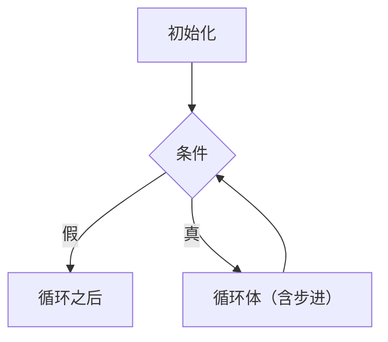
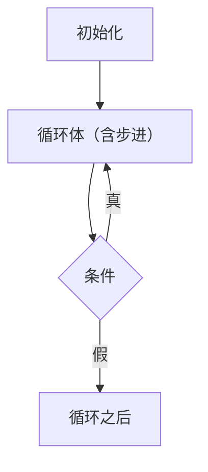

# 控制流语句

> **授权**：本章节属教材文档部分，采用 [CC BY-NC-ND 4.0](../LICENSE)
> 加[附加条款](../许可附加条款.md)授权：署名、非商业、禁止演绎、不允许二次分发。
> 文中引用的代码不受此限，各自保留原有许可证，详见[版权与许可说明.md](../版权与许可说明.md)。

**程序默认是自上而下一条条执行的。**
**控制流语句就是那几种「不按顺序走」的写法。**

**它们一共只有六种**——比多数人以为的少得多。

---

> **约定**：标注以灰色小字给出——`实测数据` 表示实际执行验证过，
> 完整数据与复现命令见附录 A；`文档` 表示引自标准或官方资料；
> `待确认` 表示尚未验证。路径占位符的含义见《README.md》。

## 本章节定位

| 需要先知道 | 在哪 |
|---|---|
| 表达式与运算符 | 《04-语法/03-表达式与运算符.md》 |
| 布尔值与真假 | 《04-语法/02-数据类型与类型系统.md》第 2.5 小节 |
| 初始化 | 《04-语法/04-初始化.md》 |

**相邻的章节**：`06-函数`（`return` 与调用）、
`10-作用域、生存期与链接`（循环里声明的变量活多久）。

---

# 第 1 节 只有六种语句

**C 与 C++ 的语句种类很少。**

| 种类 | 写法 |
|---|---|
| **表达式语句** | `a = 1;`、`f();`——**任何表达式加分号** |
| **复合语句** | `{ ... }`——也叫语句块 |
| **选择语句** | `if`、`switch` |
| **迭代语句** | `while`、`do-while`、`for` |
| **跳转语句** | `break`、`continue`、`return`、`goto` |
| **声明语句** | `int a;`（C++ 里声明也是语句） |

**注意第一行**：`a = 1;` 不是「赋值语句」，而是
**「一个表达式，后面加了个分号」**。

> [!IMPORTANT]
> **没有「赋值语句」「函数调用语句」这些类别。**
> 它们是表达式语句——`=` 和 `()` 都是运算符，整个东西是一个表达式。
> 这一点在《04-语法/03-表达式与运算符.md》第 1 节已经讲过。

**本章只讲后四种**（选择、迭代、跳转、复合）。
表达式语句归 `03`，声明语句归 `04` 与 `10`。

---

# 第 2 节 选择

## 2.1 `if`

`C`

```c
/* if_basic.c    编译：gcc -std=c23 if_basic.c -o if_basic */
#include <stdio.h>

int main(void) {
    int score = 72;

    if (score >= 90) {
        printf("优\n");
    } else if (score >= 60) {
        printf("及格\n");
    } else {
        printf("不及格\n");
    }
    return 0;
}
```

**输出**：`及格`

**`else` 与最近的 `if` 配对**，这一点在嵌套时容易看错：

`C`

```c
if (a)
    if (b)
        printf("ab\n");
else                    /* 这个 else 属于内层的 if (b) */
    printf("not b\n");
```

**想让它属于外层，就加大括号**：

`C`

```c
if (a) {
    if (b)
        printf("ab\n");
} else {
    printf("not a\n");
}
```

> [!TIP]
> **一律加大括号**，即使只有一条语句。
> 省下的是两行，换来的是「以后往里加一行不会出错」。

## 2.2 一个不警告就编过的错

**把 `==` 写成 `=`。**

`C`

```c
/* assign_cond.c    编译：gcc -std=c23 assign_cond.c -o assign_cond */
#include <stdio.h>

int main(void) {
    int a = 0;
    if (a = 1) {                        /* 本意大概是 a == 1 */
        printf("进入了分支，a=%d\n", a);
    }
    return 0;
}
```

**不开选项时编译完全通过，运行时输出 `进入了分支，a=1`。**

`实测数据`

| 编译选项 | 结果 |
|---|---|
| （无） | **通过，无任何提示** |
| `-Wall` | 警告：`suggest parentheses around assignment used as truth value` |
| `-Wall -Wextra` | 同上 |

> [!CAUTION]
> **`if (a = 1)` 在不加 `-Wall` 时不会报错也不会警告。**
> 它的效果是「把 1 赋给 a，然后判断 a 非零」——**条件永远为真**。
> 这类错误在代码评审时很难一眼看出，**必须靠编译选项兜住**。

**一种防御写法是把常量写在左边**：

`C`

```c
if (1 = a) { }      /* 编译失败：lvalue required as left operand of assignment */
```

**因为 `1` 不是左值，不能被赋值**，所以写错时编译器必然拦住。
报错原文：

`实测数据`
`Text`

```text
error: lvalue required as left operand of assignment
```

> [!TIP]
> **两种做法都行，但 `-Wall` 更直接。**
> 把常量写左边只能防住「常量与变量比较」这一种情形，
> 而 `-Wall` 能拦住全部赋值当条件的地方。

## 2.3 `switch`

`C`

```c
/* switch_basic.c    编译：gcc -std=c23 switch_basic.c -o switch_basic */
#include <stdio.h>

int main(void) {
    int cmd = 2;

    switch (cmd) {
        case 1:
            printf("开始\n");
            break;
        case 2:
            printf("停止\n");
            break;
        default:
            printf("未知命令\n");
            break;
    }
    return 0;
}
```

**输出**：`停止`

**`switch` 与 `if` 链的区别在于跳转方式**：
`switch` 通常被编译成一张跳转表，因此分支多时比 `if` 链快。
分支少时两者差不多。

### `case` 后面必须是常量

`C`

```c
int y = 2;
switch (x) {
    case y:             /* 不合法 */
        break;
}
```

`实测数据`
`Text`

```text
C23  : error: case label does not reduce to an integer constant
C++17: error: the value of 'y' is not usable in a constant expression
```

**原因**：`switch` 要生成跳转表，必须在**编译期**就知道所有分支的值。

### 贯穿（fallthrough）

**`case` 后面不写 `break`，会继续往下执行。**

`C`

```c
/* fallthrough.c    编译：gcc -std=c23 fallthrough.c -o fallthrough */
#include <stdio.h>

int main(void) {
    for (int i = 1; i <= 4; i++) {
        printf("i=%d -> ", i);
        switch (i) {
            case 1: printf("一 ");
            case 2: printf("二 ");      /* 没有 break，会继续往下走 */
            case 3: printf("三 "); break;
            case 4: printf("四 "); break;
            default: printf("其他 ");
        }
        printf("\n");
    }
    return 0;
}
```

`实测数据`
`Text`

```text
i=1 -> 一 二 三
i=2 -> 二 三
i=3 -> 三
i=4 -> 四
```

**`i=1` 时把三个分支都走了一遍**，因为 `case 1` 与 `case 2` 后面都没有 `break`。

> [!WARNING]
> **`-Wall` 不会警告贯穿，要 `-Wextra` 才会。**
> **只开 `-Wall` 的工程里，漏写 `break` 会静默通过。**

`实测数据`

| 编译选项 | 提示 |
|---|---|
| `-Wall` | **无任何提示** |
| `-Wall -Wextra` | `warning: this statement may fall through [-Wimplicit-fallthrough=]`，两处各一条 |
| `-Wimplicit-fallthrough` | 同上 |

**贯穿偶尔是有意为之**（比如多个值走同一段逻辑）：

`C`

```c
case 'a':
case 'e':
case 'i':
case 'o':
case 'u':
    printf("元音\n");
    break;
```

**空 `case` 不算贯穿**，编译器不会警告。**只有 `case` 后面跟了语句又没 `break` 才是。**

---

# 第 3 节 迭代

**循环解决的问题是「同一件事做很多遍」。**
**没有循环时，重复几遍就要写几遍代码；有了循环，重复的次数可以到运行期才知道。**

## 3.1 从「写五遍」到「写一遍」

`实测数据`
`C`

```c
/* manual.c    编译：gcc -std=c23 manual.c -o manual */
#include <stdio.h>

int main(void) {
    printf("第 1 次\n");
    printf("第 2 次\n");
    printf("第 3 次\n");
    printf("第 4 次\n");
    printf("第 5 次\n");
    return 0;
}
```

**同样的输出，用循环写是这样**：

`实测数据`
`C`

```c
/* looped.c    编译：gcc -std=c23 looped.c -o looped */
#include <stdio.h>

int main(void) {
    int n = 5;                      /* 次数放在变量里 */
    for (int i = 1; i <= n; i++) {
        printf("第 %d 次\n", i);
    }
    return 0;
}
```

**两份程序的输出一字不差，差别在次数从哪来**：
手写版的「五次」写死在源码里，要改成六次就得再加一行；
循环版的次数来自 `n`，而 `n` 可以是算出来的、读进来的。

> [!IMPORTANT]
> **循环的价值不是省几行字，而是让重复次数由数据决定。**

## 3.2 一个循环由三件事组成

**任何循环都离不开这三件事**：

| 组成 | 作用 | 什么时候做 |
|---|---|---|
| 初始化 | 给循环变量一个起点 | 进入循环之前，**只做一次** |
| 条件 | 决定还要不要再来一轮 | **每一轮开始前**判断 |
| 步进 | 让循环变量朝终点靠近 | **每一轮结束之后** |

**三种循环的区别，只是把这三件事放在了不同的位置**：

| 写法 | 初始化 | 条件 | 步进 |
|---|---|---|---|
| `while` | 循环之前 | `while (…)` 里 | **循环体里自己写** |
| `do-while` | 循环之前 | 末尾的 `while (…)` 里 | **循环体里自己写** |
| `for` | 头部的第一个槽位 | 头部的第二个槽位 | 头部的第三个槽位 |

> [!IMPORTANT]
> **动手写循环之前，先把「循环变量从哪开始、到哪结束、每轮怎么变」想清楚。**
> **忘记步进就是死循环**，步进方向写反同样是死循环。

## 3.3 `while`：先判断，后执行

`Mermaid`



**判断在最前面，因此条件一开始就不成立时，循环体一次也不执行。**

`实测数据`
`C`

```c
/* first_check.c    编译：gcc -std=c23 first_check.c -o first_check */
#include <stdio.h>

int main(void) {
    int n = 0;

    printf("while    : ");
    while (n > 0) { printf("执行了 "); n--; }   /* n 一开始就是 0 */
    printf("(结束)\n");

    n = 0;
    printf("do-while : ");
    do { printf("执行了 "); n--; } while (n > 0);
    printf("(结束)\n");
    return 0;
}
```

`Text`

```text
while    : (结束)
do-while : 执行了 (结束)
```

**`while` 那一行什么都没打印，`do-while` 打印了一次。**

**`while (1)` 是「一直转下去」的常见写法**，退出靠循环体里的 `break`，
见第 4.1 小节。

## 3.4 `do-while`：先执行，后判断

**把判断挪到末尾，循环体就至少执行一次。**

`Mermaid`



**上一小节的实测已经说明差别**：条件不成立时 `while` 是 0 次，`do-while` 是 1 次。

> [!TIP]
> **`do-while` 适合「至少要试一次」的场景**：
> 读一个输入直到它合法、重试一个操作直到成功。

**末尾那个分号容易漏，漏了编译器会报错**：

`实测数据`
`C`

```c
/* dowhile_semicolon.c    编译：gcc -std=c23 dowhile_semicolon.c -o dowhile_semicolon （失败）
 * gcc 报错：error: expected ';' before 'return'
 */
#include <stdio.h>

int main(void) {
    int i = 0;
    do {
        printf("%d ", i);
        i++;
    } while (i < 3)         /* 少了分号 */
    return 0;
}
```

## 3.5 `for`：三件事写在一行

**`for` 把初始化、条件、步进集中到头部**，一眼就能看出这个循环怎么走：

`C`

```c
for (初始化; 条件; 步进) {
    循环体
}
```

**它的执行顺序是固定的**，用下面这个程序可以直接看出来：

`实测数据`
`C`

```c
/* for_order.c    编译：gcc -std=c23 for_order.c -o for_order */
#include <stdio.h>

int init(void)  { printf("1 初始化（只做一次）\n"); return 0; }
int cond(int i) { printf("2 判断 i=%d\n", i); return i < 2; }
int step(int i) { printf("4 步进 i=%d\n", i); return i + 1; }

int main(void) {
    for (int i = init(); cond(i); i = step(i)) {
        printf("3 循环体 i=%d\n", i);
    }
    printf("5 循环结束\n");
    return 0;
}
```

`Text`

```text
1 初始化（只做一次）
2 判断 i=0
3 循环体 i=0
4 步进 i=0
2 判断 i=1
3 循环体 i=1
4 步进 i=1
2 判断 i=2
5 循环结束
```

**顺序是「初始化一次 → 判断 → 体 → 步进 → 判断 → 体 → 步进 ……」**，
直到某次判断不成立为止。**注意最后一轮只有判断，没有循环体。**

### 三个槽位都可以空着

**只有在两个分号不能省**：

`实测数据`
`C`

```c
/* for_omit.c    编译：gcc -std=c23 for_omit.c -o for_omit */
#include <stdio.h>

int main(void) {
    int i = 0;

    for (; i < 3; i++) printf("省略初始化 %d\n", i);       /* 初始化在外面 */
    printf("---\n");

    i = 0;
    for (; i < 3; ) { printf("省略步进 %d\n", i); i++; }   /* 步进在体里 */
    printf("---\n");

    i = 0;
    for (;;) {                                             /* 条件为空 = 恒真 */
        if (i >= 3) break;                                 /* 靠 break 退出 */
        printf("省略条件 %d\n", i);
        i++;
    }
    return 0;
}
```

**`for (;;)` 与 `while (1)` 是一回事**，都是「一直转」。

### `for` 与 `while` 编译后完全相同

**`for` 不是新机制，它只是把 `while` 的三件事挪到了头部。**

`实测数据`
`C`

```c
/* loop_equiv.c    编译：gcc -std=c23 -S loop_equiv.c -o loop_equiv.s */
int by_for(int n) {
    int s = 0;
    for (int i = 0; i < n; i++) s += i;
    return s;
}

int by_while(int n) {
    int s = 0;
    int i = 0;
    while (i < n) { s += i; i++; }
    return s;
}
```

**两个函数生成的指令序列逐条相同**，只有跳转标签的编号不同
（`.L2` / `.L3` 与 `.L6` / `.L7`）。

`实测数据`
`Assembly`

```asm
by_for:                          by_while:
    pushq   %rbp                     pushq   %rbp
    movq    %rsp, %rbp               movq    %rsp, %rbp
    subq    $16, %rsp                subq    $16, %rsp
    movl    %ecx, 16(%rbp)           movl    %ecx, 16(%rbp)
    movl    $0, -4(%rbp)             movl    $0, -4(%rbp)
    movl    $0, -8(%rbp)             movl    $0, -8(%rbp)
    jmp     .L2                      jmp     .L6
.L3:                             .L7:
    movl    -8(%rbp), %eax           movl    -8(%rbp), %eax
    addl    %eax, -4(%rbp)           addl    %eax, -4(%rbp)
    addl    $1, -8(%rbp)             addl    $1, -8(%rbp)
.L2:                             .L6:
    movl    -8(%rbp), %eax           movl    -8(%rbp), %eax
    cmpl    16(%rbp), %eax           cmpl    16(%rbp), %eax
    jl      .L3                      jl      .L7
```

> [!IMPORTANT]
> **`for` 与 `while` 没有性能差别。**
> 选哪个只看哪种写法更能说清意图——
> **循环次数已知、有明确的计数变量时用 `for`**，
> **循环条件是别的什么东西时用 `while`**。

## 3.6 三种循环可以互相改写

**改写规则**：

`Text`

```text
for (初始化; 条件; 步进) 体     等价于    初始化;  while (条件) { 体; 步进; }

do 体 while (条件);            等价于    体;  while (条件) 体;     （体至少执行一次）
```

**但有一处不能照抄：`continue`。**
在 `for` 里 `continue` 会跳到步进那一格，在 `while` 里它直接跳回条件。

`实测数据`
`C`

```c
/* continue_for.c    编译：gcc -std=c23 continue_for.c -o continue_for */
#include <stdio.h>

int main(void) {
    for (int i = 0; i < 5; i++) {
        if (i == 2) continue;           /* 跳过本轮，步进照做 */
        printf("%d ", i);
    }
    printf("\n");
    return 0;
}
```

`Text`

```text
0 1 3 4
```

**把同一个循环改写成 `while`，`continue` 就会跳过 `i++`**：

`实测数据`
`C`

```c
/* continue_while.c    编译：gcc -std=c23 continue_while.c -o continue_while */
#include <stdio.h>

int main(void) {
    int i = 0, guard = 0;
    while (i < 5 && guard++ < 10) {     /* guard 只是防止真的转不停 */
        if (i == 2) continue;           /* 直接跳回判断，i++ 被跳过 */
        printf("%d ", i);
        i++;
    }
    printf("\n循环转了多少轮：%d，最后 i = %d\n", guard, i);
    return 0;
}
```

`Text`

```text
0 1 
循环转了多少轮：11，最后 i = 2
```

**只输出了 `0 1`，然后一直卡在 `i = 2` 上转到计数上限。**
`i++` 写在 `continue` 后面，就永远轮不到它执行。

> [!CAUTION]
> **把 `for` 改写成 `while` 时，`continue` 之前必须自己完成步进。**
> 这类错误不会报错，只会让程序停不下来。

## 3.7 循环里声明变量：C89 与 C99 的分界

`C`

```c
for (int i = 0; i < 3; i++) printf("%d ", i);
```

`实测数据`

| 标准 | 结果 |
|---|---|
| `-std=c89` | **失败**：`'for' loop initial declarations are only allowed in C99 mode` |
| `-std=c99` | 通过 |
| `-std=c17` | 通过 |
| `-std=c23` | 通过 |

**在 `for` 里声明 `i` 是 C99 才有的**，C89 必须在外面先声明。

**C++ 从第一版就允许。**

> [!TIP]
> **本教材的基准是 C23，因此正文里可以直接在 `for` 里声明变量。**
> 但读老代码时要知道，C89 风格的写法长这样：
> ```c
> int i;
> for (i = 0; i < 3; i++) { }
> ```

**在 `for` 里声明的 `i` 只活在循环里**（它的作用域是循环本身），
完整规则见《04-语法/10-作用域、生存期与链接.md》第 3 节。

## 3.8 五个最容易写错的地方

| 症状 | 原因 |
|---|---|
| 程序停不下来 | **忘记步进**，或步进方向写反 |
| 循环体只执行了第一句 | **忘了加大括号** |
| 少一次或多一次 | **差一错误**：`<` 与 `<=` 用错 |
| 条件永远成立 | 把 `==` 写成了 `=` |
| 循环次数说不清 | **用浮点数当循环变量** |

**每一条都能用几行程序复现。**

### 一、忘记步进

`实测数据`
`C`

```c
/* forgot_step.c    编译：gcc -std=c23 forgot_step.c -o forgot_step */
#include <stdio.h>

int main(void) {
    int i = 0, guard = 0;
    while (i < 3 && guard++ < 6) {
        printf("i = %d\n", i);          /* 忘记写 i++：i 一直是 0 */
    }
    printf("转了 %d 轮，i 仍然是 %d\n", guard, i);
    return 0;
}
```

**六轮下来 `i` 一次都没变**，条件永远成立。

### 二、循环体忘了大括号

**`while` 后面只有一条语句属于循环体**，缩进再多也不算：

`实测数据`
`C`

```c
/* forgot_brace.c    编译：gcc -std=c23 forgot_brace.c -o forgot_brace */
#include <stdio.h>

int main(void) {
    int i = 0, guard = 0;
    while (i < 3 && guard++ < 6)
        printf("i = %d\n", i);          /* 只有这一句属于循环体 */
        i++;                            /* 这一句在循环外，永远轮不到 */
    printf("转了 %d 轮，i = %d\n", guard, i);
    return 0;
}
```

**`i++` 在循环结束之后才执行了一次。**
**写循环体时一律加大括号**，可以少掉一整类错误。

### 三、差一错误

`实测数据`
`C`

```c
/* off_by_one.c    编译：gcc -std=c23 off_by_one.c -o off_by_one */
#include <stdio.h>

int main(void) {
    int cnt = 0;
    for (int i = 0; i < 3; i++) cnt++;
    printf("i <  3 循环体执行 %d 次\n", cnt);

    cnt = 0;
    for (int i = 0; i <= 3; i++) cnt++;
    printf("i <= 3 循环体执行 %d 次\n", cnt);

    cnt = 0;
    for (int i = 1; i < 3; i++) cnt++;
    printf("i = 1 开始，i < 3 执行 %d 次\n", cnt);
    return 0;
}
```

`Text`

```text
i <  3 循环体执行 3 次
i <= 3 循环体执行 4 次
i = 1 开始，i < 3 执行 2 次
```

**从 0 开始数、用 `<` 比较，循环次数恰好等于右边界那个数**
（上面第一行的 `3`）。**换成 `<=` 就会多一次。**

> [!TIP]
> **遍历 0 到 n-1 用 `i < n`，这是最不容易出错的一种写法。**

### 四、条件里把 `==` 写成 `=`

`实测数据`
`C`

```c
/* while_assign.c    编译：gcc -std=c23 -Wall while_assign.c -o while_assign
 * gcc 输出：warning: suggest parentheses around assignment used as truth value [-Wparentheses]
 */
#include <stdio.h>

int main(void) {
    int n = 3;
    int guard = 0;
    while (n = 1) {                 /* 本意是 n == 1 */
        if (guard++ >= 3) break;    /* 免得真的转不停 */
        printf("进来了，n = %d\n", n);
    }
    printf("结束\n");
    return 0;
}
```

**赋值表达式永远为真**（赋进去的是 1），循环条件因此恒成立。
`-Wall` 会给 `-Wparentheses` 警告，见第 2.2 小节。

### 五、用浮点数当循环变量

`实测数据`
`C`

```c
/* float_step.c    编译：gcc -std=c23 float_step.c -o float_step */
#include <stdio.h>

int main(void) {
    int guard = 0;
    for (double d = 0.0; d != 1.0 && guard < 12; d += 0.1) {
        printf("d = %.17f\n", d);
        guard++;
    }
    printf("转了 %d 轮之后停下来\n", guard);
    return 0;
}
```

`Text`

```text
d = 0.00000000000000000
d = 0.10000000000000001
d = 0.20000000000000001
d = 0.30000000000000004
d = 0.40000000000000002
d = 0.50000000000000000
d = 0.59999999999999998
d = 0.69999999999999996
d = 0.79999999999999993
d = 0.89999999999999991
d = 0.99999999999999989
d = 1.09999999999999987
转了 12 轮之后停下来
```

**加十次 `0.1` 得不到精确的 `1.0`**，`d != 1.0` 于是永远成立。
浮点误差的来源见《04-语法/02-数据类型与类型系统.md》第 2.3 小节。

**无符号数倒着数也有同样的问题**：
`for (size_t i = n - 1; i >= 0; i--)` 里的 `i >= 0` 恒成立，
见《04-语法/02-数据类型与类型系统.md》第 5.4 小节。

## 3.9 嵌套循环：次数是相乘的

**循环里再放循环，内层会把外层的每一轮都走一遍。**

`实测数据`
`C`

```c
/* nested_count.c    编译：gcc -std=c23 nested_count.c -o nested_count */
#include <stdio.h>

int main(void) {
    int n = 0;
    for (int i = 0; i < 3; i++)
        for (int j = 0; j < 4; j++)
            n++;
    printf("外层 3 次、内层 4 次，一共 %d 次\n", n);
    return 0;
}
```

**输出是 `12`，即 3 × 4。** 外层的每一轮里，内层都要从头走完 4 次。

> [!WARNING]
> **`break` 与 `continue` 只作用于最近的一层循环**，
> 内层的 `break` 不会打断外层。要一次跳出多层，
> 见第 4.1 与 4.2 小节。

## 3.10 该用哪一种

> [!NOTE]
> **小结：三种循环的分工**
>
> | 情况 | 用哪个 |
> |---|---|
> | 次数已知，有明确的计数变量 | **`for`** |
> | 条件与计数无关（读到文件尾、指针不为空） | **`while`** |
> | 循环体至少要执行一次 | **`do-while`** |
> | 「一直转」直到某个条件成立 | `while (1)` 或 `for (;;)`，靠 `break` 退出 |
>
> **`for` 与 `while` 编译后完全相同**，选择只看哪种写法更贴近意图。

---

# 第 4 节 跳转

## 4.1 `break` 与 `continue` 只作用于最近的一层

`C`

```c
/* break_continue.c    编译：gcc -std=c23 break_continue.c -o break_continue */
#include <stdio.h>

int main(void) {
    printf("break 只跳出内层:\n");
    for (int i = 0; i < 3; i++) {
        for (int j = 0; j < 3; j++) {
            if (j == 1) break;              /* 跳出 j 这一层 */
            printf("(%d,%d) ", i, j);
        }
        printf("| ");
    }

    printf("\n\ncontinue 只跳过内层本轮:\n");
    for (int i = 0; i < 3; i++) {
        for (int j = 0; j < 3; j++) {
            if (j == 1) continue;           /* 跳过 j=1 这一轮 */
            printf("(%d,%d) ", i, j);
        }
        printf("| ");
    }
    printf("\n");
    return 0;
}
```

`实测数据`
`Text`

```text
break 只跳出内层:
(0,0) | (1,0) | (2,0) |

continue 只跳过内层本轮:
(0,0) (0,2) | (1,0) (1,2) | (2,0) (2,2) |
```

**`break` 之后外层的 `|` 照常打印**，说明外层循环没被打断。

> [!WARNING]
> **`break` 跳不出两层循环。**
> 想一次跳出多层，先把内层抽成函数用 `return`，或者用标志变量。
> **`goto` 也能做到，但那是最后的选择**，见第 4.2 小节。

**用标志变量的写法**：

`C`

```c
int found = 0;
for (int i = 0; i < 3 && !found; i++) {
    for (int j = 0; j < 3; j++) {
        if (条件) { found = 1; break; }
    }
}
```

**把条件写进外层循环的判断里**，就不需要额外的跳出机制。

## 4.2 `goto`

> [!CAUTION]
> **不要使用 `goto`，也不建议在新代码里用它。**
> **本节出现的目的只有一个：说清为什么不要用。**

**`goto` 是汇编里的「无条件跳转」在 C 里的对应物。**
**它在语言里存在，是因为机器上就有这条指令；它容易出问题，也因为这条指令不带任何条件。**

### 一、它对应一条机器指令

`文档`

> "A goto statement causes an unconditional jump to the statement prefixed by
> the named label in the enclosing function."
>
> —— N3220 §6.8.7.2

`文档`

> "The goto statement unconditionally transfers control to the statement labeled
> by the identifier. The identifier shall be a label located in the current
> function."
>
> —— N4659 §9.6.4

**汇编里的控制流只有两种走法**：条件跳转（`je`、`jl` 这类，先比较再决定跳不跳）
与无条件跳转（`jmp`）。**`if` 与三种循环编译出来都是「比较 + 条件跳转」，
只有 `goto` 是一条光秃秃的 `jmp`。**

`实测数据`
`C`

```c
/* goto_asm.c    编译：gcc -std=c23 -O0 -S goto_asm.c -o goto_asm.s
 * 完整文件见附录 A.11，这里先看最简单的那个函数。
 */
int skip(int x) {
    if (x) goto out;        /* 满足条件就跳走 */
    x = 1;
out:
    return x;
}
```

`实测数据`
`Assembly`

```asm
skip:
    pushq   %rbp                  /* 这两行是栈帧设置，与本小节无关 */
    movq    %rsp, %rbp
    movl    %ecx, 16(%rbp)
    cmpl    $0, 16(%rbp)          /* if 的判断 */
    jne     .L5                   /* 条件跳转：不相等才跳 */
    movl    $1, 16(%rbp)
    jmp     .L3                   /* goto 就是这一条：无条件跳转 */
.L5:
    nop
.L3:
    movl    16(%rbp), %eax
    popq    %rbp
    ret
```

**已略去 `.seh_*` 这类异常处理伪指令。**

**一条 `jne`，一条 `jmp`，正好对应源码里的 `if` 与 `goto`。**

**其余跳转语句都带着限制**：`break` 只能跳出一层循环或 `switch`，
`continue` 只能跳回循环头，`return` 只能离开整个函数。
**只有 `goto` 能在同一个函数里跳到任意位置**——这是它唯一不可替代的地方。

### 二、它跳不出这个函数

`文档`

> "A label name is the only kind of identifier that has function scope. It can
> be used (in a goto statement) anywhere in the function in which it appears,
> and is declared implicitly by its syntactic appearance."
>
> —— N3220 §6.2.1/3

`文档`

> "The scope of a label is the function in which it appears. Labels shall not be
> redeclared within a function."
>
> —— N4659 §9.1/1

**标签与 `goto` 必须在同一个函数里**，不能从这个函数跳到另一个函数里去。
这一条把 `goto` 的影响范围限制在一个函数之内——**但一个函数可以很长。**

### 三、两条限制

**第一条：可以跳进循环体。**

`C`

```c
/* goto_in.c    编译：gcc -std=c23 goto_in.c -o goto_in */
#include <stdio.h>

int main(void) {
    int i = 0;
    goto inside;
    for (i = 0; i < 3; i++) {
    inside:
        printf("%d ", i);
    }
    printf("\n");
    return 0;
}
```

**编译通过，输出 `0 1 2`。**

**这条合法但没有人这么写**——它让循环的进入点变得难以预测。

**第二条：不能跳过变长数组的声明。**

`C`

```c
int n = 3;
goto skip;
int vla[n];             /* 变长数组，C99 起 */
skip:
printf("到了\n");
```

`实测数据`
`Text`

```text
error: jump into scope of identifier with variably modified type
```

**原因**：`vla` 的大小要到运行期才知道，跳过它的声明会让栈指针错位。
**普通数组没有这个问题**（大小在编译期已知）。

### 四、代价：控制流不再与阅读顺序一致

**`goto done;` 这一行本身不说明任何事**：读的人必须找到 `done:` 才知道跳去了哪里，
而那个标签可能在几十行之外。**控制流一旦不能「从上往下读」，局部推理就失效了。**

**C++ 把这类问题写成了硬性规定**，因为跳过一段代码会连带跳过它的构造与析构：

`文档`

> "It is possible to transfer into a block, but not in a way that bypasses
> declarations with initialization. A program that jumps from a point where a
> variable with automatic storage duration is not in scope to a point where it
> is in scope is ill-formed unless the variable has scalar type, class type with
> a trivial default constructor and a trivial destructor ..."
>
> —— N4659 §9.7/3

`文档`

> "A goto or switch statement shall not be used to transfer control into a try
> block or into a handler."
>
> —— N4659 §18/3

**`constexpr` 函数体里也不许出现 `goto` 与标签**（N4659 §10.1.5），
见《04-语法/11-编译期能力.md》第 2 节。

**结构化编程把控制流限制成三种走法**：顺序、选择、循环。
按这三种走法组织的代码，顺着读下去就能看清全部走向；
`goto` 打破了这条限制，因此现代代码里它只出现在下面两处。

> [!IMPORTANT]
> **两份标准都没有「不要用 `goto`」这样的话。**
> C 标准在例子里的原话是「有时跳进一堆复杂语句的中间是方便的」，
> 而**下面这些理由来自工程实践，不是标准的规定**。

### 五、只在两处考虑它

**「一次跳出多层循环」有三种写法，可以把指令数摆在一起比一比**：

`实测数据`
`C`

```c
/* goto_asm.c    编译：gcc -std=c23 -O0 -S goto_asm.c -o goto_asm.s */
int goto_out(int n) {
    for (int i = 0; i < n; i++)
        for (int j = 0; j < n; j++)
            if (i * j == 42) goto done;     /* 一次跳出两层 */
done:
    return 1;
}

int flag_out(int n) {
    int found = 0;
    for (int i = 0; i < n && !found; i++)   /* 把条件写进外层判断 */
        for (int j = 0; j < n; j++)
            if (i * j == 42) { found = 1; break; }
    return found;
}

static int scan(int n) {                    /* 抽成函数，用 return 提前结束 */
    for (int i = 0; i < n; i++)
        for (int j = 0; j < n; j++)
            if (i * j == 42) return 1;
    return 0;
}

int func_out(int n) { return scan(n); }
```

`实测数据`

| 写法 | 循环那部分的指令数（`-O0`） |
|---|---|
| `goto_out`：`goto` 一次跳出两层 | 26 |
| `flag_out`：标志变量写进外层条件 | 29 |
| `scan`：抽成函数用 `return` | 26 |

**三者最多差 3 条指令，而且差别都落在循环之外。**
**性能上找不到用 `goto` 的理由**；反过来，避开 `goto` 也不会让代码变慢。

> [!TIP]
> **仅有的两处例外**：
> **一次跳出多层循环**，以及函数末尾的**集中清理**——
> 出错时 `goto cleanup;`，把释放资源的代码集中到一处，避免在每条出错路径上抄一遍。
> **除这两处之外，一律不要用**；即便用了，**也要在标签旁边写清它为什么存在**。

---

# 第 5 节 为什么语句这么少

**回到第 1 节那张表：只有六种语句。**

**这与多数语言不同**——不少语言把「赋值」「函数调用」
「打印」都算作独立的语句种类。

**C 与 C++ 的做法是：把这些都做成表达式，语句只负责控制走向。**

`Text`

```
   表达式   负责「算出什么值」
   语句     负责「接下来往哪走」
```

**这样分的好处是「表达式可以嵌进任何需要值的地方」**：

`C`

```c
int a = (b = 3, b + 1);         /* 逗号表达式嵌在初始化里 */
while ((c = getchar()) != EOF)  /* 赋值嵌在循环条件里 */
    putchar(c);
f(a > b ? a : b);               /* 条件表达式嵌在实参里 */
```

**换成「赋值是语句」的语言，上面三句都写不出来。**

> [!IMPORTANT]
> **语句少不是「简陋」，是分工的结果。**
> 一旦把运算都做成表达式，语句就只剩「控制往哪走」这一件事可做，
> 自然就少了。

**代价是有些写法看起来紧凑得过头**——
`while ((c = getchar()) != EOF)` 里同时做了赋值与比较。
**这正是 2.2 节那个 `if (a = 1)` 陷阱的来源**：同一个语法既允许写对也允许写错。

---

# 术语表

| 术语 | 英文 | 含义 |
|---|---|---|
| 表达式语句 | Expression statement | 一个表达式后加分号 |
| 复合语句 | Compound statement | `{ ... }`，也叫语句块 |
| 贯穿 | Fallthrough | `switch` 的 `case` 没写 `break` 而继续往下 |
| 跳转表 | Jump table | `switch` 常被编译成的地址表 |
| 最令人烦恼的解析 | Most vexing parse | 能当声明解释时，编译器优先当声明 |
| 变长数组 | VLA, Variable-length array | 大小在运行期才确定的数组，C99 起 |

---

# 附录 A 复现本章节实测

**环境**：`gcc` / `g++` 15.2.0（MinGW-w64），Windows x64。

## A.1 `if (a = 1)` 什么时候才警告

`C`

```c
/* assign_cond.c */
#include <stdio.h>
int main(void) {
    int a = 0;
    if (a = 1) { printf("进入了分支，a=%d\n", a); }
    return 0;
}
```

`Bash`

```bash
gcc -std=c23 assign_cond.c -o assign_cond        # 通过，无提示
gcc -std=c23 -Wall assign_cond.c -o assign_cond  # 警告
./assign_cond                                    # 进入了分支，a=1
```

## A.2 `switch` 贯穿的警告选项

`C`

```c
/* fallthrough.c */
#include <stdio.h>
int main(void) {
    int i = 1;
    switch (i) {
        case 1: printf("一 ");
        case 2: printf("二 "); break;
        default: break;
    }
    return 0;
}
```

`Bash`

```bash
gcc -std=c23 -Wall          -c fallthrough.c -o f.o   # 无警告
gcc -std=c23 -Wall -Wextra  -c fallthrough.c -o f.o   # 每个贯穿处一条警告
# warning: this statement may fall through [-Wimplicit-fallthrough=]
gcc -std=c23 -Wimplicit-fallthrough -c fallthrough.c -o f.o   # 同上
```

## A.3 `for` 与 `while` 的等价

`C`

```c
/* loop_equiv.c */
int by_for(int n) {
    int s = 0;
    for (int i = 0; i < n; i++) s += i;
    return s;
}
int by_while(int n) {
    int s = 0;
    int i = 0;
    while (i < n) { s += i; i++; }
    return s;
}
```

`Bash`

```bash
gcc -std=c23 -O0 -S loop_equiv.c -o loop_equiv.s
```

**打开 `loop_equiv.s` 对照两个函数体**：指令逐条相同，只有标签编号不同。

## A.4 `goto` 的两条限制

`C`

```c
/* goto_vla.c */
int main(void) {
    int n = 3;
    goto skip;
    int vla[n];
skip:
    return 0;
}
```

`Bash`

```bash
gcc -std=c23 -c goto_vla.c -o g.o
# 报错：jump into scope of identifier with variably modified type
```

## A.5 `case` 必须是常量

`C`

```c
/* case_var.c */
int main(void) {
    int x = 2, y = 2;
    switch (x) {
        case y: return 1;
        default: return 0;
    }
}
```

`Bash`

```bash
gcc -std=c23 -c case_var.c -o c.o      # case label does not reduce to an integer constant
g++ -std=c++17 -c case_var.c -o c.o    # the value of 'y' is not usable in a constant expression
```

## A.6 `for` 的执行顺序

`C`

```c
/* for_order.c */
#include <stdio.h>

int init(void)  { printf("1 初始化（只做一次）\n"); return 0; }
int cond(int i) { printf("2 判断 i=%d\n", i); return i < 2; }
int step(int i) { printf("4 步进 i=%d\n", i); return i + 1; }

int main(void) {
    for (int i = init(); cond(i); i = step(i)) {
        printf("3 循环体 i=%d\n", i);
    }
    printf("5 循环结束\n");
    return 0;
}
```

`Bash`

```bash
gcc -std=c23 for_order.c -o for_order && for_order
# 1 初始化（只做一次）
# 2 判断 i=0
# 3 循环体 i=0
# 4 步进 i=0
# 2 判断 i=1
# 3 循环体 i=1
# 4 步进 i=1
# 2 判断 i=2
# 5 循环结束
```

## A.7 三种循环的对照

`C`

```c
/* first_check.c */
#include <stdio.h>

int main(void) {
    int n = 0;
    printf("while    : ");
    while (n > 0) { printf("执行了 "); n--; }
    printf("(结束)\n");

    n = 0;
    printf("do-while : ");
    do { printf("执行了 "); n--; } while (n > 0);
    printf("(结束)\n");
    return 0;
}
```

`Bash`

```bash
gcc -std=c23 first_check.c -o first_check && first_check
# while    : (结束)
# do-while : 执行了 (结束)
```

**`for` 的三个槽位可以空着，两个分号不能省**：

`C`

```c
/* for_omit.c */
#include <stdio.h>

int main(void) {
    int i = 0;
    for (; i < 3; i++) printf("省略初始化 %d\n", i);
    i = 0;
    for (; i < 3; ) { printf("省略步进 %d\n", i); i++; }
    i = 0;
    for (;;) {
        if (i >= 3) break;
        printf("省略条件 %d\n", i);
        i++;
    }
    return 0;
}
```

`Bash`

```bash
gcc -std=c23 for_omit.c -o for_omit && for_omit
# 省略初始化 0 / 1 / 2
# 省略步进 0 / 1 / 2
# 省略条件 0 / 1 / 2
```

**`do-while` 末尾的分号漏了会怎样**：

`Bash`

```bash
gcc -std=c23 -c dowhile_semicolon.c -o dw.o
# error: expected ';' before 'return'
```

## A.8 `continue` 在 `for` 与 `while` 里

`C`

```c
/* continue_for.c */
#include <stdio.h>

int main(void) {
    for (int i = 0; i < 5; i++) {
        if (i == 2) continue;
        printf("%d ", i);
    }
    printf("\n");
    return 0;
}
```

`Bash`

```bash
gcc -std=c23 continue_for.c -o continue_for && continue_for
# 0 1 3 4
```

**同一个循环改成 `while`，`continue` 会跳过 `i++`**：

`C`

```c
/* continue_while.c */
#include <stdio.h>

int main(void) {
    int i = 0, guard = 0;
    while (i < 5 && guard++ < 10) {
        if (i == 2) continue;
        printf("%d ", i);
        i++;
    }
    printf("\n循环转了多少轮：%d，最后 i = %d\n", guard, i);
    return 0;
}
```

`Bash`

```bash
gcc -std=c23 continue_while.c -o continue_while && continue_while
# 0 1
# 循环转了多少轮：11，最后 i = 2
```

## A.9 循环的五个常见错误

`C`

```c
/* forgot_step.c */
int main(void) {
    int i = 0, guard = 0;
    while (i < 3 && guard++ < 6) {
        printf("i = %d\n", i);          /* 忘记 i++ */
    }
    printf("转了 %d 轮，i 仍然是 %d\n", guard, i);
    return 0;
}
```

`C`

```c
/* forgot_brace.c */
int main(void) {
    int i = 0, guard = 0;
    while (i < 3 && guard++ < 6)
        printf("i = %d\n", i);
        i++;                            /* 这一句在循环外 */
    printf("转了 %d 轮，i = %d\n", guard, i);
    return 0;
}
```

`C`

```c
/* off_by_one.c */
int main(void) {
    int cnt = 0;
    for (int i = 0; i < 3; i++) cnt++;
    printf("i <  3 执行 %d 次\n", cnt);
    cnt = 0;
    for (int i = 0; i <= 3; i++) cnt++;
    printf("i <= 3 执行 %d 次\n", cnt);
    return 0;
}
```

`C`

```c
/* float_step.c */
int main(void) {
    int guard = 0;
    for (double d = 0.0; d != 1.0 && guard < 12; d += 0.1) {
        printf("d = %.17f\n", d);
        guard++;
    }
    printf("转了 %d 轮之后停下来\n", guard);
    return 0;
}
```

`Bash`

```bash
gcc -std=c23 forgot_step.c  -o forgot_step  && forgot_step
# 六行 i = 0，然后：转了 7 轮，i 仍然是 0

gcc -std=c23 forgot_brace.c -o forgot_brace && forgot_brace
# 六行 i = 0，然后：转了 7 轮，i = 1

gcc -std=c23 off_by_one.c   -o off_by_one   && off_by_one
# i <  3 循环体执行 3 次
# i <= 3 循环体执行 4 次
# i = 1 开始，i < 3 执行 2 次

gcc -std=c23 float_step.c   -o float_step   && float_step
# d 从 0.00000000000000000 累加到 0.99999999999999989，再跳到 1.09999999999999987
# 转了 12 轮之后停下来
```

**条件里把 `==` 写成 `=`**（源码见第 3.8 小节）：

`Bash`

```bash
gcc -std=c23 -Wall while_assign.c -o while_assign
# warning: suggest parentheses around assignment used as truth value [-Wparentheses]
```

## A.10 嵌套循环的次数

`C`

```c
/* nested_count.c */
#include <stdio.h>

int main(void) {
    int n = 0;
    for (int i = 0; i < 3; i++)
        for (int j = 0; j < 4; j++)
            n++;
    printf("外层 3 次、内层 4 次，一共 %d 次\n", n);
    return 0;
}
```

`Bash`

```bash
gcc -std=c23 nested_count.c -o nested_count && nested_count
# 外层 3 次、内层 4 次，一共 12 次
```

## A.11 `goto` 与无条件跳转

`C`

```c
/* goto_asm.c */
int skip(int x) {
    if (x) goto out;        /* 满足条件就跳走 */
    x = 1;
out:
    return x;
}

int goto_out(int n) {
    for (int i = 0; i < n; i++)
        for (int j = 0; j < n; j++)
            if (i * j == 42) goto done;     /* 一次跳出两层 */
done:
    return 1;
}

int flag_out(int n) {
    int found = 0;
    for (int i = 0; i < n && !found; i++)   /* 把条件写进外层判断 */
        for (int j = 0; j < n; j++)
            if (i * j == 42) { found = 1; break; }
    return found;
}

static int scan(int n) {                    /* 抽成函数，用 return 提前结束 */
    for (int i = 0; i < n; i++)
        for (int j = 0; j < n; j++)
            if (i * j == 42) return 1;
    return 0;
}

int func_out(int n) { return scan(n); }

int loops(int n) {
    int s = 0;
    for (int i = 0; i < n; i++) s += i;     /* 普通循环，作对照 */
    return s;
}
```

`Bash`

```bash
gcc -std=c23 -O0 -S goto_asm.c -o goto_asm_O0.s
gcc -std=c23 -O2 -S goto_asm.c -o goto_asm_O2.s
```

**数一数每个函数里的指令与跳转**：

`实测数据`

| 函数（`-O0`） | 指令数 | 无条件跳转 `jmp` | 条件跳转 |
|---|---|---|---|
| `skip` | 11 | 1 | 1 |
| `goto_out` | 26 | 3 | 3 |
| `flag_out` | 29 | 3 | 4 |
| `scan` | 26 | 3 | 3 |
| `func_out` | 10 | 0 | 0 |
| `loops` | 17 | 1 | 1 |

`实测数据`

| 函数（`-O2`） | 指令数 | 无条件跳转 `jmp` | 条件跳转 |
|---|---|---|---|
| `skip` | 4 | 0 | 1 |
| `goto_out` | 2 | 0 | 0 |
| `flag_out` | 19 | 1 | 4 |
| `func_out` | 19 | 1 | 4 |
| `loops` | 18 | 0 | 4 |

**`-O2` 下 `goto_out` 只剩 2 条指令**：这个函数无论走哪条路都返回 `1`，
于是整个循环被折叠掉了。**这一处差别来自返回值，不是 `goto` 带来的。**
`scan` 在 `-O2` 下被内联进 `func_out`，因此不再单独出现。

---

# 附录 B 相关文档

| 文档 | 关系 |
|---|---|
| 《04-语法/03-表达式与运算符.md》第 1 节 | **前置**：一切皆表达式 |
| 《04-语法/02-数据类型与类型系统.md》 | **前置**：真假与类型 |
| 《04-语法/04-初始化.md》 | **前置**：变量的诞生 |
| 《04-语法/06-函数.md》第 4 节 | **后续**：`return` 与函数调用 |
| 《04-语法/10-作用域、生存期与链接.md》第 3 节 | **后续**：循环里声明的变量活多久 |
| 《03-构建工具链/05-优化等级.md》第 5 节 | 编译器怎样优化循环与分支 |
| 《01-编译器/00-语言的实现.md》第 3 节 | 未定义行为 |
