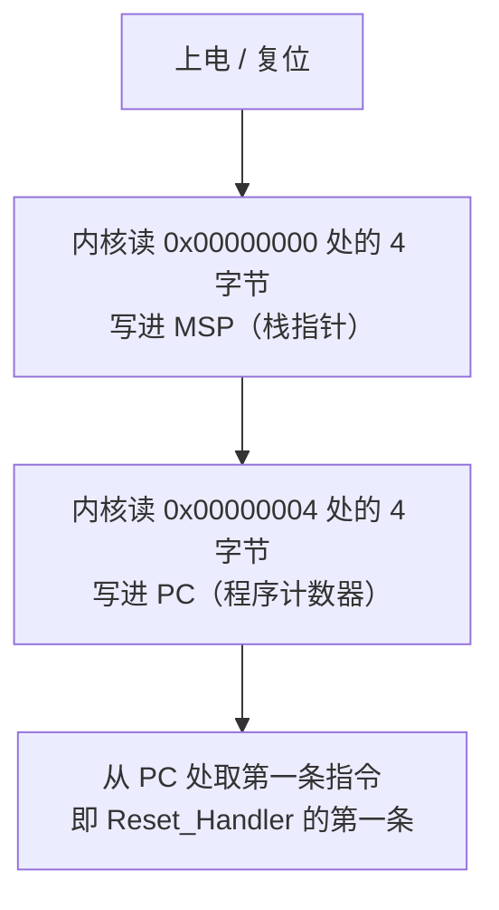
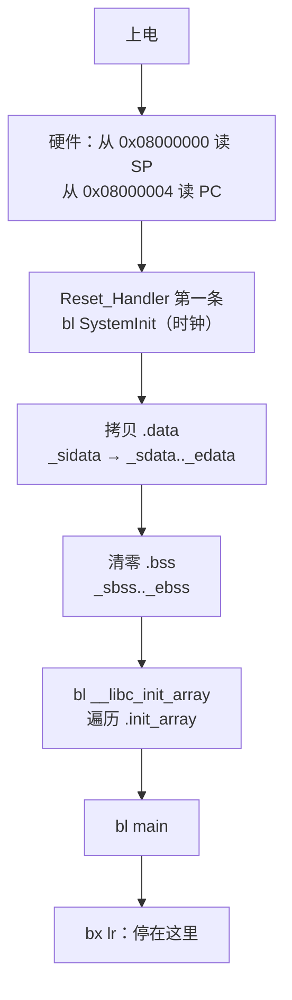

# 链接脚本与启动代码

> **授权**：本章节属教材文档部分，采用 [CC BY-NC-ND 4.0](../LICENSE)
> 加[附加条款](../许可附加条款.md)授权：署名、非商业、禁止演绎、不允许二次分发。
> 文中引用的代码不受此限，各自保留原有许可证，详见[版权与许可说明.md](../版权与许可说明.md)。

上一章讲的是符号怎么被链接器解析。这一章往下走一层：解析完之后，
**每个段被放到哪个物理地址上、上电那一瞬间 CPU 从哪里取第一条指令、
RAM 里那些「有初值的全局变量」是谁搬进去的**。这三件事都不由语言决定，
而由两个文件决定：一个链接脚本、一个启动文件。桌面程序里它们由工具链悄悄提供，
在单片机上必须摆在工程目录里，因此看得见、也改得动。

本章拿两份真实素材当主线：STM32CubeMX 生成的 `STM32F103XX_FLASH.ld`（249 行）
与 ST 官方启动文件 `startup_stm32f103xe.s`（470 行）。两份都原样引用，逐段、逐条讲。
讲完链接脚本的每一行，再讲 `Reset_Handler` 的每一条指令，最后在 QEMU 里真跑一遍，
拿段表、反汇编与运行输出当证据。**本章是全板块唯一逐条讲解汇编的地方**，
只用到 `ldr`、`str`、`bl`、`b`、`bx`、`adds`、`cmp`、`bcc` 这几条。

嵌入式读者读完之后应当能自己改链接脚本、看懂自己的启动文件；
写应用的读者至少能明白为什么 `.data` 会有两个地址、为什么
「全局变量初值不对」在单片机上是一个链接期的故事。

---

> **约定**：标注以行内代码单独成行——`实测数据` 表示实际执行验证过，紧跟它所说明的表格或代码块；
> `文档` 表示引自标准或官方资料，末尾给出草案章节号；`待确认` 表示尚未验证。
> 路径占位符（如 `<MinGW>`、`<工作区>`）的含义见《README.md》。

# 本章节定位

| 需要先知道 | 在哪 |
|---|---|
| 编译的四个阶段与段的概念 | 《01-编译器/01-编译与链接.md》第 2.5 小节 |
| 符号、`KEEP` 与弱符号 | 《06-更底层/06-符号与链接属性.md》第 4 节 |
| 内存映射 I/O 与 `volatile` | 《06-更底层/03-寄存器、位与 volatile.md》第 1 节 |
| CubeMX 工程目录里有什么、怎么烧录 | 《01-编译器/03-嵌入式与交叉编译.md》第 9 节 |
| `size` 与 `nm` 怎么用 | 《03-构建工具链/04-符号与调试信息.md》第 1.1 小节 |

**相邻的章节**：`06-符号与链接属性` 讲名字怎么被解析，本章讲解析完的段放在哪；
`08-CRT 与程序启动` 讲通用系统上 `main` 之前发生了什么，本章只讲裸机侧，
两者在 `__libc_init_array` 这一处接上。

| 节 | 讲什么 |
|---|---|
| **第 1 节** | 上电那一刻的三块地址空间；VMA 与 LMA 两套地址；本章的探针程序与测量方法 |
| **第 2 节** | `STM32F103XX_FLASH.ld` 逐段讲：`MEMORY`、`ENTRY`、`SECTIONS`、`AT>`、`KEEP`、`ALIGN`、堆栈预留、`/DISCARD/` |
| **第 3 节** | `Reset_Handler` 逐条讲：硬件取栈指针、拷 `.data`、清 `.bss`、`__libc_init_array`、进 `main` |
| **第 4 节** | 从复位到 `main` 的完整时间线，以及与通用 CRT 的分工 |
| **第 5 节** | 三个「写错了会怎样」：去掉 `KEEP`、`_sidata` 指错、`LENGTH` 不够；外加去掉 `AT>` 的后果 |
| **第 6 节** | 速查表 |

---

# 第 1 节 上电那一刻

**芯片上电时，flash 里的内容还在，SRAM 里的内容是随机的。**
这一句话决定了链接脚本与启动代码的全部工作：所有需要初值的可写数据，
初值必须存在 flash 里，运行时再由启动代码搬进 SRAM。

## 1.1 三块地址空间

STM32F103 的地址空间可以粗分成三块，链接脚本里的 `MEMORY` 只描述前两块，
第三块由头文件里的宏描述。

`Text`

```text
0xFFFFFFFF  ┌──────────────────────────┐
            │  内核私有外设（NVIC 等）  │  Cortex-M 内核自己的寄存器
0xE0000000  ├──────────────────────────┤
            │  外设寄存器区             │  GPIOA、USART2、TIM2 …
            │  （0x40000000 起）        │  由头文件的宏给出地址，链接脚本不管
0x40000000  ├──────────────────────────┤
            │                          │
            │  SRAM（48 KB）            │  可读写，掉电即失
            │  0x20000000 ~ 0x2000BFFF  │  栈、堆、.data、.bss 都在这里
0x20000000  ├──────────────────────────┤
            │                          │
            │  flash（256 KB）          │  只读，掉电保留
            │  0x08000000 ~ 0x0803FFFF  │  向量表、代码、常量、.data 的初值
0x08000000  ├──────────────────────────┤
            │  别名区（0x00000000）     │  上电时映射到 flash，向量表从这读
0x00000000  └──────────────────────────┘
```

**这张图里的两个数字来自链接脚本本身**：`STM32F103XX_FLASH.ld` 第 58 至 59 行写的是
`RAM` 从 `0x20000000` 起 48 KB、`FLASH` 从 `0x8000000` 起 256 KB。

**这两个数是这块芯片里最大的一档，不是所有 F103 都有。** 同一份脚本拿到
**STM32F103C8**（64 KB flash、20 KB SRAM）上照抄，`_estack` 会算出 `0x2000C000`，
比 RAM 的顶端高出 28 KB——第 5.5 小节就是这块真板上的现场。

**外设寄存器区不在链接脚本里。** 那些地址不是「某段内存」，
而是硬件功能单元的入口，因此用 `#define` 或结构体指针直接写死，
见《06-更底层/03-寄存器、位与 volatile.md》第 1 节。

## 1.2 两套地址：VMA 与 LMA

一个段可以有两个地址：

| 名字 | 全称 | 含义 |
|---|---|---|
| **VMA** | Virtual Memory Address | 运行期这个段在哪个地址上（代码按这个地址取数据） |
| **LMA** | Load Memory Address | 这个段的**内容**被放在哪个地址上（烧录时写到哪） |

只读的段两者相同，因为它运行期就在 flash 里。
**有初值的可写数据两者不同**：运行期它在 SRAM（VMA），内容是烧录时写进 flash 的（LMA）。

`实测数据`
`Bash`

```bash
arm-none-eabi-objdump -p probe.elf | sed -n '/Program Header/,/Section to Segment/p'
```

`实测数据`
`Text`

```text
Program Header:
    LOAD off    0x00001000 vaddr 0x08000000 paddr 0x08000000 align 2**12
         filesz 0x00000400 memsz 0x00000400 flags r-x
    LOAD off    0x00002000 vaddr 0x20000000 paddr 0x08000400 align 2**12
         filesz 0x00000010 memsz 0x00000014 flags rw-
    LOAD off    0x00000014 vaddr 0x20000014 paddr 0x08000410 align 2**12
         filesz 0x00000000 memsz 0x00000604 flags rw-
```

**第二个 `LOAD` 行就是本节的答案**：`vaddr 0x20000000` 而 `paddr 0x08000400`。
烧录工具按 `paddr` 把 16 字节初值写进 flash 的 `0x08000400`；
程序运行时按 `vaddr` 去 `0x20000000` 读这些变量。
把内容从 `paddr` 搬到 `vaddr` 的，就是第 3 节的 `Reset_Handler`。

> [!IMPORTANT]
> **`vaddr` 与 `paddr` 就是 VMA 与 LMA**，`objdump -h` 里的 `VMA` 与 `LMA` 两列是同一对东西。
> 桌面程序里两者通常相同（操作系统加载器会按 `paddr` 读文件、按 `vaddr` 映射内存），
> 因此这个概念在应用侧几乎不必想；到了单片机上，它是「初值对不对」的全部原因。

## 1.3 本章的探针程序

探针要证明三件事：向量表钉在 flash 起始、`.data` 有两个地址、`.bss` 被清零。
输出走 semihosting（`bkpt 0xAB` + `SYS_WRITE0`），QEMU 直接把它接到标准输出，
不依赖任何外设。头文件先给出，两个程序都要包含它。

`C`

```c
/* semihost.h   Cortex-M 侧的 semihosting 输出；在主机上退化为 stdout */
#ifndef SEMIHOST_H
#define SEMIHOST_H

#include <stdint.h>

#if defined(__arm__)
static void sh_puts(const char *s)
{
    __asm__ volatile ("mov r1, %0\n\t"
                      "movs r0, #4\n\t"    /* 0x04 = SYS_WRITE0 */
                      "bkpt 0xAB"
                      : : "r"(s) : "r0", "r1", "memory");
}
static void sh_hex32(uint32_t v)
{
    static const char digits[] = "0123456789abcdef";
    char out[9];
    for (int i = 0; i < 8; ++i) { out[i] = digits[(v >> (28 - 4 * i)) & 0xFu]; }
    out[8] = '\0';
    sh_puts("0x");
    sh_puts(out);
}
#else
#include <stdio.h>
static void sh_puts(const char *s) { fputs(s, stdout); }
static void sh_hex32(uint32_t v) { printf("0x%08x", v); }
#endif

#endif
```

`Bash`

```bash
# 用素材里的真链接脚本与真启动文件交叉编译
arm-none-eabi-gcc -mcpu=cortex-m3 -mthumb -nostartfiles --specs=nosys.specs \
  -T STM32F103XX_FLASH.ld startup_stm32f103xe.s boot.c -o probe.elf

# 在 QEMU 里真跑（-M netduinoplus2 与 STM32F103 的 flash/RAM 地址一致）
qemu-system-arm -M netduinoplus2 -kernel probe.elf -nographic \
  -semihosting-config enable=on,target=native
```

`C`

```c
/* boot.c   探针：证明 .data 被搬进 RAM、.bss 被清零
   主机上：gcc -std=c23 boot.c -o boot
   交叉编译与 QEMU 命令见上面那段 Bash */
#include "semihost.h"

void SystemInit(void) { }        /* 启动文件会调用它们，这里给空实现 */
void _init(void) { }

volatile uint32_t g_from_data = 0x1234ABCDu;   /* 初值在 flash，运行时应在 RAM */
volatile uint32_t g_arr[3]    = { 0x11111111u, 0x22222222u, 0x33333333u };
volatile uint32_t g_from_bss;                  /* 无初值，应在 .bss 里被清零 */

int main(void)
{
    sh_puts("g_from_data = "); sh_hex32(g_from_data); sh_puts("\r\n");
    sh_puts("g_arr[0..2] = "); sh_hex32(g_arr[0]); sh_puts(" ");
    sh_hex32(g_arr[1]); sh_puts(" "); sh_hex32(g_arr[2]); sh_puts("\r\n");
    sh_puts("g_from_bss  = "); sh_hex32(g_from_bss);  sh_puts("\r\n");
#if defined(__arm__)
    for (;;) { }                 /* 裸机上从 main 返回没有去处 */
#endif
    return 0;
}
```

`实测数据`
`Text`

```text
g_from_data = 0x1234abcd
g_arr[0..2] = 0x11111111 0x22222222 0x33333333
g_from_bss  = 0x00000000
```

**这三行就是本章要解释的全部现象。** 在主机上运行同一个程序也会打印同样的三行，
但主机上这三行是操作系统加载器做出来的，与启动代码无关；
**只有交叉编译后在 QEMU 里的这次运行，才能证明 `Reset_Handler` 真的把初值搬了过去。**

## 1.4 段表：先看清结果

`实测数据`
`Bash`

```bash
arm-none-eabi-objdump -h probe.elf
```

`实测数据`
`Text`

```text
Sections:
Idx Name          Size      VMA       LMA       File off  Algn
  0 .isr_vector   000001e4  08000000  08000000  00001000  2**0
  1 .text         000001cc  080001e4  080001e4  000011e4  2**2
  2 .rodata       00000050  080003b0  080003b0  000013b0  2**2
  3 .ARM.extab    00000000  08000400  08000400  00002010  2**0
  4 .ARM          00000000  08000400  08000400  00002010  2**0
  5 .preinit_array 00000000  08000400  08000400  00002010  2**0
  6 .init_array   00000000  08000400  08000400  00002010  2**0
  7 .fini_array   00000000  08000400  08000400  00002010  2**0
  8 .data         00000010  20000000  08000400  00002000  2**2
  9 .tdata        00000000  20000010  20000010  00002010  2**2
 10 .tbss         00000000  20000010  20000010  00000000  2**2
 11 .bss          00000004  20000010  08000410  00002010  2**2
 12 ._user_heap_stack 00000604  20000014  08000410  00002014  2**0
```

（上面是 `objdump -h` 输出的节选，省略了每个段下面的属性行，
以及 `.ARM.attributes`、`.comment`、`.debug_*` 这些与运行无关的段。）

四件事在表里已经能看出来：

- **`.isr_vector` 是第 0 个段，VMA 就是 `0x08000000`**，紧贴 flash 起始；
- **`.data` 的 VMA 是 `0x20000000`、LMA 是 `0x08000400`**，两套地址；
- **`.bss` 的 VMA 是 `0x20000010`，但它的 LMA 那一列没有意义**，
  因为它的属性里没有 `CONTENTS`（下面第 2 节讲 `NOLOAD`）；
- **`._user_heap_stack` 占了 `0x604` 字节，却不在任何加载段里**，它只是「预留」。

`.data` 里到底存了什么，可以直接看内容。

`实测数据`
`Bash`

```bash
arm-none-eabi-objdump -s -j .data probe.elf
```

`实测数据`
`Text`

```text
Contents of section .data:
 20000000 cdab3412 11111111 22222222 33333333  ..4.....""""3333
```

**`cdab3412` 是 `0x1234ABCD` 的小端存放**，后面三个 4 字节字是数组的三个初值。
段表里说它「在 `0x20000000`」，文件里这批字节的 LMA 却是 `0x08000400`：
烧录时它们进 flash，运行时它们应当出现在 SRAM 的 `0x20000000`。

## 1.5 真板上的同一件事

QEMU 里跑通只说明镜像格式对，还得在硅片上验一次。下面的数据来自一块
**STM32F103C8 最小系统板**加 CMSIS-DAP 调试器。

`实测数据`

| 项 | 值 |
|---|---|
| 内核 | Cortex-M3 r1p1（DPIDR `0x1ba01477`） |
| flash | 64 KiB（`0x08000000`） |
| RAM | 20 KiB（`0x20000000`），栈顶 `0x20005000` |
| 时钟 | `RCC_CFGR = 0x00000000` → HSI 8 MHz，**1 周期 = 125 ns** |

**板上只有 MCU 与晶振**，没有串口也没有发光二极管，因此这一节的所有观察都靠
调试器读内存；打印只能走 semihosting，由 OpenOCD 转发到主机控制台。

复位之后第一件事是读内存，看 `.data` 与 `.bss` 到底是什么值。

`实测数据`
`PowerShell`

```powershell
# 用 OpenOCD 烧写、复位、读回（路径一律用正斜杠，见下面的说明）
& "<OpenOCD>\bin\openocd.exe" -s "<OpenOCD>\share\openocd\scripts" `
  -f interface/cmsis-dap.cfg -f target/stm32f1x.cfg `
  -c "init" -c "reset halt" -c "arm semihosting enable" `
  -c "flash write_image erase <工作区>/probe_c8.elf" `
  -c "reset run" -c "sleep 2000" -c "halt" `
  -c "mdw 0x20000000 8" -c "shutdown"
```

`实测数据`

| 检查 | 结果 |
|---|---|
| `.data` 里的全局量（初值 `0x1234ABCD`） | 读出 **`0x1234ABCD`**，搬运成功 |
| `.bss` 里的全局量 | 读出 **`0`**，清零成功 |
| 复位向量第一个字（栈顶） | `0x20005000`，正是 RAM 顶端 |
| 复位向量第二个字（`Reset_Handler`） | `0x080002CD`，最低位为 1，Thumb 态 |
| 写入 1540 字节 | **0.20 s**（约 7.5 KiB/s） |
| 再 verify 1540 字节 | **0.09 s**（约 16.5 KiB/s） |

**第 3 节讲的拷贝循环与清零循环，在硅片上得到的就是前两行的结果。**
向量表的头两个字则说明第 3.1 小节的图没有例外：栈顶来自 `.word _estack`，
复位向量来自 `.word Reset_Handler`，两者的最低位规则也一样。

把整片 flash 擦干净再复位，能看到「没有向量表」是什么样子。

`实测数据`
`Text`

```text
0x08000000: ffffffff ffffffff ffffffff ffffffff     ← 全片擦净
复位后：pc = 0xfffffffe   sp = 0xfffffffc
```

**擦净之后读到的两个字都是 `0xFFFFFFFF`**，取出来当 `MSP` 与 `PC` 用，
得到的正是 `0xfffffffc` 与 `0xfffffffe`（最低位被硬件忽略）。
处理器转身就进 HardFault——这就是 2.4 小节那句「向量表必须占据 flash 第一个字节」的反面。

> [!WARNING]
> **OpenOCD 的 `-c` 参数按 Tcl 规则解析，反斜杠是转义符。**
> 把 Windows 路径写成 `C:\work\app.elf` 时，`\U`、`\b` 会被当成转义序列吃掉，
> 报出来的错与「文件不存在」一模一样。**路径里一律用正斜杠**，或者写成 `\\`。
> 这条与「调试器同一时刻只能被一个进程占用」一起，是这块板子上最容易浪费时间的两件事。

---

# 第 2 节 链接脚本逐段讲

`STM32F103XX_FLASH.ld` 共 249 行，其中 50 行是 ST 的版权与免责声明。
剩下的部分可以分成五块：入口点声明、`MEMORY`、几个全局符号、`SECTIONS`、`/DISCARD/`。

## 2.1 `ENTRY` 与 `MEMORY`

`Linker Script`

```ld
/* Entry Point */
ENTRY(Reset_Handler)

/* Specify the memory areas */
MEMORY
{
RAM (xrw)      : ORIGIN = 0x20000000, LENGTH = 48K
FLASH (rx)      : ORIGIN = 0x8000000, LENGTH = 256K
}
```

（上面是第 52 至 60 行的节选。）

**`ENTRY(Reset_Handler)` 只是把入口点写进 ELF 头的 `e_entry` 字段。**
Cortex-M 上电时并不看这个字段——它固定从地址 `0x00000004` 取复位向量，
见第 3 节。这个声明对调试器与部分烧录工具仍然有用。

**`MEMORY` 块是芯片的地址地图。** 两行各给了一个名字、一组权限、起始地址与长度。
`RAM (xrw)` 表示可执行、可读、可写；`FLASH (rx)` 表示可读可执行、不可写。
权限只在链接器内部用于检查段属性是否与区域匹配，不会写进任何硬件寄存器。

`LENGTH = 48K` 与 `256K` 是这块芯片的真实容量，换成别的型号必须改这两个数。
**写小了链接器会直接报错**，这是它最有价值的一处保护，第 5 节会看报错原文。

## 2.2 栈顶、堆栈预留这几个全局符号

`Linker Script`

```ld
/* Highest address of the user mode stack */
_estack = ORIGIN(RAM) + LENGTH(RAM);    /* end of RAM */
/* Generate a link error if heap and stack don't fit into RAM */
_Min_Heap_Size = 0x200;      /* required amount of heap  */
_Min_Stack_Size = 0x400; /* required amount of stack */
```

（上面是第 62 至 66 行的节选。）

`_estack` 不是段里的符号，而是一个**算出来的常量**：RAM 起始加 RAM 长度，
也就是 `0x20000000 + 0xC000 = 0x2000C000`。
它在符号表里的类型是 `A`（absolute）：

`实测数据`
`Text`

```text
2000c000 R _estack
```

**这个值会被向量表的第一个字引用**（第 3 节），而 Cortex-M 内核在复位时做的第一件事
就是把这个字读进 `MSP`。**栈是从 RAM 最高地址向下生长的**，这句话是它的全部含义。

`_Min_Heap_Size` 与 `_Min_Stack_Size` 只在后面那个 `._user_heap_stack` 段里用到，
它们不是真的分配内存，而是**要求链接器预留这么多空间**，
从而在「静态数据太多、把 RAM 挤爆」时给出链接错误。

## 2.3 `SECTIONS`：把输入段摆成输出段

`SECTIONS` 里的每一条都在做同一件事：**从所有输入文件里挑出一些段，
按顺序拼成一个输出段，并指定它放进哪个内存区域。**

语法上有三个要点：

| 写法 | 含义 |
|---|---|
| `*(.text)` | 所有输入文件（`*`）的 `.text` 段 |
| `*(.text*)` | 所有以 `.text` 开头的段，含 `.text.foo` 这类 |
| `>FLASH` / `>RAM` | 这个输出段的 VMA 放在哪个区域 |
| `AT> FLASH` | 这个输出段的 LMA 放在哪个区域 |
| `. = ALIGN(4);` | 把当前位置计数器（`.`）向上对齐到 4 字节 |

**`.` 是链接脚本里的位置计数器**，它表示「当前输出段的地址」。
`_sdata = .;` 这类写法就是在某个时刻把当前位置记进一个符号。

## 2.4 `.isr_vector` 为什么必须放在最前面

`Linker Script`

```ld
SECTIONS
{
  /* The startup code goes first into FLASH */
  .isr_vector :
  {
    . = ALIGN(4);
    KEEP(*(.isr_vector)) /* Startup code */
    . = ALIGN(4);
  } >FLASH
```

（上面是第 69 至 77 行的节选。）

**Cortex-M 的复位行为是硬连线的**：内核从地址 `0x00000004` 取 4 字节放进 `PC`，
从 `0x00000000` 取 4 字节放进 `MSP`。上电时 `0x00000000` 被映射到 flash 起始，
因此**向量表必须占据 flash 的第一个字节**，一条指令都不能排在它前面。

`KEEP` 的作用是阻止链接器回收这个段。它为什么非加不可，第 5 节有实测。

`. = ALIGN(4);` 两次出现，保证段首与段尾都是 4 字节对齐。
向量表的每一项是 4 字节的字，段首不对齐就会整体错位。

## 2.5 `.text` 与 `.rodata`

`Linker Script`

```ld
  /* The program code and other data goes into FLASH */
  .text :
  {
    . = ALIGN(4);
    *(.text)           /* .text sections (code) */
    *(.text*)          /* .text* sections (code) */
    *(.glue_7)         /* glue arm to thumb code */
    *(.glue_7t)        /* glue thumb to arm code */
    *(.eh_frame)

    KEEP (*(.init))
    KEEP (*(.fini))

    . = ALIGN(4);
    _etext = .;        /* define a global symbols at end of code */
  } >FLASH

  /* Constant data goes into FLASH */
  .rodata :
  {
    . = ALIGN(4);
    *(.rodata)         /* .rodata sections (constants, strings, etc.) */
    *(.rodata*)        /* .rodata* sections (constants, strings, etc.) */
    . = ALIGN(4);
  } >FLASH
```

（上面是第 79 至 103 行的节选。）

`glue_7` 与 `glue_7t` 是 ARM 与 Thumb 指令集互相跳转时的垫片代码，
现代工具链多数情况下已经不需要，但保留着不会有坏处。
`KEEP (*(.init))` 与 `KEEP (*(.fini))` 对应 GCC 的 `crti.o`、`crtn.o` 里的两个函数，
它们在 `__libc_init_array` 里被调用。

**`_etext` 记录了代码段的结束地址**，调试器与某些 bootloader 会用它判断镜像的有效范围。

## 2.6 `.data` 与那句 `AT> FLASH`

`Linker Script`

```ld
  /* used by the startup to initialize data */
  _sidata = LOADADDR(.data);

  /* Initialized data sections goes into RAM, load LMA copy after code */
  .data :
  {
    . = ALIGN(4);
    _sdata = .;        /* create a global symbol at data start */
    *(.data)           /* .data sections */
    *(.data*)          /* .data* sections */
    *(.RamFunc)        /* .RamFunc sections */
    *(.RamFunc*)
    . = ALIGN(4);
  } >RAM AT> FLASH
```

（上面是第 150 至 164 行的节选。）

三个符号加一个 `AT>`，构成整个链接脚本里最关键的一段：

| 符号 / 写法 | 值 | 含义 |
|---|---|---|
| `_sdata` | `0x20000000` | `.data` 在 RAM 里的起始地址（VMA） |
| `_edata` | `0x20000010` | `.data` 在 RAM 里的结束地址 |
| `_sidata` | `0x08000400` | `.data` 的初值在 flash 里的地址（LMA） |
| `>RAM AT> FLASH` | —— | VMA 放 RAM，LMA 放 flash |

**`LOADADDR(.data)` 就是 `.data` 的 LMA。**
`_sidata` 在符号表里的类型是 `A`（绝对值），它不是段的一部分，而是一个常量。

`AT>` 存在的原因只有一个：**可写数据必须有初值，而初值必须掉电保留。**
RAM 掉电即失，所以初值只能存在 flash 里；运行期变量又必须在 RAM 里，
所以同一个段得有两个地址。没有 `AT>`，LMA 就等于 VMA，
初值会被认为「本来就在 RAM 里」——第 5 节会看到这种写法编出来的镜像是什么样子。

`*(.RamFunc)` 是给那些必须搬到 RAM 里执行的函数准备的段
（在 RAM 里执行比 flash 快，某些芯片上写 flash 时也需要）。
它被放在 `.data` 里，因此会跟着 `.data` 一起被搬运，前提是链接脚本给了它 LMA。

## 2.7 `.bss` 与 `NOLOAD`

`Linker Script`

```ld
  .bss (NOLOAD) : ALIGN(4)
  {
    *(.bss)
    *(.bss*)
    *(COMMON)

      . = ALIGN(4);
    _ebss = .;         /* define a global symbol at bss end */
    __bss_end__ = _ebss;
      PROVIDE( __bss_end = .);
  } >RAM
```

（上面是第 212 至 222 行的节选。）

**`NOLOAD` 的语义是「这个段不占镜像空间」。** 无初值的变量不需要初值，
因此镜像里不为它们存任何字节；它们的地址仍然要在 RAM 里占出来，
所以 VMA 照旧是 RAM 里的地址。

`PROVIDE` 是一种宽容的定义：**只有当有人引用这个名字时才定义它**，
没人引用就不存在，从而避免与其他库里的同名符号冲突。
`PROVIDE_HIDDEN` 是它的加强版，连符号表都不导出。

`COMMON` 是历史遗留：早期 C 允许把未初始化的全局变量写成暂定定义
（同一个变量在多个文件里写 `int x;` 而不加 `extern`），
这些变量进 `COMMON` 段，由链接器合并。**C 里现在默认不再这么做**
（GCC 从 10 起默认 `-fno-common`），但链接脚本仍然为老代码与老库留着这一条。

## 2.8 堆与栈的预留

`Linker Script`

```ld
  /* User_heap_stack section, used to check that there is enough RAM left */
  ._user_heap_stack (NOLOAD) :
  {
    . = ALIGN(8);
    PROVIDE ( end = . );
    PROVIDE ( _end = . );
    . = . + _Min_Heap_Size;
    . = . + _Min_Stack_Size;
    . = ALIGN(8);
  } >RAM
```

（上面是第 228 至 237 行的节选。）

这一段不装任何数据，只用 `. = . + _Min_Heap_Size` 把位置计数器往前推。
效果是：**这段地址被「占用」了，别的段不会再放进来**，
于是 RAM 不够用时链接器会报溢出，而不是等到运行时栈把数据踩坏。

**栈的位置不在这一段里。** 真正的栈在 RAM 最高处、由 `_estack` 指定，向下生长；
这一段预留的 `_Min_Stack_Size` 只是给编译器一个「别把 RAM 用满」的保证。
现代的做法是让 `_estack` 直接取 RAM 末尾，再留出一段空隙（或者用双栈指针加 MPU 保护）。

`end` 与 `_end` 是给 `malloc` 用的堆起点，`A-教学素材/01-编译器/嵌入式/内存布局与中断/sysmem.c`
里的 `_sbrk` 就是从这里开始分配，见《06-更底层/01-对象在哪里：栈、堆与静态区.md》第 5 节。

## 2.9 构造与析构数组

`Linker Script`

```ld
  .preinit_array (READONLY) :
  {
    . = ALIGN(4);
    PROVIDE_HIDDEN (__preinit_array_start = .);
    KEEP (*(.preinit_array*))
    PROVIDE_HIDDEN (__preinit_array_end = .);
    . = ALIGN(4);
  } >FLASH

  .init_array (READONLY) :
  {
    . = ALIGN(4);
    PROVIDE_HIDDEN (__init_array_start = .);
    KEEP (*(SORT(.init_array.*)))
    KEEP (*(.init_array*))
    PROVIDE_HIDDEN (__init_array_end = .);
    . = ALIGN(4);
  } >FLASH
```

（上面是第 121 至 138 行的节选，`.fini_array` 与它同形。）

**这三个数组存的是函数指针**：`preinit` 最先、`init` 其次、`fini` 在退出时用。
C++ 的全局对象构造函数、C 的 `__attribute__((constructor))` 函数，
都会被编译器塞进 `.init_array`。`SORT` 让带优先级后缀的条目（`.init_array.00100`）按名字排序，
从而让 `init_priority` 这类扩展能控制相对顺序。

**`READONLY` 要求 GCC 11 及以上**，脚本注释里写明了这一点：GCC 10 及更早版本不认这个关键字，
去掉它即可。它的作用是告诉链接器这个段只读，从而让它在多个区域之间做出更好的选择。

这些数组的消费者是 `__libc_init_array`，见第 3.5 小节。

## 2.10 展开表：`.ARM.extab` 与 `.ARM`

`Linker Script`

```ld
  .ARM.extab (READONLY) :
  {
    . = ALIGN(4);
    *(.ARM.extab* .gnu.linkonce.armextab.*)
    . = ALIGN(4);
  } >FLASH

  .ARM (READONLY) :
  {
    . = ALIGN(4);
    __exidx_start = .;
    *(.ARM.exidx*)
    __exidx_end = .;
    . = ALIGN(4);
  } >FLASH
```

（上面是第 105 至 119 行的节选。）

**这两段是 C++ 异常的栈展开表**（也用于 `backtrace` 一类的调试功能）。
输入段名是 `.ARM.exidx`，输出段名被改成了 `.ARM`，两者不是同一个名字。
用《06-更底层/08-CRT 与程序启动.md》第 5.4 小节那份 `arm_exc.cpp` 编出的镜像里，
它们的实测大小是：

`实测数据`

| 段 | 大小 | 地址 |
|---|---|---|
| `.ARM.extab` | 224 字节（`0xe0`） | `0x080096e4` |
| `.ARM`（即 exidx） | 400 字节（`0x190`） | `0x080097c4` |

`__exidx_start` 与 `__exidx_end` 是展开器读这张表时的边界。
**异常在 Cortex-M 上的代价不止这两段**，链接器会把整套展开器拉进来，
实测数字与机制见《06-更底层/08-CRT 与程序启动.md》第 5 节。

## 2.11 `/DISCARD/`

`Linker Script`

```ld
  /* Remove information from the standard libraries */
  /DISCARD/ :
  {
    libc.a:* ( * )
    libm.a:* ( * )
    libgcc.a:* ( * )
  }
```

（上面是第 241 至 247 行的节选。）

`/DISCARD/` 里的段不会出现在输出文件里。这里丢掉的是标准库自带的那些段，
最常见的是 `.comment` 与 `.note.*`（版本注释），它们对运行没有影响，只是占空间。
**注意它不会丢掉库里的代码**：要丢代码得靠 `--gc-sections`，
而 `--gc-sections` 收走向量表是第 5 节的第一个错误。

## 2.12 五个符号的完整清单

| 符号 | 定义方式 | 谁使用 | 实测值 |
|---|---|---|---|
| `_estack` | 算出来的常量 | 向量表第 0 项，硬件读它当 `MSP` | `0x2000c000` |
| `_sidata` | `LOADADDR(.data)` | 启动文件的拷贝循环（源） | `0x08000400` |
| `_sdata` | `.data` 段内第一个符号 | 拷贝循环（目标起点） | `0x20000000` |
| `_edata` | `.data`/`.tdata` 段尾 | 拷贝循环（目标终点） | `0x20000010` |
| `_sbss` | `.tbss` 段内 | 清零循环（起点） | `0x20000010` |
| `_ebss` | `.bss` 段尾 | 清零循环（终点） | `0x20000014` |
| `end` / `_end` | `PROVIDE` | `sysmem.c` 里的堆起点 | `0x20000014` |

`实测数据`
`Bash`

```bash
arm-none-eabi-nm probe.elf | grep -E "_sidata|_sdata|_edata|_sbss|_ebss|_estack"
```

`实测数据`
`Text`

```text
20000014 B _ebss
20000010 D _edata
2000c000 R _estack
20000010 B _sbss
20000000 D _sdata
08000400 A _sidata
```

**六个名字里有五个是段的边界，只有 `_sidata` 是绝对值**，
因为它描述的是「初值在 flash 的哪里」，与任何段的地址无关。

---

# 第 3 节 `Reset_Handler` 逐条讲

`startup_stm32f103xe.s` 的 `Reset_Handler` 是第 60 至 104 行，
去掉注释与 `.size` 之类的指示后是 20 条指令。下面是原文（节选）。

`Assembly`

```asm
  .section .text.Reset_Handler
  .weak Reset_Handler
  .type Reset_Handler, %function
Reset_Handler:

/* Call the clock system initialization function.*/
    bl  SystemInit

/* Copy the data segment initializers from flash to SRAM */
  ldr r0, =_sdata
  ldr r1, =_edata
  ldr r2, =_sidata
  movs r3, #0
  b LoopCopyDataInit

CopyDataInit:
  ldr r4, [r2, r3]
  str r4, [r0, r3]
  adds r3, r3, #4

LoopCopyDataInit:
  adds r4, r0, r3
  cmp r4, r1
  bcc CopyDataInit
```

（上面是第 60 至 83 行的节选。）

## 3.1 在第一条指令之前：硬件做了什么

**`Reset_Handler` 不是从「设栈指针」开始的。** 栈指针在第一条指令执行之前就已经就位了，
这是内核的复位行为：

`Mermaid`



地址 `0x00000000` 处放的就是向量表的头两个字，而这两个字来自启动文件里的这一句
（第 133 至 134 行）与链接脚本的 `_estack`。

`Assembly`

```asm
g_pfnVectors:

  .word _estack
  .word Reset_Handler
  .word NMI_Handler
  .word HardFault_Handler
```

（上面是第 131 至 136 行的节选。）

**`.word` 的含义是「在这里放 4 字节的地址」**，不是指令。
`g_pfnVectors` 这个符号所指的位置就是向量表的起点。
这两个字在镜像里长这样：

`实测数据`
`Bash`

```bash
arm-none-eabi-objdump -s -j .isr_vector probe.elf | sed -n '5,9p'
```

`实测数据`
`Text`

```text
 8000000 00c00020 65030008 ad030008 ad030008  ... e...........
 8000010 ad030008 ad030008 ad030008 00000000  ................
 8000020 00000000 00000000 00000000 ad030008  ................
 8000030 ad030008 00000000 ad030008 ad030008  ................
```

按小端读出前四个字：

| 偏移 | 字节 | 值 | 对应启动文件里的哪一行 |
|---|---|---|---|
| `0x00` | `00c00020` | `0x2000c000` | `.word _estack` |
| `0x04` | `65030008` | `0x08000365` | `.word Reset_Handler`（地址 `0x08000364` 加 Thumb 位） |
| `0x08` | `ad030008` | `0x080003ad` | `.word NMI_Handler` |
| `0x0C` | `ad030008` | `0x080003ad` | `.word HardFault_Handler` |

**最低位是 1，表示目标地址处于 Thumb 状态。** Cortex-M 只支持 Thumb 指令集，
因此向量表里所有函数地址的最低位都是 1，硬件取 `PC` 时会把它忽略。

`NMI_Handler` 与 `HardFault_Handler` 都指向 `0x080003ac`，也就是 `Default_Handler`——
它们是《06-更底层/06-符号与链接属性.md》第 4 节讲过的弱别名，
符号表里这一批名字的地址完全相同：

`实测数据`
`Text`

```text
080003ac T Default_Handler
080003ac W BusFault_Handler
080003ac W HardFault_Handler
080003ac W NMI_Handler
080003ac W SVC_Handler
080003ac W SysTick_Handler
```

（上面是节选，启动文件里 200 多个中断名字都是这样。）

## 3.2 第 1 条：`bl SystemInit`

`Assembly`

```asm
    bl  SystemInit
```

**`bl` 是带返回的跳转**：把下一条指令的地址放进 `LR`（链接寄存器），然后跳到目标。
C 函数的调用与返回就是靠它和 `bx lr` 配对的。

**这一条在搬运之前**，位置很关键：`SystemInit` 跑的时候，
`.data` 还没有被搬进 RAM、`.bss` 还没有清零。
因此 `SystemInit` 里只能碰**不依赖初值**的东西：寄存器、无初值的局部变量、
以及那个「RAM 里本来就是 0」的假设。实现在 `system_stm32f1xx.c` 里，
它的工作是配置时钟树（PLL、总线分频），全程只写外设寄存器。

> [!WARNING]
> **在 `SystemInit` 里读一个有初值的全局变量，读到的是垃圾。**
> 这个错误的形状很隐蔽：变量在别处用得好好的，只在时钟初始化里读到错的值。
> 想把「搬运」提到最前面，就得改启动文件里这一条的位置——那是可以改的，
> 但要清楚自己在改什么。

## 3.3 第 2 至 10 条：把 `.data` 从 flash 搬到 RAM

`Assembly`

```asm
  ldr r0, =_sdata
  ldr r1, =_edata
  ldr r2, =_sidata
  movs r3, #0
  b LoopCopyDataInit

CopyDataInit:
  ldr r4, [r2, r3]
  str r4, [r0, r3]
  adds r3, r3, #4

LoopCopyDataInit:
  adds r4, r0, r3
  cmp r4, r1
  bcc CopyDataInit
```

这九条指令做的是「按 4 字节为单位，把 flash 里的一段搬到 RAM 里的一段」。

| 指令 | 含义 |
|---|---|
| `ldr r0, =_sdata` | 把 `.data` 的 RAM 起始地址装进 `r0`（目标指针） |
| `ldr r1, =_edata` | 把 `.data` 的 RAM 结束地址装进 `r1`（终点的界） |
| `ldr r2, =_sidata` | 把初值在 flash 里的地址装进 `r2`（源指针） |
| `movs r3, #0` | `r3` 清零，当偏移量用 |
| `b LoopCopyDataInit` | 先跳到循环条件处判断一次，避免空段时也搬 |
| `ldr r4, [r2, r3]` | 从 flash 读一个字：`r4 = *(r2 + r3)` |
| `str r4, [r0, r3]` | 写到 RAM：`*(r0 + r3) = r4` |
| `adds r3, r3, #4` | 偏移加 4 字节 |
| `adds r4, r0, r3` | 算出当前目标地址 `r4 = r0 + r3` |
| `cmp r4, r1` | 与结束地址比较 |
| `bcc CopyDataInit` | 若「无借位」（即 `r4` 小于 `r1`）则继续搬 |

**`ldr r0, =_sdata` 这种写法叫字面量池加载**：汇编器把地址放进附近的一块常量池，
再用 `ldr` 从池里读出来。反汇编里显示成 `ldr r0, [pc, #44]`，
后面跟着注释指出真实的池地址。

`bcc` 是「进位标志为 0 时跳转」。`cmp` 做的是减法，`r4 < r1` 时不产生借位，
因此 `bcc` 就是无符号小于。比较用的是**结束地址**而不是元素个数，
因此循环条件写作「当前地址还没到结束地址」。

`实测数据`
`Bash`

```bash
arm-none-eabi-objdump -d --disassemble=Reset_Handler probe.elf
```

`实测数据`
`Text`

```text
08000364 <Reset_Handler>:
 8000364:	f7ff ff86 	bl	8000274 <SystemInit>
 8000368:	480b      	ldr	r0, [pc, #44]	@ (8000398 <LoopFillZerobss+0xe>)
 800036a:	490c      	ldr	r1, [pc, #48]	@ (800039c <LoopFillZerobss+0x12>)
 800036c:	4a0c      	ldr	r2, [pc, #48]	@ (80003a0 <LoopFillZerobss+0x16>)
 800036e:	2300      	movs	r3, #0
 8000370:	e002      	b.n	8000378 <LoopCopyDataInit>

08000372 <CopyDataInit>:
 8000372:	58d4      	ldr	r4, [r2, r3]
 8000374:	50c4      	str	r4, [r0, r3]
 8000376:	3304      	adds	r3, #4

08000378 <LoopCopyDataInit>:
 8000378:	18c4      	adds	r4, r0, r3
 800037a:	428c      	cmp	r4, r1
 800037c:	d3f9      	bcc.n	8000372 <CopyDataInit>
 800037e:	4a09      	ldr	r2, [pc, #36]	@ (80003a4 <LoopFillZerobss+0x1a>)
 8000380:	4c09      	ldr	r4, [pc, #36]	@ (80003a8 <LoopFillZerobss+0x1e>)
 8000382:	2300      	movs	r3, #0
 8000384:	e001      	b.n	800038a <LoopFillZerobss>

08000386 <FillZerobss>:
 8000386:	6013      	str	r3, [r2, #0]
 8000388:	3204      	adds	r2, #4

0800038a <LoopFillZerobss>:
 800038a:	42a2      	cmp	r2, r4
 800038c:	d3fb      	bcc.n	8000386 <FillZerobss>
 800038e:	f7ff ffc1 	bl	8000314 <__libc_init_array>
 8000392:	f7ff ff7b 	bl	800028c <main>
 8000396:	4770      	bx	lr
```

**三个 `ldr` 的目标地址可以在常量池里核对**：反汇编把池的位置写在注释里，
`8000398` 等地址处的四个字节就是 `_sdata`、`_edata`、`_sidata` 的值。
段表里 `.data` 的 VMA 是 `0x20000000`、LMA 是 `0x08000400`，
与第 2.12 小节列的 `_sdata`、`_sidata` 完全对应。

## 3.4 第 11 至 16 条：把 `.bss` 清零

`Assembly`

```asm
/* Zero fill the bss segment. */
  ldr r2, =_sbss
  ldr r4, =_ebss
  movs r3, #0
  b LoopFillZerobss

FillZerobss:
  str  r3, [r2]
  adds r2, r2, #4

LoopFillZerobss:
  cmp r2, r4
  bcc FillZerobss
```

这一段比上一段简单：**没有源地址**。
它把 `.bss` 从 `_sbss` 到 `_ebss` 逐字写 0，因为 `.bss` 里的变量没有初值，
`.bss` 又不在镜像里（`NOLOAD`），所以只能靠代码清零。

注意这里用 `str r3, [r2]` 加 `adds r2, r2, #4` 而不是带偏移的寻址方式，
寄存器用法与上一段不同，效果一样。

**为什么必须有这一步**：C 与 C++ 都保证静态存储期的对象在程序开始执行前被零初始化
（`文档`：N3220 §6.2.4/3 与 N4659 §6.6.2 都写了零初始化的要求）。
在桌面上这件事由加载器完成，在单片机上只能由启动代码完成。

## 3.5 第 17 条：`bl __libc_init_array`

`Assembly`

```asm
/* Call static constructors */
    bl __libc_init_array
/* Call the application's entry point.*/
  bl main
  bx lr
```

**`__libc_init_array` 来自 C 标准库（newlib），它遍历链接脚本摆好的 `.init_array`，
把里面的函数指针逐个调用。** C++ 的全局对象构造函数就在这个数组里。

`C++`

```cpp
/* ctors.cpp   全局对象：构造函数由 __libc_init_array 调用
   主机上：g++ -std=c++17 ctors.cpp -o ctors
   交叉编译与 QEMU 命令见上一段 Bash */
#include "semihost.h"

extern "C" void SystemInit(void) { }   /* 启动文件按 C 名字找它 */
extern "C" void _init(void) { }

struct Greeter {
    Greeter() { sh_puts("global ctor ran (from .init_array)\r\n"); }
};
Greeter g_greeter;

int main(void)
{
    sh_puts("main reached\r\n");
#if defined(__arm__)
    for (;;) { }
#endif
    return 0;
}
```

`实测数据`
`Bash`

```bash
arm-none-eabi-g++ -mcpu=cortex-m3 -mthumb -nostartfiles --specs=nosys.specs -fno-exceptions -fno-rtti \
  -T STM32F103XX_FLASH.ld startup_stm32f103xe.s ctors.cpp -o ctors.elf
arm-none-eabi-objdump -s -j .init_array ctors.elf
arm-none-eabi-nm ctors.elf | grep -iE "init_array|_GLOBAL__sub_I"
qemu-system-arm -M netduinoplus2 -kernel ctors.elf -nographic \
  -semihosting-config enable=on,target=native
```

`实测数据`
`Text`

```text
--- .init_array 的内容
 80003c4 b1020008                             ....

--- 符号表
080002b0 t _GLOBAL__sub_I_SystemInit
080003c4 r __init_array_start
080003c8 r __init_array_end
20000000 B g_greeter

--- QEMU 输出
global ctor ran (from .init_array)
main reached
```

**`.init_array` 里那 4 个字节 `b1020008` 就是 `0x080002b1`**，
也就是 `_GLOBAL__sub_I_SystemInit` 的地址加 Thumb 位。
这个由编译器生成的小函数调用 `Greeter` 的构造函数，
而调用它的正是 `Reset_Handler` 里的 `bl __libc_init_array`。

> [!IMPORTANT]
> **`main` 之前发生了两件互不相关的事。**
> 一件是「把数据准备好」——拷贝 `.data`、清零 `.bss`，这是裸机特有的；
> 另一件是「把构造工作做完」——遍历 `.init_array`，这在任何平台上都有。
> 本章只讲前者，后者的完整版（入口点、CRT、析构、异常）见《06-更底层/08-CRT 与程序启动.md》。

`extern "C"` 那两处是必需的：启动文件按 C 名字调用 `SystemInit` 与 `_init`，
在 C++ 里不加 `extern "C"` 名字会被修饰，报 `undefined reference to 'SystemInit'`。
这个错的完整原文见《06-更底层/06-符号与链接属性.md》第 4.3 小节。

## 3.6 第 19 至 20 条：`bl main` 与 `bx lr`

`Assembly`

```asm
  bl main
  bx lr
```

`bl main` 把控制权交给应用代码。`main` 返回之后执行 `bx lr`，
而 `lr` 是 `bl main` 留下的返回地址——**也就是 `bx lr` 自己**，
于是程序在原地打转（或者更准确地说，跳回 `bx lr` 再执行一次，形成死循环）。

**裸机上没有「进程退出」这件事。** 想让程序「结束」，
要么进低功耗模式、要么触发复位、要么停在死循环里等看门狗。
这也是第 1.3 小节的探针程序里写 `for (;;) { }` 的原因：
在 QEMU 里从 `main` 返回会跳进这种无意义的循环，输出会变得难以判断。

## 3.7 完整时间线

`Mermaid`



**五步里有三步是「搬运」**：搬时钟配置、搬数据、清数据。
它们全都必须在 `main` 之前完成，而且顺序不能随意调换——
`__libc_init_array` 必须在 `.data` 搬完之后才能跑，
因为全局对象的构造函数可能读别的全局变量。

---

# 第 4 节 从复位到 `main`：与通用 CRT 的分工

把本章与第 8 章接起来看，同一个「`main` 之前」在两个世界里的分工是这样的：

| 步骤 | 裸机（本章） | 通用系统（第 8 章） |
|---|---|---|
| 设置栈指针 | **硬件**读向量表第 0 项 | 操作系统建好线程栈 |
| 建立可写数据 | `Reset_Handler` 拷贝 `.data`、清零 `.bss` | 加载器按 ELF/PE 的段信息映射 |
| 调用构造数组 | `__libc_init_array` | `__main`/`__do_global_ctors`（MinGW）、`_initterm`（MSVC） |
| 准备参数 | 无（`main` 通常无参） | `argc`/`argv`/`envp` 从系统取 |
| 进入 `main` | `bl main` | CRT 的入口点函数调用 |
| 结束 | 无退出概念 | `exit` → 析构、`atexit`、回收 |

**两侧都有 `.init_array`（或者说等价的构造表），这是唯一完全相同的部分。**
差别在于谁来读它、什么时候读。

`实测数据`

| 平台 | 构造表的读取者 | 符号（取自哪个程序） |
|---|---|---|
| Cortex-M（newlib） | `__libc_init_array` | `080002bc T __libc_init_array`（3.5 小节的 `ctors.elf`） |
| Windows + MinGW | `__main` → `__do_global_ctors` | `0000000140001580 T __main`（《06-更底层/06-符号与链接属性.md》第 1.1 小节的 `nm_marks.exe`） |
| Windows + MSVC | `_initterm` | 由 `__scrt_common_main` 调用，符号表里是导入桩 |

**符号的地址随程序而变，函数名不变。** 同一个 `__libc_init_array`，
在本章那个探针 `probe.elf` 里是 `08000314`——正是 3.3 小节反汇编里
`bl 8000314 <__libc_init_array>` 的那一条；换成 3.5 小节的 `ctors.elf` 就变成 `080002bc`。
读反汇编时按符号名对照，不要按地址背。

---

# 第 5 节 写错了会怎样

四个真实错误，每一个都从改一行开始。

## 5.1 去掉 `KEEP`：链接器把向量表当垃圾回收

`KEEP(*(.isr_vector))` 去掉之后，向量表段就没有任何东西引用它了。
只要打开 `--gc-sections`，链接器会认为它是死代码。

`Bash`

```bash
sed 's/KEEP(\*(.isr_vector)) /*(.isr_vector) /' STM32F103XX_FLASH.ld > no_keep.ld
arm-none-eabi-gcc -mcpu=cortex-m3 -mthumb -nostartfiles --specs=nosys.specs \
  -ffunction-sections -fdata-sections -Wl,--gc-sections \
  -T no_keep.ld startup_stm32f103xe.s boot.c -o no_keep.elf
```

`实测数据`
`Text`

```text
--- 段表（节选）
  0 .isr_vector   00000000  08000000  08000000  00002010  2**0
  1 .text         000001b4  08000000  08000000  00001000  2**2

--- 运行
qemu: fatal: Lockup: can't escalate 3 to HardFault (current priority -1)

R00=00000000 R01=00000000 R02=00000000 R03=00000000
R12=00000000 R13=4b0fb550 R14=fffffff9 R15=2400d006
```

**`.isr_vector` 的大小变成 0，`.text` 顶到了 `0x08000000`。**
于是内核从 `0x08000000` 读到的「栈顶」是某条指令的机器码，
从 `0x08000004` 读到的「复位向量」也是机器码，`PC` 跳到一个不存在的地址。
寄存器转储里 `R13`（`MSP`）是 `4b0fb550`，`R15`（`PC`）是 `2400d006`，
两个都是垃圾值——**这就是「芯片不启动」的样子**。

**链接期一句警告都没有**，镜像也照样生成。这类错误只能靠检查段表或现场调试发现。

## 5.2 `_sidata` 指错：初值没被搬进 RAM

`AT> FLASH` 的语义全部体现在 `_sidata = LOADADDR(.data)` 这一句上。
把它改成 `ORIGIN(RAM)`（一种很自然的误解：「初值就在 RAM 里」），
链接器不会报错，段表看起来也完全正常。

`Bash`

```bash
sed 's/  _sidata = LOADADDR(.data);/  _sidata = ORIGIN(RAM);/' STM32F103XX_FLASH.ld > bad_sidata.ld
arm-none-eabi-gcc -mcpu=cortex-m3 -mthumb -nostartfiles --specs=nosys.specs \
  -T bad_sidata.ld startup_stm32f103xe.s boot.c -o bad_sidata.elf
```

`实测数据`
`Text`

```text
--- 段表照旧正常
  8 .data         00000010  20000000  08000400  00002000  2**2

--- 符号
20000000 R _sidata          ← 变成 RAM 地址了
20000010 D _edata
20000000 D _sdata

--- QEMU 输出
g_from_data = 0x00000000
g_arr[0..2] = 0x00000000 0x00000000 0x00000000
g_from_bss  = 0x00000000
```

**拷贝循环变成了「RAM 到 RAM」**，RAM 里本来就是 0（QEMU 的 SRAM 上电为 0），
于是所有有初值的全局变量都读成 0。**没有报错、没有警告、没有崩溃**，
只有功能不对。这是三组错误里最难查的一个。

> [!CAUTION]
> **段表正常不代表数据搬运正确。**
> `.data` 的 VMA 与 LMA 都对，出错的只是那个描述源地址的符号。
> 排查办法是把 `_sidata` 的取值与 `objdump -h` 里 `.data` 的 LMA 对一遍，
> 两者的值必须相同。

## 5.3 `LENGTH` 写小：链接期就报错

这一类错误反而是最容易发现的，因为链接器会直接把话说清楚。

`Bash`

```bash
# RAM 从 48K 改成 1K
sed 's/LENGTH = 48K/LENGTH = 1K/' STM32F103XX_FLASH.ld > small_ram.ld
arm-none-eabi-gcc -mcpu=cortex-m3 -mthumb -nostartfiles --specs=nosys.specs \
  -T small_ram.ld startup_stm32f103xe.s boot.c -o small_ram.elf
```

`实测数据`
`Text`

```text
ld: small_ram.elf section `._user_heap_stack' will not fit in region `RAM'
ld: region `RAM' overflowed by 536 bytes
collect2: error: ld returned 1 exit status
```

把 FLASH 从 256K 改成 1K，报错换成了另一个段：

`实测数据`
`Text`

```text
ld: small_flash.elf section `.data' will not fit in region `FLASH'
ld: region `FLASH' overflowed by 16 bytes
collect2: error: ld returned 1 exit status
```

**报错里给出的两个信息足够定位**：装不下的是哪个输出段、超出多少字节。
`RAM` 那条先报 `._user_heap_stack`，是因为堆栈预留那一段把剩下的空间吃掉了，
这正是它存在的意义——把「RAM 会不会被用满」变成一个链接期问题。

## 5.4 去掉 `AT>`：`.bin` 从 1 KB 变成 384 MB

`} >RAM AT> FLASH` 去掉 `AT>` 之后，`.data` 的 LMA 等于 VMA，两套地址合一。

`实测数据`
`Bash`

```bash
sed '0,/} >RAM AT> FLASH/s//} >RAM/' STM32F103XX_FLASH.ld > no_at.ld
arm-none-eabi-gcc -mcpu=cortex-m3 -mthumb -nostartfiles --specs=nosys.specs \
  -T no_at.ld startup_stm32f103xe.s boot.c -o no_at.elf
arm-none-eabi-objcopy -O binary probe.elf  probe.bin
arm-none-eabi-objcopy -O binary no_at.elf no_at.bin
ls -l probe.bin no_at.bin
```

`实测数据`
`Text`

```text
--- .data 的两个地址变成同一个
  8 .data         00000010  20000000  20000000  00002000  2**2
20000000 A _sidata

--- 烧录镜像的大小
    1040 probe.bin
402653200 no_at.bin
```

**1,040 字节变成 402,653,200 字节**：烧录镜像按 LMA 排列，
而 `.data` 的 LMA 现在在 `0x20000000`，镜像必须从 flash 起始一路填充到那里，
中间 384 MB 全是空洞。真实的烧录工具会直接拒绝这样的文件。

有意思的是**用 ELF 直接跑看不出问题**：

`实测数据`
`Text`

```text
qemu-system-arm -M netduinoplus2 -kernel no_at.elf …
g_from_data = 0x1234abcd
g_arr[0..2] = 0x11111111 0x22222222 0x33333333
```

QEMU 读的是 ELF 的程序头，会把 `vaddr = 0x20000000` 那一段的初值直接写进内存，
等于替启动代码把「搬运」做了。**换成真板子（只烧 `.bin` 或 `.hex`）就没有这层保护**，
`g_from_data` 会读出 0。这一点属于工具链与烧录方式带来的差异。

`待确认`

> 去掉 `AT>` 的镜像烧进真板后初值是否一定丢失，取决于烧录工具怎么处理 LMA 与空洞
> （有的工具会拒绝 384 MB 的 `.bin`，有的会自行截断）。本机只在 QEMU 上验过 ELF 与
> `.bin` 两条路径，真板上的表现未测。

## 5.5 真板：`LENGTH` 照抄错，复位后立刻 HardFault

前面四组都在 QEMU 里。这一组在真板上，而且是**最不容易怀疑到自己头上**的一种错。

`STM32F103XX_FLASH.ld` 是给 **F103xC**（48 KB RAM、256 KB flash）写的。
把它原样拿到 **F103C8**（20 KB RAM、64 KB flash）上编译，链接器**一句话都不说**：

`实测数据`
`Bash`

```bash
# 素材脚本与 C8 脚本只差两个数
grep -n "LENGTH" STM32F103C8_FLASH.ld
arm-none-eabi-gcc -mcpu=cortex-m3 -mthumb -nostartfiles --specs=nosys.specs \
  -T STM32F103XX_FLASH.ld startup_stm32f103xe.s boot.c -o probe_xc.elf
arm-none-eabi-nm probe_xc.elf | grep _estack
```

`实测数据`
`Text`

```text
2:RAM    (xrw)    : ORIGIN = 0x20000000,   LENGTH = 20K
3:FLASH (rx)      : ORIGIN = 0x8000000, LENGTH = 64K

2000c000 R _estack
```

**`_estack` 算出来是 `0x2000C000`，比这块芯片 RAM 的顶端 `0x20005000` 高出 28 KB。**
链接器不报错是因为它只按脚本里写的 `LENGTH = 48K` 检查，而 48 KB 确实装得下这个程序。

烧进真板之后的表现：

`实测数据`

| 项 | 用错脚本（RAM 48K） | 把 `LENGTH` 改成 20K |
|---|---|---|
| `_estack` | `0x2000C000`，超出真实 RAM | `0x20005000` |
| 复位后现场 | `current mode: Handler HardFault`，`pc = 0x08000314` | 正常进 `main` |
| 结果 | 第一次压栈就越界，连 `main` 都进不去 | `.data` / `.bss` 检查全部通过 |

**这不是「结果不对」，而是「根本跑不起来」。** `MSP` 指向芯片上不存在的一段地址，
于是从复位到第一次压栈之间的那几步——`Reset_Handler` 里的拷贝循环只用寄存器，
第一步真正用栈的动作可能是被调用函数的寄存器保存，也可能是任何一次异常进入
（异常进入时硬件自己就要往栈上压 8 个字）——只要有一次写栈，总线就报错；
处理器转进 HardFault，而 HardFault 的进入同样要压栈，于是在故障里循环。
调试器里能看到模式位显示 `Handler HardFault`。

> [!CAUTION]
> **链接脚本里的 `LENGTH` 是「这块芯片有多少」，不是「这个程序要多少」。**
> 写大了它不会报错，只会把栈指针放到不存在的内存上；写小了对不对，链接器才会报
> 5.3 小节那种溢出。换型号时必须改这两个数，而且**只有真板能证明它是对的**——
> QEMU 的 `netduinoplus2` 有 128 KiB RAM，`_estack = 0x2000C000` 落在它的内存里，
> 什么问题都看不出来。

## 5.6 五种症状对照

| 改动 | 链接期表现 | 运行期表现 | 怎么发现 |
|---|---|---|---|
| 去掉 `KEEP` + `--gc-sections` | 无警告，`.isr_vector` 大小为 0 | 芯片 Lockup，`MSP`/`PC` 是垃圾 | `objdump -h` 看第一个段 |
| `_sidata` 指错 | 无警告，段表正常 | 有初值的全局变量全读成 0 | 核对 `_sidata` 与 `.data` 的 LMA |
| `LENGTH` 写小 | `region 'X' overflowed by N bytes` | 程序生不出来 | 报错直接给出段名与字节数 |
| 去掉 `AT>` | 无警告，`_sidata` 变成 RAM 地址 | ELF 直跑正常、烧 `.bin` 后初值丢失 | 看 `.bin` 大小、看 LMA 列 |
| **`LENGTH` 写大（换型号没改）** | **无警告，一切正常** | **真板复位即 HardFault，连 `main` 都进不去** | 拿 `nm` 的 `_estack` 与芯片手册的 RAM 顶端对一遍 |

---

# 第 6 节 速查表

| 常用件 | 一句话用途 | 典型坑 |
|---|---|---|
| `MEMORY` | 声明芯片的 flash/RAM 起始与长度 | 改型号必须改 `LENGTH`，写小了直接报溢出 |
| `ENTRY(Reset_Handler)` | 写进 ELF 头的入口点 | Cortex-M 上电不看它，它从 `0x00000004` 取向量 |
| `SECTIONS` | 把输入段拼成输出段并指定区域 | 段名写错时输入段变成孤儿段，被放到别处 |
| `>RAM` | 指定 VMA | 只写它不写 `AT>`，可写数据的初值就没有落点 |
| `AT> FLASH` | 指定 LMA，与 VMA 分离 | 去掉它会让烧录镜像膨胀到整块地址空间 |
| `LOADADDR(.data)` | 取 `.data` 的 LMA | 用它给 `_sidata` 赋值，写错就是静默全 0 |
| `KEEP(...)` | 阻止 `--gc-sections` 回收 | 向量表、构造数组都必须 `KEEP` |
| `. = ALIGN(4);` | 位置计数器对齐 | 向量表段首不对齐会整体错位 |
| `NOLOAD` | 该段不占镜像空间 | `.bss` 靠它省下镜像体积，代价是必须手动清零 |
| `PROVIDE` | 没人引用就不定义 | 与库里同名符号冲突时的宽容写法 |
| `_estack` | RAM 末尾，栈顶 | 它是常量不是段，硬件从向量表第 0 项读它 |
| `_sidata` / `_sdata` / `_edata` | 拷贝循环的三个边界 | 三者必须与 `objdump -h` 里的地址一致 |
| `_sbss` / `_ebss` | 清零循环的两个边界 | `.bss` 不清零，全局变量就是随机值 |
| `__libc_init_array` | 遍历 `.init_array` 调用构造函数 | 必须在搬完 `.data` 之后调用 |
| `Reset_Handler` | 复位后的第一条指令所在 | 它前面的「设栈指针」是硬件做的，不在这段代码里 |
| `--gc-sections` | 回收没引用的段 | 与 `KEEP` 配合，否则向量表会被收走 |
| `objdump -h` 的 `VMA`/`LMA` 两列 | 判断段的两个地址 | 只看一列会把「初值在哪」搞错 |
| `objcopy -O binary` | 生成烧录用镜像 | 镜像按 LMA 排列，LMA 越界会得到超大文件 |

**配套件**：可运行的裸机最小工程见
[B-examples/06-lower-level/03-bare-metal-boot/](../B-examples/06-lower-level/03-bare-metal-boot/)，
「能链接但跑不起来」的链接脚本练习见
[C-templates/06-lower-level/03-linker-script-lab/](../C-templates/06-lower-level/03-linker-script-lab/)。
符号与弱符号的内容在《06-更底层/06-符号与链接属性.md》，
`main` 之前在通用系统上的那一半在《06-更底层/08-CRT 与程序启动.md》。
