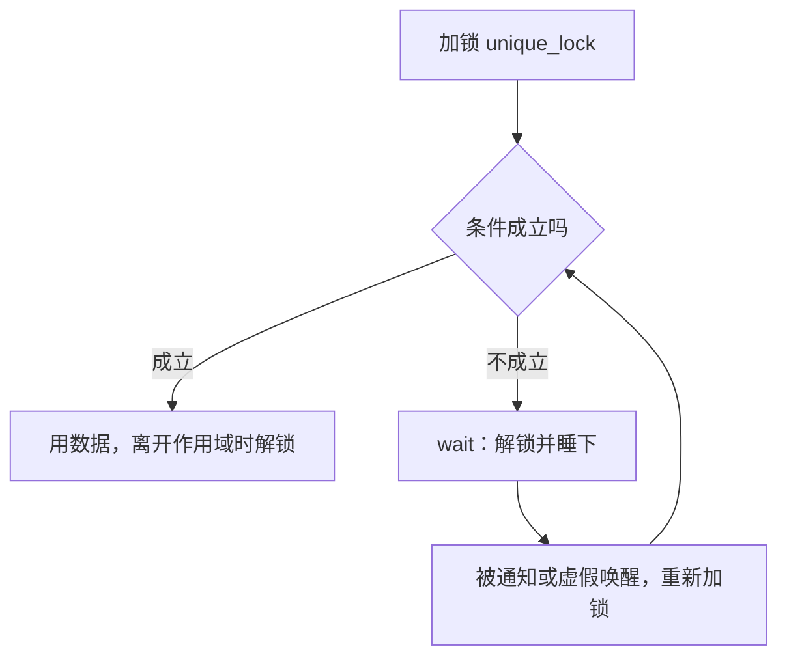

# 内存与并发的基础设施

> **授权**：本章节属教材文档部分，采用 [CC BY-NC-ND 4.0](../LICENSE)
> 加[附加条款](../许可附加条款.md)授权：署名、非商业、禁止演绎、不允许二次分发。
> 文中引用的代码不受此限，各自保留原有许可证，详见[版权与许可说明.md](../版权与许可说明.md)。

**`std::string` 要一块内存，`std::vector` 要一块内存，这些内存从哪来；两个线程同时改一个变量，靠什么保证不出错。**
这两件事分别由 `<memory>` 与 `<mutex>`、`<atomic>`、`<condition_variable>`、`<thread>` 这组头文件回答。

**本章只讲接口怎么用**：哪个类有哪些成员、什么时候选哪一个、写错了会怎样。
线程模型、内存序、数据竞争背后的规则归【待补：09-简单算法/】——那里讲清「为什么」，本章讲「怎么用」。
这个分工是有意的：**接口可以先学会，模型必须慢慢磨**，而只会用接口的人写出的并发代码，出问题时连现象都描述不出来。

**C 里也有这一套**：C11 给了 `<threads.h>` 与 `<stdatomic.h>`，C23 沿用，但写法是函数加结构体
（`thrd_create`、`atomic_int`），C++ 这边是类模板与 RAII（`std::thread`、`std::atomic<int>`）。
分配器上也是同一种对照：C 的 `malloc` 只给内存，`std::allocator` 把「给内存」与「造对象」分成两步。本章的多线程例子都做了输出处理——固定顺序、固定数量，必要时带一个看门狗线程，因此输出能稳定复现。

---

> **约定**：标注以行内代码单独成行——`实测数据` 表示实际执行验证过，
> 完整源码与复现命令见附录 A；`文档` 表示引自标准或官方资料；
> `待确认` 表示尚未验证。路径占位符（如 `<MinGW>`、`<工作区>`）的含义见《README.md》。

# 本章节定位

| 问题 | 在哪一节 |
|---|---|
| `std::allocator` 怎么用、过对齐类型怎么分配、地址是否真的对齐 | **第 1 节** |
| `mutex` 家族四种互斥量的接口差别、三种锁包装怎么选 | **第 2 节** |
| `const` 成员函数里要改缓存，锁为什么必须 `mutable` | **第 3 节** |
| `condition_variable` 的标准骨架、谓词与丢通知 | **第 4 节** |
| `atomic` 的接口、与普通变量的汇编差别、CAS 循环 | **第 5 节** |
| `volatile` 为什么不能当原子量用 | **第 5 节** |
| 三种同步方式的成本与选择顺序 | **第 6 节** |
| 一页速查 | **第 7 节** |

| 前置知识 | 在哪 |
|---|---|
| 引用、`const`、类与成员函数 | 《04-语法/03-常量与 const.md》章节、《05-类与面向对象/02-类是一种类型.md》章节 |
| `mutable` 的语义与两条禁区 | 《05-类与面向对象/03-成员与细节.md》第 2 节 |
| RAII 与资源管理 | 《05-类与面向对象/06-RAII 与资源管理.md》第 2 节 |
| lambda 与捕获方式 | 《05-类与面向对象/10-lambda 与函数对象.md》第 2 节 |

| 相邻章节 | 关系 |
|---|---|
| 《06-标准库/B-11-收尾：把标准库用对.md》 | **后续**：实现差异、什么时候不该用标准库 |
| 【待补：09-简单算法/】 | **后续**：`std::thread` 的创建与 `join`、线程模型、内存序、数据竞争的原理、ThreadSanitizer |

---

# 第 1 节 分配器与对齐

## 1.1 分配器：给内存与造对象是两件事

**`new` 做两件事：拿一块内存，在内存上构造对象。** 分配器把它们拆开，
于是「只要内存，先不要对象」成为可能——容器预留容量靠的就是这个。

**`std::allocator<T>` 的接口只有两对**：

| 成员 | 做什么 |
|---|---|
| `allocate(n)` | 拿 `n * sizeof(T)` 字节的**原始内存**，上面没有对象 |
| `deallocate(p, n)` | 把内存还回去，`n` 必须与申请时一致 |
| `construct(p, args...)` | 在 `p` 指向的内存上构造一个对象（C++17 起弃用） |
| `destroy(p)` | 析构 `p` 指向的对象（C++17 起弃用） |

`C++`

```cpp
/* b10_alloc.cpp    编译：g++ -std=c++17 b10_alloc.cpp -o b10_alloc */
#include <cstddef>
#include <cstdio>
#include <memory>
#include <new>
#include <string>
/* 最小的分配器：只提供 value_type 与 allocate/deallocate，其余由 allocator_traits 补 */
template <class T>
struct LoggingAllocator {
    using value_type = T;
    template <class U>
    LoggingAllocator(const LoggingAllocator<U> &) noexcept {}   /* 允许从别的特化转换 */
    LoggingAllocator() = default;
    T *allocate(std::size_t n) {
        std::printf("  [分配器] 要 %zu 个元素，共 %zu 字节\n", n, n * sizeof(T));
        return static_cast<T *>(::operator new(n * sizeof(T)));
    }
    void deallocate(T *p, std::size_t n) noexcept {
        std::printf("  [分配器] 还 %zu 个元素\n", n);
        ::operator delete(p);
    }
};
int main() {
    /* 调用一律经 allocator_traits：将来换分配器，调用处不用改 */
    using Traits = std::allocator_traits<LoggingAllocator<std::string>>;
    LoggingAllocator<std::string> a;
    std::string *p = Traits::allocate(a, 2);      /* 原始内存，上面没有对象 */
    Traits::construct(a, p, "第一段");             /* 没写 construct，traits 用 placement new */
    Traits::construct(a, p + 1, 6, 'x');          /* 转交给 string(6, 'x') */
    std::printf("traits 构造：%s / %s\n", p->c_str(), (p + 1)->c_str());
    std::printf("max_size = %zu，propagate_on_container_copy_assignment = %d\n",
                Traits::max_size(a),
                (int)Traits::propagate_on_container_copy_assignment::value);
    Traits::destroy(a, p);                        /* 没写 destroy，traits 直接调析构 */
    Traits::destroy(a, p + 1);
    Traits::deallocate(a, p, 2);                  /* 数量必须与申请时一致 */
    return 0;}
```

`实测数据`
`Text`

```text
  [分配器] 要 2 个元素，共 64 字节
traits 构造：第一段 / xxxxxx
max_size = 576460752303423487，propagate_on_container_copy_assignment = 0  [分配器] 还 2 个元素
```

> [!CAUTION]
> **`allocate` 拿到的内存里没有对象，读它就是未定义行为。**
> 它可能全零，也可能是上次释放留下的垃圾，还可能让内存检查工具直接报错。
> **`deallocate` 的第二个参数必须与 `allocate` 一致**——这个数字不是可选的装饰，有些分配器靠它记账。

## 1.2 对齐：过对齐类型与地址实测

**每个类型都有一个对齐要求**：对象地址必须是某个数的整数倍，`int` 通常是 4、`double` 通常是 8。
**`alignas` 写在类型上声明要求，`alignof` 问出来；`new` 表达式会按类型的对齐要求选分配函数**，
下面的程序验证地址是否真的落在边界上。

`C++`

```cpp
/* b10_align.cpp    编译：g++ -std=c++17 b10_align.cpp -o b10_align */
#include <cstdint>
#include <cstdio>
#include <malloc.h>          /* _aligned_malloc，Windows 上的对齐分配 */
#include <new>               /* std::align_val_t */
struct Plain { int v; };
struct alignas(64) CacheLine { int v; };          /* 要求 64 字节对齐 */
struct Wrapper { char c; CacheLine line; };       /* 成员的对齐要求会传给外层 */
static_assert(alignof(CacheLine) == 64 && sizeof(CacheLine) == 64, "对齐要求没有生效");
/* 数一数有多少个地址真的落在 64 字节边界上 */
template <class T>
static int count_aligned(int rounds, std::size_t align) {
    int ok = 0;
    for (int i = 0; i < rounds; ++i) {
        T *p = new T;
        ok += reinterpret_cast<std::uintptr_t>(p) % align == 0;
        delete p;
    }
    return ok;
}
int main() {
    std::printf("alignof(Plain)=%zu sizeof(Plain)=%zu\n", alignof(Plain), sizeof(Plain));
    std::printf("alignof(CacheLine)=%zu sizeof(CacheLine)=%zu\n",
                alignof(CacheLine), sizeof(CacheLine));
    std::printf("alignof(Wrapper)=%zu sizeof(Wrapper)=%zu\n",
                alignof(Wrapper), sizeof(Wrapper));
    std::printf("普通类型 new 1000 次，4 字节对齐的有 %d 个\n", count_aligned<Plain>(1000, 4));
    std::printf("过对齐类型 new 1000 次，64 字节对齐的有 %d 个\n", count_aligned<CacheLine>(1000, 64));
    /* 裸 operator new 只保证默认对齐 */
    std::printf("默认 new 对齐 = %zu 字节\n", (std::size_t)__STDCPP_DEFAULT_NEW_ALIGNMENT__);
    int raw_hit = 0;
    for (int i = 0; i < 1000; ++i) {
        void *p = ::operator new(sizeof(CacheLine));
        raw_hit += reinterpret_cast<std::uintptr_t>(p) % 64 == 0;
        ::operator delete(p);
    }
    std::printf("裸 operator new(size) 1000 次，64 字节对齐的有 %d 个\n", raw_hit);
    /* 三种对齐分配各来一次，都留着不释放，因此地址互不相同 */
    void *q = ::operator new(sizeof(CacheLine), std::align_val_t{64});
    void *r = _aligned_malloc(256, 64);
    CacheLine *c = new CacheLine;
    std::printf("operator new(size, align_val_t{64}) = %p，余数 %zu\n",
                q, reinterpret_cast<std::uintptr_t>(q) % 64);
    std::printf("_aligned_malloc(256, 64) = %p，余数 %zu\n",
                r, reinterpret_cast<std::uintptr_t>(r) % 64);
    std::printf("new CacheLine = %p，余数 %zu\n",
                (void *)c, reinterpret_cast<std::uintptr_t>(c) % 64);
    ::operator delete(q, std::align_val_t{64});
    _aligned_free(r);
    delete c;
    return 0;}
```

`实测数据`
`Text`

```text
alignof(Plain)=4 sizeof(Plain)=4
alignof(CacheLine)=64 sizeof(CacheLine)=64
alignof(Wrapper)=64 sizeof(Wrapper)=128
普通类型 new 1000 次，4 字节对齐的有 1000 个
过对齐类型 new 1000 次，64 字节对齐的有 1000 个
默认 new 对齐 = 16 字节
裸 operator new(size) 1000 次，64 字节对齐的有 0 个
operator new(size, align_val_t{64}) = 000002178b7b2cc0，余数 0
_aligned_malloc(256, 64) = 000002178b7b71c0，余数 0new CacheLine = 000002178b7b7300，余数 0
```

**最后三行是重点**：默认的分配对齐是 16 字节（`__STDCPP_DEFAULT_NEW_ALIGNMENT__`），
**裸 `operator new(size)` 一百次里一次都没落在 64 字节边界上**，
而三条显式要求对齐的路都命中了。
**「0 个」这个数字与前面的分配顺序有关**——分配器复用空闲块，换个分配序列可能变成 1000 个；**它只承诺 16 字节，命中 64 是运气，不能依赖。**

`文档`

> "void* operator new(std::size_t);
> void* operator new(std::size_t, std::align_val_t);"
>> —— N4659 §6.7.4/2

**类型是过对齐的，`new` 表达式就自己调用带 `align_val_t` 的重载**，因此写 `new CacheLine` 就够了。

## 1.3 对齐错了的两种下场
**对齐承诺被打破之后，一种当场崩，一种悄悄过。** 两种都需要考察，因为第二种更危险。

`C++`

```cpp
/* b10_align_bad.cpp    编译：g++ -std=c++17 -O2 b10_align_bad.cpp -o b10_align_bad */
#include <cstdio>
struct alignas(16) Vec16 { float v[4]; };      /* 类型上写着「我 16 字节对齐」 */
float buf[8] = {1, 2, 3, 4, 5, 6, 7, 8};
volatile int offset = 1;                       /* 挡住编译期推导：它不知道这里是 1 */
/* 整体拷贝一个 Vec16：编译器相信类型的对齐承诺，于是用对齐的向量指令搬 */
__attribute__((noinline)) void copy16(Vec16 *dst, const Vec16 *src) {
    *dst = *src;
}
int main() {
    const Vec16 *src = reinterpret_cast<const Vec16 *>(buf + offset);
    std::printf("源地址 %p，相对 buf 的偏移 %zu 字节，余 16 = %zu\n",
                (const void *)src, (size_t)((const char *)src - (const char *)buf),
                (size_t)((const char *)src - (const char *)buf) % 16);
    std::fflush(stdout);                       /* 崩溃前先把这行送出去 */
    Vec16 dst;
    copy16(&dst, src);                         /* 未定义行为在这里变成真崩溃 */
    std::printf("读到 %g %g %g %g\n", dst.v[0], dst.v[1], dst.v[2], dst.v[3]);
    return 0;}
```

`实测数据`
`Text`

```text
源地址 00007ff6647d9024，相对 buf 的偏移 4 字节，余 16 = 4
```

进程随后结束，退出码为 `0xC0000005`（访问冲突）。**崩溃的原因写在汇编里**：

`实测数据`
`Assembly`

```asm
movdqa	(%rdx), %xmm0
movaps	%xmm0, (%rcx)
```

`movdqa` 与 `movaps` 是**要求 16 字节对齐**的向量指令。编译器相信 `Vec16 *` 一定对齐
（类型就是这么承诺的），于是选了对齐版指令；地址实际余 4，指令直接触发异常。
**同一个程序去掉 `-O2` 就不崩**：`-O0` 下编译器逐字段搬，程序安静地打印出 `读到 2 3 4 5`。换个优化等级就从崩溃变成「看起来没事」，这正是未定义行为的典型表现。

**另一种写法不会崩溃**——在字节数组里手工放一个要求 16 字节对齐的对象：

`C++`

```cpp
/* 偏移 1 处 placement new（下面是节选） */
alignas(16) unsigned char storage[sizeof(Vec16) + 1];
Vec16 *p = new (storage + 1) Vec16{{1, 2, 3, 4}};   /* 只有 1 字节对齐 */
```

**实测得到：对象地址余 16 为 1，程序照样逐个字段读到 `1 2 3 4`。**
x86-64 的普通标量访存不要求对齐，因此这次没出事；换一个平台、换一个优化等级、
换一段用向量指令的代码，同一个错误就会变成上面那种崩溃。

> [!CAUTION]
> **`alignas` 是对编译器的承诺，不是请求。**
> 把一个没对齐的地址转成过对齐类型的指针，行为是未定义的：
> 可能当场访问冲突，可能安静地跑出正确结果，也可能在别处出问题。
> **要让过对齐的对象落在合法地址上，只有两条路：**> 用 `new`（它自己会带上 `align_val_t`），或者用平台的对齐分配函数。

`C++`

```cpp
/* b10_align_std.cpp    编译：g++ -std=c++17 b10_align_std.cpp -o b10_align_std （失败） */
#include <cstdio>
#include <cstdlib>
int main() {
    void *p = std::aligned_alloc(64, 128);       /* C11 的 aligned_alloc 的 C++ 版 */
    std::printf("%p\n", p);
    std::free(p);
    return 0;
}
```

`实测数据`
`Text`

```text
error: 'aligned_alloc' is not a member of 'std'
    6 |     void *p = std::aligned_alloc(64, 128);       /* C11 的 aligned_alloc 的 C++ 版 */
      |                    ^~~~~~~~~~~~~
```

**C11 的 `aligned_alloc` 在 MinGW-w64 上没有**：换成全局的那个（`<stdlib.h>` 里那个 C 函数）同样通不过编译，
报错是 `'aligned_alloc' was not declared in this scope`——MinGW-w64 的 C 运行库没有这个函数。

`实测数据`

| 写法 | MinGW-w64 上 |
|---|---|
| `std::aligned_alloc(64, 128)` | **通不过编译**：不是 `std` 的成员 |
| `::aligned_alloc(64, 128)` | **通不过编译**：没有声明 |
| `_aligned_malloc(128, 64)` | 可用，地址余 64 为 0 |
| `::operator new(128, std::align_val_t{64})` | 可用，地址余 64 为 0 |

**跨平台的写法是 `operator new` 那一个**，它由 C++ 标准规定，MSVC 与 libstdc++ 上都在；
`_aligned_malloc`/`_aligned_free` 是 Windows 专有，Linux 上的对应物是 `posix_memalign`。
**分配与释放必须配对**：用 `_aligned_malloc` 拿的必须用 `_aligned_free` 还，
用带 `align_val_t` 的 `operator new` 拿的必须用带 `align_val_t` 的 `operator delete` 还。

---

# 第 2 节 `mutex` 家族与三种锁包装

## 2.1 四种互斥量的接口差别

| 类型 | 重复加锁 | 带超时 | 读写区分 | 头文件 |
|---|---|---|---|---|
| `std::mutex` | 不行 | 没有 | 不分 | `<mutex>` |
| `std::recursive_mutex` | **可以**（同线程） | 没有 | 不分 | `<mutex>` |
| `std::timed_mutex` | 不行 | **有** | 不分 | `<mutex>` |
| `std::recursive_timed_mutex` | 可以 | 有 | 不分 | `<mutex>` |
| `std::shared_mutex` | 不行 | 没有 | **分读/写** | `<shared_mutex>` |
| `std::shared_timed_mutex` | 不行 | 有 | 分读/写 | `<shared_mutex>` |

`C++`

```cpp
/* b10_mutex_family.cpp    编译：g++ -std=c++17 -pthread b10_mutex_family.cpp -o b10_mutex_family */
#include <chrono>
#include <cstdio>
#include <mutex>
#include <shared_mutex>
#include <thread>
#include <vector>
using namespace std::chrono_literals;
int main() {
    std::recursive_mutex rm;                      /* 1. 同一个线程可以重复加锁 */
    rm.lock();
    rm.lock();
    std::printf("recursive_mutex 同一线程锁了两层，成功\n");
    rm.unlock();
    rm.unlock();
    std::timed_mutex tm;                          /* 2. 带超时的加锁 */
    std::thread holder([&tm] {
        std::lock_guard<std::timed_mutex> lk(tm);
        std::this_thread::sleep_for(300ms);
    });
    std::this_thread::sleep_for(50ms);            /* 等对方先拿到 */
    auto t0 = std::chrono::steady_clock::now();
    bool got = tm.try_lock_for(50ms);             /* 只等 50 毫秒 */
    auto ms = std::chrono::duration_cast<std::chrono::milliseconds>(
                  std::chrono::steady_clock::now() - t0).count();
    std::printf("try_lock_for(50ms) 返回 %d，实际等了 %lld 毫秒\n", (int)got, (long long)ms);
    if (got) { tm.unlock(); }
    holder.join();
    std::shared_mutex sm;                         /* 3. 读读可以并行，读写不行 */
    std::vector<std::thread> readers;
    for (int i = 0; i < 3; ++i) {
        readers.emplace_back([&sm] {
            std::shared_lock<std::shared_mutex> lk(sm);    /* 共享（读）锁 */
            std::this_thread::sleep_for(200ms);
        });
    }
    std::this_thread::sleep_for(50ms);                     /* 让三个读者先拿到 */
    t0 = std::chrono::steady_clock::now();
    {
        std::unique_lock<std::shared_mutex> lk(sm);        /* 独占（写）锁：要等读者全走 */
        ms = std::chrono::duration_cast<std::chrono::milliseconds>(
                 std::chrono::steady_clock::now() - t0).count();
        std::printf("三个读者各持有 200 毫秒，写者等了 %lld 毫秒才拿到独占锁\n", (long long)ms);
    }
    for (auto &t : readers) { t.join(); }
    return 0;
}
```

`实测数据`
`Text`

```text
recursive_mutex 同一线程锁了两层，成功
try_lock_for(50ms) 返回 0，实际等了 62 毫秒
三个读者各持有 200 毫秒，写者等了 142 毫秒才拿到独占锁
```

**三行关键输出**：`try_lock_for(50ms)` 返回 0、实际等了 62 毫秒——**超时是下限，不是精确值**；
三个读者各持锁 200 毫秒，写者只等了 142 毫秒就拿到锁——**说明三个读锁确实同时成立**，
若串行则要等 600 毫秒左右；而写者必须等读者全部退出——**这就是读写互斥**。

**共享锁的语义由标准规定**（N4659 §33.4.3.4/2）：多个执行体可同时持有共享锁，
但共享锁与独占锁不能同时被持有。

**`std::mutex` 同一个线程锁两次是未定义行为**；`recursive_mutex` 的正当用途只有一类——
**一个会被递归调用的函数内部要加锁**（例如树的遍历）。**不要拿它掩盖加锁层次没理清的问题。**

## 2.2 三种锁包装：`lock_guard`、`unique_lock`、`scoped_lock`

**裸调 `lock()`/`unlock()` 是《05-类与面向对象/06-RAII 与资源管理.md》第 2 节那种手工配对**，
任何一个提前返回或异常都会漏掉 `unlock`。标准给了三个 RAII 包装：

| 包装 | 什么时候锁 | 能提前解锁 | 能转移 | 能配 `condition_variable` | 锁几把 |
|---|---|---|---|---|---|
| `lock_guard` | 构造时 | 不能 | 不能 | 不能 | 一把 |
| `unique_lock` | 构造时（或指定延后） | **能** | **能** | **能** | 一把 |
| `scoped_lock` | 构造时 | 不能 | 不能 | 不能 | **任意多把** |

`C++`

```cpp
/* b10_locks.cpp    编译：g++ -std=c++17 -pthread b10_locks.cpp -o b10_locks */
#include <cstdio>
#include <mutex>
#include <thread>
#include <vector>
struct Account { int balance = 0; std::mutex m; };
void transfer(Account &from, Account &to, int amount) {
    std::scoped_lock lk(from.m, to.m);        /* C++17 起可用，一次锁两把 */
    from.balance -= amount;
    to.balance += amount;
}
int main() {
    Account a{1000}, b{1000};
    std::vector<std::thread> ts;
    for (int i = 0; i < 3; ++i) {
        ts.emplace_back([&a, &b] {
            for (int k = 0; k < 20000; ++k) {
                transfer(a, b, 1);
                transfer(b, a, 1);            /* 反着转也不会死锁 */
            }
        });
    }
    for (auto &t : ts) { t.join(); }
    std::printf("两账户总额 = %d（初始 2000）\n", a.balance + b.balance);
    /* unique_lock：可以晚点锁、可以提前放、可以转移 */
    std::mutex m;
    std::unique_lock<std::mutex> lk(m, std::defer_lock);     /* 先不锁 */
    std::printf("defer_lock 后 owns_lock()=%d\n", (int)lk.owns_lock());
    lk.lock();
    std::printf("手动 lock 后 owns_lock()=%d\n", (int)lk.owns_lock());
    lk.unlock();                                            /* 提前放掉 */
    std::printf("unlock 后 owns_lock()=%d\n", (int)lk.owns_lock());
    return 0;
}
```

`实测数据`
`Text`

```text
两账户总额 = 2000（初始 2000）
defer_lock 后 owns_lock()=0
手动 lock 后 owns_lock()=1
unlock 后 owns_lock()=0
```

**`adopt_lock` 的意思是「锁已经拿着了，你只管接管释放」，`defer_lock` 是反过来的意思**；
两个标签写反了——`adopt_lock` 用在没锁的互斥量上，析构时会对一把没锁的互斥量调 `unlock`，
行为未定义。

## 2.3 一次锁多把与死锁

**死锁最经典的形状是「两个线程按相反顺序拿同一对锁」**，解法是约定全局顺序，
或者把两把锁一次拿到。

**标准另给了一个函数 `std::lock(m1, m2, ...)`**：一次把多把锁全拿到，顺序交给实现，
中途失败会把已经拿到的放掉。它与 `std::adopt_lock` 配用。

`C++`

```cpp
/* 与 2.2 的 transfer 同一个意思，改用 std::lock 写（下面是节选） */
std::lock(a.m, b.m);
std::lock_guard<std::mutex> la(a.m, std::adopt_lock);   /* 接管已拿到的锁 */
std::lock_guard<std::mutex> lb(b.m, std::adopt_lock);
```

**`std::scoped_lock` 就是它的包装**（C++17 起），因此新代码直接写 `std::scoped_lock lk(m1, m2);` 即可，
不必记得写 `adopt_lock`。

**死锁不好演示，因为「卡住」本身就是它的表现。** 让两个线程按固定的次序各拿一把锁就能每次复现；
再放一个看门狗线程，两秒后打印诊断并结束进程，例子就不会永远挂着。

`C++`

```cpp
/* b10_deadlock.cpp    编译：g++ -std=c++17 -pthread b10_deadlock.cpp -o b10_deadlock */
#include <chrono>
#include <condition_variable>
#include <cstdio>
#include <cstdlib>
#include <mutex>
#include <thread>
using namespace std::chrono_literals;
std::mutex m1, m2, gate;
std::condition_variable cv;
bool got_m1 = false, got_m2 = false;
void thread_a() {
    std::lock_guard<std::mutex> a(m1);            /* 甲先拿 m1 */
    {
        std::unique_lock<std::mutex> lk(gate);
        got_m1 = true;
        cv.notify_all();
        cv.wait(lk, [] { return got_m2; });       /* 等乙也拿到手里的那把 */
    }
    std::lock_guard<std::mutex> b(m2);            /* 再要 m2：乙正握着 */
    std::printf("甲走完了（这一行不会出现）\n");
}
void thread_b() {
    std::lock_guard<std::mutex> b(m2);            /* 乙先拿 m2 */
    {
        std::unique_lock<std::mutex> lk(gate);
        got_m2 = true;
        cv.notify_all();
        cv.wait(lk, [] { return got_m1; });
    }
    std::lock_guard<std::mutex> a(m1);            /* 再要 m1：甲正握着 */
    std::printf("乙走完了（这一行不会出现）\n");
}
int main() {
    std::printf("启动看门狗：两秒后无论发生什么都收场\n");
    std::thread watchdog([] {
        std::this_thread::sleep_for(2s);
        std::printf("两秒过去，两个线程都没有打印完成 —— 各自停在第二个 lock 上\n");
        std::fflush(stdout);
        std::abort();                             /* 直接结束进程，不跑析构 */
    });
    std::thread t1(thread_a), t2(thread_b);
    t1.join();                                    /* 永远等不到 */
    t2.join();
    watchdog.join();
    return 0;
}
```

`实测数据`
`Text`

```text
启动看门狗：两秒后无论发生什么都收场
两秒过去，两个线程都没有打印完成 —— 各自停在第二个 lock 上
```

退出码为 3（`std::abort` 的结果）。**死锁的四个必要条件在这里一条不缺**：互斥、持有并等待、
不可剥夺、循环等待；**打断任意一条即可**，最简单的是打断循环等待。

> [!WARNING]
> **「我的代码里锁的顺序是固定的」这种保证，通常只在单个函数里成立。**
> 一旦有两个函数各按自己的顺序拿同一对锁，另一个线程同时调用它们就会死锁。
> 判断方法：**把所有加锁点列出来，看是否存在两条相反顺序的路径。**

---

# 第 3 节 `mutable` 与 `mutex`：`const` 成员函数里的锁

## 3.1 锁成员必须是 `mutable`

**`const` 成员函数里不能修改非 `mutable` 的数据成员**，直接后果是：
**一个 `std::mutex` 成员在 `const` 成员函数里锁不上**——`lock()` 是非 `const` 成员函数，
而 `const` 成员函数里的 `m_` 是 `const std::mutex`。

`C++`

```cpp
/* b10_mutable_err.cpp    编译：g++ -std=c++17 b10_mutable_err.cpp -o b10_mutable_err （失败） */
#include <cstddef>
#include <mutex>
#include <string>
class WordLength {
public:
    explicit WordLength(std::string text) : text_(std::move(text)) {}
    std::size_t length() const {
        std::lock_guard<std::mutex> lk(m_);       /* m_ 没有声明成 mutable */
        return text_.size();
    }
private:
    std::string text_;
    std::mutex m_;                                /* 缺 mutable */
};
int main() {
    const WordLength w("hello");
    return (int)w.length();
}
```

`实测数据`
`Text`

```text
error: binding reference of type 'std::lock_guard<std::mutex>::mutex_type&'
       {aka 'std::mutex&'} to 'const std::mutex' discards qualifiers
   11 |         std::lock_guard<std::mutex> lk(m_);       /* m_ 没有声明成 mutable */
      |                                        ^~
```

**报错说的是「不能把 `const std::mutex` 绑到 `std::mutex&` 上」**——`lock_guard` 的构造函数
要一个非 `const` 引用，而 `const` 成员函数里的成员是 `const` 的。
**`mutable` 就是给这种情况准备的**：它声明「这个成员在 `const` 成员函数里也可以改」。

## 3.2 `const` 成员函数里的缓存与锁

**这个例子的形状很常见**：一个对外只读的查询，内部要缓存结果、要记调用次数，两件事都要线程安全。

`C++`

```cpp
/* b10_mutable_mutex.cpp    编译：g++ -std=c++17 -pthread b10_mutable_mutex.cpp -o b10_mutable_mutex */
#include <cstddef>
#include <cstdio>
#include <mutex>
#include <string>
#include <thread>
#include <vector>
class WordLength {
public:
    explicit WordLength(std::string text) : text_(std::move(text)) {}
    /* const 成员函数：对外承诺不改状态；缓存与记账属于内部细节，所以是 mutable */
    std::size_t length() const {
        std::lock_guard<std::mutex> lk(m_);       /* m_ 也得是 mutable，否则 const 里锁不上 */
        ++calls_;
        if (cached_ == npos) { cached_ = text_.size(); }
        return cached_;
    }
    std::size_t calls() const {
        std::lock_guard<std::mutex> lk(m_);
        return calls_;
    }
private:
    static const std::size_t npos = static_cast<std::size_t>(-1);
    std::string text_;                 /* 不变的正文 */
    mutable std::mutex m_;             /* 内部记账用的锁 */
    mutable std::size_t cached_ = npos;
    mutable std::size_t calls_ = 0;
};
int main() {
    const WordLength w("hello world");            /* 对象本身是 const */
    std::vector<std::thread> ts;
    for (int i = 0; i < 8; ++i) {
        ts.emplace_back([&w] {
            for (int k = 0; k < 1000; ++k) { (void)w.length(); }
        });
    }
    for (auto &t : ts) { t.join(); }
    std::printf("const 对象上调用 8 x 1000 次：长度 %zu，记账次数 %zu\n",
                w.length(), w.calls());
    return 0;
}
```

`实测数据`
`Text`

```text
const 对象上调用 8 x 1000 次：长度 11，记账次数 8000
```

**8000 这个数字是判据**：八个线程各调一千次，一次不多一次不少，说明 `calls_` 的自增被锁保护住了。
**把 `m_` 去掉 `mutable`** 就是上一小节那段报错；**把锁去掉**，`calls_` 会少于 8000——
那就是第 5.6 小节的数据竞争。

`文档`

> "The mutable specifier on a class data member nullifies a const specifier applied to the containing
> class object and permits modification of the mutable class member even though the rest of the object
> is const."
>
> —— N4659 §10.1.1/9

## 3.3 `mutable` 的两条边界

**`mutable` 只能用在非静态数据成员上，而且不能与 `const` 同用。**
这两条限制来自《05-类与面向对象/03-成员与细节.md》第 2.3 小节，与锁的配合正好都碰得上。

`C++`

```cpp
/* b10_mutable_boundary.cpp    编译：g++ -std=c++17 b10_mutable_boundary.cpp -o b10_mutable_boundary （失败） */
#include <mutex>
class Counter {
public:
    void bump() const { ++value_; }
private:
    mutable int value_ = 0;
    static mutable std::mutex m_;      /* 错：mutable 不能用在静态成员上 */
    mutable const int fixed_ = 1;      /* 错：mutable 不能和 const 一起用 */
};
std::mutex Counter::m_;
int main() {
    Counter c;
    c.bump();
    return 0;
}
```

`实测数据`
`Text`

```text
error: 'mutable' specifier conflicts with 'static'
    9 |     static mutable std::mutex m_;      /* 错：mutable 不能用在静态成员上 */
      |     ~~~~~~ ^~~~~~~
error: 'const' 'fixed_' cannot be declared 'mutable'
   10 |     mutable const int fixed_ = 1;      /* 错：mutable 不能和 const 一起用 */
      |     ^~~~~~~
```

**`mutable` 的正确用法只有三类**：缓存、记账、以及 `mutable std::mutex` 这样的同步设施。

**业务数据一律不许 `mutable`。** 一旦把一个 `const` 成员函数写成会改业务数据的样子，
`const` 就不再是承诺，读代码的人会按「这个调用不改变任何东西」来推理，而实际行为与推理不符——
**这类错误的代价通常不是崩溃，而是算错。**

---

# 第 4 节 `condition_variable`：等待与通知

## 4.1 标准骨架与最小程序

**条件变量解决的问题是「等一个条件成立」，而不是「等一段时间」**，用法有固定骨架：

`Mermaid`



**另一侧的骨架只有两步，顺序不能反**：

`C++`

```cpp
/* 改状态的线程：先改状态，再通知（下面是节选） */
{
    std::lock_guard<std::mutex> lk(m);
    ready = true;   /* 第一步：改状态 */
}
cv.notify_one();    /* 第二步：通知（此时锁已放掉） */
```

**必须「先改状态再通知」**：反过来的话，被叫醒的线程可能立刻拿到锁、看到条件还不成立，
于是回去继续睡——**这一次通知就白发了**。谓词版能兜住这种失误，但兜不住「通知发得太早，
当时还没有人在等」，那种情况见 4.3 小节。

`C++`

```cpp
/* b10_cv_min.cpp    编译：g++ -std=c++17 -pthread b10_cv_min.cpp -o b10_cv_min */
#include <condition_variable>
#include <cstdio>
#include <mutex>
#include <thread>
std::mutex m;
std::condition_variable cv;
bool ready = false;
void worker() {
    std::unique_lock<std::mutex> lk(m);
    cv.wait(lk, [] { return ready; });        /* 条件成立才往下走 */
    std::printf("worker 收到通知，开始干活\n");
}
int main() {
    std::thread t(worker);
    {
        std::lock_guard<std::mutex> lk(m);
        ready = true;                         /* 先改状态 */
    }
    cv.notify_one();                          /* 再通知 */
    t.join();
    std::printf("main 结束\n");
    return 0;
}
```

`实测数据`
`Text`

```text
worker 收到通知，开始干活
main 结束
```

**`wait` 的谓词版在标准里就是三行**：

`文档`

> "Effects: Equivalent to:
> while (!pred())
>   wait(lock);"
>
> —— N4659 §33.5.3/15

## 4.2 生产者与消费者

生产者推五条数据然后收工，消费者一条条取出来打印，输出顺序固定。

`C++`

```cpp
/* b10_cv.cpp    编译：g++ -std=c++17 -pthread b10_cv.cpp -o b10_cv */
#include <chrono>
#include <condition_variable>
#include <cstdio>
#include <mutex>
#include <queue>
#include <thread>
using namespace std::chrono_literals;
std::mutex m;
std::condition_variable cv;
std::queue<int> q;
bool done = false;                    /* 生产者说完事了 */
void producer() {
    for (int i = 1; i <= 5; ++i) {
        {
            std::lock_guard<std::mutex> lk(m);
            q.push(i);
        }
        cv.notify_one();              /* 改了状态再通知，顺序不能反 */
        std::this_thread::sleep_for(20ms);
    }
    {
        std::lock_guard<std::mutex> lk(m);
        done = true;
    }
    cv.notify_all();                  /* 收工要让所有等待者都醒 */
}
void consumer() {
    int got = 0;
    for (;;) {
        std::unique_lock<std::mutex> lk(m);
        cv.wait(lk, [] { return !q.empty() || done; });   /* 谓词版：醒来先看条件 */
        if (q.empty()) { break; }     /* 只有 done 为真且没有剩货 */
        int v = q.front();
        q.pop();
        lk.unlock();                  /* 处理数据时不持锁 */
        std::printf("消费 %d\n", v);
        ++got;
    }
    std::printf("共消费 %d 个\n", got);
}
int main() {
    std::thread p(producer), c(consumer);
    p.join();
    c.join();
    return 0;
}
```

`实测数据`
`Text`

```text
消费 1
消费 2
消费 3
消费 4
消费 5
共消费 5 个
```

**`notify_one` 与 `notify_all` 的区别只有一个**：叫醒一个，还是叫醒全部。
**判断方法**：如果被叫醒的线程可能因为条件不满足而重新睡下，而它的重新睡下会让某个该干活的人
永远不醒，那就必须用 `notify_all`。收工通知就是这种情况。

## 4.3 谓词：虚假唤醒与丢掉的通知

**`wait` 可能在没有任何人通知的情况下返回**，这不是实现的缺陷，标准明确允许：

`文档`

> "The function will unblock when signaled by a call to notify_one() or a call to notify_all(),
> or spuriously."
>
> —— N4659 §33.5.3/10.3

**因此「醒来」不等于「条件成立」。** 谓词版把这件事处理掉了——醒来先重新求值谓词，
不成立就继续睡；手写循环也一样：

谓词版展开就是下面这个循环：

`C++`

```cpp
/* 谓词版展开（下面是节选） */
std::unique_lock<std::mutex> lk(m);
while (data == 0) {
    cv.wait(lk);                      /* 醒来先重新求值谓词 */
    std::printf("第 %d 次被叫醒，此刻 data = %d\n", ++wakeups, data);
}
```

`实测数据`
`Text`

```text
第 1 次被叫醒，此刻 data = 0
第 2 次被叫醒，此刻 data = 42
条件满足，拿到 data = 42
```

**第一次通知是空的**（没有改任何状态），消费者醒来、发现条件不成立、回去继续睡；
第二次通知才带来条件成立。**「醒来」不等于「条件成立」，这就是必须用谓词的原因。**

**`wait` 不检查条件，直接睡。** 如果通知在它睡下之前就发过了，那次通知永久丢失，它永远不会醒。

`C++`

```cpp
/* b10_cv_bad.cpp    编译：g++ -std=c++17 -pthread b10_cv_bad.cpp -o b10_cv_bad */
#include <chrono>
#include <condition_variable>
#include <cstdio>
#include <cstdlib>
#include <mutex>
#include <thread>
using namespace std::chrono_literals;
std::mutex m;
std::condition_variable cv;
int data = 0;
void consumer() {
    std::unique_lock<std::mutex> lk(m);
    cv.wait(lk);                      /* 没有谓词：进来就睡，醒来也不看条件 */
    std::printf("消费者看到 data = %d\n", data);
}
int main() {
    std::thread watchdog([] {         /* 两秒后收场，否则程序永远挂着 */
        std::this_thread::sleep_for(2s);
        std::printf("两秒过去，消费者仍停在 wait 里：那次通知补不回来\n");
        std::fflush(stdout);
        std::abort();                 /* 直接结束进程，不跑析构 */
    });
    {
        std::lock_guard<std::mutex> lk(m);
        data = 42;                    /* 条件已经满足 */
    }
    cv.notify_one();                  /* 可此刻还没有任何线程在等：这次通知被丢掉 */
    std::this_thread::sleep_for(200ms);
    std::thread c(consumer);          /* 消费者进来时条件早就满足了，它却先睡下 */
    c.join();                         /* 永远等不到 */
    watchdog.join();
    return 0;
}
```

`实测数据`
`Text`

```text
两秒过去，消费者仍停在 wait 里：那次通知补不回来
```

**两个版本的差别只有一行**：`cv.wait(lk)` 与 `cv.wait(lk, pred)`。
**前者依赖「通知一定发生在等待之后」这个无法保证的前提，后者不依赖任何前提。**

> [!IMPORTANT]
> **谓词版的 `wait` 不只是「更安全」，它是唯一正确的写法。** 条件变量本身不保存通知，
> 它只是一个「叫人」的机制；**状态的保存靠的是那个被锁保护的变量**，谓词读的就是它。

## 4.4 带超时的等待

**`wait_for` 与 `wait_until` 没等到时返回 `false`（谓词版）或 `cv_status::timeout`（无谓词版）**，
用途是「等一会儿，不来就算了」。

`C++`

```cpp
/* b10_cv_timeout.cpp    编译：g++ -std=c++17 -pthread b10_cv_timeout.cpp -o b10_cv_timeout */
#include <chrono>
#include <condition_variable>
#include <cstdio>
#include <mutex>
using namespace std::chrono_literals;
int main() {
    std::mutex m;
    std::condition_variable cv;
    bool ready = false;
    std::unique_lock<std::mutex> lk(m);
    auto t0 = std::chrono::steady_clock::now();
    bool ok = cv.wait_for(lk, 200ms, [&] { return ready; });    /* 带谓词的等一段时间 */
    auto ms = std::chrono::duration_cast<std::chrono::milliseconds>(
                  std::chrono::steady_clock::now() - t0).count();
    std::printf("wait_for 返回 %d，等了 %lld 毫秒\n", (int)ok, (long long)ms);
    return 0;
}
```

`实测数据`
`Text`

```text
wait_for 返回 0，等了 208 毫秒
```

**返回 0 表示「超时了，条件没成立」**；实际等了 208 毫秒，比请求的 200 毫秒多一点——
**超时参数是下限，不是精确值**，与 2.1 小节的 `try_lock_for` 一致。

---

# 第 5 节 `atomic`：不加锁的共享变量

## 5.1 `atomic<T>` 的接口

| 成员 | 做什么 |
|---|---|
| `load()` / `store(v)` | 原子地读 / 写 |
| `exchange(v)` | 写入 `v`，返回旧值 |
| `fetch_add(n)` / `fetch_sub(n)` | 加 / 减，返回**旧值** |
| `fetch_and` / `fetch_or` / `fetch_xor` | 位运算版本 |
| `operator++` / `operator--` / `+=` / `-=` | 简写形式（返回新值或旧值，注意区分） |
| `compare_exchange_weak(expected, desired)` | 相等就换成 `desired`，返回是否成功 |
| `compare_exchange_strong(expected, desired)` | 同上，但不会虚假失败 |
| `is_lock_free()` | 这个类型在这台机器上是不是真的无锁 |

`C++`

```cpp
/* b10_atomic.cpp    编译：g++ -std=c++17 -pthread b10_atomic.cpp -o b10_atomic */
#include <atomic>
#include <cstdio>
int main() {
    std::atomic<int> n{0};
    std::printf("sizeof(atomic<int>)=%zu，is_lock_free=%d\n", sizeof(n), (int)n.is_lock_free());
    n.store(5);
    std::printf("store(5) 之后 load()=%d\n", n.load());
    n.fetch_add(3);
    std::printf("fetch_add(3) 之后 =%d\n", n.load());
    int old = n.fetch_sub(1);
    std::printf("fetch_sub(1) 返回旧值 %d，现在 =%d\n", old, n.load());
    /* compare_exchange_weak 的常规用法：放在循环里重试 */
    int expected = n.load();
    int tries = 0;
    while (!n.compare_exchange_weak(expected, 100)) {
        ++tries;                      /* 失败时 expected 已被写回当前值 */
    }
    std::printf("CAS 循环把值换成 100，用了 %d 次重试，现在 =%d\n", tries, n.load());
    /* 拿一个不对的值去换：失败，expected 被改写成真实值 */
    int wrong = 7;
    bool ok = n.compare_exchange_strong(wrong, 0);
    std::printf("拿 7 去换：成功=%d，expected 被改写成 %d\n", (int)ok, wrong);
    std::printf("sizeof(atomic<bool>)=%zu sizeof(atomic<long long>)=%zu\n",
                sizeof(std::atomic<bool>), sizeof(std::atomic<long long>));
    return 0;
}
```

`实测数据`
`Text`

```text
sizeof(atomic<int>)=4，is_lock_free=1
store(5) 之后 load()=5
fetch_add(3) 之后 =8
fetch_sub(1) 返回旧值 8，现在 =7
CAS 循环把值换成 100，用了 0 次重试，现在 =100
拿 7 去换：成功=0，expected 被改写成 100
sizeof(atomic<bool>)=1 sizeof(atomic<long long>)=8
```

## 5.2 汇编对照与内存序

同一段自增，两种类型，各编一次看汇编：

`C++`

```cpp
/* b10_atomic_asm.cpp    编译：g++ -std=c++17 -O2 -S b10_atomic_asm.cpp -o b10_atomic_asm.s */
#include <atomic>
void inc_plain(int &x) {
    x += 1;
}
void inc_atomic(std::atomic<int> &x) {
    x.fetch_add(1);                  /* 默认就是 memory_order_seq_cst */
}
void inc_relaxed(std::atomic<int> &x) {
    x.fetch_add(1, std::memory_order_relaxed);
}
```

`实测数据`
`Assembly`

```asm
_Z9inc_plainRi:
	addl	$1, (%rcx)
	ret
_Z10inc_atomicRSt6atomicIiE:
	lock addl	$1, (%rcx)
	ret
_Z11inc_relaxedRSt6atomicIiE:
	lock addl	$1, (%rcx)
	ret
```

**差别就是 `lock` 这个前缀。** `addl $1, (%rcx)` 是「读—加—写」三步，中间可以被别的核插进来；
`lock addl` 让这三步成为一个不可分割的操作。**`relaxed` 编出来与 `seq_cst` 一模一样**：
`lock` 前缀在 x86-64 上同时提供了原子性与较强的顺序保证，内存序的差别体现在
「多个变量之间的可见顺序」上，不在单条指令里——那部分归【待补：09-简单算法/】。

**每一个原子操作都可以带一个内存序参数**，默认是 `std::memory_order_seq_cst`。
六个取值里，日常只需要认识三个：

| 取值 | 一句话 |
|---|---|
| `memory_order_seq_cst` | **默认**。所有线程看到同一个全局顺序，最保守 |
| `memory_order_acquire` / `release` | 配对使用：一个线程 release 写、另一个 acquire 读，读到的写在它之前的操作都可见 |
| `memory_order_relaxed` | 只保证这一个操作原子，不提供任何跨变量的顺序 |

**`seq_cst` 是默认值，也是本章推荐的写法**：它的代价在 x86-64 上通常只是多几条屏障指令，
省下的却是「读代码时不必推理顺序」的成本。`acquire`/`release` 有一个固定形状——
一个原子量当旗子，写数据在前、立旗在后；读旗在前、读数据在后。
**这套形状在本机验证不出差别**：x86-64 的硬件本来就保证「读不重排、写不重排」，
把 `acquire`/`release` 换成 `relaxed` 也照样打印正确结果；换到弱内存序的架构上，
数据写与旗子写可能被重排。**这就是「本机跑通不等于代码正确」的典型例子**，
也是本章把内存序留给【待补：09-简单算法/】的原因。

> [!TIP]
> **写并发代码时的默认选择**：能用 `mutex` 就用 `mutex`；只在「一个整数计数器」这类简单场景
> 用 `atomic`，且不写内存序参数（用默认的 `seq_cst`）；要动 `relaxed`、`acquire`、`release` 时，
> 先确认自己已经理解了 happens-before。

## 5.3 `compare_exchange_weak`：CAS 循环

**比较并交换是「读—判断—写」的原子版本**，写法固定：把当前值读进 `expected`，拿它去换，
失败就重试。`weak` 版本允许虚假失败（即使值相等也可能返回 `false`），**必须放在循环里**：

**标准要求 `weak` 版本允许虚假失败，并写明「几乎所有 `weak` 比较交换的用法都在循环里」**
（N4659 §32.6.1/22）。

`C++`

```cpp
/* b10_cas_max.cpp    编译：g++ -std=c++17 -O2 -pthread b10_cas_max.cpp -o b10_cas_max */
#include <atomic>
#include <cstdio>
#include <thread>
#include <vector>
std::atomic<int> g_max{0};
/* 把候选值并进最大值：比较并交换失败就重试 */
void offer(int candidate) {
    int seen = g_max.load();
    while (candidate > seen) {
        if (g_max.compare_exchange_weak(seen, candidate)) { return; }   /* 换成功了 */
        /* 失败时 seen 已被写回当前值，直接进入下一轮 */
    }
}
int main() {
    std::vector<std::thread> ts;
    for (int t = 0; t < 4; ++t) {
        ts.emplace_back([t] {
            for (int i = 0; i < 200000; ++i) { offer((t + 1) * 1000 + (i % 997)); }
        });
    }
    for (auto &th : ts) { th.join(); }
    std::printf("四个线程报上来的最大值 = %d（应当是 4000 + 996）\n", g_max.load());
    return 0;
}
```

`实测数据`
`Text`

```text
四个线程报上来的最大值 = 4996（应当是 4000 + 996）
```

**`while (candidate > seen)` 这一层判断是必要的**：候选值不比当前值大就没必要去换。
**这个模式叫「乐观重试」**：先读、算、再试图换，换不上就重新读一遍。它比加锁快，
代价是循环里不能有副作用，否则重试会让副作用执行多次。

**`weak` 放在循环里，`strong` 用在只试一次的地方。**

## 5.4 `atomic_flag`：标准保证无锁的那个

**`std::atomic<T>` 的 `is_lock_free()` 可能返回 `false`**——实现可以用一把内部锁模拟原子性
（大结构体上确实如此）。**只有 `atomic_flag` 由标准保证无锁**：

**标准规定 `atomic_flag` 上的操作必须无锁**（N4659 §32.8/1、§32.8/2）。

`C++`

```cpp
/* b10_spinlock.cpp    编译：g++ -std=c++17 -O2 -pthread b10_spinlock.cpp -o b10_spinlock */
#include <atomic>
#include <cstdio>
#include <mutex>
#include <thread>
#include <vector>
/* 只要满足 BasicLockable（有 lock 与 unlock），就能配 lock_guard 用 */
class SpinLock {
public:
    void lock() {
        while (flag_.test_and_set(std::memory_order_acquire)) { }   /* 自旋等别人放手 */
    }
    void unlock() { flag_.clear(std::memory_order_release); }
private:
    std::atomic_flag flag_ = ATOMIC_FLAG_INIT;
};
int main() {
    SpinLock sp;
    long counter = 0;
    std::vector<std::thread> ts;
    for (int i = 0; i < 4; ++i) {
        ts.emplace_back([&] {
            for (int k = 0; k < 100000; ++k) {
                std::lock_guard<SpinLock> lk(sp);
                ++counter;
            }
        });
    }
    for (auto &t : ts) { t.join(); }
    std::printf("自旋锁保护下：期望 400000，实际 %ld\n", counter);
    return 0;
}
```

`实测数据`
`Text`

```text
自旋锁保护下：期望 400000，实际 400000
```

**自旋锁适合「临界区极短、线程数不超过核数」的场景**；临界区长或线程多时自旋会白烧 CPU，
**这时候互斥量更合适**——它把等待的线程挂起，不占处理器。

## 5.5 `volatile` 不等于原子

**`volatile` 在 C 与 C++ 里的含义只有一条：对这个对象的访问不能被优化掉。**
它保证每一次读都真的从内存读、每一次写都真的写回内存。
**它不保证「读—改—写」是一个不可分割的操作**，因此拿它当原子量用是错的。
下面这段程序把同一个计数器加八百万次，三种类型各测一次。

`C++`

```cpp
/* b10_volatile.cpp    编译：g++ -std=c++17 -O2 -pthread b10_volatile.cpp -o b10_volatile */
#include <atomic>
#include <cstdio>
#include <thread>
#include <vector>
constexpr long kN = 2000000;      /* 每个线程加两百万次 */
constexpr int kThreads = 4;
volatile long g_volatile = 0;     /* volatile：每次访问都真的读写内存 */
long g_plain = 0;                 /* 普通变量：编译器可以随意合并访问 */
std::atomic<long> g_atomic{0};    /* 原子量：读—改—写是一个不可分割的操作 */
template <class F>
static void run(F body) {
    std::vector<std::thread> ts;
    for (int i = 0; i < kThreads; ++i) { ts.emplace_back(body); }
    for (auto &t : ts) { t.join(); }
}
int main() {
    run([] { for (long k = 0; k < kN; ++k) { ++g_volatile; } });
    run([] { for (long k = 0; k < kN; ++k) { ++g_plain; } });
    run([] { for (long k = 0; k < kN; ++k) { g_atomic.fetch_add(1, std::memory_order_relaxed); } });
    long want = (long)kThreads * kN;
    std::printf("volatile long：期望 %ld，实际 %ld，少了 %ld\n",
                want, (long)g_volatile, want - (long)g_volatile);
    std::printf("普通 long    ：期望 %ld，实际 %ld，少了 %ld\n",
                want, g_plain, want - g_plain);
    std::printf("atomic<long> ：期望 %ld，实际 %ld，少了 %ld\n",
                want, g_atomic.load(), want - g_atomic.load());
    return 0;
}
```

`实测数据`
`Text`

```text
volatile long：期望 8000000，实际 2049745，少了 5950255
普通 long    ：期望 8000000，实际 8000000，少了 0
atomic<long> ：期望 8000000，实际 8000000，少了 0
```

**`volatile` 那一行丢了七成以上，`atomic` 那一行一次不差。**
普通 `long` 之所以「对」，是 `-O2` 把循环折叠成了一次加法——第 5.6 小节会说明这种「对」不能算数。
原因在汇编里最清楚，同一个自增，两种类型：

`实测数据`
`Assembly`

```asm
_Z12inc_volatilev:
	movl	v(%rip), %eax
	addl	$1, %eax
	movl	%eax, v(%rip)
	ret
_Z10inc_atomicv:
	lock addl	$1, a(%rip)
	ret
```

**`inc_volatile` 是三条互相独立的指令**：读进寄存器、加一、写回内存。
两条线程交错执行时，各自的「读」可能拿到同一个旧值，两次自增只留下一次的结果。
`inc_atomic` 只有一条 `lock addl`，处理器保证它整体完成。

**`volatile` 的三条边界**：它不是原子量、不是内存屏障、不能用来在线程之间传数据。
它真正的用途是与硬件打交道——映射到固定地址的寄存器、信号处理函数里要改的
`volatile sig_atomic_t`。**多线程共享的变量只有两把锁：`mutex` 与 `atomic`。**

> [!WARNING]
> **「加了 `volatile` 就安全了」是并发编程里最常见的误解之一。**
> `volatile` 约束的是对这一个对象的访问次数与顺序，不是不同对象之间的可见顺序，
> 也不能让编译器放弃重排。

## 5.6 竞争不是「结果可能不对」，是未定义行为

`文档`

> "The execution of a program contains a data race if it contains two potentially concurrent
> conflicting actions, at least one of which is not atomic, and neither happens before the other,
> except for the cases of signal handlers described below. Any such data race results in undefined
> behavior."
>
> —— N4659 §4.7.1/20

**「未定义行为」意味着编译器可以假设它不存在**，后果不止是「数字少加几次」：

`C++`

```cpp
/* b10_race.cpp    编译：g++ -std=c++17 -O0 -pthread b10_race.cpp -o b10_race */
#include <atomic>
#include <cstdio>
#include <thread>
#include <vector>
constexpr long kN = 2000000;
constexpr int kThreads = 4;
template <class F>
static void run(F body) {
    std::vector<std::thread> ts;
    for (int i = 0; i < kThreads; ++i) { ts.emplace_back(body); }
    for (auto &t : ts) { t.join(); }
}
int main() {
    /* 1. 普通 int：四个线程各加两百万次。这是数据竞争，标准说是未定义行为 */
    int plain = 0;
    run([&plain] { for (long k = 0; k < kN; ++k) { ++plain; } });
    long want = (long)kThreads * kN;
    std::printf("普通 int：期望 %ld，实际 %d，少了 %ld\n", want, plain, want - plain);
    /* 2. atomic<long>：同样四个线程同样次数 */
    std::atomic<long> a{0};
    run([&a] { for (long k = 0; k < kN; ++k) { a.fetch_add(1, std::memory_order_relaxed); } });
    std::printf("atomic<long>：期望 %ld，实际 %ld\n", want, a.load());
    return 0;
}
```

`实测数据`
`Text`

```text
普通 int：期望 8000000，实际 2421799，少了 5578201
atomic<long>：期望 8000000，实际 8000000
```

**同一份代码连跑三次，丢失量分别是 4,682,666、5,446,264、5,884,295**——每次都不一样，
而且都丢了六七成。`atomic` 版本三次全部正确。

**更值得注意的是同一个程序在 `-O2` 下的表现**：

`实测数据`
`Text`

```text
普通 int：期望 8000000，实际 8000000，少了 0
普通 int：期望 8000000，实际 8000000，少了 0
普通 int：期望 8000000，实际 8000000，少了 0
```

**优化器把循环折叠成了一次加法，于是结果「对」了**，这不能说明代码正确：换一个编译器版本、
换一个优化等级、在循环里加一行打印，结果就会变。

> [!CAUTION]
> **共享数据的竞争是未定义行为，不是「结果可能不对」。**
> 它可能少加几次，可能多算，可能把 `if` 的两条分支都执行，可能让一个不可能为空的对象变空，
> 也可能在换一台机器之后才出问题。**没有任何一种「看起来对」的结果能证明代码没问题。**
> 消除竞争只有两条路：**用锁把访问串起来**，或者**把变量换成原子量**。

---

# 第 6 节 开销与选择

## 6.1 三种同步方式的成本

**同一件事——把计数器加两千万次——用四种写法各测一遍**，普通 `int` 那一行用空汇编挡住优化。

`C++`

```cpp
/* b10_cost.cpp    编译：g++ -std=c++17 -O2 -pthread b10_cost.cpp -o b10_cost */
#include <atomic>
#include <chrono>
#include <cstdio>
#include <mutex>
#include <shared_mutex>
#include <thread>
#include <vector>
constexpr long kN = 20000000;      /* 无竞争部分的次数 */
constexpr int kThreads = 4;
constexpr int kRounds = 200000;    /* 有竞争时每个线程的次数 */
using Clock = std::chrono::steady_clock;
template <class F>
static void run_threads(F body) {
    std::vector<std::thread> ts;
    for (int i = 0; i < kThreads; ++i) { ts.emplace_back(body); }
    for (auto &t : ts) { t.join(); }
}
static long long ms_between(Clock::time_point a, Clock::time_point b) {
    return std::chrono::duration_cast<std::chrono::milliseconds>(b - a).count();
}
int main() {
    std::printf("无竞争：单线程把计数器加两千万次\n");
    int plain = 0;                        /* 普通 int，用空汇编挡住优化 */
    auto t0 = Clock::now();
    for (long k = 0; k < kN; ++k) {
        ++plain;
        asm volatile("" : "+r"(plain));
    }
    auto t1 = Clock::now();
    double ns = (double)std::chrono::duration_cast<std::chrono::nanoseconds>(t1 - t0).count() / kN;
    std::printf("  普通 int        %6.2f ns/次（结果 %d）\n", ns, plain);
    std::atomic<int> seq{0};              /* atomic<int>，默认 seq_cst */
    t0 = Clock::now();
    for (long k = 0; k < kN; ++k) { seq.fetch_add(1); }
    t1 = Clock::now();
    ns = (double)std::chrono::duration_cast<std::chrono::nanoseconds>(t1 - t0).count() / kN;
    std::printf("  atomic seq_cst  %6.2f ns/次（结果 %d）\n", ns, seq.load());
    std::atomic<int> rel{0};              /* atomic<int>，relaxed */
    t0 = Clock::now();
    for (long k = 0; k < kN; ++k) { rel.fetch_add(1, std::memory_order_relaxed); }
    t1 = Clock::now();
    ns = (double)std::chrono::duration_cast<std::chrono::nanoseconds>(t1 - t0).count() / kN;
    std::printf("  atomic relaxed  %6.2f ns/次（结果 %d）\n", ns, rel.load());
    std::mutex m;                         /* mutex + lock_guard */
    int guarded = 0;
    t0 = Clock::now();
    for (long k = 0; k < kN; ++k) {
        std::lock_guard<std::mutex> lk(m);
        ++guarded;
    }
    t1 = Clock::now();
    ns = (double)std::chrono::duration_cast<std::chrono::nanoseconds>(t1 - t0).count() / kN;
    std::printf("  mutex 保护      %6.2f ns/次（结果 %d）\n", ns, guarded);
    std::printf("有竞争：四个线程各加二十万次\n");
    std::mutex cm;                        /* 写法一：mutex 保护一个普通 long */
    long by_mutex = 0;
    t0 = Clock::now();
    run_threads([&] {
        for (int k = 0; k < kRounds; ++k) {
            std::lock_guard<std::mutex> lk(cm);
            ++by_mutex;
        }
    });
    t1 = Clock::now();
    std::printf("  mutex 保护：结果 %ld，%lld 毫秒\n", by_mutex, ms_between(t0, t1));
    std::atomic<long> by_atomic{0};       /* 写法二：atomic 的 fetch_add */
    t0 = Clock::now();
    run_threads([&] {
        for (int k = 0; k < kRounds; ++k) {
            by_atomic.fetch_add(1, std::memory_order_relaxed);
        }
    });
    t1 = Clock::now();
    std::printf("  atomic    ：结果 %ld，%lld 毫秒\n", by_atomic.load(), ms_between(t0, t1));
    std::shared_mutex sm;                 /* 写法三：读多写少，读者并行 */
    long value = 0;
    t0 = Clock::now();
    run_threads([&] {
        for (int k = 0; k < kRounds; ++k) {
            if (k % 100 == 0) {                              /* 百分之一是写 */
                std::unique_lock<std::shared_mutex> lk(sm);
                ++value;
            } else {
                std::shared_lock<std::shared_mutex> lk(sm);   /* 读可以并行 */
            }
        }
    });
    t1 = Clock::now();
    std::printf("  shared_mutex（百分之一是写）：结果 %ld，%lld 毫秒\n",
                value, ms_between(t0, t1));
    return 0;
}
```

`实测数据`
`Text`

```text
无竞争：单线程把计数器加两千万次
  普通 int          0.19 ns/次（结果 20000000）
  atomic seq_cst    3.72 ns/次（结果 20000000）
  atomic relaxed    3.52 ns/次（结果 20000000）
  mutex 保护       10.85 ns/次（结果 20000000）
有竞争：四个线程各加二十万次
  mutex 保护：结果 800000，71 毫秒
  atomic    ：结果 800000，7 毫秒
  shared_mutex（百分之一是写）：结果 8000，128 毫秒
```

**无竞争时**：普通 `int` 0.19 ns/次，`atomic` 约 3.5 ns/次（约 18 倍），
`mutex` 约 10.8 ns/次（约 57 倍）——`relaxed` 与 `seq_cst` 没有差别，与 5.2 小节的汇编一致。

**有竞争时量级完全不同**：四线程争抢下 `mutex` 是 `atomic` 的十倍以上。

## 6.2 选择顺序

按「从简单到复杂」排，前面的能满足就不要用后面的：

| 顺序 | 手段 | 适用 |
|---|---|---|
| 1 | **不用共享状态** | 每个线程算自己那一份，最后合并——最快的同步是不需要同步 |
| 2 | `const` 数据 + 只读访问 | 只读的东西不需要保护 |
| 3 | **`atomic`** | 单个整数、标志位、指针 |
| 4 | **`mutex` + `lock_guard`** | 一组数据要保持一致，临界区短 |
| 5 | `shared_mutex` | 读远多于写，**且读操作本身够长** |
| 6 | `condition_variable` | 要等的是「条件成立」，不是「一段时间」 |
| 7 | 无锁结构（CAS 循环） | 极少数热点，且已经量过、确实需要 |

**第 7 条要慎重**：无锁代码的正确性论证成本远高于加锁，
**在量出瓶颈之前不要写**。本章给的 CAS 循环是接口演示，不是推荐做法。

---

# 第 7 节 速查表

| 名字 | 一句话用途 | 典型坑 |
|---|---|---|
| `std::allocator<T>` | 给原始内存、还原始内存 | `allocate` 拿到的内存里没有对象，读它是未定义行为 |
| `allocator_traits<A>` | 分配器的统一门面 | 直接调 `a.construct` 会在换分配器时通不过编译 |
| `alignas` / `alignof` | 声明与查询对齐要求 | 把没对齐的地址转成过对齐类型的指针是未定义行为 |
| `std::align_val_t` | 带对齐参数的 `operator new` | 分配与释放必须带同样的对齐参数配对 |
| `_aligned_malloc` / `_aligned_free` | Windows 的对齐分配 | 与 `free` 不能混用；Linux 上对应 `posix_memalign` |
| `std::mutex` | 独占互斥量 | 同一线程锁两次是未定义行为 |
| `std::recursive_mutex` | 允许同线程重复加锁 | 拿它掩盖加锁层次混乱的问题 |
| `std::timed_mutex` | 带超时的互斥量 | 超时是下限，不是精确值 |
| `std::shared_mutex` | 读写锁 | 临界区短时比 `mutex` 更慢（实测 139 毫秒对 68 毫秒） |
| `std::lock_guard` | 最简单的 RAII 锁 | 不能提前解锁，不能配 `condition_variable` |
| `std::unique_lock` | 可延后、可提前放、可转移的锁 | `defer_lock` 与 `adopt_lock` 写反是未定义行为 |
| `std::scoped_lock` | 一次锁多把（C++17） | 只在 C++17 及以上可用 |
| `std::condition_variable` | 等条件成立 | 不用谓词版会丢通知；`wait` 必须配 `unique_lock` |
| `std::atomic<T>` | 单个变量的原子操作 | `fetch_add` 返回旧值；CAS 失败会改写 `expected` |
| `std::atomic_flag` | 标准保证无锁的置位/清零 | C++17 必须用 `ATOMIC_FLAG_INIT` 初始化 |
| `std::memory_order` | 内存序 | 默认 `seq_cst` 够用；`relaxed` 不提供跨变量顺序 |

---

# 附录 A 复现本章节实测

`Text`

```text
环境：Windows 11，MinGW-w64 g++ 15.2.0（x86_64-w64-mingw32，线程模型 win32）
      全部命令都在同一个目录下执行，多线程程序加 -pthread
```

所有程序都用 `g++ -std=c++17` 编译，多线程程序加 `-pthread`，计时程序加 `-O2`。**需要额外留意的六个**：

| 程序 | 编译命令 | 说明 | 小节 |
|---|---|---|---|
| `b10_align_bad.cpp` | `g++ -std=c++17 -O2 ...` | **崩溃**：未对齐地址配对齐指令 | 1.3 |
| `b10_placement_bad.cpp` | `g++ -std=c++17 -O2 ...` | **静默通过**：未对齐的 placement new | 1.3 |
| `b10_align_std.cpp` | `g++ -std=c++17 ...` | **期望失败**：`std::aligned_alloc` 不存在 | 1.4 |
| `b10_volatile.cpp` | `g++ -std=c++17 -O2 -pthread ...` | **丢更新**：`volatile` 不是原子量 | 5.5 |

**两条复现注意**：计时数字与机器有关，**量级关系比绝对值重要**，同一程序连跑三次会在两成以内浮动；
`b10_align_bad.cpp` 与 `b10_race.cpp` 必须按表里的优化等级编，换了等级现象就变。

配套示例见 [`B-examples/06-standard-library/06-cpp-chrono-benchmark/`](../B-examples/06-standard-library/06-cpp-chrono-benchmark/)，配套练习见 [`C-templates/06-standard-library/06-cpp-chrono-benchmark/`](../C-templates/06-standard-library/06-cpp-chrono-benchmark/)。

---

# 附录 B 相关文档

| 文档 | 关系 |
|---|---|
| 《05-类与面向对象/03-成员与细节.md》第 2 节 | **前置**：`mutable` 的语义与两条边界 |
| 《05-类与面向对象/06-RAII 与资源管理.md》第 2 节 | **前置**：RAII 的机制，锁包装就是它的应用 |
| 《06-标准库/A-05-工具与其它：stdlib 与杂项.md》第 1 节 | 对照：C 的 `malloc`/`free` 与本章第 1 节的分配器 |
| 《06-标准库/B-11-收尾：把标准库用对.md》 | **后续**：实现差异、什么时候不该用标准库 |
| 【待补：09-简单算法/】 | **后续**：`std::thread` 的创建与 `join`、线程模型、内存序、数据竞争的原理、ThreadSanitizer |
