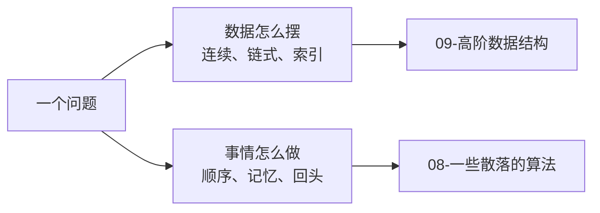

# 导读：算法只是问题的解法

> **授权**：本章节属教材文档部分，采用 [CC BY-NC-ND 4.0](../LICENSE)
> 加[附加条款](../许可附加条款.md)授权：署名、非商业、禁止演绎、不允许二次分发。
> 文中引用的代码不受此限，各自保留原有许可证，详见[版权与许可说明.md](../版权与许可说明.md)。

同一个需求可以写出四份程序。要从一百万个整数里取出最大的十个，第一份先把整份数据
排好序，再取末尾十个；第二份维护一个只装十个元素的小堆，从头扫到尾；
第三份只做一次划分，把大的那一边找出来再往里看；第四份连堆都不用，
一边扫一边记住当下的门槛，比门槛大才换进来。四份程序的数据是同一块连续内存、
同一个容器，**摆法一个字节都没变**；变的只是这件事按什么顺序做、
中间要记住什么、什么时候回头。

这类问题在写代码时随处可见。要在一百万条记录里按键找一条，
要在配置文件里剥掉注释，要从一堆候选里按权重抽一个，要判断两段文本像不像，
要把内存装不下的一亿行日志按时间排好，要在状态空间里找一条路。
它们的数据摆法各不相同，追问的却是同一件事：**这件事该按什么顺序做。**

`09-高阶数据结构` 板块回答的是「数据怎么摆」，本章节所在的板块回答的是
「事情怎么做」。那一边已经把容器、树、图与它们各自的算法铺完，
剩下的是那些不依附于任何一种摆法的解法：递归、查找与排序的策略、搜索、
贪心与动态规划、字符串匹配、扫描与状态机、随机与采样。它们换一种摆法照样成立，
代价却要重新算一遍。读完本章节，拿到一个问题应当能先给它归个类，
知道先想到哪一个解法、那个解法在哪一章、代价大概落在哪一笔账上；
也能判断什么时候不该自己写，直接用标准库或现成的件就够了。

**读法先交代一句：`09-高阶数据结构` 是主线，本板块是补充资料，两边混着看**——
第 1 节把这条读法展开。

---

> **约定**：标注以行内代码单独成行——`实测数据` 表示实际执行验证过，复现命令随程序给出；
> `文档` 表示引自标准草案或官方资料；`待确认` 表示尚未验证。路径占位符（如 `<MinGW>`、`<工作区>`）的含义见《README.md》。
> 本章节引用的数字都来自第 `01` 到第 `03` 章的程序：Windows 侧是 g++ 16.2.0、`-O2`，
> Linux 侧是 g++ 13.3.0，两边分表列出，不放进同一张对照表。

# 本章节定位

| 需要先知道 | 在哪 |
|---|---|
| 数组、下标与地址的关系 | 《04-语法/08-数组、指针与引用.md》第 2.1 节 |
| 函数调用时机器上做了什么 | 《04-语法/07-函数.md》第 1.2 节 |
| 栈帧与影子空间 | 《06-更底层/05-ABI 与调用约定.md》第 1 节 |
| 对象在栈上、堆上还是静态区 | 《06-更底层/01-对象在哪里：栈、堆与静态区.md》第 5 节 |
| 缓存行与访问局部性 | 《06-更底层/02-对齐、填充与缓存.md》第 3 节 |
| `-O2` 会做哪些优化 | 《03-构建工具链/05-优化等级.md》第 5 节 |
| `std::vector` 的容量与扩容 | 《09-高阶数据结构/A-01-连续存储：array 与 vector.md》第 3 节 |
| 迭代器是容器与算法之间的契约 | 《09-高阶数据结构/A-06-迭代器与范围：容器与算法之间的接口.md》第 1 节 |
| 反复取最小值为什么用堆 | 《09-高阶数据结构/A-05-后进先出、先进先出与优先级：stack、queue 与堆.md》第 3 节 |
| C 的可变参数四件套 | 《04-语法/07-函数.md》第 6 节 |
| 随机引擎与分布是两回事 | 《07-标准库/B-05-数值.md》第 4 节 |
| 代价只能测，不能猜 | 《09-高阶数据结构/A-00-导读：数据结构是问题的形状.md》第 3.3 小节 |

**相邻的章节**：本章节是 `08-一些散落的算法` 板块的入口（篇目表见
《08-一些散落的算法/README.md》章节），与它并排的是 `09-高阶数据结构` 板块：
那一边讲数据怎么摆，这一边讲事情怎么做，分工在第 4.2 小节逐项列出。
**读法上 `09` 是主线，本板块作补充**——`09` 能独立走完，而本板块的每一章
都要借它或别的板块的一块内容（第 2.3 小节那张表逐章列出）。
本板块内部，第 `01` 到第 `03` 章打底（递归、记忆化与分治、不定参数），
第 `04` 章起按问题分类展开：`04` 找，`05`、`06` 排，`07`、`08` 走图，
`09` 判与计数，`10` 到 `12` 讲字符串、扫描与随机，`END` 收口。
**第 `00` 到第 `12` 章与 `END` 都已写入**，按需取用即可。

| 本章各节 | 讲什么 |
|---|---|
| 第 1 节 | 先读哪一本：`09` 是主线，本板块作补充；手上的事对应哪一章 |
| 第 2 节 | 这些解法为什么散着放：摆法是摆法，解法是解法 |
| 第 3 节 | 算法基础与原理：三类问题（找、排、判）、两种手法，以及递归深度与不定参数两笔实测 |
| 第 4 节 | 与 `09-高阶数据结构`、`10-并发与并行` 的边界 |
| 第 5 节 | 哪些场合会撞上这些解法，什么信号出现时该回来 |

---

# 第 1 节 读完这一篇，尽早转到 `09`

## 1.1 先读 `09`，两边混着看

**看完这一篇就可以转到 `09-高阶数据结构`，不必先把本板块读完。**
`09` 是一条能独立走完的主线：它从需求推出数据的形状，一路把容器、迭代器、树、图
与它们各自的算法铺完。本板块的每一章都要先借别人的一块内容——二分要先有能按下标跳的
连续存储，广搜要先有一张邻接表，记忆化要先有一个能按下标取的容器，
第 2.3 小节逐章列出了借的是哪一块，**表里每一行都指向 `09` 或别的板块**。

**混着看是推荐的做法**：`09` 读到哪种摆法，就回来翻本板块对应的那一章——
读完连续存储，回来读第 `04` 章与第 `05`、`06` 章；读完堆，回来读「只要前几名，
不要全序」那几种做法；读完图，回来读第 `07`、`08` 章。这时候每一句代价都有落点，
不必等 `09` 全部读完再回来。反过来走也通：手上正好有一件事，
按第 1.2 小节的表翻到对应那一章，读完再回头补 `09` 里缺的那一块。

**本板块是补充资料，不是必须先走完的一段路。** 手上的工作只是把数据放进容器、
按接口取用，`09` 就够用，这里可以先放着；等第 5.2 小节那几种信号出现时再回来。
除第 `01` 章外，各章之间没有必须的先后，递归是后面好几章共用的手法，
它的三件套（基线、推进、合并）不清楚，分治与回溯读起来会一直卡壳。

**为什么它排在 `09` 前面。** 编者的用意是让读者先看到上面这条指引，
再加上一组算法的基础与原理：三类问题（找、排、判）怎么归类、
递归能走多深由什么决定、改写成迭代要付什么代价、不定参数的四条路各自贵在哪
（第 3 节）。**排在前面的是这条指引与这组原理，不是十二个算法**；
十二个算法按需查即可。

| 你现在的状态 | 先读哪一本 | 为什么 |
|---|---|---|
| 两本都还没开始 | **`09-高阶数据结构` 先走一遍** | 它能独立走完，本板块的每一章都要借它的一块内容 |
| 一边读 `09`，一边有具体的算法问题 | **两边混着读** | 读到哪种摆法，就回来翻对应的那一章，代价才有落点 |
| 手上正好有一件事，想马上动手 | 按第 1.2 小节的表跳到对应那一章 | 各章之间没有必须的先后，递归那一章除外 |
| 已经读完 `09` | 本板块从头读，第 `01` 章先读 | 递归是后面好几章共用的手法 |
| 只想查一个解法的前提与代价 | 按第 1.2 小节的表定位，查完就走 | 本板块作补充资料用，不必顺序读 |

## 1.2 你手上的事 → 先去哪一章

这是一张入口表，不是答案表：每一行只指到「先读哪一章」，判据在那一章里。
凡是问「数据怎么摆」的行都指向 `09`——那一半应当先读。

| 你手上的事 | 先去哪一章 | 为什么先去那儿 |
|---|---|---|
| 很多条记录里要反复问「在不在」 | 《08-一些散落的算法/04-查找：从线性到索引.md》章节 | 三种摆法的代价与交叉点都在那一章 |
| 规模很小，只是要找一个键 | 《08-一些散落的算法/04-查找：从线性到索引.md》章节 | 小规模时从头扫过去就是最优解 |
| 数据摆进内存了，不知道该用哪种容器 | 《09-高阶数据结构/README.md》章节 | 那一板块按需求反查容器 |
| 每次都要取出最紧急的那一件 | 《09-高阶数据结构/A-05-后进先出、先进先出与优先级：stack、queue 与堆.md》第 3 节 | 堆只维护「最值在上面」 |
| 反复判两个元素是否连通 | 《09-高阶数据结构/A-12-不相交集合：只要连通性.md》章节 | 并查集把「判连通」做到摊还常数 |
| 数据之间是一张网（路网、依赖、社交） | 《09-高阶数据结构/A-10-图：关系怎么存.md》章节 | 先把关系存下来，再谈怎么走 |
| 反复问区间和、反复做区间加 | 《09-高阶数据结构/A-11-区间查询：前缀和、差分与稀疏表.md》章节 | 前缀和与差分各有各的回本点 |
| 一个函数要收不定个数的参数 | 《08-一些散落的算法/03-不定参数：从 printf 到可变模板.md》章节 | 从 `va_list` 到可变参数模板的取舍 |
| 递归写下去发现栈不够用 | 《08-一些散落的算法/01-递归：把问题交给自己.md》章节 | 深度上限与改迭代的三种手法 |
| 同一个子问题被反复算 | 《08-一些散落的算法/02-记忆化、分治与回溯.md》章节 | 记忆化与自底向上递推 |
| 一份数据要按关键字排好 | 《08-一些散落的算法/05-排序（一）：比较排序的三种策略.md》章节 | 比较排序的三种策略与合并代价 |
| 键的范围很小，或者数据大到内存装不下 | 《08-一些散落的算法/06-排序（二）：不比较也能排.md》章节 | 不比较的排序与外部排序的前提 |
| 要在状态空间里找一条路（迷宫、拼图、最少步数） | 《08-一些散落的算法/07-搜索：在状态空间里找路.md》章节 | 深搜、广搜、Dijkstra 与 A* 的对照 |
| 任务之间有依赖，要排出个先后 | 《08-一些散落的算法/08-图上的结构性问题.md》章节 | 拓扑排序、强连通分量、割点与桥 |
| 每一步都选当前最好的，不确定对不对 | 《08-一些散落的算法/09-贪心与动态规划.md》章节 | 贪心成立的条件与动态规划的状态定义 |
| 要在长文本里找一段模式 | 《08-一些散落的算法/10-字符串匹配.md》章节 | KMP 的失配函数与 Rabin–Karp 的哈希 |
| 要在文件里剥注释、切词、校验格式 | 《08-一些散落的算法/11-扫描与状态机.md》章节 | 一遍扫描与状态机的三种表达 |
| 要按权重抽样、要可复现的随机 | 《08-一些散落的算法/12-随机与采样.md》章节；引擎与分布在《07-标准库/B-05-数值.md》第 4 节 | 洗牌、蓄水池抽样、加权抽样 |
| 遇到一个没见过的问题 | 《08-一些散落的算法/END-陌生问题怎么找解法.md》章节 | 先分类、再降规模、再找相似的结构 |

---

# 第 2 节 这些解法为什么散着放

## 2.1 同一块数据，好几种做法

把开头那四份程序摊开看，它们的数据完全一样：一百万个 `int` 挤在一块连续内存里，
顺序一致，容量一致。差别全在「做什么、按什么顺序做、中间记住什么」。

| 做法 | 它干了什么 | 用不上的部分 |
|---|---|---|
| 全排序后取末尾十个 | 把一百万个元素排成完全有序 | 后面九十九万多个元素的相对次序没人要 |
| 只装十个元素的小堆 | 每个元素跟堆顶比一次，比得过的换进来 | 一点也没浪费，但每个元素都要碰一次 |
| 做一次划分 | 把比基准大的挪到一边，只往那一边看 | 两边的内部次序没人要 |
| 一遍扫描维护门槛 | 只记当前第十大的值，其余一概不看 | 一点也没浪费，连划分都不用 |

四种做法的答案一样，做的事却差着数量级：第一份把「排序」这件完整的事做完了，
第四份连「有序」这个目标都没提。**它们不是同一件事的不同写法，
而是同一批数据上不同的做事顺序。** 而顺序一换，要付的账就换了一本——
比较几次、搬动几次、多占多少内存，三笔账此消彼长，
没有哪一种做法在每一笔上都赢。

## 2.2 摆法是摆法，解法是解法

| 词 | 回答的问题 | 例子 |
|---|---|---|
| **摆法** | 数据放在哪、按什么组织、谁能直接跳到谁 | 一块连续内存、一串用指针连起来的节点、一张按键组织的索引表 |
| **解法** | 这件事按什么顺序做、中间记住什么、什么时候回头 | 每次砍掉一半区间、分成两半各自处理再合并、放一个试下去不行再撤 |

两者常常一起出现，但不是同一件事，可以从两个方向看。

**同一个做法，摆在不同的地方，代价不同。** 二分查找的比较顺序只有一套：
每次看中间那个，比目标小就往右半边去。这套顺序在有序数组上每一步都落在连续内存上，
在链表上每一步都要顺着指针跳一次，在磁盘文件上每一步可能是一次真正的读取。
顺序一个字没改，代价却从「一次比较」变成「一次跳转」再变成「一次读盘」。

**同一种摆法，配不同做法，也能写出好几种组合。** 就以上面那批整数为例：
要全部有序，用完整排序；只要最大的十个，用小堆或一次划分；
只要中位数，用一次划分就够；只想统计有没有超过某个值的，一遍扫描就够。

`Mermaid`

**一条好用的判据**：把这个做法从这种摆法上拿开，它还讲得清吗。
二分查找离开「能按下标跳到中间」就讲不清，它的边界写法与差一错误跟着数据结构讲更顺；
而「分成两半各自处理再合并」在数组上、链表上、处理磁盘文件的外部排序里都成立，
它就是一种独立的解法。

> [!IMPORTANT]
> **算法只是问题的解法。**
> 问题先来，解法应它而生：需求问什么，决定了解法按什么顺序做。
> 同一个解法可以搬到别的摆法上照用，但它在那里的代价不跟着搬——
> 比较次数、搬动次数、额外内存这三笔账，每换一次摆法都要重新算一遍。
> 因此本板块按**问题**组织，不按算法的名字组织：先看你要的答案是什么形状，
> 再找对应的一类解法，最后才看它叫什么名字。

## 2.3 剩下的解法为什么挂不到结构上

`09-高阶数据结构` 已经把「挂得上结构」的算法都收走了：树的前中后序与层序遍历、
堆的上浮与下沉、图的两种遍历、并查集的 `find` 与 `unite`。
它们的共同点是**离开那种摆法就讲不清**：上浮与下沉靠「用数组下标算父子」，
层序遍历靠「队列里存着下一层的节点」，`find` 靠「顺着父指针往上走」。
收剩下的这些不属于任何一个结构：

| 解法 | 谁在用它 | 在哪一章 |
|---|---|---|
| 递归 | 分治、回溯、动态规划，以及后面几乎所有解法 | 《08-一些散落的算法/01-递归：把问题交给自己.md》章节 |
| 记忆化 | 同一个子问题被反复算的场合、动态规划的自顶向下写法 | 《08-一些散落的算法/02-记忆化、分治与回溯.md》章节 |
| 分治 | 归并排序、快速排序、快速选择、大文件的外部排序 | 《08-一些散落的算法/02-记忆化、分治与回溯.md》章节、第 `05` 章 |
| 回溯 | 八皇后、数独、组合枚举，一切「放一个再撤一个」 | 《08-一些散落的算法/02-记忆化、分治与回溯.md》章节 |
| 查找策略 | 一条条比、二分、另建索引之间的取舍 | 《08-一些散落的算法/04-查找：从线性到索引.md》章节 |
| 排序策略 | 比较排序、不比较的排序、稳定性与前提 | 《08-一些散落的算法/05-排序（一）：比较排序的三种策略.md》章节、第 `06` 章 |
| 搜索 | 迷宫、拼图、路网，状态空间里的最短路 | 《08-一些散落的算法/07-搜索：在状态空间里找路.md》章节 |
| 贪心与动态规划 | 「每一步选当前最好的」与「把子问题的答案存下来」 | 《08-一些散落的算法/09-贪心与动态规划.md》章节 |
| 扫描与状态机 | 剥注释、切词、格式校验 | 《08-一些散落的算法/11-扫描与状态机.md》章节 |
| 随机与采样 | 抽奖、负载均衡、洗牌、按权重抽样 | 《08-一些散落的算法/12-随机与采样.md》章节 |

它们之间的关系不是「谁包含谁」，而是一张互相借用的网：递归被分治、回溯、
动态规划共用；记忆化既属于动态规划，也是把递归改成递推的一种手法；
扫描既是字符串匹配的底层动作，也是词法分析的骨架。
**既然挂不到同一棵树上，就按「解决哪类问题」摆成一排，彼此之间没有包含关系。**
`01` 到 `03` 是打底的三章，`04` 到 `12` 按问题分类展开，`END` 收口。

**这些章各自都要借 `09` 或其它板块的一块内容**，借的是哪一块，可以按下面的表对照：

| 本板块的章 | 要借的哪一块 |
|---|---|
| 第 `01`、`02` 章 递归与分治 | 栈帧与栈的空间（《06-更底层/05-ABI 与调用约定.md》第 1 节） |
| 第 `04` 章 查找 | 连续存储的地址计算（《09-高阶数据结构/A-01-连续存储：array 与 vector.md》第 3 节）、有序容器（《09-高阶数据结构/A-03-索引存储：map、set 与有序.md》第 2 节） |
| 第 `05`、`06` 章 排序 | 连续存储的搬移代价与容量（《09-高阶数据结构/A-01-连续存储：array 与 vector.md》第 3 节） |
| 第 `07`、`08` 章 搜索与图 | 图的两种存法（《09-高阶数据结构/A-10-图：关系怎么存.md》章节）、并查集（《09-高阶数据结构/A-12-不相交集合：只要连通性.md》章节） |
| 第 `09` 章 判定与计数 | 能按下标取的表与区间和（《09-高阶数据结构/A-11-区间查询：前缀和、差分与稀疏表.md》第 2 节） |
| 第 `10`、`11` 章 匹配与扫描 | 字符串与视图（《07-标准库/B-02-std-string 与 string_view.md》第 2 节） |
| 第 `12` 章 随机与采样 | 随机引擎与分布（《07-标准库/B-05-数值.md》第 4 节） |

**这张表也是「先读 `09`」这条读法的具体依据**：本板块没有哪一章是从零开始的。

## 2.4 五个阶段：问题、模型、解法、实现、代价

与 `09-高阶数据结构` 一样，本板块的每一章都按同一条路线推进，
只是重点落在不同的格子上。代价那一格不够用时，就回到解法那一格换一种做法。

| 阶段 | 回答的问题 | 判断「做完了」的标准 |
|---|---|---|
| **问题** | 要的答案是什么形状？规模多大？问几次？ | 能写出具体规模与次数，例如「一百万条数据，两千次查询」 |
| **模型** | 答案长在什么结构上？数组、树、图，还是一张看不见的状态图？ | 能画出图，能说清每一步从哪里取数据 |
| **解法** | 按什么顺序做？中间记住什么？什么时候回头？ | 能手算走通一个小例子，包括「找不到答案」那一次 |
| **实现** | 边界怎么处理？递归多深？内存从哪来？ | 能跑，空数据、只有一个元素、答案不存在这三种情况都交代过 |
| **代价** | 比较几次、搬动几次、多占多少内存？ | **有本机跑出来的数字**，不是「应该很快」 |

**这条路线是本板块与「背算法名字」的分界线。** 只记住「快排平均 `O(n log n)`」
是结论，属于最后一格；知道它为什么快、什么时候退化成 `O(n^2)`、
退化时换一个基准能不能救回来，才算走完了整条路线。
第 `05` 章会拿同一份数据把几种比较排序放在一起比，比的就是最后那一格。

---

# 第 3 节 算法基础与原理

## 3.1 先问答案是什么形状

拿到一个问题，先问的不是「该用哪个算法」，而是**我要的答案是什么形状**。
按答案的形状，本板块后面的十几章可以归成三类：

| 类 | 答案的形状 | 覆盖哪些问题 |
|---|---|---|
| **找** | 「在哪」或「有没有」 | 在数据里定位、在状态空间里找路、在字符串里找模式 |
| **排** | 「顺序」 | 比较排序、不比较的排序、按优先级取 |
| **判** | 「有多少种」或「行不行」 | 判定与计数：回溯、动态规划、匹配 |

三类的差别不在难度，而在**要付的账不一样**：找这一类比的通常是比较次数与访问代价；
排这一类比的是比较与搬动两笔账，还要问「数据长什么样」；
判这一类比的常常是「试了多少个分支」与「同一个子问题被算了几遍」。
按难度分（简单、中等、困难）学不到什么，难度是相对的；
按技巧分（双指针、滑动窗口、位运算）会把同一个问题的几种解法拆进不同的抽屉，
读者记住的只是一串名字。**按答案的形状分，问题一到手就能归类**，名字放在最后再记。

**这一节各张表里的数字，全部来自第 `01` 到第 `03` 章的程序**，也就是
《08-一些散落的算法/01-递归：把问题交给自己.md》章节、
《08-一些散落的算法/02-记忆化、分治与回溯.md》章节与
《08-一些散落的算法/03-不定参数：从 printf 到可变模板.md》章节。
本章节把它们并排摆进表格，每一行都写明是哪一章的哪个程序跑出来的；
`实测数据` 块与复现命令留在那三章。

## 3.2 找：定位、找路与找模式

「找」这一类里有三种问法，它们的解法互不通用。**定位**是在一堆数据里找一个键，
数据摆成什么样，决定了该按什么线索走；**找路**是在状态空间里找一条路径，
起点、终点与每一步的几种走法构成一张看不见的图；**找模式**是在一段文本里
找一段模式串出现的位置。

三种问法要付的账也不同。定位数的是比较次数，还要乘上「每一次比较有多贵」——
连续内存上的一次比较与顺着指针跳一次不是一个价。找路数的是访问过的状态数，
以及每个状态要花多少工夫找出它的邻居。找模式数的是「失配之后要不要回头重扫」——
朴素做法每次失配都从下一个位置重来，KMP 这类做法把已经比过的信息留下来，
让主串的指针一直往前走。三种账的量纲都不一样，判据要分开记。

| 真实场景 | 先想到什么解法 | 在第几章 |
|---|---|---|
| 十万条文件名的清单，启动时问两千次「这个文件在不在」 | 排序后二分，或者另建一张能直接定位的表 | 《08-一些散落的算法/04-查找：从线性到索引.md》章节 |
| 规模很小、问的次数也不多 | 从头扫过去就够了，先不排序建表 | 《08-一些散落的算法/04-查找：从线性到索引.md》章节 |
| 要在文件里剥掉注释、找出一段被引号包住的文本 | 一趟扫描加一个状态机，边走边换状态 | 《08-一些散落的算法/11-扫描与状态机.md》章节 |
| 要在长文本里找一段模式串 | 朴素匹配先跑通，数据有结构时换 KMP 或 Rabin–Karp | 《08-一些散落的算法/10-字符串匹配.md》章节 |
| 从起点走到终点，每一步有好几种走法 | 深搜先走到头；要最少步数用广搜；边有代价用 Dijkstra 或 A* | 《08-一些散落的算法/07-搜索：在状态空间里找路.md》章节 |
| 任务之间有依赖，要排出个先后 | 拓扑排序；走不通说明有环 | 《08-一些散落的算法/08-图上的结构性问题.md》章节 |

**「找」这一类的代价账，《08-一些散落的算法/04-查找：从线性到索引.md》章节已经算过一遍**：
它把三种摆法放在同一批数据、同一批问题上，比较次数与每次查询的耗时并排放在同一张表里，
连交叉点落在什么位置都标了出来。模式匹配那一笔在
《08-一些散落的算法/10-字符串匹配.md》章节，找路那一笔在
《08-一些散落的算法/07-搜索：在状态空间里找路.md》章节。

## 3.3 排：比较、不比较、按优先级取

「排」这一类要的答案是顺序，它有两种完全不同的前提：**比较排序**只假设元素之间
能比大小，什么数据都能排；**不比较的排序**要求数据本身带结构（键是范围很小的整数、
键能按位切开），换来的是线性时间。还有第三种需求不是「排好」，
而是「每次取出最紧急的那一件」——它只要一个最值，不必全序。

| 真实场景 | 先想到什么解法 | 在第几章 | 一笔真实的账（哪一章哪个程序） |
|---|---|---|---|
| 一份固定的数据要排好序 | 分成两半各自排好再合并，或者选一个基准把小的丢左边 | 《08-一些散落的算法/05-排序（一）：比较排序的三种策略.md》章节 | 第 `02` 章的 `divide_conquer.cpp`：n=1024 时归并（辅助数组）比较 9043 次、搬移 20480 次 |
| 辅助空间紧张，想把归并改成原地搬移 | 在原数组里腾挪，不再借辅助数组 | 《08-一些散落的算法/05-排序（一）：比较排序的三种策略.md》章节 | 同一个程序：原地搬移版比较还是 9043 次，搬移涨到 264420 次 |
| 同一份数据交给标准库 | `std::sort`（内省排序） | 《08-一些散落的算法/05-排序（一）：比较排序的三种策略.md》章节；接口在《09-高阶数据结构/A-06-迭代器与范围：容器与算法之间的接口.md》第 1 节 | 同一个程序：`std::sort` 比较 12163 次（它不搬元素，只交换） |
| 只要前几名，不要全序 | 维护一个只装 k 个的堆，或者只做一部分划分 | 《08-一些散落的算法/05-排序（一）：比较排序的三种策略.md》章节 | —— |
| 键的范围很小（年龄、成绩、一个字节） | 不比较，直接数每个键出现几次 | 《08-一些散落的算法/06-排序（二）：不比较也能排.md》章节 | —— |
| 数据大到内存装不下 | 外部排序：分块排好写回磁盘，再做多路归并 | 《08-一些散落的算法/05-排序（一）：比较排序的三种策略.md》章节 | —— |
| 反复取出最紧急的那一件 | 用堆，只维持「最值在上面」 | 《09-高阶数据结构/A-05-后进先出、先进先出与优先级：stack、queue 与堆.md》第 3 节 | —— |

三行加起来说明一件事：**同一批数据、同一个结局，比较与搬动这两笔账可以互相换。**
两份归并程序的比较次数一模一样，都是 9043 次，因为它们的比较顺序完全相同；
差别只在「把元素搬到哪里」——借一块辅助数组搬，只搬 20480 次；
在原数组里腾挪，要搬 264420 次，是前者的十几倍。`std::sort` 走了第三条路：
比较次数多一些（12163 次），却把搬动换成了交换，一次交换只碰两个元素，
不需要一整块辅助空间。同一个程序里还有一行印证这点：**三个版本排出来的结果完全一样。**

## 3.4 判：判定与计数

「判」这一类要的答案是「有多少种可能」或者「行不行」。它的解法有一个共同的动作：
**把大问题拆成「先做一个选择，再解决剩下的」**，于是搜索空间长成一棵树；
不同的解法只是在树上砍掉不同的枝。

| 真实场景 | 先想到什么解法 | 在第几章 | 一笔真实的账（哪一章哪个程序） |
|---|---|---|---|
| 八皇后这类「放一个、试下去、不行再撤」 | 回溯：选择与撤销成对，剪枝放在放子之前 | 《08-一些散落的算法/02-记忆化、分治与回溯.md》章节 | 第 `02` 章的 `queens.cpp`：n=8 时剪枝版试放子 15720 次，解数 92 |
| 同一份数据换成暴力枚举 | 走完所有排列，再逐个检查 | 《08-一些散落的算法/02-记忆化、分治与回溯.md》章节 | 同一个程序：暴力版枚举 40320 个排列，检查对角线 235090 次，解数同样是 92 |
| 皇后数从 8 加到 13，想知道规模再往上加会怎样 | 还是回溯，但要看住「试放子次数」的增长 | 《08-一些散落的算法/02-记忆化、分治与回溯.md》章节 | 同一个程序：n=13 时解数 73712，试放子 59815314 次，三次取平均 149.47 ms |
| 同一个子问题被反复算 | 记忆化（把答案记在表里）；或者自底向上递推 | 《08-一些散落的算法/02-记忆化、分治与回溯.md》章节 | 第 `02` 章的 `memo_fib.cpp`：朴素递归进函数 2692537 次；记忆化 59 次（命中 27 次，表长 31）；自底向上 1 次 |
| 两种方案怎么对齐（改动最少、最长公共部分） | 动态规划：定义状态与转移，把子问题的答案存下来 | 《08-一些散落的算法/09-贪心与动态规划.md》章节 | —— |
| 每一步都选当前最好的 | 先试贪心，再用一组反例或交换论证检查它是否成立 | 《08-一些散落的算法/09-贪心与动态规划.md》章节 | —— |

**`queens.cpp` 的那两行最能说明「剪枝放在哪里」值多少钱**：两份程序要的是同一个答案，
n=8 都是 92 种放法。剪枝版只试了 15720 次放子，一个立不住的分支都不进去；
暴力版要走完 40320 个完整排列，摆完再检查 235090 次对角线。
**同一批数据、同一个答案，两边做的事完全不是一回事。**

`memo_fib.cpp` 的那三行则是另一种砍法：它砍的不是分支，而是**重复**。
朴素递归进函数 2692537 次，其中绝大多数是在算已经算过的子问题——
这个数还能与闭式解对上：`2 × fib(31) − 1 = 2 × 1346269 − 1`。
把答案记进表之后，进函数 59 次；连递归都不要、自底向上填表，只进函数 1 次。

## 3.5 三类之间互相借用

分类是为了判断先想到什么，不是为了把问题切开。真实的问题经常同时落进两类，
分界线在「你要的答案是哪一个」上。

| 交叉的地方 | 为什么 | 涉及哪几章 |
|---|---|---|
| 排序是查找的前置 | 二分要求区间有序，想快就得先付一次排序的代价 | 第 `04`、`05` 章 |
| 查找是排序的一部分 | 归并的合并、快排的划分，每一步都在回答「这个元素该去哪边」 | 第 `05` 章 |
| 匹配既是找也是判 | 「模式在第几位出现」是找，「有几种对法、最少改几处」是判 | 第 `09`、`10` 章 |
| 记忆化横跨递归与判定 | 它既是把递归改写成递推的手法，也是动态规划填表的骨架 | 第 `01`、`02`、`09` 章 |
| 扫描既是找也是判 | 找模式要一遍扫过去，校验格式也要一遍扫过去 | 第 `10`、`11` 章 |
| 随机与查找共用一件工具 | 按权重抽样靠前缀和加一次定位 | 第 `12` 章；前缀和本身在《09-高阶数据结构/A-11-区间查询：前缀和、差分与稀疏表.md》第 2 节 |

**判据只有一条：先问「我要的答案是哪一个形状」。**
同一个程序里两件事都要做时，分别找对应的那一章，不要指望一章解决两件事。

## 3.6 三类之外的两种手法：递归与不定参数

本板块有两章不属于上面三类，因为它们回答的不是「要什么答案」，
而是「怎么写」——**它们是手法，不是问题类**。

| 手法 | 它被谁用 | 在哪一章 |
|---|---|---|
| 递归 | 分治、回溯、动态规划、树与图的各种走法，以及不定参数的展开 | 《08-一些散落的算法/01-递归：把问题交给自己.md》章节 |
| 不定参数 | 日志与格式化输出、可变参数模板、折叠表达式 | 《08-一些散落的算法/03-不定参数：从 printf 到可变模板.md》章节 |

**递归这一章放在最前面，是因为它被后面好几章共用。** 一个递归写法只要三件事讲清楚
就站稳了：**基线**（什么时候不再往下走）、**推进**（这一步把问题缩小成什么）、
**合并**（子问题的答案怎么拼成这一步的答案）。三件事各缺一件，
写出来的东西不是死循环就是答案不对；三件事都清楚，递归树就能画出来，
节点数、深度、同一个子问题被算了几遍也就数得出来。

**不定参数这一章放在第三位，是因为它是一条从 C 走到 C++ 的路。**
C 的 `va_list` 四件套能用，但类型靠调用方约定，写错类型在标准里是未定义行为；
C++ 给了可变参数模板与折叠表达式，类型在编译期就定下来。
两边的取舍要用代价说话，所以这一章也是本板块里唯一一章以语言机制为主线的。

## 3.7 递归的深度与改迭代的代价

递归写得再漂亮，也要落在真实的栈上。**能递归多少层不由语言规定，而由栈的上限决定**，
所以第一件要测的事就是「一个栈帧有多大、栈有多大」。

| 项 | 主线程 | 新线程 |
|---|---|---|
| 栈区间 | 2048 KiB（链接器给的默认值） | 4096 KiB（创建时点明 4 MiB） |
| 帧间距（每帧字节数） | 112 字节 | 112 字节 |
| 本次递归到多少层停下 | 16362 到 16379 层之间 | 35089 到 35097 层之间 |

这张表来自第 `01` 章的 `stack_limit.cpp`。前两行是**结构量**，重跑逐位相同；
第三行**不是逐位可复现的量**：三次运行分别落在 16379 / 16373 / 16376（主线程）
与 35093 / 35097 / 35092（新线程），因此写成区间。原因是栈的入口偏移——
每次启动的实参与环境块长度不同，栈顶的起点就不同，「还能往下走多少层」跟着变。
**逐位能重跑的是栈区间与每帧字节数。** Linux 侧的同一套探测逻辑重编之后
（g++ 13.3.0），数字要分表看：

| 项 | Linux（g++ 13.3.0） |
|---|---|
| `RLIMIT_STACK` 软上限 | 8192 KiB |
| 每帧字节数（同一份写法） | 112 字节 |
| 本次递归到 | 72454 到 72503 层之间（三次运行） |

> [!CAUTION]
> **递归的深度上限不在语言这一层，超了就是直接崩。**
> 栈区间由链接器与操作系统给（上面这一组是 2048 KiB 与 8192 KiB），
> 每帧 112 字节，两者一除就是上限。第 `01` 章的程序里就有一次现成的例子：
> 一个「干净的尾递归」函数里取了一个局部变量的地址存到全局，一亿层直接栈溢出，
> 退出码 `0xC00000FD`。**写回溯或深搜之前先估算深度：栈装不下的后果不是答案算错，
> 而是进程直接终止。**

递归改迭代有三种手法，代价差多少也有数。第 `01` 章的 `rec_to_iter.cpp` 在
同一棵一百万个节点的树上做中序遍历：递归版与显式栈版算出来的和都是 549755289600，
节点数 1048575，显式栈用到的最大深度 20；耗时（各 20 遍取平均）是
递归 0.550 ms、显式栈 0.987 ms。同一份程序里的汉诺塔 24 层更能看出差别：
两种做法都是 16777215 次移动，状态机的显式栈最大深度 25，
而耗时落在递归 4.14 到 4.17 ms 与状态机 172.15 到 172.32 ms 之间——
**同样多的步数，递归靠机器栈走得快，显式栈把状态搬到了自己手里，代价跟着上来。**

还有一件常被误解的事：**尾递归能不能变成循环，标准不管。**
`C++` 标准通篇没有出现 `tail call` 与 `tail recursion` 这两个词，
第 `01` 章的汇编对照显示：`-O0` 下那条递归调用是一条 `call`，
`-O2` 下一条 `call` 都没有，函数把自己写成了往回跳的循环。
**它是这套编译器在 `-O2` 下做的选择，不是语言给的保证。** 条件也不难说：
调用之后不能还有事要做（写回这一帧、析构局部对象），局部变量的地址也不能逃出去——
`tail_call.cpp` 里那份「帧里有 `std::string`」的版本，每帧 112 字节，
4000 层就是 448000 字节的位移，这正是栈上真的叠起来的样子。

## 3.8 不定参数：四条路与一个类型陷阱

同一个「把八个数加起来」，第 `03` 章的 `variadic_template.cpp` 给出了四条路，
结果完全一样：

| 做法 | 八个数求和 | 各跑 2000000 遍折算成单次 |
|---|---|---|
| 折叠表达式 | 36 | 0.6 ns |
| `va_list` | 36 | 2.1 ns |
| `initializer_list` | 36 | 9.8 ns |
| 数组循环 | 36 | 2.2 ns |

四条路读的是同一份 `volatile` 数组，每轮都真的读一遍。**这一列数有一个前提**：
若把它们写成普通常量数组，整段求和就是循环不变的，优化器会把它提到循环外，
测出来的是 0.1 ns 这种「看着更快」的假数。同一份程序还打出了两个编译期就知道的值：
参数包里有 3 个参数，`sizeof(std::initializer_list<int>)` 是 16 字节。

**另一个陷阱在类型上。** 第 `03` 章的 `varargs_trap.cpp` 把同一个 `double` 的位模式
按 `unsigned long long` 读出来，得到 `400921F9F01B866E`；
按 `unsigned` 读出来得到 `F01B866E`，正好是低 32 位；两串位一样。
这看起来像是「读什么类型都行」，实际恰好相反：**读错类型在标准里是未定义行为，
这里能读出这个位模式，只保证本机这套 ABI 上是这样，换平台可能换一个结果。**
默认实参提升也是同一类陷阱：传 `float` 进去，读的时候要按 `double` 读，
因为它在传参时已经被提升过。

---

# 第 4 节 与 `09`、`10` 的边界

## 4.1 一条判据：这个做法离得开那种摆法吗

两个板块的分工只有一条判据，问法很具体：**把这个做法从那种摆法上拿开，还讲得清吗。**

| 做法 | 拿开摆法之后 | 归哪 |
|---|---|---|
| 堆的上浮与下沉 | 讲不清——它靠「用数组下标算父子」，离开数组这个形状就没有父子 | `09` |
| 树的前中后序遍历 | 讲不清——顺序由树的形状定义 | `09` |
| 并查集的 `find` 与路径压缩 | 讲不清——它沿父指针往上走 | `09` |
| 分成两半各自排好再合并 | 讲得清——数组上成立，链表上成立，磁盘文件上也成立 | 本板块 |
| 每次砍掉一半区间 | 讲得清——只要「能按位置跳过一半」，用什么容器都行 | 本板块 |
| 一层一层往外扩的广搜 | 讲得清——只要有一张邻接表或一个「邻居是谁」的函数 | 本板块 |

判据的第二种问法更直白：**问的是「件」还是「策略」。**
`std::sort`、`std::lower_bound`、`std::find` 这些是「件」，它们的名字、参数、
返回值、迭代器要求属于接口，归 `09`；而「`std::sort` 为什么用内省排序」
「二分为什么必须先有序」「什么时候二分比哈希表更合适」是策略，归本板块。

## 4.2 逐项分工

| 内容 | 归哪 | 理由 |
|---|---|---|
| 树遍历（前中后序、层序） | `09` | 遍历顺序由树的形状定义 |
| 堆的上浮与下沉、`priority_queue` 的接口 | 《09-高阶数据结构/A-05-后进先出、先进先出与优先级：stack、queue 与堆.md》第 3 节 | 靠下标算父子，是形状的一部分 |
| 图的两种存法与它们的代价 | 《09-高阶数据结构/A-10-图：关系怎么存.md》章节 | 先解决「关系怎么存」 |
| 图的遍历、连通性、并查集的 `find` 与 `unite` | 《09-高阶数据结构/A-12-不相交集合：只要连通性.md》第 2 节 | 用结构与用它的算法强关联，拆开讲会重复 |
| 容器的接口与代价、迭代器与算法之间的契约 | 《09-高阶数据结构/A-06-迭代器与范围：容器与算法之间的接口.md》第 1 节 | 接口归 `09` |
| 区间查询（前缀和、差分、稀疏表） | 《09-高阶数据结构/A-11-区间查询：前缀和、差分与稀疏表.md》第 2 节 | 它是一张另存起来的表，属于摆法 |
| 怎么选容器与结构 | 《09-高阶数据结构/END-怎么选容器与结构.md》第 1 节 | 按需求反查的那张表在那边 |
| 排序与查找的**策略**（为什么这样选、前提是什么） | 本板块第 `04` 到第 `06` 章 | 它们不依赖某一个容器 |
| 搜索、图上的结构性问题（拓扑、强连通、割点与桥） | 本板块第 `07`、`08` 章 | 解法本身，与用哪种存法无关 |
| 递归本身（三件套、深度上限、改迭代） | 本板块第 `01` 章 | 它不依附任何结构 |
| C 的不定参数四件套的用法 | 《04-语法/07-函数.md》第 6 节 | 语言机制在语法板块 |
| 不定参数的取舍与 C++ 的替代 | 本板块第 `03` 章 | 讲的是代价与选择 |
| 缓存、对齐、伪共享的机制 | 《06-更底层/02-对齐、填充与缓存.md》第 3 节 | 讲代价时指路，不重讲 |
| 字符串的接口（查找、截取、视图） | 《07-标准库/B-02-std-string 与 string_view.md》第 2 节 | 接口归 `07` |
| 模式匹配的算法（朴素、KMP、Rabin–Karp） | 本板块第 `10` 章 | 解法本身，不依赖某一个容器 |
| 随机引擎与分布 | 《07-标准库/B-05-数值.md》第 4 节 | 用法与接口归 `07` |
| 洗牌、蓄水池抽样、加权抽样 | 本板块第 `12` 章 | 讲的是采样策略 |
| 数值算法（`accumulate`、`reduce`、`iota`） | 《07-标准库/B-05-数值.md》第 5 节 | 已登记在标准库板块 |

## 4.3 两条容易混的线

> [!WARNING]
> **不要把「`09` 讲结构、`08` 讲算法」理解成「`09` 里没有算法」。**
> `09` 里算法不少：遍历、上浮下沉、`find` 与路径压缩都是算法，
> 它们留在那边，是因为**离开那种摆法就讲不清**。
> 反过来，本板块讲的排序与查找策略不依赖任何具体容器，
> 换个容器照样成立，所以它们才收在这里。

第二条容易混的线是「本板块也会提到容器」。提到容器有两个正当理由：
一是说清前提（二分要求数据已经有序），二是说清代价（同样的比较顺序，
摆在链式节点上要顺着指针跳）。**接口的细节一律指回 `09`，本板块不重复。**
按同样一条线，本板块提到 `06-更底层` 的缓存与对齐时，
也只在需要解释代价的时候点一句，机制本身不重复讲。

## 4.4 与 `10-并发与并行`：一个线程里怎么算，多个线程里怎么分

本板块的全部程序都是单线程的，它回答的是**「这一份数据怎么算完」**：
先排序还是先建索引，要不要记住中间结果，值不值得换一种做事顺序。
`10-并发与并行` 板块（尚未编写）回答的是另一半：**「同一件事能不能拆给几个线程各算一块、
拆完怎么合、怎么保证不出错」**。

举一个正好卡在边界上的例子。归并排序是分治：把区间分成两半，各自排好，再合并。
这件事在单线程里已经讲完，代价就是第 3.3 小节那两笔账（比较与搬动）。
把「各自排好」这两半交给两个线程同时做，就变成了并行：**前半段的比较与搬动次数
一个不变，后半段多出了线程创建、同步与合并等待的代价**，
而且能快多少还受限于「必须串行的那一部分有多长」。前半段归本板块，后半段归 `10`。

**本板块的程序一律写成单线程**，这不是省略，而是有意把边界画清楚：
多线程的写法一旦掺进来，测出来的数就不再是算法本身的代价，而是「算法加上调度」的代价；
两边混在一起，哪个因素在起作用就说不清了。要谈并行，先把单线程那一份跑明白。

| 内容 | 归哪 | 理由 |
|---|---|---|
| 一个线程里怎么把这份数据算完 | 本板块 | 顺序、记忆、回头，都是单线程内部的事 |
| 把一份数据切成 k 段交给 k 个线程各算一块，再合起来 | `10` | 拆与合是并行的主题 |
| 并行算法（`reduce` 这类）背后的算法本身（归约、合并） | 本板块 | 讲清算法，才谈得上并行的收益 |
| 线程池、任务队列、条件变量、`future` | `10` | 调度与同步的工具 |
| 原子量与内存序 | `10`；底层机制见《06-更底层/10-中断、并发与内存序.md》章节 | 语言与库这一层归 `10` |
| 数据竞争是未定义行为 | `10` | 它属于并发的正确性 |
| 任务之间的依赖顺序（拓扑排序） | 本板块第 `08` 章 | 它是一张有向图上的顺序问题，与线程无关 |
| 同一个子问题要不要缓存中间结果（记忆化） | 本板块第 `02` 章 | 与并行无关，是重复计算的问题 |

一旦把算法并行化，**算代价的方式就换了**：不再是「几次比较、几次搬动」，
而是「加速比是多少、串行部分占了多久、同步本身花掉多少」。这套账要按线程数与机器核数来算，
因此它归 `10`。本板块在这一层只做一件事：把算法本身的代价说清楚，
让 `10` 那边有得可比——**不知道单线程要多久，就谈不上快了百分之多少。**

> [!TIP]
> **三个板块的分工可以记成一句话**：本板块讲「一个线程里怎么算」，
> `10-并发与并行` 讲「多个线程里怎么分」，`06-更底层/10-中断、并发与内存序.md` 章节
> 讲「机器为此提供了什么」。三层分开，谁都不重复谁。

---

# 第 5 节 会撞上的场合，与什么时候该回来

## 5.1 会撞上的几个场合

本板块的解法不会自己找上门，它们出现在具体的任务里。下面这些场景都不特殊，
写业务代码的人隔一段时间就会遇上其中一个。

**一、要在很多条记录里按键找。** 服务端保存一份十万条的文件清单，客户端每次启动
把本地目录扫一遍，对每个本地文件问一句「清单里有它吗」，一次启动问两千次。
要判断的不是「要不要学数据结构」，而是「排序后二分」与「建一张哈希表」哪个更划算——
第 `04` 章整章都在算这笔账。

**二、要在文本里剥掉一层壳。** 配置文件允许注释、允许尾逗号，读进来之后要把它们去掉；
或者要把一段带引号的字段切出来，引号里还允许转义。这类活的共同点是**一趟扫描就能出结果**，
关键是状态记在几个变量里，怎么保证不漏状态——第 `11` 章讲这件事，
三种表达方式（`switch`、表驱动、状态转移表）各有各的代价。

**三、要从一堆候选里按权重抽一个。** 抽奖、分流、负载均衡都要做这件事：每个候选带一个权重，
抽中的概率与权重成正比。做法是先把权重累加成前缀和，再在区间里定位一个随机数——
**前缀和这张表属于 `09`，而「按权重采样」这个解法属于第 `12` 章**，边界正好在这里显出来。

**四、要判断两段文本像不像。** 拼写纠正、查重、增量同步的差异比较都会遇到它。
问法有两种：一种是在长文本里找一段模式（第 `10` 章），
一种是「把一段改成另一段最少动几处」（第 `09` 章的计数类问题）。

**五、数据大到内存装不下。** 一亿行日志要按时间排好，内存只放得下几百万行。
这时排序的战场从内存挪到磁盘：**分块排好写回磁盘，再做多路归并**（第 `05` 章）。
同样的做法在内存里叫归并排序，到了磁盘上要多算一笔账——每读一块要多长时间。

**六、要在状态空间里找一条路。** 走迷宫、拼图、地图导航都是这一类：状态与状态之间
连成一张看不见的图，要找的是「能不能到」或者「最少几步」。深搜、广搜、Dijkstra、A*
是同一张图上的四种走法（第 `07` 章），而「这张图怎么存下来」是 `09` 的事
（《09-高阶数据结构/A-10-图：关系怎么存.md》章节）。

**七、任务之间有依赖。** 构建系统、包管理器、课程表都要排出个先后，
排不出来就说明有环（第 `08` 章）；这类问题的输入正是一张有向图。

**八、变量个数不定的日志函数。** 写一个 `log(fmt, ...)` 很容易，
难的是「类型写错了也没有编译错误」这件事怎么防（第 `03` 章）。

**九、要在两份清单之间找差异。** 一边是服务器上的清单，一边是本地目录扫出来的结果，
要比出「多了哪些、少了哪些、哪些内容变了」。这类任务的骨架是「先按键排好，
再让两个位置一起往前走」，一趟就能出结果（《08-一些散落的算法/04-查找：从线性到索引.md》
章节的最后一节讲的就是这类代码里的六条取舍）。

**十、要从一堆访问记录里挑出最频繁的十个。** 前半段是数次数：需要一张能按键直接定位的表
（`09` 的哈希表）；后半段是只留前十个：需要一个小堆或者一次划分（第 `05` 章）。
**一件事落在两章里，是常态而不是例外。**

## 5.2 什么时候该回来

上面这十件事一旦真的落到手上，就是该回来翻本板块的时候。除了这些具体的场合，
下面几个信号出现时也值得回头看看：

| 信号 | 说明 |
|---|---|
| 要自己决定「先做什么、后做什么」 | 容器的接口不再替你安排顺序 |
| 要自己维护中间状态 | 一遍扫描、记忆化、显式栈都属于这一类 |
| 手上的做法慢得不合理，又说不清慢在哪 | 先分清是摆法的问题还是解法的问题，第 2.2 小节给了判据 |
| 标准库没有现成的件 | 排序、查找、堆都有现成的；状态机、模式匹配、抽样没有 |
| 同一个子问题被算了很多遍 | 记忆化或递推（第 `02` 章） |
| 递归写下去栈不够用 | 改迭代的三种手法（第 `01` 章） |

---

# 术语表

| 术语 | 含义 |
|---|---|
| **摆法** | 数据放在哪、按什么组织、谁能直接跳到谁；对应「数据怎么摆」这一层 |
| **解法** | 事情按什么顺序做、中间记住什么、什么时候回头；对应「事情怎么做」这一层 |
| **找** | 要的答案是「在哪」或「有没有」：定位、找路、找模式 |
| **排** | 要的答案是「顺序」：比较排序、不比较的排序、按优先级取 |
| **判** | 要的答案是「有多少种」或「行不行」：回溯、动态规划、匹配 |
| **状态空间** | 把「每一步的几种走法」连起来得到的一张看不见的图，找路就在它上面走 |
| **递归三件套** | 基线（什么时候停）、推进（问题怎么缩小）、合并（子问题的答案怎么拼起来） |
| **递归树** | 把递归的每一次展开画成一棵树，用它数节点数、深度与重复子问题的次数 |
| **剪枝** | 在搜索树上提前砍掉不可能出解的分支，砍得越早省得越多 |
| **记忆化** | 把算过的子问题答案记在表里，下次直接取，用空间换掉重复计算 |
| **分治** | 分成两半（或几份）各自处理，再按规则合并；代价落在「分」与「合」两处 |
| **回溯** | 试一个选择、往下走，不行就撤销这个选择再试下一个 |
| **动态规划** | 定义状态与转移，把子问题的答案存下来，按依赖顺序填表 |
| **贪心** | 每一步都选当前最好的，成立与否要单独论证 |
| **稳定排序** | 相等元素的相对次序在排序后保持不变的排序 |
| **外部排序** | 数据大到内存装不下时的排序：分块排好写回磁盘，再做多路归并 |
| **状态机** | 用「当前处在哪个状态」加「遇到输入怎么换状态」描述一遍扫描的过程 |
| **摊还代价** | 偶尔很贵的一次操作分摊到很多次上算出来的平均值 |
