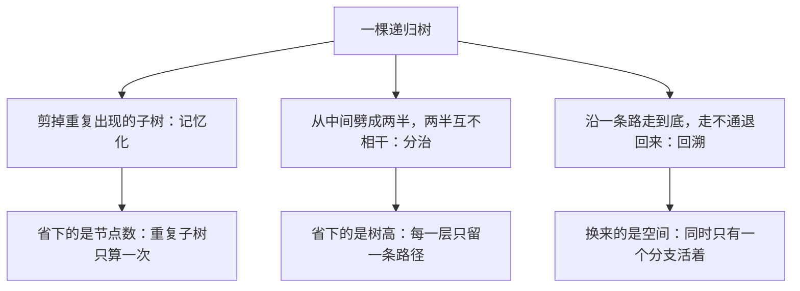

# 递归：把问题交给自己

> **授权**：本章节属教材文档部分，采用 [CC BY-NC-ND 4.0](../LICENSE)
> 加[附加条款](../许可附加条款.md)授权：署名、非商业、禁止演绎、不允许二次分发。
> 文中引用的代码不受此限，各自保留原有许可证，详见[版权与许可说明.md](../版权与许可说明.md)。

一个目录占了多少字节，这个数字是算出来的。目录里存的是名字，数据在文件与子目录里；
一个目录的大小，按其中每个文件的大小与每个子目录的大小相加得出。
而子目录的大小，又要照同样的办法算一遍——于是这段代码把自己交给了自己：
算一个目录，就是先算它的每个子目录，再把结果加起来。

同一个做法在别处也出现：JSON 解析器读到左花括号，就再叫一次自己处理括起来的那一段；
汉诺塔要把一摞盘子挪到另一根柱子上，先叫自己把上面那一摞挪开，再挪最下面那个。

递归因此有两个身份。有时它就是解法本身：汉诺塔、表达式求值、树的序列化，
换成循环要另建一套记账结构，代码会长出一截；有时它只是一种写法，
用循环加一个数组能写得一样清楚，往往还更快。两个身份分不清，
就会在两种场合各犯一次错：该递归的地方硬写成循环，满屏都是状态标记；
不该递归的地方硬上递归，程序在几千层之后无声消失。

承接《04-语法/07-函数.md》章节：函数怎么调用、一帧里放什么，那里已经讲过。
同一个动作加上一个条件，就成了递归：**调用者就是被调用者**。
语言规则允许这个动作，却没有为递归深度定下任何数字；栈要按帧算账。优化器可以把尾调用改成跳转，改写成迭代则要把压在栈上的东西搬回自己手里。
一份递归代码摆在面前时，应当能说清它什么时候停、会占多少栈、能不能被换成循环，
以及换掉之后哪一部分代价会涨上去。

---

> **约定**：标注以行内代码单独成行——`实测数据` 表示实际执行验证过，
> 复现命令随程序给出；`文档` 表示引自标准草案或官方资料；`待确认` 表示尚未验证。
> 路径占位符（如 `<MinGW>`、`<工作区>`）的含义见《README.md》。
> 本章节实测环境是 Windows 11 + g++ 16.2.0（MinGW-w64）；第 2 节的 Linux 一侧是
> WSL Ubuntu 24.04.5 + g++ 13.3.0，两边分表给出，不并入同一张对照表。

# 本章节定位

| 需要先知道 | 在哪 |
|---|---|
| 函数怎么定义、怎么调用 | 《04-语法/07-函数.md》第 1 节 |
| 调用发生时机器上做了什么 | 《04-语法/07-函数.md》第 1.2 小节 |
| 形参是函数自己的局部变量 | 《04-语法/07-函数.md》第 3 节 |
| 一帧里放什么、栈往哪边长 | 《06-更底层/01-对象在哪里：栈、堆与静态区.md》第 3 节 |
| 栈溢出之后会发生什么 | 《06-更底层/01-对象在哪里：栈、堆与静态区.md》第 4 节 |
| 影子空间与寄存器的分工 | 《06-更底层/05-ABI 与调用约定.md》第 1 节 |
| 内联与 `-O2` 会改掉什么 | 《03-构建工具链/05-优化等级.md》第 5 节 |
| `std::vector` 的容量与扩容 | 《09-高阶数据结构/A-01-连续存储：array 与 vector.md》第 3 节 |
| `std::stack` 这个适配器 | 《09-高阶数据结构/A-05-后进先出、先进先出与优先级：stack、queue 与堆.md》第 2 节 |
| 树是什么形状 | 《09-高阶数据结构/A-07-树（一）：从搜索树到平衡.md》第 1 节 |
| `va_list` 那套不定参数 | 《04-语法/07-函数.md》第 6 节 |
| 编译期递归（模板与 `constexpr`） | 《04-语法/12-编译期能力.md》第 3 节 |

**相邻的章节**：本章节是 `08-一些散落的算法` 板块的第一章，讲「解法本身就是把自己叫一遍」这一类问题。
它后面紧接第 `02` 章（记忆化、分治与回溯）与第 `03` 章（不定参数）：
记忆化要给本章节的递归树剪枝，分治把树从中间劈成两半，回溯沿一条路走到底再退回来，
不定参数那套 `va_list` 也是靠递归把可变的那一段一层层传下去。
再往后第 `04` 章起讲查找与排序，那里出现的是另一些取舍。

| 本章各节 | 讲什么 |
|---|---|
| 第 1 节 | 三件套：基线、推进、合并，以及这三问答错时的三种程序 |
| 第 2 节 | 一帧里有什么、每帧多少字节、递归深度由谁决定 |
| 第 3 节 | 尾调用在什么条件下被换成循环，标准里有没有这条规定 |
| 第 4 节 | 改写成迭代的三种手法：显式栈、累加器、状态机 |
| 第 5 节 | 递归树：树高、节点数、叶子数各对应哪一项代价 |

---

# 第 1 节 三件套与三种错法

## 1.1 一个真实的问题

同步工具做得越久，要报的数字越多。除了「某个文件在不在清单里」，
客户端还要在每次同步结束后报一句「本地 `data` 目录一共占了多少字节」，
用来判断这一轮要不要继续传。

这个数字没有任何一处直接存着。`data` 目录里有一个 `log` 子目录、一个 `cache` 子目录，
`cache` 下面还有 `img`，`img` 下面还有 `2026` 这样按年份分的目录。
每条目录项只记自己的名字，文件只记大小，总字节数需要现场累加：

`Text`

```text
   总字节数(一个目录) = 这个目录里直属文件的字节数之和
                      + 总字节数(它的每一个子目录)
```

把这句话照着抄进代码，得到的就是一个递归函数。它做的事只有两件：
**把同一个动作按子目录分发下去**，然后**把收回来的数字加起来**。
分发下去的时候，问题一定比原来小——子目录是当前目录的真子集，再往下分几层，
总会遇到一个没有子目录的目录，那时第一项就是全部答案。

这份需求里没有任何地方要求「用递归」。可以把整棵树先展平成一个列表再倒着加，
也可以自己拿一个数组当待办清单，一层层压进去。递归只是最短的那条写法，
它把「还有哪些子目录没算」这件事交给了函数调用本身。

## 1.2 基线、推进、合并

任何一个递归函数都要回答三个问题。少回答一个，程序要么停不下来，要么停下来时答案是错的。

| 这一件 | 它回答的问题 | 在目录统计里是哪一句 | 答错的后果 |
|---|---|---|---|
| **基线** | 什么时候不再交给自己 | 没有子目录时，只把直属文件加起来 | 停不下来，或者边界那一个答案错 |
| **推进** | 交给自己的那个问题为什么一定更小 | 交给的是子目录，它比当前目录少至少一层 | 停不下来，一路走到栈用完 |
| **合并** | 子问题的答案怎样拼成自己的答案 | 每个子目录的总字节数加进自己的总和 | 能停下来，但答案丢了内容 |

**基线是唯一一处不许再递归的分支。**它对应问题最小的那一档输入：
空目录、空串、只有零个元素、下标已经越过末尾。写基线时最容易犯的错是照着题面抄边界——
题面说「若干个文件」，就照着题面把基线写成「只剩一个文件的时候停」，
而真正的空输入落在了基线外。

**推进要保证每交出去一次，问题就真的变小一次。**「变小」有两层含义：
参数得动（不能原样传下去），动的方向得朝着基线（每次小 1 就配 `n == 0` 的基线，
每次小 2 就得配一个能接住奇数的基线）。两层里任一层没做到，函数就会一直往下走，
直到把栈用完——那时进程被终止，一行输出也留不下。

**合并决定答案对不对，也决定顺序对不对。**求和这类合并交换两边的位置不影响结果，
拼接字符串、输出遍历序列、构造链表这类合并则完全由顺序决定。
写错合并的程序常常能跑完，只是结果少了一块或者顺序反了，
比前两种错法更难发现。

> [!IMPORTANT]
> **递归 = 基线 + 推进 + 合并。**
> 基线管「什么时候停」，推进管「会不会停」，合并管「停下来之后的答案对不对」。
> 三件事在纸上都只有一行，写代码时却是三种完全不同的失误。

递归和循环的根本差别只有一条：**循环把「我走到哪一步」放在变量里，递归把它放在调用栈上。**
每一层函数都停在半路等下一层回来，等的那段状态就压在栈里（帧里放什么见第 2 节）。
这也是后面所有代价的来源：递归省下了记账的代码，代价是让机器替你记账。

## 1.3 一份能核对答案的最小例子

目录树在内存里通常不是指针套指针，而是一张表：每个目录记自己的父目录是谁。
扫一遍表就知道谁是谁的孩子，不必为每个节点分配一个孩子数组。

下面这份程序把同一棵树算两遍：一遍用递归，一遍用一张表从后往前扫。
两份写法都给出 **2140**——根目录涵盖表里全部节点，
答案必然等于每个目录直属文件字节数之和，这一点可以先手算出来当基准。

`C++`

```cpp
/* dir_size.cpp    编译：g++ -std=c++17 -O2 dir_size.cpp -o dir_size
 * 目录树统计：递归算出一个目录的总字节数，再用一份不递归的写法核对同一个答案。
 * 树的存法是「每个目录记自己的父目录」，扫一遍表就知道谁是谁的孩子；
 * 表按「父目录一定排在子目录前面」的顺序写出来，这正是目录遍历时的自然顺序。 */
#include <cstdio>

// 每个目录里直属文件的字节数之和（不含子目录里的文件）
static const long long g_own[] = {100, 200, 50, 1000, 300, 20, 400, 70};
// 每个目录的父目录下标，-1 表示它是根
static const int g_parent[] = {-1, 0, 0, 1, 2, 4, 4, 4};
static const int N = 8;

// 递归版：一个目录的总字节数 = 自己的直属文件 + 每一个直接子目录的总字节数
static long long size_rec(int dir) {
    long long total = g_own[dir];             // 先算上自己这一层
    for (int c = 0; c < N; ++c) {
        if (g_parent[c] != dir) continue;     // 只认直接孩子
        total += size_rec(c);                 // 推进：孩子那棵子树比这棵小；合并：加进总和
    }
    return total;                             // 一个孩子都没有时，这里就是全部答案（基线）
}

// 核对用：不递归。父亲的下标都比孩子小，于是从后往前走一遍就能把每棵子树并进父亲
static long long size_by_sweep() {
    long long total[N];
    for (int i = 0; i < N; ++i) total[i] = g_own[i];     // 每个目录先只算自己的
    for (int c = N - 1; c > 0; --c) total[g_parent[c]] += total[c];
    return total[0];
}

int main() {
    std::printf("递归算出来：%lld\n", size_rec(0));
    std::printf("扫表算出来：%lld\n", size_by_sweep());
    return 0;
}
```

**这一版的基线藏在一个看不见的地方**：循环一次也没有执行，因此没有下一层可交，
`return total` 直接把 `g_own[dir]` 交了出去。没有子目录的目录走的就是这条路。
基线不一定写成 `if`，但它一定存在。

**这份程序用到的三件套可以直接指出来**：`total = g_own[dir]` 是合并在做准备，
`size_rec(c)` 是推进，`return total` 是合并本身。
把 `size_rec(c)` 的返回值丢掉（写成 `size_rec(c);` 不带 `+=`），程序照样编过、照样跑完，
答案会退化成根目录自己的 100——这就是第三种错法。

## 1.4 错法一：基线写错

需求是「算出 `1 + 2 + … + m`」，其中 `m` 允许是 0。最小的问题就是 `m == 0`，
答案是 0。下面这份程序把基线写成另外两种形式。

`C++`

```cpp
/* wrong_base.cpp    编译：g++ -std=c++17 -O2 wrong_base.cpp -o wrong_base
 * 基线写错的两种样子：少了最底下那一条（m == 0 没有归宿），
 * 以及写宽了一格（m == 0 也走了 m == 1 那条分支）。 */
#include <cstdio>

// 需求：算出 1 + 2 + ... + m，m 可以为 0
// 对的：最小的问题是 m == 0，答案直接给出，不再调用自己
static long long sum_ok(int m) {
    if (m == 0) return 0;                 // 基线
    return m + sum_ok(m - 1);             // 推进（每次小 1）与合并
}

// 错法一 A：基线写成 m == 1。m == 0 传进来时它不会停，一路减到负数
static long long sum_no_floor(int m) {
    if (m == 1) return 1;                 // 少了 m == 0 这一条
    return m + sum_no_floor(m - 1);
}

// 错法一 B：基线写宽了一格。m == 0 也返回 1，比正确答案多 1
static long long sum_wide(int m) {
    if (m <= 1) return 1;                 // 把 m == 0 也算进「最小的问题」
    return m + sum_wide(m - 1);
}

int main() {
    std::printf("m = 5：对的 %lld，基线宽了一格 %lld\n", sum_ok(5), sum_wide(5));
    std::printf("m = 0：对的 %lld，基线宽了一格 %lld\n", sum_ok(0), sum_wide(0));
    std::printf("m = 1：漏掉基线的那一版还能算，%lld\n", sum_no_floor(1));
    return 0;
}
```

**A 版与 B 版的错法不同。**A 版把最小的问题从 `0` 挪到了 `1`，
于是 `m == 0` 这个输入没有任何一条分支接得住，`m` 一路减到负数，
函数一层层往下压栈，最后撞上栈的下界——桌面系统上进程被直接终止，
退出码是一个表示「栈溢出」的数，程序还没来得及打一句自己的输出（栈上限见第 2 节）。

**B 版会停，答案只在边界上错。**`m = 5` 时两版给出同一个数，
只有 `m = 0` 时 B 版多出 1。这类错误因此很难被发现：
测试用例都是「正常输入」，边界那一个输入没人试，代码就一直是「对的」。

> [!WARNING]
> **顺序与边界的错在正常输入上不显形。**
> 写递归的测试用例时，把基线那一档输入单独测一次——
> 空容器、空串、只有零个元素、下标正好等于长度，这些才是最容易被漏掉的一档。

## 1.5 错法二：推进不收敛

需求是「从 `m` 走到 0 一共要走几步」，答案就是 `m`。基线是 `m == 0`，
推进必须每层都朝着这个基线靠近。下面三种写法都没做到。

`C++`

```cpp
/* wrong_step.cpp    编译：g++ -std=c++17 -O2 wrong_step.cpp -o wrong_step
 * 推进写错的三种样子：参数根本没变小、每次小 2 却只认 0 这个基线、步子迈得太大。
 * 只有第三种会自己停下来；前两种一路走到栈用完，正文里说明它们各自卡在哪。 */
#include <cstdio>

// 需求：从 m 走到 0 一共要走几步（答案就是 m）
static long long steps_ok(int m) {
    if (m == 0) return 0;                 // 基线
    return 1 + steps_ok(m - 1);           // 推进：每次少 1，正好落在基线上
}

// 错法二 A：交给自己的还是 m，一步也没往前挪
static long long steps_same(int m) {
    if (m == 0) return 0;
    return 1 + steps_same(m);
}

// 错法二 B：每次少 2，基线却只认 0 —— 奇数永远落不到基线上
static long long steps_by2(int m) {
    if (m == 0) return 0;
    return 1 + steps_by2(m - 2);
}

// 错法二 C：步子迈得太大。它会停下来，但一路上跳过去的那些都没算
static long long steps_half(int m) {
    if (m == 0) return 0;
    return 1 + steps_half(m / 2);
}

int main() {
    std::printf("m = 8：对的 %lld，步子太大 %lld\n", steps_ok(8), steps_half(8));
    std::printf("m = 0：参数没变的那一版被基线接住，%lld\n", steps_same(0));
    std::printf("m = 2：每次少 2 的那一版也能落到底，%lld\n", steps_by2(2));
    return 0;
}
```

**A 版的参数始终没有变**：`steps_same(m)` 再调用 `steps_same(m)`，
每一层的局部变量完全相同，栈却要多压一层。这个函数永远不会返回，
运行时表现为「程序没有任何输出、直接消失」。

**B 版的参数变了，方向也对，偏偏跨过了基线。**步长是 2，基线只认 0，
偶数能落到 0，奇数一路减到 −1、−3、−5，永远差半步。
推进成立的条件要写全：**每次变小，且变化量与基线相容。**

**C 版会停，答案是错的。**`steps_half(8)` 走的是 8 → 4 → 2 → 1 → 0 四步，
而正确答案是 8 步。写递归时把 `m - 1` 写成 `m / 2`，
或者在手写的二分里把「中点」当成新边界，都属于这一类：

`Text`

```
   二分查找里这两种推进只差一个 1：

   lo = mid      ← 当 a[mid] < x 时，区间左端没有越过 mid，循环不收敛
   lo = mid + 1  ← 越过 mid，区间每次真的变短
```

**推进不收敛的两种表现**：区间不动时是死循环（循环一直在转，既不结束也不报错），
递归不收敛时是栈溢出（进程很快被终止）。两者都要按「每一步是否真的更接近基线」这一条来查。

## 1.6 错法三：忘了合并、合并顺序错

需求换成：把一棵按数组存的完全二叉树按中序遍历拼成一个字符串。
这里「拼」是不可交换的合并，顺序错了字符串就错，子结果丢了就更明显。

`C++`

```cpp
/* wrong_merge.cpp    编译：g++ -std=c++17 -O2 wrong_merge.cpp -o wrong_merge
 * 合并写错的两种样子：两边都递归了却没接返回值、接上了但顺序颠倒。
 * 树按下标存：i 的左孩子是 2i+1，右孩子是 2i+2，越界即为空子树。 */
#include <cstdio>
#include <string>

static const int g_val[] = {1, 2, 3, 4, 5, 6, 7};
static const int N = 7;

// 对的：左子树的中序 + 自己 + 右子树的中序
static std::string inorder_ok(int i) {
    if (i >= N) return {};                // 基线：空子树，中序序列是空串
    return inorder_ok(2 * i + 1) + std::to_string(g_val[i]) + inorder_ok(2 * i + 2);
}

// 错法三 A：两边都递归了，返回值却没人接，最后只剩自己那一个数
static std::string inorder_drop(int i) {
    if (i >= N) return {};
    inorder_drop(2 * i + 1);              // 左子树的答案丢在这里
    const std::string self = std::to_string(g_val[i]);
    inorder_drop(2 * i + 2);              // 右子树的答案也丢了
    return self;
}

// 错法三 B：合并顺序颠倒，先右后左
static std::string inorder_rev(int i) {
    if (i >= N) return {};
    return inorder_rev(2 * i + 2) + std::to_string(g_val[i]) + inorder_rev(2 * i + 1);
}

int main() {
    std::printf("中序      ：%s\n", inorder_ok(0).c_str());
    std::printf("丢掉子结果：%s\n", inorder_drop(0).c_str());
    std::printf("两边颠倒  ：%s\n", inorder_rev(0).c_str());
    return 0;
}
```

**A 版把两棵子树的答案直接丢弃了。**`inorder_drop(2 * i + 1)` 确实被调用了，
它的返回值也确实算了出来，只是没有人接住，语句一结束就消失了。
默认的编译选项下不会有任何提示——丢弃一个 `std::string` 返回值在语法上完全合法，
析构函数照常执行一遍，只是答案没有留下来。程序打印出来的是根节点那一个数，
看不出是「少了两棵子树」还是「函数根本没有被调用」。

**B 版接住了返回值，顺序反了。**把「先左后右」写成「先右后左」，
打印出来的整条序列是倒的；如果这份合并是求和，两版结果一模一样，错误就测不出来。
**可交换的合并会掩盖顺序错误**，这是挑测试用例时要留意的一点。

三种错法合起来看：基线、推进、合并各管一件事，也各有一种典型的出错方式。

| 错法 | 现象 | 表现 | 怎么查 |
|---|---|---|---|
| 基线写错 | 少一条时停不下来，宽一格时边界答案错 | 崩溃，或只在边界输入上错 | 把最小那一档输入单独测一次 |
| 推进不收敛 | 参数没动，或者变化量与基线不相容 | 栈溢出，或者区间原地打转 | 每一步问一句「离基线更近了吗」 |
| 合并写错 | 子结果没接住，或者接的顺序反了 | 结果少内容、顺序颠倒 | 用不可交换的合并（拼接、打印）测试 |

## 1.7 标准怎么说的

「允许递归」这条规则在两门语言的标准里都写着。C 那一份写得最直白：

`文档`

> "Recursive function calls shall be permitted, both directly and indirectly through any chain of other functions."
>
> —— N3220 §6.5.3.3/9

C++ 那一份允许递归，同时把 `main` 单独排除在外：

`文档`

> "Recursive calls are permitted, except to the main function (6.6.1)."
>
> —— N4659 §8.2.2/10

**两条原文都只说「允许」，都没有说「能有多深」。**
语言把递归写进规则，却没有为深度定任何数字。`main` 那一条也是硬规则，
原文没有展开理由，编写时照办即可——`main` 里要重复某件事，
写成循环，或者另起一个函数再调用它。

`main` 之外，语言还排除了一类递归：**调用发生在运行期之前或之后**。
模板实例化与 `constexpr` 求值都是编译期完成的，那条路上的递归由编译器自己控制深度
（讲法见《04-语法/12-编译期能力.md》第 3 节），深度上限往往比运行期小得多。

---

# 第 2 节 栈帧与深度上限

## 2.1 一个真实的问题

一份配置解析器用递归下降写成：读到一个 `{` 就再叫一次自己，
读到 `}` 就返回上一层。开发时用的样例最深嵌套四层，测得很顺；
上线后有一批用户从别的工具导出的配置，嵌套到了一万层——
程序没有抛异常，没有写日志，进程直接消失了。

「一万层」这个数本身不说明什么。要让这件事可查，必须先回答三个问题：
一层递归在栈上占多少字节？这个线程的栈一共有多少字节？
两个数除下来，还剩多少层可以用？三个数都能测出来。

## 2.2 一帧里有什么

每进入一次函数，栈上就多出一块属于这次调用的区域，叫**栈帧**。
一层递归还没返回时，它的帧一直留在那里，因为下一次调用结束之后它还要继续执行。

`Text`

```
高地址
    main 的帧
    ───────────────────────────────────────────────────
    parse(第 1 层) 的帧     ← 还在等下一层回来，不能撤
    ───────────────────────────────────────────────────
    parse(第 2 层) 的帧
    ───────────────────────────────────────────────────
                  …
    ───────────────────────────────────────────────────
    parse(第 k 层) 的帧     ← 正在执行的是这一层，栈顶在这里
低地址
```

一帧里放四样东西：

| 一帧里放什么 | 谁放的 | 什么时候消失 |
|---|---|---|
| **返回地址** | `call` 指令压进去 | 这一层返回时，弹回上一层继续执行 |
| **被调用者保存的寄存器** | 函数的序言（几条 `push`） | 返回前恢复成调用前的值 |
| **参数与局部变量** | 调用者与被调用者 | 这一层返回时一起作废 |
| **对齐填充** | 编译器 | 同上，它存在的唯一目的是让栈指针停在规定的边界上 |

前两样加起来就是「一次函数调用最少的开销」，后两样随函数写什么而变。
**递归的栈占用就是这些帧叠起来的总量**：同时活着多少层，就要多少份这样的东西。
同一份源码在 `-O0` 与 `-O2` 下编出来的帧大小并不相同（`-O2` 会把局部变量搬进寄存器，
有的帧甚至整个消失），因此帧距不能脱离优化等级来谈。
x86-64 上一个帧具体怎么摆，见《06-更底层/01-对象在哪里：栈、堆与静态区.md》第 3 节。

## 2.3 把三个数测出来

栈区间不能在源码里读到，必须问操作系统；每帧字节数也不能靠读代码算，必须实测。
下面这份程序两件事都做：先问当前线程的栈区间有多大，
再用一个「每帧故意占 64 字节」的函数递归下去，记下第一帧与最后一帧局部变量的地址差，
除以层数就得到每帧字节数。

**它给自己留了 256 KiB 的余量**：每层测一次「当前局部变量地址离栈下界还有多远」，
一旦小于 256 KiB 就停止向下递归，因此程序不会崩溃。

`C++`

```cpp
/* stack_limit.cpp    编译：g++ -std=c++17 -O0 stack_limit.cpp -o stack_limit
 * 三件事：本线程栈的保留区间、每帧字节数、还能递归多少层。
 * 递归到距离栈下界还差 256 KiB 就停下，因此程序不会崩。 */
#define _WIN32_WINNT 0x0602
#include <windows.h>

#include <cstdio>

static char* g_first = nullptr;   // 第一次进入 probe 时的局部变量地址
static char* g_last = nullptr;    // 最深一次进入 probe 时的局部变量地址
static char* g_low = nullptr;     // 栈区间下界（地址最小处）
static long long g_depth = 0;     // 实际进入 probe 的次数

struct Frame {
    char pad[64];                 // 故意占地方：让每帧的间距一眼看得出来
};

// 递归直到离栈下界只剩 256 KiB
static void probe(long long margin) {
    Frame f;
    f.pad[0] = static_cast<char>(g_depth);   // 让这个局部变量真的被写
    if (!g_first) g_first = f.pad;
    g_last = f.pad;
    ++g_depth;
    if (f.pad - g_low > margin) probe(margin);
}

// 在一个新线程里做同样的探测，栈大小由创建者指定
static DWORD WINAPI thread_main(void*) {
    ULONG_PTR lo = 0, hi = 0;
    GetCurrentThreadStackLimits(&lo, &hi);
    g_low = reinterpret_cast<char*>(lo);
    g_first = g_last = nullptr;
    g_depth = 0;
    std::printf("新线程：栈区间 %.0f KiB（创建时点明 4 MiB）\n", (hi - lo) / 1024.0);
    probe(256 * 1024);
    std::printf("新线程：帧间距 %lld 字节\n",
                (g_first - g_last) / (g_depth > 1 ? g_depth - 1 : 1));
    std::printf("新线程：本次递归到 %lld 层停下（入口偏移每次略有不同）\n", g_depth);
    return 0;
}

int main() {
    ULONG_PTR lo = 0, hi = 0;
    GetCurrentThreadStackLimits(&lo, &hi);
    std::printf("主线程：栈区间 %.0f KiB（链接器给的默认值）\n", (hi - lo) / 1024.0);

    g_low = reinterpret_cast<char*>(lo);
    probe(256 * 1024);
    std::printf("主线程：帧间距 %lld 字节\n",
                (g_first - g_last) / (g_depth > 1 ? g_depth - 1 : 1));
    std::printf("主线程：本次递归到 %lld 层停下（入口偏移每次略有不同）\n", g_depth);

    HANDLE h = CreateThread(nullptr, 4u << 20, thread_main, nullptr, 0, nullptr);
    WaitForSingleObject(h, INFINITE);
    CloseHandle(h);
    return 0;
}
```

三个数在每个线程里各取一次。下面是两次探测中逐位不变的四行：

`实测数据`
`Text`

```text
主线程：栈区间 2048 KiB（链接器给的默认值）
主线程：帧间距 112 字节
新线程：栈区间 4096 KiB（创建时点明 4 MiB）
新线程：帧间距 112 字节
```

**另外两个数是「递归到多少层停下」，它们每次运行都不一样，因此不在上面这一块里。**
本机连跑三次：主线程停在 **16362 到 16379 层**之间，新线程停在 **35089 到 35097 层**之间。
原因写在程序输出里：每次启动时栈的入口偏移都不同（命令行参数长度、
环境变量块长度都会影响栈顶位置），所以「还能递归多少层」不是一个逐位可复现的量；
**逐位可复现的是区间大小与每帧字节数这两个数**，层数是这两个数相除的结果。

这两个层数与另外两个数互相印证。程序自己留了 256 KiB 的余量，于是：

`Text`

```text
   主线程：(2048 − 256) KiB ÷ 112 字节 ≈ 16384 层
   新线程：(4096 − 256) KiB ÷ 112 字节 ≈ 35108 层
```

**折算出来的 16384 与 35108 都比实际停下的层数略大**，两组各差几层到十几层，
差的就是入口偏移那一点。还有一处能看出这套账是对的：
新线程的栈区间是主线程的两倍，层数却不是两倍（35093 ÷ 16379 ≈ 2.14），
因为那个 256 KiB 的余量按比例在新线程里占得更少——
(4096 − 256) ÷ (2048 − 256) ≈ 2.14，与层数的比值一致。

## 2.4 112 字节是怎么来的

程序里的 `Frame` 占 64 字节，测出的每帧间距是 112 字节。多出来的 48 字节不是浪费：

| 这一帧里的东西 | 字节数 | 说明 |
|---|---|---|
| `Frame f` | 64 | 源码里写着的那个 `char pad[64]`，它的地址就是探针用的那个地址 |
| 返回地址 | 8 | `call` 指令压进去的，用来知道返回哪里 |
| 参数与寄存器备份 | 若干 | 被调用者保存的寄存器、栈上留的参数副本 |
| 对齐填充 | 若干 | 栈指针必须停在编译器要求的边界上，不足就补 |

**这三笔加起来落在 48 字节上**（64 ＋ 48 ＝ 112），具体怎么分配由编译器决定：
本机这份程序在注释里指定用 `-O0` 编，目的就是让每一帧都完整留在栈上。
换成 `-O2`，局部变量可能进寄存器、递归可能被整个改写成循环（第 3 节），
帧间距会变小甚至测不出来。**「每帧多少字节」是「某个编译器在某一个优化等级下」的数**，
它不是一个可以背下来的常量。

## 2.5 上限不是语言定的

有人以为标准里规定了「递归不能超过某个层数」。标准里没有这一条。

标准草案在「翻译限制」那一节（N3220 §5.2.5.2）列了一串实现必须能处理的规模：
127 层块嵌套、63 层括号嵌套、一次函数调用最多 127 个实参、
一个对象最多 32767 字节……这一串条目有二十多条，**没有一条提到函数递归的深度**。
递归调用本身在第 1 节的两条原文里被明确允许，允许之后能走多深，标准没有下文。

> [!IMPORTANT]
> **递归深度是两个数相除的结果。**
> 分子是栈区间的字节数，由操作系统与链接器决定（也可以由线程创建者指定）；
> 分母是每帧的字节数，由编译器在当前优化等级下决定。
> 两个数都不在语言这一层，因此同一个程序换一台机器、换一个优化等级，
> 能递归的层数就变了。

这也解释了一件常被问起的事：把栈调大能不能解决问题。答案是「能，但要知道自己在买什么」。
主线程的 2048 KiB 与新线程的 4096 KiB 都可以改。
但第 3 节里那个一亿层的调用，即便每帧只占 32 字节，也要 3 GB 以上的栈——
调大栈只在「层数差得不多」时有意义，差得多了就该换写法。

> [!CAUTION]
> **栈溢出不是一个可以捕获的错误。**
> 桌面系统在栈区间的下界外放了一页保护页，撞上去的进程被操作系统直接终止：
> 没有异常可以接、没有栈回溯、也没有机会把日志写完。这一层保护只在桌面系统上有，
> 单片机上栈会继续往下压，压进堆或者别的全局变量，症状是「某个无关的变量莫名其妙变了」
> （见《06-更底层/01-对象在哪里：栈、堆与静态区.md》第 4 节）。

## 2.6 Linux 那一侧的对照

上面那份程序用的是 Windows 的线程接口，换到 Linux 上要换成 `pthread` 与
`<sys/resource.h>`。同一套探测逻辑在 Linux 上重编之后测到的是另一组数：

| 项 | Linux（g++ 13.3.0） |
|---|---|
| `RLIMIT_STACK` 软上限 | 8192 KiB |
| 每帧字节数（同一份写法） | 112 字节 |
| 本次递归到 | 72454 到 72503 层之间（三次运行） |

**栈区间那一项两边差了四倍，每帧字节数却一样。**栈区间是操作系统给的默认值，
Linux 的默认软上限是 8 MiB，Windows 这边链接器给的是 2 MiB；
每帧字节数只跟同一份源码、同一个优化等级、同一族编译器有关，
两边都是 `-O0`、都是 GCC，所以两边得到同一个数。
**层数差四倍多（16379 对 72503）几乎全部来自栈区间那一项。**

两边的编译器版本不同（Windows 侧 g++ 16.2.0，Linux 侧 g++ 13.3.0），
因此这两组数只在本表内互相比较，不与前面那张 Windows 的表合并比较。

> [!NOTE]
> **三个数各有各的主**：栈区间由操作系统与链接器给，每帧字节数由编译器给，
> 深度是这两个数相除的结果。想把递归写稳，能改的是前两个数，
> 而真正管用的办法是让深度不随输入增长——第 4 节给出三种改法。

---

# 第 3 节 尾递归的真相

## 3.1 一个真实的问题

日志文件的校验和要把每一行按编号累加，一亿行就是一亿次加法。
最直接的写法 `sum(n) = n + sum(n - 1)` 走不完：一亿层递归，
按第 2 节的账，即便每帧只占 32 字节，也要 3 GB 以上的栈，主线程那 2 MiB 差得太远。

常见的第二种写法是把「已经加出来的部分」放在第二个参数里带下去：

`Text`

```text
   sum_tail(n, acc) = sum_tail(n - 1, acc + n)     n > 0
   sum_tail(0, acc) = acc                          基线
```

这一版有一个显眼的性质：**递归调用是这条路径上做的最后一件事**。
调用返回之后，它不需要再算任何东西，直接把返回值交给上一层就行。
下面这份程序要回答的就是：这一版能不能真的走完一亿层，如果走完了，说明什么。

## 3.2 一亿层走完说明栈上什么都没叠

程序里有两个探针：干净尾递归那一版一亿层直接走完；
另外两版故意让「调用之后还有事要做」，用相隔一千层的两次调用求出每帧字节数。

`C++`

```cpp
/* tail_call.cpp    编译：g++ -std=c++17 -O2 tail_call.cpp -o tail_call
 * 尾递归有没有被换来循环：一亿层能不能走完，哪几种写法换不掉，换不掉时每帧多少字节。 */
#include <cstdio>
#include <cstdlib>
#include <string>

static char* g_first = nullptr;   // 最外层那一帧里探针的地址
static char* g_last = nullptr;    // 最里层那一帧里探针的地址

// A 干净的尾递归：递归调用是这条路径上做的最后一件事
static long long sum_tail(long long n, long long acc) {
    if (n == 0) return acc;
    return sum_tail(n - 1, acc + n);
}

// B 尾调用位置一样，但帧里有个要析构的对象：调用返回之后还得析构它
static long long sum_dtor(long long n, long long acc) {
    std::string s(1, 'x');
    if (!g_first) g_first = reinterpret_cast<char*>(&s);
    g_last = reinterpret_cast<char*>(&s);
    if (n == 0) return acc;
    return sum_dtor(n - 1, acc + n + static_cast<long long>(s.size()) - 1);
}

// C 调用返回之后还要用这一帧：把结果写回帧里的缓冲区
static long long sum_buf(long long n) {
    char buf[32];
    buf[0] = static_cast<char>(n);
    if (!g_first) g_first = buf;
    g_last = buf;
    if (n == 0) return 0;
    const long long r = sum_buf(n - 1);
    buf[31] = static_cast<char>(r);
    return r + n + buf[0] + buf[31];
}

// 相隔一千层各测一次位移，两点连线求斜率，斜率就是每帧字节数
template <class F>
static void frame_bytes(const char* name, long long n, F&& f) {
    g_first = g_last = nullptr;
    const long long sum1 = f(n);
    const long long d1 = g_first - g_last;
    g_first = g_last = nullptr;
    const long long sum2 = f(n + 1000);
    const long long d2 = g_first - g_last;
    std::printf("%s：%lld 层位移 %lld 字节，%lld 层位移 %lld 字节，每帧 %lld 字节\n",
                name, n, d1, n + 1000, d2, (d2 - d1) / 1000);
    std::printf("  两次的结果 %lld 与 %lld\n", sum1, sum2);
}

int main(int argc, char** argv) {
    const long long deep = argc > 1 ? std::atoll(argv[1]) : 100000000;
    const long long got = sum_tail(deep, 0);
    std::printf("干净尾递归 sum_tail(%lld, 0) = %lld，闭式解 %lld\n",
                deep, got, deep * (deep + 1) / 2);
    std::printf("  一亿层走完，栈上什么都没叠（2 MiB 的栈装不下这么多帧）\n");

    frame_bytes("析构版（帧里有 std::string）", 4000, [](long long n) { return sum_dtor(n, 0); });
    frame_bytes("非尾递归版（返回后还要写这一帧）", 4000, [](long long n) { return sum_buf(n); });
    return 0;
}
```

`实测数据`
`Text`

```text
干净尾递归 sum_tail(100000000, 0) = 5000000050000000，闭式解 5000000050000000
  一亿层走完，栈上什么都没叠（2 MiB 的栈装不下这么多帧）
析构版（帧里有 std::string）：4000 层位移 448000 字节，5000 层位移 560000 字节，每帧 112 字节
  两次的结果 8002000 与 12502500
非尾递归版（返回后还要写这一帧）：4000 层位移 207904 字节，5000 层位移 259904 字节，每帧 52 字节
  两次的结果 7999676 与 12502252
```

**先看第一行那两个数为什么相同。**一亿项的和是 `100000000 × 100000001 ÷ 2`
= 5000000050000000，程序算出来的与这个闭式解逐位相同，
说明这一亿次加法一次也没少做——它不是被优化器跳过去了，而是真的算完了。

**再看它为什么能算完。**按第 2 节测到的数，主线程的栈是 2048 KiB；
一亿层，即便每帧只占 32 字节，也要 3.2 GB 以上的栈，是栈区间的 1500 多倍。
唯一说得通的解释是：**这一版根本没有往下压栈**，
编译器把 `sum_tail` 里的递归调用换成了往回的跳转，函数成了一个循环。
它一亿次迭代复用同一帧，栈上什么都没叠。

**最后两行是反面对照。**「析构版」的尾调用位置与干净版一样，
但它的帧里有一个 `std::string`：调用返回之后还要析构它，
而且它的地址被存进了全局变量。这一版每帧 112 字节，
四千层的位移就是 448000 字节——四千层已经占了 437 KiB，
一亿层就是 10 GB 以上，必然崩溃。另一版更麻烦：
`const long long r = sum_buf(n - 1);` 之后还要把 `r` 写回帧里的 `buf[31]`，
调用返回之后这一帧还有用，每帧 52 字节，同样换不成循环。

两个探针的用法也值得留意：它不直接打印某个局部变量的地址，
而是**相隔一千层各测一次地址差，再除以一千**。这样得到的斜率就是每帧字节数，
同一次测量中，对齐与入口偏移的影响会在相减时抵消。
每块输出的第二行（`两次的结果 …`）只是用来确认两次调用真的算完了，
以免读到优化器丢掉的那一次。

## 3.3 这条结论有前提

上面那句「一亿层走完」的结论并不容易得到。第一版程序在干净尾递归里做了同一件探针的事：
**取了一个局部变量的地址存进全局变量**，为的是测出帧间距。
那一版跑起来一亿层直接栈溢出，进程的退出码是 `0xC00000FD`
（Windows 上表示 `STATUS_STACK_OVERFLOW` 的那个值）。
把取地址那一步去掉、改成测另外两个函数的帧距之后，程序才跑完。

这件事本身就是尾调用优化最要紧的前提：

> [!IMPORTANT]
> **尾调用能不能被换成循环，是有条件的。**
> 第一，调用返回之后不能还有事要做——析构一个对象、把结果写回这一帧、
> 再做一次加法，都算「还有事要做」。
> 第二，这一帧里局部变量的地址不能逃出去——一旦被存进全局变量或者传给别的函数，
> 编译器就不能再假定「没有别人看得见这一帧」，每一帧都必须真实存在。
> 两个条件都满足时，把调用换成跳转不会改变程序的可观察行为，
> 优化器才有权这样做（依据见第 3.5 小节那条脚注）。

> [!CAUTION]
> **拿尾递归去省栈，等于把程序的生死交给优化器。**
> 帧里多一个要析构的成员、多一行「返回之后再处理」的代码，
> 栈占用就从零变成每帧几十到上百字节；一亿层乘下来就是几 GB，必然崩溃。

## 3.4 两段汇编对照

「被换成了循环」这句话可以直接在汇编里看到。下面这个函数只做一件事：
写成干净的尾递归，`main` 调用它一次。

`C++`

```cpp
/* tail_asm.cpp    编译：g++ -std=c++17 -O2 tail_asm.cpp -o tail_asm
 * 汇编对照用：一个干净的尾递归函数，非 static 才会单独生成一段代码。 */
int sum_tail(int n, int acc) {
    if (n == 0) return acc;
    return sum_tail(n - 1, acc + n);
}

int main() { return sum_tail(10, 0); }
```

**把上面那条命令里的 `-o tail_asm` 换成 `-S`，得到的就是汇编。**
这里把两种构建下 `sum_tail` 那一段各摘出来（下面是节选，`.seh_*` 一类的行已裁掉）。
把 `sum_tail` 写成非 `static`，编译器才会为它单独生成一段代码，而不是直接内联掉。
程序本身没有输出，`main` 的返回值是 55。

`Assembly`

```asm
_Z8sum_tailii:
	pushq	%rbp
	movq	%rsp, %rbp
	subq	$32, %rsp
	movl	%ecx, 16(%rbp)
	movl	%edx, 24(%rbp)
	cmpl	$0, 16(%rbp)
	jne	.L2
	movl	24(%rbp), %eax
	jmp	.L3
.L2:
	movl	24(%rbp), %edx
	movl	16(%rbp), %eax
	addl	%eax, %edx
	movl	16(%rbp), %eax
	subl	$1, %eax
	movl	%eax, %ecx
	call	_Z8sum_tailii
	nop
.L3:
	addq	$32, %rsp
	popq	%rbp
	ret
```

上面这一段来自 `-O0`。序言里 `subq $32, %rsp` 给这一帧开了 32 字节，
函数体里有一条 `call _Z8sum_tailii`——调用的是自己，一层压一层。

`Assembly`

```asm
_Z8sum_tailii:
	testl	%ecx, %ecx
	movl	%edx, %eax
	je	.L5
	testb	$1, %cl
	je	.L2
	addl	%ecx, %eax
	subl	$1, %ecx
	je	.L5
	.p2align 4
	.p2align 4,,10
	.p2align 3
.L2:
	leal	-1(%rax,%rcx,2), %eax
	subl	$2, %ecx
	jne	.L2
.L5:
	ret
```

同一段源码换成 `-O2`，**这一版里一条 `call` 都没有**。
`subq $32, %rsp` 那套序言也消失了，函数体变成一小段循环：
`jne .L2` 是往回跳，`leal -1(%rax,%rcx,2), %eax` 一次把两层并起来算（循环按 2 展开），
`%eax` 就是那个 `acc`，`%ecx` 是剩下的 `n`。函数把自己写成了一个循环，
栈指针从头到尾没有动过——这正是第 3.2 小节里一亿层能走完的原因。

三种构建下 `sum_tail` 的情况，逐一编译后如下：

| 构建 | `sum_tail` 里有没有 `call` | 说明 |
|---|---|---|
| `-O0` | 有，`call _Z8sum_tailii` | 老老实实递归，序言里 `subq $32, %rsp` |
| `-O2` | 没有 | 换成了循环，还按 2 展开了一次 |
| `-O2 -fno-optimize-sibling-calls` | 有 | 关掉兄弟调用优化，递归调用留着 |

**第三行说明了这件事的性质**：`-O2` 下 `call` 消失并不是必然结果，
关掉那个开关（`-fno-optimize-sibling-calls`，GCC 的兄弟调用优化）之后，
`call` 又会出现。这是这套编译器在这个优化等级下的选择。

## 3.5 标准里没有「尾调用」这两个词

优化器为什么能改掉递归调用？依据是标准里的一条一般规则，
它在 N4659 里是 §4.6 的**脚注 6**，不是正文：

`文档`

> "This provision is sometimes called the “as-if” rule, because an implementation is free to disregard any requirement of this International Standard as long as the result is as if the requirement had been obeyed, as far as can be determined from the observable behavior of the program."
>
> —— N4659 §4.6 脚注 6

**这条规则说的是「可以」，不是「必须」。**它给了实现一种自由：
只要从程序的可观察行为上分辨不出差别，实现就可以不理会标准里的任何要求。
把递归调用换成往回的跳转正好落在这条自由里——栈上叠没叠帧，
程序自己读不到（除非像第 3.3 小节那样把局部地址逃出去），因此这种替换是允许的。

那么标准里有没有专门规定尾调用的条文？把两份草案全文查一遍：

| 草案 | 查的词 | 命中 |
|---|---|---|
| N4659（C++17） | `tail call` | 0 处 |
| N4659（C++17） | `tail recursion` | 0 处 |
| N3220（C23） | `tail call` | 1 处 |

C++ 那一份**通篇没有出现过这两个词**。C 那一份里唯一的一次出现在讲
`[[unsequenced]]` 优化的一段中，说的是某个 `printf` 调用可以改成尾调用、
不必返回（`unconditionally executes a tail call to printf that never returns to the main function`），
与「实现必须替你把尾递归变成循环」没有关系。

> [!WARNING]
> **「尾递归一定会被优化掉」是一个流传很广的说法，标准里没有这一条。**
> 同一份源码，`-O2` 下 `call` 消失，加上 `-fno-optimize-sibling-calls` 又回来；
> 帧里多一个要析构的对象，优化立刻失效（第 3.3 小节那两行每帧 112 与 52 字节就是证据）。
> 结论很直接：**要保证栈不溢出，就自己写成循环或者显式栈**，
> 而是把源码写成尾递归的形式，指望优化器接手。

---

# 第 4 节 递归改迭代三手法

## 4.1 一个真实的问题

同一段业务逻辑常常要在三类场合下运行。第一种是数据把树压歪了：
按序插入的键让二叉搜索树退化成一条链，深度上万，递归版在几千层就撞栈。
第二种是需要能停下来：界面要把一次遍历切成片、任务队列要在两步之间保存进度、
协程要在中途让出。递归函数停在半路时，它的状态全部压在调用栈上，
外面既看不见也搬不走。第三种是根本没有这么大的栈：单片机上几 KiB 的栈，
几百层就到了底。

三种场合要的是同一件事：**把原本压在调用栈上的东西，搬到自己手里。**
搬哪一部分，取决于原来的递归用到了调用栈的哪一部分信息。
下面三种手法各针对一种信息，最后用一份程序把三种放在一起比。

## 4.2 累加器：把中间结果当参数带下去

阶乘的递归写法是 `fact(n) = n × fact(n − 1)`。
它为什么必须压栈？因为 `fact(n − 1)` 回来之后，这一层还要做一次乘法：
「还没做的那件事」就是这一帧存在的理由。

把这次乘法挪到调用之前，办法是多带一个参数：

`Text`

```text
   fact(n, acc) = fact(n − 1, acc × n)      n > 1
   fact(1, acc) = acc                        基线
```

`acc` 里装的正是「已经算出来的那部分」。挪完之后，这一层在调用返回之后
再也没有事要做——**尾调用位置出现了**，编译器可以把它换成循环（第 3 节的条件都满足）。
累加器手法与「直接写成循环」是同一条思路的两面：把中间结果放在变量里往下带，
而不是留在栈帧里等回来。

**这个手法的适用范围很窄，但认出它之后的收益很直接**：它只能用在
「每一层与子结果之间的运算可以提前做」的场合。加法、乘法、求最大最小、
方向固定的字符串拼接都可以；中序遍历打印、汉诺塔这类「左边做完还要做中间、
再做右边」的场合不行，因为这一层要等两次子调用的结果，中间还要做自己那一步。

## 4.3 显式栈：栈里存的是「还没走的自己」

中序遍历一个二叉树时，每一层要等左子树回来、打印自己、再去右子树。
这一层的信息没法塞进一个累加器，但可以自己拿一个容器当栈：
**栈里存的不是「走过的路」，而是「还没走的自己」。**

迭代版的走法是这样：从根出发一路向左，经过的每个节点都压进栈；
走到空指针就弹出栈顶——那是「最久以前压进去、还没来得及访问」的那个节点；
访问它，然后转向它的右子树，继续一路向左。

`std::vector` 当栈用只需要 `push_back` 与 `pop_back` 两个动作。
**栈的最大深度就等于树高**：一路向左到底时，栈里装的是从根到当前节点这一条路径。
这一点可以测：一棵一百万个节点的完全二叉树树高是 20，
显式栈的最大深度也正好是 20，而递归版同时占着的栈帧个数同样是 20。
两个 20 是同一件事——**递归版把这条路径放在调用栈上，迭代版把它放在自己的容器里。**

## 4.4 状态机：把「回来了接着做哪一步」压进栈

汉诺塔更麻烦。递归版写成 `hanoi(n − 1) + 1 + hanoi(n − 1)`，
这一层要等两次子调用，两次返回之后都还有事要做。
累加器接不住它，光靠「压入还没走的自己」也不够——
它还需要记住「这一步是第几次回来」。

办法是给每一层加一个字段，记录它走到哪一步了：

| 字段 | 作用 |
|---|---|
| `n`、`from`、`to`、`via` | 这一层要搬的是哪一堆盘子、从哪搬到哪、借哪根柱子 |
| `stage` | `0` 表示刚进来，`1` 表示左半边已经搬完、轮到右半边 |

循环里每次只看栈顶这一个 `Task`：

`Text`

```text
   栈顶 stage == 0 → 把它自己改成 stage = 1，压入左半边的子任务，搬动一次
   栈顶 stage == 1 → 弹出它，压入右半边的子任务
   栈顶 n == 0     → 直接弹掉（这就是基线）
```

**递归版靠「函数返回到哪一行」记住进度，状态机版把这个进度写成一个字段。**
字段是明文，因此外部可以读、可以存、可以改：想限制深度就限制栈的长度，
想保存进度就把整个栈拷走，想暂停就在两次循环之间返回。
这是三种手法里唯一能「停在半路再接着跑」的一种，代价也最大。

## 4.5 一份程序里三种手法

下面这份程序把三组对照放在一起，每一组都是「递归版与迭代版算同一件事」：
阶乘用累加器、中序遍历用显式栈、汉诺塔用状态机。
计时的地方把结果写进 `volatile` 变量，否则整段递归会被优化器删掉
（这条纪律的来龙去脉见《09-高阶数据结构/A-00-导读：数据结构是问题的形状.md》第 3.3 小节）。

`C++`

```cpp
/* rec_to_iter.cpp    编译：g++ -std=c++17 -O2 rec_to_iter.cpp -o rec_to_iter
 * 三件事各给递归版与迭代版：累加器（阶乘）、显式栈（中序遍历）、状态机（汉诺塔）。 */
#include <chrono>
#include <cstdio>
#include <vector>

// ---------- 一、累加器：把「已经算出来的部分」当参数带下去 ----------
static unsigned long long fact_rec(int n) {
    return n <= 1 ? 1ull : static_cast<unsigned long long>(n) * fact_rec(n - 1);
}

static unsigned long long fact_acc(int n) {
    unsigned long long acc = 1;
    for (int i = 2; i <= n; ++i) acc *= static_cast<unsigned long long>(i);
    return acc;
}

// ---------- 二、显式栈：中序遍历一棵完全二叉树 ----------
// 完全二叉树按下标存：i 的左孩子是 2i+1，右孩子是 2i+2
static unsigned long long inorder_rec(const std::vector<int>& a, int i, int n) {
    if (i >= n) return 0;
    unsigned long long s = inorder_rec(a, 2 * i + 1, n);
    s += static_cast<unsigned long long>(a[i]);
    return s + inorder_rec(a, 2 * i + 2, n);
}

static unsigned long long inorder_iter(const std::vector<int>& a, int n, long long* peak) {
    std::vector<int> st;              // 显式栈：存放「还没走的自己」
    unsigned long long s = 0;
    int cur = 0;
    *peak = 0;
    while (cur < n || !st.empty()) {
        while (cur < n) {             // 一路向左，走过谁就把谁压栈
            st.push_back(cur);
            if (static_cast<long long>(st.size()) > *peak) *peak = static_cast<long long>(st.size());
            cur = 2 * cur + 1;
        }
        cur = st.back();
        st.pop_back();
        s += static_cast<unsigned long long>(a[cur]);
        cur = 2 * cur + 2;            // 转向右子树
    }
    return s;
}

// ---------- 三、状态机：汉诺塔，把「回来了接着做哪一步」压进栈 ----------
struct Task {
    int n;
    char from, to, via;
    int stage;                        // 0 = 刚进来，1 = 左半边回来了
};

static unsigned long long hanoi_rec(int n, char, char, char) {
    if (n == 0) return 0;
    return hanoi_rec(n - 1, 'A', 'C', 'B') + 1 + hanoi_rec(n - 1, 'B', 'A', 'C');
}

static unsigned long long hanoi_iter(int n, long long* peak) {
    std::vector<Task> st;
    st.push_back({n, 'A', 'C', 'B', 0});
    unsigned long long moves = 0;
    *peak = 0;
    while (!st.empty()) {
        Task& t = st.back();
        if (t.n == 0) { st.pop_back(); continue; }
        if (t.stage == 0) {
            t.stage = 1;                                  // 下一次回到这一帧时走 else 分支
            const Task sub{t.n - 1, t.from, t.via, t.to, 0};
            ++moves;                                      // 把最大的那一块搬过去
            st.push_back(sub);
        } else {
            const Task sub{t.n - 1, t.via, t.to, t.from, 0};
            st.pop_back();
            st.push_back(sub);
        }
        if (static_cast<long long>(st.size()) > *peak) *peak = static_cast<long long>(st.size());
    }
    return moves;
}

// 跑 rounds 遍取平均：小规模计时靠轮数凑出总工作量，读数才稳
template <class F>
static double avg_ms(int rounds, F&& f) {
    const auto t0 = std::chrono::steady_clock::now();
    for (int r = 0; r < rounds; ++r) f();
    const auto t1 = std::chrono::steady_clock::now();
    return std::chrono::duration<double, std::milli>(t1 - t0).count() / rounds;
}

int main() {
    std::printf("阶乘 20：递归 %llu，累加器 %llu\n", fact_rec(20), fact_acc(20));

    const int N = (1 << 20) - 1;                 // 一百万个节点的完全二叉树，树高 20
    std::vector<int> a(static_cast<size_t>(N));
    for (int i = 0; i < N; ++i) a[static_cast<size_t>(i)] = i + 1;
    long long peak = 0;
    const unsigned long long s1 = inorder_rec(a, 0, N);
    const unsigned long long s2 = inorder_iter(a, N, &peak);
    std::printf("中序求和：递归 %llu，显式栈 %llu，节点数 %d\n", s1, s2, N);
    std::printf("显式栈用到的最大深度 %lld（树高 20，递归版同时占着的栈帧一样多）\n", peak);
    const double t_rec = avg_ms(20, [&] { volatile unsigned long long v = inorder_rec(a, 0, N); (void)v; });
    long long pk2 = 0;
    const double t_it = avg_ms(20, [&] { volatile unsigned long long v = inorder_iter(a, N, &pk2); (void)v; });
    std::printf("中序遍历 100 万个节点（各 20 遍取平均）：递归 %.3f ms，显式栈 %.3f ms\n", t_rec, t_it);

    long long pk3 = 0;
    const unsigned long long m1 = hanoi_rec(24, 'A', 'C', 'B');
    const unsigned long long m2 = hanoi_iter(24, &pk3);
    std::printf("汉诺塔 24 层：递归移动 %llu 次，状态机移动 %llu 次，公式 2^24-1 = %llu\n",
                m1, m2, (1ull << 24) - 1);
    std::printf("状态机的显式栈最大深度 %lld\n", pk3);
    const double t_h1 = avg_ms(5, [&] { volatile unsigned long long v = hanoi_rec(24, 'A', 'C', 'B'); (void)v; });
    const double t_h2 = avg_ms(3, [&] { volatile unsigned long long v = hanoi_iter(24, &pk3); (void)v; });
    std::printf("汉诺塔 24 层（1677 万次移动）：递归 %.2f ms，状态机 %.2f ms\n", t_h1, t_h2);
    return 0;
}
```

`实测数据`
`Text`

```text
阶乘 20：递归 2432902008176640000，累加器 2432902008176640000
中序求和：递归 549755289600，显式栈 549755289600，节点数 1048575
显式栈用到的最大深度 20（树高 20，递归版同时占着的栈帧一样多）
中序遍历 100 万个节点（各 20 遍取平均）：递归 0.550 ms，显式栈 0.987 ms
汉诺塔 24 层：递归移动 16777215 次，状态机移动 16777215 次，公式 2^24-1 = 16777215
状态机的显式栈最大深度 25
汉诺塔 24 层（1677 万次移动）：递归 4.17 ms，状态机 172.15 ms
```

**前三行是结构量，两版必须逐位相同，它们确实相同。**阶乘那一行是 `20!`
= 2432902008176640000；中序求和那一行 `549755289600` 是 1 加到 1048575 的结果
（`(2^20 − 1) × 2^19`），两版一致说明跑的是同一棵树上的同一个和；
汉诺塔两版都移动 16777215 次，与公式 `2^24 − 1` 相同。
**这类数字每次重跑都必须一模一样**，不一样就说明有一版写错了。

**第四行到第七行是计时与深度，它们的意义要分开看。**
显式栈的最大深度 20，与树高完全相同，也与「递归版同时占着的栈帧个数」完全相同——
这组对照印证了第 4.3 小节里那句话：两种写法装的是同一条路径，
只是一个装在调用栈上，一个装在自己的容器里。
状态机的最大深度 25 比汉诺塔的层数 24 大 1，因为栈里同时存放着
「左半边那个还没做完的 Task」与当前这一层。

**计时行的读法**：中序遍历那一行取 20 遍平均，汉诺塔那一行取 5 遍（递归）与 3 遍（状态机）平均。
本机两次运行分别落在 **0.550 / 0.550 ms**（递归）与 **0.987 / 0.995 ms**（显式栈），
汉诺塔落在 **4.14 到 4.17 ms**（递归）与 **172.15 到 172.32 ms**（状态机）。
计时量重跑会漂移，因此正文只给区间；上面块里写的是其中一次的读数。

## 4.6 三种手法各自把什么搬到了哪里

| 手法 | 从调用栈搬走的是什么 | 省下的与付出的 | 什么时候用 |
|---|---|---|---|
| 累加器 | 「返回之后还要做的那次运算」 | 不额外花钱，递归直接变成循环 | 每层与子结果之间的运算可以提前做 |
| 显式栈 | 「还没走的自己」那一条路径 | 中序遍历慢约八成，多一个容器 | 深树、要限制深度、要中途停 |
| 状态机 | 「回来了接着做哪一步」 | 汉诺塔慢四十多倍，代码也长 | 一层要等多次子调用，且必须能停在半路 |

**显式栈那一行的「慢约八成」是 0.987 ms 对 0.550 ms。**这一份开销来自容器本身：
递归版的「压栈」是编译器生成的几条指令，而 `st.push_back(cur)` 带容量检查、
越界时会扩容、还要读写 `vector` 的三个指针。**中序遍历里递归版只占 0.550 ms，
其中真正花在「压栈」上的只是一小部分**，所以这个比值并不算悬殊。

**状态机那一行的「四十多倍」是 172.15 ms 对 4.17 ms，差距大得多。**原因是每一层
都要把 `Task` 的五个字段读出来、写回去，判断 `stage`，做两次 `push_back`
或一次 `pop_back`；递归版这些动作全部由编译器生成的指令完成，
参数直接进寄存器，返回地址由 `call` 压栈。**换成状态机之后，同一件事要多做几十条指令**，
所以慢得多。

> [!IMPORTANT]
> **三种手法不是三个「更好的写法」，而是三种「把哪一部分搬到手里」的选择。**
> 累加器几乎不花钱，但它只在运算能提前做时成立；
> 显式栈与状态机都要付出可观的常数代价，换回来的是
> **深度可控、进度可存、能在没有调用栈的地方跑**——
> 前两项在深树与需要暂停的场合是硬需求，第三项在单片机上也是硬需求。

---

# 第 5 节 递归树怎么看

## 5.1 一个真实的问题

汉诺塔 24 层要搬 16777215 次，程序 4.17 ms 跑完。有人把层数改到 25，
想知道是不是「多花一倍时间」。直觉说 24 到 25 只多一层，耗时应该相差不大；
而另一个直觉说每次多一层，搬动次数就翻一倍，耗时也应该翻倍。
两个直觉都只说对了一半——**真正决定耗时的是函数被进入的次数，
决定栈占用的是同时活着的层数，这两个数与「搬了几次盘子」并不是同一件事。**

要看清这三件事的关系，把递归过程画出来是最直接的办法。**每次函数调用画成一个节点，
调用关系画成父子边，得到的就是递归树。**树的形状不受代码风格影响，
只由「每层分几支、什么时候停」决定。

## 5.2 一层缩进就是一层递归

下面这份程序做两件事：先打印汉诺塔 3 层的完整调用过程（用缩进表示深度），
再把三种递归的树高、节点数、叶子数统计出来。
节点数由递归实际数出——每进一次函数加一。

`C++`

```cpp
/* recursion_tree.cpp    编译：g++ -std=c++17 -O2 recursion_tree.cpp -o recursion_tree
 * 递归树长什么样：先打印一棵小树，再统计三种递归各自的树高、节点数、叶子数。 */
#include <cstdio>

static long long g_nodes = 0;      // 进过多少次函数 = 树上有多少个节点

// 打印用：每个节点一行，缩进表示深度
static void hanoi_print(int n, char from, char to, char via, int depth) {
    for (int i = 0; i < depth; ++i) std::printf("  ");
    std::printf("hanoi(%d, %c->%c)\n", n, from, to);
    if (n == 0) return;
    hanoi_print(n - 1, from, via, to, depth + 1);
    hanoi_print(n - 1, via, to, from, depth + 1);
}

// 计数用：数这棵树有多少个节点
static void hanoi_count(int n) {
    ++g_nodes;
    if (n == 0) return;
    hanoi_count(n - 1);
    hanoi_count(n - 1);
}

// 子集枚举：每个元素选或不选，也是二叉树
static void subsets_count(int k, int n) {
    ++g_nodes;
    if (k == n) return;
    subsets_count(k + 1, n);
    subsets_count(k + 1, n);
}

// 全排列：第 k 层有 n-k 个分支，是一棵每个节点度数都不同的树
static void perms_count(int k, int n, int used) {
    ++g_nodes;
    if (k == n) return;
    for (int c = 0; c < n; ++c) {
        if (used & (1 << c)) continue;
        perms_count(k + 1, n, used | (1 << c));
    }
}

int main() {
    std::printf("汉诺塔 3 层的递归树（缩进表示深度）：\n");
    hanoi_print(3, 'A', 'C', 'B', 0);
    g_nodes = 0;
    hanoi_count(3);
    std::printf("数出来的节点数 %lld\n\n", g_nodes);

    std::printf("n   树高   节点数     叶子数     搬动次数\n");
    for (int n = 1; n <= 14; ++n) {
        g_nodes = 0;
        hanoi_count(n);
        std::printf("%-3d %-6d %-10lld %-10lld %lld\n",
                    n, n + 1, g_nodes, (1ll << n), (1ll << n) - 1);
    }

    std::printf("\n三种递归在 n=10 时的树：\n");
    g_nodes = 0;
    perms_count(0, 10, 0);
    const long long p = g_nodes;
    g_nodes = 0;
    subsets_count(0, 10);
    const long long s = g_nodes;
    g_nodes = 0;
    hanoi_count(10);
    const long long h = g_nodes;
    std::printf("汉诺塔树 %lld 个节点，子集树 %lld 个节点，排列树 %lld 个节点\n", h, s, p);
    return 0;
}
```

`实测数据`
`Text`

```text
汉诺塔 3 层的递归树（缩进表示深度）：
hanoi(3, A->C)
  hanoi(2, A->B)
    hanoi(1, A->C)
      hanoi(0, A->B)
      hanoi(0, B->C)
    hanoi(1, C->B)
      hanoi(0, C->A)
      hanoi(0, A->B)
  hanoi(2, B->C)
    hanoi(1, B->A)
      hanoi(0, B->C)
      hanoi(0, C->A)
    hanoi(1, A->C)
      hanoi(0, A->B)
      hanoi(0, B->C)
数出来的节点数 15

n   树高   节点数     叶子数     搬动次数
1   2      3          2          1
2   3      7          4          3
3   4      15         8          7
4   5      31         16         15
5   6      63         32         31
6   7      127        64         63
7   8      255        128        127
8   9      511        256        255
9   10     1023       512        511
10  11     2047       1024       1023
11  12     4095       2048       2047
12  13     8191       4096       4095
13  14     16383      8192       8191
14  15     32767      16384      16383

三种递归在 n=10 时的树：
汉诺塔树 2047 个节点，子集树 2047 个节点，排列树 9864101 个节点
```

**上半部分画的是一棵真实的递归树，只是改用缩进表示。**第一层 `hanoi(3, …)` 是根，
它下面两个 `hanoi(2, …)` 是它的两个孩子，每个孩子又各有两个孩子。
一共进了 15 次函数，与紧跟着打印的「数出来的节点数 15」一致——
这个数是 `hanoi_count` 一层层加出来的，不是算出来的。

**下半部分那张表把树的三个量并列给出。**每一行的四个数里，
**只有「节点数」是由递归实际数出的**；「叶子数」与「搬动次数」是同一份程序里用
`1ll << n` 算出的闭式值，它们与数出来的节点数互相印证：

`Text`

```text
   节点数 = 2 × 叶子数 − 1        在表的 14 行里每一行都成立
   搬动次数 = 节点数 − 叶子数      也每一行都成立
```

两个等式不是巧合，它们说的正是这棵树的结构：每个内部节点恰好两个孩子，
所以「节点数 = 内部节点数 + 叶子数」而「内部节点数 = 叶子数 − 1」。
**闭式值与递归数出来的值一致，说明这份递归写对了**——
这也是前面几节反复使用的办法：先独立算出答案，再拿它核对递归给出的结果。

## 5.3 树的三个量各对应哪一项代价

| 树的量 | 在这份程序里 | 对应运行期的什么 |
|---|---|---|
| **树高** | 最深那条路径上的节点数（`n + 1`） | **空间**：同时活着的栈帧个数，乘每帧字节数就是栈占用 |
| **节点数** | 进函数的次数（`2^(n+1) − 1`） | **时间**：每次进函数都是一次调用开销 |
| **叶子数** | 撞到基线的次数（`2^n`） | **动作**：真正做事的那一层（这里是 `n == 0`） |

**表里那一列树高就是 `n + 1`**：根节点那一层的 `n` 是 3，最深一层是 `hanoi(0, …)`，
路径上一共 4 个节点。这与第 2 节的账正好接上：
汉诺塔 24 层的树高是 25，递归版的栈上同时压着 25 个帧
（第 4.5 小节里状态机的最大深度同样落在 25 上）；
24 层的节点数是 2^25 − 1 = 33554431，也就是说那 4.17 ms 里进了三千三百多万次函数。

**真正搬动盘子的动作落在内部节点上**，每次「左半边 + 搬一块 + 右半边」中间那一步。
内部节点数是 `叶子数 − 1 = 2^n − 1`，与表里的「搬动次数」一列相同。
所以汉诺塔的代价可以拆成两句：**时间由节点数决定（约 2 × 2^n 次调用），
空间由树高决定（n + 1 个帧）。**层数加 1，两样都翻倍，
只是空间那一份是几十个帧，早已撞上栈的上限，时间那一份还在毫秒量级。

## 5.4 三种递归的树形状不同

程序最后统计了三种递归在 `n = 10` 时的节点数：汉诺塔树 2047 个，
子集树 2047 个，排列树 **9864101** 个。前两个相同不是巧合：

| 递归 | 每层分几支 | n = 10 时的节点数 | 树的性质 |
|---|---|---|---|
| 汉诺塔 | 每层 2 支，直到 `n == 0` | 2047 = 2^11 − 1 | 满二叉树，深度 `n + 1` |
| 子集枚举 | 每层 2 支，直到 `k == n` | 2047 = 2^11 − 1 | 满二叉树，深度 `n + 1` |
| 全排列 | 第 k 层有 `n − k` 支 | 9864101 | 每个节点的度数都不同 |

前两种都是「每个元素选或不选」「每一层分两半」，形状完全一样，
于是节点数也一样。**节点数相同意味着时间同量级，这与它们各自解决的问题无关**——
一个是搬盘子，一个是枚举子集，代码毫无相似之处，代价却一样。

全排列那一棵完全不同：第 0 层有 10 个分支，第 1 层有 9 个……最后一层只剩 1 个。
它的节点数是每一层的节点数相加：

`Text`

```text
   10!/0! + 10!/1! + 10!/2! + … + 10!/10!
   = 9864101
```

**这个数比 2^10 大得多（9864101 对 1024），底数不是 2 而是 e**：
把上面那串加起来，等于 `e × 10!` 向下取整（`e × 3628800 ≈ 9864101.1`）。
这句话的实用含义是：**「每层分几支」决定了指数里的底数**——
每层两支的树，n 加 1 只是乘 2；每层 n 支的树，n 加 1 要乘上 n + 1。
同为 `n = 10`，两者的节点数差了近五千倍。

> [!TIP]
> **估算递归代价时先看树，不看代码。**问三句话就够了：
> 每层分几支（底数是多少）、最深能到第几层（指数是多少）、
> 有多少个分支会撞到基线（叶子数）。三个数定下来，节点数与树高就定了。

## 5.5 同一棵树，后面三种用法

一棵递归树摆在面前时，接下来要决定的是改动它哪一部分。
后面第 `02` 章会给这棵树三种不同的用法：

`Mermaid`



**三种用法各自动的是树的不同部位**：记忆化盯着节点数——
斐波那契的朴素递归树里同一棵子树反复出现，剪掉之后节点数从百万级掉到几十个；
分治盯着树高，把「每层两支、两支还要碰面」变成「两支互不相干」，
于是可以并行、也可以在原地合并；回溯盯着空间，沿一条路径走到底，
走不通就退回上一个路口换分支，树高决定它同时占多少栈。
**先知道哪个量在花钱，才知道该动哪一刀。**
完整讲法见《08-一些散落的算法/02-记忆化、分治与回溯.md》第 1 节。

---

# 术语表

| 术语 | 一句话 |
|---|---|
| 递归 | 函数直接或间接调用自己；C 与 C++ 都允许，`main` 除外 |
| 基线 | 不再递归的那一支，答案直接给出 |
| 推进 | 每次交出去的问题都比当前小，且朝着基线 |
| 合并 | 把子问题的答案拼成自己的答案 |
| 栈帧 | 一次函数调用在栈上占的那块地方 |
| 调用栈 | 一串还没有返回的栈帧；递归把「走到哪一步」存在这里 |
| 栈溢出 | 栈用完：桌面系统上进程被终止，裸机上会压坏别的内存 |
| 尾调用 | 调用之后本层再无事可做的调用 |
| 尾递归 | 处在尾调用位置上的递归调用 |
| 兄弟调用优化 | GCC 的 `-foptimize-sibling-calls`，把尾调用换成跳转 |
| as-if 规则 | 只要可观察行为不变，实现可以不理会标准里的任何要求 |
| 递归树 | 把每次调用画成一个节点得到的树 |
| 树高 | 最深那条路径上的节点数，等于同时活着的帧数 |
| 节点数 | 进函数的次数，等于时间那一项代价 |
| 叶子数 | 撞到基线的次数 |
| 显式栈 | 用容器自己搭的栈，代替调用栈 |
| 累加器 | 把已经算出来的部分带下去的那个参数 |
| 状态机 | 用 `stage` 字段记住「回来了接着做哪一步」的写法 |

---

# 附录 A 复现本章节实测

| 程序 | 编译命令 | 出现在 | 复现要点 |
|---|---|---|---|
| `dir_size.cpp` | `g++ -std=c++17 -O2 dir_size.cpp -o dir_size` | 第 1.3 小节 | 两份写法都给出 2140 |
| `wrong_base.cpp` | `g++ -std=c++17 -O2 wrong_base.cpp -o wrong_base` | 第 1.4 小节 | 故意写错的对照，正文不给数字 |
| `wrong_step.cpp` | `g++ -std=c++17 -O2 wrong_step.cpp -o wrong_step` | 第 1.5 小节 | 同上 |
| `wrong_merge.cpp` | `g++ -std=c++17 -O2 wrong_merge.cpp -o wrong_merge` | 第 1.6 小节 | 同上 |
| `stack_limit.cpp` | `g++ -std=c++17 -O0 stack_limit.cpp -o stack_limit` | 第 2.3 小节 | 只有区间与帧距逐位可复现，层数给区间 |
| `tail_call.cpp` | `g++ -std=c++17 -O2 tail_call.cpp -o tail_call` | 第 3.2 小节 | 一亿层走完；两个帧距各测一次 |
| `tail_asm.cpp` | `g++ -std=c++17 -O2 tail_asm.cpp -o tail_asm` | 第 3.4 小节 | 无输出，`main` 返回 55；换 `-S` 得汇编 |
| `rec_to_iter.cpp` | `g++ -std=c++17 -O2 rec_to_iter.cpp -o rec_to_iter` | 第 4.5 小节 | 结构量逐位相同，计时量给区间 |
| `recursion_tree.cpp` | `g++ -std=c++17 -O2 recursion_tree.cpp -o recursion_tree` | 第 5.2 小节 | 整块输出逐位可复现 |

**表里九个程序都在本章节正文中给出**，按表里的文件名存成源文件即可编译，
编译命令就是表里那一条；`tail_asm.cpp` 那一条换成 `-S` 得到的就是第 3.4 小节里的两段汇编。

**环境**：本章节的 Windows 侧实测是 Windows 11 + g++ 16.2.0（MinGW-w64）；
第 2.6 小节那张 Linux 对照表是 WSL Ubuntu 24.04.5 + g++ 13.3.0 上的结果，
两组数字各自成表，不放在一起比较。

**计时量的读法**：计时行重跑会漂移，是否一致按比值判断（本机以 5 倍为界），
并且要等机器闲下来再测——同机在编译时测到的数会整体偏大。
本章节的计时行都落在毫秒量级、由多遍平均得出，远离时钟的分辨率，
因此可以留在数据块里；**层数那一类与入口偏移有关的数则不留在块里，正文给区间。**
