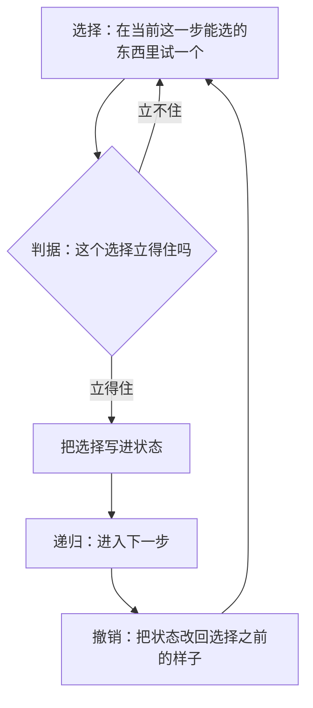

# 记忆化、分治与回溯

> **授权**：本章节属教材文档部分，采用 [CC BY-NC-ND 4.0](../LICENSE)
> 加[附加条款](../许可附加条款.md)授权：署名、非商业、禁止演绎、不允许二次分发。
> 文中引用的代码不受此限，各自保留原有许可证，详见[版权与许可说明.md](../版权与许可说明.md)。

一台设备的备件需求，写在纸上是「按前两周之和估算」；
一张排产表要回答「这批货一共有多少种装法」；
八个发射台要各分一个频道，任意两个台的频道差不能等于它们的间距。
三件事互不相干，展开的过程却是同一种形状：从当前这一步出发，
每种选择分出一根枝条，枝条上再分枝条。**同一棵展开树，
区别只在进去之后做什么**——同一个节点要不要进第二次、
子树能不能切开分给别的核、走进去之后能不能整片退回来。

递归树上能做的动作只有三种，它们承接《08-一些散落的算法/01-递归：把问题交给自己.md》章节
里已经立起来的三件套（基线、推进、合并）。**记忆化**把重复的子树只算一次，
代价是多出一张表；**分治**把子树切开各算各的，代价是多出一块缓冲区；
**回溯**沿着树走并随时退回上一个路口，代价取决于剪枝剪在哪个位置。
三种动作各自都有名字，也各自都有前提：前提不成立时，
它们不会报错，只会给出一个更慢或者干脆是错的答案。

读完这一章，拿到一个递归定义就能判断它该往哪条路上走：
同一个子问题被反复算的，用记忆化；子树互不重叠的，用分治；
答案是一批选择而不是一个数的，用回溯。
每一步的代价都有本机测出来的数，读者可以照着自己复现一遍。

---

> **约定**：标注以行内代码单独成行——`实测数据` 表示实际执行验证过，
> 复现命令随程序给出；`文档` 表示引自标准草案或官方资料；
> `待确认` 表示尚未验证。路径占位符（如 `<MinGW>`、`<工作区>`）的含义见《README.md》。
> 本章节实测环境是 Windows 11 + g++ 16.2.0（MinGW-w64），`-O2` 优化。

# 本章节定位

| 需要先知道 | 在哪 |
|---|---|
| 递归三件套（基线、推进、合并） | 《08-一些散落的算法/01-递归：把问题交给自己.md》章节 |
| 递归树怎么看：节点数、深度、同一子问题被算了几遍 | 《08-一些散落的算法/01-递归：把问题交给自己.md》章节 |
| 函数参数是按值传递的 | 《04-语法/07-函数.md》第 3 节 |
| `static` 局部变量只初始化一次 | 《04-语法/11-作用域、生存期与链接.md》第 3.2 小节 |
| `std::vector` 的容量与扩容 | 《09-高阶数据结构/A-01-连续存储：array 与 vector.md》第 3 节 |
| lambda 的引用捕获 | 《05-类与面向对象/10-lambda 与函数对象.md》第 3.1 小节 |
| 死代码消除：没人读的结果会被删掉 | 《03-构建工具链/05-优化等级.md》第 5.2 小节 |
| 测量代价的三条纪律 | 《09-高阶数据结构/A-00-导读：数据结构是问题的形状.md》第 3.3 小节 |

**相邻的章节**：本章节是 `08-一些散落的算法` 板块里讲「手法」的一章，
它前面是《08-一些散落的算法/01-递归：把问题交给自己.md》章节
（那里给出三件套与递归树，本章节照着用），
后面是排序、贪心与动态规划（记忆化的那张表在动态规划里会变成主角）。
同一板块的《08-一些散落的算法/04-查找：从线性到索引.md》章节
从「数据怎么摆」一侧讨论代价，本章节从「事情怎么做」一侧讨论代价，
两者常常同时出现在一个问题里。数据结构一侧的内容在 `09-高阶数据结构`：
记忆化的表怎么长大见《09-高阶数据结构/A-01-连续存储：array 与 vector.md》第 3 节，
分治要的辅助缓冲是同一类连续内存，回溯常用一个整数的各位记状态。

| 本章各节 | 讲什么 |
|---|---|
| 第 2.1 节 | 重复子问题怎么识别：画树、数调用、数参数组合，以及三种没有重复的情形 |
| 第 2.2 节 | 记忆化的两种落点：表由调用者给还是放在函数里，代价怎么读，前提是什么 |
| 第 2.3 节 | 分治的分、治、合三步，以及合并那一步的两种做法相差一个量级 |
| 第 2.4 节 | 回溯的选择、递归、撤销三步，剪枝放在哪里，撤销漏了会怎样 |
| 第 2.5 节 | 三者对照：同一棵递归树上，三种动作各自做了什么 |

---

# 第 2.1 节 重复子问题怎么识别

## 2.1.1 一份物料清单展开时，同一个子件出现在好几条路径上

一家做非标设备的厂，物料清单挂在 ERP 里：一台整机由若干部件组成，
部件又由子部件组成，最底层才是标准件。计划员要回答一个问题——
下周这批整机一共要领多少颗 M6 螺栓。算法只有一句话：
**一个部件的用量等于它各个子件的用量之和，子件若仍是部件，就继续往下展开。**

麻烦在于同一个部件常常挂在好几条路径上。同一款减速机既装在主轴上，
也装在送料机构上；同一颗螺栓在两条路径下都要计数。把展开过程画出来，
它是一棵树，而**这棵树里有两棵长得一模一样的子树**：

`Text`

```text
整机
├── 主轴部件 ──┬── 减速机 ──┬── 齿轮组
│              │            └── M6 螺栓 × 4
│              └── M6 螺栓 × 8
└── 送料部件 ──┬── 减速机 ──┬── 齿轮组      ← 与上面那棵减速机子树一样
               │            └── M6 螺栓 × 4
               └── 皮带轮
```

看代码是看不出这件事的。展开函数只有几行，每次调用传进去的部件编号不同，
它自己并不知道「这个编号刚才算过」。**重复来自参数取值的重复，
而不是来自代码写得不好。** 一份清单只有几百个部件，
展开出来的节点却可能有几万个，差额全在这种重复上。

这一段话翻译成递归的术语是这样一句：
**同一棵递归树上，同一个子问题被算了不止一次。** 识别它有三个动作。

## 2.1.2 三个动作：画树、数调用、数参数组合

**第一个动作是把头几层画出来。** 不用画全，画出三层就够：
只要有两棵子树的形状一样、往下要解决的问题一样，重复就存在。
判断的标准不是名字一样，而是**参数一样**——
名字不同但参数相同的两个节点，在树上就是同一个子问题。

把 `fib(5)` 的展开画出来，重复的形状一眼可见：

`Text`

```text
fib(5)
├── fib(4)
│   ├── fib(3)
│   │   ├── fib(2)
│   │   │   ├── fib(1)
│   │   │   └── fib(0)
│   │   └── fib(1)
│   └── fib(2)
│       ├── fib(1)
│       └── fib(0)
└── fib(3)              ← 与上面那棵 fib(3) 长得一样
    ├── fib(2)
    │   ├── fib(1)
    │   └── fib(0)
    └── fib(1)
```

这棵树有 15 个节点，也就是 `fib(5)` 进了 15 次函数，
与闭式 `2 × fib(6) − 1 = 15` 对得上。**两棵 `fib(3)` 子树一模一样，
它们下面的每一个节点都要再算一遍**；参数只有 6 种取值
（`fib(0)` 到 `fib(5)`），树里却有 15 个节点，多出来的 9 个全是重复。

**第二个动作是给函数加一个计数器。** 一个全局变量，进函数就加一，
跑完打印出来。这个数比任何推理都直接：它说明函数一共进了多少次。
下面这份对照表里的三个数，来自第 2.2 节那份程序，
它把四种写法的进函数次数都数了出来：

| 写法（算 `fib(30)`） | 进函数多少次 | 同一个子问题各算几遍 | 参数组合数（表最多要多少格） |
|---|---|---|---|
| 朴素递归 | 2692537 | 平均 86856 遍 | 没有表 |
| 记忆化（表在参数里） | 59 | 每个一遍 | 31 |
| 记忆化（表在函数里） | 59 | 每个一遍 | 31 |
| 自底向上递推 | 1 | 每个一遍 | 不需要表 |

`2692537` 这个数可以先自己核对一遍再相信它。按朴素递归的写法，
`fib(k)` 的调用次数满足 `c(k) = c(k-1) + c(k-2) + 1`，
闭式解是 `2 × fib(31) − 1`；`fib(31) = 1346269`，
算出来正是 `2692537`。**数出来的次数与闭式解对得上，
说明计数器没有漏也没有重复计。**

**第三个动作是数参数有几种取值。** 这一步决定表要多大，
也决定「重复」到底有多严重。斐波那契的参数只有一个 `n`，
取值为 `0` 到 `30` 共 31 种；把 `2692537` 除以 `31`，
平均每一种参数被算了 **86856 遍**。这个比值就是重复的倍数，
也是记忆化能省下的上限——记忆化之后每个子问题只算一遍，
进函数次数从 `2692537` 掉到 `59`。

> [!IMPORTANT]
> **判据写成一句话：进函数次数远大于参数组合数，就有重复子问题。**
> 三个动作里，数参数组合是最该先做的一个：它同时给出表的大小
> 与「值不值得记忆化」的答案。参数组合数只有几十种而调用上百万次，
> 记忆化的收益最大；参数组合数本身就是天文数字（例如一个 `2^n` 的集合），
> 表根本放不下，只能换一条路走。

## 2.1.3 三种没有重复的情形

反过来看，有哪几类递归天生没有重复子问题，不需要记忆化。

| 情形 | 树长什么样 | 为什么没有重复 |
|---|---|---|
| **对半切开型**（分治） | 每个区间只出现在一个节点上 | 左右两半互不重叠，节点数由数据规模决定，与 `2^n` 无关 |
| **枚举全部选择型**（回溯） | 叶子就是答案本身 | 每一条路径都要输出，重复的子树不能省 |
| **只用到前几步的递推型** | 链状，一步接一步 | 每一步只要前几个值，留几个变量就够 |

第一种以归并排序为代表。它的递归树有 `n` 个叶子、`2n − 1` 个节点，
`n` 是多少节点就是多少量级，没有一处重复。
第二种以全排列为代表：要的是「把这 8 个列号的所有摆法列出来」，
就算两条路径通向同一份剩下的选择，**那两份选择也必须各输出一遍**，
记忆化在这里省不掉任何东西。第三种以斐波那契的递推写法为代表：
只要留住前两项，一路推上去即可，不需要记住算过的每一项。

> [!TIP]
> **加计数器是识别重复子问题最省力的办法。**
> 它比读代码可靠，也比画全树快：一个全局计数变量、进函数加一，
> 跑一次就知道有没有重复、大概重复多少倍。
> 重复常常藏在「参数写法不同、指向的却是同一个子问题」的地方，
> 例如两个方向相反但结果对称的区间，这种情形靠肉眼很难看出来。

> [!NOTE]
> 第 2.1 节小结：**同一个子问题被算了不止一次，是递归树上的一种结构，
> 不是代码写得差。** 识别它靠三个动作——画三层树、数进函数次数、
> 数参数组合数；判据是调用次数远大于参数组合数。
> 分治、枚举全部选择、只用到前几步的递推，这三类天生没有重复，
> 遇到它们不必记忆化。

---

# 第 2.2 节 记忆化的两种落点

## 2.2.1 一张按前两期之和估算的需求表

一个备件计划工具要在页面上给出未来若干期的需求估算，
规则由计划员定：每一期的需求按前两期之和算。这条规则写成递归只要两行，
于是第一版就是这么写的。上线之后问题来了：页面上有几十个指标，
每个指标要算若干期，运维每次刷新都会重新算一整个屏幕；
一次批处理里，同一份数据还要被几张报表各问一次。
**同一条递推在几分钟里被展开了几十万次，其中绝大多数是重复的。**

本章节用斐波那契数做这条递推的替身。它的定义与那份估算完全同形
（前两项之和），而且小到能把次数、表长、耗时都摆在一张纸上核对。
下面这份程序把四种写法并排放进同一个 `main`：
朴素递归、表由调用者给、表放在函数里、自底向上递推。
它不比较「谁写得漂亮」，只把每一档的进函数次数、命中次数、
表长与单次耗时打出来。

## 2.2.2 一份程序里的四种写法

`C++`

```cpp
/* memo_fib.cpp    编译：g++ -std=c++17 -O2 memo_fib.cpp -o memo_fib
 * 同一件斐波那契：朴素递归、自顶向下记忆化（表在参数里 / 表在函数里）、自底向上递推。 */
#include <chrono>
#include <cstdio>
#include <vector>

static long long g_calls = 0;      // 进过多少次函数
static long long g_hits = 0;       // 记忆化命中过多少次

static unsigned long long fib_naive(int n) {
    ++g_calls;
    if (n < 2) return static_cast<unsigned long long>(n);
    return fib_naive(n - 1) + fib_naive(n - 2);
}

// 落点一：表由调用者给（表是参数，函数本身没有状态）
static unsigned long long fib_memo(int n, std::vector<long long>& memo) {
    ++g_calls;
    if (n < 2) return static_cast<unsigned long long>(n);
    if (memo[static_cast<size_t>(n)] >= 0) { ++g_hits; return static_cast<unsigned long long>(memo[static_cast<size_t>(n)]); }
    const unsigned long long r = fib_memo(n - 1, memo) + fib_memo(n - 2, memo);
    memo[static_cast<size_t>(n)] = static_cast<long long>(r);
    return r;
}

// 落点二：表放在函数里（静态存储期，第一次调用时建好）
static unsigned long long fib_memo_static(int n) {
    static std::vector<long long> memo;
    ++g_calls;
    if (memo.empty()) memo.assign(static_cast<size_t>(n) + 1, -1);
    if (n < 2) return static_cast<unsigned long long>(n);
    if (memo[static_cast<size_t>(n)] >= 0) { ++g_hits; return static_cast<unsigned long long>(memo[static_cast<size_t>(n)]); }
    const unsigned long long r = fib_memo_static(n - 1) + fib_memo_static(n - 2);
    memo[static_cast<size_t>(n)] = static_cast<long long>(r);
    return r;
}

// 自底向上：没有递归，也没有「查表命中」这回事
static unsigned long long fib_iter(int n) {
    unsigned long long a = 0, b = 1;
    for (int i = 0; i < n; ++i) { const unsigned long long t = a + b; a = b; b = t; }
    return a;
}

template <class F>
static double avg_ms(int rounds, F&& f) {
    const auto t0 = std::chrono::steady_clock::now();
    for (int r = 0; r < rounds; ++r) f();
    const auto t1 = std::chrono::steady_clock::now();
    return std::chrono::duration<double, std::milli>(t1 - t0).count() / rounds;
}

int main() {
    const int N = 30;
    g_calls = 0;
    const unsigned long long f1 = fib_naive(N);
    const long long naive_calls = g_calls;

    std::vector<long long> memo(static_cast<size_t>(N) + 1, -1);
    g_calls = g_hits = 0;
    const unsigned long long f2 = fib_memo(N, memo);
    const long long memo_calls = g_calls, memo_hits = g_hits;

    g_calls = g_hits = 0;
    const unsigned long long f3 = fib_memo_static(N);
    const long long st_calls = g_calls, st_hits = g_hits;

    const unsigned long long f4 = fib_iter(N);

    std::printf("fib(%d) 四个答案：%llu %llu %llu %llu\n", N, f1, f2, f3, f4);
    std::printf("朴素递归：进函数 %lld 次，一次表都没查\n", naive_calls);
    std::printf("记忆化（表在参数里）：进函数 %lld 次，查表命中 %lld 次，表长 %d\n",
                memo_calls, memo_hits, N + 1);
    std::printf("记忆化（表在函数里）：进函数 %lld 次，查表命中 %lld 次\n", st_calls, st_hits);
    std::printf("自底向上递推：进函数 1 次，不查表\n");

    const double t_naive = avg_ms(5, [&] { volatile unsigned long long v = fib_naive(32); (void)v; });
    const double t_memo = avg_ms(1000, [&] {
        std::vector<long long> m(33, -1);
        volatile unsigned long long v = fib_memo(32, m);
        (void)v;
    });
    const double t_iter = avg_ms(1000000, [&] { volatile unsigned long long v = fib_iter(32); (void)v; });
    std::printf("fib(32) 折算成单次耗时（轮数按规模反过来定，总工作量都落在几十毫秒）：\n");
    std::printf("  朴素递归        %8.0f ns（跑 5 遍）\n", t_naive * 1e6);
    std::printf("  记忆化          %8.0f ns（跑 1000 遍，表每次重建）\n", t_memo * 1e6);
    std::printf("  自底向上递推    %8.0f ns（跑 1000000 遍）\n", t_iter * 1e6);
    return 0;
}
```

`实测数据`
`Text`

```text
fib(30) 四个答案：832040 832040 832040 832040
朴素递归：进函数 2692537 次，一次表都没查
记忆化（表在参数里）：进函数 59 次，查表命中 27 次，表长 31
记忆化（表在函数里）：进函数 59 次，查表命中 27 次
自底向上递推：进函数 1 次，不查表
fib(32) 折算成单次耗时（轮数按规模反过来定，总工作量都落在几十毫秒）：
  朴素递归         2287800 ns（跑 5 遍）
  记忆化               263 ns（跑 1000 遍，表每次重建）
  自底向上递推           8 ns（跑 1000000 遍）
```

这个输出块里有三件事值得逐行读。**四个答案完全相同**，
`832040` 这个值证明四种写法算的是同一件事；
`2692537` 与 `59` 的对比证明记忆化省下的是函数调用次数，不是某一次加法；
`查表命中 27 次` 就是记忆化版本里真正「取用缓存」的次数。
把这几个数拆开对一遍正好合得上：`fib(30)` 要填 29 个格子
（`fib(2)` 到 `fib(30)`；`fib(0)` 与 `fib(1)` 是基线，不进表），
59 次进入 = 29 次填格子 + 27 次命中 + 3 次基线调用
（`fib(1)` 被调了两次、`fib(0)` 一次）。

## 2.2.3 两种落点：表由调用者给，还是放在函数里

记忆化要回答的第二个问题是「表放在哪」。两种落点各有各的用法。

**落点一：表是参数，由调用者给。** 函数本身没有状态，
同样的实参换一张空表就是一次干净的计算。它可重入、可测、
可以被两个线程各拿一张表同时跑，表的大小与生存期由调用者决定，
用完就能释放。代价是每层递归都要多传一个参数，
调用者必须自己建表、自己判断表该多大、自己管它的生死。

**落点二：表放在函数里。** 用 `static` 局部变量，静态存储期，
第一次调用时建好。调用者看不见表，接口与朴素递归完全一样，
改起来只动函数内部。代价是状态藏进了函数：

| 差异 | 表由调用者给 | 表放在函数里 |
|---|---|---|
| 函数有没有状态 | 没有 | 有，跨调用保留 |
| 接口 | 多一个表参数 | 与朴素递归一样 |
| 可重入、可多线程各跑一份 | 可以 | 不行，要加锁或改用局部表 |
| 两次调用的关系 | 互不影响 | 第二次调用看得见第一次填的格子 |
| 表多大、什么时候释放 | 调用者决定 | 函数自己决定，进程结束才释放 |
| 测试时怎么隔离 | 换一张空表 | 换不了，只能重启进程或加清理接口 |

`static` 局部变量在这里的语义与《04-语法/11-作用域、生存期与链接.md》第 3.2 小节
讲的完全一致：**只初始化一次，第一次调用时建好，之后一直活着。**

> [!WARNING]
> **表放在函数里时，表长由第一次调用的参数决定。**
> 上面那份程序里，第一次调用传的是 `30`，表就建成 31 格；
> 之后再传一个更大的参数进来，`memo[n]` 就直接越过表尾了，
> 而且不会有任何编译错误。生产代码要在入口按需扩表，
> 或者干脆换成哈希表式的稀疏缓存。
> **这份程序的写法只在「同一次运行里先用大参数、后用更大参数」时才出问题**，
> 它自己只调用了一次，因此没有暴露出来——引用这段代码时要连这个前提一起看。

**第三种写法：自底向上递推。** 它不算记忆化的一个落点，
但它给出了同一件事的另一条路：从 `fib(0)`、`fib(1)` 往上推，
每一步只用前两项，**不需要递归，也不需要表**，两个变量滚动着走。
表在自顶向下里是「记住算过的」，在自底向上里是「根本不必记住」，
因为每一项在被用到之前就已经算好了，用完就丢。

## 2.2.4 代价：那三行计时怎么读

输出块里最后三行是耗时，读它们要先知道轮数是怎么定的：
**贵的写法少跑几遍，便宜的写法多跑几遍**，让每一档的读数都落在
能测准的量级上，而不是贴着时钟的分辨率。这就是「轮数按规模反比设置」——
朴素递归跑 5 遍就够，记忆化要跑 1000 遍，递推要跑 100 万遍。

三行里最容易读错的是递推那一行。**它不是「跑一遍测出来的」，
而是跑 100 万遍再折算成一遍**：单跑一遍斐波那契递推，
读数会落在时钟分辨率附近，甚至直接是 0，那不是一个可以引用的数。
同样贴着分辨率的读数出现在别处时，正确做法都是加大轮数再折算，
而不是把那个 0 当成「快到测不出来」。这条纪律的来历与另外两条
见《09-高阶数据结构/A-00-导读：数据结构是问题的形状.md》第 3.3 小节。

本机两次运行的读数：朴素递归 **2287800 到 2900200 ns**，
记忆化 **263 到 288 ns**，递推 **8 到 10 ns**。
输出块里放的是其中一次。把区间中段拿来折算，两个倍数就清楚了：

| 比较 | 倍数 | 省下的是什么 |
|---|---|---|
| 朴素递归 ÷ 记忆化 | 约 8700 倍 | 把 2692537 次函数调用压到 59 次 |
| 记忆化 ÷ 递推 | 约 33 倍 | 去掉查表与递归，只留一层循环 |

> [!IMPORTANT]
> **记忆化省下的是「重复的调用」，不是「更快的加法」。**
> 朴素递归那 2692537 次里，绝大多数是在重复算同一批格子；
> 记忆化把它们换成 59 次函数进入与 27 次查表命中。
> 因此它的收益与「重复倍数」同量级，而不是与常数因子同量级——
> 换一台更快的机器，8700 倍会变，但记忆化更快这个方向不会变。

## 2.2.5 记忆化的前提

记忆化不是给递归加一层缓存那么简单，它有三条前提，缺一条就会得到错的答案。

**前提一：子问题的答案只由参数决定。** 同一个参数进来，
必须得到同一个答案，缓存才有意义。如果函数的返回值还依赖
「调用之前发生过什么」（全局状态、上一次的结果、文件读到哪了），
那么第一次算出的值不能代表第二次。

**前提二：参数能当表的键。** 整数下标最直接；多个参数要合成一个键
（例如把 `(行, 列)` 压成一个整数），或者用嵌套的表；
字符串要先哈希；浮点数不能直接当键。键的取值个数就是表的格数，
这直接回到第 2.1 节的第三个动作。

**前提三：表的规模撑得住。** 参数组合数是 `2^n` 那一类问题时，
表本身就要 `2^n` 格，记忆化反而先把内存撑爆。
这时要么只缓存一部分（例如按区间分块），要么改成自底向上、
只保留需要的那一层状态。

> [!CAUTION]
> **有副作用的函数不能直接记忆化。**
> 打印、写文件、修改全局状态、申请资源，这些动作在第二次调用时
> 会随着缓存命中一起被跳过。程序看起来跑得更快，动作却少做了一遍，
> 结果是一份静默的错——不报错、不崩溃，只是输出比预期少。
> 汉诺塔与全排列就是这一类：它们的「答案」是动作序列本身，
> 每一步都必须真的做出来，因此它们不接受记忆化（见第 2.5.3 小节）。

> [!NOTE]
> 第 2.2 节小结：**记忆化 = 一张表 + 一个查表的判断。**
> 表由调用者给，函数就没有状态、可重入、可测；
> 表放在函数里，接口不变，但状态跨调用保留，表长还由第一次调用决定。
> 自底向上递推是第三条路，连表都不需要。
> 代价读法上记住一条：**贴着时钟分辨率的读数不是结论，
> 加大轮数折算出来的才是。**

---

# 第 2.3 节 分治三步与合并代价

## 2.3.1 一天一百万条事件要按时间排好

一台日志分析机每天从几十台机器收事件，每条记录里都有时间戳。
报表的第一个动作是按时间段取数据——「把九点到十点之间的全部事件调出来」，
而这件事只有在数据按时间有序时才快。因此每天收完数据，
第一件事是把这一百万条记录按时间戳排好。

一百万个 `int` 是 4 MB，一次装得进内存，不必动用外部排序，
但排序本身要在报表超时之前跑完。选归并排序有两个理由：
它把「对半切开」写成了显式的递归，正好是分治的标准形；
它的合并那一步有两种常见做法，**同一个算法、同一个结果、
搬移次数相差一个量级**，正好用来说明实现选择能值多少钱。

## 2.3.2 分、治、合三步

归并排序的递归树是一棵满二叉树，每个节点代表一个区间：

`Text`

```text
                     [0, 8)
          ┌────────────┴────────────┐
        [0, 4)                    [4, 8)
     ┌────┴────┐              ┌────┴────┐
   [0, 2)    [2, 4)        [4, 6)    [6, 8)
   ┌──┴──┐   ┌──┴──┐       ┌──┴──┐   ┌──┴──┐
 [0,1) [1,2) [2,3) [3,4) [4,5) [5,6) [6,7) [7,8)
```

三步各做一件事：

| 步骤 | 做什么 | 代价落在哪 |
|---|---|---|
| **分** | 把区间对半切开：`mid = lo + (hi - lo) / 2` | 一次减法、一次加法、两次递归调用，可以忽略 |
| **治** | 两半各自调用自己排好 | 递归调用本身，不含比较 |
| **合** | 把两段已经有序的并成一段 | **比较与搬移全在这里**，还要一块辅助空间或一段就地搬移 |

**基线在叶子那一层**：区间里只剩一个元素时，它自己就是有序的，
直接返回。整棵树因此不需要「判断一个元素有没有序」这种额外逻辑。

三步里只有「合」需要动数据，另两步只是把问题交出去。
这也是分治的通用形状：**分与治是免费的，合是要付钱的**，
而付多少钱由「合」怎么写决定。下面这份程序把两种写法放在同一批数据上。

## 2.3.3 一份程序：两种合并方式，同一批数据

`C++`

```cpp
/* divide_conquer.cpp    编译：g++ -std=c++17 -O2 divide_conquer.cpp -o divide_conquer
 * 分治的合并代价：同样是归并排序，合并用辅助数组与在原地搬，比较与搬移各差多少。 */
#include <algorithm>
#include <chrono>
#include <cstdio>
#include <vector>

struct Counter {
    long long cmp = 0;      // 比较次数
    long long mv = 0;       // 搬移次数（写进数组算一次）
};

// 合并：两边各取一个比大小，谁小谁先进临时数组
static void merge_aux(int* a, int* tmp, int lo, int mid, int hi, Counter* c) {
    int i = lo, j = mid, k = lo;
    while (i < mid && j < hi) {
        ++c->cmp;
        tmp[k++] = (a[i] <= a[j]) ? a[i++] : a[j++];
        ++c->mv;
    }
    while (i < mid) { tmp[k++] = a[i++]; ++c->mv; }
    while (j < hi) { tmp[k++] = a[j++]; ++c->mv; }
    for (int t = lo; t < hi; ++t) { a[t] = tmp[t]; ++c->mv; }
}

static void msort_aux(int* a, int* tmp, int lo, int hi, Counter* c) {
    if (hi - lo <= 1) return;
    const int mid = lo + (hi - lo) / 2;
    msort_aux(a, tmp, lo, mid, c);
    msort_aux(a, tmp, mid, hi, c);
    merge_aux(a, tmp, lo, mid, hi, c);
}

// 原地合并：不借辅助数组，把右边的元素一个个插到左边去
static void merge_inplace(int* a, int lo, int mid, int hi, Counter* c) {
    int i = lo, j = mid;
    while (i < j && j < hi) {
        ++c->cmp;
        if (a[i] <= a[j]) { ++i; continue; }
        const int v = a[j];
        for (int k = j; k > i; --k) { a[k] = a[k - 1]; ++c->mv; }
        a[i] = v;
        ++c->mv;
        ++i;
        ++j;
    }
}

static void msort_inplace(int* a, int lo, int hi, Counter* c) {
    if (hi - lo <= 1) return;
    const int mid = lo + (hi - lo) / 2;
    msort_inplace(a, lo, mid, c);
    msort_inplace(a, mid, hi, c);
    merge_inplace(a, lo, mid, hi, c);
}

// 固定的伪随机输入：不依赖随机数库，每次跑都是同一份数据
static void fill(int* a, int n) {
    for (int i = 0; i < n; ++i) a[i] = static_cast<int>((static_cast<unsigned>(i) * 2654435761u) >> 8) & 0xffff;
}

template <class F>
static double avg_ms(int rounds, F&& f) {
    const auto t0 = std::chrono::steady_clock::now();
    for (int r = 0; r < rounds; ++r) f();
    const auto t1 = std::chrono::steady_clock::now();
    return std::chrono::duration<double, std::milli>(t1 - t0).count() / rounds;
}

int main() {
    const int N = 1024;
    std::vector<int> base(static_cast<size_t>(N));
    fill(base.data(), N);

    std::vector<int> a1 = base, tmp(static_cast<size_t>(N)), a2 = base, a3 = base;
    Counter c1, c2, c3;
    msort_aux(a1.data(), tmp.data(), 0, N, &c1);
    msort_inplace(a2.data(), 0, N, &c2);
    std::sort(a3.begin(), a3.end(), [&c3](int x, int y) { ++c3.cmp; return x < y; });

    std::printf("n=1024（数据固定，每个版本排的都是同一份）：\n");
    std::printf("归并（辅助数组）：比较 %lld 次，搬移 %lld 次\n", c1.cmp, c1.mv);
    std::printf("归并（原地搬移）：比较 %lld 次，搬移 %lld 次\n", c2.cmp, c2.mv);
    std::printf("std::sort        ：比较 %lld 次（它不搬元素，只交换）\n", c3.cmp);
    std::printf("三个版本排出来一样：%s\n",
                (a1 == a2 && a1 == a3 && std::is_sorted(a1.begin(), a1.end())) ? "是" : "否");

    const int M = 1000000;
    std::vector<int> big(static_cast<size_t>(M)), big2, buf(static_cast<size_t>(M));
    fill(big.data(), M);
    big2 = big;
    const double t_merge = avg_ms(3, [&] {
        big = big2;
        msort_aux(big.data(), buf.data(), 0, M, &c1);
    });
    const double t_std = avg_ms(3, [&] {
        big = big2;
        std::sort(big.begin(), big.end());
    });
    std::printf("\nn=1000000（各 3 遍取平均）：归并 %.1f ms，std::sort %.1f ms\n", t_merge, t_std);

    const int S = 20000;
    std::vector<int> small(static_cast<size_t>(S));
    fill(small.data(), S);
    c2 = Counter{};
    const double t_inplace = avg_ms(1, [&] { msort_inplace(small.data(), 0, S, &c2); });
    // 把结果读出来：不然「排好的数组没人看」，优化器有权把整段写操作删掉
    long long check = 0;
    for (int x : small) check += x;
    std::printf("原地搬移版 n=20000 单独跑一次：%.1f ms（%lld 次搬移，校验和 %lld）\n",
                t_inplace, c2.mv, check);
    return 0;
}
```

`实测数据`
`Text`

```text
n=1024（数据固定，每个版本排的都是同一份）：
归并（辅助数组）：比较 9043 次，搬移 20480 次
归并（原地搬移）：比较 9043 次，搬移 264420 次
std::sort        ：比较 12163 次（它不搬元素，只交换）
三个版本排出来一样：是

n=1000000（各 3 遍取平均）：归并 27.1 ms，std::sort 43.8 ms
原地搬移版 n=20000 单独跑一次：6.1 ms（100046588 次搬移，校验和 655067815）
```

## 2.3.4 合并那一步的代价

先看辅助数组版的两个数。**比较 9043 次**与 `n · log2 n`
（`1024 × 10 = 10240`）同量级，略少一点是因为每段合并到最后
只剩一个元素时不必再比。**搬移 20480 次**可以完全拆开算：
每一层把 `1024` 个元素写进临时数组、再写回原数组，共两趟，
而 `1024 = 2^10` 说明有 10 层，于是 `2 × 1024 × 10 = 20480`，
与数出来的值逐位相同。

再看原地搬移版。**比较次数与辅助数组版完全一样（9043）**，
因为两个版本的判据相同，都是「两边队首谁小」。
搬移次数却是 `264420`，是辅助数组版的约 12.9 倍：

| 合并方式 | 比较次数 | 搬移次数 | 搬移的增长 |
|---|---|---|---|
| 辅助数组 | 9043 | 20480 | 每层 `2n` 次，共 `log2 n` 层，即 `n log n` 量级 |
| 原地搬移 | 9043 | 264420 | 每个元素插入时要把它前面的一段整体右移，即 `n²` 量级 |

**同一个算法、同样的比较次数，只因为「合」的做法不同，
搬移次数差了一个量级。** 原地版省下的是那块与数据等长的缓冲，
付出的代价在搬移上，而且这个代价随规模涨得更快。
`n=20000` 那一行把这个趋势摆了出来：单独跑一次是 `6.1 ms`，
搬移 `100046588` 次——已经是一亿的量级。

> [!IMPORTANT]
> **分治的三步里，代价几乎全部落在「合」上。**
> 「分」是一次减法与两次递归调用，「治」是递归本身，
> 真正动数据、真正需要额外空间的只有「合」。
> 换一种合并方式，比较次数可以一模一样，搬移次数却能差一个量级；
> 把原地版的搬移次数按 `n²` 折算到一百万条，是 `2.5 × 10^11` 次，
> 这条路在这个规模上走不通——**它适合几百到几千条，不适合百万条。**

## 2.3.5 `std::sort` 那一列只能当参考

输出里 `std::sort` 的比较次数是 `12163`。**这个数必须连它的出处一起读：
它是这一套标准库的实现细节**（libstdc++，随 g++ 16.2.0 发布），
用的是内省排序——快排为主，递归太深时换成堆排，小区间用插入排序。
换一套标准库，这个数会变；换一个数据分布，它也会变。

**归并那一列不会变。** 辅助数组版的 `9043` 次比较与 `20480` 次搬移
是由算法本身决定的：合并两个长度之和为 `m` 的有序段，
最多比较 `m - 1` 次、搬移 `2m` 次，与标准库是谁写的无关。
这是「算法决定的量」与「实现决定的量」的分别，
后面引用这两个数时可以放心，引用 `12163` 时必须带上版本。

还有一处不能并排比：**程序的计数器只挂在比较器上**，
`std::sort` 内部交换元素的次数没有进计数，因此它那一行的搬移是空的。
它的输出行里也写明了「它不搬元素，只交换」——
交换一次要写三次（临时变量），但那是另一套计数口径。

## 2.3.6 写回的结果要有人读

`n=20000` 那一行是单独跑一遍测出来的，跑之前有一个前提：
**排好序的数组必须有人读。** 如果排序结果没人看，
`-O2` 有权把整段写回数组的操作删掉，读数就会变成 `0.000 ms`——
那是优化器删掉计算的读数，不是「快到测不出来」
（见《03-构建工具链/05-优化等级.md》第 5.2 小节与
《09-高阶数据结构/A-00-导读：数据结构是问题的形状.md》第 3.3 小节）。
程序因此最后把数组求和打印出来：

**校验和 `655067815`** 是一个逐位可复核的结构量。
同一份固定输入、同一个规模，排完之后求和就是这个数。
它同时起两个作用：证明排序真的发生了，也给读者一个可核对的锚点——
自己重跑一遍，校验和对不上就说明输入或代码被改过。

计时量给区间：**归并 `20.8` 到 `27.1 ms`，`std::sort` `41.9` 到 `43.8 ms`**
（同一台机器上两次运行）。输出块里是其中一次。

这一批数据上归并更快，原因可以拆开看：比较少了约四分之一
（`9043` 对 `12163`），搬移全是顺序写，而 `std::sort` 原地交换，
写的位置跳来跳去。**但这不构成「归并一定比 `std::sort` 快」**：
归并多占了 4 MB 的辅助缓冲（一百万个 `int`），
换成别的数据分布、别的规模、别的标准库，相对快慢都可能翻过来。
能用一句话说死的只有一件：**归并拿空间换顺序，`std::sort` 不花这块空间。**

> [!NOTE]
> 第 2.3 节小结：**分治 = 分、治、合三步，代价几乎全在「合」。**
> 「分」把区间对半切开，「治」两半各自递归，「合」把两段有序的并成一段。
> 合的做法决定搬移量：借一块辅助数组是 `n log n` 量级，
> 在原地一个个插进去是 `n²` 量级，两者比较次数可以完全相同。
> 引用 `std::sort` 的比较次数时要带上标准库与版本，
> 引用归并的次数时不必——后者由算法决定。

---

# 第 2.4 节 回溯的骨架与剪枝位置

## 2.4.1 八个发射台要各分一个频道

山顶上有八个发射台沿一条线排开，位置编号 `0` 到 `7`，
两两之间的距离就是编号之差。可用的频道有八个，编号 `0` 到 `7`，
相邻频道间隔 25 kHz。无线电的互调约束是这样一条：
**两个台的频道差不能等于它们的间距**，否则它们的互调产物
正好落进对方的频道里；同时**每个频道只能分给一个台**，同频一样会互相干扰。
工程队要问三件事：一共有多少种分法、给一种分法、把可行的分法列出来交给上级挑。

逐台分配就能回答第一个问题：第一台先试一个频道，试得通就交给第二台，
第二台再试；某一台八个频道都试不通，就退回上一台换一个频道。
**台对应行，频道对应列，那条互调约束的两个符号正好是八皇后的两条对角线**，
因此这份工程约束与八皇后是同一个问题。下面这份程序给出两个版本：
一个把判据放在「试下一个频道之前」，一个干脆不判、
先把八个频道号的所有排列摆完再检查对角线。

## 2.4.2 骨架三步：选择、递归、撤销

回溯的骨架只有三步，写成流程是这样：

`Mermaid`



**第一步是选择**：把当前这一步所有可能的选择列出来，逐个试。
八个台分频道时，每一台有八个候选。

**第二步是递归**：把选中的那个写进状态（记下「这个频道被占了」
「这两条对角线被占了」），然后进入下一步，
也就是对下一台重复同一件事。

**第三步是撤销**：递归返回之后，把刚才写进状态的东西改回去。
这一步最容易漏，因为漏了不会报错、不会崩溃，
只会让**后面的分支看到一份被污染的状态**：
上一层用过的选择还占着位置，本该能试的候选被判据挡掉。
结果通常不是「多算了一些」，而是「少算了」——
可行解被挡掉，输出比真实答案小。
它总能被查出来：把结果与已知答案对一遍，
数字对不上；或者把状态打印出来，会看到没有递归调用的那一层
状态却在变。

> [!TIP]
> **撤销有两种写法，选一种并写一致。**
> 一种是显式写回：**改之前先把旧值记下来，递归回来再写回**，
> 这对数组、全局变量这类「大家共用一份」的状态是必需的；
> 另一种是把状态按值传给下一层，**每一层拿到的是自己的副本，
> 返回时上一层的副本原封不动**，撤销由这件事自动完成。
> 后一种写法少一行代码，代价是每层多复制几个字节；
> 前一种写法省复制，但选择与撤销必须成对出现，不能只写一半。

## 2.4.3 一份程序：剪枝版与暴力版

`C++`

```cpp
/* queens.cpp    编译：g++ -std=c++17 -O2 queens.cpp -o queens
 * 回溯的两件事：剪枝放在哪里，代价差多少。同一件事给剪枝版与暴力版。 */
#include <chrono>
#include <cstdio>

static long long g_tries = 0;      // 尝试放一个皇后的次数 = 剪枝版走过的节点数

// 剪枝版：逐行放，放下之前先看列与两条对角线让不让
static void place(int row, int n, unsigned cols, unsigned d1, unsigned d2, long long* solutions) {
    if (row == n) { ++*solutions; return; }
    for (int c = 0; c < n; ++c) {
        ++g_tries;
        const unsigned bit = 1u << c;
        if ((cols & bit) || (d1 & (1u << (row + c))) || (d2 & (1u << (row - c + n - 1)))) continue;
        place(row + 1, n, cols | bit, d1 | (1u << (row + c)), d2 | (1u << (row - c + n - 1)), solutions);
    }
}

// 暴力版：先把 n 个列号全排列出来，摆完再看对角线
static long long g_perms = 0, g_checks = 0;

static void permute(int k, int n, int* col, bool* used, long long* solutions) {
    if (k == n) {
        ++g_perms;
        for (int i = 0; i < n; ++i)
            for (int j = i + 1; j < n; ++j) {
                ++g_checks;
                if (col[i] - col[j] == i - j || col[j] - col[i] == i - j) return;   // 同一条对角线
            }
        ++*solutions;
        return;
    }
    for (int c = 0; c < n; ++c) {
        if (used[c]) continue;
        used[c] = true;
        col[k] = c;
        permute(k + 1, n, col, used, solutions);
        used[c] = false;
    }
}

template <class F>
static double avg_ms(int rounds, F&& f) {
    const auto t0 = std::chrono::steady_clock::now();
    for (int r = 0; r < rounds; ++r) f();
    const auto t1 = std::chrono::steady_clock::now();
    return std::chrono::duration<double, std::milli>(t1 - t0).count() / rounds;
}

int main() {
    std::printf("剪枝版：\n");
    std::printf("n    解数        尝试放子次数\n");
    for (int n = 8; n <= 13; ++n) {
        long long sol = 0;
        g_tries = 0;
        place(0, n, 0u, 0u, 0u, &sol);
        std::printf("%-4d %-11lld %lld\n", n, sol, g_tries);
    }

    std::printf("\n暴力版（n=8）：\n");
    int col[8];
    bool used[8] = {false};
    long long sol = 0;
    permute(0, 8, col, used, &sol);
    std::printf("枚举出 %lld 个排列，其中 %lld 个是解，检查对角线 %lld 次\n",
                g_perms, sol, g_checks);

    const double t13 = avg_ms(3, [&] {
        long long s = 0;
        g_tries = 0;
        place(0, 13, 0u, 0u, 0u, &s);
        volatile long long v = s;
        (void)v;
    });
    std::printf("\n剪枝版 n=13 跑 3 遍取平均：%.2f ms（每次试 %lld 次）\n", t13, g_tries);
    return 0;
}
```

`实测数据`
`Text`

```text
剪枝版：
n    解数        尝试放子次数
8    92          15720
9    352         72378
10   724         348150
11   2680        1806706
12   14200       10103868
13   73712       59815314

暴力版（n=8）：
枚举出 40320 个排列，其中 92 个是解，检查对角线 235090 次

剪枝版 n=13 跑 3 遍取平均：149.47 ms（每次试 59815314 次）
```

## 2.4.4 剪枝放在哪里

两个版本对同一件事给出了两组数。**剪枝版在 `n=8` 上只试了 `15720` 次放子**，
它把判据放在「试下一个频道之前」：判断不让，`continue`，
整个分支一行都不进去。**暴力版不判，走完 `40320` 个完整排列**
（`8! = 40320`），摆完再检查对角线 `235090` 次。

第三个数字可以算出来作为参照：如果连「先判后进」都不做，
每一台都试八个频道、共八层，进入函数的次数是 `8^8 = 16777216`。
三种做法的差别全在「进不进那个节点」上：

| 做法 | 树上进去的是哪些节点 | `n=8` 的规模 |
|---|---|---|
| 判据放在进入下一层之前 | 只进去还立得住的节点 | 尝试放子 `15720` 次 |
| 递归进去之后再判 | 每个候选都要进一次函数 | 按行枚举 `8^8 = 16777216` 次 |
| 完全不判，摆完再看 | 完整排列的叶子 `8! = 40320` 个 | 再逐对检查对角线 `235090` 次 |

**判据挪一个位置，代价就换一档。** 放在进入下一层之前，
被剪掉的是一整片子树，一个节点也不进；放在递归进去之后，
那一层的函数已经进去了——参数传过了、栈帧建好了、循环也开起来了，
只是提前返回。差额就是「被剪掉的子树节点数 × 每次进入的代价」，
而树越大，被剪掉的节点越多。

剪枝版自己的每次尝试有多贵，可以从计时折算：
`n=13` 时试了 `59815314` 次、跑 `149.47 ms`
（同一台机器上重跑落在 `140` 到 `160 ms` 之间），
除下来每次尝试约 `2.5 ns`。**这是「试一个候选并判断一次」的代价**，
如果判据挪到函数里，那一次进入至少还要加上参数传递与栈帧的开销。

暴力版只能用来讲清楚「剪枝剪掉了多少」，它本身不是解法：
`n=13` 时排列数是 `13! = 6227020800`，是 `n=8` 的 `154440` 倍。
而剪枝版在 `n=13` 上只试了 `59815314` 次——
**与「一台一台试遍所有组合」的 `8^13 = 549755813888` 次相比，
少了约 9200 倍**，这就是把判据放对位置换来的。

## 2.4.5 撤销：这份程序里有两处，一处是隐式的

两个版本的撤销写法正好是第 2.4.2 小节里说的两种，摆在同一个文件里。

**剪枝版用的是隐式撤销。** `place` 的三个状态参数
（`unsigned cols, unsigned d1, unsigned d2`）都是按值传递的形参，
每一层拿到的是自己的一份副本。某次递归返回之后，
上一层的 `cols`、`d1`、`d2` 原封不动，
**因此函数里一行撤销代码也没有**——这是回溯里省掉撤销那一行的常见写法，
代价是每层多复制三个整数，相对它做的事可以忽略。

**暴力版用的是显式撤销。** `permute` 的 `used` 是一个 `bool*`，
改的是外面那一份数组，因此递归返回之后必须写回。
三行分别对应骨架的三步：先 `used[c] = true;` 把列号写进状态，
再 `permute(k + 1, n, col, used, solutions);` 递归到下一层，
最后 `used[c] = false;` 把它还回去，留给同一层的下一个候选。

把最后那行 `used[c] = false;` 删掉，后果可以顺着这份代码推出来：
第一条向下的路径会把八个列号全部置为已用，
此后每个分支上的 `if (used[c]) continue;` 都会跳过，
于是枚举结果从 `40320` 个排列掉到 `1` 个，解数从 `92` 掉到 `0`。
**整个过程不会有任何报错**——程序照常跑完，输出格式也对，
只是答案是错的。把那一行删掉重跑一次，这条推演就能当面验证。

> [!WARNING]
> **状态是数组或全局变量时，选择与撤销必须成对出现。**
> 判断有没有漏的办法很直接：把「写状态」的每一行找出来，
> 看递归调用的下一行有没有对应的还原；
> 或者用第 2.4.2 小节里的第二种写法，把状态按值传下去，让副本替你撤销。
> 撤销漏掉的症状是**结果偏小**，而不是崩溃，因此它不靠测试通过率暴露，
> 只靠与已知答案对数字暴露。

## 2.4.6 解数对得上，说明两份程序都对

解数那一列——`92`、`352`、`724`、`2680`、`14200`、`73712`——
是八皇后问题在 `n=8` 到 `13` 上的公开解数列。
**两份程序算出来的数与它逐项相同**，其中 `n=8` 的 `92`
被剪枝版与暴力版各算了一遍：两条完全不同的路走到同一个数，
说明判据、撤销、边界都没有写错。这也是本章节能把
「漏掉撤销会得到 0 个解」当成结论的依据——
正常的写法本来应该给出 `92`。

解数这一列还有一个读法：它增长得不快（每一步翻几倍），
而尝试次数增长得快得多（`n=8` 的 `15720` 到 `n=13` 的 `59815314`）。
**两者的差距就是剪枝的效率**：越往深处走，
被整片剪掉的子树越多，而真正找到解的次数只是缓慢增长。

> [!NOTE]
> 第 2.4 节小结：**回溯 = 选择、递归、撤销三步，
> 撤销最容易漏，漏了是静默地少算解。**
> 剪枝的位置决定代价：放在进入下一层之前是整片子树不进去，
> 放在递归进去之后是白进一次函数再返回，`n=8` 上
> `15720` 次尝试与 `8^8 = 16777216` 次进入就是这个差别的两个端点。
> 解数这一列与公开的解数列对得上，是两份程序都对的最直接证据。

---

# 第 2.5 节 三者对照：同一棵递归树

## 2.5.1 同一棵树，三种问法

一个车间要在一批约束下排产：每台设备在一段时间里只能做一件事，
每个班次只能排一台设备，还有若干对组合不能同时开。把约束摊开，
它是一棵展开树：从第一台设备开始，给它挑一个班次，分出一批枝条；
每根枝条上再给第二台设备挑班次，再分枝条。同一份约束交到三个人手里，
问的是三个不同的问题：**一共有多少种排法**（一个数）、
**给我一种排法**（一个解）、**把可行的排法列出来**（一批解）。

三件事都要走这棵树，但走法完全不同，动到的部位也不同：
记忆化动节点数，分治动计算的次序，回溯动进过的节点。
把三者在同一棵树上的数字并排放一次，各自的代价落在哪里就清楚了。
树形状的数字出自
《08-一些散落的算法/01-递归：把问题交给自己.md》章节里那份程序——
它把每一次递归调用都实际数了一遍，因此那些节点数不是估出来的。

## 2.5.2 树形状的数字

把规模固定为 `n=10`，三种常见的展开过程长出来的树是这样：

| 展开的递归（`n=10`） | 节点的分叉 | 节点数 | 同一份程序另外打印的数 |
|---|---|---|---|
| 汉诺塔 | 每个节点 2 个孩子 | 2047 | 树高 11、叶子 1024、搬动 1023 |
| 子集枚举 | 每个节点 2 个孩子 | 2047 | 与汉诺塔树同形，都是满二叉树 |
| 全排列 | 逐层递减，第 `k` 层有 `10 − k` 个孩子 | 9864101 | 约是前两棵的 4800 倍 |

**同一个 `n`，同样是「每种选择分一根枝条」，节点数却差了三个数量级。**
区别不在规模，而在分叉：满二叉树每一层把节点数翻一倍，
`n` 层就是 `2^n` 量级；全排列的树第 `k` 层只剩 `10 − k` 个孩子，
节点数由 `n!` 一类的量决定（`9864101` 是 `10!` 那一族的和）。
树的形状决定了遍历一次要多少步，也就决定了三种手法各自能省下什么。

汉诺塔那张表还能用一个关系式自查：**节点数 = 2 × 叶子数 − 1**。
`n=10` 时是 `2 × 1024 − 1 = 2047`，与数出来的节点数相同；
`n=3` 时程序另打印过一次「数出来的节点数 15」，
`2 × 8 − 1 = 15` 也对得上。叶子数与搬动次数是同一条 `1 << n` 的闭式值，
与实际数出来的节点数互相印证。

## 2.5.3 三种动作对同一棵树做了什么

| 手法 | 对树做的动作 | 节点数怎么变 | 前提 | 代价落在哪 |
|---|---|---|---|---|
| **记忆化** | 重复的子树只算一次 | `fib(30)` 的进入次数从 `2692537` 降到 `59` | 答案只由参数决定、参数能当键 | 一张表的内存与查表开销 |
| **分治** | 把子树切开，各算各的 | 不变（归并的树有 `n` 个叶子、`2n − 1` 个节点） | 子问题互不重叠 | 合并那一步的搬移与一块缓冲 |
| **回溯** | 沿树走，随时退回上一个路口 | 剪枝就是整片子树不进去（`n=8`：`15720` 对 `8^8`） | 状态能原样恢复 | 撤销那一行的正确性、剪枝的位置 |

**记忆化改的是「算几次」。** 它把树上形状相同的子树合并成一个，
同一个参数只进去一次。汉诺塔树可以拿来说明这件事的规模：
`n=10` 时它有 2047 个节点，而不同的子问题只有
`n` 的 11 种取值乘上起止柱子的 6 种有序对，共 66 种，
**把重复的子树剪掉之后，这棵树只剩几十个节点。**
汉诺塔的「答案」是一串动作，因此它自己不能记忆化（见第 2.2.5 小节），
这里借它的树说明的是重复有多密。

**分治改的是「谁算」。** 它不动树的形状，节点数一个不少，
但它指出这些子树之间没有依赖：左半边怎么排与右半边怎么排互不影响，
因此可以并行，也可以只看一半（二分查找每次砍掉一半，
快速选择只递归进有答案的那一侧）。**分治换来的不是更少的节点，
而是节点的可交换顺序。**

**回溯改的是「进哪些节点」。** 它沿着树一条路径走到叶子再退回来，
剪枝就是判据不成立时整片子树不进去。它不改变答案，
只改变进过哪些节点——`n=8` 时剪枝版进 `15720` 次，
不剪枝的行优先枚举要进 `8^8 = 16777216` 次（见第 2.4.4 小节）。

> [!IMPORTANT]
> **三件事可以叠在同一棵树上。**
> 一个状态空间搜索里，同一个状态可能从多条路径到达——
> 用一张表把它去重，这是记忆化；
> 判据允许时把互不重叠的子空间切开分给几个核，这是分治；
> 走错的分支整片剪掉，这是回溯。
> 三者互不冲突，判断用哪一个的入口是前一节那三条判据：
> **有没有重复子问题、子问题能不能切开、答案是一个数还是一批选择。**

## 2.5.4 按问题长什么样挑解法

这三条判据只是入口。真拿到一个没见过的题目时，
还要先分类（它属于找、排、判、走哪一类）、再降规模
（把 `n` 缩到能手工算的大小，看解法还成不成立）、
再找相似结构（已经解过的问题里有没有形状相同的）。
那一套做法收在《08-一些散落的算法/END-陌生问题怎么找解法.md》章节：
它把本章节的三条判据与查找、排序、贪心、动态规划放在一起，
做成一张「问题长什么样 → 先试什么」的反查表，
最后落到一条结论上——什么时候该放弃自己写，改用现成的库或工具。

> [!NOTE]
> 第 2.5 节小结，也是全章的小结：
> **记忆化、分治、回溯是同一棵递归树上的三种动作。**
> 记忆化把重复的子树剪掉，管的是「算几次」；
> 分治把子树切开各算各的，管的是「谁算」；
> 回溯沿着树走并随时退回来，管的是「进哪些节点」。
> 三者的前提各不相同——答案只由参数决定、子问题互不重叠、状态能原样恢复；
> 代价也各落在不同的地方——一张表、一块缓冲、一次撤销。

---

# 术语表

| 术语 | 含义 |
|---|---|
| **子问题** | 递归树上的一次调用；由参数决定，不由调用它的位置决定 |
| **重复子问题** | 同一个参数组合进入函数不止一次；记忆化处理的就是它 |
| **记忆化** | 把算过的答案存进表，再遇到同一个参数直接取用 |
| **表的落点** | 表由调用者给（函数无状态），或者作为 `static` 局部变量放在函数里 |
| **自底向上递推** | 从最小的子问题往上推，只要前几步的值，不需要表 |
| **分治** | 分、治、合三步：切开区间、各自递归、把两段结果并起来 |
| **合并代价** | 「合」这一步的比较与搬移次数；辅助数组版是 `n log n` 量级，原地版是 `n²` 量级 |
| **回溯** | 选择、递归、撤销三步，把状态空间遍历一遍 |
| **剪枝** | 判据不成立时不再往下走；放在进入下一层之前，整片子树都不进 |
| **撤销** | 递归返回后把状态改回选择之前；漏掉会静默地少算解 |

# 附录 A 复现本章节实测

**环境**：Windows 11，g++ 16.2.0（MinGW-w64）。
所有程序的编译命令都是 `g++ -std=c++17 -O2 <源文件> -o <可执行文件>`，
程序首行注释里也写了同一条命令。

| 本章节的数字 | 程序 | 在哪一小节 |
|---|---|---|
| 四种写法的进函数次数、命中次数、表长与单次耗时 | `memo_fib.cpp` | 第 2.2.2、2.2.4 小节；次数对照另见第 2.1.2 小节 |
| 两种合并方式的比较与搬移次数、三个版本的耗时、校验和 | `divide_conquer.cpp` | 第 2.3.3 到 2.3.6 小节 |
| 剪枝版与暴力版的解数、尝试放子次数、检查次数与耗时 | `queens.cpp` | 第 2.4.3 到 2.4.6 小节 |
| `n=10` 时三种递归的节点数：汉诺塔 2047、子集 2047、排列 9864101 | `recursion_tree.cpp` | 第 2.5.2 小节；程序在《08-一些散落的算法/01-递归：把问题交给自己.md》章节里 |

**几点复现说明**：

- 三份程序的运行总时长在两秒上下，其中 `queens.cpp` 的 `n=13` 那一行
  跑三轮，每轮约 `0.15` 秒；
- 结构量（进函数次数、命中次数、比较次数、搬移次数、节点数、解数、校验和）
  重跑逐位相同；计时量每次重跑都会浮动，正文引用的是其中一次；
- `divide_conquer.cpp` 最后一行把排好序的数组求和打印出来，
  那是为了让排序结果有人读，防止优化器把写回数组的操作整段删掉；
- `memo_fib.cpp` 的递推那一行是「跑 100 万遍折算成一遍」，
  不是单跑一遍的读数，不能单独当耗时证据；
- `queens.cpp` 的暴力版只跑到 `n=8`：它的排列数按 `n!` 增长，
  `n=13` 是 `6227020800` 个，那条路不可行。

`待确认`

计时数据来自这一台机器，同一份程序重跑数次后观察到的区间：
`memo_fib.cpp` 的朴素递归在 `2287800` 到 `2900200 ns`、
记忆化在 `263` 到 `288 ns`、递推在 `8` 到 `10 ns`；
`divide_conquer.cpp` 的归并在 `20.8` 到 `27.1 ms`、
`std::sort` 在 `41.9` 到 `43.8 ms`，
原地搬移版 `n=20000` 那一行只跑过一次（`6.1 ms`），没有区间可给；
`queens.cpp` 的剪枝版 `n=13` 在 `140` 到 `160 ms`。

**结论稳定、逐位数字不稳定**：记忆化把百万次函数调用压到几十次、
原地合并的搬移次数比辅助数组版多一个量级、
剪枝把 `n=8` 的尝试次数从 `8^8` 压到 `15720`——
这三条方向性结论换一台机器仍然成立。
换机器、换编译器、换标准库时，请以自己重跑的结果为准。
