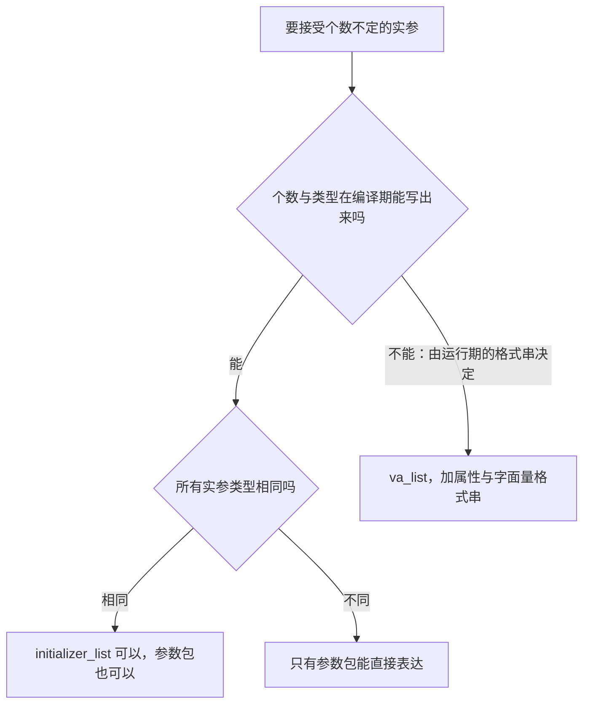

# 不定参数：从 printf 到可变模板

> **授权**：本章节属教材文档部分，采用 [CC BY-NC-ND 4.0](../LICENSE)
> 加[附加条款](../许可附加条款.md)授权：署名、非商业、禁止演绎、不允许二次分发。
> 文中引用的代码不受此限，各自保留原有许可证，详见[版权与许可说明.md](../版权与许可说明.md)。

一份同步工具的日志里写着 `std::printf("耗时 %llu 毫秒\n", seconds);`，而 `seconds` 是 `double`。
编译通过，运行不崩，日志里出现的是一串十几位的十进制数，比如 `4614256650576692846`。
没有一层拦得住它：编译器看到的格式串只是一段字符，被调用的函数拿到的只是一支游标，
谁也不知道下一个实参是什么类型，也没有谁被要求知道。

不定参数的全部麻烦都在这里。C 给出的答案是把类型交给调用方与被调用方的约定，
机制本身不带任何类型信息；C++17 给出的答案是让个数与每个实参的类型都进类型系统，
由编译器在实例化时逐个核对。两条路要满足的是同一个需求，能做的事与要付的代价却差得很远。

两条路的差别不在写法，而在**类型信息停在哪一层**。`va_list` 那一边，类型信息不在程序里，
它只存在于写代码的人脑子里，写错了也没有任何东西会反对；参数包这一边，类型信息在编译期就摆开了，
能核对、能进常量表达式、能展开成没有调用的直线代码。把这一点看清，
后面遇到任何一个「参数个数不定」的接口，都能立刻判断它在哪一边，以及要为哪一边付出什么。

---

> **约定**：标注以行内代码单独成行——`实测数据` 表示实际执行验证过，
> 复现命令随程序给出；`文档` 表示引自标准草案或官方资料；`待确认` 表示尚未验证。
> 路径占位符（如 `<MinGW>`、`<工作区>`）的含义见《README.md》。
> 本章节实测环境是 Windows 11 + g++ 16.2.0（MinGW-w64），`-O2` 优化。

# 本章节定位

| 需要先知道 | 在哪 |
|---|---|
| `...` 的写法与 `<stdarg.h>` 的四件套 | 《04-语法/07-函数.md》第 6 节 |
| 默认实参提升 | 《04-语法/07-函数.md》第 6.4 小节 |
| 类型写错不会有编译错误 | 《04-语法/07-函数.md》第 6.5 小节 |
| `printf` 属性的写法与编译器能查到哪一步 | 《04-语法/07-函数.md》第 6.9 小节 |
| 调用的固定开销与内联 | 《04-语法/07-函数.md》第 7 节 |
| 类模板的定义与实例化 | 《05-类与面向对象/11-模板.md》第 4 节、第 5 节 |
| 参数包与折叠表达式的四种形式 | 《05-类与面向对象/12-模板的高阶使用.md》第 1 节、第 2 节 |
| `constexpr` 函数与 `static_assert` | 《04-语法/12-编译期能力.md》第 3 节、第 4 节 |
| 聚合初始化与 `{}` 的含义 | 《04-语法/05-初始化.md》第 5 节 |
| `printf` 的转换说明与长度修饰符 | 《07-标准库/A-01-输入输出：stdio.md》第 2 节 |
| 浮点的二进制表示 | 《06-更底层/04-字节序与数据表示.md》第 3 节 |
| 小端与字节在内存里的次序 | 《06-更底层/04-字节序与数据表示.md》第 1 节 |
| 实参落在寄存器还是栈上 | 《06-更底层/05-ABI 与调用约定.md》第 1 节 |
| `-O2` 会做哪些优化、`volatile` 与优化 | 《03-构建工具链/05-优化等级.md》第 5 节 |

**相邻的章节**：本章节是 `08-一些散落的算法` 板块里讲「不定参数」的一章，
需求本身（个数不定、类型不定）与递归、查找同类，都是没有别处安放的问题。
它前面是递归与记忆化两章，后面接《08-一些散落的算法/04-查找：从线性到索引.md》。
`...` 的基本写法与四件套在《04-语法/07-函数.md》第 6 节已经讲过，本章不重复，
只在需要对照的地方指回去；参数包那一半属于模板，完整的语法与更多用法在
《05-类与面向对象/12-模板的高阶使用.md》第 1 节与第 2 节。
`std::initializer_list` 作为接口（构造、`insert`、聚合初始化）散在 `09-高阶数据结构`
与 `07-标准库` 两个板块，本章只讲它的形状、生存期与代价。

| 本章各节 | 讲什么 |
|---|---|
| 第 3.1 节 | `va_list` 的来历、默认实参提升、读错类型为什么是未定义行为，以及一次真跑出来的位模式 |
| 第 3.2 节 | 参数包、包展开与折叠表达式：个数与类型都进编译期，四条路的耗时对照 |
| 第 3.3 节 | `std::initializer_list` 的十六字节、背后那个 `const` 数组，以及它适合与不适合的场合 |
| 第 3.4 节 | 四条对照与一条例外：已有的 C 接口为什么仍然只能用 `va_list` |

---

# 第 3.1 节 `va_list`：一套来自 C 的机制

## 3.1.1 一次没有报错的日志错误

一个同步工具在每次扫描结束后写一行日志，写法是这样：

`std::printf("耗时 %llu 毫秒\n", seconds);`

`seconds` 是 `double`，`%llu` 要的是 `unsigned long long`。编译通过，运行不崩，
那一行打出来的是一串十几位的十进制数，比如 `4614256650576692846`；把格式串改回 `%f`，数字就正常了。

三个问题都要回答：为什么编译器一句话都不说，为什么程序不崩，那一串数字是从哪里来的。
答案都不在「格式串该怎么写」这一层。编译器看见的格式串只是一段字符，
被调用的函数拿到的只是一支游标，而 `...` 这套机制的设计前提就是**不传类型信息**——
没有任何一层有能力检查，也没有任何一层被要求检查。

这套机制叫可变参数（variadic arguments）。C 用 `<stdarg.h>` 提供它，
里面有一个类型 `va_list` 与三个宏 `va_start`、`va_arg`、`va_end`，另有一个 `va_copy`。
C++ 通过 `<cstdarg>` 提供同一套，名字放在 `std` 里（`std::va_list`、`std::va_start`），
写法与语义和 C 完全一样。

## 3.1.2 这套机制来自 C，C++ 用 `<cstdarg>` 接过来

`文档`

> "The type declared is
> va_list
> which is a complete object type suitable for holding information needed by the macros
> va_start, va_arg, va_end, and va_copy."
>
> —— N3220 §7.16/4

**`va_list` 是「一个完整的对象类型」，标准没有规定它长什么样。**
它可以是一个指针、一个结构体，也可以是一个整数；标准只要求它能装下那四个宏需要的信息。
形状不公开，带来一条实际后果：**它的用法有前提**——传给别人之后原函数还能不能用、
按值传还是按指针传，标准给的是条件性的说法，细节见《04-语法/07-函数.md》第 6.7 小节。

**这一套东西来自 C，不是 C++ 的发明。** C++ 把同一套机制接进标准库，
`<cstdarg>` 里放的就是 C 的那几个名字加 `std::` 前缀，语义完全一致。
本章节的 `varargs_trap.cpp` 用 `<cstdarg>` 与 `std::printf` 写成，因此它是**用 C++ 编译器编的**，
编译命令是 `g++ -std=c++17 -O2 varargs_trap.cpp -o varargs_trap`。

在 C 与 C++ 共用的机制上，用哪一种写法都不影响结论。
换一份 C 写法的同一程序，把 `<cstdarg>` 换成 `<stdarg.h>`、
`std::printf` 换成 `printf`、编译命令换成 `gcc -std=c23`，运行结果一样——
**「读错类型是未定义行为」这一条，两个标准给的是同一句话。**

## 3.1.3 默认实参提升：写 `1.5f` 传过去的是 `double`

走 `...` 的实参在传进去之前会被统一转换一次。标准把这次转换写得很清楚：

`文档`

> "The ellipsis notation in a function prototype declarator causes argument type conversion
> to stop after the last declared parameter, if present. The integer promotions are performed
> on each trailing argument, and trailing arguments that have type float are promoted to double.
> These are called the default argument promotions. No other conversions are performed implicitly."
>
> —— N3220 §6.5.3.3/6

把这条规则摊成一张表，就是「调用处写的」与「`va_arg` 该写的」之间的对应：

| 调用处写的 | 实际传进去的类型 | `va_arg` 该写的 |
|---|---|---|
| `1`、`'A'`、`true` | `int`（整型提升） | `int` |
| `1.5f` | `double`（浮点提升） | `double` |
| `1.5` | `double` | `double` |
| `1LL` | `long long`（不再提升） | `long long` |
| `"abc"`、一个指针 | 指针本身，不变 | 同一个指针类型 |

**第一行与第二行解释了 `printf` 上两件看起来不对、实际正确的事**：
`printf("%d", (char)65)` 是对的，因为 `char` 已经提升成 `int`；`printf("%f", 1.0f)` 也是对的，
因为 `float` 已经提升成 `double`——`printf` 的实参里根本没有 `float` 这一档。
这两条在《04-语法/07-函数.md》第 6.4 小节已经讲过，这里要看的是反过来的那一面。

> [!WARNING]
> **反过来的写法全是错的**：`va_arg(ap, float)`、`va_arg(ap, char)`、`va_arg(ap, short)`
> 都是类型不匹配。那个位置上的实参已经被提升过，`float`、`char`、`short` 从来不会出现在那里。
> **这类错误编译器一个字都不会说**——`va_arg` 的第二个实参只是一个类型名，
> 函数体里没有任何东西能核对它。

## 3.1.4 读错类型在标准里是未定义行为

标准对 `va_arg` 读错类型的写法，给出的不是「转换」也不是「诊断」，而是未定义行为：

`文档`

> "If type is not compatible with the type of the actual next argument (as promoted according
> to the default argument promotions), the behavior is undefined, except for the following cases:
> — both types are pointers to qualified or unqualified versions of compatible types;
> — one type is compatible with a signed integer type, the other type is compatible with the
> corresponding unsigned integer type, and the value is representable in both types;
> — one type is pointer to qualified or unqualified void and the other is a pointer to a
> qualified or unqualified character type;
> — or, the type of the next argument is nullptr_t and type is a pointer type that has the same
> representation and alignment requirements as a pointer to a character type."
>
> —— N3220 §7.16.1.1/2

**四条例外讲的都是同一件事：两种类型指向同一套表示。**
加不加限定词的指针、对应的有符号与无符号（前提是值在两边都能表示）、
`void *` 与字符指针、`nullptr_t` 与字符指针——按其中任何一个去读另一个，读到的位是一样的，
所以标准允许。除此之外，「类型不匹配」这四个字在标准里的意思就是：**后面发生什么都不保证**。

> [!CAUTION]
> **读错类型不是「会得到一个错的答案」，而是未定义行为。**
> 未定义行为的意思不是「结果会变」，而是标准对结果不置一词：
> 这一次运行可能打印出一个数，可能打印出另一个数，可能在换一台机器之后崩溃，
> 也可能在优化器眼里整段代码都不必存在。
> **因此下面测到的那串位只说明这套 ABI 上这一次是怎么摆的，不说明语言规定了它。**

## 3.1.5 程序：故意读错，看拿到什么

`C++`

```cpp
/* varargs_trap.cpp    编译：g++ -std=c++17 -O2 varargs_trap.cpp -o varargs_trap
 * 省略号后面的类型是「约定」而不是「检查」：故意读错类型，看会拿到什么。 */
#include <cstdarg>
#include <cstdio>
#include <cstring>

// 正确用法：调用处写的 float 已经提升成 double，所以这里必须按 double 读
static double sum_doubles(int count, ...) {
    va_list ap;
    va_start(ap, count);
    double s = 0;
    for (int i = 0; i < count; ++i) s += va_arg(ap, double);
    va_end(ap);
    return s;
}

// 读错类型：前面六个整数实参把寄存器占满，让最后一个 double 落到栈上的实参区
static unsigned long long read_last_as_int(int count, ...) {
    va_list ap;
    va_start(ap, count);
    int junk = 0;
    for (int i = 0; i < count; ++i) junk += va_arg(ap, int);        // 前六个按 int 读
    const unsigned long long wrong = va_arg(ap, unsigned long long); // 第七个按整数读
    va_end(ap);
    return wrong + static_cast<unsigned long long>(junk) * 0;        // 用一下 junk，防止被删
}

// 只读低 32 位：看读错类型时拿到的是哪一半
static unsigned read_last_low32(int count, ...) {
    va_list ap;
    va_start(ap, count);
    for (int i = 0; i < count; ++i) (void)va_arg(ap, int);
    const unsigned low = va_arg(ap, unsigned);
    va_end(ap);
    return low;
}

int main() {
    const float a = 1.5f, b = 2.5f;
    std::printf("传进去的是 float：1.5f 与 2.5f\n");
    std::printf("  按 double 读：%f 与 %f，和 %f\n",
                sum_doubles(1, a), sum_doubles(1, b), sum_doubles(2, a, b));

    const double pi = 3.14159;
    unsigned long long bits = 0;
    std::memcpy(&bits, &pi, sizeof bits);
    const unsigned long long wrong = read_last_as_int(6, 1, 2, 3, 4, 5, 6, pi);
    std::printf("传进去的是 double：%f\n", pi);
    std::printf("  它的 64 位是 %016llX\n", bits);
    std::printf("  按 unsigned long long 读出来：%016llX（十进制 %llu）\n", wrong, wrong);
    std::printf("  两串位一样：%s\n", wrong == bits ? "是" : "否");
    const unsigned low = read_last_low32(6, 1, 2, 3, 4, 5, 6, pi);
    std::printf("  按 unsigned 读出来：%08X（十进制 %u），正好是低 32 位\n", low, low);
    return 0;
}
```

`实测数据`
`Text`

```text
传进去的是 float：1.5f 与 2.5f
  按 double 读：1.500000 与 2.500000，和 4.000000
传进去的是 double：3.141590
  它的 64 位是 400921F9F01B866E
  按 unsigned long long 读出来：400921F9F01B866E（十进制 4614256650576692846）
  两串位一样：是
  按 unsigned 读出来：F01B866E（十进制 4028335726），正好是低 32 位
```

**这份程序有三个函数，两条路。** `sum_doubles` 走的是正确的路：
调用处写的 `1.5f` 已经被提升成 `double`，所以函数体里按 `double` 读；
输出里的 `1.500000 与 2.500000，和 4.000000` 说明读到的就是那两个值。
另外两个函数是故意的错误写法：`read_last_as_int` 把最后一个实参按 `unsigned long long` 读，
`read_last_low32` 按 `unsigned` 读。

**为什么前面要先传六个 `int`。** 实参落在寄存器还是栈上由调用约定决定，
x86-64 上前几个整数实参走寄存器，多出来的排在栈上的实参区
（见《06-更底层/05-ABI 与调用约定.md》第 1 节）。
先传六个整数，寄存器槽就被占满了，排在最后的那个 `double` 落到栈上的实参区；
这时按 8 字节整数去读，读到的就是它那 8 个字节。

`Text`

```
   调用：read_last_as_int(6, 1, 2, 3, 4, 5, 6, pi)      pi = 3.14159

   整数实参 1..4   ──►  前几个整数寄存器
   整数实参 5..6   ──►  栈上的实参区
   pi（double）    ──►  栈上的实参区（寄存器槽已被前面的整数占满）

   按 8 字节整数读到的，就是 pi 的这 8 个字节（低地址在左，x86-64 是小端）：

   ┌──────────────┬──────────────┐
   │ F01B866E     │ 400921F9     │
   └──────────────┴──────────────┘
     低 32 位         高 32 位
```

**输出里的两串十六进制数要逐个看。**

`400921F9F01B866E` 是 `3.14159` 这个 `double` 的位：程序自己用
`std::memcpy(&bits, &pi, sizeof bits)` 取了一份，与读错类型拿到的那一份比较，
`两串位一样：是`。**按整数读到的不是它的值，是它的位**——
读出来的十进制 `4614256650576692846` 与 `3.14159` 之间没有任何换算关系，
它是 `0x400921F9F01B866E` 这个整数的十进制写法。日志里那串看不出意义的数字就是这么来的。

`F01B866E` 是同一串位里的低 32 位。x86-64 是小端：8 个字节在内存里按地址从低到高排，
低半部分在前，所以从头读 4 个字节拿到的正是低 32 位
（见《06-更底层/04-字节序与数据表示.md》第 1 节）。程序里那一行 `%08X` 打出来的
`F01B866E` 与 `400921F9F01B866E` 的后 8 位完全相同，两行互相印证。

> [!IMPORTANT]
> **它不会崩，也不会报错，这才是危险之处。**
> 崩溃至少会留下一个现场；而读错类型最常见的表现是安静地打印一个错数，
> 这个数看上去还可能很正常。`read_last_as_int` 里那句
> `wrong + static_cast<unsigned long long>(junk) * 0` 乘一个零，
> 目的只是把 `junk` 用上一次，让编译器不能把前面那个循环删掉——
> 这一点在程序注释里已经写明。

**这一段拿到的位模式只保证在本机这套 ABI 上是这样。** 标准说这种行为未定义
（第 3.1.4 小节的引文），因此换一套调用约定、换一个平台、换一次优化，
读到的可能是别的字节，也可能是一次崩溃。**结论要记的是「类型必须对齐」这条规则，
不是这几个十六进制数。**

## 3.1.6 小结

> [!NOTE]
> `...` 这套机制来自 C，C++ 用 `<cstdarg>` 提供同一套，语义一致；
> 实参在传进去之前会做一次默认实参提升，所以 `float` 到了那边是 `double`，
> `char` 与 `short` 到了那边是 `int`；
> 而 `va_arg` 读错类型在标准里是未定义行为——**不报错、不崩溃、结果不保证**。
> 本机测到的 `400921F9F01B866E` 是那个 `double` 的位，`F01B866E` 是它的低 32 位，
> 这两个数说明的是「按整数读会读到什么」，不是「语言规定了读到什么」。

---

# 第 3.2 节 参数包与折叠表达式

## 3.2.1 一个真实的问题

一份按块传输的协议里，每个块的字段宽度并不一样：有 8 位的标志、16 位的长度、32 位的偏移，
校验和的定义是「把这一组字段的值全部相加，结果取 64 位」。
写代码的人希望调用处能把字段直接列出来，像 `checksum(flag, len, offset, ...)` 这样，
**个数不定，类型也不一定相同**——这一条是需求的要害。

同一件事有四条路可以走：

| 路 | 接口对调用方的要求 | 类型能不能各不相同 |
|---|---|---|
| C 的 `...` 与 `va_list` | 另外告诉函数「有几个」，或者靠别的约定 | 能，但读的一方要自己对齐 |
| `std::initializer_list<T>` | 元素必须是同一个 `T` | **不能**，先统一成一种宽度 |
| 自己摆一个数组 | 调用方先建数组再传指针与长度 | 能（元素类型统一时） |
| 参数包与折叠表达式 | 直接列出来 | **能**，每个实参各自的类型 |

前两条路的差别在**个数与类型停在哪一层**：它们把这件事留在运行期的约定里，
第四条路把它交给编译期。交给编译期之后，能做的事与要付的代价都会变。

## 3.2.2 参数包：个数进了类型系统

`文档`

> "A template parameter pack is a template parameter that accepts zero or more template arguments."
>
> —— N4659 §17.5.3/1

**一个模板参数后面写省略号，它就成了参数包**：可以接受零个或多个模板实参。
函数模板里对应的那一份叫函数参数包，标准在同一节的下一段给了定义：

`文档`

> "A function parameter pack is a function parameter that accepts zero or more function arguments."
>
> —— N4659 §17.5.3/2

程序里的写法是这样：

`template <class... T> static constexpr auto sum_pack(const T&... v)`

`T` 是模板参数包，`v` 是函数参数包。调用处列几个实参，包里就有几个元素；
**每个实参各自的类型留在 `T` 里**，实例化时逐个定下来。想知道包里有几个，
写 `sizeof...(T)`，它在编译期就是一个常量——程序里那一行
`参数包里有几个：3（编译期就知道）` 就是这么来的。

与 `va_list` 对照着看，差别只有一句话：**类型信息在不在程序里。**
`va_list` 那边，函数体拿到的是一支游标，下一个实参是什么类型要靠写代码的人记住；
参数包这边，8 个实参各自的类型都是类型系统的一部分，编译器实例化时逐个核对。

## 3.2.3 包展开：模式加一个省略号

包本身不能直接用，要用就得展开。标准对展开的定义是：

`文档`

> "A pack expansion consists of a pattern and an ellipsis, the instantiation of which produces
> zero or more instantiations of the pattern in a list (described below)."
>
> —— N4659 §17.5.3/4

**省略号前面的那一小段叫模式**，展开就是对包里每一个元素把模式写一遍。
程序里的 `sum_pack` 用折叠表达式一次写完，展开后的形状是这样：

`v[0] + (v[1] + (v[2] + (v[3] + (v[4] + (v[5] + (v[6] + (v[7] + 0)))))))`

标准在 §17.5.3/9 里给了四种折叠的展开公式：一元左折叠是 `((E1 op E2) op …) op EN`，
一元右折叠是 `E1 op (… op (EN−1 op EN))`，二元折叠在里侧或外侧多一个初值 `E`。
上面那一行就是二元右折叠的展开形式——八个实参加一个初值 `0`，从右往左结合。

包展开不止出现在函数调用里：模板实参表、初始化列表、基类列表都能展开，
`f(g(v)...)` 这种「对每个元素各调一次 `g`」也是同一个机制。
C++17 之前没有折叠表达式，同样的求和要靠递归把包一次次拆小
（写法见《05-类与面向对象/12-模板的高阶使用.md》第 1.2 小节）。

## 3.2.4 折叠表达式：一次写完，还能进常量表达式

`文档`

> "A fold expression performs a fold of a template parameter pack (17.5.3) over a binary operator."
>
> —— N4659 §8.1.6/1

标准把两种一元折叠的名字与形式写在一起：

`文档`

> "An expression of the form (... op e) where op is a fold-operator is called a unary left fold.
> An expression of the form (e op ...) where op is a fold-operator is called a unary right fold."
>
> —— N4659 §8.1.6/2

同一节给出的语法形式是 `( cast-expression fold-operator ... )` 与
`( ... fold-operator cast-expression )`。把名字与形式对上，四种折叠是这样：

| 形式 | 名字 | 展开后的形状 |
|---|---|---|
| `( ... op e )` | 一元左折叠 | `((E1 op E2) op …) op EN` |
| `( e op ... )` | 一元右折叠 | `E1 op (… op (EN−1 op EN))` |
| `( e1 op ... op e2 )`，`e2` 里有包 | 二元左折叠 | `(((E op E1) op E2) op …) op EN` |
| `( e1 op ... op e2 )`，`e1` 里有包 | 二元右折叠 | `E1 op (… op (EN−1 op (EN op E)))` |

程序里那一行是 `(v + ... + 0)`：省略号两侧各有一个 `+`，包在左边，右边是初值 `0`。
按标准 §8.1.6/3 的分类，这属于**二元右折叠**（`e1 op1 ... op2 e2` 里 `e1` 含未展开的包），
而源码注释里把它写成了「一元右折叠」。**两者的实际差别在于有没有初值**：
一元折叠在空包上编不过（`(v + ...)` 展开不出任何东西），二元折叠有初值，空包也有结果
（见《05-类与面向对象/12-模板的高阶使用.md》第 2.3 小节）。
源码按原样引用，不改注释；这里把标准的分类说清楚。

> [!IMPORTANT]
> **折叠表达式是编译期就能算完的东西。**
> 程序里 `constexpr int compile_time = sum_pack(1, 2, 3, 4);` 这一行拿到的是编译期常量，
> 紧跟着的 `static_assert(compile_time == 10, ...)` 才会通过，输出里的
> `折叠表达式当常量用：10（static_assert 通过）` 就是它。
> **这是 `va_list` 给不了的**：`va_arg` 只能在运行期一步一步走，
> 它的结果不可能出现在常量表达式里，也不可能拿来给 `static_assert` 用。

## 3.2.5 程序：同一件事的四条路

`C++`

```cpp
/* variadic_template.cpp    编译：g++ -std=c++17 -O2 variadic_template.cpp -o variadic_template
 * 同一件事四条路：折叠表达式、C 的 va_list、initializer_list、普通数组循环。 */
#include <chrono>
#include <cstdarg>
#include <cstdio>
#include <initializer_list>

// 一、可变参数模板 + 折叠表达式（C++17）
template <class... T>
static constexpr auto sum_pack(const T&... v) {
    return (v + ... + 0);                      // 一元右折叠，带一个 0 当初值
}

template <class... T>
static constexpr std::size_t count_pack(const T&...) { return sizeof...(T); }

// 二、C 的 va_list
static long long sum_valist(int count, ...) {
    va_list ap;
    va_start(ap, count);
    long long s = 0;
    for (int i = 0; i < count; ++i) s += va_arg(ap, int);
    va_end(ap);
    return s;
}

// 三、initializer_list
static long long sum_il(std::initializer_list<int> il) {
    long long s = 0;
    for (int x : il) s += x;
    return s;
}

template <class F>
static double avg_ns(long long rounds, F&& f) {
    const auto t0 = std::chrono::steady_clock::now();
    for (long long r = 0; r < rounds; ++r) f(r);
    const auto t1 = std::chrono::steady_clock::now();
    return std::chrono::duration<double, std::nano>(t1 - t0).count() / static_cast<double>(rounds);
}

int main() {
    std::printf("参数包里有几个：%zu（编译期就知道）\n", count_pack(1, 2, 3));

    constexpr int compile_time = sum_pack(1, 2, 3, 4);
    static_assert(compile_time == 10, "折叠表达式应当在编译期就能算出来");
    std::printf("折叠表达式当常量用：%d（static_assert 通过）\n", compile_time);

    constexpr std::size_t il_size = sizeof(std::initializer_list<int>);
    std::printf("sizeof(std::initializer_list<int>) = %zu 字节\n", il_size);

    // 八个运行期才定的数：放在 volatile 数组里，每一轮都真的读一遍。
    // 若写成普通常量数组，整段求和是循环不变的，优化器会把它提到循环外，测到的就是空转
    static volatile int v[8] = {1, 2, 3, 4, 5, 6, 7, 8};

    const long long r1 = sum_pack(v[0], v[1], v[2], v[3], v[4], v[5], v[6], v[7]);
    const long long r2 = sum_valist(8, v[0], v[1], v[2], v[3], v[4], v[5], v[6], v[7]);
    const long long r3 = sum_il({v[0], v[1], v[2], v[3], v[4], v[5], v[6], v[7]});
    long long r4 = 0;
    for (int i = 0; i < 8; ++i) r4 += v[i];
    std::printf("八个数求和：折叠 %lld，va_list %lld，initializer_list %lld，数组循环 %lld\n",
                r1, r2, r3, r4);

    const long long R = 2000000;
    const double t1 = avg_ns(R, [&](long long) {
        volatile long long s = sum_pack(v[0], v[1], v[2], v[3], v[4], v[5], v[6], v[7]);
        (void)s;
    });
    const double t2 = avg_ns(R, [&](long long) {
        volatile long long s = sum_valist(8, v[0], v[1], v[2], v[3], v[4], v[5], v[6], v[7]);
        (void)s;
    });
    const double t3 = avg_ns(R, [&](long long) {
        volatile long long s = sum_il({v[0], v[1], v[2], v[3], v[4], v[5], v[6], v[7]});
        (void)s;
    });
    const double t4 = avg_ns(R, [&](long long) {
        volatile long long s = 0;
        for (int i = 0; i < 8; ++i) s += v[i];
        (void)s;
    });
    std::printf("各跑 %lld 遍折算成单次：\n", R);
    std::printf("  折叠表达式        %6.1f ns\n", t1);
    std::printf("  va_list           %6.1f ns\n", t2);
    std::printf("  initializer_list  %6.1f ns\n", t3);
    std::printf("  数组循环          %6.1f ns\n", t4);
    return 0;
}
```

`实测数据`
`Text`

```text
参数包里有几个：3（编译期就知道）
折叠表达式当常量用：10（static_assert 通过）
sizeof(std::initializer_list<int>) = 16 字节
八个数求和：折叠 36，va_list 36，initializer_list 36，数组循环 36
各跑 2000000 遍折算成单次：
  折叠表达式           0.6 ns
  va_list              2.1 ns
  initializer_list     9.8 ns
  数组循环             2.2 ns
```

**四条路算出来的结果必须一样**：输出里那一行 `八个数求和：折叠 36，va_list 36，
initializer_list 36，数组循环 36` 就是四个 `36`。这一行是**结构量**，重跑逐位相同；
后面那四行是**计时量**，每次重跑都会浮动，这一份是其中一次。

## 3.2.6 计时那一列的前提

**四条路读的是同一份 `volatile` 数组，每一轮都真的读一遍。**
这一句不是修辞：它决定了那四个数有没有意义。

> [!WARNING]
> **若把那一列数写成普通常量数组，整段求和就是循环不变的**，
> 优化器有权把它提到循环外，只留一个空转的循环体；
> 这时测出来的是 0.1 ns 这种「看着更快」的假数。
> `-O2` 不会告诉你它删掉了什么，只会给你一个漂亮的数字。
> 这份程序用 `static volatile int v[8]`，并且每一轮都把结果写进一个 `volatile` 变量，
> 就是为了让八次读入与求和真的每轮发生一次
> （`volatile` 与优化的关系见《03-构建工具链/05-优化等级.md》第 5.6 小节）。

另外三条前提同样决定这四个数能不能用：

| 前提 | 为什么 |
|---|---|
| 两百万遍折算成单次 | 单次只有几纳秒，贴着时钟分辨率，单跑一遍测不出来 |
| 四条路的循环体都写 `volatile long long s = ...` | 结果没人读，整段调用会被删掉 |
| 机器闲下来再测 | 计时量按比值判，同机负载会顶穿容差，编译与计时不要同时跑 |

**这四个数来自 g++ 16.2.0（MinGW-w64），`-O2` 优化。**
换编译器、换优化等级、换 CPU，四个数都会变；能稳定下来的是它们的**次序**。

## 3.2.7 四个数差在哪里

把编译命令里的 `-o` 换成 `-S` 就能看到同一份程序的汇编，四个数各有各的来处。

**折叠表达式那一版最省：每一轮被完全展开成直线代码，一条调用都没有。**
八个 `volatile` 读入变成八条直接寻址的读指令，七条加法跟在后面，
这一轮里没有对八个元素的内层循环，也没有函数调用——`sum_pack` 是 `constexpr` 的小函数，
`-O2` 直接把它内联掉了。它花掉的 0.6 ns 里，主要成本就是那八次必须真的发生的内存读。

**`va_list` 那一版要先建参数列表。** 调用之前，八个实参得先写进栈上的实参区，
然后是一条 `call`；进函数之后还要维护游标，按 `int` 逐个读出来。
调用前的搬运与函数入口的开销都在 2.1 ns 里——**这些开销与「加了几个数」无关，是机制本身的。**

**`initializer_list` 那一版每次调用都要摆一个临时数组。** 花 9.8 ns 的原因是：
每一次调用都要在栈上生成一个 8 个 `int` 的数组、把八个值搬进去，
再把指向首尾的两个指针传进函数。数组本身只有 32 字节，
但生成与搬运的固定成本落在每一次调用上；求和那一步反而便宜，
这一版连 `for` 循环都被向量化成了几条打包加法的指令。

**数组循环那一版没有参数列表，也没有临时数组**，但内层循环要判八次、跳八次，
而且每一轮都要把累加结果写回内存，所以它落在 2.2 ns——比折叠版慢，比 `initializer_list` 版快。

> [!TIP]
> **热路径上的小函数，优先选能被完全展开的写法。**
> 判据不是「模板一定快」，而是「这一次调用会不会留下搬运、循环或调用」。
> 折叠表达式之所以快，是因为它在编译期就知道有几个、每个是什么类型，
> 于是编译器可以把整段求和摊平成直线代码；`va_list` 与 `initializer_list`
> 都在运行期才把元素一个一个交给函数，那一步省不掉。

## 3.2.8 小结

> [!NOTE]
> 参数包把个数与类型都交给了编译期：`sizeof...(T)` 是编译期常量，
> 折叠表达式能进 `constexpr` 与 `static_assert`，展开后没有调用。
> 四条路在同一批数据上的次序是折叠最快、数组循环与 `va_list` 次之、
> `initializer_list` 最慢；次序稳定，具体数值随编译器与机器而变。
> 那四个数能成立的前提是 `volatile` 数组与每轮写回，
> **换成普通常量数组就会得到假数。**

---

# 第 3.3 节 `initializer_list`：两个指针背后的数组

## 3.3.1 一个真实的问题

一个表示点的类要接受两个坐标，一个表示路径的类要接受任意个点；
一个容器要支持「一次插进去好几个元素」，写法是 `m.insert({a, b, c})`。
这些需求的共同点是：**类型是同一个，个数不定。**
C++11 给出的答案是 `std::initializer_list`，它在写法上看不出成本：

`std::vector<int> v = {1, 2, 3};`

第 3.2 节的计时里，它是四条路中最慢的一条（9.8 ns）；
那笔开销花在哪里、换来了什么，答案都在它的形状与生存期里。

## 3.3.2 十六字节：两个指针

`sizeof(std::initializer_list<int>)` 在本机这套实现上是 16 字节——
这个数在第 3.2 节的实测数据里出现过（`sizeof(std::initializer_list<int>) = 16 字节`）。
16 字节正好是两个指针：一个指向数组首元素，一个指向尾后。
**它本身不装元素**，元素在别的地方；因此按值传一个 `initializer_list` 很便宜，
传的是两个机器字，不是整串值。

标准没有规定它必须长成两个指针，只要求实现能用一对指针把它构造出来——
§11.6.4/5 的例子末尾写着 “assuming that the implementation can construct an
initializer_list object with a pair of pointers”。

## 3.3.3 背后那个数组是 `const` 的

`文档`

> "An object of type std::initializer_list<E> is constructed from an initializer list as if the
> implementation generated and materialized (7.4) a prvalue of type “array of N const E”,
> where N is the number of elements in the initializer list. Each element of that array is
> copy-initialized with the corresponding element of the initializer list, and the
> std::initializer_list<E> object is constructed to refer to that array."
>
> —— N4659 §11.6.4/5

**那句话里的 `const` 是这一段的关键。** 数组的元素类型是 `const E`，不是 `E`：
`begin()` 交出来的是 `const E*`，写进去这件事从类型上就被挡住了。

`C++`

```cpp
/* il_const.cpp    故意编不过：初始化列表的元素是 const 的，写不进去 */
#include <initializer_list>

int main() {
    std::initializer_list<int> il = {1, 2, 3};
    *il.begin() = 5;                    // 这里编不过
    return 0;
}
```

**这一份编不过。** 用 `g++ -std=c++17 -O2 il_const.cpp -o il_const` 编它，
编译器停在 `*il.begin() = 5;` 那一行，指出的是 `assignment of read-only location`
（完整的一句是 `assignment of read-only location '* il.std::initializer_list<int>::begin()'`）。
原因就是上面引文里那个 `const`：`begin()` 给的是一个指向 `const int` 的指针。

**同一个 `const` 还带出第二条限制**：元素是**拷贝**进那个数组的
（引文里写的 `copy-initialized`），所以元素类型必须能拷贝。
在本机 g++ 16.2.0 上，`std::vector<std::unique_ptr<int>> v = {std::make_unique<int>(1)};`
这一行编不过，报错里出现的是从 `const std::unique_ptr<int>&` 到 `std::unique_ptr<int>`
的拷贝构造。换成 `push_back` 一次插一个就能编过——**问题不在容器，在那个 `const` 数组**。

## 3.3.4 生存期：用完就丢，不要留下

数组是编译器生成的临时对象，标准专门用一句话规定了它的生存期：

`文档`

> "The array has the same lifetime as any other temporary object (15.2), except that
> initializing an initializer_list object from the array extends the lifetime of the array
> exactly like binding a reference to a temporary."
>
> —— N4659 §11.6.4/6

**「像把一个引用绑到临时对象上」就是它的生存期规则。** 三种场合分清楚：

| 写法 | 数组活到什么时候 | 能不能读 |
|---|---|---|
| `std::initializer_list<int> il = {1, 2, 3};` | 与 `il` 活得一样久（生存期被延长） | 能，`il` 在作用域里就安全 |
| 作为实参：`sum_il({v[0], v[1], ...})` | 到调用所在的完整表达式结束 | 能，函数体里读是安全的 |
| `return {1, 2, 3};` 或存进成员 | 到初始化它的那个完整表达式结束 | **不能**，指针指向已销毁的数组 |

第三行是这类接口最常见的错误：`std::initializer_list` 只是两个指针，
**数组的生存期不会跟着指针一起延长**。要保存一串值，就用 `std::vector` 或 `std::array`；
`initializer_list` 的定位是「一次调用里传进去、当场用完」。

## 3.3.5 那条 9.8 ns 的代价

把第 3.2 节的四行按代价重排，就是这张表：

| 路 | 单次耗时（g++ 16.2.0，`-O2`） | 每次调用都要做的事 |
|---|---|---|
| 折叠表达式 | 0.6 ns | 八次读入加七次加法，无调用 |
| `va_list` | 2.1 ns | 把八个实参写进栈上的实参区，再逐个按类型读 |
| 数组循环 | 2.2 ns | 内层循环八次，累加结果写回内存 |
| `initializer_list` | 9.8 ns | 生成一个临时 `const` 数组，搬八个值，传两个指针 |

上表的数字见第 3.2 小节的实测数据，这一列是计时量，重跑会在小范围里浮动。
**它慢在「每次调用都要摆一个数组」这一步**，而不是慢在求和：
第 3.2 节的程序里，连那个 `for` 循环都被优化成了几条打包加法的指令，
成本全落在临时数组的生成与搬运上。这也解释了它为什么按值传参很便宜——
**贵的是造数组，不是传 `initializer_list`。**

## 3.3.6 什么时候它是对的选择

| 场合 | 用不用 | 理由 |
|---|---|---|
| 构造：`std::vector<int> v{1, 2, 3}` | 用 | 一次调用里传一串同类型的值，正是它的定位 |
| 一次插多个：`m.insert({a, b, c})` | 用 | 同上，元素类型由容器定死 |
| 聚合初始化、`{...}` 做实参 | 用 | 语法直接支持，没有别的写法更短 |
| 个数不定且类型不同 | **不用** | 元素类型必须统一；这种场合用参数包（第 3.2 节） |
| 元素要能改 | **不用** | 背后是 `const` 数组，写不进去（第 3.3.3 小节） |
| 元素不可拷贝 | **不用** | 元素是拷贝进数组的 |
| 要把这一串值留下来 | **不用** | 数组的生存期只到那个完整表达式（第 3.3.4 小节） |

> [!TIP]
> **判断它合不合适，只看两个问题**：这串值的类型是不是同一个；
> 这串值是不是当场用完。两个都是「是」，就用它；
> 有一个是「否」，就该换 `std::vector` 或者参数包。

## 3.3.7 小结

> [!NOTE]
> `std::initializer_list` 是「两个指针」：本机 16 字节，指向编译器生成的一个 `const` 数组；
> 元素写不进去（`il_const.cpp` 编不过）、不可拷贝的元素也放不进去；
> 数组的生存期像绑定到临时对象上的引用，所以它只适合一次调用里当场用完。
> 它的代价在生成那个数组，不在传参——按值传很便宜，造数组不便宜。

---

# 第 3.4 节 为什么现在几乎不该再用 `va_list`

## 3.4.1 四条对照

| 维度 | `va_list`（来自 C） | 参数包（C++17） | `initializer_list`（类型统一时） |
|---|---|---|---|
| 类型安全 | 读错类型是未定义行为，编译器不检查 | 每个实参的类型都进类型系统，读错就是编译错误 | 元素类型统一为 `T`，编译期检查 |
| 个数 | 靠调用方约定：多传一个计数，或让格式串自己数 | `sizeof...(T)` 是编译期常量 | 由 `size()` 给出，运行期读 |
| 编译期能力 | `va_arg` 只能在运行期一步一步走 | 折叠表达式能进 `constexpr` 与 `static_assert` | 只能用于运行期初始化 |
| 性能与内联 | 要先建参数列表，函数体维护游标 | 实例可展开、可内联 | 每次调用建一个临时数组 |

**类型安全这一条是根。** 第 3.1.4 小节的引文已经写明：`va_arg` 的类型与实参不匹配时，
标准给的是「行为未定义」，只留四条例外。参数包这一边没有这条缝：
包里每个实参的类型都是推导出来的，读的一方与写的一方用的是同一份类型信息，
对不上就是编译错误。

**个数这一条差在「谁来数」。** `va_list` 那边，个数要么由调用方另传一个计数，
要么由格式串里的转换说明个数决定，数错了没有任何提示
（见《04-语法/07-函数.md》第 6.3 小节）。参数包这边 `sizeof...(T)` 是常量，
写进 `static_assert` 也可以。

**编译期能力这一条是分水岭。** 折叠表达式能进常量表达式：第 3.2 节的程序里
`constexpr int compile_time = sum_pack(1, 2, 3, 4);` 与紧随其后的 `static_assert` 就是证据。
`va_arg` 做不到——它每次调用都在改那支游标，值是运行期才有的。

**性能这一条是前三条的结果。** 参数列表要建、游标要维护、函数多半内联不掉，
于是 `va_list` 那一路比折叠版慢了三倍多（2.1 ns 对 0.6 ns，见第 3.2 节的实测数据）；
而模板实例在编译期就把个数与类型都定下来了，编译器可以把它摊平成直线代码
（内联的判据见《04-语法/07-函数.md》第 7 节）。

> [!IMPORTANT]
> **四条合起来是一句话：`va_list` 把「有几个、分别是什么类型」的责任交给了写代码的人，
> 参数包把它交给了编译器。**
> 能交给编译器的事情不要留在人手里——这是选型的依据，与「模板更高级」无关。

## 3.4.2 唯一还非它不可的场合

**个数与类型由运行期的数据决定时，参数包帮不上忙。** 最典型的例子是 `printf` 这一族：
格式串往往不是字面量，而是从配置、命令行或者别的函数那里传进来的字符串，
它有几个转换说明、每个要什么类型，要到运行期才知道。模板要求把个数与类型在编译期写出来，
这个要求在这种接口上无法满足，于是只能回到 `va_list`。

这时能加的两道栏杆是这样：

| 栏杆 | 作用 | 局限 |
|---|---|---|
| 格式串写成字面量 | 编译器能在编译期按 `printf` 的规则逐个核对实参 | 变量格式串无从检查 |
| `__attribute__((format(printf, m, n)))` | 让自定义的包装函数也享受同一条检查 | 编译器扩展，不属于任何标准；检查仍只对字面量有效 |

属性的写法与它要求的三个信息见《04-语法/07-函数.md》第 6.9 小节。
**这条检查的边界在于**：检查发生在编译期，而变量的值要到运行期才知道，
所以编译器只能查字面量。在本机 g++ 16.2.0 上把两个写法各编一次，结果分得很清楚：

| 写法 | `-Wall` 下的诊断 |
|---|---|
| `my_log("%d\n", 1.5);`（字面量格式串） | `warning: format '%d' expects argument of type 'int', but argument 2 has type 'double' [-Wformat=]` |
| `const char *f = ...; my_log(f, 1.5);`（变量格式串） | 没有诊断 |

**这条边界不是编译器有意放过，而是信息本身不够。** 参数包那一半之所以能查，是因为个数与类型在源码里；
格式串那一半把这件事推到了运行期，编译期能看到的只有「一个 `const char *`」。
C++20 的 `std::format` 走的是另一条路：它要求格式串本身是常量表达式，
写错就是编译错误——**代价是格式串必须写在调用处，不能来自运行期数据。**

> [!TIP]
> **新写的接口不必用 `va_list`。** 除非有一条硬约束：要与既有的 C 接口对接，
> 或者要接受一段运行期才知道的格式串。有这条约束时，把格式串写成字面量、
> 给包装函数加上属性、再补上测试——**这三件事是那一族接口唯一能拿到的类型安全。**

## 3.4.3 从 `va_list` 迁到参数包

已有的接口不必一次全改。**参数包与 `va_list` 之间没有互转通道**：
不能从一个参数包造出一个 `va_list`（`va_start` 要求函数有一个具名的最后参数，
而可变参数模板的函数签名里根本没有 `...`），也不能把一个 `va_list` 拆回参数包。
两条现实的改造路线是：

| 路线 | 做什么 | 代价 |
|---|---|---|
| 前端加检查 | 机制不动，格式串限制成字面量，包装函数加 `printf` 属性 | 变量格式串仍然查不了；类型错配仍是未定义行为 |
| 换掉格式串 | 用参数包重写前端，实参逐个转成文本再拼接 | 每个实参各做一次转换；格式能力与 `printf` 不完全一致 |

第一条路不改机制，只是把编译器能查的那一部分用足；
第二条路把「个数与类型」从运行期挪回编译期，代价是放弃格式串那一套写法
（`printf` 家族的后端仍然要留着，因为 `vprintf` 这类接口本身就是 `va_list` 的，见
《04-语法/07-函数.md》第 6.6 小节）。**两条路可以并存**：新代码走参数包，
与 C 对接的那一层留在 `va_list` 上，边界划在包装函数那里。

> [!WARNING]
> **不要试图在模板里造一个 `va_list`。** 常见的一种误解是「参数包反正也是不定个数，
> 那就把它转成 `va_list` 再交给 `vprintf`」——这条通道不存在。
> 反过来也不存在：拿到一个 `va_list` 之后，无法把它拆成一组类型已知的实参。
> 两者能表达的接口形式相近，背后却是两套不同的机制。

## 3.4.4 决策路径

`Mermaid`



图只作辅助，一句话的结论是：**个数与类型能在编译期写出来，就用参数包；
所有实参类型还恰好相同，`initializer_list` 也够用；只有个数与类型由运行期数据决定时，
才回到 `va_list`，并且把格式串写成字面量、给包装函数加上属性。**

## 3.4.5 小结

> [!NOTE]
> `va_list` 的四条劣势依次是：类型错配是未定义行为、个数靠人约定、
> 进不了常量表达式、要付参数列表与调用的开销；
> 参数包把前三条收进了编译期，第四条是前三条的结果。
> 唯一还非它不可的场合是「个数与类型由运行期的格式串决定」——
> 这时编译期的检查只能覆盖字面量格式串，变量格式串没有任何一层能查。
> **本章节里那两个十六进制数与四个纳秒数说明的都是同一件事：
> 机制在哪里，代价就在哪里。**

---

# 术语表

| 术语 | 含义 |
|---|---|
| **可变参数（variadic arguments）** | 函数参数表末尾写 `...`，接受个数与类型由调用方决定的实参 |
| **`va_list`** | 走过可变实参的游标；标准只规定它是一个完整的对象类型，形状由实现定 |
| **默认实参提升** | 走 `...` 的实参在传参前的统一转换：整型提升，`float` 提升为 `double` |
| **参数包** | 模板参数包或函数参数包，接受零个或多个模板实参或函数实参 |
| **包展开** | 「模式 + 省略号」，对包里每个元素把模式写一遍 |
| **折叠表达式** | 用一个二元运算符把整个参数包折成一个值；一元、二元各有左右两折 |
| **`initializer_list`** | 指向编译器生成的 `const` 数组的一对指针；元素写不进去，生存期像绑定到临时对象上的引用 |
| **完整表达式** | 一个不以别的表达式为子表达式的表达式；临时对象一般活到它结束 |
| **格式串属性** | `__attribute__((format(printf, m, n)))` 一类扩展，让编译器按 `printf` 的规则查自定义函数 |

# 附录 A 复现本章节实测

**环境**：Windows 11，g++ 16.2.0（MinGW-w64，x86_64-win32-seh-rev1）。
所有程序的编译命令都是 `g++ -std=c++17 -O2 <源文件> -o <可执行文件>`，
程序首行注释里也写了同一条命令。

| 本章节的数字 | 程序 | 在哪一小节 |
|---|---|---|
| 读错类型拿到的位模式与十进制值 | `varargs_trap.cpp` | 第 3.1.5 小节 |
| 参数包个数、`sizeof(initializer_list)`、四条路的耗时 | `variadic_template.cpp` | 第 3.2.5 小节 |
| 初始化列表的元素写不进去 | `il_const.cpp`（故意编不过） | 第 3.3.3 小节 |

**几点复现说明**：

- `varargs_trap.cpp` 的七行输出在三次运行中逐行一致，可以逐行对照；
- `variadic_template.cpp` 的前四行是结构量（`3`、`10`、`16 字节`、四个 `36`），重跑逐位相同；
- `il_const.cpp` 是故意编不过的程序，编译它会停在 `*il.begin() = 5;` 那一行，
  报的是 `assignment of read-only location`；
- 第 3.2.7 小节的几句结论来自同一份程序生成的汇编文本：把编译命令里的 `-o` 换成 `-S` 即可得到，
  正文依据的是它在 `-O2` 下生成的那一份汇编。

`待确认`

计时行每次重跑都会浮动。正文引用的是其中一次（折叠 0.6、`va_list` 2.1、
`initializer_list` 9.8、数组循环 2.2 ns）；本机另两次运行分别是
0.7、3.7、10.0、2.2 ns 与 1.0、2.9、10.3、2.2 ns。
四条路的**次序**稳定（折叠最快、`initializer_list` 最慢），逐位数字不稳定；
换机器、换编译器、换优化等级，请以自己重跑的结果为准。

# 附录 B 相关文档

| 文档 | 位置 | 内容 |
|---|---|---|
| C23 草案 | N3220 §7.16 | `va_list` 是什么、四件套的约束 |
| C23 草案 | N3220 §7.16.1.1/2 | `va_arg` 读错类型是未定义行为，以及四条例外 |
| C23 草案 | N3220 §6.5.3.3/6 | 默认实参提升 |
| C++17 最终草案 | N4659 §17.5.3 | 参数包的定义、包展开、四种折叠的展开公式 |
| C++17 最终草案 | N4659 §8.1.6 | 折叠表达式的语法、一元左折与一元右折的名字 |
| C++17 最终草案 | N4659 §11.6.4 | 初始化列表背后那个 `const` 数组与它的生存期 |
| 本教材 | 《04-语法/07-函数.md》第 6 节 | `...` 的写法、四件套、默认实参提升、格式串检查 |
| 本教材 | 《05-类与面向对象/12-模板的高阶使用.md》第 1 节、第 2 节 | 参数包、递归拆包、折叠表达式的四种形式 |
| 本教材 | 《06-更底层/05-ABI 与调用约定.md》第 1 节 | 实参落在寄存器还是栈上 |
| 本教材 | 《06-更底层/04-字节序与数据表示.md》第 1 节、第 3 节 | 小端与字节次序、浮点的二进制表示 |
