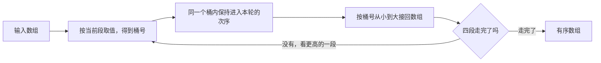

# 排序（二）：不比较也能排

> **授权**：本章节属教材文档部分，采用 [CC BY-NC-ND 4.0](../LICENSE)
> 加[附加条款](../许可附加条款.md)授权：署名、非商业、禁止演绎、不允许二次分发。
> 文中引用的代码不受此限，各自保留原有许可证，详见[版权与许可说明.md](../版权与许可说明.md)。

上一章（见《08-一些散落的算法/05-排序（一）：比较排序的三种策略.md》章节）里的三种策略有一个共同前提：
两个元素能比大小。整个排序过程就是一连串「谁在前、谁在后」的判断，
代价的下限因此由比较次数决定。有一类数据不必走这条路：
值是整数，或者能拆成定长的几段，那么「这个值排在第几段」可以直接算出来，
把它放到那一段的位置上就行，一次大小判断都不需要。

这类做法的回报很直接：比较次数归零，代价只按元素个数线性增长，
比较排序里那个 `log n` 因子消失了。代价同样直接：它们都要额外的内存，
而且都靠数据的形状吃饭——值域有多宽、键是不是定长、分布均不均匀。
形状合适时它们能比通用排序快几倍到二十倍，形状不合适时反过来慢几倍到几十倍，
慢在哪里可以逐项算清楚，这正是这一章要给出的东西。

读完这一章，拿到一批数据可以先问三个问题——值域多宽、键能不能拆、分布均不均匀——
再决定先试哪一种；也能解释清楚为什么基数排序必须建立在稳定分配上，
为什么同一个 `std::sort` 在 16 个元素上保持了同键次序、到 17 个元素上就不再保持。

---

> **约定**：标注以行内代码单独成行——`实测数据` 表示实际执行验证过，
> 复现命令随程序给出；`文档` 表示引自标准草案或官方资料；`待确认` 表示尚未验证。
> 路径占位符（如 `<MinGW>`、`<工作区>`）的含义见《README.md》。
> 复杂度一律写成 `O(...)`，它表示**随规模增长的量级**，不表示具体快慢。
> 本章节实测环境是 Windows 11 + g++ 16.2.0（MinGW-w64），`-O2` 优化。

# 本章节定位

| 需要先知道 | 在哪 |
|---|---|
| 连续存储、随机访问与容量 | 《09-高阶数据结构/A-01-连续存储：array 与 vector.md》第 3 节 |
| 有序容器与比较器的写法 | 《09-高阶数据结构/A-03-索引存储：map、set 与有序.md》第 4 节 |
| 哈希表为什么怕键集变大 | 《09-高阶数据结构/A-04-按哈希定位：unordered_map.md》第 2 节 |
| 迭代器与算法之间的接口 | 《09-高阶数据结构/A-06-迭代器与范围：容器与算法之间的接口.md》第 1 节 |
| 缓存行与访问局部性 | 《06-更底层/02-对齐、填充与缓存.md》第 3 节 |
| 异常的抛出与捕获 | 《04-语法/13-异常.md》第 1 节 |
| lambda 与函数对象 | 《05-类与面向对象/10-lambda 与函数对象.md》第 5 节 |
| 查找与排序之间的取舍 | 《08-一些散落的算法/04-查找：从线性到索引.md》第 4.4 节 |

**相邻的章节**：本章节是 `08-一些散落的算法` 板块里讲「排」的第二篇。
它前面是《08-一些散落的算法/05-排序（一）：比较排序的三种策略.md》章节——
那一章讲的是只用比较能做到什么程度，本章节讲不比较时能换到什么；
后面是《08-一些散落的算法/07-搜索：在状态空间里找路.md》章节，
那一章里的搜索也要靠「按值寻址」把状态排好序。
容器一侧的「结构自带的顺序」（`map` 的迭代次序、`unordered_map` 的桶）
在 `09-高阶数据结构` 里讲，本章节只讲排序本身的策略与代价。

| 本章各节 | 讲什么 |
|---|---|
| 第 6.1 节 | 计数排序：按值对号入座的前提，以及值域变宽之后代价从哪里冒出来 |
| 第 6.2 节 | 基数排序：逐位分配与收集，以及为什么每一轮必须稳定 |
| 第 6.3 节 | 桶排序：把值域切成 k 段，分布假设不成立时会发生什么 |
| 第 6.4 节 | 稳定性：同键元素的相对次序由谁保证，两种排序差多少 |
| 第 6.5 节 | 三张表：把前几节的数字汇到一起，再给一张反查表与三条判据 |

---

# 第 6.1 节 计数排序：前提是值域小

## 6.1.1 一份只有 101 种取值的成绩单

教务系统要按分数给十万条成绩排序，分数是 0 到 100 的整数。
用通用排序，比较次数在一百五十万次这个量级；
但这份数据里有一条通用排序用不上的信息：**分数只有 101 种取值**。
数一遍每个分数有多少人，就知道每个分数该占哪一段位置，
再按分数把每条记录放到它那一段里——整个过程一次大小判断都没有。

把「比较」换成「按值寻址」，要做的就这一件事。它的代价也全部来自这句话：
值有多少种，就要准备多少个格子；格子多了，光是把格子备好就不便宜。
下面先把这条流水线摆清楚，再用同一批元素、三档值域去看代价从哪里冒出来。

## 6.1.2 四步流水线

计数排序把排序拆成四步。用一个手算的例子看形状，六个元素，值域 0 到 2：

`Text`

```text
值        : 2 0 2 1 0 2
计数      : count[0]=2  count[1]=1  count[2]=3
前缀和    : start[0]=0  start[1]=2  start[2]=3
放置      : 0 0 1 2 2 2
```

四步各自做的事：

| 步骤 | 做什么 | 复数度 |
|---|---|---|
| 分配 | 准备值域那么多个格子，全部写 0 | `O(k)` |
| 计数 | 扫一遍输入，`++count[值]` | `O(n)` |
| 前缀和 | 扫一遍格子，`count[v]` 换成「值小于 `v` 的元素个数」 | `O(k)` |
| 放置 | 再扫一遍输入，按 `count[值]` 给出的位置放回去 | `O(n)` |

`k` 是值域宽度（取值个数），`n` 是元素个数。总代价 `O(n + k)`，
额外内存 `O(k)`。**比较次数恒为 0**：四步里没有任何一处把两个元素放在一起比大小。

> [!IMPORTANT]
> **计数排序把「比较」换成了「按值当下标寻址」。**
> 换来的是一次比较都没有、线性时间；付出的是与值域等宽的一块内存，
> 以及在这块内存上至少三次整块读写。**值域有多大，直接决定这笔交易划不划算。**

前缀和那一步的写法只有一处容易错：从前往后累加时，
要先把 `count[v]` 存进临时变量再写回起点，顺序反了就会把计数冲掉。
放置那一步用完之后 `count` 里的值已经变成各段的末尾，这也是为什么它只能做一次。

## 6.1.3 实现

下面这份程序把同一批一百万个元素交给三档值域：0..255、0..9999999、0..99999999。
第三档的计数数组是 400 MB，是元素个数的一百倍宽，专门用来看「把格子备好」本身有多贵。
每一档都比一次 `std::sort`；`std::sort` 的比较次数另跑一遍数出来，那一遍不计时。

`C++`

```cpp
/* counting_sort.cpp    编译：g++ -std=c++17 -O2 counting_sort.cpp -o counting_sort
 *
 * 同一批 n = 1000000 个整数、两档值域（0..255 与 0..9999999），
 * 计数排序与 std::sort 的耗时对照。
 * 计数排序一次比较都不做：它把值本身当下标用，从不比较两个元素。
 * std::sort 的比较次数另跑一遍数出来，那一遍不计时——
 * 计数比较器每次比较多一次自增，混进计时会把它拖慢。 */
#include <algorithm>
#include <chrono>
#include <cstdint>
#include <cstdio>
#include <random>
#include <vector>

static std::uint64_t g_sink = 0;   // 结果落到这里，防止优化器把整段计算删掉

template <class F>
static double time_ms(F&& f) {
    const auto t0 = std::chrono::steady_clock::now();
    f();
    const auto t1 = std::chrono::steady_clock::now();
    return std::chrono::duration<double, std::milli>(t1 - t0).count();
}

/* 同一段计算跑 reps 次、报最快的一次：最小值对后台负载不敏感，重跑更稳。 */
static const int REPS = 5;

template <class F>
static double best_ms(F&& f) {
    double best = -1;
    for (int i = 0; i < REPS; ++i) {
        const double t = time_ms(f);
        if (best < 0 || t < best) best = t;
    }
    return best;
}

/* 计数排序的代价：count[v] 记值 v 出现过几次，前缀和把 count[v] 换成
 * 「值 v 那一段的起点」，再按值把每个元素放回它那一段。
 * 分配一步单独计时：计数数组与输出数组都要一次与值域成正比的写入。 */
struct CountResult {
    double alloc_ms = 0, clear_ms = 0, count_ms = 0, prefix_ms = 0, place_ms = 0, total_ms = 0;
    std::size_t bytes = 0;
    long long comparisons = 0;
};

static CountResult counting_sort(const std::uint32_t* src, std::size_t n, std::uint32_t maxv,
                                 std::vector<std::uint32_t>& dst) {
    CountResult r;
    const std::size_t k = static_cast<std::size_t>(maxv) + 1;   // 值域 0..maxv 共 k 个格子
    r.bytes = k * sizeof(std::uint32_t);
    r.comparisons = 0;                                         // 结构量：一次比较都没有

    const auto t0 = std::chrono::steady_clock::now();
    std::vector<std::uint32_t> cnt(k, 0u);                     // 构造时就写了一遍 0
    dst.assign(n, 0u);
    const auto t1 = std::chrono::steady_clock::now();
    r.alloc_ms = std::chrono::duration<double, std::milli>(t1 - t0).count();

    r.clear_ms = time_ms([&] { std::fill(cnt.begin(), cnt.end(), 0u); });
    r.count_ms = time_ms([&] {
        for (std::size_t i = 0; i < n; ++i) ++cnt[src[i]];     // 读得顺序、写得很散
    });
    r.prefix_ms = time_ms([&] {
        std::uint32_t sum = 0;
        for (std::size_t v = 0; v < k; ++v) {
            const std::uint32_t t = cnt[v];
            cnt[v] = sum;                                      // 值 v 那一段的起点
            sum += t;
        }
    });
    r.place_ms = time_ms([&] {
        for (std::size_t i = 0; i < n; ++i) dst[cnt[src[i]]++] = src[i];
    });
    const auto t2 = std::chrono::steady_clock::now();
    r.total_ms = std::chrono::duration<double, std::milli>(t2 - t0).count();
    return r;
}

/* 每次从同一份输入开始（排好的数组再排一遍会快得多，不能拿来充数），报最快的一次。 */
static double sort_best_ms(const std::vector<std::uint32_t>& src) {
    double best = -1;
    for (int i = 0; i < REPS; ++i) {
        std::vector<std::uint32_t> v = src;
        const double t = time_ms([&] { std::sort(v.begin(), v.end()); });
        if (best < 0 || t < best) best = t;
        g_sink += v.front() + v.back();
    }
    return best;
}

/* 跑 REPS 次，留下合计最快的那一次，四步的分步与合计取自同一次运行。 */
static CountResult counting_sort_best(const std::uint32_t* src, std::size_t n,
                                      std::uint32_t maxv, std::vector<std::uint32_t>& dst) {
    CountResult best;
    double best_total = -1;
    for (int i = 0; i < REPS; ++i) {
        const CountResult r = counting_sort(src, n, maxv, dst);
        if (best_total < 0 || r.total_ms < best_total) {
            best_total = r.total_ms;
            best = r;
        }
    }
    return best;
}

/* 只为数比较次数的 std::sort：每次比较自增一次，结果照样要用到。 */
static long long sort_with_count(const std::vector<std::uint32_t>& v) {
    std::vector<std::uint32_t> a = v;
    long long cmp = 0;
    std::sort(a.begin(), a.end(), [&cmp](std::uint32_t x, std::uint32_t y) {
        ++cmp;
        return x < y;
    });
    g_sink += a.front() + a.back();
    return cmp;
}

int main() {
    const std::size_t n = 1000000;
    /* 三档值域，同一批元素个数：256 → 计数数组 1 KiB；10^7 → 40 MB；
     * 10^8 → 400 MB，是元素个数的一百倍宽。 */
    const std::uint32_t maxvs[] = {255u, 9999999u, 99999999u};
    std::mt19937 rng(20261006);

    std::printf("n = %llu，随机种子 20261006，三档值域各一批数据；"
                "计时各取 %d 次中最快的一次\n",
                static_cast<unsigned long long>(n), REPS);
    std::printf("%-12s %14s %12s %12s %14s %14s %8s %10s\n",
                "值域", "计数数组字节", "计数排序", "std::sort",
                "计数排序比较", "std::sort比较", "结果有序", "两者相同");
    std::printf("%-12s %14s %12s %12s %14s %14s %8s %10s\n",
                "", "", "ms", "ms", "次数", "次数", "", "");

    for (std::uint32_t maxv : maxvs) {
        std::vector<std::uint32_t> src(n);
        for (std::uint32_t& x : src) {
            x = static_cast<std::uint32_t>(rng() % (static_cast<std::uint64_t>(maxv) + 1));
        }

        std::vector<std::uint32_t> by_count, by_sort = src;
        const CountResult r = counting_sort_best(src.data(), n, maxv, by_count);
        const double t_sort = sort_best_ms(src);
        std::sort(by_sort.begin(), by_sort.end());

        const bool sorted_ok = std::is_sorted(by_count.begin(), by_count.end());
        const bool same = (by_count == by_sort);
        const long long cmp_sort = sort_with_count(src);
        g_sink += by_count.front() + by_count.back();

        char label[32];
        std::snprintf(label, sizeof label, "0..%u", maxv);
        std::printf("%-12s %14llu %9.3f ms %9.3f ms %14lld %14lld %8s %10s\n",
                    label, static_cast<unsigned long long>(r.bytes), r.total_ms, t_sort,
                    r.comparisons, cmp_sort, sorted_ok ? "是" : "否", same ? "是" : "否");

        /* 计数数组只有 1 KiB 时四步各自都贴着时钟分辨率，分开报没有意义；
         * 几十 MB 以上每一步都测得出来，按步报。 */
        if (r.bytes >= (std::size_t{1} << 20)) {
            std::printf("值域 %s 的计数排序分步（计数数组 %llu 字节）\n",
                        label, static_cast<unsigned long long>(r.bytes));
            std::printf("  分配 %8.3f ms   清零 %8.3f ms   计数 %8.3f ms   前缀和 %8.3f ms   "
                        "放置 %8.3f ms   合计 %8.3f ms\n",
                        r.alloc_ms, r.clear_ms, r.count_ms, r.prefix_ms, r.place_ms, r.total_ms);
        }
    }

    std::printf("计数排序的比较次数：0（结构量，与值域和元素个数都无关）\n");
    std::printf("sink = %llu\n", static_cast<unsigned long long>(g_sink));
    return 0;
}
```

程序里的几条约定：计时各取五次里最快的一次，因为最小值对后台负载不敏感；
计数数组的分配、清零、计数、前缀和、放置五步分开计时，合计与分步取自同一次运行；
`g_sink` 把结果接到一个全局变量上，防止优化器把没人读的计算整段删掉。

## 6.1.4 三档值域上的代价

`实测数据`
`Text`

```text
n = 1000000，随机种子 20261006，三档值域各一批数据；计时各取 5 次中最快的一次
值域       计数数组字节 计数排序    std::sort 计数排序比较 std::sort比较 结果有序 两者相同
                                      ms           ms         次数         次数
0..255                 1024     1.077 ms    22.135 ms              0       19355380      是        是
0..9999999         40000000    49.624 ms    43.509 ms              0       23986285      是        是
值域 0..9999999 的计数排序分步（计数数组 40000000 字节）
  分配   11.093 ms   清零    4.521 ms   计数   15.043 ms   前缀和    6.468 ms   放置   12.496 ms   合计   49.624 ms
0..99999999       400000000   226.103 ms    44.034 ms              0       24531241      是        是
值域 0..99999999 的计数排序分步（计数数组 400000000 字节）
  分配   79.292 ms   清零   49.625 ms   计数   17.097 ms   前缀和   62.547 ms   放置   17.542 ms   合计  226.103 ms
计数排序的比较次数：0（结构量，与值域和元素个数都无关）
```

三行放在一起读，翻转点看得很清楚。

值域 0..255 那一行，计数数组只有 1 KiB，整个数组常驻一级缓存：
计数排序 1.077 ms，`std::sort` 22.135 ms，**前者快二十倍**，
而且比较次数那一列是 0——`std::sort` 为同一批数据做了一千九百多万次比较。

值域 0..9999999 那一行，计数数组变成 40 MB，
计数排序 49.624 ms 已经反超 `std::sort` 的 43.509 ms。
分步数据说明钱花在哪里：清零只花 4.521 ms，**计数 15.043 ms 与放置 12.496 ms 才占大头**。
这两步的访问模式是「读得顺序、写得很散」——
每读一个元素就要往 40 MB 里的某个随机格子加一，那一次多半是缓存缺失。
前缀和 6.468 ms 则是老老实实扫一遍 40 MB。

值域 0..99999999 那一行，计数数组 400 MB，
计数排序 226.103 ms，是 `std::sort` 44.034 ms 的五倍。
这一档里**只用清零一步（49.625 ms）就已经超过 `std::sort` 的全程**；
再加前缀和的 62.547 ms，两遍整块写入加起来 112.172 ms，两倍半于 `std::sort`。
元素只有一百万个，却要在一个四亿格子的数组上走三遍。

## 6.1.5 值域多大算小

「值域小」这个前提可以量化成一句话：
**计数数组 `4(k + 1)` 字节要装得进缓存，或者至少不要比输入大出一个量级。**
按上面三档的实测，本机这一次的翻转点落在值域 256 与值域 `10^7` 之间：

| 值域宽度 `k` | 计数数组 | 与输入（4 MB）之比 | 谁快 |
|---|---|---|---|
| 256 | 1 KiB | 1/4000 | 计数排序快二十倍 |
| `10^7` | 40 MB | 十倍 | `std::sort` 快一成 |
| `10^8` | 400 MB | 一百倍 | `std::sort` 快五倍 |

`待确认`

翻转点的**具体位置**没有细分到某一档：本机只测了 256、`10^7`、`10^8` 三个点，
中间还有 `10^4`、`10^5`、`10^6` 没有测。可以确定的是翻转存在，
而且位置由「计数数组与缓存、与输入规模的比例」决定；
换机器请以自己重跑的结果为准。

三条结论收在这里：

- 计数排序只要求「值能映射到 `0` 到 `k - 1` 的整数下标」，
  不要求键本身是整数——把 `A` 到 `Z` 映射到 `0` 到 `25` 就满足条件；
- 它的比较次数是**结构量**，任何值域、任何元素个数下都是 0；
- 它的代价是 `O(n + k)` 时间与 `O(k)` 空间，所以**`k` 与 `n` 的关系决定它能不能用**，
  而不是 `n` 有多大。

---

# 第 6.2 节 基数排序：为什么靠稳定排序支撑

## 6.2.1 值域四十二亿，格子摆不下

换一批数据：一百万个 32 位无符号整数，例如哈希值、IPv4 地址、时间戳。
值域是 `2^32`，按上一节的公式，计数数组要 `4 × 2^32` 字节，也就是 16 GiB。
这条路走不通，但「按值寻址」这个想法本身还可以救：
不必一次寻到整个值的地址，**一次寻一位的地址就行**。

## 6.2.2 一次寻一位

32 位键拆成四段、每段 8 位，于是每一段的值域都只有 256，
计数数组只要 256 个格子。从最低的那一段开始，每一段做一次「分配 + 收集」，
四轮之后整个键就有序了。这条路子叫 LSD 基数排序（least significant digit first）。

一轮的动作和计数排序几乎一样，只有一处不同：**分配要稳定**。
稳定的意思是：同一个桶里的元素，保持它们进入本轮时的先后次序。
把这条要求写成归纳法，整个过程为什么成立就清楚了：

`Text`

```text
    第 1 轮之前：数组的次序是任意的
    第 i 轮开始时：数组按「低 i-1 段」有序
    第 i 轮分配：按第 i 段分桶；同一个桶里的元素，低 i-1 段相同（或本来就已有序）
    第 i 轮收集：按桶号从小到大接起来
        → 桶内保持进入本轮的次序，于是低 i-1 段仍然有序
        → 桶号就是第 i 段的值，于是整个低 i 段有序
    第 i 轮结束时：数组按「低 i 段」有序
    四轮之后：数组按全部 32 位有序
```

归纳的每一步都用到了「桶内保持次序」。这句话就是稳定性，
它不是让结果「更整齐」的加分项，而是归纳法能不能递推下去的前提。

`Mermaid`



图里第 3 步是唯一一处「看不见但必须成立」的条件：
桶号由当前段算出来，桶内的次序却来自上一轮，两者都对，结果才对。

## 6.2.3 把分配写成不稳定之后

不稳定会怎样，用一个六个元素的小例看最清楚。取值只用低 16 位，两轮就够：

`Text`

```text
输入          : 0201 0102 0101 0202 0103 0203

第 1 轮（低字节）
  稳定：桶 01 收 0201 0101   桶 02 收 0102 0202   桶 03 收 0103 0203
        → 0201 0101 0102 0202 0103 0203
  不稳定：桶 01 收 0101 0201   桶 02 收 0202 0102   桶 03 收 0203 0103
        → 0101 0201 0202 0102 0203 0103

第 2 轮（高字节）
  稳定：桶 01 收 0101 0102 0103   桶 02 收 0201 0202 0203
        → 0101 0102 0103 0201 0202 0203  有序
  不稳定：桶 01 收 0103 0102 0101   桶 02 收 0203 0202 0201
        → 0103 0102 0101 0203 0202 0201  无序
```

不稳定的版本在第 1 轮就把桶内次序翻了一次。
第 2 轮只看高字节，它没法知道低字节的次序已经乱了——
收集完成的那一刻，第 1 轮建立起来的次序彻底丢失，而且再没有机会补回来。

## 6.2.4 实现

下面这份程序把三种东西放在一起：正确实现的结果校验、
故意不稳定的实现（每轮从前往后扫、却往每段末尾倒着放，同一个桶内的次序被翻过来）、
以及 `n = 1000000` 时与 `std::sort` 的耗时对照。

`C++`

```cpp
/* radix_sort.cpp    编译：g++ -std=c++17 -O2 radix_sort.cpp -o radix_sort
 *
 * LSD 基数排序：基数 256（一档 8 位），32 位无符号整数共 4 轮。
 * 三件事放在一起：
 *   1. 正确实现的结果校验——有序，且与 std::sort 的结果逐位相同；
 *   2. 故意把分配写成不稳定（每轮把同一个桶里的元素逆序放回）之后，结果出错；
 *   3. n = 1000000 时与 std::sort 的耗时对照。
 * 比较次数：基数排序按位取值当下标，每一轮一次比较都没有。 */
#include <algorithm>
#include <chrono>
#include <cstdint>
#include <cstdio>
#include <random>
#include <vector>

static std::uint64_t g_sink = 0;

/* 同一段计算跑 reps 次、报最快的一次：最小值对后台负载不敏感，重跑更稳。 */
static const int REPS = 5;

template <class F>
static double time_ms(F&& f) {
    const auto t0 = std::chrono::steady_clock::now();
    f();
    const auto t1 = std::chrono::steady_clock::now();
    return std::chrono::duration<double, std::milli>(t1 - t0).count();
}

/* 每次从同一份输入开始（排好的数组再排一遍会快得多，不能拿来充数），报最快的一次。 */
template <class F>
static double best_on_copy_ms(const std::vector<std::uint32_t>& src, F&& f) {
    double best = -1;
    for (int i = 0; i < REPS; ++i) {
        std::vector<std::uint32_t> v = src;
        const double t = time_ms([&] { f(v); });
        if (best < 0 || t < best) best = t;
        g_sink += v.front() + v.back();
    }
    return best;
}

/* 一轮分配 + 收集。stable = true 时同一个桶内保持进入本轮时的先后次序；
 * stable = false 时从后往前扫、往每段末尾倒着放，桶内次序被翻了过来。 */
static void radix_pass(std::vector<std::uint32_t>& a, std::vector<std::uint32_t>& tmp,
                       int shift, bool stable) {
    std::size_t cnt[256] = {0};
    for (std::uint32_t x : a) ++cnt[(x >> shift) & 0xFFu];

    if (stable) {
        std::size_t pos[256], sum = 0;
        for (int b = 0; b < 256; ++b) {
            pos[b] = sum;
            sum += cnt[b];
        }
        for (std::uint32_t x : a) tmp[pos[(x >> shift) & 0xFFu]++] = x;
    } else {
        std::size_t end[256], sum = 0;
        for (int b = 0; b < 256; ++b) {
            sum += cnt[b];
            end[b] = sum;                       // 每段的末尾（开区间）
        }
        for (std::uint32_t x : a) {             // 从前往后扫，却往每段末尾倒着放：
            const unsigned b = (x >> shift) & 0xFFu;
            tmp[--end[b]] = x;                  // 同一个桶内的先后次序被翻了过来
        }
    }
    a.swap(tmp);                                // 两个数组都是 n 个元素，交换后大小不变
}

static void radix_sort(std::vector<std::uint32_t>& a, bool stable, int passes) {
    std::vector<std::uint32_t> tmp(a.size());
    for (int p = 0; p < passes; ++p) radix_pass(a, tmp, p * 8, stable);
}

static void print_keys(const char* title, const std::vector<std::uint32_t>& a, std::size_t count) {
    std::printf("%s", title);
    for (std::size_t i = 0; i < count && i < a.size(); ++i) std::printf(" %04X", a[i]);
    std::printf("\n");
}

static long long first_inversion(const std::vector<std::uint32_t>& a) {
    for (std::size_t i = 0; i + 1 < a.size(); ++i) {
        if (a[i] > a[i + 1]) return static_cast<long long>(i);
    }
    return -1;
}

static long long sort_with_count(const std::vector<std::uint32_t>& v) {
    std::vector<std::uint32_t> a = v;
    long long cmp = 0;
    std::sort(a.begin(), a.end(), [&cmp](std::uint32_t x, std::uint32_t y) {
        ++cmp;
        return x < y;
    });
    g_sink += a.front() + a.back();
    return cmp;
}

int main() {
    /* 小例：只用低 16 位，两轮就够，每一步都能手工核对。
     * 同一批数据分别交给稳定版与不稳定版，只用两轮即可看出差别。 */
    std::vector<std::uint32_t> small = {0x0201, 0x0102, 0x0101, 0x0202, 0x0103, 0x0203};
    std::vector<std::uint32_t> small_ok = small, small_bad = small;
    std::printf("小例（2 字节值，6 个元素，低 16 位两轮）\n");
    print_keys("  输入          ", small, small.size());
    radix_sort(small_ok, true, 2);
    radix_sort(small_bad, false, 2);
    print_keys("  稳定版结果    ", small_ok, small_ok.size());
    print_keys("  不稳定版结果  ", small_bad, small_bad.size());
    std::printf("  稳定版结果有序：%s\n", std::is_sorted(small_ok.begin(), small_ok.end()) ? "是" : "否");
    {
        const long long inv = first_inversion(small_bad);
        if (inv >= 0) {
            std::printf("  不稳定版结果有序：否（第一处逆序在下标 %lld：%04X > %04X）\n",
                        inv, small_bad[static_cast<std::size_t>(inv)],
                        small_bad[static_cast<std::size_t>(inv) + 1]);
        } else {
            std::printf("  不稳定版结果有序：是\n");
        }
    }

    /* 大例：n = 1000000 个 32 位无符号整数，4 轮。 */
    const std::size_t n = 1000000;
    std::mt19937 rng(20261006);
    std::vector<std::uint32_t> src(n);
    for (std::uint32_t& x : src) x = rng();

    std::vector<std::uint32_t> by_radix = src, by_bad = src, by_sort = src;
    const double t_radix = best_on_copy_ms(src, [](std::vector<std::uint32_t>& v) {
        radix_sort(v, true, 4);
    });
    const double t_bad = best_on_copy_ms(src, [](std::vector<std::uint32_t>& v) {
        radix_sort(v, false, 4);
    });
    const double t_sort = best_on_copy_ms(src, [](std::vector<std::uint32_t>& v) {
        std::sort(v.begin(), v.end());
    });
    radix_sort(by_radix, true, 4);
    radix_sort(by_bad, false, 4);
    std::sort(by_sort.begin(), by_sort.end());
    const long long cmp_sort = sort_with_count(src);
    g_sink += by_radix.front() + by_sort.front();

    std::printf("\nn = %llu 的 32 位无符号整数，基数 256（一档 8 位），共 4 轮；"
                "计时各取 %d 次中最快的一次\n",
                static_cast<unsigned long long>(n), REPS);
    std::printf("%-16s %6s %10s %12s %10s %14s %14s\n",
                "算法", "轮数", "比较次数", "耗时", "结果有序", "与std::sort相同", "第一处逆序");
    std::printf("%-16s %6s %10s %12s %10s %14s %14s\n",
                "", "", "", "ms", "", "", "下标");
    std::printf("%-16s %6d %10lld %9.3f ms %10s %14s %14lld\n",
                "LSD（稳定分配）", 4, 0LL, t_radix,
                std::is_sorted(by_radix.begin(), by_radix.end()) ? "是" : "否",
                (by_radix == by_sort) ? "是" : "否", first_inversion(by_radix));
    std::printf("%-16s %6d %10lld %9.3f ms %10s %14s %14lld\n",
                "LSD（故意不稳定）", 4, 0LL, t_bad,
                std::is_sorted(by_bad.begin(), by_bad.end()) ? "是" : "否",
                (by_bad == by_sort) ? "是" : "否", first_inversion(by_bad));
    std::printf("%-16s %6s %10lld %9.3f ms %10s %14s %14lld\n",
                "std::sort", "-", cmp_sort, t_sort,
                std::is_sorted(by_sort.begin(), by_sort.end()) ? "是" : "否", "是",
                first_inversion(by_sort));

    print_keys("正确实现的前三个键  ", by_radix, 3);
    print_keys("不稳定版的前三个键  ", by_bad, 3);
    print_keys("std::sort 的前三个键", by_sort, 3);
    std::printf("基数排序的轮数：4，每轮比较次数：0（结构量）\n");
    std::printf("额外缓冲：%llu 字节（分配与收集各用一个 n 元素的数组）+ 计数数组 2048 字节\n",
                static_cast<unsigned long long>(n * sizeof(std::uint32_t)));
    std::printf("sink = %llu\n", static_cast<unsigned long long>(g_sink));
    return 0;
}
```

`radix_pass` 里两个分支共用同一段桶计数，
差别只在写回时的方向：稳定版从每段的起点往后写，不稳定版从每段的末尾往前写。
两种写法的比较次数都是 0——桶号是算出来的，不是比出来的。

## 6.2.5 结果校验与出错证据

`实测数据`
`Text`

```text
小例（2 字节值，6 个元素，低 16 位两轮）
  输入           0201 0102 0101 0202 0103 0203
  稳定版结果     0101 0102 0103 0201 0202 0203
  不稳定版结果   0103 0102 0101 0203 0202 0201
  稳定版结果有序：是
  不稳定版结果有序：否（第一处逆序在下标 0：0103 > 0102）

n = 1000000 的 32 位无符号整数，基数 256（一档 8 位），共 4 轮；计时各取 5 次中最快的一次
算法           轮数 比较次数       耗时 结果有序 与std::sort相同 第一处逆序
                                             ms                                   下标
LSD（稳定分配）      4          0     6.111 ms        是            是             -1
LSD（故意不稳定）      4          0     6.814 ms        否            否              2
std::sort             -   23972874    44.260 ms        是            是             -1
正确实现的前三个键   2B2B 3383 365E
不稳定版的前三个键   FF6449 FF6B85 FF93B2
std::sort 的前三个键 2B2B 3383 365E
基数排序的轮数：4，每轮比较次数：0（结构量）
额外缓冲：4000000 字节（分配与收集各用一个 n 元素的数组）+ 计数数组 2048 字节
```

三处证据互相印证：

- 小例的六个元素上，稳定版给出 `0101 0102 0103 0201 0202 0203`，
  不稳定版给出 `0103 0102 0101 0203 0202 0201`，`std::is_sorted` 直接判否；
- 一百万个元素上，稳定版与 `std::sort` 的结果**逐位相同**（表里那一列是「是」），
  不稳定版的同一列是「否」；
- 前三个键这一行最直观：正确实现与 `std::sort` 都给 `2B2B 3383 365E`，
  不稳定版给的是 `FF6449 FF6B85 FF93B2`——最大值附近的值跑到了数组开头。

结构量（轮数 4、每轮比较 0、比较次数一列、三个键值、第一处逆序的下标）
重跑逐位相同；耗时每次重跑都会浮动。

## 6.2.6 代价

`std::sort` 在这一批数据上做了 23972874 次比较，花 44.260 ms；
基数排序一次比较都没有，花 6.111 ms，**快七倍**。这笔账的结构是：

| 项 | 基数排序 | std::sort |
|---|---|---|
| 比较次数 | 0 | 23972874 |
| 对数组的遍数 | 4 轮 × 2 遍（计数 + 放置）= 8 遍 | 每次比较都可能是一次随机访问 |
| 额外内存 | 4,000,000 字节缓冲 + 2048 字节计数数组 | 递归栈，`O(log n)` |
| 前提 | 键定长、可拆段 | 只要比较器给出严格弱序 |

代价里有三处要留意：

- **轮数 = 键的位数 ÷ 每档位数**。基数 256 时 32 位键走 4 轮；
  换基数 65536 只要 2 轮，但计数数组变成 65536 个格子（512 KiB），
  每一轮的分配会变成对 512 KiB 的随机写。基数大小是在「轮数」与「每轮常数」之间换。
- **额外缓冲是一整份输入**。上面这一档是 4 MB；
  数据量再大一个量级，缓冲也大一整份，不能像 `std::sort` 那样原地做。
- **键必须是定长的、能按位拆的**。32 位与 64 位整数直接可用；
  字符串要先补齐到等长、浮点数要先把符号位处理成单调的表示，
  否则「按位拆」得不到保序的桶号。

`待确认`

这里的实测只覆盖 32 位无符号整数这一种键。字符串补齐到等长之后的代价、
浮点键改造成单调表示之后的代价，本机没有测；
上面那两条说法是这件事的前提条件，不是实测数字。

---

# 第 6.3 节 桶排序与分布假设

## 6.3.1 只需要知道「大致落在哪」

再换一批数据：一百万个 0 到 `2^24 - 1` 的整数，例如颜色值、传感器读数、日志里的时长。
这类数据往往有一个特点：**不知道每个值出现几次，但大致知道它们落在哪一片**。
计数排序要求把值域一格一格铺开，桶排序只要求把它切成几段——
每一段是一个桶，值落进哪一段由一次乘法和一次移位算出来。

切段的映射要满足一个条件：**保序**。值小的元素，桶号不能比值大的元素大，
否则桶号之间的次序就没有意义，收集之后接不成有序数组。
把值域等分成 `k` 段时，`桶号 = (值 × k) >> 值域位数` 就满足这条。

## 6.3.2 桶内还要再排一次

桶排序把工作分成两半：分配与收集（一遍扫过去，`O(n + k)`），
以及每个桶内部各自排好。第二半的代价取决于桶有多大：

| 桶内用什么 | 单桶大小 `m` 的代价 | 全部桶加起来的期望 |
|---|---|---|
| 插入排序 | `O(m²)` | `O(n² / k)`，均匀分布时 |
| 比较排序 | `O(m log m)` | `O(n log(n / k))`，均匀分布时 |

这两种选择各有各的道理。桶很小时插入排序的常数极小，
比调用一次通用排序便宜得多；桶一大，平方项立刻吃掉全部优势。
下面这份程序按第一种写法实现，因为「桶大小失控」正是要看的现象。

## 6.3.3 实现

程序测两种分布与三档桶数。均匀分布是整个值域上等概率；
聚集分布是一半元素挤在值域的前 1/64 段里，另一半散布全域。
三档桶数是 16、256、4096。

`C++`

```cpp
/* bucket_sort.cpp    编译：g++ -std=c++17 -O2 bucket_sort.cpp -o bucket_sort
 *
 * 桶排序：把值域切成 k 段，每段落一个桶，桶内用插入排序收拾。
 * 两种分布（均匀、聚集）× 三档桶数（16／256／4096）。
 * 报最大桶、空桶、桶内比较次数与耗时，并给出同一批数据上 std::sort 的耗时。
 * 桶下标 = (值 × k) >> 24：值域 0..16777215 被等分成 k 段。 */
#include <algorithm>
#include <chrono>
#include <cstdint>
#include <cstdio>
#include <random>
#include <vector>

static std::uint64_t g_sink = 0;

template <class F>
static double time_ms(F&& f) {
    const auto t0 = std::chrono::steady_clock::now();
    f();
    const auto t1 = std::chrono::steady_clock::now();
    return std::chrono::duration<double, std::milli>(t1 - t0).count();
}

/* 同一段计算跑 reps 次、报最快的一次：最小值对后台负载不敏感，重跑更稳。 */
static const int REPS = 5;

template <class F>
static double best_ms(F&& f) {
    double best = -1;
    for (int i = 0; i < REPS; ++i) {
        const double t = time_ms(f);
        if (best < 0 || t < best) best = t;
    }
    return best;
}

static const int RANGE_BITS = 24;                  // 值域 0 .. 2^24-1
static const std::uint32_t RANGE = 1u << RANGE_BITS;

/* 桶内排序：插入排序。它的比较与搬移次数随桶大小的平方增长，
 * 这正是「桶大小不均」会拖垮桶排序的原因。返回比较次数。 */
static long long insertion_sort(std::uint32_t* p, std::size_t m) {
    long long cmp = 0;
    for (std::size_t i = 1; i < m; ++i) {
        const std::uint32_t key = p[i];
        std::size_t j = i;
        while (j > 0) {
            ++cmp;
            if (p[j - 1] <= key) break;
            p[j] = p[j - 1];
            --j;
        }
        p[j] = key;
    }
    return cmp;
}

struct BucketResult {
    std::size_t max_bucket = 0, empty = 0;
    long long cmp = 0;
    double dist_ms = 0, sort_ms = 0, total_ms = 0;
};

static BucketResult bucket_sort(std::vector<std::uint32_t>& a, std::size_t k) {
    BucketResult r;
    const std::size_t n = a.size();
    std::vector<std::size_t> cnt(k, 0), pos(k, 0);
    std::vector<std::uint32_t> tmp(n, 0u);

    const auto t0 = std::chrono::steady_clock::now();
    r.dist_ms = time_ms([&] {
        for (std::uint32_t x : a) ++cnt[(static_cast<std::uint64_t>(x) * k) >> RANGE_BITS];
        std::size_t sum = 0;
        for (std::size_t b = 0; b < k; ++b) {
            pos[b] = sum;                          // 每段的起点
            sum += cnt[b];
        }
        for (std::uint32_t x : a) {
            tmp[pos[(static_cast<std::uint64_t>(x) * k) >> RANGE_BITS]++] = x;
        }
        a.swap(tmp);
    });
    for (std::size_t b = 0; b < k; ++b) {
        if (cnt[b] > r.max_bucket) r.max_bucket = cnt[b];
        if (cnt[b] == 0) ++r.empty;
    }
    r.sort_ms = time_ms([&] {
        std::size_t off = 0;
        for (std::size_t b = 0; b < k; ++b) {
            r.cmp += insertion_sort(a.data() + off, cnt[b]);
            off += cnt[b];
        }
    });
    const auto t1 = std::chrono::steady_clock::now();
    r.total_ms = std::chrono::duration<double, std::milli>(t1 - t0).count();
    return r;
}

/* 跑 REPS 次，留下合计最快的那一次；每次从同一份输入开始。 */
static BucketResult bucket_sort_best(const std::vector<std::uint32_t>& src, std::size_t k,
                                     std::vector<std::uint32_t>& out) {
    BucketResult best;
    double best_total = -1;
    for (int i = 0; i < REPS; ++i) {
        out = src;
        const BucketResult r = bucket_sort(out, k);
        if (best_total < 0 || r.total_ms < best_total) {
            best_total = r.total_ms;
            best = r;
        }
    }
    return best;
}

/* std::sort 的对照：每次从同一份输入开始，报最快的一次。 */
static double sort_best_ms(const std::vector<std::uint32_t>& src) {
    double best = -1;
    for (int i = 0; i < REPS; ++i) {
        std::vector<std::uint32_t> v = src;
        const double t = time_ms([&] { std::sort(v.begin(), v.end()); });
        if (best < 0 || t < best) best = t;
        g_sink += v.front() + v.back();
    }
    return best;
}

int main() {
    const std::size_t n = 100000;
    const std::size_t ks[] = {16, 256, 4096};
    std::mt19937 rng(20261006);

    /* 均匀：每个元素在整个值域里等概率。
     * 聚集：一半元素落在值域的前 1/64 段（0..262143），另一半散布全域。 */
    std::vector<std::uint32_t> uniform(n), clustered(n);
    for (std::uint32_t& x : uniform) x = rng() % RANGE;
    for (std::size_t i = 0; i < n; ++i) {
        clustered[i] = (i % 2 == 0) ? (rng() % (RANGE / 64)) : (rng() % RANGE);
    }

    std::printf("n = %llu，值域 0..%u，桶内插入排序，随机种子 20261006；"
                "计时各取 %d 次中最快的一次\n",
                static_cast<unsigned long long>(n), RANGE - 1, REPS);
    std::printf("均匀：每个元素在整个值域里等概率\n");
    std::printf("聚集：一半元素落在前 1/64 段（0..%u），另一半散布全域\n", RANGE / 64 - 1);
    std::printf("%-6s %6s %9s %7s %16s %14s %14s %14s %14s %6s\n",
                "分布", "桶数", "最大桶", "空桶", "桶内比较次数",
                "分配收集", "桶内排序", "合计", "std::sort", "结果");
    std::printf("%-6s %6s %9s %7s %16s %14s %14s %14s %14s %6s\n",
                "", "", "", "", "", "ms", "ms", "ms", "ms", "");

    const char* names[] = {"均匀", "聚集"};
    for (int d = 0; d < 2; ++d) {
        const std::vector<std::uint32_t>& base = (d == 0) ? uniform : clustered;
        const double t_std = sort_best_ms(base);

        for (std::size_t k : ks) {
            std::vector<std::uint32_t> a;
            const BucketResult r = bucket_sort_best(base, k, a);
            const bool ok = std::is_sorted(a.begin(), a.end());
            g_sink += a.front() + a.back();
            std::printf("%-6s %6llu %9llu %7llu %16lld %11.3f ms %11.3f ms %11.3f ms %11.3f ms %6s\n",
                        names[d], static_cast<unsigned long long>(k),
                        static_cast<unsigned long long>(r.max_bucket),
                        static_cast<unsigned long long>(r.empty), r.cmp,
                        r.dist_ms, r.sort_ms, r.total_ms, t_std, ok ? "有序" : "无序");
        }
    }
    std::printf("sink = %llu\n", static_cast<unsigned long long>(g_sink));
    return 0;
}
```

## 6.3.4 两种分布、三档桶数

`实测数据`
`Text`

```text
n = 100000，值域 0..16777215，桶内插入排序，随机种子 20261006；计时各取 5 次中最快的一次
均匀：每个元素在整个值域里等概率
聚集：一半元素落在前 1/64 段（0..262143），另一半散布全域
分布 桶数 最大桶  空桶 桶内比较次数   分配收集   桶内排序         合计      std::sort 结果
                                                             ms             ms             ms             ms
均匀     16      6415       0        156845103       0.116 ms      40.483 ms      40.599 ms       3.662 ms 有序
均匀    256       440       0          9858561       0.115 ms       3.196 ms       3.313 ms       3.662 ms 有序
均匀   4096        45       0           694487       0.228 ms       0.843 ms       1.073 ms       3.662 ms 有序
聚集     16     53143       0        744123669       0.152 ms     190.785 ms     190.937 ms       4.327 ms 有序
聚集    256     12863       0        163206228       0.106 ms      42.186 ms      42.293 ms       4.327 ms 有序
聚集   4096       853       0         10292552       0.161 ms       3.195 ms       3.357 ms       4.327 ms 有序
```

六行的结构读起来很整齐。

**分配与收集一步与分布、桶数都无关**：六行都在 0.1 到 0.3 ms 之间。
它只扫一遍数组、再扫一遍数组，代价就是两次内存遍历。胜负全部由「桶内排序」决定。

**桶数决定桶多大，桶多大决定代价。** 均匀分布下，`k = 16` 时最大桶 6415，
桶内比较一亿五千多万次，合计 40.599 ms，比 `std::sort` 的 3.662 ms 慢十一倍；
`k = 4096` 时最大桶 45，桶内比较降到 694487，合计 1.073 ms，反过来比 `std::sort` 快三倍。
两行之间只改了桶数，代价差三十八倍。

**分布把桶大小的差距放大。** 同样 `k = 16`，聚集分布的最大桶是 53143，
桶内比较七亿四千多万次，合计 190.937 ms，是全部六行里最慢的一档，
比同桶数的均匀分布慢四点七倍。
`k = 4096` 时聚集分布的最大桶 853、最少的一档仍然比均匀分布差三倍
（3.357 ms 对 1.073 ms），此时它刚好追平 `std::sort`。

桶内比较次数那一列是**结构量**，重跑逐位相同，
和理论式 `Σ m_i² / 4` 对得上：`k = 16` 的均匀分布下 16 个桶各约 6250 个元素，
`16 × 6250² / 4` 约一亿五千万，与表里的 156845103 同量级。

> [!WARNING]
> **桶排序的前提是「最大桶不会太大」，而不是「平均桶很小」。**
> 聚集分布那一档的平均桶只有 6250（`100000 / 16`），
> 最大桶却是 53143——插入排序的平方项只认最大桶。
> 判断能不能用桶排序，要看的数是**最大桶**，不是平均值。

## 6.3.5 代价

三次测量的结论合起来是一句话：**桶排序把「排序」换成了「分桶 + 桶内排序」，
分桶几乎不要钱，桶内排序要多少全看最大桶。**
写成公式：

| 项 | 代价 | 说明 |
|---|---|---|
| 分配与收集 | `O(n + k)` | 两遍内存遍历，与分布无关 |
| 桶内排序（插入排序） | `O(Σ mᵢ²)` | 均匀时约 `n² / k`，聚集时由最大桶主导 |
| 额外内存 | `O(n + k)` | 一份与输入等大的临时数组，加 `k` 个计数器 |

三条使用条件：一个保序的映射、一个能算出来的桶数、
一个「最大桶不会失控」的分布。三条里缺任何一条，
退化的速度都比比较排序快得多——因为它退化到的是平方级。

---

# 第 6.4 节 稳定性的意义

## 6.4.1 先按学号排，再按成绩排

成绩单上每条记录有两个字段：学号与成绩。
需求是「按成绩从高到低排；同一个成绩的人，按学号从小到大」。
做法有两种。第一种是把两个字段一起交给比较器：先比成绩，成绩相同再比学号。
第二种是分两趟：先按学号排一遍，再按成绩排一遍——
第二趟必须保证「成绩相同的记录保持第一趟留下的次序」，否则第一趟白排。

第二种做法里的第二趟排序就叫**稳定排序**。
两种做法的结果完全相同，下面这一节会实测到这一点。
分两趟的价值在于：字段多起来之后，比较器会越写越长，
而「一趟一个键」可以每个键写一条短的比较规则。

## 6.4.2 等价不是相等

「成绩相同」在排序里有一个精确的说法。

`文档`

> "In the descriptions of the functions that deal with ordering relationships we
> frequently use a notion of equivalence to describe concepts such as stability.
> The equivalence to which we refer is not necessarily an operator==, but an
> equivalence relation induced by the strict weak ordering. That is, two elements
> a and b are considered equivalent if and only if !(a < b) && !(b < a)."
>
> —— N4659 §28.7/7

标准说的是：排序算法眼里的「相同」不是 `==`，
而是「`a` 不小于 `b`、`b` 也不小于 `a`」。
拿成绩单来说，两条记录的成绩都是 85 分，就比较器而言它们等价，
但它们的学号不同——**等价的两个元素在排序前有先后，排序后是否还保持这个先后，
就是稳定与否**。

这条定义还解释了一件事：稳定排序保护的是「等价元素之间的次序」，
不是「值相等的元素之间的次序」。比较器只按成绩比，那么成绩同分的记录就是等价元素；
比较器改成「先成绩后学号」，就再没有两个不同的记录是等价的了，
于是稳定与否都不影响结果。

## 6.4.3 两种排序跑同一批记录

下面这份程序造十万条记录，成绩 0 到 99，学号等于输入次序。
排序之后检查三件事：同键相邻对里学号逆序的对数、学号序列的校验和、结果的头几条。

`C++`

```cpp
/* stable_order.cpp    编译：g++ -std=c++17 -O2 stable_order.cpp -o stable_order
 *
 * 一批带重复键的记录：std::sort 与 std::stable_sort 跑完之后，
 * 同键元素的相对次序是否保持。报三项结构量：同键相邻对里学号逆序的对数、
 * 学号序列的校验和、结果的头几条记录。
 * 另给一档「同一份实现、不同规模」的同键逆序对数：
 * 「不稳定」的意思是「不许依赖」，不是「一定乱」。 */
#include <algorithm>
#include <chrono>
#include <cstdint>
#include <cstdio>
#include <random>
#include <vector>

static std::uint64_t g_sink = 0;

template <class F>
static double time_ms(F&& f) {
    const auto t0 = std::chrono::steady_clock::now();
    f();
    const auto t1 = std::chrono::steady_clock::now();
    return std::chrono::duration<double, std::milli>(t1 - t0).count();
}

struct Rec {
    int key;    // 成绩，0..99
    int id;     // 学号，等于输入次序，用来看出同键元素有没有被挪动
};

static bool by_key(const Rec& a, const Rec& b) { return a.key < b.key; }

static bool by_key_then_id(const Rec& a, const Rec& b) {
    if (a.key != b.key) return a.key < b.key;
    return a.id < b.id;
}

/* 同键相邻对里学号逆序的对数：0 表示同键元素的相对次序与输入一致。 */
static long long same_key_inversions(const std::vector<Rec>& a) {
    long long inv = 0;
    for (std::size_t i = 0; i + 1 < a.size(); ++i) {
        if (a[i].key == a[i + 1].key && a[i].id > a[i + 1].id) ++inv;
    }
    return inv;
}

/* 学号序列的校验和：FNV-1a 64 位，逐位可复现。 */
static std::uint64_t id_checksum(const std::vector<Rec>& a) {
    std::uint64_t h = 1469598103934665603ull;
    for (const Rec& r : a) {
        h ^= static_cast<std::uint64_t>(static_cast<unsigned>(r.id));
        h *= 1099511628211ull;
    }
    return h;
}

static bool same_seq(const std::vector<Rec>& a, const std::vector<Rec>& b) {
    if (a.size() != b.size()) return false;
    for (std::size_t i = 0; i < a.size(); ++i) {
        if (a[i].key != b[i].key || a[i].id != b[i].id) return false;
    }
    return true;
}

static void print_head(const char* title, const std::vector<Rec>& a, std::size_t count) {
    std::printf("%s", title);
    for (std::size_t i = 0; i < count && i < a.size(); ++i) {
        std::printf(" (%d,%d)", a[i].key, a[i].id);
    }
    std::printf("\n");
}

int main() {
    const std::size_t n = 100000;
    std::mt19937 rng(20261006);
    std::vector<Rec> src(n);
    for (std::size_t i = 0; i < n; ++i) {
        src[i].key = static_cast<int>(rng() % 100);
        src[i].id = static_cast<int>(i);
    }

    std::printf("n = %llu 条记录，键（成绩）0..99，载荷（学号）等于输入次序\n",
                static_cast<unsigned long long>(n));
    print_head("输入的前 12 条：", src, 12);

    std::vector<Rec> by_sort = src, by_stable = src;
    const double t_sort = time_ms([&] { std::sort(by_sort.begin(), by_sort.end(), by_key); });
    const double t_stable = time_ms([&] { std::stable_sort(by_stable.begin(), by_stable.end(), by_key); });

    std::printf("\n%-16s %14s %20s %14s %12s\n",
                "排序方式", "同键逆序对", "学号序列校验和", "同键次序保持", "耗时");
    std::printf("%-16s %14lld %20llX %14s %9.3f ms\n",
                "std::sort", same_key_inversions(by_sort),
                static_cast<unsigned long long>(id_checksum(by_sort)),
                same_key_inversions(by_sort) == 0 ? "是" : "否", t_sort);
    std::printf("%-16s %14lld %20llX %14s %9.3f ms\n",
                "std::stable_sort", same_key_inversions(by_stable),
                static_cast<unsigned long long>(id_checksum(by_stable)),
                same_key_inversions(by_stable) == 0 ? "是" : "否", t_stable);

    print_head("std::sort 结果的前 12 条（成绩,学号）：", by_sort, 12);
    print_head("std::stable_sort 结果的前 12 条：", by_stable, 12);

    std::vector<Rec> by_both = src;
    std::sort(by_both.begin(), by_both.end(), by_key_then_id);
    std::printf("按（成绩, 学号）一次排完 与 stable_sort 只按成绩排：逐位相同 = %s\n",
                same_seq(by_both, by_stable) ? "是" : "否");
    g_sink += id_checksum(by_sort) ^ id_checksum(by_stable) ^ id_checksum(by_both);

    /* 同一份实现、同一批键值，只改规模：看同键次序从哪一档开始乱。 */
    std::printf("\n键只有 4 个取值、学号等于输入次序时，std::sort 之后的同键逆序对数\n");
    const std::size_t sizes[] = {8, 16, 17, 32, 64, 128, 1024, 100000};
    for (std::size_t m : sizes) {
        std::mt19937 r2(20261006);
        std::vector<Rec> v(m);
        for (std::size_t i = 0; i < m; ++i) {
            v[i].key = static_cast<int>(r2() % 4);
            v[i].id = static_cast<int>(i);
        }
        std::sort(v.begin(), v.end(), by_key);
        std::printf("  规模 %6llu   同键逆序对 %8lld   结果有序=%s\n",
                    static_cast<unsigned long long>(m), same_key_inversions(v),
                    std::is_sorted(v.begin(), v.end(), by_key) ? "是" : "否");
        g_sink += static_cast<std::uint64_t>(v.front().id);
    }
    std::printf("sink = %llu\n", static_cast<unsigned long long>(g_sink));
    return 0;
}
```

`实测数据`
`Text`

```text
n = 100000 条记录，键（成绩）0..99，载荷（学号）等于输入次序
输入的前 12 条： (17,0) (98,1) (62,2) (79,3) (30,4) (15,5) (84,6) (41,7) (46,8) (7,9) (13,10) (16,11)

排序方式     同键逆序对 学号序列校验和 同键次序保持       耗时
std::sort                 50102     99DCDCEB528BE6A7            否     2.973 ms
std::stable_sort              0     2D9700061AFB0793            是     3.971 ms
std::sort 结果的前 12 条（成绩,学号）： (0,4162) (0,56240) (0,82474) (0,13620) (0,13618) (0,13606) (0,93689) (0,1002) (0,98052) (0,91153) (0,93715) (0,38099)
std::stable_sort 结果的前 12 条： (0,83) (0,109) (0,219) (0,317) (0,464) (0,479) (0,486) (0,548) (0,685) (0,771) (0,941) (0,1002)
按（成绩, 学号）一次排完 与 stable_sort 只按成绩排：逐位相同 = 是
```

三行证据讲的是同一件事：

- `std::sort` 之后，同键相邻对里有 50102 处学号是逆序的，
  `std::stable_sort` 之后是 0 处；
- 两个结果的头 12 条完全不同。输入里成绩为 0 的第一条是学号 4162 那一条，
  所以 `std::sort` 的结果从 `(0,4162)` 开头；
  稳定排序保留了输入次序，从学号最小的同分记录 `(0,83)` 开头；
- 最后一行的「是」给出了替代做法：用「成绩 + 学号」一次排完，
  和「先按学号、再稳定按成绩」两趟排完，结果逐位相同。

学号序列的校验和是**结构量**，重跑逐位相同（`99DCDCEB528BE6A7` 与 `2D9700061AFB0793`）；
两个校验和不同，本身就说明两个结果是不同的排列。

## 6.4.4 不稳定不等于一定乱

第一眼看上去，「不稳定」像是「每次都会乱」。标准的要求并不是这个意思：

`文档`

> "Remarks: Stable (20.5.5.7)."
>
> —— N4659 §28.7.1.2/4

这句话是写在 `stable_sort` 名下的——标准只对 `stable_sort` 承诺稳定，
对 `sort` 一个字都没有承诺。**「不稳定」是说「不保证」，不是「一定打乱」。**
同一份 `std::sort`，同一批键值，只改规模，结果就不一样：

`实测数据`
`Text`

```text
键只有 4 个取值、学号等于输入次序时，std::sort 之后的同键逆序对数
  规模      8   同键逆序对        0   结果有序=是
  规模     16   同键逆序对        0   结果有序=是
  规模     17   同键逆序对       11   结果有序=是
  规模     32   同键逆序对       18   结果有序=是
  规模     64   同键逆序对       24   结果有序=是
  规模    128   同键逆序对       48   结果有序=是
  规模   1024   同键逆序对      506   结果有序=是
  规模 100000   同键逆序对    45175   结果有序=是
```

八个规模，每一个「结果有序」都是「是」——**没有一个结果排错了**，
出错的是同键元素之间的次序：8 个与 16 个元素时是 0 处逆序，
17 个元素时突然变成 11 处，十万个元素时是 45175 处。
把这条数据读成「小规模可以放心用 `std::sort`」是错的：
它只说明**这一档实现恰好保住了次序**，换一个标准库、换一个规模、
换一批数据都可能不保。

`待确认`

本机这一档 `std::sort` 在 16 个元素以内保持了同键次序、17 个起开始乱，
与「小区间走插入排序、插入排序稳定」这件事一致。
这是**实现的细节**，标准不作要求；换标准库或换版本，16 与 17 这个分界可能不同。
读者要以自己那份实现的行为为准，而依赖次序的代码必须写 `std::stable_sort`。

## 6.4.5 稳定的代价

`文档`

> "Complexity: At most N log2(N) comparisons, where N = last - first, but only
> N log N comparisons if there is enough extra memory."
>
> —— N4659 §28.7.1.2/3

标准对 `stable_sort` 的复杂度给了两档：内存不够时至多 `N log²N` 次比较，
内存够时 `N log N` 次。多出来的那份内存用来做归并——
`std::stable_sort` 的工作方式是归并排序，归并的每一步都要一个额外的缓冲。

`实测数据`

| 排序方式 | 同键次序保持 | 耗时 |
|---|---|---|
| `std::sort` | 否 | 2.973 ms |
| `std::stable_sort` | 是 | 3.971 ms |

同一批十万条、每条 8 字节的记录上，稳定排序慢约三成。
这三成不是白花的，也不是免费的：它换来的是一句承诺——
只要比较器说两个元素等价，结果里它们的先后就一定和输入一致。

> [!IMPORTANT]
> **稳定性是要买的东西，价格在时间与内存上各付一次。**
> `std::sort` 不保证稳定，`std::stable_sort` 保证，两者都是 `O(n log n)` 量级，
> 差别在常数与一份额外缓冲。写代码时的判断只有一条：
> **同键元素的次序对结果有没有意义。有，就用稳定排序；没有，就用 `std::sort`。**

---

# 第 6.5 节 代价对照：先问数据长什么样

## 6.5.1 一张汇合表

前面四节的数字来自四份程序、同一台机器、同一套工具链（g++ 16.2.0，`-O2`）。
放进同一张表之前先写清 `std::sort` 那一列的前提——
它接受的比较器必须给出一个严格弱序：

`文档`

> "The term strict refers to the requirement of an irreflexive relation (!comp(x, x) for
> all x), and the term weak to requirements that are not as strong as those for a total
> ordering, but stronger than those for a partial ordering. If we define equiv(a, b) as
> !comp(a, b) && !comp(b, a), then the requirements are that comp and equiv both be
> transitive relations:"
>
> —— N4659 §28.7/4

原文后面跟着两条：（4.1）`comp(a, b) && comp(b, c)` 蕴含 `comp(a, c)`；
（4.2）`equiv(a, b) && equiv(b, c)` 蕴含 `equiv(a, c)`。
这两条是所有比较排序共同的前提，也是**非比较排序不需要的前提**——
计数、基数、桶三种做法都不调用比较器，它们要的是另外三件事：
值域宽度、键能不能拆成定长段、分布均不均匀。

`实测数据`

| 数据 | 算法 | 耗时 | 比较次数 |
|---|---|---|---|
| `n = 10^6`，值域 0..255 | 计数排序 | 1.077 ms | 0 |
| `n = 10^6`，值域 0..255 | `std::sort` | 22.135 ms | 19355380 |
| `n = 10^6`，值域 0..9999999 | 计数排序 | 49.624 ms | 0 |
| `n = 10^6`，值域 0..9999999 | `std::sort` | 43.509 ms | 23986285 |
| `n = 10^6`，值域 0..99999999 | 计数排序 | 226.103 ms | 0 |
| `n = 10^6`，值域 0..99999999 | `std::sort` | 44.034 ms | 24531241 |
| `n = 10^6`，32 位全值域 | 基数排序（4 轮，基数 256） | 6.111 ms | 0 |
| `n = 10^6`，32 位全值域 | `std::sort` | 44.260 ms | 23972874 |
| `n = 10^5`，均匀，4096 桶 | 桶排序 | 1.073 ms | 桶内 694487 |
| `n = 10^5`，均匀，16 桶 | 桶排序 | 40.599 ms | 桶内 156845103 |
| `n = 10^5`，聚集，4096 桶 | 桶排序 | 3.357 ms | 桶内 10292552 |
| `n = 10^5`，聚集，16 桶 | 桶排序 | 190.937 ms | 桶内 744123669 |
| `n = 10^5`，均匀 | `std::sort` | 3.662 ms | — |
| `n = 10^5` 记录，键 0..99 | `std::sort` | 2.973 ms | — |
| `n = 10^5` 记录，键 0..99 | `std::stable_sort` | 3.971 ms | — |

表里有两列要分清**结构量**与**计时量**。
「比较次数」与「桶内比较次数」是结构量，重跑逐位相同；
「耗时」是计时量，每次重跑都会浮动（区间见附录 A）。
桶排序那一列的比较次数记的是桶内插入排序的次数，分配与收集本身不比大小；
`std::stable_sort` 那一行的比较次数没有单独数，用一条短横线略过。

表里最快的三行分别是：基数排序 6.111 ms（一百万个 32 位整数）、
桶排序 1.073 ms（十万个均匀分布的整数、4096 桶）、
计数排序 1.077 ms（一百万个值域 256 的整数）。
最慢的两行是计数排序的 400 MB 那一档与桶排序的 16 桶那一档，
两者慢的原因完全一样：**准备与维护的规模脱开了元素个数**——
前者是格子太多，后者是桶太大。

## 6.5.2 C# 演示里的另一组数字

> [!TIP]
> **配套演示**：《A-教学素材/演示工具/数据结构演示/》的场景 10「排序过程」把四十根柱子
> 按四种算法逐步排一遍，下拉里换算法与初始次序，滑块拉回任意一步都能看见
> 当次比较与交换发生在哪两根柱子上。
> 那是一个 **WinForms + .NET Framework 4.8 的 C# 程序**，规模只有 40 个元素，
> 数字来自它的 `DsDemo.exe --selftest`。
> **这些数字与本章节的 C++ 实测不是同一套工具链（C#／.NET 对 g++ 16.2.0），
> 规模也不在同一个量级（40 个元素对十万到一百万），两者不能放进同一张对照表。**
> 下面是它的输出里场景 10 那一段（下面是节选，逐算法一条的 PASS 行已略去）：

`Text`

```text
场景 10 排序过程（40 个元素）
  scene 10 冒泡，随机  steps=1209 primary=779 secondary=390 work=40 pending=0 customA=0 customB=0 finished=1
  scene 10 冒泡，近乎有序  steps=822 primary=779 secondary=3 work=40 pending=0 customA=0 customB=0 finished=1
  scene 10 冒泡，逆序  steps=1591 primary=779 secondary=772 work=40 pending=0 customA=0 customB=0 finished=1
  scene 10 插入，随机  steps=821 primary=428 secondary=390 work=40 pending=0 customA=0 customB=0 finished=1
  scene 10 插入，近乎有序  steps=47 primary=43 secondary=3 work=40 pending=0 customA=0 customB=0 finished=1
  scene 10 插入，逆序  steps=1585 primary=780 secondary=772 work=40 pending=0 customA=0 customB=0 finished=1
  scene 10 选择，随机  steps=820 primary=780 secondary=39 work=40 pending=0 customA=0 customB=0 finished=1
  scene 10 选择，近乎有序  steps=820 primary=780 secondary=39 work=40 pending=0 customA=0 customB=0 finished=1
  scene 10 选择，逆序  steps=820 primary=780 secondary=39 work=40 pending=0 customA=0 customB=0 finished=1
  scene 10 快速，随机  steps=226 primary=173 secondary=64 work=40 pending=0 customA=0 customB=0 finished=1
  scene 10 快速，近乎有序  steps=610 primary=547 secondary=10 work=40 pending=0 customA=0 customB=0 finished=1
  scene 10 快速，逆序  steps=717 primary=648 secondary=144 work=40 pending=0 customA=0 customB=0 finished=1
check sort_all_twelve_runs_sorted: PASS (四种算法 × 三种初始次序共 12 次运行，结果都从小到大)
check sort_quick_compares_less_than_bubble: PASS (随机序：冒泡比较 779 次、快速比较 173 次)
```

（`primary` 是比较次数，`secondary` 是交换／写入次数。）

这组数字回答的是另一个问题：**同一批数据换个初始次序，比较排序各差多少。**
冒泡的比较次数三档都是 779，交换次数从 3 涨到 772；
插入在近乎有序时只要 43 次比较，在逆序时要 780 次；
选择的三个数字完全相同（780 次比较、39 次交换），因为它不看数据长什么样；
快速在随机序上 173 次比较，比冒泡的 779 次少一个量级。
本章节的四种算法没有一列可以放进这张表里比——
它们规模不同、工具链不同，唯一能对照的是「代价从哪来」这件事本身。

## 6.5.3 反查表：数据的形状决定先试哪种

| 数据长什么样 | 先试哪种 | 为什么 |
|---|---|---|
| 整数键，值域宽度与元素个数同量级或更小 | 计数排序 | 比较次数归零，计数数组装得进缓存就是全胜 |
| 整数键，值域很大但定长（32 位、64 位） | 基数排序 | 一次寻一位，把值域问题摊到几轮上 |
| 键能映射到连续值域，分布大致均匀 | 桶排序 | 分配几乎免费，桶小则桶内排序近乎免费 |
| 分布未知，或明显聚集 | `std::sort` | 桶排序退化到平方级，通用排序没有这个风险 |
| 同键元素的次序有意义 | `std::stable_sort` | 多关键字排序靠它，价格约三成 |
| 内存紧张，不能多花一份 | `std::sort` | 基数与桶都要一整份额外数组 |
| 只要前几个 | 局部排序 | 见《08-一些散落的算法/05-排序（一）：比较排序的三种策略.md》章节 |

这张表里的每一行在本章都有对应的数字，
唯一没有直接测的是「局部排序」那一行——它属于比较排序，本章节不重复。

## 6.5.4 三条判据

拿到一批数据，按顺序问三个问题就能定下先试哪种：

1. **键是不是定长的整数（或能映射成整数）？** 不是，回到比较排序；
2. **值域有多宽？** 值与元素个数同量级，计数排序；值域大而键定长，基数排序；
   值域大且分布均匀，桶排序；
3. **最大桶会不会失控？** 分布未知或有明显聚集，桶排序不划算，用 `std::sort`。

> [!NOTE]
> 这一章收成三句话：
> **计数排序用「按值寻址」换掉全部比较，代价是与值域等宽的内存，
> 值域一旦比元素个数大出一两个量级，光是把这块内存备好就超过通用排序的全程；**
> **基数排序把这个代价摊到几轮上，每一轮的分配必须稳定，
> 不稳定的分配会让上一轮建立的次序在收集那一刻彻底丢失；**
> **桶排序的代价只认最大桶，不认平均值，分布假设不成立时它退化到平方级，
> 而稳定性是要单独花钱买的——需要就写 `std::stable_sort`，不需要就别买。**

---

# 术语表

| 术语 | 含义 |
|---|---|
| **值域（宽度 `k`）** | 键的所有可能取值个数；计数排序的内存与它成正比 |
| **计数排序** | 数出每个值出现几次，用前缀和算出每段的起点，再按值放回原位 |
| **前缀和** | 把 `count[v]` 换成「值小于 `v` 的元素个数」，也就是值 `v` 那一段的起点 |
| **基数排序（LSD）** | 把定长键拆成几段，从最低段开始逐段分配与收集 |
| **分配与收集** | 一轮里「按当前段把元素分到 256 个桶」与「按桶号接回数组」两步 |
| **稳定分配** | 同一个桶内的元素保持进入本轮时的先后次序 |
| **桶排序** | 把值域切成 `k` 段，每段一个桶，桶内各自再排 |
| **保序映射** | 值小的元素桶号不比值大的元素大；桶号之间的次序因此有意义 |
| **最大桶** | 元素最多的那个桶的大小；桶内插入排序的平方项由它决定 |
| **等价（equivalent）** | 比较器眼里的相同：`!(a < b) && !(b < a)`，与 `==` 无关 |
| **稳定排序** | 等价元素在排序后保持输入时的相对次序 |
| **严格弱序** | 比较器必须满足的条件：反自反、传递，且等价关系也传递 |

# 附录 A 复现本章节实测

**环境**：Windows 11，g++ 16.2.0（MinGW-w64）。
所有程序的编译命令都是 `g++ -std=c++17 -O2 <源文件> -o <可执行文件>`，
程序首行注释里也写了同一条命令。
计时各取 5 次里最快的一次，正文引用的是其中一次的输出。

| 本章节的数字 | 程序 | 在哪一小节 |
|---|---|---|
| 三档值域下计数排序与 `std::sort` 的耗时、五步分步、比较次数 | `counting_sort.cpp` | 第 6.1.3 小节、第 6.1.4 小节 |
| 基数排序的结果校验、不稳定分配的出错证据、轮数与耗时 | `radix_sort.cpp` | 第 6.2.4 小节、第 6.2.5 小节 |
| 两种分布 × 三档桶数的耗时、最大桶、桶内比较次数 | `bucket_sort.cpp` | 第 6.3.3 小节、第 6.3.4 小节 |
| `std::sort` 与 `std::stable_sort` 的同键次序、校验和、规模对照 | `stable_order.cpp` | 第 6.4.3 小节、第 6.4.4 小节 |

四份程序按顺序跑完约三秒（其中计数排序占了约两秒，因为 400 MB 那一档要跑五遍）。
其中：
`counting_sort.cpp` 会申请一块 400 MB 的计数数组，机器可用内存不足 1 GB 时这一档会失败；
`bucket_sort.cpp` 里聚集分布、16 桶那一档要跑五遍，是全部程序里最慢的一项。

**几点复现说明**：

- 结构量（比较次数、桶内比较次数、最大桶、空桶、轮数、同键逆序对、
  学号校验和、前三个键、第一处逆序的下标）重跑逐位相同；
- 计时量每次重跑都浮动，正文引用的是其中一次的输出，区间见下；
- 程序里都有 `g_sink` 把结果接到全局变量上，防止优化器把没人读的计算删掉；
- 每次计时都从同一份输入重新开始（排好的数组再排一遍会快得多，不能拿来充数）；
- 计时值都在毫秒级，没有一条贴着时钟分辨率的行进入正文。

`待确认`

计时数据来自这一台机器，同一份程序重跑多次后观察到的区间：

| 程序 | 观测区间 |
|---|---|
| `counting_sort.cpp`，值域 0..255 | 计数排序 1.05 到 2.26 ms；`std::sort` 21.7 到 25.3 ms |
| `counting_sort.cpp`，值域 0..9999999 | 计数排序 40.0 到 75.0 ms；其中清零 4.5 到 5.0、前缀和 4.3 到 9.8 |
| `counting_sort.cpp`，值域 0..99999999 | 计数排序 210.9 到 335.4 ms；其中清零 46.7 到 51.0、前缀和 49.2 到 95.4 |
| `radix_sort.cpp` | 基数排序 6.1 到 15.2 ms；`std::sort` 44.3 到 47.5 ms |
| `bucket_sort.cpp` | 均匀 4096 桶 1.06 到 1.14 ms；均匀 16 桶 40.5 到 47.9 ms；聚集 16 桶 190.9 到 224.2 ms |
| `stable_order.cpp` | `std::sort` 2.97 到 4.06 ms；`std::stable_sort` 3.97 到 4.94 ms |

**结论稳定，逐位数字不稳定。** 稳定的部分是：
计数排序的比较次数恒为 0、基数排序每轮比较恒为 0、
基数排序稳定版与 `std::sort` 结果逐位相同、不稳定版的结果必定无序、
桶内比较次数随最大桶的平方增长、`std::sort` 的同键逆序对数随规模变化。
换机器、换编译器、换标准库，请以自己重跑的结果为准。
