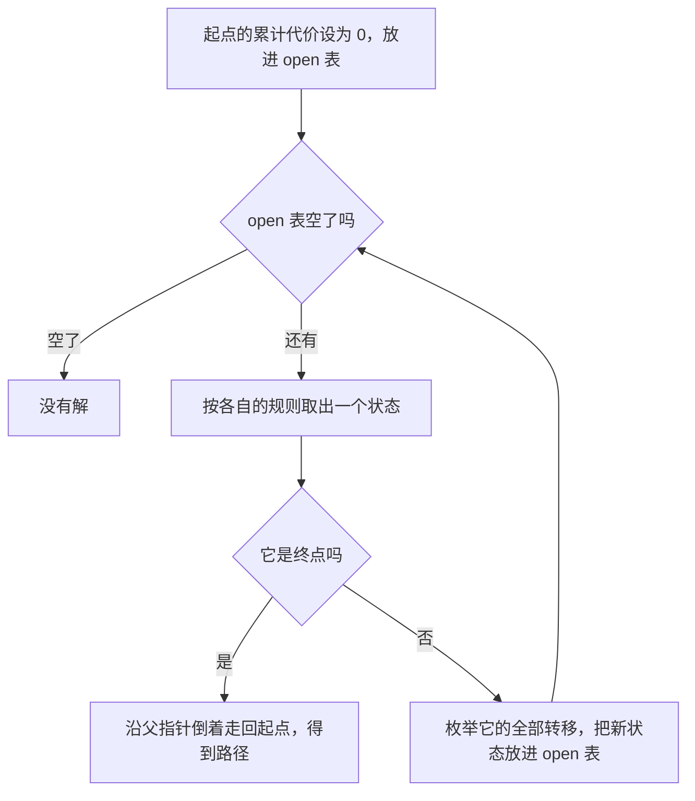

# 搜索：在状态空间里找路

> **授权**：本章节属教材文档部分，采用 [CC BY-NC-ND 4.0](../LICENSE)
> 加[附加条款](../许可附加条款.md)授权：署名、非商业、禁止演绎、不允许二次分发。
> 文中引用的代码不受此限，各自保留原有许可证，详见[版权与许可说明.md](../版权与许可说明.md)。

配送车队每天要回答同一个问题：从仓库出发，走哪条路到工地最省油。地图是一片方格，
每一格的通行代价不同，有的格是墙，车开不过去。这类问题的解不是从一张现成的表里翻出来的，
它要一步一步走出来：每一步有若干种走法，走法连起来才是一条路。

第 4 章讲的查找是在已经摆好的集合里定位一个元素，比较次数与每次比较的代价就能说清全部问题。
这里多出一件事：下一步走到哪里，是搜索过程自己决定的。于是规模不再是元素个数，
而是「一共有多少种可能的局面」，以及「从一种局面能走到哪几种局面」。这两样合起来叫**状态空间**，
搜索就是在状态空间里找一条从起点通到终点的路。

本章节的例子是同一张方格地图：它先被写成一个状态空间，四种走法都在它上面找路，
最后按展开状态数、路径长度与路径代价并排比较。写状态空间要回答状态、转移与代价三个问题；
四种走法各自保证什么、不保证什么，彼此差别很大；给搜索加一个估价函数能少展开状态，
而加错了会失去最优性。

---
> **约定**：标注以行内代码单独成行——`实测数据` 表示实际执行验证过，
> 复现命令随程序给出；`文档` 表示引自标准草案或官方资料；`待确认` 表示尚未验证。
> 路径占位符（如 `<MinGW>`、`<工作区>`）的含义见《README.md》。
> 复杂度一律写成 `O(...)`，它表示**随规模增长的量级**，不表示具体快慢。
> 本章节实测环境是 Windows 11 + g++ 16.2.0（MinGW-w64），`-O2` 优化。

# 本章节定位

| 需要先知道 | 在哪 |
|---|---|
| 图怎么存：邻接矩阵与邻接表 | 《09-高阶数据结构/A-10-图：关系怎么存.md》第 2 节、第 3 节 |
| 堆与 `std::priority_queue` 的接口 | 《09-高阶数据结构/A-05-后进先出、先进先出与优先级：stack、queue 与堆.md》第 3 节、第 4 节 |
| 把比较规则写成函数对象 | 《05-类与面向对象/10-lambda 与函数对象.md》第 5 节 |
| 迭代器与范围 | 《09-高阶数据结构/A-06-迭代器与范围：容器与算法之间的接口.md》第 1 节 |
| 在已经摆好的集合里查找 | 《08-一些散落的算法/04-查找：从线性到索引.md》第 1 节 |
| 缓存行与访问局部性 | 《06-更底层/02-对齐、填充与缓存.md》第 3 节 |

**相邻的章节**：本章节是 `08-一些散落的算法` 板块里讲「走」的一章。它前面是查找与两章排序：
《08-一些散落的算法/05-排序（一）：比较排序的三种策略.md》章节与
《08-一些散落的算法/06-排序（二）：不比较也能排.md》章节——查找、搜索、排序三件事共用同一批判据：
数据怎么摆、每步的代价是多少、要的答案对顺序有没有要求。本板块开头几章讲的递归是这一章的地基，
深搜的递归写法就是递归本身。数据结构一侧的「图怎么存、怎么遍历」在 `09-高阶数据结构` 板块里讲，
本章节只讲搜索策略上的取舍，不重复那些接口。

| 本章各节 | 讲什么 |
|---|---|
| 第 1 节 | 把「哪条路最省油」写成一个状态空间：状态怎么编号、转移怎么枚举、代价挂在哪里 |
| 第 2 节 | 深搜：用栈走到底，回溯把状态改回来；栈会满，第一个解不是最优解 |
| 第 3 节 | 广搜：用队列按层推进，第一次到达就是最少步数；代价不在它的模型里 |
| 第 4 节 | 代价一致的 Dijkstra：每次取累计代价最小的那个，因此要优先队列 |
| 第 5 节 | A*：`f = g + h`；可采纳保证最优，一致保证第一次取出就定稿 |
| 第 6 节 | 同一张图上四种走法的并排对照，以及已有的搜索演示 |

---

# 第 1 节 把问题变成状态与转移

## 1.1 车队手里的那张地图

车队的调度手里有一张 32 列 24 行的方格地图，格子总共有 768 个。地图上标了三样东西：
哪些格是墙（车开不过去），每格的通行代价（路面好坏不同，代价在 3 到 9 之间），
以及仓库与工地各在哪一格。仓库在 (2,2)，工地在 (29,21)。

调度要回答的问题是「哪条路最省油」，而手里的原始材料只是一张格子表。把格子表变成能搜索的东西，
要连着做三个决定，缺一个都动不了：**状态怎么表示**、**转移怎么枚举**、**代价挂在哪里**。
这三件事定下来，问题就变成了一张带权的图，剩下的才是挑一种走法去走。

同一个套路能套在很多看起来不相干的问题上：两只水桶测出 4 升水，状态是「大桶几升、小桶几升」
这一对数字，转移是灌满、倒空、互相倒六种操作，代价是每种操作花的时间；
八数码的状态是九个格子的排列，转移是空格与相邻数字交换，代价是每步算 1。
这三样写出来，问题就归到同一个模型上了。

## 1.2 三个决定

**状态怎么表示。** 最直接的表示是给每格编一个号：`id = y * W + x`，W 是列数。
仓库就是 `2 * 32 + 2 = 66`，工地是 `21 * 32 + 29 = 701`。编号是一个整数，
可以直接当数组下标用：距离数组、闭表、父指针数组都按它索引，不必再查一次。
换成 `(x, y)` 两个数或者一个结构体也能用，代价是每次都要算一次乘法才能落到下标上。
**编码成整数不是为了好看，是为了让状态本身就是数组下标。**

**转移怎么枚举。** 车可以走八个方向，因此每格最多有八个邻居。八个方向写成两张定长的偏移表，
枚举就是一次循环：`dx = DX[k]`、`dy = DY[k]`，`k` 从 0 数到 7。

| 序号 `k` | `DX[k]` | `DY[k]` | 走法 | 代价系数 |
|---|---|---|---|---|
| 0 | +1 | 0 | 直走（东） | 1000 |
| 1 | +1 | +1 | 斜走（东南） | 1415 |
| 2 | 0 | +1 | 直走（南） | 1000 |
| 3 | −1 | +1 | 斜走（西南） | 1415 |
| 4 | −1 | 0 | 直走（西） | 1000 |
| 5 | −1 | −1 | 斜走（西北） | 1415 |
| 6 | 0 | −1 | 直走（北） | 1000 |
| 7 | +1 | −1 | 斜走（东北） | 1415 |

行号就是枚举顺序，这一点在后面很重要：两个状态代价并列时，先枚举到谁，
谁就先被处理，而「先枚举到谁」完全由这张表的顺序决定。搜索程序要可复现，
就得把顺序固定下来。八方向里允许斜着穿过两堵墙的夹缝（只看目标格能不能走，
不看两个正交邻居），这是有意的简化：代价模型简单，实现也简单。

**代价挂在哪里。** 代价挂在这一步的目标格上，单位取千分之一：把「走一格、这一格代价是 1」
记作 1000 个单位，那么进入代价为 `c` 的一格，直走付 `c × 1000`，斜走付 `c × 1415`。
斜走取 1415 而不是把 `1414.21` 截成 1414，是为了让第 5 节的八分下界不超过真实代价，
理由见那一节。

代价挂在目标格上有一个直接后果：**同一条边的两个方向代价可以不一样，图因此是有向的**。
实测里 66 到 67 要付 7000，反过来 67 到 66 只付 3000，因为两格的代价不同。
要让代价对称，可以改成「两格代价取大」或者「取平均」，那是另一张图，也是另一个模型。
模型选哪个由需求决定：油耗只跟车压过哪一格有关，因此这里的选项是目标格。

> [!IMPORTANT]
> **把问题写成状态空间，就是回答三个问题：状态怎么编码成一个值、从每个状态能走到哪些状态、
> 走这一步要付多少代价。** 三件事定下来之后，「找路」才变成一个可以比较的算法问题，
> 而不是一句愿望。

## 1.3 状态空间有多大

下面这份程序把地图生成出来，并数清三个容易混在一起的数：总格数、可通行格数、从起点真正能到达的格数。
地图用固定种子的 xorshift32 生成，因此任何人跑出来的都是同一张图。

`C++`

```cpp
/* state_space.cpp    编译：g++ -std=c++17 -O2 state_space.cpp -o state_space
 * 把「从仓库到工地的最省油路线」写成一个状态空间：
 * 状态怎么编号、转移怎么枚举、代价挂在哪里。
 * 地图由固定种子生成，重跑逐位相同。 */
#include <cstdint>
#include <cstdio>
#include <vector>

/* 地图 32 列 24 行，共 768 格；起点是仓库，终点是工地 */
static const int W = 32, H = 24, N = W * H;
static const int SEED = 85;          /* 固定种子：换一个数就换一张地图 */
static const int WALL_PCT = 28;      /* 墙的比例，百分之 */
static const int SX = 2, SY = 2;     /* 仓库 */
static const int GX = 29, GY = 21;   /* 工地 */

/* xorshift32：自带的小随机数，不依赖标准库实现，换平台逐位一致 */
struct Rng {
    std::uint32_t s;
    explicit Rng(std::uint32_t seed) : s(seed ? seed : 1u) {}
    std::uint32_t next() { s ^= s << 13; s ^= s >> 17; s ^= s << 5; return s; }
};

struct Map {
    std::vector<unsigned char> wall;   /* 1 表示墙，不可通行 */
    std::vector<unsigned char> cost;   /* 进入这一格要付的代价，3 到 9 */

    void build(std::uint32_t seed) {
        Rng r(seed);
        wall.assign(N, 0);
        cost.assign(N, 1);
        for (int i = 0; i < N; ++i) {
            const std::uint32_t a = r.next(), b = r.next();   /* 每格固定消耗两个随机数 */
            wall[i] = (a % 100u) < (unsigned)WALL_PCT;
            cost[i] = (unsigned char)(3 + b % 7u);            /* 代价 3 到 9 */
        }
        /* 围墙：把 x 从 23 到 28、y 从 3 到 8 的边框设成墙，圈出一块进不去的料场 */
        for (int x = 23; x <= 28; ++x) { wall[3 * W + x] = 1; wall[8 * W + x] = 1; }
        for (int y = 3; y <= 8; ++y) { wall[y * W + 23] = 1; wall[y * W + 28] = 1; }
        for (int y = 4; y <= 7; ++y)
            for (int x = 24; x <= 27; ++x) wall[y * W + x] = 0;   /* 料场内部是空地 */
        wall[SY * W + SX] = 0;                                    /* 起终点不压墙 */
        wall[GY * W + GX] = 0;
    }
};

/* 八方向偏移，顺序固定：邻居枚举的顺序决定并列时谁先被访问 */
static const int DX[8] = {1, 1, 0, -1, -1, -1, 0, 1};
static const int DY[8] = {0, 1, 1, 1, 0, -1, -1, -1};

static bool passable(const Map& m, int id) { return !m.wall[id]; }
static bool inside(int x, int y) { return x >= 0 && x < W && y >= 0 && y < H; }

/* 一条转移的代价：直走付目标格的一倍代价，斜走付 1415 千分之一（略高于 √2 倍） */
static int step_cost(const Map& m, int from, int to) {
    const int fx = from % W, fy = from / W, tx = to % W, ty = to / W;
    return m.cost[to] * (((fx != tx) && (fy != ty)) ? 1415 : 1000);
}

int main() {
    Map m;
    m.build(SEED);

    int walls = 0;
    for (int i = 0; i < N; ++i) walls += m.wall[i];
    std::printf("地图 %d 列 %d 行 共 %d 格；种子 %d，墙比例 %d%%\n", W, H, N, SEED, WALL_PCT);
    std::printf("墙 %d 格，可通行 %d 格（可通行格就是状态空间的大小）\n", walls, N - walls);
    std::printf("起点编号 %d，终点编号 %d\n", SY * W + SX, GY * W + GX);

    /* 从起点做一次不设终点的广搜：算出真正可达的状态数与它们的层号 */
    std::vector<int> layer(N, -1);
    std::vector<int> q;
    q.reserve(N);
    const int s = SY * W + SX, g = GY * W + GX;
    layer[s] = 0;
    q.push_back(s);
    for (std::size_t head = 0; head < q.size(); ++head) {
        const int u = q[head];
        for (int k = 0; k < 8; ++k) {
            const int x = u % W + DX[k], y = u / W + DY[k];
            if (!inside(x, y)) continue;
            const int v = y * W + x;
            if (!passable(m, v) || layer[v] >= 0) continue;
            layer[v] = layer[u] + 1;
            q.push_back(v);
        }
    }
    const int reach = (int)q.size();
    std::printf("从起点可达 %d 格；剩下 %d 格可通行但从起点到不了（围墙里的料场）\n",
                reach, (N - walls) - reach);
    int maxlayer = 0;
    for (int i = 0; i < N; ++i) if (layer[i] > maxlayer) maxlayer = layer[i];
    std::printf("终点在第 %d 层，最远的一层是第 %d 层\n", layer[g], maxlayer);

    /* 后继个数：按八方向数每个可通行格有几个能走的邻居 */
    int deg[9] = {0};
    for (int i = 0; i < N; ++i) {
        if (!passable(m, i)) continue;
        int d = 0;
        for (int k = 0; k < 8; ++k) {
            const int x = i % W + DX[k], y = i / W + DY[k];
            if (inside(x, y) && passable(m, y * W + x)) ++d;
        }
        ++deg[d];
    }
    std::printf("后继个数分布（八方向）：");
    for (int d = 0; d <= 8; ++d) std::printf("%d 个后继的格 %d 个%s", d, deg[d], d == 8 ? "\n" : "，");

    /* 起点的后继，连同每条转移的代价一起列出来 */
    std::printf("起点的后继：");
    for (int k = 0; k < 8; ++k) {
        const int x = SX + DX[k], y = SY + DY[k];
        if (!inside(x, y)) continue;
        const int v = y * W + x;
        if (!passable(m, v)) continue;
        const bool diag = (DX[k] != 0) && (DY[k] != 0);
        std::printf("%d(%s，代价 %d) ", v, diag ? "斜走" : "直走", step_cost(m, s, v));
    }
    std::printf("\n");

    /* 代价挂在目标格上，因此同一条边的两个方向可以不一样 */
    int nbr = -1;
    for (int k = 0; k < 8 && nbr < 0; ++k) {
        const int x = SX + DX[k], y = SY + DY[k];
        if (inside(x, y) && passable(m, y * W + x)) nbr = y * W + x;
    }
    std::printf("代价挂在目标格上：%d -> %d 是 %d，反过来 %d -> %d 是 %d\n",
                s, nbr, step_cost(m, s, nbr), nbr, s, step_cost(m, nbr, s));

    /* 把地图打出来，墙是 #，进不去的料场是 .，其余是代价数字 */
    std::printf("地图（# 墙，. 从起点到不了，数字是这一格的代价）：\n");
    for (int y = 0; y < H; ++y) {
        for (int x = 0; x < W; ++x) {
            const int i = y * W + x;
            char c = (char)('0' + m.cost[i]);
            if (m.wall[i]) c = '#';
            else if (layer[i] < 0) c = '.';
            if (i == s) c = 'S';
            if (i == g) c = 'G';
            std::putchar(c);
        }
        std::putchar('\n');
    }
    return 0;
}
```

`实测数据`
`Text`

```text
地图 32 列 24 行 共 768 格；种子 85，墙比例 28%
墙 231 格，可通行 537 格（可通行格就是状态空间的大小）
起点编号 66，终点编号 701
从起点可达 521 格；剩下 16 格可通行但从起点到不了（围墙里的料场）
终点在第 28 层，最远的一层是第 34 层
后继个数分布（八方向）：0 个后继的格 0 个，1 个后继的格 1 个，2 个后继的格 19 个，3 个后继的格 53 个，4 个后继的格 87 个，5 个后继的格 113 个，6 个后继的格 144 个，7 个后继的格 87 个，8 个后继的格 33 个
起点的后继：67(直走，代价 7000) 99(斜走，代价 4245) 98(直走，代价 7000) 65(直走，代价 3000) 33(斜走，代价 9905) 34(直走，代价 3000) 35(斜走，代价 11320)
代价挂在目标格上：66 -> 67 是 7000，反过来 67 -> 66 是 3000
```

三个数要分开看。768 是格子的总数，**它不是状态空间的规模**：墙不可通行，
真正能落脚的是 537 格。而 537 也不是可达状态的个数——地图的东北角有一片被围墙圈起来的料场，
里面 16 格是平地，但车开不进去，从起点出发永远走不到。**可达状态总数是 521。**
搜索算法只在这 521 个状态上花钱，另外 16 格连被访问的机会都没有；
状态空间写错（比如漏掉围墙、或者把墙也算成状态）不会让程序崩，
只会让所有的计数与代价一起偏掉。

后继个数那一行回答「转移怎么枚举」。八方向下每格最多八个后继，实测里没有后继的格是 0 个，
8 个后继的格是 33 个，多数格落在 5 到 7 之间。起点的后继有 7 个，每条转移都带着代价：
99 那一格代价是 3，斜着进去付 `3 * 1415 = 4245`；67 那一格代价是 7，直着进去付 `7 * 1000 = 7000`。

地图本身也值得看一眼。`#` 是墙，`.` 是从起点到不了的料场，数字是这一格的代价，
`S` 与 `G` 是仓库与工地。

`实测数据`
`Text`

```text
地图（# 墙，. 从起点到不了，数字是这一格的代价）：
#466#689#8#6#38#66858#9637367#66
4738##4##77349##66##4#743##47665
73S775#7#5#95853#634#4#6##47673#
5#734#8#9#547359476#8#6#######5#
45##76367#3#8###9#37#69#....#75#
6#99##773#347864#634457#....#38#
458####974855#9343868#5#....#9#6
53469#58#37#38544#938#6#....##94
5#65#89455464763#64493#######94#
#7989535#9#45965595#8967834#6867
46#696##99#335##79##848#333#####
4#86##6875#373#4##6##8#7#8#734#7
#538#577435843##87#99799#37#44#5
44964#5#546#69934#57###5#3468456
#53666#7685##5##33643##59#6967##
88668#7785#99#35578#4377965##8#3
48##7#45####8#9773##85333##6#377
753#3499775#46#6#37####7#9#644#6
79#9898763659437#85#933###63735#
675##47748#749##7477834469366688
555#7#5637#8#683#9#559395483786#
858#77646#3#4#88#943##76#8#77G74
3#94##59###7#6876#449#5##43#743#
3336####7345#3#6397794#984##874#
```

从 `S` 到 `G` 有很多条路。第 2 节起，四种走法都在这一张图上跑，
后面每一节的计数都可以回到这里核对：它们数的都是这 521 个可达状态里的东西。

> [!NOTE]
> 这一节收成一句话：**状态空间的大小是可通行格数（537），不是格子总数（768），
> 也不是可达状态数（521）；后继个数决定每一步要枚举多少条转移，
> 代价决定这些转移里哪一条更值。**

---

# 第 2 节 深搜：栈与回溯

## 2.1 一条路走到底

新来的司机想先确认路通不通。他的开法很朴素：从仓库出发，认准一个方向一直往前开，
遇到死路就掉头回到上一个路口，换一条没走过的岔路继续；走到工地就停下。
这种走法叫**深搜**：每到一个状态，先把它的一个后继走到底，走不通再回头试下一个。

深搜要记住两样东西。一样是「当前这条路上都有谁」，回头的时候要按原路退；
另一样是「哪些状态已经去过」，去过的不必再去——走法再多，能到的地方是有限的。
前一样用一条路径（一个栈）表示，后一样用一张标记表表示。

写成递归，两样东西正好对应调用栈与一个标记数组：函数进来就标记当前状态，
然后按固定的顺序挨个尝试后继，某个后继失败就退回来试下一个。
下面的程序给了两种写法——递归，以及自己用 `std::vector` 的尾部当栈的显式栈版本。
两种写法不是两个算法，它们是同一个算法的两种记账方式。

`C++`

```cpp
/* dfs_bfs.cpp    编译：g++ -std=c++17 -O2 dfs_bfs.cpp -o dfs_bfs
 * 同一张地图上的深搜与广搜：走到底再回头，与按层推进。
 * 另含两项实测：深搜的第一个解比最短解长多少、递归到多深会把栈用光。 */
#include <algorithm>
#include <cstdint>
#include <cstdio>
#include <cstdlib>
#include <cstring>
#include <queue>
#include <string>
#include <vector>

/* ---------- 地图：32 列 24 行，固定种子 ---------- */

static const int W = 32, H = 24, N = W * H;
static const int SEED = 85;
static const int WALL_PCT = 28;
static const int SX = 2, SY = 2;     /* 仓库 */
static const int GX = 29, GY = 21;   /* 工地 */
static const int INF = 0x3f3f3f3f;

struct Rng {
    std::uint32_t s;
    explicit Rng(std::uint32_t seed) : s(seed ? seed : 1u) {}
    std::uint32_t next() { s ^= s << 13; s ^= s >> 17; s ^= s << 5; return s; }
};

struct Map {
    std::vector<unsigned char> wall;
    std::vector<unsigned char> cost;      /* 进入这一格要付的代价，3 到 9 */

    void build(std::uint32_t seed) {
        Rng r(seed);
        wall.assign(N, 0);
        cost.assign(N, 1);
        for (int i = 0; i < N; ++i) {
            const std::uint32_t a = r.next(), b = r.next();
            wall[i] = (a % 100u) < (unsigned)WALL_PCT;
            cost[i] = (unsigned char)(3 + b % 7u);
        }
        for (int x = 23; x <= 28; ++x) { wall[3 * W + x] = 1; wall[8 * W + x] = 1; }
        for (int y = 3; y <= 8; ++y) { wall[y * W + 23] = 1; wall[y * W + 28] = 1; }
        for (int y = 4; y <= 7; ++y)
            for (int x = 24; x <= 27; ++x) wall[y * W + x] = 0;
        wall[SY * W + SX] = 0;
        wall[GY * W + GX] = 0;
    }
};

/* 八方向偏移，顺序固定：邻居枚举的顺序决定谁先被访问 */
static const int DX[8] = {1, 1, 0, -1, -1, -1, 0, 1};
static const int DY[8] = {0, 1, 1, 1, 0, -1, -1, -1};
static bool inside(int x, int y) { return x >= 0 && x < W && y >= 0 && y < H; }
static bool passable(const Map& m, int id) { return !m.wall[id]; }
static int step_cost(const Map& m, int from, int to) {
    const int fx = from % W, fy = from / W, tx = to % W, ty = to / W;
    return m.cost[to] * (((fx != tx) && (fy != ty)) ? 1415 : 1000);
}

struct Result {
    int len = -1, cost = -1, expanded = 0, open_max = 0;
    std::vector<int> path;                 /* 从起点到终点，含两端 */
};

static int path_cost(const Map& m, const std::vector<int>& p) {
    int c = 0;
    for (std::size_t i = 1; i < p.size(); ++i) c += step_cost(m, p[i - 1], p[i]);
    return c;
}

/* ---------- 深搜（递归）：进入时标记，走完一条路再回头 ---------- */

static void dfs_rec(const Map& m, int u, int g, std::vector<char>& seen,
                    std::vector<int>& path, Result& r) {
    seen[u] = 1;
    ++r.expanded;
    path.push_back(u);
    r.open_max = std::max(r.open_max, (int)path.size());   /* 这里记的是走过的最大深度 */
    if (u == g) { r.len = (int)path.size() - 1; r.cost = path_cost(m, path); r.path = path; return; }
    for (int k = 0; k < 8; ++k) {
        const int x = u % W + DX[k], y = u / W + DY[k];
        if (!inside(x, y)) continue;
        const int v = y * W + x;
        if (!passable(m, v) || seen[v]) continue;
        dfs_rec(m, v, g, seen, path, r);
        if (r.len >= 0) return;
    }
    path.pop_back();                       /* 回溯：退出时把状态改回来 */
}

/* ---------- 深搜（显式栈）：退栈顺序与递归一致，因此给同一条路 ---------- */

static Result dfs_stack(const Map& m) {
    Result r;
    std::vector<char> seen(N, 0);
    std::vector<int> parent(N, -1), depth(N, 0);
    const int s = SY * W + SX, g = GY * W + GX;
    std::vector<int> st{s};
    while (!st.empty()) {
        const int u = st.back();
        st.pop_back();
        if (seen[u]) continue;             /* 弹出来才标记，与递归的时机一致 */
        seen[u] = 1;
        ++r.expanded;
        r.open_max = std::max(r.open_max, depth[u] + 1);
        if (u == g) break;
        for (int k = 7; k >= 0; --k) {     /* 倒着压，弹出顺序才与递归的正序一致 */
            const int x = u % W + DX[k], y = u / W + DY[k];
            if (!inside(x, y)) continue;
            const int v = y * W + x;
            if (!passable(m, v) || seen[v]) continue;
            parent[v] = u;
            depth[v] = depth[u] + 1;
            st.push_back(v);
        }
    }
    if (seen[g]) {
        std::vector<int> p;
        for (int u = g; u >= 0; u = parent[u]) { p.push_back(u); if (u == s) break; }
        std::reverse(p.begin(), p.end());
        r.path = p;
        r.len = (int)p.size() - 1;
        r.cost = path_cost(m, p);
    }
    return r;
}

/* ---------- 广搜：按层推进，第一次到达某状态时的步数就是最少步数 ---------- */

static Result bfs(const Map& m) {
    Result r;
    std::vector<int> dist(N, -1), parent(N, -1);
    std::vector<int> q;
    q.reserve(N);
    const int s = SY * W + SX, g = GY * W + GX;
    dist[s] = 0;
    q.push_back(s);
    for (std::size_t head = 0; head < q.size(); ++head) {
        r.open_max = std::max(r.open_max, (int)(q.size() - head));   /* 队列最大长度 */
        const int u = q[head];
        ++r.expanded;
        if (u == g) break;                                           /* 遇到终点就停 */
        for (int k = 0; k < 8; ++k) {
            const int x = u % W + DX[k], y = u / W + DY[k];
            if (!inside(x, y)) continue;
            const int v = y * W + x;
            if (!passable(m, v) || dist[v] >= 0) continue;
            dist[v] = dist[u] + 1;
            parent[v] = u;
            q.push_back(v);
        }
    }
    if (dist[g] >= 0) {
        std::vector<int> p;
        for (int u = g; u >= 0; u = parent[u]) { p.push_back(u); if (u == s) break; }
        std::reverse(p.begin(), p.end());
        r.path = p;
        r.len = dist[g];
        r.cost = path_cost(m, p);
    }
    return r;
}

/* ---------- 一次跑完的广搜：给每个可达状态一个层号 ---------- */

static int bfs_all_layers(const Map& m, std::vector<int>& layer) {
    layer.assign(N, -1);
    std::vector<int> q;
    q.reserve(N);
    const int s = SY * W + SX;
    layer[s] = 0;
    q.push_back(s);
    for (std::size_t head = 0; head < q.size(); ++head) {
        const int u = q[head];
        for (int k = 0; k < 8; ++k) {
            const int x = u % W + DX[k], y = u / W + DY[k];
            if (!inside(x, y)) continue;
            const int v = y * W + x;
            if (!passable(m, v) || layer[v] >= 0) continue;
            layer[v] = layer[u] + 1;
            q.push_back(v);
        }
    }
    return (int)q.size();
}

/* ---------- 代价最小的那条路：只为给广搜那条路做对照 ---------- */

static int cheapest_cost(const Map& m) {
    std::vector<int> dist(N, INF);
    typedef std::pair<int, int> Node;                   /* (累计代价, 编号) */
    std::priority_queue<Node, std::vector<Node>, std::greater<Node> > pq;
    const int s = SY * W + SX, g = GY * W + GX;
    dist[s] = 0;
    pq.push(Node(0, s));
    while (!pq.empty()) {
        const Node t = pq.top();
        pq.pop();
        if (t.first > dist[t.second]) continue;         /* 过期的条目直接丢掉 */
        if (t.second == g) break;
        for (int k = 0; k < 8; ++k) {
            const int x = t.second % W + DX[k], y = t.second / W + DY[k];
            if (!inside(x, y)) continue;
            const int v = y * W + x;
            if (!passable(m, v)) continue;
            const int nd = dist[t.second] + step_cost(m, t.second, v);
            if (nd < dist[v]) { dist[v] = nd; pq.push(Node(nd, v)); }
        }
    }
    return dist[g];
}

/* ---------- 递归深度探针：让程序把自己再拉起一次，子进程递归到指定深度 ---------- */

static volatile long long g_sink = 0;
static const char* g_frame[2];
static int g_frame_seen = 0;

static void descend(int remain) {
    volatile char pad[64];
    pad[0] = (char)remain;
    /* 在两层真正的递归里各取一次地址，两者之差就是一帧占的字节数 */
    if (remain == 5) g_frame[0] = (const char*)pad;
    if (remain == 4) g_frame[1] = (const char*)pad;
    if (remain > 0) descend(remain - 1);
    g_sink += pad[0];
}

int main(int argc, char** argv) {
    /* 探针身份：递归到指定深度就返回，深度过大时进程会因栈溢出而终止 */
    if (argc == 3 && std::strcmp(argv[1], "--probe") == 0) {
        descend(std::atoi(argv[2]));
        std::printf("sink %lld\n", g_sink);
        return 0;
    }

    Map m;
    m.build(SEED);
    const int s = SY * W + SX, g = GY * W + GX;

    /* 一、深搜的两种写法 */
    Result dr;
    {
        std::vector<char> seen(N, 0);
        std::vector<int> path;
        dfs_rec(m, s, g, seen, path, dr);
    }
    const Result ds = dfs_stack(m);
    std::printf("递归深搜：展开 %d 个状态，走过的最大深度 %d，路径长度 %d，路径代价 %d\n",
                dr.expanded, dr.open_max, dr.len, dr.cost);
    std::printf("显式栈深搜：展开 %d 个状态，走过的最大深度 %d，路径长度 %d，路径代价 %d\n",
                ds.expanded, ds.open_max, ds.len, ds.cost);
    std::printf("两种写法给出同一条路径：%s\n", dr.path == ds.path ? "是" : "否");
    std::printf("深搜路径的前 12 个编号：");
    for (std::size_t i = 0; i < dr.path.size() && i < 12; ++i)
        std::printf("%d%s", dr.path[i], i + 1 < dr.path.size() && i + 1 < 12 ? " -> " : "");
    std::printf("（共 %d 个）\n", (int)dr.path.size());

    /* 二、广搜与层号 */
    const Result b = bfs(m);
    std::printf("广搜遇到终点就停：展开 %d 个状态，最短步数 %d，路径代价 %d，队列最大长度 %d\n",
                b.expanded, b.len, b.cost, b.open_max);
    std::vector<int> layer;
    const int reach = bfs_all_layers(m, layer);
    int maxlayer = 0;
    for (int i = 0; i < N; ++i) maxlayer = std::max(maxlayer, layer[i]);
    std::printf("跑完整个可达空间：访问 %d 个状态，最远的一层是第 %d 层，终点在第 %d 层\n",
                reach, maxlayer, layer[g]);
    std::printf("深搜那条路 %d 步，广搜这条路 %d 步，短了 %d 步\n",
                dr.len, b.len, dr.len - b.len);

    /* 三、每一步代价不相同时，广搜给的解不省油 */
    const int best = cheapest_cost(m);
    std::printf("广搜那条 %d 步的路代价 %d；代价最小的那条路代价 %d，贵了 %d（百分之 %d）\n",
                b.len, b.cost, best, b.cost - best, (b.cost - best) * 100 / best);

    /* 四、层号直方图与逐个状态的层号 */
    int hist[64] = {0};
    for (int i = 0; i < N; ++i)
        if (layer[i] >= 0) ++hist[layer[i]];
    std::printf("层号直方图（层:状态数）：");
    for (int l = 0; l <= maxlayer; ++l) std::printf("%d:%d%s", l, hist[l], l == maxlayer ? "\n" : " ");
    std::printf("层号序列（按编号升序，每行 32 个；-1 是墙，-2 是围墙里的料场）：\n");
    for (int y = 0; y < H; ++y) {
        for (int x = 0; x < W; ++x) {
            const int i = y * W + x;
            int v = layer[i];
            if (m.wall[i]) v = -1;
            else if (layer[i] < 0) v = -2;
            std::printf("%4d", v);
        }
        std::printf("\n");
    }

    /* 五、递归深度受栈限制 */
    descend(10);
    long long frame = (long long)(g_frame[0] - g_frame[1]);
    if (frame < 0) frame = -frame;                 /* 栈向低地址生长，深一层地址更小 */
    std::printf("一帧 %lld 字节（相邻两层递归里同名局部变量的地址差）\n", frame);
    const int depths[] = {2000, 8000, 15000, 40000};
    for (int d : depths) {
        std::string cmd = "\"";
        cmd += argv[0];
        cmd += "\" --probe ";
        cmd += std::to_string(d);
        cmd += " >nul 2>nul";
        const int rc = std::system(cmd.c_str());
        if (rc == 0) std::printf("递归深度 %d：正常返回\n", d);
        else std::printf("递归深度 %d：栈溢出，退出码 %d\n", d, rc);
    }
    return 0;
}
```

## 2.2 回溯就是进入时改、退出时改回来

**回溯**这个名字容易让人觉得复杂，做法只有一条：**进入一个状态时改状态，退出这个状态时把改动撤销。**
在这份程序里，进入时做两件事：`seen[u] = 1` 与 `path.push_back(u)`；
退出时做一件事：`path.pop_back()`。路径必须退，因为 `path` 描述的是「当前这条路」，
回头之后原来那条路就不存在了。

`seen` 故意不退。把 `seen` 也退回来，搜索就变成「枚举所有不重复的简单路径」，
同一个状态会在不同的路上被反复访问，重数随路长指数增长；而对「能不能到工地」这个问题，
第一次走到某个状态之后，后面再走到它没有任何新信息。**标记不退，是把「到过没有」与
「当前在哪条路上」分开：前者是全局的、整场搜索都不撤的，后者是局部的、随回溯撤销的。**

> [!WARNING]
> **`seen` 退不退，取决于问题问的是什么。** 问「能不能到」或者「最短几步」，标记不退；
> 问「一共有几条不同的路」或者「列出全部路线」，标记必须退，而且代价从多项式变成指数级。
> 两类问题代码只差一行，规模差好几个量级，改之前要清楚自己在问哪一个。

## 2.3 两个真实的风险

深搜的第一个解，只是「按这张偏移表的顺序走出来的第一个解」。它既不短也不便宜。

`实测数据`
`Text`

```text
递归深搜：展开 52 个状态，走过的最大深度 49，路径长度 48，路径代价 307255
显式栈深搜：展开 52 个状态，走过的最大深度 49，路径长度 48，路径代价 307255
两种写法给出同一条路径：是
深搜路径的前 12 个编号：66 -> 67 -> 68 -> 69 -> 102 -> 135 -> 136 -> 168 -> 201 -> 202 -> 203 -> 204（共 49 个）
深搜那条路 48 步，广搜这条路 28 步，短了 20 步
```

**风险一：它找到的第一个解不是最优解。** 深搜这条路 48 步、代价 307255；
同一张图上广搜只要 28 步（第 3 节），最省油的那条路代价是 151635（第 4 节）。
深搜展开的状态数是四种走法里最少的（52 个，因为它一次只沿一条路往下走），
代价是它对「好不好」没有任何概念：偏移表的顺序一换，它给出的路就换一条，
而哪一条更省油它无从判断。

**风险二：递归深度受栈的限制。** 递归写法把「当前这条路」放在调用栈上，
栈是操作系统给的一块固定大小的内存。地图上只有 521 个可达状态，实测走过的最大深度是 49 层，
离限制很远；但状态空间一大就不一样了。这份程序带了一个探针：它会把自己再拉起一次，
让子进程递归到指定深度，父进程只看退出码。

`实测数据`
`Text`

```text
一帧 64 字节（相邻两层递归里同名局部变量的地址差）
递归深度 2000：正常返回
递归深度 8000：正常返回
递归深度 15000：正常返回
递归深度 40000：栈溢出，退出码 -1073741571
```

退出码 `-1073741571` 就是 `0xC00000FD`，即 Windows 上的「栈溢出」。一帧 64 字节是测出来的：
在相邻两层递归里各取一次同名局部变量的地址，两者之差的绝对值就是一帧占的字节数。
**能不能递归到某一深度，由「一帧多少字节」与「栈有多大」两个数一起决定**，
换编译器、换优化等级、换栈的大小设置，临界深度都会跟着变；
可以确定的是**递归深度有上限，而上限与状态空间的大小无关**。
把状态空间换成一条四万格的走廊（每个状态只有一个后继），递归写法就崩了——
探针里的 40000 层正是这个意思；而显式栈写法只是把它自己那块内存涨到四万个条目。

> [!CAUTION]
> **深搜崩起来是整段崩，不是返回一个错。** 栈溢出终止的是整个进程，
> 没有异常可以接，没有返回值可以查。递归深度可能随输入变化时，要么改成显式栈，
> 要么在进入递归前检查深度，不要指望「大不了跑慢一点」。

> [!NOTE]
> 深搜这一节收成三句话：**它用栈走到底再回头，回溯就是进入时改状态、退出时改回来，
> 而哪些改动要撤销由问题决定；它找到的第一个解取决于枚举顺序，因此不保证短、更不保证省；
> 它的递归深度有硬上限，上限由栈的大小决定，与状态空间的大小无关。**

---

# 第 3 节 广搜：队列与层

## 3.1 按层推进

调度问的是另一个问题：**最少要开几段路。** 他不管油耗，只数段数。
数段数有一个很自然的做法：从仓库出发，把所有「开一段能到」的路口全记下来，
再把这些路口的「再开一段能到」的路口全记下来，如此一层一层往外推。
第一次推到工地时，推了多少层就是最少段数。

这个做法用队列实现，叫**广搜**。它跟深搜只差一处：深搜从栈顶取（后进先出），
广搜从队头取（先进先出）。取法的差别带来一个深搜没有的性质：
**队列里的状态是按层号排好的**，层号小的先出队，因此第一次到达某个状态时，
走的就是最少步数。要证明这一点只要一句话：如果存在一条更短的路，
那条路上的状态会在更早的层里出现，于是它会更早被推到。

## 3.2 层号与队列长度

广搜有两种停法，数量不一样：找到工地就停，与把整个可达空间跑完。
前者省时间，后者才能给每个状态一个层号。

`实测数据`
`Text`

```text
广搜遇到终点就停：展开 487 个状态，最短步数 28，路径代价 205915，队列最大长度 30
跑完整个可达空间：访问 521 个状态，最远的一层是第 34 层，终点在第 28 层
层号直方图（层:状态数）：0:1 1:7 2:10 3:6 4:7 5:11 6:10 7:11 8:17 9:16 10:20 11:22 12:21 13:20 14:15 15:25 16:29 17:28 18:25 19:26 20:26 21:27 22:20 23:16 24:14 25:10 26:18 27:18 28:13 29:15 30:7 31:2 32:2 33:2 34:4
```

工地落在第 28 层，因此最少步数是 28，逐格的层号序列在程序输出里（附录 A 有一段节选）。
层号越大格数越多，中间有起伏：第 0 层只有起点一格，第 16 层最多，29 格；
最后一层是第 34 层，共 4 格，那是可达空间里离仓库最远的距离。

**队列最大长度 30** 是广搜最该看的那个数：它在任何时刻要同时记着的状态只有三十来个，
而一共碰过 521 个状态；深搜在显式栈那一版里峰值是 148 个（第 6 节）。
前者是「一层有多宽」，后者是「一条路加它所有的岔口有多长」。
提前停与跑完的差别是 487 与 521：找到工地时队列里还剩一部分状态没轮到，
它们的层号不小于工地那一层，对「最少步数」没有影响。

## 3.3 代价不在广搜的模型里

广搜按边的条数分层，这条定义里没有代价的位置。同一张图上，广搜给的那条 28 步的路并不省油。

`实测数据`
`Text`

```text
广搜那条 28 步的路代价 205915；代价最小的那条路代价 151635，贵了 54280（百分之 35）
```

贵出三成半。原因不复杂：广搜只愿意走 28 步，而最省油的那条路要 30 步——
它多绕了两步，换来的是绕开代价高的路面。广搜看不见这件事，
因为「代价」这个词在它的模型里根本没有出现过：它数的是边，不是边的重量。

> [!IMPORTANT]
> **广搜给出的是「边数最少」的解，只有在每条边代价都相同时，
> 「边数最少」才等于「代价最小」。** 代价一不齐，广搜的答案就可能离最优很远，
> 而它自己没有任何办法知道这件事——它手里没有第二个可比的数。

---

# 第 4 节 代价一致的 Dijkstra

## 4.1 「代价一致」的含义

油耗表出来了：每格路面的通行代价从 3 到 9。要回答的问题变成「哪条路最省油」，
也就是让**路径上所有边权之和**最小。

广搜的毛病在于它只看边数。修法很直接：把「取出哪一个」的规则从「最先进来的」
换成「累计代价最小的那个」。累计代价就是「从起点走到这里已经付掉的钱」，
记作 `g`。每次从 open 表里取出 `g` 最小的状态来展开，这个做法叫**代价一致**，
它给出的解就是最省油的——理由是：如果有一条更便宜的路通向终点，
那条路上的状态会更早被取到，于是它会先把终点定下来。

## 4.2 优先队列与过期条目

「每次取最小的」需要一种能反复取出最小值的容器。`std::priority_queue` 就是它，
底层是堆（见《09-高阶数据结构/A-05-后进先出、先进先出与优先级：stack、queue 与堆.md》第 3 节）。
默认的 `priority_queue` 是**大顶堆**，取的是最大值，因此要把比较反过来：
用 `std::greater<Node>` 或者自己写一个比较器，让「小」的排在堆顶
（比较器的写法见《05-类与面向对象/10-lambda 与函数对象.md》第 5 节）。

下面这份程序把三种取法放在同一张图上：广搜（不看代价）、Dijkstra（看代价）、
A\*（看代价加估计），并且逐个状态核对估价函数有没有高估。

`C++`

```cpp
/* dijkstra_astar.cpp    编译：g++ -std=c++17 -O2 dijkstra_astar.cpp -o dijkstra_astar
 * 同一张带权地图上的三个取法：广搜、代价一致的 Dijkstra、启发式 A*。
 * 代价一律用千分之一的整数，避免浮点误差；另给出「估价函数是否高估」的逐个状态检查。 */
#include <algorithm>
#include <cstdint>
#include <cstdio>
#include <queue>
#include <vector>

/* ---------- 地图：32 列 24 行，固定种子 ---------- */

static const int W = 32, H = 24, N = W * H;
static const int SEED = 85;
static const int WALL_PCT = 28;
static const int SX = 2, SY = 2;
static const int GX = 29, GY = 21;
static const int INF = 0x3f3f3f3f;

struct Rng {
    std::uint32_t s;
    explicit Rng(std::uint32_t seed) : s(seed ? seed : 1u) {}
    std::uint32_t next() { s ^= s << 13; s ^= s >> 17; s ^= s << 5; return s; }
};

struct Map {
    std::vector<unsigned char> wall;
    std::vector<unsigned char> cost;      /* 进入这一格要付的代价，3 到 9 */

    void build(std::uint32_t seed) {
        Rng r(seed);
        wall.assign(N, 0);
        cost.assign(N, 1);
        for (int i = 0; i < N; ++i) {
            const std::uint32_t a = r.next(), b = r.next();
            wall[i] = (a % 100u) < (unsigned)WALL_PCT;
            cost[i] = (unsigned char)(3 + b % 7u);
        }
        for (int x = 23; x <= 28; ++x) { wall[3 * W + x] = 1; wall[8 * W + x] = 1; }
        for (int y = 3; y <= 8; ++y) { wall[y * W + 23] = 1; wall[y * W + 28] = 1; }
        for (int y = 4; y <= 7; ++y)
            for (int x = 24; x <= 27; ++x) wall[y * W + x] = 0;
        wall[SY * W + SX] = 0;
        wall[GY * W + GX] = 0;
    }
};

static const int DX[8] = {1, 1, 0, -1, -1, -1, 0, 1};
static const int DY[8] = {0, 1, 1, 1, 0, -1, -1, -1};
static bool inside(int x, int y) { return x >= 0 && x < W && y >= 0 && y < H; }
static bool passable(const Map& m, int id) { return !m.wall[id]; }

/* 一条转移的代价，单位是千分之一：
 * 直走 = 目标格代价 × 1000；斜走 = 目标格代价 × 1415（1415 略高于 1000√2，不破坏可采纳性） */
static int step_cost(const Map& m, int from, int to) {
    const int fx = from % W, fy = from / W, tx = to % W, ty = to / W;
    return m.cost[to] * (((fx != tx) && (fy != ty)) ? 1415 : 1000);
}

/* ---------- 三种估价函数 ---------- */

enum Heur { H_ZERO = 0, H_OCTILE, H_MANHATTAN, H_OCTILE2 };

/* 全图最小格代价，作为距离的下界；代价最小是 3，所以下界取 3 */
static const int MIN_COST = 3;

static int heuristic(Heur h, int id) {
    const int dx = std::abs(id % W - GX), dy = std::abs(id / W - GY);
    const int oct = 1000 * std::max(dx, dy) + 415 * std::min(dx, dy);   /* 八分距离 */
    switch (h) {
        case H_OCTILE:    return MIN_COST * oct;
        case H_MANHATTAN: return MIN_COST * 1000 * (dx + dy);
        case H_OCTILE2:   return 2 * MIN_COST * oct;
        default:          return 0;
    }
}

struct Result {
    int cost = INF, len = -1, expanded = 0, open_max = 0;
    std::vector<int> parent;
};

struct Node {
    int key, g, id, seq;
    bool operator>(const Node& o) const {           /* 优先队列默认取「最大」，因此反过来写 */
        if (key != o.key) return key > o.key;
        if (g != o.g) return g < o.g;               /* 并列时先取 g 大的，也就是离终点近的 */
        return seq > o.seq;
    }
};

/* 代价一致：每次从 open 表里取出 f 最小的那个；Dijkstra 就是启发函数恒为 0 的那一档 */
static Result best_first(const Map& m, Heur h) {
    Result r;
    std::vector<int> dist(N, INF);
    std::vector<char> done(N, 0);
    std::priority_queue<Node, std::vector<Node>, std::greater<Node> > pq;
    const int s = SY * W + SX, g = GY * W + GX;
    r.parent.assign(N, -1);
    int seq = 0;
    dist[s] = 0;
    pq.push(Node{heuristic(h, s), 0, s, seq++});
    while (!pq.empty()) {
        const Node t = pq.top();
        pq.pop();
        if (done[t.id] || t.key > dist[t.id] + heuristic(h, t.id)) continue;   /* 过期条目 */
        done[t.id] = 1;
        ++r.expanded;
        r.open_max = std::max(r.open_max, (int)pq.size());
        if (t.id == g) break;                       /* 取出的第一个终点就此定稿 */
        for (int k = 0; k < 8; ++k) {
            const int x = t.id % W + DX[k], y = t.id / W + DY[k];
            if (!inside(x, y)) continue;
            const int v = y * W + x;
            if (!passable(m, v)) continue;
            const int nd = dist[t.id] + step_cost(m, t.id, v);
            if (nd < dist[v]) {
                dist[v] = nd;
                r.parent[v] = t.id;
                pq.push(Node{nd + heuristic(h, v), nd, v, seq++});
            }
        }
    }
    r.cost = dist[g];
    if (r.cost < INF) {
        int n = 0;
        for (int u = g; u != s; u = r.parent[u]) ++n;
        r.len = n;
    }
    return r;
}

/* 广搜：按边的条数分层，代价信息在它的模型里没有位置 */
static Result bfs(const Map& m) {
    Result r;
    std::vector<int> dist(N, -1);
    std::vector<int> q;
    q.reserve(N);
    const int s = SY * W + SX, g = GY * W + GX;
    r.parent.assign(N, -1);
    dist[s] = 0;
    q.push_back(s);
    for (std::size_t head = 0; head < q.size(); ++head) {
        r.open_max = std::max(r.open_max, (int)(q.size() - head));
        const int u = q[head];
        ++r.expanded;
        if (u == g) break;
        for (int k = 0; k < 8; ++k) {
            const int x = u % W + DX[k], y = u / W + DY[k];
            if (!inside(x, y)) continue;
            const int v = y * W + x;
            if (!passable(m, v) || dist[v] >= 0) continue;
            dist[v] = dist[u] + 1;
            r.parent[v] = u;
            q.push_back(v);
        }
    }
    if (dist[g] >= 0) {
        r.len = dist[g];
        int c = 0;
        for (int u = g; u != s; u = r.parent[u]) c += step_cost(m, r.parent[u], u);
        r.cost = c;
    }
    return r;
}

static int path_cost(const Map& m, const Result& r) {
    const int s = SY * W + SX, g = GY * W + GX;
    int c = 0;
    for (int u = g; u != s; u = r.parent[u]) c += step_cost(m, r.parent[u], u);
    return c;
}

/* 每个状态到终点的真实最小代价：把边反过来，从终点做一次 Dijkstra。
 * 代价挂在目标格上，因此反过来的一条边 (v -> u) 要付原来 (u -> v) 的代价。 */
static std::vector<int> cost_to_goal(const Map& m) {
    std::vector<std::vector<std::pair<int, int> > > rev(N);
    for (int u = 0; u < N; ++u) {
        if (!passable(m, u)) continue;
        for (int k = 0; k < 8; ++k) {
            const int x = u % W + DX[k], y = u / W + DY[k];
            if (!inside(x, y)) continue;
            const int v = y * W + x;
            if (!passable(m, v)) continue;
            rev[v].push_back(std::make_pair(u, step_cost(m, u, v)));
        }
    }
    std::vector<int> dist(N, INF);
    std::priority_queue<Node, std::vector<Node>, std::greater<Node> > pq;
    const int g = GY * W + GX;
    int seq = 0;
    dist[g] = 0;
    pq.push(Node{0, 0, g, seq++});
    while (!pq.empty()) {
        const Node t = pq.top();
        pq.pop();
        if (t.key > dist[t.id]) continue;
        for (std::size_t i = 0; i < rev[t.id].size(); ++i) {
            const int v = rev[t.id][i].first, w = rev[t.id][i].second;
            if (dist[t.id] + w < dist[v]) {
                dist[v] = dist[t.id] + w;
                pq.push(Node{dist[v], dist[v], v, seq++});
            }
        }
    }
    return dist;
}

int main() {
    Map m;
    m.build(SEED);
    const int s = SY * W + SX, g = GY * W + GX;

    const Result b = bfs(m);
    const Result dj = best_first(m, H_ZERO);
    const Result a_oct = best_first(m, H_OCTILE);
    const Result a_mh = best_first(m, H_MANHATTAN);
    const Result a_2 = best_first(m, H_OCTILE2);

    std::printf("代价单位是千分之一：直走一步 = 目标格代价 × 1000，斜走一步 = 目标格代价 × 1415\n");
    std::printf("广搜：路径长度 %d，路径代价 %d，展开 %d 个状态\n", b.len, b.cost, b.expanded);
    std::printf("Dijkstra：路径长度 %d，路径代价 %d，展开 %d 个状态，open 表最大长度 %d\n",
                dj.len, dj.cost, dj.expanded, dj.open_max);
    std::printf("两者相差 %d（百分之 %d），广搜多的这一段就是它没看代价的代价\n",
                b.cost - dj.cost, (b.cost - dj.cost) * 100 / dj.cost);

    /* 逐个状态检查估价函数：h 有没有超过「从这里到终点的真实最小代价」 */
    const std::vector<int> togoal = cost_to_goal(m);
    struct Check { int over = 0, worst_over = 0, tightest = 0, reach = 0; };
    const auto check = [&](Heur h) {
        Check c;
        for (int i = 0; i < N; ++i) {
            if (!passable(m, i) || togoal[i] <= 0 || togoal[i] >= INF) continue;   /* 只查真能走到终点的状态 */
            ++c.reach;
            const int hv = heuristic(h, i);
            if (hv > togoal[i]) {
                ++c.over;
                c.worst_over = std::max(c.worst_over, (hv - togoal[i]) * 100 / togoal[i]);
            }
            c.tightest = std::max(c.tightest, hv * 100 / togoal[i]);
        }
        return c;
    };
    const Check co = check(H_OCTILE), cm = check(H_MANHATTAN), c2 = check(H_OCTILE2);
    std::printf("逐个状态查可采纳性（%d 个可达状态）：\n", co.reach);
    std::printf("  八分下界：高估 %d 个，最紧的一处是全值的百分之 %d\n", co.over, co.tightest);
    std::printf("  曼哈顿：高估 %d 个，最多超出百分之 %d\n", cm.over, cm.worst_over);
    std::printf("  八分乘二：高估 %d 个，最多超出百分之 %d\n", c2.over, c2.worst_over);

    std::printf("A* 八分：路径长度 %d，路径代价 %d，展开 %d 个状态（比 Dijkstra 少 %d 个，百分之 %d）\n",
                a_oct.len, a_oct.cost, a_oct.expanded, dj.expanded - a_oct.expanded,
                (dj.expanded - a_oct.expanded) * 100 / dj.expanded);
    std::printf("A* 曼哈顿：路径长度 %d，路径代价 %d，展开 %d 个状态（比最省油的路贵 %d，百分之 %d）\n",
                a_mh.len, a_mh.cost, a_mh.expanded, a_mh.cost - dj.cost,
                (a_mh.cost - dj.cost) * 100 / dj.cost);
    std::printf("A* 八分乘二：路径长度 %d，路径代价 %d，展开 %d 个状态（比最省油的路贵 %d，百分之 %d）\n",
                a_2.len, a_2.cost, a_2.expanded, a_2.cost - dj.cost,
                (a_2.cost - dj.cost) * 100 / dj.cost);
    std::printf("按 Dijkstra 的父指针走一遍，路径代价 %d，与它报的 %d 一致：%s\n",
                path_cost(m, dj), dj.cost, path_cost(m, dj) == dj.cost ? "是" : "否");
    return 0;
}
```

堆里的并列项怎么处理，决定了同一次搜索展开哪些状态。这份程序里的规则是：先比 `g`，
`g` 相同就取大的那个（离终点更近的），再相同就按进堆的先后。它不是最优性的一部分，
但必须定下来，否则同一张图两次运行会展开不同的状态集合，计数就对不上。

还有一件堆特有的麻烦事：**同一个状态可能在堆里出现不止一次**。每次发现一条更短的路通向它，
程序就压一个新条目进去，而旧条目还躺在堆里。是不是过期条目，弹出时一查就知道：

`if (done[t.id] || t.key > dist[t.id] + heuristic(h, t.id)) continue;`

`t.key` 是压进去时的那个值，`dist[t.id]` 是当前已知的最短距离，两者不一致就说明这一条
已经被更好的取代了，直接丢掉。这比「每次改进都去堆里把旧条目找出来删掉」便宜得多，
是用一点内存换实现复杂度的买卖。

## 4.3 整数代价

这份程序里没有 `double`。代价的单位是千分之一：直走一步付目标格代价的一千倍，
斜走一步付目标格代价的一千四百一十五倍。原因不是省内存，是**避免浮点误差变成程序行为**。

搜索里到处是「哪个更小」的比较。用浮点数时，两条本来相等的路可能因为最后一次加法的舍入
差出 `1e-15`，于是程序选中其中一条、丢掉另一条，这个选择会沿父指针一路影响最终的路径。
这类问题不会报错，只在换编译器、换优化等级、换机器时悄悄改变结果，
表现出来就是「同一份数据两次运行给出两条不同的路」。整数还让第 6 节那张对照表里的每一个数
都能承诺重跑逐位相同，用浮点数就做不到。

`实测数据`
`Text`

```text
代价单位是千分之一：直走一步 = 目标格代价 × 1000，斜走一步 = 目标格代价 × 1415
广搜：路径长度 28，路径代价 205915，展开 487 个状态
Dijkstra：路径长度 30，路径代价 151635，展开 481 个状态，open 表最大长度 45
两者相差 54280（百分之 35），广搜多的这一段就是它没看代价的代价
按 Dijkstra 的父指针走一遍，路径代价 151635，与它报的 151635 一致：是
```

Dijkstra 展开 481 个状态才把终点定下来，比广搜的 487 个还少一点，
但两者花的钱差了三成半——**展开多少个状态与结果好不好是两件事**。
最后一行是一个自检：沿父指针从工地倒着走回仓库，把每条边的代价重新加一遍，
与搜索过程中记下的 `dist[701]` 相等——记下来的那个数与真的那条路对得上。
这类自检值得写进每一个搜索程序：父指针、代价、路径长度三者只要有一处接错，
对照表里的数就会自相矛盾，而程序本身不会崩。

> [!NOTE]
> Dijkstra 这一节收成三句话：**代价一致就是每次从 open 表里取累计代价最小的那个，
> 因此它需要一个优先队列；堆里的旧条目靠「弹出时对一下当前最短距离」丢掉，
> 用一点内存换实现上的简单；代价一律用整数（这里是千分之一），
> 否则「哪个更小」这件事会随编译器和机器变，可复现性就没了。**

---

# 第 5 节 启发式 A*

## 5.1 `f = g + h`

Dijkstra 把整张图由近到远铺开，直到铺到工地为止，实测展开 481 个状态——
可达状态一共 521 个，它几乎全展开了一遍。可是工地在哪一格是已知的，没必要往反方向铺。
**A\*** 就是在这上面加一条：给每个状态估一个「从这里到终点还要花多少」，记作 `h`，
再按 `f = g + h` 取最小的展开。`h` 大的方向先放着，`h` 小的方向先走：
估算得准，搜索直奔工地；估算得离谱，搜索就走弯路甚至走错。
所以 `h` 不能随便给，它有两条要守的规矩。

## 5.2 可采纳与一致

**可采纳（admissible）的意思是：`h` 永远不高估「从这里到终点的真实最小代价」。**
这条规矩保证最优性，理由只有三句：设最省油那条路的代价是 `C*`；
只要搜索还没结束，open 表里总有一个状态 `u` 落在某条最优路上，
而它的 `f(u) = g(u) + h(u) ≤ g(u) + 真实剩余代价(u) = C*`；
因此每次取出的 `f` 最小的条目都 ≤ `C*`，终点被取出时它的 `f` 就等于 `C*`，
比它便宜的路不可能被跳过。

可采纳是「结果对不对」，还有一条管「要不要返工」的规矩：
**一致（consistent）的意思是 `h(u) ≤ w(u,v) + h(v)`**，也就是从 `u` 走到邻居 `v` 之后，
估计值的下降不超过这一步真正花的钱。一致时每个状态第一次被取出就可以定稿，
不必再改；不一致但仍然可采纳时，最优性还在，只是同一个状态可能被改进多次。
一致可以推出可采纳（沿着最优路一步步推、最后用 `h(终点) = 0`）。

这份程序用的八分下界是 `h = 3 × (1000 × max(dx, dy) + 415 × min(dx, dy))`：
`dx`、`dy` 是到工地的横竖距离，3 是全图最小的格代价。八分距离算的是「斜着走最便宜」
这种走法下的距离，乘以最小格代价，得到的是剩余代价的一个下界。
斜走一步代价至少是 `3 × 1415`，而八分下界在斜走一步时正好下降 `3 × 1415`，两边持平——
第 1 节说斜走取 1415 而不是 1414，就是为了这里不把下界算破。

「它可采纳」这件事不能只靠推导，程序把它查了一遍：把边反过来，从工地做一次 Dijkstra，
算出每个状态到工地的真实最小代价，再拿 `h` 跟它比。

`实测数据`
`Text`

```text
逐个状态查可采纳性（520 个可达状态）：
  八分下界：高估 0 个，最紧的一处是全值的百分之 100
A* 八分：路径长度 30，路径代价 151635，展开 253 个状态（比 Dijkstra 少 228 个，百分之 47）
```

520 个状态（521 个可达状态去掉终点自己）里，没有一个被高估，
最紧的一处正好等于真实剩余代价。下界守住了，最优性也就守住了：
A\* 给出的路径代价 151635 与 Dijkstra 一模一样，展开的状态数少了 47%。

**展开数少了多少，取决于这个下界有多紧。** 这里的下界用的是全图最小的格代价 3，
而每格代价均匀取自 3 到 9、平均是 6，因此下界只抵到真实剩余代价的一半上下，
A\* 展开的范围仍然不小。把下界换成更贴近真实代价的估计，展开数还能再降；
但换的时候必须保证它仍然不高估，第 5.3 小节给出反面教材。

## 5.3 高估的估价函数会破坏最优性

同一个程序里还有两个估价函数，它们都**高估**。

曼哈顿距离是 `1000 × (dx + dy)`，乘以最小格代价 3。它在四方向移动的地图上是可采纳的：
每走一步 `dx + dy` 减 1，估计值下降 3000，而一步至少花 3000。
但这份地图允许斜走，斜着走一步让 `dx + dy` 减 2、估计值下降 6000，
而这一步只要 `3 × 1415 = 4245`——**估计值掉得比真实花费快，就等于在高估**。
第三个估价函数更直接：把八分下界乘以 2。

`实测数据`
`Text`

```text
  曼哈顿：高估 6 个，最多超出百分之 41
  八分乘二：高估 487 个，最多超出百分之 100
A* 曼哈顿：路径长度 30，路径代价 154710，展开 148 个状态（比最省油的路贵 3075，百分之 2）
A* 八分乘二：路径长度 29，路径代价 155785，展开 35 个状态（比最省油的路贵 4150，百分之 2）
```

曼哈顿只在 6 个状态上高估，代价就比最优贵了 3075；八分乘二在 487 个状态上高估，
展开数掉到 35 个（比 Dijkstra 少九成以上），代价贵了 4150。
**展开得越少，错得越多，两者总是同时出现**：估价值越大，搜索越像「认准方向猛冲」，
越不愿意回头核对。

最优性丢在哪里，可以指着数看：高估意味着某些状态上的 `f` 超过了真实代价，
于是那个「落在最优路上、`f ≤ C*` 的状态」不一定存在；搜索可能先取出一个看起来很好的状态、
把它定稿，而通往它的那条路并不是最优路。**可采纳这条规矩不是安全边际，它是最优性证明的前提。**

> [!IMPORTANT]
> **可采纳（不高估）是 A\* 保住最优性的前提，一致（`h(u) ≤ w(u,v) + h(v)`）是它不必返工的前提。**
> 把估价函数调大能让它看起来跑得更快，代价是最优性这张保证被撕掉，
> 而程序不会有任何提示——它照样给出一个答案，只是那个答案可能不是最省油的。

---

# 第 6 节 同一张图上四种走法的对照

## 6.1 四种取法，一条骨架

四种走法共用同一条骨架，差别只在「从 open 表里取出哪一个」。

`Mermaid`



深搜取后进的那个（栈），广搜取先进的那个（队列），Dijkstra 取累计代价最小的那个（堆），
A\* 取 `f = g + h` 最小的那个（也是堆）。下面的程序把四种取法放在同一张地图、
同一对起终点上跑一遍，并且核对四条结论。

`C++`

```cpp
/* four_ways.cpp    编译：g++ -std=c++17 -O2 four_ways.cpp -o four_ways
 * 同一张地图上四种走法的并排对照：深搜、广搜、Dijkstra、A*。
 * 四个函数用同一个代价口径、同一个邻居顺序，差别只在从 open 表里取哪一个。 */
#include <algorithm>
#include <cstdint>
#include <cstdio>
#include <queue>
#include <string>
#include <vector>

/* 表格对齐用：按显示宽度补空格，一个汉字算两列 */
static std::string pad(const std::string& s, int width, bool right = false) {
    int w = 0;
    for (std::size_t i = 0; i < s.size(); ++i) {
        const unsigned char c = (unsigned char)s[i];
        if ((c & 0xC0) != 0x80) w += (c & 0x80) ? 2 : 1;   /* 连续字节不计数 */
    }
    const std::string spaces(w < width ? (std::size_t)(width - w) : 0, ' ');
    return right ? spaces + s : s + spaces;
}

/* ---------- 地图：32 列 24 行，固定种子 ---------- */

static const int W = 32, H = 24, N = W * H;
static const int SEED = 85;
static const int WALL_PCT = 28;
static const int SX = 2, SY = 2;
static const int GX = 29, GY = 21;
static const int INF = 0x3f3f3f3f;
static const int MIN_COST = 3;          /* 全图最小格代价，估价函数的下界用它 */

struct Rng {
    std::uint32_t s;
    explicit Rng(std::uint32_t seed) : s(seed ? seed : 1u) {}
    std::uint32_t next() { s ^= s << 13; s ^= s >> 17; s ^= s << 5; return s; }
};

struct Map {
    std::vector<unsigned char> wall;
    std::vector<unsigned char> cost;

    void build(std::uint32_t seed) {
        Rng r(seed);
        wall.assign(N, 0);
        cost.assign(N, 1);
        for (int i = 0; i < N; ++i) {
            const std::uint32_t a = r.next(), b = r.next();
            wall[i] = (a % 100u) < (unsigned)WALL_PCT;
            cost[i] = (unsigned char)(3 + b % 7u);
        }
        for (int x = 23; x <= 28; ++x) { wall[3 * W + x] = 1; wall[8 * W + x] = 1; }
        for (int y = 3; y <= 8; ++y) { wall[y * W + 23] = 1; wall[y * W + 28] = 1; }
        for (int y = 4; y <= 7; ++y)
            for (int x = 24; x <= 27; ++x) wall[y * W + x] = 0;
        wall[SY * W + SX] = 0;
        wall[GY * W + GX] = 0;
    }
};

static const int DX[8] = {1, 1, 0, -1, -1, -1, 0, 1};
static const int DY[8] = {0, 1, 1, 1, 0, -1, -1, -1};
static bool inside(int x, int y) { return x >= 0 && x < W && y >= 0 && y < H; }
static bool passable(const Map& m, int id) { return !m.wall[id]; }
static int step_cost(const Map& m, int from, int to) {
    const int fx = from % W, fy = from / W, tx = to % W, ty = to / W;
    return m.cost[to] * (((fx != tx) && (fy != ty)) ? 1415 : 1000);
}

/* 八分距离，乘全图最小代价就是可采纳的下界 */
static int octile(int id) {
    const int dx = std::abs(id % W - GX), dy = std::abs(id / W - GY);
    return MIN_COST * (1000 * std::max(dx, dy) + 415 * std::min(dx, dy));
}

struct Result {
    const char* name;
    int expanded;        /* 从 open 表里取出来处理过的状态数 */
    int touched;         /* 进过 open 表的状态数（去重） */
    int len;             /* 路径长度，单位是步 */
    int cost;            /* 路径代价，单位是千分之一 */
    int open_max;        /* open 表同时存在的最大条目数 */
};

/* 深搜：显式栈，弹出来才标记；邻居倒着压，弹出顺序与递归的正序一致 */
static Result run_dfs(const Map& m) {
    Result r = {"深搜", 0, 0, -1, -1, 0};
    std::vector<char> seen(N, 0), pushed(N, 0);
    std::vector<int> parent(N, -1), depth(N, 0), st;
    const int s = SY * W + SX, g = GY * W + GX;
    st.push_back(s);
    pushed[s] = 1;
    ++r.touched;
    while (!st.empty()) {
        r.open_max = std::max(r.open_max, (int)st.size());
        const int u = st.back();
        st.pop_back();
        if (seen[u]) continue;
        seen[u] = 1;
        ++r.expanded;
        if (u == g) break;
        for (int k = 7; k >= 0; --k) {
            const int x = u % W + DX[k], y = u / W + DY[k];
            if (!inside(x, y)) continue;
            const int v = y * W + x;
            if (!passable(m, v) || seen[v]) continue;
            parent[v] = u;
            depth[v] = depth[u] + 1;
            if (!pushed[v]) { pushed[v] = 1; ++r.touched; }
            st.push_back(v);
        }
    }
    if (seen[g]) {
        int n = 0, c = 0;
        for (int u = g; u != s; u = parent[u]) { ++n; c += step_cost(m, parent[u], u); }
        r.len = n;
        r.cost = c;
    }
    return r;
}

/* 广搜：先进先出，按边的条数分层 */
static Result run_bfs(const Map& m) {
    Result r = {"广搜", 0, 0, -1, -1, 0};
    std::vector<int> dist(N, -1), parent(N, -1), q;
    q.reserve(N);
    const int s = SY * W + SX, g = GY * W + GX;
    dist[s] = 0;
    q.push_back(s);
    ++r.touched;
    for (std::size_t head = 0; head < q.size(); ++head) {
        r.open_max = std::max(r.open_max, (int)(q.size() - head));
        const int u = q[head];
        ++r.expanded;
        if (u == g) break;
        for (int k = 0; k < 8; ++k) {
            const int x = u % W + DX[k], y = u / W + DY[k];
            if (!inside(x, y)) continue;
            const int v = y * W + x;
            if (!passable(m, v) || dist[v] >= 0) continue;
            dist[v] = dist[u] + 1;
            parent[v] = u;
            ++r.touched;
            q.push_back(v);
        }
    }
    if (dist[g] >= 0) {
        int n = 0, c = 0;
        for (int u = g; u != s; u = parent[u]) { ++n; c += step_cost(m, parent[u], u); }
        r.len = n;
        r.cost = c;
    }
    return r;
}

struct Node {
    int key, g, id, seq;
    bool operator>(const Node& o) const {
        if (key != o.key) return key > o.key;
        if (g != o.g) return g < o.g;       /* 并列时先取 g 大的：离终点近的先展开 */
        return seq > o.seq;
    }
};

/* 代价一致：每次取 f 最小的；use_heur 为 false 时 f 恒等于 g，就是 Dijkstra */
static Result run_best_first(const Map& m, bool use_heur) {
    Result r = {use_heur ? "A* 八分" : "Dijkstra", 0, 0, -1, -1, 0};
    std::vector<int> dist(N, INF), parent(N, -1);
    std::vector<char> done(N, 0), pushed(N, 0);
    std::priority_queue<Node, std::vector<Node>, std::greater<Node> > pq;
    const int s = SY * W + SX, g = GY * W + GX;
    int seq = 0;
    const auto h = [&](int id) { return use_heur ? octile(id) : 0; };
    dist[s] = 0;
    pq.push(Node{h(s), 0, s, seq++});
    pushed[s] = 1;
    ++r.touched;
    while (!pq.empty()) {
        const Node t = pq.top();
        pq.pop();
        if (done[t.id] || t.key > dist[t.id] + h(t.id)) continue;
        done[t.id] = 1;
        ++r.expanded;
        r.open_max = std::max(r.open_max, (int)pq.size());
        if (t.id == g) break;
        for (int k = 0; k < 8; ++k) {
            const int x = t.id % W + DX[k], y = t.id / W + DY[k];
            if (!inside(x, y)) continue;
            const int v = y * W + x;
            if (!passable(m, v)) continue;
            const int nd = dist[t.id] + step_cost(m, t.id, v);
            if (nd < dist[v]) {
                dist[v] = nd;
                parent[v] = t.id;
                if (!pushed[v]) { pushed[v] = 1; ++r.touched; }
                pq.push(Node{nd + h(v), nd, v, seq++});
            }
        }
    }
    r.cost = dist[g];
    if (r.cost < INF) {
        int n = 0;
        for (int u = g; u != s; u = parent[u]) ++n;
        r.len = n;
    }
    return r;
}

int main() {
    Map m;
    m.build(SEED);
    const Result rs[4] = {run_dfs(m), run_bfs(m), run_best_first(m, false), run_best_first(m, true)};

    std::printf("地图 %d 列 %d 行，种子 %d；起终点同一对，代价单位是千分之一\n", W, H, SEED);
    std::printf("%s %s %s %s %s %s\n",
                pad("算法", 10).c_str(), pad("展开状态数", 12, true).c_str(),
                pad("进过 open 表", 14, true).c_str(), pad("路径长度", 10, true).c_str(),
                pad("路径代价", 10, true).c_str(), pad("open 表最大长度", 16, true).c_str());
    for (const Result& r : rs)
        std::printf("%s %s %s %s %s %s\n",
                    pad(r.name, 10).c_str(), pad(std::to_string(r.expanded), 12, true).c_str(),
                    pad(std::to_string(r.touched), 14, true).c_str(),
                    pad(std::to_string(r.len), 10, true).c_str(),
                    pad(std::to_string(r.cost), 10, true).c_str(),
                    pad(std::to_string(r.open_max), 16, true).c_str());

    std::printf("深搜的路径最长：%s（%d 步对广搜的 %d 步）\n",
                rs[0].len > rs[1].len ? "是" : "否", rs[0].len, rs[1].len);
    std::printf("广搜的步数最少但代价不是最小：%s（%d 对 Dijkstra 的 %d）\n",
                (rs[1].len <= rs[2].len && rs[1].cost > rs[2].cost) ? "是" : "否",
                rs[1].cost, rs[2].cost);
    std::printf("Dijkstra 与 A* 给出的路径代价相同：%s（%d 与 %d）\n",
                rs[2].cost == rs[3].cost ? "是" : "否", rs[2].cost, rs[3].cost);
    std::printf("A* 展开的状态数比 Dijkstra 少：%s（%d 对 %d）\n",
                rs[3].expanded < rs[2].expanded ? "是" : "否", rs[3].expanded, rs[2].expanded);
    return 0;
}
```

`实测数据`
`Text`

```text
地图 32 列 24 行，种子 85；起终点同一对，代价单位是千分之一
算法         展开状态数   进过 open 表   路径长度   路径代价  open 表最大长度
深搜                 52            113         48     307255              148
广搜                487            501         28     205915               30
Dijkstra            481            499         30     151635               45
A* 八分             253            312         30     151635               81
深搜的路径最长：是（48 步对广搜的 28 步）
广搜的步数最少但代价不是最小：是（205915 对 Dijkstra 的 151635）
Dijkstra 与 A* 给出的路径代价相同：是（151635 与 151635）
A* 展开的状态数比 Dijkstra 少：是（253 对 481）
```

四行合起来说的是一件事：**四种走法在「展开多少」与「答案多好」上各有取舍，
没有一行在所有列上都最好。** 深搜展开得最少（52），路径最长也最贵；
广搜的步数最少（28），代价却比最优贵三成半；Dijkstra 与 A\* 的代价相同且最小，
A\* 展开得少一半。深搜那一格的 `open 表最大长度` 是 148，比广搜的 30 大得多——
**深搜的栈里存的是「当前这条路上每个状态没走完的兄弟」，路一长，这些岔口全堆在栈上**；
广搜的队里只放一层，因此窄。`进过 open 表` 与 `展开状态数` 的差说明另一件事：
进过表的状态不一定轮得到展开。**搜索停下来时 open 表里的东西就是「还没来得及看的部分」，
它的大小直接决定内存与时间。**

## 6.2 已有的搜索演示

上面那些数来自本章节的 C++ 程序，它们只在一个 32×24 的小地图上跑。
要看清五种走法在整张图上怎么铺开、谁先展开谁后展开，用 `A-教学素材/演示工具/搜索演示/`
里的那个演示更直观：它是 48×32 的方格地图，把广度优先、深度优先、Dijkstra、A\*、
贪心最佳优先五种算法一步一步画出来，界面进程只管画、算法在另一个进程里跑，
因此「不限速」那一档能真的把算法跑到每秒几十万步，画面仍按每秒约 60 帧刷新。
它的界面约定与本章口径对得上：格子边长 20 像素，状态只用**填充色**区分
（待访问、已访问、当前节点、最终路径），不加形状线索，只有最终路径用折线画出来，
且折线每段只许横或只许竖；代价同样用**千分之一**的整数，直走一步 1000、斜走一步 1415，
取 1415 的理由与第 5.2 小节一样。演示里有三种距离（曼哈顿、欧几里得、八分）乘
两种尺度（齐次、非齐次），非齐次那一档会高估，因此 A\* 不再最优。

> [!TIP]
> **配套演示**：`A-教学素材/演示工具/搜索演示/`。
> 下面这一段是那个演示自己的 `--selftest` 输出，逐行照抄自它的说明文档。
> 它是 **C# 写的 WinForms 程序（.NET Framework 4.8，用 `csc.exe` 编）**，
> 下面的数字出自它的工具链与它自己的地图，**与本章节的 C++ 实测不是一组**。

`Text`

```text
seed=12345 size=48x32 start=(2,2) goal=(45,29)
BFS              path_len=74 path_cost=167 expanded=1092 open_max=33
DFS              path_len=110 path_cost=230 expanded=1001 open_max=232
DIJKSTRA         path_len=78 path_cost=123 expanded=1057 open_max=48
ASTAR_MANHATTAN  path_len=78 path_cost=123 expanded=935 open_max=54
ASTAR_EUCLIDEAN  path_len=78 path_cost=123 expanded=959 open_max=54
ASTAR_OCTILE     path_len=78 path_cost=123 expanded=965 open_max=56
GREEDY           path_len=74 path_cost=155 expanded=111 open_max=60
check dijkstra_vs_astar_cost_same: PASS (dijkstra=123 astar_manhattan=123 astar_euclidean=123 astar_octile=123)
check bfs_vs_dijkstra_steps_unweighted: PASS (bfs_steps=74 dijkstra_steps=74)
check astar_homogeneous_manhattan_8dir_admissible: PASS (dijkstra=68.865 astar=68.865)
demo  astar_nonhomogeneous_manhattan_4dir: dijkstra=123 astar=131 overestimate=yes
demo  astar_nonhomogeneous_manhattan_8dir: dijkstra=68.865 astar=87.6 overestimate=yes
note greedy is not optimal, no assertion on it
selftest result=PASS
```

这组数是 C# 写的 WinForms 演示（.NET Framework 4.8，用 `csc.exe` 编）在固定种子的 48×32 地图上
跑 `--selftest` 得到的，与本章节的 C++ 程序**不是同一套工具链，也不是同一张地图**：
地图尺寸、起点终点、代价单位、邻居顺序都不同。**两组数字不作比较，各自只在自己的口径里成立。**
放在一起看的只有定性结论：Dijkstra 与 A\* 的路径代价相同；A\* 展开的状态数比 Dijkstra 少，
少多少取决于估价函数有多紧（演示里 1057 降到 935，本章节 481 降到 253，
差距的大小由下界的松紧决定，第 5.2 小节说清了原因）；贪心最佳优先不保证最优，
因此演示没有对它下断言。

> [!NOTE]
> 搜索这一章收成四句话：**写状态空间只要回答三件事——状态怎么编码、转移怎么枚举、代价挂在哪里；
> 深搜用栈走到底，第一个解依赖枚举顺序；广搜用队列按层推进，第一次到达就是最少步数，
> 但它的模型里没有代价；Dijkstra 每次取累计代价最小的，A\* 再加一个不高估的估价函数，
> 前者保证最优，后者在保住最优的同时少展开一半。**

---

# 术语表

| 术语 | 含义 |
|---|---|
| **状态** | 问题在某一时刻的局面，编码成一个值；本章节里就是格子的编号 |
| **状态空间** | 全部可达状态的集合，以及状态之间的转移；搜索就在它里面走 |
| **转移** | 从一个状态走一步到另一个状态；本章节里是八个方向的相邻格 |
| **边权（代价）** | 走这一步要付的钱；本章节付在目标格上，因此同一条边两个方向可以不一样 |
| **open 表** | 已发现、还没展开的状态集合；深搜是栈，广搜是队列，Dijkstra 与 A\* 是堆 |
| **展开** | 从 open 表取出一个状态并枚举它的全部转移 |
| **回溯** | 进入状态时改、退出时把改动撤销；改哪些由问题决定 |
| **层** | 广搜里从起点走几步；层号就是最少步数 |
| **代价一致** | 每次取累计代价最小的那个状态，因此需要一个优先队列 |
| **启发函数 `h`** | 对「从这里到终点还要花多少」的估计 |
| **可采纳** | `h` 从不高估真实剩余代价；可采纳才保证最优 |
| **一致** | `h(u) ≤ w(u,v) + h(v)`；一致时每个状态第一次取出就定稿 |
| **过期条目** | 堆里被更短的路取代的旧记录，弹出时对一下当前最短距离就能丢掉 |

# 附录 A 复现本章节实测

**环境**：Windows 11，g++ 16.2.0（MinGW-w64）。
所有程序的编译命令都是 `g++ -std=c++17 -O2 <源文件> -o <可执行文件>`，
程序首行注释里也写了同一条命令。四个程序都在 `临时/ops_lab/ch08/` 下（该目录不入库）。

| 本章节的数字 | 程序 | 在哪一小节 |
|---|---|---|
| 状态总数、后继个数分布、起点的后继与边权 | `state_space.cpp` | 第 1.3 小节 |
| 深搜的展开数、最大深度、路径长度、栈深度探针 | `dfs_bfs.cpp` | 第 2.3 小节 |
| 广搜的层号、队列最大长度、最短步数 | `dfs_bfs.cpp` | 第 3.2 小节 |
| Dijkstra 的展开数、路径代价、路径长度 | `dijkstra_astar.cpp` | 第 4.3 小节 |
| 三种估价函数的可采纳性检查与展开数 | `dijkstra_astar.cpp` | 第 5.2、5.3 小节 |
| 四种走法的并排对照 | `four_ways.cpp` | 第 6.1 小节 |

**几点复现说明**：

- 本章节引用的每一个数都是**结构量**：展开状态数、进过 open 表的状态数、路径长度、
  路径代价、最大深度、队列与栈的峰值、后继个数。它们由固定种子决定，重跑逐位相同；
- 唯一的例外是栈溢出那一段的**临界深度**：探针只给出「15000 层还活着、40000 层崩了」，
  真正的分界在两者之间，且随命令行长度、环境块大小轻微浮动，正文只引用两端；
- 计时量本章节一个也没测。搜索的规模在这里只有几百个状态，耗时贴着时钟分辨率，
  测出来的数说明不了问题；比较四种走法的代价，用展开状态数就够；

层号序列一共 24 行，下面是开头四行（每行 32 个数，对应地图的一行；
`-1` 是墙，`-2` 是围墙里的料场）。

（下面是节选）

`实测数据`
`Text`

```text
层号序列（按编号升序，每行 32 个；-1 是墙，-2 是围墙里的料场）：
  -1   2   2   2  -1   5   5   5  -1   9  -1   9  -1  11  12  -1  15  15  16  17  18  -1  21  21  22  23  24  25  26  -1  28  29
   2   1   1   1  -1  -1   4  -1  -1   8   8   9  10  11  -1  -1  14  15  -1  -1  18  -1  20  21  22  -1  -1  25  26  27  28  29
   2   1   0   1   2   3  -1   5  -1   7  -1   9  10  11  12  13  -1  15  16  17  -1  19  -1  21  -1  -1  26  26  26  27  28  -1
   2  -1   1   1   2  -1   4  -1   6  -1   8   9  10  11  12  13  14  15  16  -1  18  -1  20  -1  -1  -1  -1  -1  -1  -1  28  -1
```
