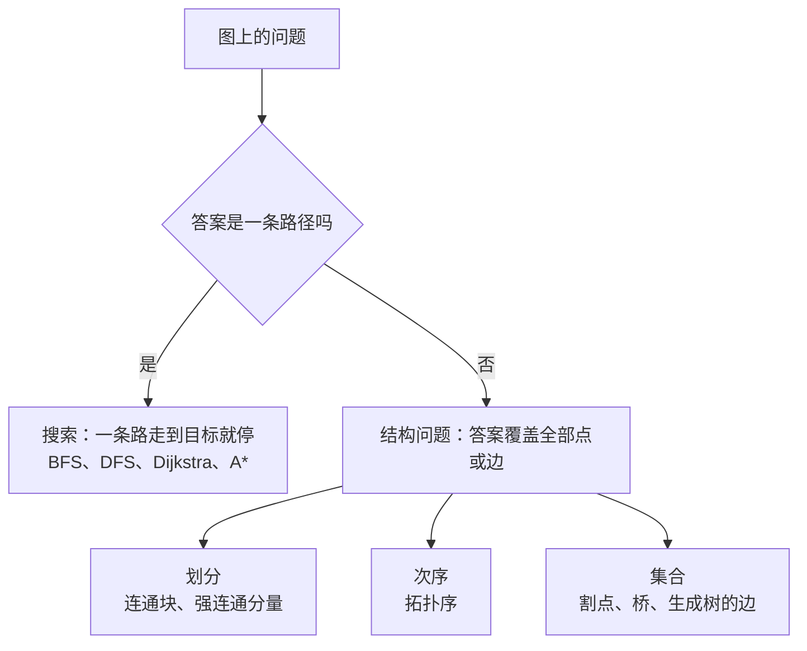
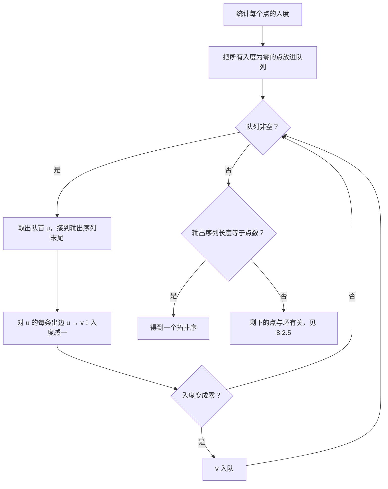
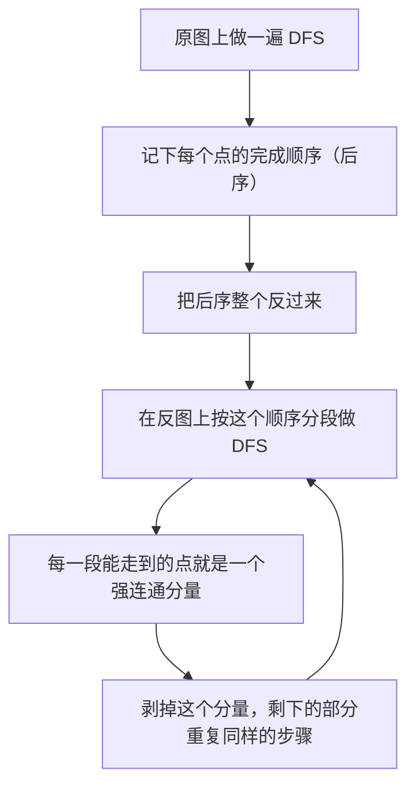

# 图上的结构性问题

> **授权**：本章节属教材文档部分，采用 [CC BY-NC-ND 4.0](../LICENSE)
> 加[附加条款](../许可附加条款.md)授权：署名、非商业、禁止演绎、不允许二次分发。
> 文中引用的代码不受此限，各自保留原有许可证，详见[版权与许可说明.md](../版权与许可说明.md)。

构建系统在编译之前要先决定顺序，网络运维要知道哪一条链路断掉会把一片机房分成两半，
布线工程要在站点之间铺出一套总长最短的线。这三件事问的都不是「从 A 到 B 怎么走」，
而是「整张关系网是什么形状」。搜索回答的是前一个问题，答案是一条路径；
这里回答的是后一个问题，答案换成了另外三种东西：一个划分、一个次序，或者一个集合。

答案的形状变了，做法的形状也跟着变。路径问题只要从一个点出发往外走，碰到目标就可以停；
结构问题必须把整张图看完，而且在看的过程中要记下额外的账——每个点第几个被访问到、
它的子树能不能绕回更早的地方、每条边在候选里排第几。本章的四个算法，
全部内容就是这笔账怎么记、记完之后从里面读出什么。

还有一条线索贯穿全章：结构问题的答案里，一部分取决于「从哪个点开始、按什么顺序走」——
分量的编号、具体的那一个拓扑序、具体的那一棵最小生成树，都会因此改变；
另一部分由问题本身决定——分量的个数、割点与桥究竟是哪几个、生成树的总权重。
本章的四组实测核对的全是后一类量，正文也把两类量分开写。

---

> **约定**：标注以行内代码单独成行——`实测数据` 表示实际执行验证过，复现命令随程序给出；
> `文档` 表示引自标准草案或官方资料；`待确认` 表示尚未验证。
> 路径占位符（如 `<MinGW>`、`<工作区>`）的含义见《README.md》。
> 复杂度一律写成 `O(...)`，它表示随规模增长的量级，不表示具体快慢。
> 本章节实测环境是 Windows 11 + g++ 16.2.0（MinGW-w64），`-O2` 优化。

# 本章节定位

| 需要先知道 | 在哪 |
|---|---|
| 图的三种存法：邻接矩阵、邻接表、边表 | 《09-高阶数据结构/A-10-图：关系怎么存.md》第 2 节 |
| 边表与「成对加边」的编号约定 | 《09-高阶数据结构/A-10-图：关系怎么存.md》第 4 节 |
| 并查集：父指针、按大小合并、路径压缩 | 《09-高阶数据结构/A-12-不相交集合：只要连通性.md》第 2 节 |
| 并查集的摊还代价 | 《09-高阶数据结构/A-12-不相交集合：只要连通性.md》第 3 节 |
| 堆与 `priority_queue` 的接口 | 《09-高阶数据结构/A-05-后进先出、先进先出与优先级：stack、queue 与堆.md》第 4 节 |
| 数组、下标与地址的关系 | 《04-语法/08-数组、指针与引用.md》第 2.1 节 |
| lambda 与比较器怎么传 | 《05-类与面向对象/10-lambda 与函数对象.md》第 5 节 |
| 缓存行与访问局部性 | 《06-更底层/02-对齐、填充与缓存.md》第 3 节 |
| `-O2` 会删掉没人读的计算 | 《03-构建工具链/05-优化等级.md》第 5.2 节 |
| 深度优先与广度优先的遍历 | 《08-一些散落的算法/07-搜索：在状态空间里找路.md》 |

**相邻的章节**：本章节是 `08-一些散落的算法` 板块的第 `08` 章。
它前面是第 `07` 章（搜索：在状态空间里找路），讲的是路径问题；后面是第 `09` 章（贪心与动态规划）。
板块的篇目表与边界划分见《08-一些散落的算法/README.md》章节。
与 `09-高阶数据结构` 的分工只有一条：**图的三种存法与并查集在 `A-10` 与 `A-12` 讲，
本章只讲算法**，凡是用到它们的地方给一句指路，不重复结构本身。

| 本章各节 | 讲什么 |
|---|---|
| 第 8.1 节 | 路径问题与结构问题的分野：结构问题的答案是划分、次序还是集合，答案里哪些量与起点有关 |
| 第 8.2 节 | 拓扑排序：入度法与 DFS 逆后序法，两种顺序为什么不唯一，有环时剩下的点是什么 |
| 第 8.3 节 | 强连通分量：Kosaraju 的两遍 DFS 与 Tarjan 的一遍 DFS，缩点之后得到有向无环图 |
| 第 8.4 节 | 割点与桥：`low` 的定义、两条判据、根要另判，以及与暴力法的逐项核对 |
| 第 8.5 节 | 最小生成树：Kruskal 与 Prim 各适合什么图，稀疏与稠密两组实测对照 |

---

# 第 8.1 节 路径问题与结构问题的分野

## 8.1.1 同一个关系网，四种问法

模块依赖图是本章的统一素材。下面这张图有四个模块，箭头表示依赖方向：
`ui` 依赖 `net`，`net` 与 `session` 互相依赖，`session` 依赖 `db`。

`Text`

```text
   ┌─────┐
   │ ui  │
   └──┬──┘
      │
      ▼
   ┌─────┐
   │ net │◀──────┐
   └──┬──┘       │
      │          │
      ▼          │
   ┌─────────┐   │
   │ session │───┘
   └────┬────┘
        │
        ▼
     ┌─────┐
     │ db  │
     └─────┘
```

同一个关系网上可以问出好几类问题，答案的形状完全不同：

| 问法 | 答案的形态 | 答案里有多少东西 | 在哪一节 |
|---|---|---|---|
| 从 `ui` 到 `db` 怎么走 | 一条路径 | 路径上的点数 | 搜索一章（《08-一些散落的算法/07-搜索：在状态空间里找路.md》） |
| 哪几个模块互相依赖成一团 | 一个划分 | 每个点各属哪一块 | 第 8.3 节 |
| 谁必须先构建 | 一个次序 | 全部点各排在第几位 | 第 8.2 节 |
| 哪条依赖断了会分成两块 | 一个集合 | 集合里有几条边 | 第 8.4 节 |
| 要连通全部站点且总长最短（带权图） | 一个集合 | V − 1 条边 | 第 8.5 节 |

前两问的答案短得可以写在信封背面，后三问的答案要覆盖整张图：
次序里含全部的点，桥可能一条都没有、也可能有几十条。
答案的长短直接决定了做法：路径问题在走到 `db` 的那一刻就能停下，
另外三问必须把每条边都看一遍，看完之前谁也不知道答案是什么样。

## 8.1.2 结构问题的答案有三种形状

**划分**把点分成互不相交的几块，每块有明确的共同性质，合起来正好是全部的点。
无向图的连通块、有向图的强连通分量都是划分。**次序**把全部点排成一行，
满足一组「谁在谁前」的约束；拓扑序是这一类。**集合**从边里挑出一个子集，
挑法的依据有两种：必要性（不取它就不行，例如桥）与最优性（取这些边总权重最小，例如最小生成树）。

| 形状 | 例子 | 一般唯一吗 | 会随「从哪开始走」变化的是 |
|---|---|---|---|
| 划分 | 连通块、强连通分量 | 划分本身唯一 | 分量编号 |
| 次序 | 拓扑序 | 一般不唯一 | 整条序列 |
| 集合 | 桥、割点 | 集合唯一 | 没有（集合本身就是答案） |
| 集合 | 最小生成树的边 | 边集可以不唯一 | 选了哪些等权的边；总权重不变 |

最后一列是本章核对数据的依据。程序里凡是要比较两次运行结果的量，
都取与起点、编号、并列时的挑选无关的那一个：划分比块数与各块的大小，
次序比「每条边是否都朝前」，集合比元素个数与总权重。
第 8.2 节的实测里，两种拓扑排序逐位不同却都合法，正是因为「整条序列」属于会变的那一类。

## 8.1.3 遍历留下的记录，结构算法接着用

路径问题与结构问题共用同一个骨架：从某个点出发，沿边走，每个点只访问一次，代价 `O(V+E)`。
两者的区别在遍历过程中记下了什么。搜索只记「每个点从哪来」，拿到父指针就能拼出一条路径；
结构算法要记的账多三种：

| 记下什么 | 从它读出什么 | 用在 |
|---|---|---|
| 每个点的入度 | 还有哪些点没有前置 | 第 8.2 节 |
| 完成顺序（后序） | 反过来就是拓扑序；最晚完成的点属于缩点图里的源分量 | 第 8.2、8.3 节 |
| `dfn` 与 `low` | 分量在哪个点截断；哪条边是桥；哪个点是割点 | 第 8.3、8.4 节 |
| 边权排序加并查集 | 这条边能不能收进生成树 | 第 8.5 节 |

`Mermaid`



这四种算法里只有三种建立在一次 DFS 之上。最小生成树是例外：它要按边权决定先看哪条边，
因此第一步是排序而不是遍历；强连通分量的 Kosaraju 写法要走两遍图。
一次遍历是常见的地基，不是唯一的地基。

> [!NOTE]
> 这一节把问题分了类：**路径问题的答案是一条路径，可以在到达目标时停下；
> 结构问题的答案是一个划分、一个次序或一个集合，必须把整张图看完。**
> **结构问题的答案里，编号、具体的序、并列时的挑选会随遍历起点变化，
> 而分量个数、割点与桥是哪几个、总权重由问题本身决定**——
> 本章后面的四组实测核对的都是后者。

---

# 第 8.2 节 拓扑排序：入度法与 DFS 法

## 8.2.1 真实问题：谁必须先做

构建系统在开始编译之前要回答一件事：这些目标按什么顺序做。模块之间有依赖，
`net` 要用到 `db` 的头文件，那么 `db` 必须先于 `net`。课程先修、头文件包含、
安装脚本里的步骤，都是同一个形状的问题。

把要做的事写成有向图的点，把「必须先做」写成边，方向约定为**先做的指向后做的**：
`db` 必须先于 `net`，就连一条 `db → net`。要输出的是一个点的序列，
使每条边 `u → v` 都满足 `u` 排在 `v` 前。这样的序列叫拓扑序。

> [!WARNING]
> **边的方向约定必须在建图那一处写清楚。** 依赖关系最常见的说法是「`net` 依赖 `db`」，
> 照字面连成 `net → db`，拓扑序会把整个顺序反过来，而程序不会报错——
> 它给出的仍然是一个合法的拓扑序，只是相对这份需求全错了。
> 工程上的对策是让建图只在一个函数里做，并在那里写一句注释说明边的方向。

拓扑序存在的条件是图里没有环：`a` 必须先于 `b`、`b` 又必须先于 `a`，两条无法同时满足。
有环时无解，这时要做的是把环找出来给人看，而不是随便给出一个顺序。

## 8.2.2 入度法：从没有前置的点开始

一个点的**入度**是「指向它的边的条数」，也就是它有几个前置。入度为零的点没有前置，
可以立刻做。做完它之后，它指向的那些点的前置少了一个：把这些点的入度减一，
减到零的也可以做了。重复这个过程，取出的顺序就是一个拓扑序。

`Mermaid`



正确性来自一句话：一个点被取出时，它所有的前置都已经取出——入度减到零就是这件事的证据，
因此取出的顺序满足每一条边。反过来，无环图里只要还有没取出的点，剩下的部分就一定存在
入度为零的点，队列不会在排完之前空掉。

实现上有两处细节。入度数组在过程中会被修改，因此要复制一份再动它；本节程序把入度按值传进函数，
改的是副本。队列里一开始要把**所有**入度为零的点都放进去，只放一个的话，
其余入度为零的点永远不会进队，程序会把一张无环图判成有环。

代价是 `O(V+E)`：每个点进出队列一次，每条边在它的起点被取出时看一次。

## 8.2.3 DFS 逆后序法

深度优先遍历从一个点出发，沿一条路走到底，走不动了再回头。一个点的**完成时刻**是
它的全部后代都访问完之后。把完成顺序记下来得到的序列叫后序，把后序整个反过来，
无环时就是一个拓扑序。

为什么成立：对任意一条边 `u → v`，在无环图上的 DFS 里只有两种可能。
第一种，扫到这条边时 `v` 还没被访问，于是 `v` 成为 `u` 的后代，`v` 先完成、`u` 后完成，
逆序里 `u` 在 `v` 前。第二种，扫到这条边时 `v` 已经完成，那么 `v` 的完成时刻早于 `u`，
逆序里同样是 `u` 在 `v` 前。第三种可能——扫到这条边时 `v` 还在栈上——在无环图里不会出现：
`v` 还在栈上意味着 `v` 到 `u` 有一条树上的路径，加上 `u → v` 就构成一个环。

这句话同时给出了判环的办法：DFS 过程中撞上一条指向栈上点的边，图里就有环，
输出这条边的两端就能指出环的位置。

> [!CAUTION]
> **在长链上写递归版 DFS，程序会崩在栈溢出上，而不是给出一个错误答案。**
> 本章实测的图里有一条两百万个点连成的链，递归深度等于链长；每层至少要一个栈帧，
> 按本机 g++ 16.2.0 在 `-O2` 下生成的代码算是几十字节，两百万层合起来是几十 MB。
> 而按程序首行注释里的命令链接出来的可执行文件，PE 头里申请的栈只有 2 MiB
> （`SizeOfStackReserve`，从产物头部读出来的值）。溢出发生时程序直接终止，没有可捕获的错误。
> 本节与第 8.3 节的两个程序都把深度搬到堆上：用一个显式栈，每个栈帧记「点」与
> 「下一条还没走的边」。写法比递归长，但每条边仍然只扫一次，代价与递归版相同。

## 8.2.4 两种顺序在同一张图上的实测

下面这份程序在同一张有向无环图上跑两种写法，各自计时一次，并把两种序列逐边验一遍：
每条边都必须从序列的前面指向后面。

`C++`

```cpp
/* topo_two_ways.cpp    编译：g++ -std=c++17 -O2 topo_two_ways.cpp -o topo_two_ways
 * 同一张有向无环图，用入度法（Kahn）与 DFS 逆后序法各求一次拓扑序：
 * 两边都验一遍「每条边都朝前」，并各计时一次。 */
#include <algorithm>
#include <chrono>
#include <cstdio>
#include <queue>
#include <random>
#include <vector>

using Clock = std::chrono::steady_clock;

// 建图：N 个点，每个点连向后继里随机的三个点，因此天然无环
static void build(int N, int fanout, unsigned seed,
                  std::vector<int>& head, std::vector<int>& nxt, std::vector<int>& to,
                  std::vector<int>& indeg) {
    std::mt19937 rng(seed);
    head.assign(N, -1);
    indeg.assign(N, 0);
    nxt.clear();
    to.clear();
    for (int u = 0; u < N; ++u) {
        for (int k = 1; k <= fanout; ++k) {
            const int v = u + 1 + static_cast<int>(rng() % static_cast<unsigned>(k * 7));
            if (v >= N) continue;
            to.push_back(v);
            nxt.push_back(head[u]);
            head[u] = static_cast<int>(to.size()) - 1;
            ++indeg[v];
        }
    }
}

// 入度法：每次取出入度为 0 的点，把它出边指向的点入度减一
static std::vector<int> topo_kahn(int N, const std::vector<int>& head,
                                  const std::vector<int>& nxt, const std::vector<int>& to,
                                  std::vector<int> indeg) {
    std::vector<int> order;
    order.reserve(N);
    std::queue<int> q;
    for (int i = 0; i < N; ++i)
        if (indeg[i] == 0) q.push(i);
    while (!q.empty()) {
        const int u = q.front();
        q.pop();
        order.push_back(u);
        for (int e = head[u]; e != -1; e = nxt[e])
            if (--indeg[to[e]] == 0) q.push(to[e]);
    }
    return order;
}

// DFS 法：递归会爆栈，这里用显式栈做后序遍历，最后整体反转
static std::vector<int> topo_dfs(int N, const std::vector<int>& head,
                                 const std::vector<int>& nxt, const std::vector<int>& to) {
    std::vector<char> done(N, 0);
    std::vector<int> post;
    post.reserve(N);
    std::vector<std::pair<int, int>> st;   // (点, 下一条要走的边)
    for (int s = 0; s < N; ++s) {
        if (done[s]) continue;
        st.clear();
        st.push_back({s, head[s]});
        done[s] = 1;
        while (!st.empty()) {
            auto& top = st.back();
            if (top.second == -1) {
                post.push_back(top.first);
                st.pop_back();
                continue;
            }
            const int e = top.second;
            top.second = nxt[e];
            const int v = to[e];
            if (!done[v]) {
                done[v] = 1;
                st.push_back({v, head[v]});
            }
        }
    }
    std::reverse(post.begin(), post.end());
    return post;
}

// 验拓扑序：每条边都必须从前面指向后面
static long long check_order(int N, const std::vector<int>& head, const std::vector<int>& nxt,
                             const std::vector<int>& to, const std::vector<int>& order,
                             bool& ok) {
    std::vector<int> pos(N, -1);
    for (int i = 0; i < static_cast<int>(order.size()); ++i) pos[order[i]] = i;
    long long checked = 0;
    ok = order.size() == static_cast<size_t>(N);
    for (int u = 0; u < N && ok; ++u)
        for (int e = head[u]; e != -1; e = nxt[e]) {
            ++checked;
            if (pos[u] >= pos[to[e]]) { ok = false; break; }
        }
    return checked;
}

int main() {
    struct Case { int N, fanout; };
    const Case cases[] = {{200000, 3}, {2000000, 3}};

    for (const Case& c : cases) {
        std::vector<int> head, nxt, to, indeg;
        build(c.N, c.fanout, 20261002u, head, nxt, to, indeg);
        const long long E = static_cast<long long>(to.size());
        std::printf("== N=%d，E=%lld ==\n", c.N, E);

        std::vector<int> kahn, dfs;
        double t_kahn = 0, t_dfs = 0;
        const int rounds = c.N <= 200000 ? 5 : 1;   // 规模翻十倍，轮数反比降下来
        for (int r = 0; r < rounds; ++r) {
            auto t0 = Clock::now();
            kahn = topo_kahn(c.N, head, nxt, to, indeg);
            auto t1 = Clock::now();
            dfs = topo_dfs(c.N, head, nxt, to);
            auto t2 = Clock::now();
            t_kahn += std::chrono::duration<double, std::milli>(t1 - t0).count();
            t_dfs += std::chrono::duration<double, std::milli>(t2 - t1).count();
        }
        t_kahn /= rounds;
        t_dfs /= rounds;

        bool ok1 = false, ok2 = false;
        const long long e1 = check_order(c.N, head, nxt, to, kahn, ok1);
        const long long e2 = check_order(c.N, head, nxt, to, dfs, ok2);

        std::printf("  入度法：长度 %zu，检查 %lld 条边，%s，%.3f ms\n", kahn.size(), e1,
                    ok1 ? "合法" : "不合法", t_kahn);
        std::printf("  DFS 法：长度 %zu，检查 %lld 条边，%s，%.3f ms\n", dfs.size(), e2,
                    ok2 ? "合法" : "不合法", t_dfs);
        std::printf("  两种顺序是否逐位相同：%s\n", kahn == dfs ? "是" : "否");
        std::printf("  入度法前 8 个点：");
        for (int i = 0; i < 8; ++i) std::printf(" %d", kahn[i]);
        std::printf("\n  DFS 法前 8 个点：");
        for (int i = 0; i < 8; ++i) std::printf(" %d", dfs[i]);
        std::printf("\n");
        // 防止优化器把上面的结果整段删掉
        asm volatile("" : : "r"(&kahn), "r"(&dfs) : "memory");
    }
    return 0;
}
```

`实测数据`
`Text`

```text
== N=200000，E=599974 ==
  入度法：长度 200000，检查 599974 条边，合法，3.090 ms
  DFS 法：长度 200000，检查 599974 条边，合法，3.187 ms
  两种顺序是否逐位相同：否
  入度法前 8 个点： 0 10 33 55 82 135 149 171
  DFS 法前 8 个点： 199993 199962 199893 199889 199875 199879 199864 199863
== N=2000000，E=5999979 ==
  入度法：长度 2000000，检查 5999979 条边，合法，34.834 ms
  DFS 法：长度 2000000，检查 5999979 条边，合法，53.342 ms
  两种顺序是否逐位相同：否
  入度法前 8 个点： 0 10 33 55 82 135 149 171
  DFS 法前 8 个点： 1999985 1999973 1999962 1999959 1999964 1999925 1999921 1999908
```

图是随机构造的：编号在前的点连向编号在后的点，每个点三条出边，落点在后继里随机取，
因此天然无环。N=200000 时边数是 599974，N=2000000 时是 5999979。

前六行是 N=200000 的结果。**结构量**有两处：两种写法输出的序列长度都等于点数 200000，
逐边检查的边数都等于边数 599974，每一行都判为合法；而「两种顺序是否逐位相同」这一行是 `否`。
入度法的前八个点是 `0 10 33 55 82 135 149 171`，
DFS 法给出的前八个点从链的深处开始（`199993` 打头）。两个序列都满足每条边朝前，
但不是同一个序列——这正是 8.1.2 里那一行「次序一般不唯一」的具体样子。

差别来自推进方式。这张图只有点 0 的入度为零，入度法从点 0 开始按队列顺序一层层往外推；
DFS 法先沿一条路走到链尾，链尾最早完成，逆序之后它排在最前面。
两个规模上入度法的前八个点逐位相同，因为建图用的是同一个种子与同一套规则，
小图恰好是大图的前缀。

**计时量**在这一档落在 3.090 到 3.187 ms 之间；N 放大十倍之后，两种写法落在
34.834 到 53.342 ms 之间。DFS 法稍慢，因为它的栈帧要同时保存点与边的下标，
入度法的队列只保存点。计时量每次重跑都会浮动，块里是其中一次的输出；
贴着时钟分辨率的行（微秒以下）不进块，这一批里最小的一行是 3.090 ms。

结果不会被优化器删掉：长度、检查的边数、合法性与两种序列的前八个点都进了打印，
程序另外用一行 `asm volatile("" : : "r"(&kahn), "r"(&dfs) : "memory")` 把两个序列的地址
交给编译器，`-O2` 下不会把整段计算删掉。

## 8.2.5 有环时剩下的点

入度法还有一个用处：判环。输出序列的长度小于点数，图里就有环。
剩下来的点一定包含全部环上的点，但不止这些——这些点能到达的点也出不去。

`Text`

```text
   ┌───┐         ┌───┐
   │ A │────────▶│ B │
   └───┘         └─┬─┘
     ▲             │
     └─────────────┘
                   │
                   ▼
                 ┌───┐
                 │ C │
                 └───┘
```

这张图的边是 `A → B`、`B → A`、`B → C`。三个点的入度分别是 1、1、1，
因此队列一开始就是空的，输出序列为空，剩下来的是 `A`、`B`、`C` 三个点。
环上只有 `A` 与 `B`；`C` 只是从环上能到达的点，它自己不在任何环上。
`C` 的入度永远降不到零，因为指向它的那条边 `B → C` 的起点 `B` 从来没有被取出。

工程上的差别很实在：循环依赖的报错要指出「哪几个模块互相依赖」，只报「有环」，
或者把下游模块一起列进去，都会让读报错的人多花时间找。要精确取出环上的点，
用第 8.3 节的强连通分量：**环上的点恰好是所在强连通分量大小大于一（或者自己有一条自环）的那些点**。

> [!NOTE]
> 这一节收成三句话：
> **入度为零的点没有前置，做完它就把后继的入度减一，减到零的接上，取出的顺序就是拓扑序；
> DFS 的后序反过来也是拓扑序，两种做法给出的序列一般不逐位相同，但都合法；
> 有环时输出长度小于点数，剩下的点包含环上的点与它们能到达的点，要精确指出环，用强连通分量。**

---

# 第 8.3 节 强连通分量：Kosaraju 与 Tarjan

## 8.3.1 真实问题：互相依赖的一组模块

模块依赖里出现 `a → b → c → a` 时，这三个模块实际上是一个整体：改其中任何一个，
另外两个都要跟着重新编译，它们内部谁先谁后对外没有影响。构建系统面对这种情形的做法是
先把它们合成一个单元，再在单元之间排顺序。

**强连通**的定义是两个方向都有路：`u` 到 `v` 有路径，`v` 到 `u` 也有路径。
「互相可达」满足自反、对称、传递三条，因此它把点分成若干块：
块内任意两点互相可达，块与块之间不互相可达。这些块叫**强连通分量**。

两个极端可以先摆在眼前：完全没有环的图，每个点自己是一个分量，分量数等于点数；
整张图强连通的图只有一个分量。**缩点**是把每个分量用一个代表点替换，
分量之间的边接起来（同一对分量之间的多条边只留一条），得到的图一定是有向无环图——
如果两个新点互相可达，那两块本来就在同一个分量里。

无向图上的「在不在一伙」用并查集（《09-高阶数据结构/A-12-不相交集合：只要连通性.md》第 2 节）。
有向图上的互相可达不能这么办：并查集把一条边当成「两边合成一伙」的凭据，
而强连通要求两个方向都有路，一条边只给出一个方向。

## 8.3.2 Kosaraju：原图后序与反图染色

第一遍在原图上做 DFS，记下每个点的完成顺序（后序）。第二遍把后序整个反过来，
在**反图**上分段做 DFS：每次从一个还没被标记的点出发，能走到的那些还没被标记的点
就是一个分量。反图是把每条边 `u → v` 换成 `v → u` 得到的图。

关键事实只有一条：缩点图是有向无环图，若分量 `D` 能到达分量 `C`（`D ≠ C`），
则 `D` 里最晚完成的点比 `C` 里最晚完成的点更晚完成——沿缩点图的路径往下看，
每跨一条边，完成时刻都更早。于是按完成时刻从大到小处理时，能到达某个点 `s` 的点
所属的分量都排在 `s` 所在分量的前面，早已被标记过。第二遍在反图上从 `s` 出发，
走得到的正是原图里能到达 `s` 的点；其中还没被标记的那些，正好是 `s` 所在分量里的点。
剥掉这个分量之后，剩下的部分重复同样的论证。

`Mermaid`



代价是两遍 DFS 的 `O(V+E)`，外加一张反图（边数与内存翻倍）。
程序里的 `add` 一次往两张图各加一条边，保证两边永远一致。

## 8.3.3 Tarjan：`dfn` 与 `low` 在回溯时截断

Tarjan 只用一遍 DFS。除了访问序号 `dfn`，它给每个点再记一个 `low`：
`low[u]` 是 `u` 与它的后代，不经过已经确定的分量，能追溯到的最早的 `dfn`。
更新分两处：扫到边 `u → v`，若 `v` 还没访问，先递归下去，回来之后用 `low[v]` 更新 `low[u]`；
若 `v` 已经访问并且还在栈上，用 `dfn[v]` 更新 `low[u]`。

判据：一个点的边都走完之后，如果 `low[u] == dfn[u]`，那么 `u` 是它所在分量在 DFS 树里
最靠上的点，把栈里 `u` 及其上面的点全部弹出，就得到一个分量。理由是两边不能互相到达：
栈里比 `u` 更早入栈的点都能沿树边到达 `u`，而 `u` 到不了它们——否则 `low[u]` 会小于 `dfn[u]`。

求强连通分量的 `low` 与第 8.4 节求割点的 `low` 只差一处限制：已经出栈的点属于已经确定的分量，
不能再用来更新 `low`，因此这里只认「还在栈上」的点（程序里的 `onstk`）。
无向图上求割点时不需要这条限制，因为无向图的 DFS 里没有横叉边，
已访问的点要么是祖先、要么是后代。

实现上仍然用显式栈，栈帧里存「点」与「下一条还没走的边」，因此每条边只扫一次；
每个点入栈时置 `onstk`，弹栈时清掉。

## 8.3.4 两种写法在同一张图上的实测

下面这份程序在同一张有向图上跑两种写法，核对三个与分量编号无关的量：
分量个数、最大分量的大小、各分量大小的平方和。

`C++`

```cpp
/* scc_two_ways.cpp    编译：g++ -std=c++17 -O2 scc_two_ways.cpp -o scc_two_ways
 * 同一张有向图，Kosaraju（两遍 DFS）与 Tarjan（一遍 DFS）各求一次强连通分量：
 * 分量个数、最大分量、以及一个与编号无关的校验和必须逐位相同，并各计时一次。 */
#include <algorithm>
#include <chrono>
#include <cstdio>
#include <random>
#include <vector>

using Clock = std::chrono::steady_clock;

struct Graph {
    std::vector<int> head, nxt, to;
    void init(int N) {
        head.assign(N, -1);
        nxt.clear();
        to.clear();
    }
    void add(int u, int v) {
        to.push_back(v);
        nxt.push_back(head[u]);
        head[u] = static_cast<int>(to.size()) - 1;
    }
};

// 后序遍历：显式栈，避免递归在长链上爆栈
static void post_order(const Graph& g, int N, std::vector<int>& post) {
    std::vector<char> done(N, 0);
    std::vector<std::pair<int, int>> st;   // (点, 下一条要走的边)
    for (int s = 0; s < N; ++s) {
        if (done[s]) continue;
        st.clear();
        st.push_back({s, g.head[s]});
        done[s] = 1;
        while (!st.empty()) {
            auto& top = st.back();
            if (top.second == -1) {
                post.push_back(top.first);
                st.pop_back();
                continue;
            }
            const int e = top.second;
            top.second = g.nxt[e];
            const int v = g.to[e];
            if (!done[v]) {
                done[v] = 1;
                st.push_back({v, g.head[v]});
            }
        }
    }
}

// Kosaraju：原图求后序，按后序的逆序在反图上做 DFS，每次染一个分量
static int kosaraju(const Graph& g, const Graph& rg, int N, std::vector<int>& comp) {
    std::vector<int> post;
    post.reserve(N);
    post_order(g, N, post);
    comp.assign(N, -1);
    int nc = 0;
    std::vector<int> st;
    for (int i = N - 1; i >= 0; --i) {
        const int s = post[i];
        if (comp[s] != -1) continue;
        st.clear();
        st.push_back(s);
        comp[s] = nc;
        while (!st.empty()) {
            const int u = st.back();
            st.pop_back();
            for (int e = rg.head[u]; e != -1; e = rg.nxt[e])
                if (comp[rg.to[e]] == -1) {
                    comp[rg.to[e]] = nc;
                    st.push_back(rg.to[e]);
                }
        }
        ++nc;
    }
    return nc;
}

// Tarjan：一遍 DFS，靠 dfn/low 在回溯时弹栈。
// 栈帧里存「下一条还没走的边」，这样每条边只扫一次。
static int tarjan(const Graph& g, int N, std::vector<int>& comp) {
    std::vector<int> dfn(N, 0), low(N, 0);
    std::vector<char> onstk(N, 0);
    std::vector<int> stk;
    std::vector<std::pair<int, int>> call;   // (点, 下一条要走的边)
    comp.assign(N, -1);
    int timer = 0, nc = 0;
    for (int s = 0; s < N; ++s) {
        if (dfn[s]) continue;
        dfn[s] = low[s] = ++timer;
        stk.push_back(s);
        onstk[s] = 1;
        call.clear();
        call.push_back({s, g.head[s]});
        while (!call.empty()) {
            auto& top = call.back();
            const int u = top.first;
            if (top.second != -1) {
                const int e = top.second;
                top.second = g.nxt[e];
                const int v = g.to[e];
                if (!dfn[v]) {
                    dfn[v] = low[v] = ++timer;
                    stk.push_back(v);
                    onstk[v] = 1;
                    call.push_back({v, g.head[v]});
                } else if (onstk[v]) {
                    low[u] = std::min(low[u], dfn[v]);
                }
                continue;
            }
            // u 的边都走完了，回溯
            call.pop_back();
            if (!call.empty()) {
                const int p = call.back().first;
                low[p] = std::min(low[p], low[u]);
            }
            if (low[u] == dfn[u]) {
                for (;;) {
                    const int w = stk.back();
                    stk.pop_back();
                    onstk[w] = 0;
                    comp[w] = nc;
                    if (w == u) break;
                }
                ++nc;
            }
        }
    }
    return nc;
}

// 与分量编号无关的校验：各分量大小的平方和
static long long size_checksum(const std::vector<int>& comp, int nc) {
    std::vector<long long> cnt(nc, 0);
    for (int c : comp) ++cnt[c];
    long long s = 0;
    for (long long x : cnt) s += x * x;
    return s;
}

int main() {
    struct Case { int N, extra; };
    const Case cases[] = {{200000, 200000}, {2000000, 2000000}};

    for (const Case& c : cases) {
        Graph g, rg;
        g.init(c.N);
        rg.init(c.N);
        std::mt19937 rng(20261002u);
        // 主干：i → i+1，整张图一开始就是一条长链
        for (int i = 0; i + 1 < c.N; ++i) {
            g.add(i, i + 1);
            rg.add(i + 1, i);
        }
        // 回边：u 连回前面 1 到 5 步之内的点，于是主干上出现一串小环
        for (int k = 0; k < c.extra / 2; ++k) {
            const int u = static_cast<int>(rng() % static_cast<unsigned>(c.N));
            const int v = u - 1 - static_cast<int>(rng() % 5u);
            if (v < 0) continue;
            g.add(u, v);
            rg.add(v, u);
        }
        // 跨段的随机边，一律朝前，不制造新的环
        for (int k = 0; k < c.extra / 2; ++k) {
            const int u = static_cast<int>(rng() % static_cast<unsigned>(c.N));
            const int v = std::min(c.N - 1, u + 1 + static_cast<int>(rng() % 1000u));
            g.add(u, v);
            rg.add(v, u);
        }
        const long long E = static_cast<long long>(g.to.size());
        std::printf("== N=%d，E=%lld ==\n", c.N, E);

        std::vector<int> c1, c2;
        double t1 = 0, t2 = 0;
        const int rounds = c.N <= 200000 ? 5 : 1;   // 规模翻十倍，轮数反比降下来
        int n1 = 0, n2 = 0;
        for (int r = 0; r < rounds; ++r) {
            auto a0 = Clock::now();
            n1 = kosaraju(g, rg, c.N, c1);
            auto a1 = Clock::now();
            n2 = tarjan(g, c.N, c2);
            auto a2 = Clock::now();
            t1 += std::chrono::duration<double, std::milli>(a1 - a0).count();
            t2 += std::chrono::duration<double, std::milli>(a2 - a1).count();
        }
        t1 /= rounds;
        t2 /= rounds;

        const long long s1 = size_checksum(c1, n1);
        const long long s2 = size_checksum(c2, n2);
        long long big1 = 0, big2 = 0;
        {
            std::vector<long long> a(n1, 0), b(n2, 0);
            for (int x : c1) ++a[x];
            for (int x : c2) ++b[x];
            for (long long x : a) big1 = std::max(big1, x);
            for (long long x : b) big2 = std::max(big2, x);
        }
        std::printf("  Kosaraju：分量数 %d，最大分量 %lld，大小平方和 %lld，%.3f ms\n", n1, big1,
                    s1, t1);
        std::printf("  Tarjan  ：分量数 %d，最大分量 %lld，大小平方和 %lld，%.3f ms\n", n2, big2,
                    s2, t2);
        std::printf("  三项是否逐位相同：%s\n",
                    (n1 == n2 && s1 == s2 && big1 == big2) ? "是" : "否");
        asm volatile("" : : "r"(&c1), "r"(&c2) : "memory");
    }
    return 0;
}
```

`实测数据`
`Text`

```text
== N=200000，E=399999 ==
  Kosaraju：分量数 44365，最大分量 93，大小平方和 2806720，8.371 ms
  Tarjan  ：分量数 44365，最大分量 93，大小平方和 2806720，6.283 ms
  三项是否逐位相同：是
== N=2000000，E=3999997 ==
  Kosaraju：分量数 447363，最大分量 104，大小平方和 27842278，387.656 ms
  Tarjan  ：分量数 447363，最大分量 104，大小平方和 27842278，309.617 ms
  三项是否逐位相同：是
```

这张图是手工构造的：先铺一条主干链 `i → i+1`，再加两组随机边——一半是回边，
从 `u` 连回前面一到五步之内的点，制造一串小环；另一半向前跳最多一千步，不制造新的环。
N=200000 时边数 399999，N=2000000 时边数 3999997。

**结构量**在两档上都是「三项逐位相同」：N=200000 时两种写法都数出 44365 个分量、
最大分量 93、大小平方和 2806720；N=2000000 时三项是 447363、104、27842278。
两百万个点分成四十四万多个分量，说明大量点落在有环的分量里；
最大分量只有 104，是因为回边只连回五步以内，环的跨度有限。

程序不比较分量的编号。编号取决于遍历起点与弹栈时机，换一个起点或换一次邻接表的顺序就会变，
拿它去比较会把正确的结果判成错误。大小平方和与编号无关，而且对「分量有多大」比单纯的计数敏感；
它不是完整的指纹——不同的划分可能有同一个平方和——因此配上分量个数与最大分量一起用。

**计时量**在这一档落在 6.283 到 8.371 ms 之间；N 放大十倍之后落在 309.617 到 387.656 ms 之间。
两个规模上 Tarjan 都更快，约快四分之一到三分之一，因为它只需要一遍 DFS，也不维护反图。
计时量每次重跑都会浮动，块里是其中一次的输出。

结果不会被优化器删掉：分量个数、最大分量与平方和三项都进了打印，
程序另外用一行 `asm volatile("" : : "r"(&c1), "r"(&c2) : "memory")` 保住两个分量数组。

## 8.3.5 缩点之后得到一张有向无环图

`Text`

```text
   缩点前：A 与 B 互相可达，B 还能到 D

   ┌─────┐          ┌─────┐
   │  A  │─────────▶│  B  │
   └─────┘          └──┬──┘
     ▲                 │
     └─────────────────┘
                       │
                       ▼
                    ┌─────┐
                    │  D  │
                    └─────┘

   缩点后：{A, B} 与 {D} 各成一个点，边只剩一条

   ┌───────────┐          ┌─────┐
   │  {A, B}   │─────────▶│ {D} │
   └───────────┘          └─────┘
```

缩点之后分量之间不再有环，因此可以排拓扑序。构建系统处理循环依赖的两步就在这里：
先用强连通分量把环圈出来，每个分量当成一个构建单元，再在单元之间排顺序，
单元内部按任意顺序一起编译。缩点本身也是 `O(V+E)`：遍历每条边，把两端的分量编号接起来，
同一对分量之间的重复边去掉。

缩点图还能回答传播问题：从被改动的那几个分量出发，沿缩点图向下游遍历一次，
走到的分量都会受影响。缩点图无环，因此这次遍历不会绕回起点，也不必再判重复访问之外的事情。

## 8.3.6 两种写法的对照

| 项 | Kosaraju | Tarjan |
|---|---|---|
| DFS 遍数 | 两遍（原图一遍、反图一遍） | 一遍 |
| 反图 | 需要，边数与内存翻倍 | 不需要 |
| 额外状态 | 后序数组、分量数组 | `dfn`、`low`、栈、`onstk` |
| 实现难度 | 两个现成的 DFS 拼起来 | `low` 的更新位置容易写错 |
| 同一套遍历还能求什么 | 只有分量 | 同一套 `dfn`/`low` 稍改就是割点与桥（第 8.4 节） |
| 本机实测（N=200000） | 8.371 ms | 6.283 ms |
| 本机实测（N=2000000） | 387.656 ms | 309.617 ms |
| 什么场合选 | 图能装进内存、想少写代码 | 图大、内存紧，或者还要割点与桥 |

> [!NOTE]
> 这一节收成三句话：
> **强连通是「两个方向都有路」，它把点分成互不相交的块，缩点之后得到一张有向无环图；
> Kosaraju 用原图的后序在反图上染色，Tarjan 用一遍 DFS 加 `dfn`/`low` 在回溯时弹栈，
> 两种做法给出的划分相同，编号不同；**
> **比较两次运行的结果时，只能比较分量个数、最大分量、大小平方和这类与编号无关的量。**

---

# 第 8.4 节 割点与桥

## 8.4.1 真实问题：哪一条线断了会分区

网络运维关心两类位置：哪一条链路是唯一通路，断了就把一片机房分成两半；哪一台设备是咽喉，
挂了就让周围的机器彼此失联。把网络看成无向图，这两个问题分别对应**桥**（割边）与**割点**。

定义都建立在连通块数量上：删掉一条边之后连通块数量增加，这条边是桥；
删掉一个点以及它的全部边之后连通块数量增加，这个点是割点。

> [!WARNING]
> **判据是「连通块数量增加」，不是「图不连通」。** 图本身可能已经分成几块，
> 删掉一条边之后它仍然不连通，但那不是桥。本节暴力核对程序比较的正是
> 「删掉之后的连通块数是否超过不删时的数量」，而不是「是否大于一」。

一张没有桥的连通图叫 2-边连通，一个没有割点的连通图叫 2-点连通，两者不是一回事：
一条链上每条边都是桥，每个中间点都是割点；一个三角形三条边都不是桥，三个点也都不是割点。

## 8.4.2 `low` 的定义与两条判据

无向图的一遍 DFS 把边分成两类：**树边**（第一次访问一个点时走的那条）与
**回边**（指向已访问过、且不是父边的边）。给每个点记两个数：`dfn` 是它第几个被访问到，
`low[u]` 是 `u` 与它的后代，不经过 `u` 的父边，能追溯到的最早的 `dfn`（含 `u` 自己的）。

计算方式：初始化 `low[u] = dfn[u]`；扫到边 `u-v`，若 `v` 没访问过，`v` 就是 `u` 的孩子，
递归完之后用 `low[v]` 更新 `low[u]`；若 `v` 已经访问过且这条边不是父边，就用 `dfn[v]` 更新 `low[u]`。

| 判据（`p` 是父，`u` 是 DFS 树里的孩子） | 结论 | 含义 |
|---|---|---|
| `low[u] > dfn[p]` | 边 `p-u` 是桥 | `u` 的子树里没有任何回边能回到 `p` 或更早的点，只能靠这条边与外界相连 |
| `low[u] >= dfn[p]` | `p` 是割点 | `u` 的子树回不到 `p` 的祖先，删掉 `p` 之后它就跟祖先那一侧断开 |

两条判据只差一个等号。取等号时，`u` 的子树能回到 `p` 自己、但回不到更早的点，
于是边 `p-u` 不是桥（沿 `p` 还能绕出去），而 `p` 仍然是割点。

用一个小图把两条判据推演一次：

`Text`

```text
   图（无向）：0-1、0-2、1-2、1-3、3-4

        0
       ╱ ╲
      1───2
      │
      3
      │
      4

   以 0 为根的 DFS 树（0-2 是回边，不在树上）

        0     dfn=1  low=1
        │
        1     dfn=2  low=1
      ╱   ╲
     2     3  dfn=3  low=1     dfn=4  low=4
           │
           4  dfn=5  low=5
```

| 点 | `dfn` | `low` | 备注 |
|---|---|---|---|
| 0 | 1 | 1 | 根；DFS 树里只有一个孩子，不是割点 |
| 1 | 2 | 1 | 孩子 2 有回边连回 0，`low` 因此降到 1 |
| 2 | 3 | 1 | 回边 2-0 |
| 3 | 4 | 4 | 孩子 4 的 `low` 是 5，两条判据都命中 |
| 4 | 5 | 5 | 叶子 |

桥有两条：`1-3`（`low[3] = 4 > dfn[1] = 2`）与 `3-4`（`low[4] = 5 > dfn[3] = 4`）。
割点有两个：`1`（`low[3] = 4 >= dfn[1] = 2`）与 `3`（`low[4] = 5 >= dfn[3] = 4`）。
`0-1` 与 `1-2` 落在三角形上，两条判据都不命中。

## 8.4.3 根要另判

两条判据都用到了「父」`p`，根没有父边，判据对根不成立。根单独判：
**DFS 树里根的孩子数大于一时，根是割点。**

理由是孩子之间不可能有边：如果根的两个孩子之间有边，那么第二个孩子会被第一个孩子的 DFS
访问到，它就不会是根的孩子。因此删掉根之后，两棵子树彼此断开。反过来，
孩子数为一或零时，删掉根之后其余的点仍然由那条树边连在一起，不算割点。

程序里的写法是把判据加一个条件 `parent_edge[p] != -1`，把根排除在外；
遍历结束之后再单独补一遍 `parent_edge[u] == -1 && child_cnt[u] > 1`。
孤立点与只有一个点的图都不算割点，因为孩子数为零。

## 8.4.4 与暴力法的核对

下面这份程序用一遍 DFS 求出全部割点与桥，再用「删掉它数连通块」的暴力法逐个核对：
两种做法数出的个数必须逐位相同。

`C++`

```cpp
/* cut_and_bridge.cpp    编译：g++ -std=c++17 -O2 cut_and_bridge.cpp -o cut_and_bridge
 * 无向图上用一遍 DFS 求割点与桥（dfn/low），再用「删掉它看连通块多不多」的
 * 暴力法逐个核对：两边数出来的个数必须逐位相同。 */
#include <algorithm>
#include <chrono>
#include <cstdio>
#include <random>
#include <vector>

using Clock = std::chrono::steady_clock;

struct UGraph {
    std::vector<int> head, nxt, to;
    void init(int N) {
        head.assign(N, -1);
        nxt.clear();
        to.clear();
    }
    // 成对加边：正向在下标 2k，反向在 2k+1，于是 e ^ 1 就是它的反向边
    void add_pair(int u, int v) {
        to.push_back(v);
        nxt.push_back(head[u]);
        head[u] = static_cast<int>(to.size()) - 1;
        to.push_back(u);
        nxt.push_back(head[v]);
        head[v] = static_cast<int>(to.size()) - 1;
    }
};

// 一遍 DFS：回溯时 low[子] > dfn[父] 说明这条边是桥；
// low[子] >= dfn[父] 说明父是割点（根要另判：孩子数大于一）
static void tarjan_cut(const UGraph& g, int N, std::vector<char>& is_cut,
                       std::vector<char>& is_bridge, int& cut_cnt, int& bridge_cnt) {
    std::vector<int> dfn(N, 0), low(N, 0), parent_edge(N, -1), child_cnt(N, 0);
    std::vector<char> done(N, 0);
    is_cut.assign(N, 0);
    is_bridge.assign(g.to.size(), 0);
    int timer = 0;
    std::vector<std::pair<int, int>> st;   // (点, 下一条要走的边)
    for (int s = 0; s < N; ++s) {
        if (done[s]) continue;
        done[s] = 1;
        dfn[s] = low[s] = ++timer;
        st.clear();
        st.push_back({s, g.head[s]});
        while (!st.empty()) {
            auto& top = st.back();
            const int u = top.first;
            if (top.second != -1) {
                const int e = top.second;
                top.second = g.nxt[e];
                if (e == (parent_edge[u] ^ 1)) continue;   // 不走回父节点的那条边
                const int v = g.to[e];
                if (!done[v]) {
                    done[v] = 1;
                    dfn[v] = low[v] = ++timer;
                    parent_edge[v] = e;
                    ++child_cnt[u];
                    st.push_back({v, g.head[v]});
                } else if (dfn[v] < low[u]) {
                    low[u] = dfn[v];
                }
                continue;
            }
            st.pop_back();
            if (parent_edge[u] == -1) continue;            // 根没有父边
            const int p = g.to[parent_edge[u] ^ 1];
            if (low[u] < low[p]) low[p] = low[u];
            if (low[u] > dfn[p]) {                         // 桥
                is_bridge[parent_edge[u]] = 1;
                is_bridge[parent_edge[u] ^ 1] = 1;
            }
            if (low[u] >= dfn[p] && parent_edge[p] != -1) is_cut[p] = 1;
        }
    }
    for (int u = 0; u < N; ++u)
        if (parent_edge[u] == -1 && child_cnt[u] > 1) is_cut[u] = 1;
    cut_cnt = 0;
    bridge_cnt = 0;
    for (int u = 0; u < N; ++u)
        if (is_cut[u]) ++cut_cnt;
    for (std::size_t e = 0; e < g.to.size(); e += 2)
        if (is_bridge[e]) ++bridge_cnt;
}

// 暴力：删掉一个点之后数连通块；ban 为 -1 表示不删
static int components_without_vertex(const UGraph& g, int N, int ban) {
    std::vector<char> vis(N, 0);
    if (ban >= 0) vis[ban] = 1;
    int cnt = 0;
    std::vector<int> st;
    for (int s = 0; s < N; ++s) {
        if (vis[s]) continue;
        ++cnt;
        vis[s] = 1;
        st.clear();
        st.push_back(s);
        while (!st.empty()) {
            const int u = st.back();
            st.pop_back();
            for (int e = g.head[u]; e != -1; e = g.nxt[e])
                if (!vis[g.to[e]]) {
                    vis[g.to[e]] = 1;
                    st.push_back(g.to[e]);
                }
        }
    }
    return cnt;
}

// 暴力：删掉一条边（连同它的反向边）之后数连通块
static int components_without_edge(const UGraph& g, int N, int ban_edge) {
    std::vector<char> vis(N, 0);
    int cnt = 0;
    std::vector<int> st;
    for (int s = 0; s < N; ++s) {
        if (vis[s]) continue;
        ++cnt;
        vis[s] = 1;
        st.clear();
        st.push_back(s);
        while (!st.empty()) {
            const int u = st.back();
            st.pop_back();
            for (int e = g.head[u]; e != -1; e = g.nxt[e]) {
                if (e == ban_edge || e == (ban_edge ^ 1)) continue;
                if (!vis[g.to[e]]) {
                    vis[g.to[e]] = 1;
                    st.push_back(g.to[e]);
                }
            }
        }
    }
    return cnt;
}

int main() {
    const int N = 2000;
    UGraph g;
    g.init(N);
    std::mt19937 rng(20261002u);
    // 一串三角形，相邻两个之间只连一条边——这条就是桥
    for (int i = 0; i + 3 < N; i += 3) {
        g.add_pair(i, i + 1);
        g.add_pair(i + 1, i + 2);
        g.add_pair(i + 2, i + 3);
    }
    // 再撒一些边，让一部分桥不再是桥
    for (int k = 0; k < 300; ++k) {
        const int u = static_cast<int>(rng() % static_cast<unsigned>(N));
        const int v = static_cast<int>(rng() % static_cast<unsigned>(N));
        if (u != v) g.add_pair(u, v);
    }
    std::printf("== 点数 %d，边数 %lld ==\n", N, static_cast<long long>(g.to.size()) / 2);

    std::vector<char> is_cut, is_bridge;
    int cut_cnt = 0, bridge_cnt = 0;
    const auto t0 = Clock::now();
    tarjan_cut(g, N, is_cut, is_bridge, cut_cnt, bridge_cnt);
    const auto t1 = Clock::now();
    const double t_tarjan = std::chrono::duration<double, std::milli>(t1 - t0).count();

    const int base_comp = components_without_vertex(g, N, -1);
    int brute_cut = 0, brute_bridge = 0;
    const auto b0 = Clock::now();
    for (int v = 0; v < N; ++v)
        if (components_without_vertex(g, N, v) > base_comp) ++brute_cut;
    for (int e = 0; e < static_cast<int>(g.to.size()); e += 2)
        if (components_without_edge(g, N, e) > base_comp) ++brute_bridge;
    const auto b1 = Clock::now();
    const double t_brute = std::chrono::duration<double, std::milli>(b1 - b0).count();

    std::printf("  一遍 DFS：割点 %d 个，桥 %d 条，用时 %.3f ms\n", cut_cnt, bridge_cnt, t_tarjan);
    std::printf("  暴力核对：割点 %d 个，桥 %d 条，用时 %.3f ms\n", brute_cut, brute_bridge, t_brute);
    std::printf("  两次结果是否逐位相同：%s\n",
                (cut_cnt == brute_cut && bridge_cnt == brute_bridge) ? "是" : "否");
    std::printf("  割点里前 10 个：");
    int shown = 0;
    for (int v = 0; v < N && shown < 10; ++v)
        if (is_cut[v]) { std::printf(" %d", v); ++shown; }
    std::printf("\n");
    std::printf("  桥里前 10 条（按较小端点）：");
    shown = 0;
    for (int e = 0; e < static_cast<int>(g.to.size()) && shown < 10; e += 2)
        if (is_bridge[e]) {
            const int a = g.to[e ^ 1], b = g.to[e];
            std::printf(" %d-%d", std::min(a, b), std::max(a, b));
            ++shown;
        }
    std::printf("\n");
    return 0;
}
```

`实测数据`
`Text`

```text
== 点数 2000，边数 2298 ==
  一遍 DFS：割点 13 个，桥 13 条，用时 0.046 ms
  暴力核对：割点 13 个，桥 13 条，用时 42.391 ms
  两次结果是否逐位相同：是
  割点里前 10 个： 1 2 3 4 5 1955 1991 1992 1993 1994
  桥里前 10 条（按较小端点）： 0-1 1-2 2-3 3-4 4-5 1991-1992 1992-1993 1993-1994 1994-1995 1995-1996
```

这张图的构造方式：先连一条长链，再撒 300 条随机弦。源码里那段建边的注释写的是
「一串三角形」，实际每次连出的三条边是 `(i, i+1)`、`(i+1, i+2)`、`(i+2, i+3)`，
合起来是一条从 0 到 1998 的链——本节按边表描述这张图，源码不改。
链边 666 轮乘 3 是 1998 条，加上 300 条随机边正好 2298 条，与打印的边数吻合。

**结构量**有两处一致：一遍 DFS 数出割点 13 个、桥 13 条，暴力法逐个删点删边数连通块，
得到同样的 13 与 13，两次结果逐位相同。桥就是链上没被随机弦盖住的边，
前五条是 `0-1`、`1-2`、`2-3`、`3-4`、`4-5`；割点的前五个是 1 到 5。
链头 0 不是割点——删掉它之后剩下的点仍然连在一起；删掉 1 会把 0 单独分出去。

**计时量**是 0.046 ms 对 42.391 ms，相差约 920 倍。这个倍数由算法的量级决定：
按点核对是 `O(V(V+E))`，按边核对是 `O(E(V+E))`，而一遍 DFS 是 `O(V+E)`，
规模越大差距越大。计时量每次重跑都会浮动，块里是其中一次的输出；
暴力法那一行的耗时不为零，说明它确实跑完了，而两个计数都进了打印，
因此结果不会被优化器删掉。

> [!WARNING]
> **跳过父边时要用边的编号，不能用父节点的编号。** 两点之间可以有两条平行的边：
> 用节点编号跳过，两条都会被跳掉，这条边就会被误判成桥；用边编号跳过
> （程序里成对加边，`e ^ 1` 就是它的反向边），第二条平行边会被当成回边，
> `low` 因此降下来，判定正确。自环对连通性没有作用，程序在建图时直接跳过 `u == v`
> 的随机边，成对加边的编号约定也才成立。

## 8.4.5 割点与桥是图的属性

割点集合与桥集合不随遍历起点变化：它们是图本身的属性，DFS 只是把它们读出来的手段。
这一点与第 8.3 节的分量编号正好相反，也是本节用两套完全不同的办法（一遍 DFS 与暴力法）
得到同一组数字的原因。工程上据此可以放心缓存这类结果：只要图没变，答案就不会变。

> [!NOTE]
> 这一节收成三句话：
> **`low` 记的是子树能绕回的最早时间戳，`low[子] > dfn[父]` 说明这条边是桥，
> `low[子] >= dfn[父]` 说明父是割点，两条判据只差一个等号；**
> **根没有父边，要按「DFS 树里孩子数大于一」单独判定；**
> **割点与桥是图的属性，与遍历起点无关，因此可以用暴力法逐个删点删边来核对。**

---

# 第 8.5 节 最小生成树：Kruskal 与 Prim

## 8.5.1 真实问题：铺线

一片站点之间要铺线，要求任意两个站点都能通信（直接连或者经过别的站点），
并且线的总长度最短。把站点看成点、可铺线的路线看成带权的边，
答案是边的一个子集：连通全部点、不含环、恰好 V − 1 条边，并且总权重最小。

连通、无环、含全部点、恰好 V − 1 条边，这四个条件在连通图上等价：
任意三条成立就推出第四条。满足它们的子图叫**生成树**，总权重最小的那一棵叫**最小生成树**。

图不连通时不存在生成树，得到的是每一片各自的最小生成树，
算法本身不用改（Kruskal 天然给出这个结果，Prim 需要对每个没访问过的点重新起一次）。
最小生成树的**总权重唯一，边集不唯一**：两条权重相同的边可以互换，
本节程序因此只比较总权重。

## 8.5.2 Kruskal：按边权从小到大收

Kruskal 的做法直白：把全部边按权重从小到大排序，一条条看过去，
若这条边的两端已经在同一片里就跳过，否则收下它并把两片合成一片。收满 V − 1 条就可以停。

「两端在不在同一片」用并查集判。模型、按大小合并与路径压缩的做法在
《09-高阶数据结构/A-12-不相交集合：只要连通性.md》第 2 节与第 3 节，
这里只用它的两个操作：查代表元、合并两片。

正确性来自**切分性质**：任意把点分成两半，横跨这两半的边里权重最小的那条，
一定属于某一棵最小生成树。用交换论证看清楚：假设某棵最小生成树不含它，把它加进去会形成一个环，
环上必有一条横跨同一切分的边，权重不小于它；把那条边换成它，总权重不增加，
得到的仍然是一棵最小生成树。Kruskal 每收一条边，收的正是「已经连成的片」与「其余点」
这个切分上的最小边。

代价里排序是主导项，并查集那一头可以忽略。标准对排序的代价有明确承诺：

`文档`

> "Complexity: O(N logN) comparisons, where N = last - first."
>
> —— N4659 §28.7.1.1/3

程序里的 `std::sort(edges.begin(), edges.end(), ...)` 用的就是这条承诺，
因此 Kruskal 的代价写成 `O(E log E)`。

## 8.5.3 Prim：从一棵树往外长

Prim 换一个角度：先任选一个点当树，之后每轮做一件事——在所有「一端在树里、
另一端在树外」的边里挑权重最小的那条，把它连的那个点拉进树。重复 V − 1 轮。

每一轮面对的切分是「树内的点」与「树外的点」，由切分性质，这一轮选的边一定能扩展成
某棵最小生成树；起点选哪个都不影响总权重。两种实现对应两种图：

- **朴素版**用一个数组记「每个树外的点到树的最小边权」，每轮扫一遍所有点找最小值，
  再用刚拉进来的点更新一遍。两重循环都是 V 次，代价 `O(V²)`，与边数无关，
  适合稠密图与邻接矩阵。
- **堆版**把候选边放进 `priority_queue`
  （《09-高阶数据结构/A-05-后进先出、先进先出与优先级：stack、queue 与堆.md》第 4 节），
  每轮取堆顶。注意堆里的元素会过期：一个点被拉进树之后，堆里还留着它更早的候选，
  程序里用 `in[u]` 跳过这些过期项。这种做法叫延迟删除，它避开了「可减小键的堆」，
  代价是每次松弛都往里压一个元素，堆里元素的数量与边数同阶，因此代价写成 `O(E log E)`。

## 8.5.4 稀疏图与稠密图上的实测

下面这份程序在稀疏图与稠密图上各求一次最小生成树：Kruskal 与堆版 Prim 各一次，
稠密图再加一个朴素 `O(V²)` 的 Prim 作对照。三种写法的总权重必须逐位相同。

`C++`

```cpp
/* mst_two_ways.cpp    编译：g++ -std=c++17 -O2 mst_two_ways.cpp -o mst_two_ways
 * 稀疏图与稠密图上各求一次最小生成树：Kruskal（边表排序 + 并查集）
 * 与 Prim（堆版）各一次，稠密图再加一个朴素 O(V²) 的 Prim 作对照。
 * 三种写法的总权重必须逐位相同。 */
#include <algorithm>
#include <chrono>
#include <cstdio>
#include <queue>
#include <random>
#include <vector>

using Clock = std::chrono::steady_clock;

struct Edge { int u, v, w; };

// 并查集：路径减半 + 按大小合并
struct DSU {
    std::vector<int> p, sz;
    void init(int n) {
        p.resize(n);
        sz.assign(n, 1);
        for (int i = 0; i < n; ++i) p[i] = i;
    }
    int find(int x) {
        while (p[x] != x) {
            p[x] = p[p[x]];
            x = p[x];
        }
        return x;
    }
    bool unite(int a, int b) {
        a = find(a);
        b = find(b);
        if (a == b) return false;
        if (sz[a] < sz[b]) std::swap(a, b);
        p[b] = a;
        sz[a] += sz[b];
        return true;
    }
};

static long long kruskal(int N, std::vector<Edge> edges, long long& picked) {
    std::sort(edges.begin(), edges.end(),
              [](const Edge& a, const Edge& b) { return a.w < b.w; });
    DSU d;
    d.init(N);
    long long total = 0;
    picked = 0;
    for (const Edge& e : edges)
        if (d.unite(e.u, e.v)) {
            total += e.w;
            ++picked;
        }
    return total;
}

// 堆版 Prim：邻接表 + priority_queue
static long long prim_heap(int N, const std::vector<int>& head, const std::vector<int>& nxt,
                           const std::vector<int>& to, const std::vector<int>& wt,
                           long long& picked) {
    const long long INF = (1LL << 62);
    std::vector<long long> dist(N, INF);
    std::vector<char> in(N, 0);
    using P = std::pair<long long, int>;
    std::priority_queue<P, std::vector<P>, std::greater<P>> pq;
    long long total = 0;
    picked = -1;                       // 起点不花边，最后减掉
    dist[0] = 0;
    pq.push({0, 0});
    while (!pq.empty()) {
        const auto [d, u] = pq.top();
        pq.pop();
        if (in[u]) continue;
        in[u] = 1;
        total += d;
        ++picked;
        for (int e = head[u]; e != -1; e = nxt[e]) {
            const int v = to[e];
            if (!in[v] && wt[e] < dist[v]) {
                dist[v] = wt[e];
                pq.push({dist[v], v});
            }
        }
    }
    return total;
}

// 朴素 Prim：每轮扫一遍所有点找最近的那个，O(V²)
static long long prim_dense(int N, const std::vector<std::vector<int>>& w, long long& picked) {
    const int INF = 1 << 30;
    std::vector<int> dist(N, INF);
    std::vector<char> in(N, 0);
    long long total = 0;
    picked = -1;                       // 起点不花边，最后减掉
    dist[0] = 0;
    for (int it = 0; it < N; ++it) {
        int best = -1;
        for (int v = 0; v < N; ++v)
            if (!in[v] && (best == -1 || dist[v] < dist[best])) best = v;
        in[best] = 1;
        total += dist[best];
        ++picked;
        for (int v = 0; v < N; ++v)
            if (!in[v] && w[best][v] < dist[v]) dist[v] = w[best][v];
    }
    return total;
}

int main() {
    std::mt19937 rng(20261002u);

    // ---- 稀疏图：点多边少 ----
    {
        const int N = 200000;
        const int M = 600000;                       // 平均度数 6
        std::vector<Edge> edges;
        edges.reserve(M + N);
        std::vector<int> head(N, -1), nxt, to, wt;
        nxt.reserve(2 * (M + N));
        to.reserve(2 * (M + N));
        wt.reserve(2 * (M + N));
        auto add = [&](int u, int v, int w) {
            to.push_back(v); wt.push_back(w); nxt.push_back(head[u]);
            head[u] = static_cast<int>(to.size()) - 1;
            to.push_back(u); wt.push_back(w); nxt.push_back(head[v]);
            head[v] = static_cast<int>(to.size()) - 1;
            edges.push_back({u, v, w});
        };
        for (int i = 0; i + 1 < N; ++i) add(i, i + 1, 1 + static_cast<int>(rng() % 1000));
        for (int k = 0; k < M; ++k) {
            const int u = static_cast<int>(rng() % static_cast<unsigned>(N));
            const int v = static_cast<int>(rng() % static_cast<unsigned>(N));
            if (u != v) add(u, v, 1 + static_cast<int>(rng() % 1000));
        }
        const long long E = static_cast<long long>(edges.size());
        long long p1 = 0, p2 = 0;
        auto t0 = Clock::now();
        const long long w1 = kruskal(N, edges, p1);
        auto t1 = Clock::now();
        const long long w2 = prim_heap(N, head, nxt, to, wt, p2);
        auto t2 = Clock::now();
        std::printf("== 稀疏图：N=%d，E=%lld ==\n", N, E);
        std::printf("  Kruskal：总权重 %lld，用掉 %lld 条边，%.3f ms\n", w1, p1,
                    std::chrono::duration<double, std::milli>(t1 - t0).count());
        std::printf("  Prim（堆）：总权重 %lld，用掉 %lld 条边，%.3f ms\n", w2, p2,
                    std::chrono::duration<double, std::milli>(t2 - t1).count());
        std::printf("  总权重是否逐位相同：%s\n", w1 == w2 ? "是" : "否");
    }

    // ---- 稠密图：点少边多 ----
    {
        const int N = 1000;
        std::vector<Edge> edges;
        edges.reserve(static_cast<std::size_t>(N) * (N - 1) / 2);
        std::vector<std::vector<int>> w(N, std::vector<int>(N, 1 << 30));
        std::vector<int> head(N, -1), nxt, to, wt;
        auto add = [&](int u, int v, int ww) {
            to.push_back(v); wt.push_back(ww); nxt.push_back(head[u]);
            head[u] = static_cast<int>(to.size()) - 1;
            to.push_back(u); wt.push_back(ww); nxt.push_back(head[v]);
            head[v] = static_cast<int>(to.size()) - 1;
            edges.push_back({u, v, ww});
            w[u][v] = w[v][u] = ww;
        };
        for (int u = 0; u < N; ++u)
            for (int v = u + 1; v < N; ++v) add(u, v, 1 + static_cast<int>(rng() % 1000));
        const long long E = static_cast<long long>(edges.size());
        long long p1 = 0, p2 = 0, p3 = 0;
        auto t0 = Clock::now();
        const long long w1 = kruskal(N, edges, p1);
        auto t1 = Clock::now();
        const long long w2 = prim_heap(N, head, nxt, to, wt, p2);
        auto t2 = Clock::now();
        const long long w3 = prim_dense(N, w, p3);
        auto t3 = Clock::now();
        std::printf("== 稠密图：N=%d，E=%lld ==\n", N, E);
        std::printf("  Kruskal：总权重 %lld，用掉 %lld 条边，%.3f ms\n", w1, p1,
                    std::chrono::duration<double, std::milli>(t1 - t0).count());
        std::printf("  Prim（堆）：总权重 %lld，用掉 %lld 条边，%.3f ms\n", w2, p2,
                    std::chrono::duration<double, std::milli>(t2 - t1).count());
        std::printf("  Prim（朴素 O(V²)）：总权重 %lld，用掉 %lld 条边，%.3f ms\n", w3, p3,
                    std::chrono::duration<double, std::milli>(t3 - t2).count());
        std::printf("  三个总权重是否逐位相同：%s\n", (w1 == w2 && w2 == w3) ? "是" : "否");
    }
    return 0;
}
```

`实测数据`
`Text`

```text
== 稀疏图：N=200000，E=799998 ==
  Kruskal：总权重 29401078，用掉 199999 条边，32.334 ms
  Prim（堆）：总权重 29401078，用掉 199999 条边，246.080 ms
  总权重是否逐位相同：是
== 稠密图：N=1000，E=499500 ==
  Kruskal：总权重 1737，用掉 999 条边，17.516 ms
  Prim（堆）：总权重 1737，用掉 999 条边，26.628 ms
  Prim（朴素 O(V²)）：总权重 1737，用掉 999 条边，1.590 ms
  三个总权重是否逐位相同：是
```

稀疏图打算加的是 199999 条链边与 600000 条随机边，随机边里有一条两端相同、
被程序跳过，因此边数是 799998，与打印一致；N=200000、E=799998 相当于平均每个点
连八个方向。稠密图 N=1000，任意两点之间都有一条边，E=499500。

**结构量**在两档上都一致：稀疏图上两种写法的总权重都是 29401078，
稠密图上三种写法都是 1737；用掉的边数分别是 199999 与 999，都等于 N − 1，
说明收到的确实是一棵生成树。程序只比较总权重，不比较边集——等权的边存在时，
不同的最小生成树可以选不同的边，拿边集去比较会得到假的不一致。

**计时量**在稀疏图上从 32.334 到 246.080 ms：Kruskal 只排一遍边表，之后并查集几乎线性；
堆版 Prim 在每次松弛时都可能压堆，近一百六十万个方向都要经过堆，
堆操作是对数级并且每次访问的位置跳跃，因此慢了约 7.6 倍。
稠密图上三种写法从 1.590 到 26.628 ms，顺序反过来：稠密图的边数是 `V²/2` 量级，
排序 499500 条边本身就要十几毫秒，而朴素 Prim 只做 `V² = 10⁶` 次顺序扫描，
并查集与堆都不用，因此最快，比 Kruskal 快约 11 倍、比堆版快约 17 倍。
计时量每次重跑都会浮动，块里是其中一次的输出。

结果不会被优化器删掉：三个总权重与用掉的边数都进了打印，编译器不能把它们删掉，
这里不需要额外的 `asm` 屏障。

## 8.5.5 什么时候用哪一个

| 条件 | Kruskal | Prim（堆） | Prim（朴素） |
|---|---|---|---|
| 稀疏图（E 与 V 同阶） | **更好**，只排一遍边表 | 可以用，常数更大 | 不可用，与 E 无关的 `O(V²)` |
| 稠密图（E 接近 `V²/2`） | 排序太贵 | 堆里元素太多 | **更好**，只需顺序扫描 |
| 图用邻接矩阵给出 | 要先摊成边表 | 要邻接表 | **直接可用** |
| 内存紧张、E 很大 | 边表本身占内存 | **堆与邻接表都不大** | 矩阵占 `V²` |
| 图可能不连通 | **天然给出最小生成森林** | 每个分量重新起一次 | 同样要重新起 |
| 要求按权重顺序输出选中的边 | **直接给出** | 要另外记录 | 要另外记录 |

一句便于记住的分界：**边少的时候按边推进（Kruskal），点少边多的时候按点推进（Prim）。**

> [!NOTE]
> 这一节收成三句话：
> **最小生成树的边集可以不唯一，总权重唯一，因此核对时只比较总权重；
> Kruskal 按边权从小到大收边，用并查集判环，代价由排序主导；
> Prim 从一棵树往外长，朴素版 `O(V²)` 适合稠密图，堆版 `O(E log E)` 适合稀疏图，
> 两者的选择只看边数与点数的相对大小。**

---

# 术语表

| 术语 | 含义 |
|---|---|
| **路径问题** | 答案是从一个点到另一个点的一条路径；走到目标就能停下 |
| **结构问题** | 答案是覆盖全图的划分、次序或集合；必须把整张图看完 |
| **划分** | 把点分成互不相交的几块，合起来正好是全部的点 |
| **拓扑序** | 有向图的一个点序列，每条边都从序列的前面指向后面 |
| **入度** | 指向一个点的边的条数，也就是它有几个前置 |
| **后序** | DFS 中一个点的全部后代都完成之后，才把它记下来的顺序 |
| **逆后序** | 后序反过来；无环时它就是拓扑序 |
| **强连通** | 两个点互相都有路径可达 |
| **强连通分量** | 极大的强连通点集；把每个分量缩成一个点后必为有向无环图 |
| **缩点** | 用代表点替换每个强连通分量，去掉分量内部的边 |
| **`dfn`** | 一个点第一次被访问到的序号 |
| **`low`** | 一个点及其后代能追溯到的最早的 `dfn` |
| **树边** | DFS 中第一次访问一个点时走过的那条边 |
| **回边** | 指向已经访问过的点、且不是父边的边 |
| **桥（割边）** | 删掉它之后连通块数量增加的边 |
| **割点** | 删掉它以及它的边之后连通块数量增加的点 |
| **生成树** | 连通、无环、含全部点、恰好 V − 1 条边的子图 |
| **最小生成树** | 总权重最小的生成树；边集可以不唯一，总权重唯一 |
| **切分性质** | 任意一次切割上权重最小的边，总在某一棵最小生成树里 |
| **延迟删除** | 堆里留着过期的元素，取出时跳过；用它换掉可减小键的堆 |

# 附录 A 复现本章节实测

**环境**：Windows 11，g++ 16.2.0（MinGW-w64）。
所有程序的编译命令都是 `g++ -std=c++17 -O2 <源文件> -o <可执行文件>`，
程序首行注释里也写了同一条命令。

| 本章节的数字 | 程序 | 在哪一小节 |
|---|---|---|
| 两种拓扑排序的长度、逐边检查、耗时与两个序列的前八个点 | `topo_two_ways.cpp` | 第 8.2.4 小节 |
| 两种强连通分量算法的三个不变量与耗时 | `scc_two_ways.cpp` | 第 8.3.4 小节 |
| 割点与桥的一遍 DFS 与暴力核对 | `cut_and_bridge.cpp` | 第 8.4.4 小节 |
| 稀疏图与稠密图上三种最小生成树写法 | `mst_two_ways.cpp` | 第 8.5.4 小节 |

**几点复现说明**：

- 上表的程序按顺序运行，块里各项相加约 1.2 秒（重复轮数按程序里的设定计入：
  两份程序在 N=200000 一档跑 5 轮）；建图与校验的开销另计；
- 结构量（序列长度、检查的边数、分量数、最大分量、大小平方和、割点数、桥数、
  总权重、用掉的边数）重跑逐位相同；
- 计时量每次重跑都会浮动，正文引用的是其中一次的输出；
- 贴着时钟分辨率的行不进 `实测数据` 块：本批数据里最小的一行是 0.046 ms，
  仍在时钟分辨率之上两个数量级；
- 四个程序的结果都不会被优化器删掉：两份拓扑与强连通的程序另加了
  `asm volatile("" : : "r"(&容器) : "memory")` 屏障，割点与最小生成树的程序
  把计数与总权重打印出来。

`待确认`

正文里的计时量只来自本机这一次输出，没有做多次重跑的统计。
可以确定的是量级关系：稀疏图上 Kruskal 明显快于堆版 Prim（本机这一批相差约 7.6 倍），
稠密图上朴素 Prim 明显快于另外两者（比 Kruskal 快约 11 倍、比堆版快约 17 倍），
Tarjan 比 Kosaraju 快四分之一到三分之一，暴力核对比一遍 DFS 慢约 920 倍。
**方向稳定，倍数不稳定**；换机器、换编译器、换标准库，请以自己重跑的结果为准。
