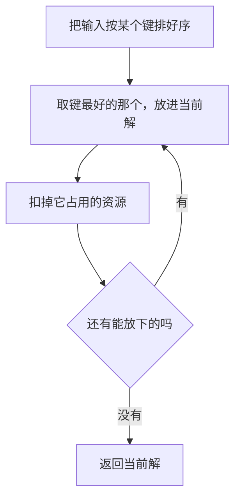
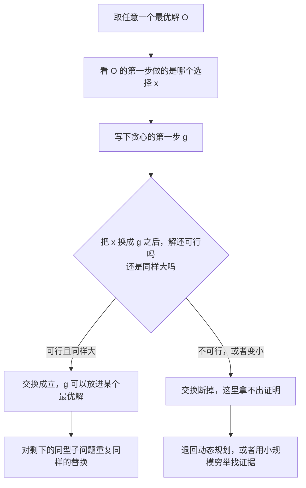

# 贪心与动态规划

> **授权**：本章节属教材文档部分，采用 [CC BY-NC-ND 4.0](../LICENSE)
> 加[附加条款](../许可附加条款.md)授权：署名、非商业、禁止演绎、不允许二次分发。
> 文中引用的代码不受此限，各自保留原有许可证，详见[版权与许可说明.md](../版权与许可说明.md)。

同一道题可以有很多解法，贪心与动态规划是最容易混起来的两条：两者都一步一步
做决定，都不做完整的搜索。差别在于贪心做完一步就不再回头，
动态规划把每一步的每一种可能都记下来，最后从记录里挑出最好的那一条。
两条路的代价差得很远：贪心通常只有十来行，花的时间是排序的时间；
动态规划要建表，表的格子数就是状态数乘每个状态的取值个数，规模一大就装不下。

代价低不构成理由。贪心只在能证明的时候才是对的，而它的证明方式只有一种：
指出一处交换——把任意一个最优解的第一步换成贪心的选择，解不会变差。
找零的面额若是 1 5 10 25，这一步拿最大的那枚不会让后面吃亏；换成 1 3 4 就会，
而且错得看不出来：程序不崩、不报错，只是多用了硬币。
0/1 背包上这套「每次拿最划算的」思路一定错，错得最狠的一次只拿到最优的一半。

分岔点在于「这一步的选择会不会影响后面」。指得出那处交换，就该用贪心，
它的代价几乎可以忽略；指不出来，动态规划是那条有保证的路，
代价是时间与内存，而且这两项都可以算清楚、测出来。
在同一批题上，贪心的边界与动态规划的账单都能落到具体数字上。

---

> **约定**：标注以行内代码单独成行——`实测数据` 表示实际执行验证过，
> 复现命令随程序给出；`文档` 表示引自标准草案或官方资料；`待确认` 表示尚未验证。
> 路径占位符（如 `<MinGW>`、`<工作区>`）的含义见《README.md》。
> 复杂度一律写成 `O(...)`，它表示**随规模增长的量级**，不表示具体快慢。
> 本章节实测环境是 Windows 11 + g++ 16.2.0（MinGW-w64），`-O2` 优化。

# 本章节定位

| 需要先知道 | 在哪 |
|---|---|
| 数组、下标与地址的关系 | 《04-语法/08-数组、指针与引用.md》第 2.1 节 |
| `for` 的三件事与嵌套循环的次数 | 《04-语法/06-控制流语句.md》第 3.5 节 |
| 比较函数与 lambda | 《05-类与面向对象/10-lambda 与函数对象.md》第 5 节 |
| `std::vector` 的容量与扩容 | 《09-高阶数据结构/A-01-连续存储：array 与 vector.md》第 3 节 |
| 缓存行与访问局部性 | 《06-更底层/02-对齐、填充与缓存.md》第 3 节 |
| 死代码消除：只算不用的结果会被删掉 | 《03-构建工具链/05-优化等级.md》第 5.3 节 |
| 有符号溢出是未定义行为 | 《07-标准库/B-05-数值.md》第 1.5 节 |

**相邻的章节**：本章节是 `08-一些散落的算法` 板块里讲「策略」的一章，
位置在《04-查找：从线性到索引.md》之后。它前面的两章
《08-一些散落的算法/01-递归：把问题交给自己.md》与
《08-一些散落的算法/02-记忆化、分治与回溯.md》是这里的预备：
记忆化递归与本章节的动态规划是同一个问题的两种求解方向，
一个自顶向下带着缓存往下问，一个自底向上把表填满，
第 3 节会把两者放在同一道题上对照。

数据结构一侧，把中间结果留下来反复使用的思路另有落点：
前缀和与稀疏表见《09-高阶数据结构/A-11-区间查询：前缀和、差分与稀疏表.md》第 2 节，
那是状态比本章节简单得多的一类表。本章节只讲「这一步怎么决定」，
容器的接口、堆与图的实现留给 `09-高阶数据结构` 板块。

| 本章各节 | 讲什么 |
|---|---|
| 第 1 节 | 贪心成立的条件：存在一个最优解，它的第一步就是贪心那一步 |
| 第 2 节 | 三组反例：找零上有时对、有时错，0/1 背包上一定错，以及反例的构造 |
| 第 3 节 | 最长上升子序列的三种状态定义，以及 `tails` 数组为什么不是一个子序列 |
| 第 4 节 | 0/1 背包上贪心与动态规划的并排对照：随机实例上的 100.0% 与构造反例上的 50.2% |
| 第 5 节 | 二维表与一维滚动数组的格子数与字节数，以及容量为什么必须倒着走 |

---

# 第 1 节 贪心的成立条件（交换论证的直觉版）

## 1.1 贪心的定义：每一步取当下最优，且不回头

贪心是一类写法的统称，它有三个共同点：每一步只用当下已经确定的信息做决定；
做出之后不再修改；不保留备选方案。排序键怎么定是这类写法唯一需要设计的地方，
剩下的部分就是一遍扫描。

`Mermaid`



图里没有回退的那条边。这一步不回退，正是贪心便宜的原因，
也是它可能出错的全部来源：**当下看起来最好的那一个，未必属于某个最优解。**
「看起来最好」与「全局最好」之间没有天然的桥，桥就是交换论证。

## 1.2 活动选择：把最优解的第一步换掉

活动选择的问题是这样：有一批活动，每个活动占一段时间，从开始到结束，
要选出尽可能多互不重叠的活动。

| 活动 | 开始 | 结束 |
|---|---|---|
| A | 1 | 4 |
| B | 3 | 5 |
| C | 0 | 6 |
| D | 5 | 7 |
| E | 3 | 9 |
| F | 5 | 9 |
| G | 6 | 10 |
| H | 8 | 11 |
| I | 8 | 12 |
| J | 2 | 14 |
| K | 12 | 16 |

按结束时间从早到晚排序，得到 A、B、C、D、E、F、G、H、I、J、K。
贪心的规则是「每次取结束时间最早、且与已选活动不重叠的那一个」，
一遍扫描选出的是 A、D、H、K，共四个。

同一条规则下，求解过程只有一遍：

`Text`

```text
   已选       结束时间   下一个可选的起点   入选的是
   （空）     —          0                  A（结束 4）
   A          4          4                  D（结束 7）
   A D        7          7                  H（结束 11）
   A D H      11         11                 K（结束 16）
```

要证明这条规则对，就得把「任意一个最优解的第一步」换成 A。
设 `O` 是任意一个最优解，`x` 是 `O` 里结束最早的那个活动，一步一步换：

1. A 是全表里结束最早的，因此 `结束(A) = 4 ≤ 结束(x)`；
2. `O` 里除 `x` 以外的活动都与 `x` 相容，它们的开始时间不早于 `结束(x)`，
   而 `结束(x) ≥ 结束(A)`，因此它们与 A 也相容；
3. 于是把 `O` 里的 `x` 换成 A，得到一个同样大、依然可行的解 `O'`，
   而 `O'` 的第一步就是贪心那一步；
4. 剩下要解的问题是「在开始时间不早于 4 的活动里选最多」，
   与原来的问题形式相同、规模更小，把上面三步重来一遍即可。

第 1、2 两句是整个证明里唯一需要推敲的地方：**先找出贪心的选择为什么不会与
最优解的其它部分冲突，再说明换完之后剩下的问题还是同一道题。**

> [!IMPORTANT]
> **贪心成立的条件可以写成一句话：存在一个最优解，它的第一步就做了贪心那一步。**
> 这句话成立，后面每一步都能照同样的方式换下去；这句话不成立，
> 贪心给出来的就只是一个「看着合理」的答案。

## 1.3 交换要证的两句话

把上面四步拆开，需要证的是两句话，缺一不可。

| 要证什么 | 活动选择里对应哪一句 | 0/1 背包里为什么断掉 |
|---|---|---|
| 贪心的选择本身可行 | A 与已选活动不冲突（第一步时集合是空的） | 这一句通常成立：性价比最高的那件往往放得下 |
| 换掉之后剩下的部分不变差 | 剩下的活动与 A 相容，剩余问题同型 | 换掉之后剩余容量变小，剩下问题的最优值跟着变小 |

第一句几乎总是成立，出错的地方在第二句。贪心拿走一份资源之后，
后面能拿的东西变少了；如果这处「变少」恰好把最优解挤掉，交换就走不通。
找零的反例（第 2 节）与 0/1 背包的反例都断在这一句上：
换了之后剩下的问题仍是同一道题，但它的最优值变差了。

`Mermaid`



## 1.4 找不到交换不等于贪心一定错

交换论证是「证明贪心对」的手段，不是「判定贪心错」的手段。
找不到那处交换，只能说这个写法没有被证明；它可能对，也可能错，
而这两种情况在代码里看不出区别。生产代码里遇到这种情况只有两条路：
换成有保证的算法，或者用穷举在小规模上扫一遍，把扫过的范围写清楚。
扫过一遍没出错是证据，不是证明——第 4 节会看到，
随机实例上贪心连续两档都拿到最优，换一组构造出来的输入就掉到一半。

> [!TIP]
> 想用贪心之前，先写下它的排序键，再问一句：把最优解里第一步的那个选择换成
> 贪心的选择，会挤掉谁。答得出就写下去，答不出就换一条路。

> [!NOTE]
> 第 1 节收成三句话：**贪心 = 每一步取当下最优、且不回头**；
> **它成立的条件是存在一个最优解的第一步就做了贪心那一步，
> 证明的办法是把任意最优解的第一步换掉、说明解不变差**；
> **交换断掉的地方几乎总在第二句——贪心拿走的资源让剩下的问题变差了。**

---

# 第 2 节 贪心会错的反例

## 2.1 找零：同一套规则，面额一换就错

找零的问题是：给一组面额，凑出一个金额，要求枚数最少。
贪心的规则是「每次拿不超过余额的最大面额」。这条规则在一部分面额集合上给出最优解，
在另一部分上不是，而两边的代码一个字都不用改。

面额 `1 5 10 25` 凑 63，贪心的账是这样：63 拿 25 剩 38，再拿 25 剩 13，
13 拿 10 剩 3，剩下的用三个 1 补上，一共 6 枚。这套面额里每个较大的面额
都能用更小的面额填得整齐，拿大面额不会把余额落到「只能用一堆 1 去凑」的境地。

面额 `1 3 4` 凑 6 就不同了：贪心先拿 4，剩 2，而 2 只能用两个 1 凑，
一共 3 枚；最优解是两个 3，只要 2 枚。把最优解的第一步换成贪心的选择，
剩下的余额从 3 变成 2，**剩下的问题还是同一道题，但它的最优值从 1 枚涨到了 2 枚**，
交换在第二句话上断掉（第 1.3 小节）。

## 2.2 三组反例

下面这份程序把两种面额集合与一道 0/1 背包放在一起各算一遍。找零的贪心与动态规划各写一份，
贪心那一份把每一步挑出的面额都记下来，动态规划那一份用 `from` 数组记下最后用的面额，
凑完之后倒着回溯出一条完整的选择。背包那一份按性价比排序、能放就放，
与动态规划的最大价值对照。

`C++`

```cpp
/* greedy_counterexample.cpp    编译：g++ -std=c++17 -O2 greedy_counterexample.cpp -o greedy_counterexample
 * 三组反例：同一套「每次拿最划算的」思路，在找零上有时对、有时错，
 * 在 0/1 背包上一定错。每个反例都给出贪心的选择与动态规划的最优解。 */
#include <algorithm>
#include <cstdio>
#include <vector>

// 贪心找零：每次拿不超过余额的最大面额
static int greedy_coins(const std::vector<int>& coins, int amount, std::vector<int>& picked) {
    picked.clear();
    for (int i = static_cast<int>(coins.size()) - 1; i >= 0 && amount > 0; --i)
        while (amount >= coins[i]) {
            amount -= coins[i];
            picked.push_back(coins[i]);
        }
    return amount == 0 ? static_cast<int>(picked.size()) : -1;   // -1 表示找不开
}

// 动态规划找零：dp[a] = 凑出 a 的最少枚数
static int dp_coins(const std::vector<int>& coins, int amount, std::vector<int>& picked) {
    const int INF = 1 << 28;
    std::vector<int> dp(amount + 1, INF), from(amount + 1, -1);
    dp[0] = 0;
    for (int a = 1; a <= amount; ++a)
        for (int c : coins)
            if (c <= a && dp[a - c] + 1 < dp[a]) {
                dp[a] = dp[a - c] + 1;
                from[a] = c;
            }
    picked.clear();
    if (dp[amount] >= INF) return -1;
    for (int a = amount; a > 0; a -= from[a]) picked.push_back(from[a]);
    return dp[amount];
}

static void show(const char* tag, const std::vector<int>& v) {
    std::printf("    %s：", tag);
    for (int x : v) std::printf(" %d", x);
    std::printf("\n");
}

// 0/1 背包：按性价比贪心（能放就放）与动态规划
struct Item { int w, v; };

static int greedy_knapsack(std::vector<Item> items, int cap, int& count) {
    std::sort(items.begin(), items.end(), [](const Item& a, const Item& b) {
        return static_cast<long long>(a.v) * b.w > static_cast<long long>(b.v) * a.w;
    });
    int total = 0;
    count = 0;
    for (const Item& it : items)
        if (it.w <= cap) {
            cap -= it.w;
            total += it.v;
            ++count;
        }
    return total;
}

static int dp_knapsack(const std::vector<Item>& items, int cap) {
    std::vector<int> dp(cap + 1, 0);
    for (const Item& it : items)
        for (int c = cap; c >= it.w; --c)          // 倒序：每件只能用一次
            dp[c] = std::max(dp[c], dp[c - it.w] + it.v);
    return dp[cap];
}

int main() {
    {
        const std::vector<int> coins = {1, 5, 10, 25};
        std::vector<int> g, d;
        const int gc = greedy_coins(coins, 63, g);
        const int dc = dp_coins(coins, 63, d);
        std::printf("== 面额 1 5 10 25，凑 63 ==\n");
        std::printf("  贪心 %d 枚，DP %d 枚，%s\n", gc, dc, gc == dc ? "一致" : "不一致");
        show("贪心的选择", g);
        show("DP 的选择", d);
    }
    {
        const std::vector<int> coins = {1, 3, 4};
        std::vector<int> g, d;
        const int gc = greedy_coins(coins, 6, g);
        const int dc = dp_coins(coins, 6, d);
        std::printf("== 面额 1 3 4，凑 6 ==\n");
        std::printf("  贪心 %d 枚，DP %d 枚，%s\n", gc, dc, gc == dc ? "一致" : "不一致");
        show("贪心的选择", g);
        show("DP 的选择", d);

        int wrong = 0, worst = 0, worst_at = 0;
        for (int a = 1; a <= 100; ++a) {
            std::vector<int> gg, dd;
            const int x = greedy_coins(coins, a, gg);
            const int y = dp_coins(coins, a, dd);
            if (x != y) {
                ++wrong;
                if (x - y > worst) { worst = x - y; worst_at = a; }
            }
        }
        std::printf("  金额 1 到 100 里，贪心比最优多用硬币的有 %d 个；\n", wrong);
        std::printf("  差得最多的是凑 %d：贪心多用 %d 枚\n", worst_at, worst);
    }
    {
        std::vector<Item> items = {{10, 60}, {20, 100}, {30, 120}};
        int count = 0;
        const int gv = greedy_knapsack(items, 50, count);
        const int dv = dp_knapsack(items, 50);
        std::printf("== 0/1 背包：物品 (10,60) (20,100) (30,120)，容量 50 ==\n");
        std::printf("  按性价比贪心：拿 %d 件，总价值 %d\n", count, gv);
        std::printf("  动态规划：总价值 %d\n", dv);
        std::printf("  贪心比最优少 %d\n", dv - gv);
    }
    return 0;
}
```

`实测数据`
`Text`

```text
== 面额 1 5 10 25，凑 63 ==
  贪心 6 枚，DP 6 枚，一致
    贪心的选择： 25 25 10 1 1 1
    DP 的选择： 1 1 1 10 25 25
== 面额 1 3 4，凑 6 ==
  贪心 3 枚，DP 2 枚，不一致
    贪心的选择： 4 1 1
    DP 的选择： 3 3
  金额 1 到 100 里，贪心比最优多用硬币的有 24 个；
  差得最多的是凑 6：贪心多用 1 枚
== 0/1 背包：物品 (10,60) (20,100) (30,120)，容量 50 ==
  按性价比贪心：拿 2 件，总价值 160
  动态规划：总价值 220
  贪心比最优少 60
```

第一组里两串选择是同一堆硬币，只是打印顺序不同：
贪心那一串按拿取的先后打；动态规划那一串是回溯时从金额 63 一路减回去，
因此小的面额排在了前面。**枚数、总价值这类结构量重跑逐位相同**，
本节引用的是本机 g++ 16.2.0 一次运行的结果。

第二组有两个数要连起来读。金额 1 到 100 里，贪心比最优多用硬币的有 24 个，
差得最多的一次只多用 1 枚。绝对值小不等于错得轻：在凑 6 这一格上，
3 枚对 2 枚是**多用了一半的硬币**。反例的价值在于它存在，不在于它差得多远。

## 2.3 0/1 背包上一定错，以及反例的构造

第三组是 0/1 背包：三件物品各有重量与价值，容量 50，每件要么拿要么不拿。
贪心按性价比（价值除以重量）从高到低排，能放就放。

| 物品 | 重量 | 价值 | 性价比 | 贪心的动作 | 剩下的容量 |
|---|---|---|---|---|---|
| (10, 60) | 10 | 60 | 6.0 | 拿 | 40 |
| (20, 100) | 20 | 100 | 5.0 | 拿 | 20 |
| (30, 120) | 30 | 120 | 4.0 | 放不下，跳过 | 20 |

贪心拿了两件，总价值 160；最优解是后两件，正好装满 50，总价值 220。
两种选择差在第一步：性价比最高的那件重量最小，拿了它之后剩下的容量
只够再拿一件，而放弃它就能拿两件。

这组数字不是碰运气撞上的，构造的办法有三步，改题也能照用：

1. 写下贪心的排序键。这里是价值除以重量；
2. 让键最大的那件单独占住容量的一大块，拿掉它之后剩下的容量装不下那两件略小的；
3. 让那两件略小的合起来正好装满容量，而且它们的总价值高于键最大的那一件。

第 4.1 小节里还有一组同一手法的反例，数字更极端：
排序键只差千分之二，答案差了一半。

> [!WARNING]
> 「跑过几百组随机数据，贪心没出过错」不能作为贪心正确的证据。
> 反例是构造出来的，只要存在一组输入让贪心与最优不同，这个写法就没有保证。
> 反过来，「跑出一组反例」可以一次性否定贪心，这一步既便宜又可靠。

> [!NOTE]
> 第 2 节收成三句话：**同一套「每次拿最划算的」规则，在面额 1 5 10 25 上与最优
> 一致，在面额 1 3 4 上多用一半的硬币**；**0/1 背包上贪心一定错，
> 因为第一步拿走的容量会把最优的那两件挤掉**；**反例可以按三步构造出来，
> 不必等随机数据撞上。**

---

# 第 3 节 DP 两件事：状态定义与转移

## 3.1 状态回答「还差什么」，转移给出下一格

动态规划要把中间结果存进一张表。表里的一格叫一个**状态**，
它回答的问题是「已经走到这里，还差什么」；把一格和另一格连起来的式子叫**转移**。
写一份动态规划，就是把三件事一起定下来：

| 要定的 | 是什么 | 定错了会怎样 |
|---|---|---|
| 状态 | 表的下标是什么、每一格存什么 | 状态不足以复现后续所需的全部信息，转移就会算错 |
| 转移 | 这一格从哪几格来、怎么合并 | 漏掉一条来路，某些格子会偏小 |
| 初值与边界 | 表里哪些格先填好、越界怎么处理 | 边界格算错，整片表跟着错 |

**状态定义决定转移，转移决定复杂度。** 状态定得粗，转移就得带上更多信息去补救；
状态定得细，表的格子数就上去。下面用同一道题把这句话落到数字上。

## 3.2 同一道题的三种状态定义

最长上升子序列（LIS）要的是：在一个序列里，找出最长的严格递增子序列，返回它的长度。
三份实现分别用三种状态定义：

- 定义一 `dp[i]`：以 `a[i]` 结尾的上升子序列的最大长度，转移要扫 `i` 之前的全部下标；
- 定义二 `tails[k]`：所有长度为 `k+1` 的上升子序列里，最小的结尾值；
- 定义三 `f(i)`：以 `a[i]` 开头的最长上升子序列长度，自顶向下带缓存（记忆化递归）。

`C++`

```cpp
/* dp_three_states.cpp    编译：g++ -std=c++17 -O2 dp_three_states.cpp -o dp_three_states
 * 同一个问题（最长上升子序列的长度）的三种状态定义：
 *   一、dp[i] 是以 a[i] 结尾的长度        —— O(n²) 递推
 *   二、tails[k] 是长度 k+1 的最小结尾    —— O(n log n) 递推
 *   三、f(i) 是「从 i 往后接」的长度        —— 记忆化递归（自顶向下）
 * 三者必须给出同一个长度，并各计时一次。 */
#include <algorithm>
#include <chrono>
#include <cstdio>
#include <random>
#include <vector>

using Clock = std::chrono::steady_clock;

// 定义一：dp[i] = 以 a[i] 结尾的最长上升子序列长度
static int lis_by_dp(const std::vector<int>& a) {
    const int n = static_cast<int>(a.size());
    std::vector<int> dp(n, 1);
    int best = 0;
    for (int i = 0; i < n; ++i) {
        for (int j = 0; j < i; ++j)
            if (a[j] < a[i] && dp[j] + 1 > dp[i]) dp[i] = dp[j] + 1;
        best = std::max(best, dp[i]);
    }
    return best;
}

// 定义二：tails[k] = 所有长度为 k+1 的上升子序列里最小的结尾
static int lis_by_tails(const std::vector<int>& a, std::vector<int>* out_tails = nullptr) {
    std::vector<int> tails;
    for (int x : a) {
        auto it = std::lower_bound(tails.begin(), tails.end(), x);
        if (it == tails.end()) tails.push_back(x);
        else *it = x;
    }
    if (out_tails) *out_tails = tails;
    return static_cast<int>(tails.size());
}

// 定义三：自顶向下，f(i) = 以 a[i] 开头的最长上升子序列长度
static int f_memo(int i, const std::vector<int>& a, std::vector<int>& memo) {
    if (memo[i] != -1) return memo[i];
    int best = 1;
    for (int j = i + 1; j < static_cast<int>(a.size()); ++j)
        if (a[j] > a[i]) best = std::max(best, 1 + f_memo(j, a, memo));
    return memo[i] = best;
}

static int lis_by_memo(const std::vector<int>& a) {
    std::vector<int> memo(a.size(), -1);
    int best = 0;
    for (int i = 0; i < static_cast<int>(a.size()); ++i) best = std::max(best, f_memo(i, a, memo));
    return best;
}

int main() {
    {
        // 小规模：把 tails 数组整个打出来，看清「长度 k+1 的最小结尾」是什么
        const std::vector<int> a = {3, 1, 4, 1, 5, 9, 2, 6};
        std::vector<int> tails;
        const int n = lis_by_tails(a, &tails);
        std::printf("== 小例子：");
        for (int x : a) std::printf(" %d", x);
        std::printf(" ==\n");
        std::printf("  最长上升子序列长度 %d，tails 数组是：", n);
        for (int x : tails) std::printf(" %d", x);
        std::printf("\n");
        std::printf("  三种定义给出的长度：%d %d %d\n", lis_by_dp(a), n, lis_by_memo(a));
    }

    struct Case { int n, span; };
    const Case cases[] = {{2000, 100000}, {20000, 1000000}};
    for (const Case& c : cases) {
        std::mt19937 rng(20261002u);
        std::vector<int> a(c.n);
        for (int& x : a) x = static_cast<int>(rng() % static_cast<unsigned>(c.span));

        const int rounds = c.n <= 2000 ? 5 : 1;   // 规模翻十倍，轮数反比降下来
        double t1 = 0, t2 = 0, t3 = 0;
        int r1 = 0, r2 = 0, r3 = 0;
        for (int r = 0; r < rounds; ++r) {
            auto a0 = Clock::now();
            r1 = lis_by_dp(a);
            auto a1 = Clock::now();
            r2 = lis_by_tails(a);
            auto a2 = Clock::now();
            r3 = lis_by_memo(a);
            auto a3 = Clock::now();
            t1 += std::chrono::duration<double, std::milli>(a1 - a0).count();
            t2 += std::chrono::duration<double, std::milli>(a2 - a1).count();
            t3 += std::chrono::duration<double, std::milli>(a3 - a2).count();
        }
        std::printf("== n=%d，取值 0 到 %d ==\n", c.n, c.span - 1);
        std::printf("  定义一 dp[i]（O(n²)）      ：长度 %d，%.3f ms\n", r1, t1 / rounds);
        std::printf("  定义二 tails[k]（O(n log n)）：长度 %d，%.3f ms\n", r2, t2 / rounds);
        std::printf("  定义三 记忆化递归          ：长度 %d，%.3f ms\n", r3, t3 / rounds);
        std::printf("  三个长度是否逐位相同：%s\n", (r1 == r2 && r2 == r3) ? "是" : "否");
        asm volatile("" : : "r"(&a) : "memory");
    }
    return 0;
}
```

`实测数据`
`Text`

```text
== 小例子： 3 1 4 1 5 9 2 6 ==
  最长上升子序列长度 4，tails 数组是： 1 2 5 6
  三种定义给出的长度：4 4 4
== n=2000，取值 0 到 99999 ==
  定义一 dp[i]（O(n²)）      ：长度 83，3.433 ms
  定义二 tails[k]（O(n log n)）：长度 83，0.037 ms
  定义三 记忆化递归          ：长度 83，2.596 ms
  三个长度是否逐位相同：是
== n=20000，取值 0 到 999999 ==
  定义一 dp[i]（O(n²)）      ：长度 266，384.273 ms
  定义二 tails[k]（O(n log n)）：长度 266，0.466 ms
  定义三 记忆化递归          ：长度 266，385.539 ms
  三个长度是否逐位相同：是
```

三种定义给出的长度逐位相同：小例子 4、两档随机序列 83 与 266，
程序自己核对并打印。**长度属于结构量，重跑逐位相同**；
同一批随机序列由固定种子 `20261002` 生成，因此每次重跑取到的序列都一样。
每档末尾那条空的 `asm volatile` 把序列的地址交给编译器，
作用是让 `-O2` 不能断定这几段计算没有用处——若把长度丢掉、也不加这条屏障，
整个循环都有理由被删掉，那时测到的 0.000 ms 不是「快」，是「没跑」
（见《03-构建工具链/05-优化等级.md》第 5.3 节）。

| 状态定义 | 状态是什么 | 转移读哪些格 | 复杂度 | 两档的长度 | 本节这一次的耗时 |
|---|---|---|---|---|---|
| 一 `dp[i]` | 以 `a[i]` 结尾的最大长度 | 全部 `j < i` | `O(n²)` | 83 / 266 | 3.433 ms 与 384.273 ms |
| 二 `tails[k]` | 长度 `k+1` 的最小结尾 | 二分定位一格 | `O(n log n)` | 83 / 266 | 0.037 ms 与 0.466 ms |
| 三 `f(i)` 记忆化 | 从 `a[i]` 往后接的最大长度 | 全部 `j > i`，命中缓存就不再展开 | `O(n²)` 个状态 | 83 / 266 | 2.596 ms 与 385.539 ms |

三行耗时要分两组读。定义一与定义三的耗时接近（3.433 与 2.596 ms、
384.273 与 385.539 ms）：两者是**同一批子问题，只是求解方向相反**，
自底向上填表与自顶向下带缓存做的事一样多，记忆化省掉的是「没被用到的子问题」，
而这道题里每个子问题都会被用到。定义二换掉了状态本身，
把「最小结尾」这条附加信息带进下标，转移从「扫前面全部」变成一次二分，
于是 n 从 2000 涨到 20000（十倍）时，定义一的耗时涨了约一百倍、
定义二只涨了约十三倍。**计时量每次重跑都会浮动**，这两个倍数也只是这一次读数的比例，
不必逐位对上；能对上的是复杂度的量级：平方的那一族每翻十倍规模贵一百倍，
带二分的那一族贵十倍再乘一个对数因子。

## 3.3 `tails` 数组不是子序列

小例子里 `tails` 打出来是 `1 2 5 6`，长度 4，正好等于最长上升子序列的长度。
但这一串**不是原数组里的子序列**：原数组是 `3 1 4 1 5 9 2 6`，
`tails` 的四个格子分别取自四个不同的位置。

`Text`

```text
   原数组 a      3    1    4    1    5    9    2    6
   下标          0    1    2    3    4    5    6    7

   tails         1    2    5    6
   取自下标      1    6    4    7      ← 下标不递增，拼起来不是子序列

   真正的解      1    4    5    6
   取自下标      1    2    4    7      ← 下标递增，这是原数组里的一条上升子序列
```

四个格子说的是四件不同的事：长度为 1 的上升子序列里最小的结尾是 1（来自 `1`），
长度为 2 的最小结尾是 2（来自 `1 2`），长度为 3 的最小结尾是 5（来自 `1 4 5`），
长度为 4 的最小结尾是 6（来自 `1 4 5 6`）。每一格都在回答「这个长度上，
结尾最小能小到什么程度」，把四格的答案连起来读，就把不同子序列各自的数拼成了一串。
**它是一条包络，不是一个解。**

`tails` 的长度之所以仍然正确，是因为「长度越长，最小结尾越大」这条单调性成立；
有了这条单调性，二分定位才有意义：每来一个数，就在 `tails` 里找到第一个不小于它的位置，
替换掉那一格，或者接在末尾。整个过程只维护每一格的最小值，
不记录这些值是从哪条子序列来的。

> [!WARNING]
> 把 `tails` 直接当答案输出是一个安静的错误：长度对、内容错。
> 要还原出一条真正的最长上升子序列，必须另记前驱（每一格是从哪一格转移来的），
> 或者让 `tails` 的每一格附带它取自哪个下标，最后重建。

> [!NOTE]
> 第 3 节收成三句话：**状态定义决定转移，转移决定复杂度**；
> **同一批子问题换个求解方向（递推与记忆化）不改变代价的量级，
> 换个状态定义才会**；**`tails` 数组给的是长度，它本身不是一条子序列。**

---

# 第 4 节 同一题的贪心与 DP 对照

## 4.1 随机实例与构造反例上的两个百分比

同一道 0/1 背包，两条路各求一次：贪心按性价比排序、能放就放；
动态规划用一维数组按容量倒序递推。规模分两档，
另外单独跑一组构造出来的反例。

`C++`

```cpp
/* knapsack_greedy_vs_dp.cpp    编译：g++ -std=c++17 -O2 knapsack_greedy_vs_dp.cpp -o knapsack_greedy_vs_dp
 * 同一道 0/1 背包：按性价比贪心与动态规划各求一次，比较答案差多少、各花多少时间。
 * 规模分两档，轮数按规模反比设置，让两档的总工作量大致相当。 */
#include <algorithm>
#include <chrono>
#include <cstdio>
#include <random>
#include <vector>

using Clock = std::chrono::steady_clock;
struct Item { int w, v; };

static int greedy_knapsack(std::vector<Item> items, int cap, int& count) {
    std::sort(items.begin(), items.end(), [](const Item& a, const Item& b) {
        return static_cast<long long>(a.v) * b.w > static_cast<long long>(b.v) * a.w;
    });
    int total = 0;
    count = 0;
    for (const Item& it : items)
        if (it.w <= cap) {
            cap -= it.w;
            total += it.v;
            ++count;
        }
    return total;
}

static int dp_knapsack(const std::vector<Item>& items, int cap) {
    std::vector<int> dp(cap + 1, 0);
    for (const Item& it : items)
        for (int c = cap; c >= it.w; --c)          // 倒序：每件只能用一次
            dp[c] = std::max(dp[c], dp[c - it.w] + it.v);
    return dp[cap];
}

int main() {
    struct Case { int n, cap; };
    const Case cases[] = {{2000, 5000}, {20000, 50000}};
    for (const Case& c : cases) {
        std::mt19937 rng(20261002u);
        std::vector<Item> items(c.n);
        for (Item& it : items) {
            it.w = 1 + static_cast<int>(rng() % 100u);
            it.v = 1 + static_cast<int>(rng() % 100u);
        }
        const int rounds = c.n <= 2000 ? 5 : 1;
        int gv = 0, dv = 0, cnt = 0;
        double tg = 0, td = 0;
        for (int r = 0; r < rounds; ++r) {
            auto t0 = Clock::now();
            gv = greedy_knapsack(items, c.cap, cnt);
            auto t1 = Clock::now();
            dv = dp_knapsack(items, c.cap);
            auto t2 = Clock::now();
            tg += std::chrono::duration<double, std::milli>(t1 - t0).count();
            td += std::chrono::duration<double, std::milli>(t2 - t1).count();
        }
        std::printf("== %d 件物品，容量 %d ==\n", c.n, c.cap);
        std::printf("  贪心：拿 %d 件，总价值 %d，%.3f ms\n", cnt, gv, tg / rounds);
        std::printf("  动态规划：总价值 %d，%.3f ms\n", dv, td / rounds);
        std::printf("  贪心是动态规划的 %.1f%%\n", 100.0 * gv / dv);
        asm volatile("" : : "r"(&items) : "memory");
    }

    // 构造出来的反例：一件「性价比略高但占掉一半多容量」的物品，
    // 加上两件「性价比略低、但两件正好装满」的物品
    {
        std::vector<Item> items = {{501, 502}, {500, 500}, {500, 500}};
        const int cap = 1000;
        int cnt = 0;
        const int gv = greedy_knapsack(items, cap, cnt);
        const int dv = dp_knapsack(items, cap);
        std::printf("== 构造反例：容量 1000，物品 (501,502) (500,500) (500,500) ==\n");
        std::printf("  按性价比贪心：拿 %d 件，总价值 %d\n", cnt, gv);
        std::printf("  动态规划：总价值 %d\n", dv);
        std::printf("  贪心是动态规划的 %.1f%%\n", 100.0 * gv / dv);
    }
    return 0;
}
```

`实测数据`
`Text`

```text
== 2000 件物品，容量 5000 ==
  贪心：拿 383 件，总价值 26174，0.060 ms
  动态规划：总价值 26174，2.576 ms
  贪心是动态规划的 100.0%
== 20000 件物品，容量 50000 ==
  贪心：拿 3759 件，总价值 254242，0.928 ms
  动态规划：总价值 254242，260.926 ms
  贪心是动态规划的 100.0%
== 构造反例：容量 1000，物品 (501,502) (500,500) (500,500) ==
  按性价比贪心：拿 1 件，总价值 502
  动态规划：总价值 1000
  贪心是动态规划的 50.2%
```

两档随机实例上，贪心与动态规划给出的是同一个数：26174 与 254242，
**逐位相同，不是一个接近值**，百分比一行因此是 100.0%。
这组数字由固定种子 `20261002` 生成，物品重量与价值都取自 1 到 100，
因此重跑逐位相同。构造反例那一档没有随机数：一件 (501, 502) 对上两件 (500, 500)，
容量 1000，贪心拿走第一件之后只剩 499，两件 500 都放不下，总价值停在 502。

反例的排序键只差千分之二：502 除以 501 是 1.002，500 除以 500 是 1.000。
**键上这么小的差别，让答案差了近一半。**这正是贪心最难防的地方：
它不是在极端输入上才出错，而是在两个看起来差不多的选择之间选错了那一个。

耗时那一列要按量级读：贪心在两档上是 0.060 ms 与 0.928 ms（几十微秒到一毫秒），
动态规划是 2.576 ms 与 260.926 ms，两档上 DP 比贪心慢约 43 倍与约 281 倍。
**计时量每次重跑都会浮动**，这两个倍数只是本节这一次读数的比例。
动态规划那一档填的格子数是物品数乘容量：20000 乘 50000 是十亿格，
靠一维数组才放得下，二维表要多少字节由第 5 节算出来。
两个程序都把总价值打印出来，并在每档末尾用一条空的 `asm volatile` 把物品数组的地址
交给编译器，避免 `-O2` 把整段递推删掉（见《03-构建工具链/05-优化等级.md》第 5.3 节）。

## 4.2 随机实例为什么盖住了错误

随机数据上贪心拿到最优，这件事本身有一个可以检验的解释：
这两档的容量余量很大。2000 件那一档能装下三百多件，容量 5000 相对单件重量 1 到 100
宽松得多，按性价比取「能放就放」时很少被最后那点剩余容量卡住；
构造反例恰恰把容量卡在两件之间，第一件拿完就再也放不下第二件。

`待确认`

「容量余量足够大时贪心与最优容易重合」这条解释没有在本机验证过——
要验证得构造一批余量不同、规模相同的实例逐档对照，本章节没有做这一步。
可以确定的是这两批随机实例上两者逐位相同；至于换一批随机数据会怎样，
随机种子一换、容量与重量的比例一换，结论都可能变。

**随机测试能证明贪心错，不能证明贪心对。**抓到一组反例就足以否定一个写法，
这件事很便宜；没有抓到反例只说明这批数据的分布没有覆盖到出错的地方。
要证明贪心对，只有 1 节那条路：指出那处交换。

## 4.3 两条路各自的账单

| | 贪心（按性价比排序） | 动态规划 |
|---|---|---|
| 时间 | 一次排序加一遍扫描，`O(n log n)` | 填满整张表，本题 `O(n × cap)` |
| 空间 | 常数，输入本身除外 | 一维 `O(cap)`；二维 `O(n × cap)` |
| 保证 | 只在能指出那处交换时成立 | 状态与转移写对就给最优 |
| 出错时的表现 | 给出一个看着合理的答案，不崩溃、不报错 | 状态或边界写错会静默给错，但可以与小规模穷举对拍 |
| 规模上限 | 与容量无关 | 容量一大就装不下 |

选哪一条，可以按三条判据走：写得出交换论证，用贪心；
写不出、但状态数与容量装得下，用动态规划；
两者都不行，就换一个状态定义（像第 3.2 小节的定义二那样把附加信息压进下标），
或者用近似算法并把误差范围写清楚。

> [!IMPORTANT]
> **贪心便宜但不保证，动态规划保证但要付时间与内存。**
> 两者的分岔不在题目的名字上，而在能不能指出那处交换；
> 指不出来的时候，唯一诚实的做法是承认没有证明。

> [!NOTE]
> 第 4 节收成三句话：**随机实例上贪心与动态规划逐位相同（100.0%），
> 构造反例上只拿到 50.2%**；**随机测试能用一组反例否定贪心，
> 不能反过来证明贪心对**；**两条路的账单差在时间、空间与「有没有保证」这三项上。**

---

# 第 5 节 滚动数组与空间换时间

## 5.1 二维表：每个状态各占一格

0/1 背包最直白的状态是 `dp[i][c]`：前 `i` 件物品、容量 `c` 能拿到的最大价值。
表的行是物品数，列是容量，转移从上一行抄下来，再考虑要不要拿第 `i` 件。

`Text`

```text
   第 i 行      …  dp[i][c-w]  …  dp[i][c]  …
                        │               │
                        │ 拿这一件      │ 不拿这一件
                        │ 价值加 v      │ 直接抄
                        ▼               ▼
   第 i+1 行            dp[i+1][c] = max(两条来路)
```

这张表的两个特点决定了后面能不能压缩。**第一，每一格只读上一行**，
不读本行的别的格子；**第二，填完第 `i+1` 行之后，第 `i` 行再也没有用了**。
于是两行可以共用一块内存：算第 `i+1` 行时就地覆盖第 `i` 行。
既然两行能共用，一行就够——容量这一维留下，物品那一维删掉。
这就是滚动数组，它删掉的是**已经用不上的那一维**，不是「省内存的技巧」。

## 5.2 三种存法的并排对照

下面这份程序把同一道 0/1 背包写成三种存法：二维表、一维数组（容量倒序）、
一维数组（容量正序）。前两种必须给出同一个答案，第三种是同一份代码只改了循环方向。

`C++`

```cpp
/* knapsack_rolling.cpp    编译：g++ -std=c++17 -O2 knapsack_rolling.cpp -o knapsack_rolling
 * 同一道 0/1 背包的三种存法：
 *   一、二维表 dp[件数][容量]      —— 状态最直白，内存最大
 *   二、一维滚动数组，容量倒序遍历  —— 与二维表同答案，内存只剩一行
 *   三、一维数组，容量正序遍历      —— 同一份代码只改了方向，答案却变成了完全背包
 * 三个答案里，前两个必须逐位相同，第三个必须更大。 */
#include <algorithm>
#include <chrono>
#include <cstdio>
#include <random>
#include <vector>

using Clock = std::chrono::steady_clock;
struct Item { int w, v; };

static int knapsack_2d(const std::vector<Item>& items, int cap) {
    const int n = static_cast<int>(items.size());
    std::vector<std::vector<int>> dp(n + 1, std::vector<int>(cap + 1, 0));
    for (int i = 0; i < n; ++i)
        for (int c = 0; c <= cap; ++c) {
            dp[i + 1][c] = dp[i][c];
            if (c >= items[i].w)
                dp[i + 1][c] = std::max(dp[i + 1][c], dp[i][c - items[i].w] + items[i].v);
        }
    return dp[n][cap];
}

static int knapsack_1d(const std::vector<Item>& items, int cap, bool backward) {
    std::vector<int> dp(cap + 1, 0);
    for (const Item& it : items) {
        if (backward)
            for (int c = cap; c >= it.w; --c) dp[c] = std::max(dp[c], dp[c - it.w] + it.v);
        else
            for (int c = it.w; c <= cap; ++c) dp[c] = std::max(dp[c], dp[c - it.w] + it.v);
    }
    return dp[cap];
}

int main() {
    const int n = 3000, cap = 2000;
    std::mt19937 rng(20261002u);
    std::vector<Item> items(n);
    for (Item& it : items) {
        it.w = 1 + static_cast<int>(rng() % 100u);
        it.v = 1 + static_cast<int>(rng() % 100u);
    }

    const long long cells_2d = static_cast<long long>(n + 1) * (cap + 1);
    const long long cells_1d = cap + 1;
    std::printf("== %d 件物品，容量 %d ==\n", n, cap);
    std::printf("  二维表的格子数 %lld，按每个 int 四字节算占 %lld 字节\n", cells_2d,
                cells_2d * 4);
    std::printf("  一维数组的格子数 %lld，占 %lld 字节\n", cells_1d, cells_1d * 4);
    std::printf("  一维是二维的 %.4f%%\n", 100.0 * static_cast<double>(cells_1d) /
                                              static_cast<double>(cells_2d));

    const int rounds = 3;
    double t2 = 0, tb = 0, tf = 0;
    int a2 = 0, ab = 0, af = 0;
    for (int r = 0; r < rounds; ++r) {
        auto t0 = Clock::now();
        a2 = knapsack_2d(items, cap);
        auto t1 = Clock::now();
        ab = knapsack_1d(items, cap, true);
        auto t2c = Clock::now();
        af = knapsack_1d(items, cap, false);
        auto t3 = Clock::now();
        t2 += std::chrono::duration<double, std::milli>(t1 - t0).count();
        tb += std::chrono::duration<double, std::milli>(t2c - t1).count();
        tf += std::chrono::duration<double, std::milli>(t3 - t2c).count();
    }
    std::printf("  二维表            ：总价值 %d，%.3f ms\n", a2, t2 / rounds);
    std::printf("  一维数组（容量倒序）：总价值 %d，%.3f ms\n", ab, tb / rounds);
    std::printf("  一维数组（容量正序）：总价值 %d，%.3f ms\n", af, tf / rounds);
    std::printf("  前两个是否逐位相同：%s\n", a2 == ab ? "是" : "否");
    std::printf("  正序那个比它们多出：%d\n", af - ab);
    asm volatile("" : : "r"(&items) : "memory");
    return 0;
}
```

`实测数据`
`Text`

```text
== 3000 件物品，容量 2000 ==
  二维表的格子数 6005001，按每个 int 四字节算占 24020004 字节
  一维数组的格子数 2001，占 8004 字节
  一维是二维的 0.0333%
  二维表            ：总价值 19796，15.496 ms
  一维数组（容量倒序）：总价值 19796，1.577 ms
  一维数组（容量正序）：总价值 176000，1.636 ms
  前两个是否逐位相同：是
  正序那个比它们多出：156204
```

格子数一行一行对得上：二维表是「物品数加一」乘「容量加一」，
也就是 3001 乘 2001，等于 6005001 格；一维数组只有容量加一，2001 格。
两边的字节数都是格子数乘四：24020004 与 8004 字节，
**约 24 MB 对约 8 KB**，比值 0.0333% 正好是 3001 分之一——
**省掉的就是行数这一维，一格不多、一格不少。**
这四个数连同两个总价值都是**结构量，重跑逐位相同**；
那批物品由固定种子 `20261002` 生成，重量与价值都取自 1 到 100。

总价值那一列，前两行都是 19796，程序自己核对并打印「前两个是否逐位相同：是」。
第三行是 176000，比它们多出 156204。**这个更大的数不是更好的答案，
它是另一道题的答案**：容量正序枚举时，`dp[c - w]` 读到的已经是本件物品更新过的值，
等于同一件物品可以被拿无数次，算出来的是完全背包。
两个一维版本的耗时也只差一点点（1.577 与 1.636 ms），
**方向写反不会变慢，只会换一道题。**

二维表与一维数组的耗时差别要看访存：二维表 24 MB 装不进缓存，
每填一行都要把上一行从内存里搬进来；一维数组那张表只有 8 KB，能常驻 L1，
于是同样多的转移次数，代价差在访存上（缓存行的背景见
《06-更底层/02-对齐、填充与缓存.md》第 3 节）。**计时量每次重跑都会浮动**，
15.496 与 1.577 ms 是本节这一次的读数，倍数落在十倍这个量级；
三段计算的结果都打印出来了，并在末尾加了一条空的 `asm volatile`，
避免 `-O2` 把二维表化简掉之后连计时一起删掉。

> [!WARNING]
> 一维数组容量正序写反了，程序不崩、不报错、答案还更大，
> 从输出上看不出任何异常。这类错误只有对着小规模穷举对拍，
> 或者把两个答案都算出来互相核对，才能抓住。

## 5.3 倒序：`dp[c-w]` 读到的是哪一件

同一个一维数组，两个方向走的差别只有一件事：算 `dp[c]` 时，
`dp[c - w]` 这一格是**上一件物品留下的**，还是**本件物品刚写下的**。

`Text`

```text
   容量下标      0    1    …   c-w   …    c    …   cap
   倒序走                         ▲         ▲
                                 │         │   从右往左：c-w 那一格本轮还没轮到，
                                 └─────────┘   读到的是上一件物品的值 → 每件只拿一次

   容量下标      0    1    …   c-w   …    c    …   cap
   正序走                         ▲         ▲
                                 │         │   从左往右：c-w 那一格本轮已经改过，
                                 └─────────┘   读到的是本件物品的值 → 一件可以拿多次
```

把这条规则一般化，就能判断一份动态规划能不能只留一行：

| 问题 | 状态 | 能不能只留一行 | 内层方向 |
|---|---|---|---|
| 0/1 背包 | `dp[c]`，容量下标 | 能 | 容量倒序 |
| 完全背包 | `dp[c]`，容量下标 | 能 | 容量正序 |
| 找零（第 2 节） | `dp[a]`，金额下标 | 能（本来就是按金额递推） | 金额正序，每格要扫全部面额 |
| 最长上升子序列定义一 | `dp[i]`，下标 | 不能 | 每一格依赖它前面的全部格子 |

判断的依据是转移读哪一层：**只读上一层的，就能把上一层就地覆盖；
要读本层别的格子的，那一维就删不掉。**最长上升子序列的定义一属于后者，
`dp[i]` 要读全部 `j < i` 的格子，整张表都得留着；
如果还要还原出那条子序列本身，连前驱也得留着。

> [!IMPORTANT]
> **滚动数组不是省内存的技巧，它是把状态里已经用不上的那一维删掉。**
> 能删的依据是转移只依赖上一层；删完之后方向不能随便改，
> 0/1 背包必须倒序、完全背包必须正序，方向就是「这一格读到的是哪一层」。

> [!NOTE]
> 第 5 节收成三句话：**二维表 6005001 格、约 24 MB，一维数组 2001 格、约 8 KB，
> 省掉的就是行数那一维**；**容量正序会让同一件物品被反复使用，
> 答案从 19796 变成 176000，这是完全背包的答案**；
> **滚动数组删掉的是用不上的那一维，方向由「读到哪一层」决定。**

---

# 术语表

| 术语 | 含义 |
|---|---|
| **贪心** | 每一步只依据当下信息取一个决定，做出后不再修改 |
| **交换论证** | 把任意最优解的第一步换成贪心的选择、证明解不变差；贪心成立的条件 |
| **可行解** | 满足题目全部约束的一个解 |
| **最优子结构** | 一个问题的最优解由它的子问题的最优解拼成 |
| **反例** | 一组具体输入，贪心在这组输入上给出的答案不是最优 |
| **动态规划** | 把重叠的子问题各算一次、把答案存进表里的做法 |
| **状态** | 表里存下来的那个量，要能说清「还差什么」 |
| **转移** | 从已知状态算出未知状态的式子 |
| **状态数** | 表有多少格；它乘每一格的转移代价就是总代价 |
| **记忆化** | 自顶向下递归时把算过的答案存起来，再遇到就直接取 |
| **滚动数组** | 把已经用不上的那一维删掉，二维表压成一维 |
| **0/1 背包** | 每件物品要么拿、要么不拿，各只有一件 |
| **完全背包** | 每件物品可以拿任意多件 |
| **最长上升子序列** | 严格递增的子序列里最长的那条，通常只问它的长度 |
| **`tails` 数组** | `tails[k]` 是长度 `k+1` 的上升子序列里最小的结尾；不是子序列本身 |

# 附录 A 复现本章节实测

**环境**：Windows 11，g++ 16.2.0（MinGW-w64）。
所有程序的编译命令都是 `g++ -std=c++17 -O2 <源文件> -o <可执行文件>`，
程序首行注释里也写了同一条命令。

| 本章节的数字 | 程序 | 在哪一小节 |
|---|---|---|
| 三组反例：两种面额集合的找零与一道 0/1 背包 | `greedy_counterexample.cpp` | 第 2.2、2.3 小节 |
| 最长上升子序列三种状态定义的长度与耗时 | `dp_three_states.cpp` | 第 3.2、3.3 小节 |
| 0/1 背包上贪心与动态规划的总价值与耗时 | `knapsack_greedy_vs_dp.cpp` | 第 4.1 小节 |
| 二维表与一维滚动数组的格子数、字节数与总价值 | `knapsack_rolling.cpp` | 第 5.2 小节 |

**几点复现说明**：

- 结构量（长度、总价值、格子数、字节数、两个答案的差）重跑逐位相同；
  所有随机数据由固定种子 `20261002` 生成，物品与序列每次重跑都一样；
- 计时量每次重跑都会浮动，正文引用的是其中一次的输出，比值的量级稳定、
  逐位数字不稳定；把四个程序按顺序跑完，耗时的绝大部分来自两处大规模：
  最长上升子序列的 n=20000 一档与背包的 20000 件一档；
- 四个程序都把被计时的结果打印出来了，并在每一档末尾加了一条空的 `asm volatile`，
  把被测容器的地址交给编译器，避免 `-O2` 判定整段计算无用而删掉它（见
  《03-构建工具链/05-优化等级.md》第 5.3 节）；
- 配套示例 `B-examples/08-algorithms/09-greedy-dp/`（命令行程序加 29 项自测）
  从另一条代码路径覆盖同一批结论：三族状态定义、面额组的穷举扫描、
  以及背包的二维表与滚动数组，数字全部由计数器数出来，重跑逐位相同。

`待确认`

本章节的计时读数只有一次（上面四份输出），因此正文给的是「这一次的读数加量级」，
没有给出本机的浮动区间——区间要在同一台机器上重跑数次才能得到。
按复杂度推算，同一台机器上的浮动会落在同一量级内；
换机器、换编译器、换标准库，请以自己重跑的结果为准。
另外第 4.2 小节那条「容量余量足够大时随机实例上贪心与最优重合」的解释没有验证过。
