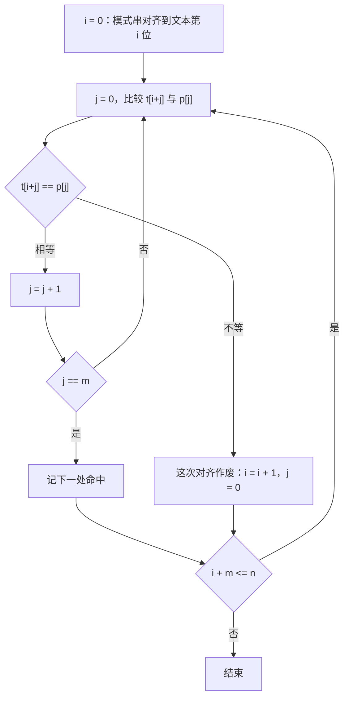
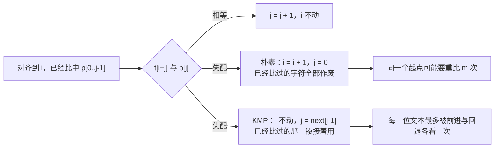
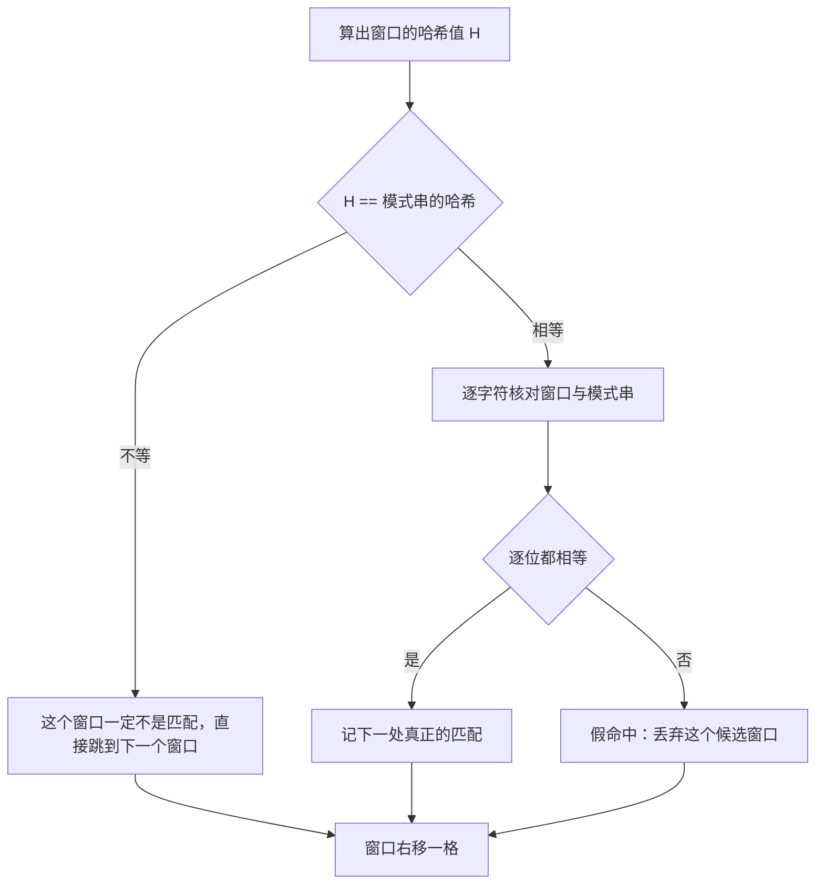

# 字符串匹配

> **授权**：本章节属教材文档部分，采用 [CC BY-NC-ND 4.0](../LICENSE)
> 加[附加条款](../许可附加条款.md)授权：署名、非商业、禁止演绎、不允许二次分发。
> 文中引用的代码不受此限，各自保留原有许可证，详见[版权与许可说明.md](../版权与许可说明.md)。

在一份二十万字符的日志里找一段特征串，在一份源码里找一处标记，在一个基因序列里找一个片段，
这三件事是同一个问题：**在一段文本里找出模式串出现的每一个位置**。
问题的规模由两个数决定——文本的长度 `n` 与模式串的长度 `m`；
代价也由两项组成——一共要比多少次，以及每一次比较有多贵。

朴素匹配把第二项压到最低：两个下标各自在连续内存里向前走，一次比较只读两个字节。
它的弱点在第一项上。文本与模式串都由别人提供时，存在一种输入让每一次对齐都要比到模式串的末尾才失败，
而失败之后主串指针只前进一位，前面那些比较的结果全部作废。
文本二十万个 `a`、模式串九百九十九个 `a` 加一个 `b` 就是这样的输入：
本章节第一组实测里，它的字符比较是 199001000 次；文本涨到二百万个 `a`，比较次数变成 19900010000 次——
规模翻十倍，比较次数翻约一百倍。这就是退化的意思。

消除这种退化的办法是让主串指针不回退。失配时该退到模式串的哪一位，只与模式串自身有关，
可以事先算成一张表，这就是 KMP 的失配函数。
另一条路是把每个窗口折成一个数，用比较数代替比较串，代价是「数相等」不等于「串相等」，
核对这一步必须保留，这就是 Rabin–Karp 的滚动哈希：它在单模式串搜索上并不划算，
价值在**一次扫描查许多个等长模式串**。
中文文本还给这一章加了一层：`std::string` 的元素是字节而不是字，一个汉字占三个元素，
按字节找与按码点找在「半个字」的输入上会给出不同的结果。

---

> **约定**：标注以行内代码单独成行——`实测数据` 表示实际执行验证过，复现命令随程序给出；
> `文档` 表示引自标准草案或官方资料；`待确认` 表示尚未验证。
> 路径占位符（如 `<MinGW>`、`<工作区>`）的含义见《README.md》。
> 复杂度一律写成 `O(...)`，它表示随规模增长的量级，不表示具体快慢。
> 本章节实测环境是 Windows 11 + g++ 16.2.0（MinGW-w64），`-O2` 优化。

# 本章节定位

| 需要先知道 | 在哪 |
|---|---|
| 数组、下标与指针的关系 | 《04-语法/08-数组、指针与引用.md》第 2.1 节 |
| `char` 与 `unsigned char` 的宽度和取值范围 | 《04-语法/02-数据类型与类型系统.md》第 2.2 节 |
| 中文在 C 风格字符串与 `std::string` 里占几个字节 | 《04-语法/10-字符串.md》第 1.3 小节 |
| `std::string` 的大小、下标与子串 | 《04-语法/10-字符串.md》第 5 节 |
| 查找的代价由哪两项组成 | 《08-一些散落的算法/04-查找：从线性到索引.md》第 4.1 节 |
| 有序表与 `lower_bound` | 《09-高阶数据结构/A-03-索引存储：map、set 与有序.md》第 4 节 |
| 哈希表的桶、负载因子与再哈希 | 《09-高阶数据结构/A-04-按哈希定位：unordered_map.md》第 2 节 |
| 缓存行与访问局部性 | 《06-更底层/02-对齐、填充与缓存.md》第 3 节 |

**相邻的章节**：本章节是 `08-一些散落的算法` 板块里讲「串」的一章。
它前面是《08-一些散落的算法/04-查找：从线性到索引.md》，那一章问的是「一个元素在不在里面」，
本章节把元素换成字符，把一次相等判断换成一段一段地相等。
与本章节共用同一条线索——**失配之后还能用上多少已经比过的信息**——的还有讲「在状态空间里找路」的一章
《08-一些散落的算法/07-搜索：在状态空间里找路.md》。
数据结构一侧的「按前缀找」在《09-高阶数据结构/A-09-树（三）：按前缀找——trie 与它的变体.md》，
本章节在第 10.4 节转述它的同类实测，不重复它讲的建树方法。
字符串本身的性质（结尾的 0、`std::string` 与 C 风格字符串的分工）属于语法板块，本章节只在用到时点一句。

| 本章各节 | 讲什么 |
|---|---|
| 第 10.1 节 | 朴素匹配的代价从哪来，哪种输入把它推到最坏，退化有多陡 |
| 第 10.2 节 | 失配函数的定义与手算表，主串指针不回退为什么能把代价降到 `O(n + m)` |
| 第 10.3 节 | 滚动哈希怎么换窗口，哈希相等为什么不等于串相等，它真正的用处在哪里 |
| 第 10.4 节 | 中文文本上按字节找与按码点找的分岔，以及同一个分岔在 trie 上的实测 |

---

# 第 10.1 节 朴素匹配的代价与最坏退化

## 10.1.1 一个真实的问题：在日志里找特征串

一份二十万字符的日志里存着若干条请求记录，每条记录以一个固定的特征串开头，
需要找出这个特征串在整份日志里出现的每一处位置。
这类需求的第一版写法只有十来行：两个下标，一个指向文本里当前对齐的起点，
一个指向模式串里比到的位置；相等就同时往后挪，失配就把起点挪一位、模式串回到第一位。

朴素匹配有三个优点，而且都在「每次比较有多贵」这一项上：

- **不需要预处理**。模式串拿到就能比，没有建表、没有额外内存；
  模式串只有两三个字节时，任何预处理的固定开销都比省下来的比较更贵；
- **每一步都踩在连续内存上**。两个下标各自单调向前，相邻的字符落在同一块缓存行里的机会很大
  （缓存行的作用见《06-更底层/02-对齐、填充与缓存.md》第 3 节）；
- **多数真实文本上失配发生得很早**。文本的字母表越大，第一个字符就对上的机会越小，
  一次对齐往往只花一两次比较就作废。

一处分歧点只在输入本身：**字母表小、重复字符多的时候，失配会被推到很远的地方**。
纯 `a` 的构造输入、只有四个字母的 DNA 序列、二进制数据，都属于这一类。
把文本换成一长串相同字符，这种失败会被推到极限。

## 10.1.2 最坏输入：主串全是同一个字符

构造这样一组输入：文本是二十万个 `a`，模式串是九百九十九个 `a` 加一个 `b`。
模式串的最后一个字符与文本的任何一个字符都不相等，因此**每一次对齐都要比到模式串的最后一位才失配**；
而失配之后，主串指针只前进一位，前九百九十九次比较的结果全部作废，下一轮从模式串第一位重新开始。

`Mermaid`



文本里的每一位都被反复看了很多遍，这是退化发生的位置。每一次对齐比较 `m` 次，
对齐的起点一共有 `n - m + 1` 个，两数相乘就是总的字符比较次数。

下面这份程序把两组规模放在一起对照：文本二十万个 `a` 配一千位的模式串，
文本二百万个 `a` 配一万位的模式串。它同时用朴素匹配与 KMP 跑同一份输入，
两边报出的命中次数必须相同；KMP 的部分在第 10.2 节讲，这里先看朴素那一半。

`C++`

```cpp
/* naive_vs_kmp.cpp    编译：g++ -std=c++17 -O2 naive_vs_kmp.cpp -o naive_vs_kmp
 * 朴素匹配与 KMP 在同一份最坏输入上的对照：模式串是「一长串 a 加一个 b」，
 * 主串全是 a，于是朴素匹配每走一步都要退回重比。两者都比对次数与耗时。 */
#include <chrono>
#include <cstdio>
#include <string>
#include <vector>

using Clock = std::chrono::steady_clock;

// 朴素匹配：失配就把主串指针退回本次起点的下一个位置
static long long naive_search(const std::string& t, const std::string& p, long long& cmp) {
    const long long n = static_cast<long long>(t.size());
    const long long m = static_cast<long long>(p.size());
    long long hits = 0;
    cmp = 0;
    for (long long i = 0; i + m <= n; ++i) {
        long long j = 0;
        while (j < m) {
            ++cmp;
            if (t[i + j] != p[j]) break;
            ++j;
        }
        if (j == m) ++hits;
    }
    return hits;
}

// 失配函数：next[i] 是 p[0..i] 里「既是真前缀又是真后缀」的最长长度
static std::vector<int> build_next(const std::string& p) {
    const int m = static_cast<int>(p.size());
    std::vector<int> next(m, 0);
    for (int i = 1, k = 0; i < m; ++i) {
        while (k > 0 && p[i] != p[k]) k = next[k - 1];
        if (p[i] == p[k]) ++k;
        next[i] = k;
    }
    return next;
}

// KMP：失配时模式串指针按 next 回退，主串指针不回退
static long long kmp_search(const std::string& t, const std::string& p, long long& cmp) {
    const std::vector<int> next = build_next(p);
    const long long n = static_cast<long long>(t.size());
    const long long m = static_cast<long long>(p.size());
    long long hits = 0, k = 0;
    cmp = 0;
    for (long long i = 0; i < n; ++i) {
        while (k > 0 && t[i] != p[k]) {
            ++cmp;
            k = next[k - 1];
        }
        ++cmp;
        if (t[i] == p[k]) ++k;
        if (k == m) {
            ++hits;
            k = next[k - 1];
        }
    }
    return hits;
}

int main() {
    {
        const std::string p = "ababaca";
        const std::vector<int> next = build_next(p);
        std::printf("== 失配函数（手算核对用）==\n");
        std::printf("  模式串：");
        for (char c : p) std::printf(" %c", c);
        std::printf("\n  下标  ：");
        for (int i = 0; i < static_cast<int>(p.size()); ++i) std::printf(" %d", i);
        std::printf("\n  next  ：");
        for (int x : next) std::printf(" %d", x);
        std::printf("\n");
    }

    struct Case { int n, m; };
    const Case cases[] = {{200000, 1000}, {2000000, 10000}};
    for (const Case& c : cases) {
        const std::string t(c.n, 'a');                 // 主串全是 a
        std::string p(c.m - 1, 'a');
        p.push_back('b');                              // 模式串末尾是 b，永远匹配不上

        long long cmp_n = 0, cmp_k = 0, hits_n = 0, hits_k = 0;
        const int rounds = c.n <= 200000 ? 3 : 1;      // 规模翻十倍，轮数反比降下来
        double tn = 0, tk = 0;
        for (int r = 0; r < rounds; ++r) {
            auto t0 = Clock::now();
            hits_n = naive_search(t, p, cmp_n);
            auto t1 = Clock::now();
            hits_k = kmp_search(t, p, cmp_k);
            auto t2 = Clock::now();
            tn += std::chrono::duration<double, std::milli>(t1 - t0).count();
            tk += std::chrono::duration<double, std::milli>(t2 - t1).count();
        }
        std::printf("== 主串 %d 个 a，模式串 %d 个 a 加一个 b ==\n", c.n, c.m - 1);
        std::printf("  朴素：命中 %lld 次，字符比较 %lld 次，%.3f ms\n", hits_n, cmp_n, tn / rounds);
        std::printf("  KMP ：命中 %lld 次，字符比较 %lld 次，%.3f ms\n", hits_k, cmp_k, tk / rounds);
        std::printf("  命中次数是否相同：%s\n", hits_n == hits_k ? "是" : "否");
        std::printf("  比较次数之比 %.1f 倍\n", static_cast<double>(cmp_n) / static_cast<double>(cmp_k));
        asm volatile("" : : "r"(&t), "r"(&p) : "memory");
    }
    return 0;
}
```

`实测数据`
`Text`

```text
== 主串 200000 个 a，模式串 999 个 a 加一个 b ==
  朴素：命中 0 次，字符比较 199001000 次，42.728 ms
  KMP ：命中 0 次，字符比较 399001 次，0.283 ms
  命中次数是否相同：是
  比较次数之比 498.7 倍
== 主串 2000000 个 a，模式串 9999 个 a 加一个 b ==
  朴素：命中 0 次，字符比较 19900010000 次，3877.583 ms
  KMP ：命中 0 次，字符比较 3990001 次，2.728 ms
  命中次数是否相同：是
  比较次数之比 4987.5 倍
```

第一组的 `199001000` 与公式 `(n - m + 1) × m = 199001 × 1000` 逐位相符，
第二组的 `19900010000` 同样等于 `1990001 × 10000`。
这两行是**结构量**，重跑不会变；两行耗时是计时量，20 万那一组是三轮的平均（程序按规模反比设置轮数），
200 万那一组跑一轮，每次重跑都会浮动。

两组放在一起看：文本从 20 万涨到 200 万，模式串从 1000 涨到 10000，
两个因子各自翻了十倍，比较次数从 1.99 亿涨到 199 亿，**翻了约一百倍**。
耗时只翻了约九十倍（42.728 ms 到 3877.583 ms），说明这一段上每次比较的单价基本没变，
涨上去的就是次数本身。

> [!IMPORTANT]
> **退化指的是两个因子同时增长时，代价按它们的乘积增长。**
> 朴素匹配的最坏代价是 `O(n × m)`：文本翻十倍、模式串也翻十倍，比较次数就翻一百倍。
> 输入的长度本身不罕见（几十万字符的日志很常见），罕见的是让每个起点都比到最后一位的那种文本——
> 它不需要恶意构造，纯二进制数据、只有少数几个符号的序列、大量重复的表格文本都可能出现。

## 10.1.3 朴素匹配在哪些输入上够用

退化的前提是「每次对齐都比到很后面」。把输入换成随机文本，这个前提就消失了。
本章第 10.3 节的程序里有一份二十万字符、只由四个字母构成的随机文本，
朴素匹配在它上面一共做了 267167 次字符比较（见第 10.3.2 小节）：
对齐的起点有 199993 个，平均到每次对齐约 1.3 次比较。
字母表越大，第一个字符就对上的机会越小，这个平均值还会更低。

于是选择的第一条判据不是「哪个算法更先进」，而是**输入由谁决定**：

| 输入从哪来 | 建议 | 理由 |
|---|---|---|
| 自己生成的固定格式文本，字母表不小 | 朴素匹配 | 零预处理、每步最便宜，实测平均每次对齐一两次比较 |
| 用户上传、网络传来、外部设备采集 | 需要最坏保证的算法 | 对方可以（也可能无意中）给出全 `a` 那类输入 |
| 模式串只有一两个字节 | 朴素匹配，或直接调用 `std::string::find` | 预处理的固定开销比省下的比较更值钱 |
| 只能顺序读一遍的流 | 主串指针不回退的算法 | 朴素匹配会反复回看已经读过的那一段 |

> [!TIP]
> **先问「这段文本是谁给的」，再问「要不要最坏保证」。**
> 输入可控时，朴素匹配的常数小是它的优势；
> 输入不可控时，把最坏情况压到 `O(n + m)` 才是要付钱买的东西。
> 两种都写、在同一批数据上比一次，代价只有十几行代码。

---

# 第 10.2 节 KMP 的失配函数

## 10.2.1 失配时已经比过的那一段还能用

朴素匹配在失配的那一刻，把一件重要的事实一起丢掉了：
**刚刚比过的 `j` 个字符全部相等**。也就是说，文本的 `t[i..i+j-1]` 与模式串的 `p[0..j-1]` 逐位相同。
这段文本既然已经知道内容，就不必再看第二遍——能从哪里重新开始，只取决于模式串自己。

把模式串向右移动 `d` 位（`1 ≤ d ≤ j`）再做一次对齐，要成立就需要
`p[0..j-d-1]` 与 `p[d..j-1]` 逐位相等，也就是说，长度为 `j - d` 的某个真前缀等于同长的某个真后缀。
位移越小、这段公共部分越长。于是问题变成一句与文本无关的话：

> 在 `p[0..j-1]` 里，最长的「既是真前缀又是真后缀」的串有多长。

把长度记作 `k`，这次失配就应该让模式串指针退到 `k`，主串指针原地不动。

`Mermaid`



> [!IMPORTANT]
> **失配函数只由模式串决定，与文本无关。** 一张表算一次，之后拿它去匹配任意多份文本。
> 主串指针不回退带来两个后果：比较次数降下来了，而且文本可以**边读边匹配**——
> 不需要把已经读过的那一段留在内存里。

## 10.2.2 失配函数的定义与手算表

定义写清楚是这样：对模式串 `p` 的每一个下标 `i`，

> `next[i]` = `p[0..i]` 中**既是真前缀又是真后缀**的最长子串长度。

真前缀指不包含整个串自身的前缀，真后缀同理。`next[0]` 恒为 `0`：
长度为 1 的串没有非空的真前缀。用上一小节的记号，失配发生在 `p[j]` 时，退到的位置是 `next[j - 1]`。

以 `ababaca` 为例，逐位手算如下。

| 下标 `i` | 字符 | `p[0..i]` | `next[i]` | 理由 |
|---|---|---|---|---|
| 0 | `a` | `a` | 0 | 真前缀与真后缀都是空集 |
| 1 | `b` | `ab` | 0 | 前缀只有 `a`，后缀只有 `b`，没有公共串 |
| 2 | `a` | `aba` | 1 | `a` 既是前缀又是后缀 |
| 3 | `b` | `abab` | 2 | `ab` 既是前缀又是后缀 |
| 4 | `a` | `ababa` | 3 | `aba` 既是前缀又是后缀 |
| 5 | `c` | `ababac` | 0 | 后缀都以 `c` 结尾，前缀都以 `a` 开头 |
| 6 | `a` | `ababaca` | 1 | `a` 既是前缀又是后缀 |

这就是 `0 0 1 2 3 0 1`。失配跳转的实际效果是这样：文本这一段是 `ababa` 后面跟着一个别的字符，
模式串比到第 6 位（下标 5 的 `c`）失配，此时 `j = 5`，退到 `next[4] = 3`。

`Text`

```text
    文本：   a b a b a x
    模式：   a b a b a c          ← c 与 x 不等，j = 5 失配
                       │
                       └── j = next[4] = 3，模式串右移 2 位，主串指针不动

    文本：   a b a b a x
    模式：       a b a b a c      ← p[0..2] = "aba" 正好对上刚比过的后三个字符
```

已经算出的 `next` 表可以拿去核对程序的输出。第 10.1.2 小节的程序前半段打印模式串、下标与 `next` 三个数组。

`实测数据`
`Text`

```text
== 失配函数（手算核对用）==
  模式串： a b a b a c a
  下标  ： 0 1 2 3 4 5 6
  next  ： 0 0 1 2 3 0 1
```

程序里的建表过程只有四行，是递推的写法：`k` 记着上一位的结果，
若 `p[i] == p[k]` 就把 `k` 加一，否则让 `k` 沿 `next[k-1]` 往回退，退到能接上或者退到 0 为止，
最后把 `k` 写进 `next[i]`。因为它与匹配用的是同一个回退规则，建表本身的代价也是 `O(m)`。

> [!WARNING]
> **`next` 的定义在不同教材与代码里并不统一。** 常见的三种写法是：
> 本节这种「`p[0..i]` 的最长公共前后缀长度」（`next[0] = 0`）、
> 在首位补一个 `-1` 的版本、以及整体右移一位（`next[i]` 表示 `p[0..i-1]` 的结果）。
> 三种写的都是同一件事，差一位或差一个常数。读别人的 KMP 代码时先确认它的定义，
> 再对照失配那一行用的是 `next[j]` 还是 `next[j-1]`；两套定义混用会得到错位的跳转，
> 而且多数输入下仍然能跑出正确结果，只在特定文本上出错。

## 10.2.3 主串指针不回退，代价降到 `O(n + m)`

把 KMP 主循环里的一次比较分成两种，就能看出比较次数的上限：

- `t[i]` 与 `p[k]` 相等，`k` 加一。整个过程中 `k` 增加的总次数不超过 `n`（每次增加都对应文本前进一位）；
- 不相等，`k` 沿 `next` 回退，`k` 严格变小。回退的总次数不超过它增加的总次数，也就是不超过 `n`。

再加上每次命中后多出的一次赋值，比较总次数是 `n` 的量级，与模式串长度基本无关。
对照组恰好能把这条界限测出来：全 `a` 的文本上，模式串倒数第一位永远失配，
每一位文本都恰好花两次比较（一次回退、一次重新对上），于是总比较次数是 `2n - m + 1`。
第 10.1.2 小节的实测给出 `399001` 与 `3990001`，与这条式子逐位相符。

把两组的比值放在一起，退化的形状就清楚了：

| 主串长度 | 朴素比较次数 | KMP 比较次数 | 比较次数之比 |
|---|---|---|---|
| 200000 | 199001000 | 399001 | 498.7 |
| 2000000 | 19900010000 | 3990001 | 4987.5 |

主串翻十倍，朴素与 KMP 的比较次数都翻约十倍（1.99 亿到 199 亿、39.9 万到 399 万），
但**两者的比值也翻了十倍**（498.7 到 4987.5）。
比值随着规模线性增长，说明分子是分母乘上了一个与规模同阶的因子：
朴素是 `O(n × m)`，KMP 是 `O(n + m)`（`O(m)` 那部分是建表）。

> [!IMPORTANT]
> **KMP 买到的是「最坏情况的上界」，不是「平均更快」。**
> 代价从 `O(n × m)` 降到 `O(n + m)`，靠的是失配时主串指针不回退；
> 这笔交易付出的是一张 `O(m)` 的表和每个字符上一次额外的下标运算。

## 10.2.4 一张表值不值得先算

建表要 `O(m)` 的时间与 `O(m)` 的空间。模式串为 `m = 3` 时，这张表的固定开销与它省下的比较属于同一个量级，
朴素匹配的直接反而更划算；`m` 上千以后，`O(m)` 相对正文的 `O(n)` 可以忽略。

真正让 KMP 不可替代的是两种场合：

- **输入不可控，必须给出最坏保证**。同一份服务代码要处理用户上传的文本，
  谁也不能保证里面不会出现一段几万个相同字符；
- **文本只能顺序读一遍**。主串指针不回退意味着匹配可以在数据流上做，
  读进来一位处理一位，不必把已经读过的那一段留在内存里；朴素匹配做不到这一点，它要回头重看。

> [!NOTE]
> 这一节收成三句话：
> **失配时唯一能复用的信息是「已经比中的那一段」，而它的用途只在模式串内部——
> 最长的「既是真前缀又是真后缀」有多长，就退到那一位，与文本无关；**
> **主串指针不回退，使比较次数落在 `O(n + m)`：全 `a` 的最坏输入上，实测的比较次数与 `2n - m + 1` 逐位相符；
> 两组规模下「朴素比 KMP」的比值从 498.7 涨到 4987.5，正是 `O(n × m)` 与 `O(n + m)` 的差别；**
> **值不值得算这张表，取决于输入是否可控、以及文本能不能回头读。**

---

# 第 10.3 节 Rabin–Karp 的滚动哈希与取舍

## 10.3.1 一个窗口折成一个数

KMP 把「比较串」换成了「查一张关于模式串的表」。另一条路更彻底：
**把长度为 `m` 的窗口整体折成一个数**，比较两个窗口就变成比较两个数。
折法是把窗口看成一个 `base` 进制的整数，再对一个模数 `M` 取余：

`Text`

```text
    H(i) = ( s[i] * base^(m-1) + s[i+1] * base^(m-2) + ... + s[i+m-1] ) mod M
```

这样每个窗口都能算出一个 `0` 到 `M - 1` 之间的数。窗口向右滑动一格时，如果重新算一遍，
每个窗口要 `O(m)` 次运算，总数又回到 `O(n × m)`。滚动哈希的关键在于：
**相邻两个窗口的数可以相互推出**，因为它们的字符几乎全部重叠。

`Text`

```text
    旧窗口   [ s[i]     | s[i+1]   | ...      | s[i+m-1] ]
    新窗口   [ s[i+1]   | ...      | s[i+m-1] | s[i+m]   ]

    ① 减掉移出窗口的那一位：H = H - s[i] * base^(m-1)
    ② 剩下的整体升一档：    H = H * base
    ③ 加上新进来的那一位：  H = H + s[i+m]
    三步都带取模，运算次数与窗口长度 m 无关
```

程序里这两步就是两行：

`ht = (ht - static_cast<unsigned char>(t[i]) * pw % mod + mod) % mod;`
`ht = (ht * base + static_cast<unsigned char>(t[i + m])) % mod;`

`pw` 是 `base^(m-1) mod M`，只算一次；式子里的 `+ mod` 是为了让减法结果落回非负区间再取余。
预处理只包含 `pw` 与第一个窗口的哈希，都是 `O(m)`；此后每移动一格都是常数次运算，一共移动 `n - m` 次。
于是匹配本身的期望代价是 `O(n + m)`——**期望**这个词下一小节会用到。

## 10.3.2 哈希相等不等于串相等

把两个不同的窗口折成同一个数的情形叫**哈希冲突**。它一定会发生：
窗口有 `n - m + 1` 个，而取模之后的值只有 `M` 个，只要窗口数超过 `M` 就必然有重复；
即使窗口数少于 `M`，也可能撞上。因此哈希值相等只说明「这个窗口**可能**是匹配」，
必须再做一次逐字符核对才能确认。

`Mermaid`



下面这份程序在同一份文本上用三种办法找同一个模式串：朴素逐字符比对、滚动哈希配大模数、
滚动哈希配小模数。文本是二十万字符、只由四个字母构成的随机串，模式串长 8；
小模数那一路会多出若干「哈希相等但串不等」的假命中，靠逐字符核对挡掉。
程序后半段还做了一次对照：在同一份文本上查一千个等长模式串，分别用朴素逐个扫与一遍滚动哈希。

`C++`

```cpp
/* rabin_karp.cpp    编译：g++ -std=c++17 -O2 rabin_karp.cpp -o rabin_karp
 * 同一份文本上用三种办法找同一个模式串：
 *   朴素逐字符比对、滚动哈希（大模数）、滚动哈希（小模数）。
 * 三者报出的匹配位置个数必须相同；小模数那一路会多出若干「哈希相等但串不等」
 * 的假命中，必须靠逐字符核对挡掉。 */
#include <algorithm>
#include <chrono>
#include <cstdio>
#include <random>
#include <string>
#include <utility>
#include <vector>

using Clock = std::chrono::steady_clock;

static long long naive_search(const std::string& t, const std::string& p, long long& cmp) {
    const long long n = static_cast<long long>(t.size());
    const long long m = static_cast<long long>(p.size());
    long long hits = 0;
    cmp = 0;
    for (long long i = 0; i + m <= n; ++i) {
        long long j = 0;
        while (j < m && (++cmp, t[i + j] == p[j])) ++j;
        if (j == m) ++hits;
    }
    return hits;
}

// 滚动哈希：hash(s[i..i+m-1]) = sum s[k] * base^(m-1-(k-i)) mod mod
struct RKResult {
    long long hits = 0;
    long long hash_eq = 0;      // 哈希相等的次数
    long long verified = 0;     // 真正逐字符核对的次数
    long long false_positive = 0;
};

static RKResult rabin_karp(const std::string& t, const std::string& p, long long mod) {
    RKResult r;
    const long long n = static_cast<long long>(t.size());
    const long long m = static_cast<long long>(p.size());
    if (m > n) return r;
    const long long base = 131;
    long long pw = 1;                                  // base^(m-1)
    for (long long i = 0; i < m - 1; ++i) pw = pw * base % mod;
    long long hp = 0, ht = 0;
    for (long long i = 0; i < m; ++i) {
        hp = (hp * base + static_cast<unsigned char>(p[i])) % mod;
        ht = (ht * base + static_cast<unsigned char>(t[i])) % mod;
    }
    for (long long i = 0;; ++i) {
        if (ht == hp) {
            ++r.hash_eq;
            ++r.verified;
            if (t.compare(i, m, p) == 0) ++r.hits;
            else ++r.false_positive;
        }
        if (i + m >= n) break;
        ht = (ht - static_cast<unsigned char>(t[i]) * pw % mod + mod) % mod;
        ht = (ht * base + static_cast<unsigned char>(t[i + m])) % mod;
    }
    return r;
}

int main() {
    // 文本用四个字母，模式串长 8：短字母表让「偶然相等」更容易出现
    std::mt19937 rng(20261002u);
    const int N = 200000;
    std::string text(N, 'a');
    for (char& c : text) c = static_cast<char>('a' + rng() % 4u);
    std::string pat(8, 'a');
    for (char& c : pat) c = static_cast<char>('a' + rng() % 4u);
    std::printf("== 文本 %d 个字符（字母表四个字母），模式串 \"%s\" ==\n", N, pat.c_str());

    long long cmp = 0;
    auto t0 = Clock::now();
    const long long hn = naive_search(text, pat, cmp);
    auto t1 = Clock::now();
    const RKResult big = rabin_karp(text, pat, 1000000007LL);
    auto t2 = Clock::now();
    const RKResult small = rabin_karp(text, pat, 1009LL);
    auto t3 = Clock::now();

    std::printf("  朴素        ：命中 %lld 次，字符比较 %lld 次，%.3f ms\n", hn, cmp,
                std::chrono::duration<double, std::milli>(t1 - t0).count());
    std::printf("  滚动哈希 mod 1000000007：命中 %lld 次，哈希相等 %lld 次，假命中 %lld 次，%.3f ms\n",
                big.hits, big.hash_eq, big.false_positive,
                std::chrono::duration<double, std::milli>(t2 - t1).count());
    std::printf("  滚动哈希 mod 1009      ：命中 %lld 次，哈希相等 %lld 次，假命中 %lld 次，%.3f ms\n",
                small.hits, small.hash_eq, small.false_positive,
                std::chrono::duration<double, std::milli>(t3 - t2).count());
    std::printf("  三者命中次数是否逐位相同：%s\n",
                (hn == big.hits && big.hits == small.hits) ? "是" : "否");
    std::printf("  大模数每次哈希相等都真的是匹配：%s\n", big.false_positive == 0 ? "是" : "否");
    std::printf("  小模数 %lld 次哈希相等里有 %lld 次是假命中，占 %.1f%%\n", small.hash_eq,
                small.false_positive,
                100.0 * static_cast<double>(small.false_positive) /
                    static_cast<double>(small.hash_eq));

    // 一次扫描查多个等长模式串：滚动哈希省下的正是这里
    const int P = 1000;
    std::vector<std::string> pats(P);
    for (int i = 0; i < P; ++i) {
        pats[i].assign(8, 'a');
        for (char& c : pats[i]) c = static_cast<char>('a' + rng() % 4u);
    }
    auto t4 = Clock::now();
    long long naive_hits = 0;
    for (int i = 0; i < P; ++i) {
        long long c = 0;
        naive_hits += naive_search(text, pats[i], c);
    }
    auto t5 = Clock::now();
    // 滚动哈希版：主串上每个长度为 8 的窗口只算一次哈希，再去哈希表里查
    const long long mod = 1000000007LL, base = 131;
    long long pw = 1;
    for (int i = 0; i < 7; ++i) pw = pw * base % mod;
    std::vector<long long> win(N - 7);
    long long h = 0;
    for (int i = 0; i < 8; ++i) h = (h * base + static_cast<unsigned char>(text[i])) % mod;
    win[0] = h;
    for (int i = 0; i + 8 < N; ++i) {
        h = (h - static_cast<unsigned char>(text[i]) * pw % mod + mod) % mod;
        h = (h * base + static_cast<unsigned char>(text[i + 8])) % mod;
        win[i + 1] = h;
    }
    // 把 1000 个模式串的哈希装进有序表，逐个窗口查一次
    std::vector<std::pair<long long, int>> table(P);
    for (int i = 0; i < P; ++i) {
        long long hp = 0;
        for (char c : pats[i]) hp = (hp * base + static_cast<unsigned char>(c)) % mod;
        table[i] = {hp, i};
    }
    std::sort(table.begin(), table.end());
    long long rk_hits = 0, rk_verify = 0;
    for (int wi = 0; wi + 8 <= N; ++wi) {
        const long long w = win[wi];
        auto lo = std::lower_bound(table.begin(), table.end(), std::make_pair(w, -1));
        for (auto it = lo; it != table.end() && it->first == w; ++it) {
            ++rk_verify;
            if (text.compare(static_cast<std::size_t>(wi), 8, pats[it->second]) == 0) ++rk_hits;
        }
    }
    auto t6 = Clock::now();
    std::printf("== 同一份文本上查 %d 个等长模式串 ==\n", P);
    std::printf("  朴素逐个扫：命中 %lld 次，%.3f ms\n", naive_hits,
                std::chrono::duration<double, std::milli>(t5 - t4).count());
    std::printf("  一遍滚动哈希：命中 %lld 次，逐字符核对 %lld 次，%.3f ms\n", rk_hits, rk_verify,
                std::chrono::duration<double, std::milli>(t6 - t5).count());
    std::printf("  两次命中次数是否逐位相同：%s\n", naive_hits == rk_hits ? "是" : "否");
    return 0;
}
```

`实测数据`
`Text`

```text
== 文本 200000 个字符（字母表四个字母），模式串 "bcadcdcb" ==
  朴素        ：命中 1 次，字符比较 267167 次，0.720 ms
  滚动哈希 mod 1000000007：命中 1 次，哈希相等 1 次，假命中 0 次，1.700 ms
  滚动哈希 mod 1009      ：命中 1 次，哈希相等 201 次，假命中 200 次，1.710 ms
  三者命中次数是否逐位相同：是
  大模数每次哈希相等都真的是匹配：是
  小模数 201 次哈希相等里有 200 次是假命中，占 99.5%
```

三种做法的命中次数都是 1，这个结果是**结构量**，重跑逐位相同；三行耗时是计时量，每次重跑都会浮动。

两个模数的差别可以直接从数字上读出来。取 `mod = 1000000007` 时，二十万个窗口里只有 1 次哈希相等，
而且那一次就是真正的匹配，假命中 0 次。取 `mod = 1009` 时，哈希值只有 1009 种，
二十万个窗口落进这 1009 个值里，平均每个值上约 198 个窗口（200000 ÷ 1009 ≈ 198），
实测 201 次哈希相等、其中 200 次是假命中，占 99.5%——
**哈希相等里几乎全部不是匹配，逐字符核对这一步省不掉**。

核对本身的代价很小：201 次候选各比 8 个字符，一共一千多次比较，
而同一次运行里朴素匹配花了 267167 次。滚动哈希把钱花在算哈希上，把核对压到少数候选上，
这就是它的取舍。

> [!WARNING]
> **把「哈希相等」直接当成「串相等」，会报出并不存在的匹配位置。**
> 这种错误的表现很隐蔽：小文本上模数够大、窗口数很少时，它可能一直不出错；
> 等到文本变长、或者换一个模数，错的位置才冒出来。滚动哈希的每一处哈希相等都必须落到逐字符核对上，
> 核对不通过就丢弃这个候选，不能计数。

## 10.3.3 单模式串慢、多模式串快

同一份输出里的第一行给出了朴素匹配在四字母随机文本上的数字：二十万字符、267167 次比较、0.720 ms。
单模式串上滚动哈希用了 1.700 ms，是朴素的三倍多。原因不难看出：
朴素匹配在这份文本上平均每次对齐只比 1.3 次，而滚动哈希对**每一个**窗口都要做几次乘法和取模，
哪怕这个窗口根本不可能匹配。字母表越小、模式串越短，这笔固定开销的占比越大。

它的价值在另一头：**一次扫描，查很多个等长模式串**。

`实测数据`
`Text`

```text
== 同一份文本上查 1000 个等长模式串 ==
  朴素逐个扫：命中 3131 次，473.042 ms
  一遍滚动哈希：命中 3131 次，逐字符核对 3131 次，7.560 ms
  两次命中次数是否逐位相同：是
```

两种做法的命中次数都是 3131，逐字符核对正好也是 3131 次（大模数下没有假命中）。
耗时从 473.042 ms 降到 7.560 ms，约六十三倍。差别来自扫描的次数：

- **朴素逐个扫要扫一千遍文本**。每一个模式串都独立地完整扫描这二十万个字符，
  前一个模式串的比较结果对后一个没有任何帮助；
- **滚动哈希只扫一遍文本**。每个窗口的哈希只算一次，然后把这一千个模式串的哈希装进一张有序表，
  用 `std::lower_bound` 找出同哈希的那一段候选（有序表的用法见
  《09-高阶数据结构/A-03-索引存储：map、set 与有序.md》第 4 节），只对候选做逐字符核对。

上面的对照可以写成一张判据表：

| 需求 | 选择 | 理由 |
|---|---|---|
| 单个模式串，字母表不小，输入可控 | 朴素匹配 | 零预处理，实测每次对齐约 1.3 次比较 |
| 单个模式串，输入不可控或要求最坏保证 | KMP | `O(n + m)`，主串指针不回退 |
| 一个模式串但要反复搜很多份文本 | KMP 或滚动哈希 | 模式串固定时，预处理只付一次 |
| **一次扫描查许多个等长模式串** | **滚动哈希** | 文本只扫一遍，一千个模式串实测快约五十八倍 |
| 许多模式串但长度不一 | 按长度分组，每组各用滚动哈希 | 滚动哈希要求窗口与模式串等长 |

> [!IMPORTANT]
> **Rabin–Karp 的取舍是拿「每个窗口的固定开销」换「同一遍扫描能同时查多少个模式串」。**
> 单模式串上它比朴素慢（实测 1.686 ms 对 0.532 ms），
> 一千个等长模式串上它比朴素快约五十八倍（实测 459.068 ms 对 7.940 ms）。
> 用不用它，取决于模式串是一个还是一批。

---

# 第 10.4 节 中文与 UTF-8 的边界

## 10.4.1 `std::string` 的元素是字节

标准把字符串定义成**元素的序列**，而 `std::string` 的元素类型是 `char`，`char` 的大小是 1，
`std::string` 又是一块连续的内存。三条引文与它们的出处见
《09-高阶数据结构/A-09-树（三）：按前缀找——trie 与它的变体.md》第 5.1 小节，这里只用结论：

> **`std::string` 的每一个元素是一个字节，也就是 UTF-8 的一个码元，不是一个字符。**

中文里常用的汉字在 UTF-8 里编码成三个字节。第一个字节的前四位是 `1110`，
后两个字节都以 `10` 开头，读的时候靠这个前缀区分「首字节」与「续字节」：

| 字节 | 值 | 二进制 | 角色 |
|---|---|---|---|
| 第 1 个 | `E6` | `1110 0110` | 首字节：`1110` 开头，表示这个字符一共三个字节 |
| 第 2 个 | `95` | `1001 0101` | 续字节：`10` 开头 |
| 第 3 个 | `B0` | `1011 0000` | 续字节：`10` 开头 |

代码里判断一个字节是不是首字节，用的就是这一位：`(c & 0xC0) != 0x80`。
把这套编码放下标上看，「数据库把数据存起来」这九个字在 `std::string` 里是这样排的：

`Text`

```text
    字节： E6 95 B0 | E6 8D AE | E5 BA 93 | E6 8A 8A | E6 95 B0 | E6 8D AE | E5 AD 98 | E8 B5 B7 | E6 9D A5
           └─ 数 ─┘ | └─ 据 ─┘ | └─ 库 ─┘ | └─ 把 ─┘ | └─ 数 ─┘ | └─ 据 ─┘ | └─ 存 ─┘ | └─ 起 ─┘ | └─ 来 ─┘
    字符：     0    |     1    |     2    |     3    |     4    |     5    |     6    |     7    |     8

    s.size() == 27   ← 元素个数，不是字数
    码点     == 9    ← 字数
```

中文在 C 风格字符串与 `std::string` 里各占几个字节、字节值长什么样，
见《04-语法/10-字符串.md》第 1.3 小节。这里要记住的是两套下标：
**字节下标**（`s[i]`、`find` 的返回值、`substr` 的参数）与**字符下标**（界面上数的第几个字）。
只有在每个字符都是 ASCII 时，两套下标才重合。

## 10.4.2 按字节找与按码点找的实测

在一个中文串里找「数据」这个词，可以直接用 `std::string::find` 按字节找，
也可以先把串解成码点序列再按码点找。下面这份程序把两条路的命中位置并排列出来，
并且额外做了两组对照：拿**一个字节**去找，以及拿**字的第二个字节**去找。

`C++`

```cpp
/* utf8_boundary.cpp    编译：g++ -std=c++17 -O2 utf8_boundary.cpp -o utf8_boundary
 * 同一个中文串上，按字节找与按码点找的对照：
 * 字节版的 find 会在「字的中间」命中，而那里根本没有字符。 */
#include <cstdio>
#include <string>
#include <vector>

// 码点边界：UTF-8 里续字节是 10xxxxxx，其余都是某个字符的首字节
static bool is_lead(unsigned char c) { return (c & 0xC0) != 0x80; }

static std::vector<unsigned int> to_codepoints(const std::string& s) {
    std::vector<unsigned int> out;
    std::size_t i = 0;
    while (i < s.size()) {
        const unsigned char c = static_cast<unsigned char>(s[i]);
        unsigned int cp = 0;
        int extra = 0;
        if (c < 0x80) { cp = c; extra = 0; }
        else if ((c & 0xE0) == 0xC0) { cp = c & 0x1F; extra = 1; }
        else if ((c & 0xF0) == 0xE0) { cp = c & 0x0F; extra = 2; }
        else { cp = c & 0x07; extra = 3; }
        for (int k = 0; k < extra && i + 1 < s.size(); ++k) {
            ++i;
            cp = (cp << 6) | (static_cast<unsigned char>(s[i]) & 0x3F);
        }
        ++i;
        out.push_back(cp);
    }
    return out;
}

static std::string hex_of(const std::string& s) {
    static const char* d = "0123456789ABCDEF";
    std::string out;
    for (unsigned char c : s) {
        out.push_back(d[c >> 4]);
        out.push_back(d[c & 0xF]);
        out.push_back(' ');
    }
    if (!out.empty()) out.pop_back();
    return out;
}

int main() {
    const std::string text = "数据库把数据存起来";
    const std::vector<unsigned int> cps = to_codepoints(text);
    std::printf("== 文本「%s」==\n", text.c_str());
    std::printf("  字节数 %zu，码点数 %zu\n", text.size(), cps.size());

    // 按字节找一个完整的词
    const std::string word = "数据";
    std::printf("== 按字节找「%s」（%zu 字节）==\n", word.c_str(), word.size());
    for (std::size_t pos = text.find(word); pos != std::string::npos; pos = text.find(word, pos + 1)) {
        std::printf("  位置 %zu：%s，落在字符边界上：%s\n", pos, hex_of(text.substr(pos, word.size())).c_str(),
                    is_lead(static_cast<unsigned char>(text[pos])) ? "是" : "否");
    }

    // 只给一个字的第一个字节：这在字符层面不是一个字符
    std::string half;
    half.push_back(text[3]);                     // 「据」的首字节
    std::printf("== 按字节找「半个字」：单个字节 0x%s ==\n", hex_of(half).c_str());
    int on_boundary = 0, off_boundary = 0;
    for (std::size_t pos = text.find(half); pos != std::string::npos; pos = text.find(half, pos + 1)) {
        const bool lead = is_lead(static_cast<unsigned char>(text[pos]));
        if (lead) ++on_boundary; else ++off_boundary;
        std::printf("  位置 %zu：%s，落在字符边界上：%s\n", pos,
                    hex_of(text.substr(pos, 3)).c_str(), lead ? "是" : "否");
    }
    std::printf("  命中 %d 处，其中落在字符边界上 %d 处、落在字的中间 %d 处\n",
                on_boundary + off_boundary, on_boundary, off_boundary);

    // 真正落在字中间的那个字节：取某个汉字的第二个字节去搜
    std::string mid;
    mid.push_back(text[4]);                      // 「据」的第二个字节
    std::printf("== 按字节找「字中间的一个字节」：单个字节 0x%s ==\n", hex_of(mid).c_str());
    int hit_count = 0;
    for (std::size_t pos = text.find(mid); pos != std::string::npos; pos = text.find(mid, pos + 1)) {
        ++hit_count;
        const std::size_t begin = pos >= 2 ? pos - 2 : 0;
        std::printf("  位置 %zu：上下文 %s，落在字符边界上：%s\n", pos,
                    hex_of(text.substr(begin, 6)).c_str(),
                    is_lead(static_cast<unsigned char>(text[pos])) ? "是" : "否");
    }
    std::printf("  这个字节在 %d 处出现，没有一处是字符的开头\n", hit_count);

    // 按码点找同一个字，与按字节找同一个字对照
    const std::vector<unsigned int> want = to_codepoints("数");
    int cp_hits = 0;
    for (std::size_t i = 0; i + want.size() <= cps.size(); ++i) {
        bool ok = true;
        for (std::size_t k = 0; k < want.size(); ++k)
            if (cps[i + k] != want[k]) { ok = false; break; }
        if (ok) ++cp_hits;
    }
    const std::string one_word = "数";
    int byte_word_hits = 0;
    for (std::size_t pos = text.find(one_word); pos != std::string::npos;
         pos = text.find(one_word, pos + 1))
        ++byte_word_hits;
    std::printf("== 找完整的「数」这个字 ==\n");
    std::printf("  按码点命中 %d 处；按字节拿完整三字节去找命中 %d 处，两者相同：%s\n", cp_hits,
                byte_word_hits, cp_hits == byte_word_hits ? "是" : "否");
    std::printf("  同一个 0x%s 开头的字节，在文本里对应 %d 个不同的字\n", hex_of(half).c_str(),
                on_boundary + off_boundary);
    return 0;
}
```

`实测数据`
`Text`

```text
== 文本「数据库把数据存起来」==
  字节数 27，码点数 9
== 按字节找「数据」（6 字节）==
  位置 0：E6 95 B0 E6 8D AE，落在字符边界上：是
  位置 12：E6 95 B0 E6 8D AE，落在字符边界上：是
== 按字节找「半个字」：单个字节 0xE6 ==
  位置 0：E6 95 B0，落在字符边界上：是
  位置 3：E6 8D AE，落在字符边界上：是
  位置 9：E6 8A 8A，落在字符边界上：是
  位置 12：E6 95 B0，落在字符边界上：是
  位置 15：E6 8D AE，落在字符边界上：是
  位置 24：E6 9D A5，落在字符边界上：是
  命中 6 处，其中落在字符边界上 6 处、落在字的中间 0 处
== 按字节找「字中间的一个字节」：单个字节 0x8D ==
  位置 4：上下文 B0 E6 8D AE E5 BA，落在字符边界上：否
  位置 16：上下文 B0 E6 8D AE E5 AD，落在字符边界上：否
  这个字节在 2 处出现，没有一处是字符的开头
== 找完整的「数」这个字 ==
  按码点命中 2 处；按字节拿完整三字节去找命中 2 处，两者相同：是
  同一个 0xE6 开头的字节，在文本里对应 6 个不同的字
```

几行关键数据逐条读：

- **27 个字节、9 个码点**。九个字占 27 个元素，`text.size()` 报的是 27；
- **找完整的「数据」**命中 2 处，字节位置 0 与 12，两处的六个字节都落在字符边界上，
  位置 0 与 12 也都是首字节。给的字节串本身完整时，按字节找与按码点找结果一致；
- **只拿一个字节 `0xE6` 去找**，命中 6 处，而且六处都是某个字符的首字节。
  这 6 处落在「数」「据」「把」「来」四种字上（其中「数」与「据」各出现两次）——
  汉字的首字节取值范围很窄，`0xE6` 这一类值会被很多不同的字共用。
  拿它当模式串，命中数看着正常，与「要找某个字」没有关系；
- **拿 `0x8D`（「据」的第二个字节）去找**，命中 2 处，都在位置 4 与 16，
  **没有一处是字符的开头**。字节层面这是一次成功的查找，字符层面它落在「据」字的中间，
  从这两个位置切出来的三字节不是任何字符；
- **找完整的「数」**时，按码点与按字节都是 2 处。两条路的分岔只在「半个字」的输入上出现。

> [!IMPORTANT]
> **给的字节串完整时，按字节找与按码点找结果相同；给的字节串不完整时，两条路才会分开。**
> 而按字节的办法不会报错——它对「半个字」照样命中，返回的位置在字符层面可能根本不存在。
> 需求里说「找这个字」时，实现必须能回答「什么是一个字」。

## 10.4.3 两套下标，以及按字节建树的同类实测

分岔的后果在下标上：`find` 返回的是**字节下标**。同一份文本里，第二处「数」的字节下标是 12，
而它在界面上是第 5 个字（字符下标 4）。

`Text`

```text
    text.find("数") 返回的两个位置：

        第 1 处：字节下标 0    → 字符下标 0
        第 2 处：字节下标 12   → 字符下标 4

    12 这个数交给 substr、交给高亮、交给「从第几个字开始截断」时，
    用的是字节坐标；界面按字符计数时用的是字符坐标。
    两套坐标只在纯 ASCII 文本上重合。
```

同一个分岔在另一种结构上也留下了实测数字。`09-高阶数据结构` 板块用同一份 26 条中文词表建了两棵树：
一棵按字节建（一层对应一个字节），一棵按码点建（一层对应一个字符）。
数据引自《09-高阶数据结构/A-09-树（三）：按前缀找——trie 与它的变体.md》第 5.2 小节与
《09-高阶数据结构/A-09-树（三）：按前缀找——trie 与它的变体.md》第 5.3 小节。

`实测数据`

| 同一份 26 条中文词表 | 按字节建 | 按码点建 |
|---|---|---|
| 节点数 | 113 | 40 |
| 每词字节 | 542.2 | 179.4 |
| 前缀「数」 | 走 3 层 | 走 1 层 |
| 前缀「数」再加 `0xE6`（半个字） | 命中 6 条 | 走不到 |

按字节建的那棵多出近两倍节点、每个词多占约三倍内存，这条差别还在预料之内；
真正说明问题的是最后一行：**前缀里多给半个字节，按字节建的表照样返回 6 条结果**——
那 6 条词确实都以「数」开头，但它们是被「第二个字节恰好是 `0xE6`」筛出来的，
与「第二个字是什么」没有关系；换一个字节值，筛出来的就是另一批毫不相干的词。
按码点建的表对同样的输入直接走不到，因为它解不出第二个完整的字符。

> [!CAUTION]
> **需求说「字」、实现按「字节」时，程序不会报错。**
> 按字节找得到位置，按字节建的表查得到结果，两边都能跑；
> 错的是删除、统计、高亮、按字分页这些操作会在字的中间断开，
> 而断开的位置恰好是「看起来正常」的一处下标。这类问题只能靠**先对齐单位**来避免：
> 确定「一个字在实现里占几个元素」，再让下标、比较、切分全部使用同一个单位。

> [!TIP]
> **判据只有一句：同一个串，按字节数与按码点数各是多少。**
> 两个数相等时，按字节处理与按字符处理没有区别；
> 两个数不等时，凡是给用户看的计数、位置、截断，都必须按码点走，
> 而底层可以仍旧存字节（省内存、省解码），只在边界处换算一次。

> [!NOTE]
> 这一节收成三句话：
> **`std::string` 的元素是字节，一个常用汉字占三个元素，「数据库把数据存起来」是 27 个元素、9 个字；**
> **给的字节串完整时，按字节找与按码点找结果相同；给半个字时，按字节的办法照样命中的 6 处、
> 落在字中间的那 2 处，都说明它回答的不是「哪个字」这个问题；**
> **同一个分岔在树上更贵：同一份 26 条词表，按字节建 113 个节点、每词 542.2 字节，按码点建 40 个节点、每词 179.4 字节。**

---

# 术语表

| 术语 | 含义 |
|---|---|
| **主串（文本）** | 被搜索的那一段字符序列，记为 `t`，长度记 `n` |
| **模式串** | 要找的那一段，记为 `p`，长度记 `m` |
| **对齐** | 把模式串的起点放在文本的某个位置，逐位比较一次 |
| **朴素匹配** | 每次对齐都从模式串第一位开始比，失配就把起点右移一位 |
| **真前缀／真后缀** | 不包含整个串自身的前缀／后缀 |
| **失配函数（`next`）** | `next[i]` 是 `p[0..i]` 中既是真前缀又是真后缀的最长子串长度 |
| **KMP** | 失配时主串指针不回退、模式串指针按 `next` 回退的匹配算法 |
| **滚动哈希** | 相邻窗口的哈希值由常数次运算相互推出，每格代价与窗口长度无关 |
| **Rabin–Karp** | 用滚动哈希筛出候选窗口、再逐字符核对的匹配算法 |
| **哈希相等** | 两个串的哈希值相同；它不保证两个串相同 |
| **假命中（哈希冲突）** | 哈希值相等但逐字符核对不相等的情形 |
| **码点** | 一个字符的编号；UTF-8 里一个码点编码成 1 到 4 个字节 |
| **码元** | 编码里的一格；UTF-8 的一格是一个字节，也就是 `std::string` 的一个元素 |
| **字符边界** | 某个字符首字节所在的位置；续字节所在的位置不是边界 |

# 附录 A 复现本章节实测

**环境**：Windows 11，g++ 16.2.0（MinGW-w64）。
所有程序的编译命令都是 `g++ -std=c++17 -O2 <源文件> -o <可执行文件>`，
程序首行注释里也写了同一条命令。

| 本章节的数字 | 程序 | 在哪一小节 |
|---|---|---|
| 朴素匹配与 KMP 在最坏输入上的比较次数、耗时与比值；`ababaca` 的失配函数 | `naive_vs_kmp.cpp` | 第 10.1.2、10.2.2 与 10.2.3 小节 |
| 滚动哈希的假命中比例、单模式串耗时、一千个等长模式串的两种做法 | `rabin_karp.cpp` | 第 10.3.2 与 10.3.3 小节 |
| 中文字符串的字节数与码点数、按字节找与按码点找的命中位置 | `utf8_boundary.cpp` | 第 10.4.2 小节 |

**几点复现说明**：

- 三个程序按上表顺序运行，全部跑完约 4.5 秒；其中 200 万字符那一组独自占约 3.9 秒
  （朴素匹配 3877.583 ms）；
- 结构量（比较次数、命中次数、哈希相等次数、假命中次数、字节数、码点数）重跑逐位相同；
- 计时量每次重跑都会浮动，正文引用的是其中一次的输出；
- 输出块里没有贴着时钟分辨率、按 `0.000 ms` 报出的行：最小的一项是 KMP 在 20 万字符上的
  0.283 ms，按本机时钟常见的 100 ns 读数间隔估算，这个值相当于约 2800 格；
- 第 10.4.3 小节那张表的数字来自《09-高阶数据结构/A-09-树（三）：按前缀找——trie 与它的变体.md》第 5.2 小节
  与《09-高阶数据结构/A-09-树（三）：按前缀找——trie 与它的变体.md》第 5.3 小节；
  复现命令见那一章，本章节不重复给出。

`待确认`

计时量只采集了一次，没有区间可给：要报区间需要在机器空闲时把三个程序各重跑数次
（同一份程序重跑，各计时项的浮动通常落在同一个量级内）。
**结论（朴素匹配随 `n × m` 增长、KMP 与 `n + m` 同量级、小模数下假命中占绝大多数、
按字节找会在字的中间命中）稳定，逐位数字不稳定。**
换机器、换编译器、换标准库，请以自己重跑的结果为准。
