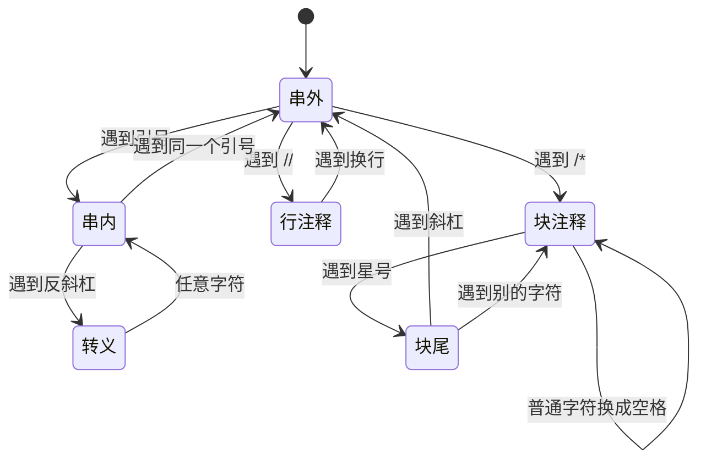

# 扫描与状态机

> **授权**：本章节属教材文档部分，采用 [CC BY-NC-ND 4.0](../LICENSE)
> 加[附加条款](../许可附加条款.md)授权：署名、非商业、禁止演绎、不允许二次分发。
> 文中引用的代码不受此限，各自保留原有许可证，详见[版权与许可说明.md](../版权与许可说明.md)。

有一类程序做的事情看起来很简单：把一段文本从头到尾读一遍，边读边改，或者边读边数。
它不排序、不建索引、不做查找，只有一次循环。写起来却常常出错，错的地方还都在同一个位置——
**读到某个字符时，光看这个字符不够，还得知道前面读到过什么。**

配置加载器就是这种程序。人写的配置需要注释，因为半年后回来看的人需要知道每个字段为什么这样填；
而下游的解析器只吃标准 JSON，于是中间要有一道工序把注释剥掉。
这道工序只有一次循环，可它必须回答一个问题：**这一处的 `//` 是注释，还是网址里的一部分。**

这一类程序要写对，靠的是把「后面还需要知道什么」压成有限个状态，再让循环按状态分支。
状态保存的位置，也是状态机与递归的分界：放在自己的变量里就是状态机，压在调用栈上就是递归，
两者给出的结果相同，区别只在深度上限由谁掌握。这类需求拿到手，都可以先数清状态、再决定用哪种表达写。

---

> **约定**：标注以行内代码单独成行——`实测数据` 表示实际执行验证过，
> 复现命令随程序给出；`文档` 表示引自标准草案或官方资料；`待确认` 表示尚未验证。
> 路径占位符（如 `<MinGW>`、`<工作区>`）的含义见《README.md》。
> 复杂度一律写成 `O(...)`，它表示**随规模增长的量级**，不表示具体快慢。
> 本章节实测环境是 Windows 11 + g++ 16.2.0（MinGW-w64），`-O2` 优化。

# 本章节定位

| 需要先知道 | 在哪 |
|---|---|
| `switch` 的分支与 `break` | 《04-语法/06-控制流语句.md》第 4 节 |
| `enum` 与枚举值的含义 | 《04-语法/09-结构体、联合体与 enum.md》第 4 节 |
| `std::string` 的下标、`size()`、`find` | 《04-语法/10-字符串.md》第 3 节 |
| `std::string` 的连续存储与扩容 | 《09-高阶数据结构/A-01-连续存储：array 与 vector.md》第 3 节 |
| 递归函数与调用栈 | `《08-一些散落的算法/01-递归：把问题交给自己.md》` |
| 函数指针与函数对象 | 《05-类与面向对象/10-lambda 与函数对象.md》第 3 节 |

**相邻的章节**：本章节是 `08-一些散落的算法` 板块里讲「一遍读过去」的一章。
它前面是查找、排序、搜索几章——那几章都要反复比较元素，顺序可以来回跳；
本章只有一次从左到右的扫描，不回头。它后面是随机与采样，再往后是本板块的末章。
状态机在这里是作为**写法**讲的：剥注释、数词、认 token 都是同一套骨架；
状态机作为**理论**（有限自动机、正则语言）不在本章范围内。

| 本章各节 | 讲什么 |
|---|---|
| 第 1 节 | 一遍扫描的三条纪律，以及「状态」到底是什么 |
| 第 2 节 | 同一个状态机的三种表达：`switch`、字符类别表加二维转移表、每个状态一个函数 |
| 第 3 节 | 剥 JSON 注释的状态机：朴素做法错在哪、五个状态怎么挡住它、边界怎么处理 |
| 第 4 节 | 递归与状态机的关系：同一份嵌套结构，两种解析法，深度上限在哪一边 |

---

# 第 1 节 一遍扫描的写法

## 1.1 一个真实的问题

一个插件框架的配置分成两层：人写的那一层允许注释，机器读的那一层是标准 JSON。
中间的工序叫 `strip_json_comments`，输入是一整份配置文件的内容，输出是去掉注释的同一份内容。

这份需求里有一句话决定了全部难度：**注释的标记可能出现在字符串里面。**
下面这一行是合法的配置：

`JSONC`

```jsonc
"url": "https://example.com/a//b",
```

`https:` 后面的两个斜杠是网址的一部分，不是注释的开头。
一个只看「有没有 `//`」的实现会把这一行从中间切断，切成 `"url": "https:`，
后面的内容全没了，而且**切完的文本看上去还是一份文本**——
不报错、不崩溃，只是解析器接下来会抱怨一个奇怪的位置。

写这类程序有一条固定的骨架：一次从左到右的循环，循环体里只做两件事——
**看当前字符、看当前状态，然后决定输出什么、状态怎么变。**

## 1.2 三条纪律

| 纪律 | 反面写法 | 为什么 |
|---|---|---|
| **只看当前字符与当前状态** | 用 `find("//")` 找注释，再回到开头处理下一处 | 回头找会让「字符串里的 `//`」这类上下文丢失 |
| **不回头** | 用正则表达式一次匹配一段，再从头扫一遍 | 每一遍都要重新建立上下文，代价是遍数乘上长度 |
| **保持长度** | 把注释整段删掉 | 删掉之后所有位置都往前移，后面报出的行列号全错 |

第三条最容易被当成无关紧要。它的作用在出错的时候才显现：
一份配置文件里有语法错误，解析器报「第 6 行第 3 列」，
而这个行列号是对**剥完注释的文本**算出来的。如果剥注释时删掉了字符，
这个行列号对应的就不再是用户看到的那一行——用户按报出的位置去找，找到的是另一处。

> [!IMPORTANT]
> **一遍扫描的输出要么与原文本等长，要么就得同时维护一张「新位置到旧位置」的映射表。**
> 前者的代价是输出里多出一批空格，后者的代价是要多存一份映射。
> 只做文本处理、不报位置的工具可以随便删；**要报位置的工具不能删。**

## 1.3 状态是什么

**状态是「走到这里为止，后面还需要知道的全部信息」的压缩。**

剥注释这件事里，走到任意一个位置时，后面还需要知道的事情只有一件：
**现在是不是在字符串里面。** 在字符串里面，`//` 就是普通字符；
不在字符串里面，`//` 就是注释的开头。除这一件之外还要加上一种：
「刚读到反斜杠，下一个字符要特殊对待」。于是这个状态机一共有三个状态。

`Text`

```text
   走到位置 i 时，过去发生过的所有事情可以归成三类之一：

   ┌──────────────┬────────────────────────────────────────────┐
   │ 状态         │ 后面遇到 // 时该怎么办                     │
   ├──────────────┼────────────────────────────────────────────┤
   │ 在字符串外面 │ 这是注释的开头                             │
   │ 在字符串里面 │ 这是普通字符，照抄                         │
   │ 刚读到反斜杠 │ 下一个字符不参与判断（它是被转义的字符）   │
   └──────────────┴────────────────────────────────────────────┘

   过去的字符序列有无穷多种，但它们对「后面怎么办」的影响只有这三类。
   状态机的全部本事，就是把无穷多种过去压成有限个等价类。
```

这个压缩能不能做成，取决于问题本身：只要「后面怎么办」只依赖于有限个类别，
状态机就成立。反过来，如果后面还需要知道「上一个左括号在第几行」，
那就得把行号存下来——那已经不是一个状态，而是一份记录。

`Mermaid`



上面这张图就是第 3 节那个程序的全部逻辑。**图上的每条边都对应代码里的一行**，
两边的状态数一致；如果代码里的状态比图多，说明有状态没画出来，
那通常意味着它本来可以用别的状态表示，只是写的时候没有想清楚。

## 1.4 一次循环里做几件事

一遍扫描的循环体容易越写越长，因为每遇到一种情况就加一个分支。
判断一个循环体是否已经过长的办法是问：**这一段代码处理的是「当前字符」，还是「别的位置的字符」？**

| 循环体里出现的写法 | 判断 |
|---|---|
| 用 `s[i]`、`s[i + 1]` 看当前与下一个字符 | 正常，向前看一步 |
| 用 `s.find(...)` 从当前位置往后找 | 正常，但它一次处理一段，要单独算清它的状态变化 |
| 用 `s.erase(...)` 改长度 | 需要额外的位置映射，见第 1.2 小节第三条 |
| 用 `s[i - 1]` 回头看 | 说明有信息没进状态，应当补进状态里 |
| 嵌套两层以上的循环 | 说明这段被当成子问题处理了，考虑抽成一个函数 |

---

# 第 2 节 状态机的三种表达

## 2.1 同一个任务，三种写法

下面这个程序扫描 1 MB 文本，数出四样东西：字符串字面量的个数、字符串内部的字符数、
转义次数、字符串外面的字符数。同一个状态机写了三遍：

| 形式 | 状态放在哪 | 规则放在哪 |
|---|---|---|
| **`switch` 分支** | 一个 `int` 变量 | 代码的分支里 |
| **字符类别表 + 二维转移表** | 一个 `int` 变量 | 两张 `3×3` 的常量表里 |
| **每个状态一个函数** | 结构体的成员 | 函数之间的调用关系里 |

三种写法的状态数、字符类别数完全一样，因此四个计数必须逐位相同——
这也是检验一份改写有没有走样的办法：**先把计数对上，再谈快慢。**

`C++`

```cpp
/* fsm_three_forms.cpp    编译：g++ -std=c++17 -O2 fsm_three_forms.cpp -o fsm_three_forms
 * 同一个扫描任务（数出字符串字面量、串内字符、转义次数）的三种写法：
 *   一、switch 分支；二、字符类别表 + 二维转移表；三、每个状态一个函数。
 * 三者必须给出逐位相同的四个计数，并各计时一次；
 * 每种写法占多少行由 __LINE__ 现场读出，不靠人工数。 */
#include <chrono>
#include <cstdio>
#include <random>
#include <string>
#include <vector>

using Clock = std::chrono::steady_clock;

struct Counts {
    long long strings = 0;      // 字符串字面量个数
    long long in_string = 0;    // 字符串内部的字符数
    long long escapes = 0;      // 转义次数
    long long outside = 0;      // 字符串外面的字符数
    bool operator==(const Counts& o) const {
        return strings == o.strings && in_string == o.in_string && escapes == o.escapes &&
               outside == o.outside;
    }
};

// ---- 形式一：switch 分支 ----
static int form1_lines_begin = __LINE__ + 1;
static Counts by_switch(const std::string& s) {
    enum { Outside, Inside, Escape };
    Counts r;
    int st = Outside;
    for (char c : s) {
        switch (st) {
        case Outside:
            if (c == '"') { st = Inside; ++r.strings; }
            else ++r.outside;
            break;
        case Inside:
            ++r.in_string;
            if (c == '\\') st = Escape;
            else if (c == '"') st = Outside;
            break;
        default:                       // Escape
            ++r.in_string;
            ++r.escapes;
            st = Inside;
            break;
        }
    }
    return r;
}
static int form1_lines_end = __LINE__;

// ---- 形式二：字符类别表 + 二维转移表 ----
// 类别：0 普通、1 双引号、2 反斜杠；动作：0 无、1 计一次字符串、2 计一次转义
static int form2_lines_begin = __LINE__ + 1;
static Counts by_table(const std::string& s) {
    static int cls[256];
    static bool init = false;
    if (!init) {
        for (int i = 0; i < 256; ++i) cls[i] = 0;
        cls[static_cast<unsigned char>('"')] = 1;
        cls[static_cast<unsigned char>('\\')] = 2;
        init = true;
    }
    // 状态：0 串外、1 串内、2 转义后；转移表 [状态][类别]
    static const int next[3][3] = {{0, 1, 0}, {1, 0, 2}, {1, 1, 1}};
    static const int action[3][3] = {{0, 1, 0}, {0, 0, 0}, {2, 2, 2}};
    Counts r;
    int st = 0;
    for (char ch : s) {
        const int k = cls[static_cast<unsigned char>(ch)];
        const int act = action[st][k];
        if (act == 1) ++r.strings;
        else if (act == 2) ++r.escapes;
        if (st == 0) {
            if (k != 1) ++r.outside;
        } else {
            ++r.in_string;
        }
        st = next[st][k];
    }
    return r;
}
static int form2_lines_end = __LINE__;

// ---- 形式三：每个状态一个函数 ----
static int form3_lines_begin = __LINE__ + 1;
struct Scanner {
    Counts r;
    const std::string* s = nullptr;
    std::size_t i = 0;
    void run() {
        while (i < s->size()) state_outside();
    }
    void state_outside() {
        const char c = (*s)[i++];
        if (c == '"') { ++r.strings; state_inside(); }
        else ++r.outside;
    }
    void state_inside() {
        while (i < s->size()) {
            const char c = (*s)[i++];
            ++r.in_string;
            if (c == '\\') { ++r.escapes; if (i < s->size()) { ++i; ++r.in_string; } }
            else if (c == '"') return;
        }
    }
};
static Counts by_functions(const std::string& s) {
    Scanner sc;
    sc.s = &s;
    sc.run();
    return sc.r;
}
static int form3_lines_end = __LINE__;

int main() {
    // 造一份 1 MB 的输入：一半是普通字符，穿插字符串与转义
    std::mt19937 rng(20261002u);
    std::string text;
    text.reserve(1u << 20);
    while (text.size() < (1u << 20)) {
        switch (rng() % 4u) {
        case 0: text += "abc def "; break;
        case 1: text += "\"hello\\\"world\" "; break;
        case 2: text += "x=\""; text += std::string(8, 'q'); text += "\" "; break;
        default: text += "12345 "; break;
        }
    }
    std::printf("== 输入 %zu 字节 ==\n", text.size());

    const Counts a = by_switch(text);
    const Counts b = by_table(text);
    const Counts c = by_functions(text);
    std::printf("  switch   ：字符串 %lld，串内字符 %lld，转义 %lld，串外字符 %lld\n", a.strings,
                a.in_string, a.escapes, a.outside);
    std::printf("  转移表   ：字符串 %lld，串内字符 %lld，转义 %lld，串外字符 %lld\n", b.strings,
                b.in_string, b.escapes, b.outside);
    std::printf("  函数表   ：字符串 %lld，串内字符 %lld，转义 %lld，串外字符 %lld\n", c.strings,
                c.in_string, c.escapes, c.outside);
    std::printf("  三者是否逐位相同：%s\n", (a == b && b == c) ? "是" : "否");

    const int rounds = 20;             // 1 MB 一轮只有几毫秒，多跑几轮取平均
    double t1 = 0, t2 = 0, t3 = 0;
    for (int r = 0; r < rounds; ++r) {
        auto t0 = Clock::now();
        const Counts x = by_switch(text);
        auto u0 = Clock::now();
        const Counts y = by_table(text);
        auto u1 = Clock::now();
        const Counts z = by_functions(text);
        auto u2 = Clock::now();
        t1 += std::chrono::duration<double, std::milli>(u0 - t0).count();
        t2 += std::chrono::duration<double, std::milli>(u1 - u0).count();
        t3 += std::chrono::duration<double, std::milli>(u2 - u1).count();
        asm volatile("" : : "r"(&x), "r"(&y), "r"(&z) : "memory");
    }
    std::printf("  switch   ：%.3f ms\n", t1 / rounds);
    std::printf("  转移表   ：%.3f ms\n", t2 / rounds);
    std::printf("  函数表   ：%.3f ms\n", t3 / rounds);

    std::printf("== 三种写法各占几行（由 __LINE__ 读出，只算函数体）==\n");
    std::printf("  switch   ：%d 行\n", form1_lines_end - form1_lines_begin);
    std::printf("  转移表   ：%d 行（另需两张 3×3 的表）\n", form2_lines_end - form2_lines_begin);
    std::printf("  函数表   ：%d 行（另需一个带状态的结构体）\n", form3_lines_end - form3_lines_begin);
    return 0;
}
```

`实测数据`
`Text`

```text
== 输入 1048576 字节 ==
  switch   ：字符串 50086，串内字符 551630，转义 25214，串外字符 446860
  转移表   ：字符串 50086，串内字符 551630，转义 25214，串外字符 446860
  函数表   ：字符串 50086，串内字符 551630，转义 25214，串外字符 446860
  三者是否逐位相同：是
  switch   ：0.769 ms
  转移表   ：2.266 ms
  函数表   ：0.824 ms
== 三种写法各占几行（由 __LINE__ 读出，只算函数体）==
  switch   ：24 行
  转移表   ：28 行（另需两张 3×3 的表）
  函数表   ：27 行（另需一个带状态的结构体）
```

四个计数逐位相同，说明三种写法是同一个状态机；
三行耗时是在同一台机器、同一份输入、同一次运行里测出来的，计时前先让机器静置。
上面的数字来自 g++ 16.2.0 加 `-O2`，多跑几轮取平均，误差在几成之内。

## 2.2 三种写法的差别在哪

耗时差在一处：**转移表那一路每读一个字符要多做两次内存访问**——
先查 `cls[ch]` 得到字符类别，再用状态与类别两个下标去查 `next` 与 `action`。
`switch` 那一路这两步都被编译成了跳转表与比较，`1 MB` 输入下差出约三倍。

| 写法 | 每字符的额外动作 | 加一个状态要改几处 | 适合什么规模 |
|---|---|---|---|
| `switch` | 一次比较或一次跳转 | 加一个 `case`，并在每个已有分支里考虑新状态 | 状态三五个、字符类别两三种 |
| 转移表 | 两次查表 | 把两张表各加一行一列，代码不动 | 状态与类别都多，或规则要能从配置读进来 |
| 每个状态一个函数 | 一次函数调用（会被内联） | 加一个函数，并在跳转处登记 | 每个状态的处理逻辑较长，或要单独测某个状态 |

> [!TIP]
> **判断办法只有一句：加一个新状态时，要动几处代码。**
> 状态少的时候 `switch` 的代码最短；状态一多，每加一个状态都要回到每个已有分支里补一遍，
> 漏掉一处就是一个查不出来的错——那时把规则搬进表里，改动就集中在一处。

转移表还有一个 `switch` 给不了的好处：**表是数据，可以读进来、可以打印出来、可以被工具检查。**
把一个状态机的两张表打印成文本，就能拿它和设计图逐格对照；
`switch` 里的规则只能靠人读代码。要写测试、要生成文档、要让别人核对规则时，这一条比省下来的纳秒值钱。

## 2.3 转移表的填法

从 `switch` 版改成表驱动版，只有三步：

1. **列出状态**：串外、串内、转义后，编号 0、1、2；
2. **列出字符类别**：普通、双引号、反斜杠，编号 0、1、2——**同一类字符在表里占同一列**；
3. **逐格填两个数**：这一格的下一个状态，以及这一格要不要记一笔账。

第三步是全部工作量所在。填完要做的检查是：**每一格的「下一个状态」是否与设计图上那条边一致。**
本例的转移表是这样填出来的：

| 当前状态 | 读到普通字符 | 读到双引号 | 读到反斜杠 |
|---|---|---|---|
| **串外** | 留在串外，串外字符加一 | 进串内，字符串个数加一 | 留在串外，串外字符加一 |
| **串内** | 留在串内，串内字符加一 | 回到串外，串内字符加一 | 进转义后，串内字符加一 |
| **转义后** | 回到串内，串内字符加一、转义加一 | 同左 | 同左 |

「转义后」这一行三格完全相同，这正是转义的含义：**反斜杠后面的那个字符不参与判断。**
`switch` 版里这一条写成 `default:` 分支，表驱动版里写成三个相同的格子，
两处表达的是同一条规则。

---

# 第 3 节 剥 JSON 注释的状态机

## 3.1 朴素做法错在哪

朴素做法有两步：先找到每一处 `//`，把从它到行尾的内容删掉；再找到成对的 `/*` 与 `*/`，把中间删掉。
它的假设是「`//` 就是注释的开头」，而这个假设在字符串里不成立。

`Text`

```text
   原文：
     "url": "https://example.com/a//b",
             └──┬──┘
                └─ 这一处的 // 是网址的一部分

   朴素做法找第一个 // 的位置：
     "url": "https:
                    └─ 从这里删到行尾

   结果：
     "url": "https:
     （这一行的双引号剩下一个，字符串没有闭合；下一行的内容还在，
       于是整份文本看上去像 JSON，而它已经不是了）
```

**这类错误的特点是不会自己暴露。** 程序不报错、不崩溃，输出仍然是一段文本，
只是双引号变成了奇数个。错误要等到下游解析器报出一个莫名其妙的位置时才浮现，
而那时出错的工序已经离现场很远了。

## 3.2 状态机怎么挡住它

状态机只需要回答一个问题：**当前位置在不在字符串里面。**
在字符串里面，`//` 与 `/*` 都是普通字符；不在里面，它们才是注释的开头。

`C++`

```cpp
/* strip_comments.cpp    编译：g++ -std=c++17 -O2 strip_comments.cpp -o strip_comments
 * 同一段带注释的 JSONC，两种剥注释的写法各处理一次：
 *   朴素：找到 // 就删到行尾；
 *   状态机：只有「不在字符串里」时 // 才算注释。
 * 状态机版把注释换成空格，长度不变，因此出错位置的行列号不会移动。 */
#include <cstdio>
#include <string>

// 朴素做法：逐行找 // 删到行尾，再找成对的 /* */ 删掉
static std::string naive(const std::string& s) {
    std::string out = s;
    for (std::size_t i = 0; i + 1 < out.size(); ++i)
        if (out[i] == '/' && out[i + 1] == '/') {
            std::size_t j = i;
            while (j < out.size() && out[j] != '\n') ++j;
            out.erase(i, j - i);
        }
    for (std::size_t i = 0; i + 1 < out.size(); ++i)
        if (out[i] == '/' && out[i + 1] == '*') {
            std::size_t j = out.find("*/", i + 2);
            j = (j == std::string::npos) ? out.size() : j + 2;
            out.erase(i, j - i);
        }
    return out;
}

// 状态机做法：整个机器只有五个状态，注释一律换成空格，换行保留
static std::string strip_by_fsm(const std::string& s) {
    enum State { Normal, InString, InEscape, LineComment, BlockComment, BlockStar };
    std::string out = s;
    State st = Normal;
    char quote = '"';
    for (std::size_t i = 0; i < s.size(); ++i) {
        const char c = s[i];
        switch (st) {
        case Normal:
            if (c == '"' || c == '\'') { st = InString; quote = c; }
            else if (c == '/' && i + 1 < s.size() && s[i + 1] == '/') { st = LineComment; out[i] = ' '; }
            else if (c == '/' && i + 1 < s.size() && s[i + 1] == '*') { st = BlockComment; out[i] = ' '; }
            break;
        case InString:
            if (c == '\\') st = InEscape;
            else if (c == quote) st = Normal;
            break;
        case InEscape:
            st = InString;                       // 转义后的那个字符一律当普通字符
            break;
        case LineComment:
            if (c == '\n') st = Normal;
            else out[i] = ' ';
            break;
        case BlockComment:
            if (c == '*') { st = BlockStar; out[i] = ' '; }
            else if (c != '\n') out[i] = ' ';
            break;
        case BlockStar:
            if (c == '/') { st = Normal; out[i] = ' '; }
            else if (c != '*') { st = BlockComment; if (c != '\n') out[i] = ' '; }
            else out[i] = ' ';
            break;
        }
    }
    return out;
}

// 某个片段在第几行第几列
static void locate(const std::string& s, const std::string& needle, const char* tag) {
    const std::size_t p = s.find(needle);
    if (p == std::string::npos) {
        std::printf("  %s：找不到\n", tag);
        return;
    }
    std::size_t line = 1, col = 1;
    for (std::size_t i = 0; i < p; ++i) {
        if (s[i] == '\n') { ++line; col = 1; }
        else ++col;
    }
    std::printf("  %s：第 %zu 行第 %zu 列\n", tag, line, col);
}

static int count_char(const std::string& s, char c) {
    int n = 0;
    for (char x : s)
        if (x == c) ++n;
    return n;
}

// 逐行打印，每行两侧加竖线：被换成空格的注释看得见，行尾也不会留下空白
static void show_block(const char* tag, const std::string& s) {
    std::printf("== %s（%zu 字节）==\n", tag, s.size());
    std::size_t begin = 0;
    while (begin <= s.size()) {
        std::size_t end = s.find('\n', begin);
        if (end == std::string::npos) end = s.size();
        std::printf("|%s|\n", s.substr(begin, end - begin).c_str());
        if (end == s.size()) break;
        begin = end + 1;
    }
}

int main() {
    const std::string src =
        "{\n"
        "  // 下面这一行里的双斜杠是网址的一部分\n"
        "  \"url\": \"https://example.com/a//b\",\n"
        "  /* 块注释\n"
        "     跨了两行 */\n"
        "  \"n\": 1\n"
        "}\n";

    show_block("原文", src);
    const std::string by_naive = naive(src);
    const std::string by_fsm = strip_by_fsm(src);
    show_block("朴素做法的结果", by_naive);
    show_block("状态机做法的结果", by_fsm);
    std::printf("== 对照 ==\n");
    std::printf("  原文与状态机输出的长度：%zu 与 %zu，相同：%s\n", src.size(), by_fsm.size(),
                src.size() == by_fsm.size() ? "是" : "否");
    std::printf("  原文里的双引号 %d 个，朴素输出里剩 %d 个（奇数说明字符串没闭合）\n",
                count_char(src, '"'), count_char(by_naive, '"'));
    locate(src, "\"n\"", "标记 \"n\" 在原文里");
    locate(by_fsm, "\"n\"", "标记 \"n\" 在状态机输出里");
    locate(by_naive, "\"n\"", "标记 \"n\" 在朴素输出里");
    return 0;
}
```

`实测数据`
`Text`

```text
== 原文（143 字节）==
|{|
|  // 下面这一行里的双斜杠是网址的一部分|
|  "url": "https://example.com/a//b",|
|  /* 块注释|
|     跨了两行 */|
|  "n": 1|
|}|
||
== 朴素做法的结果（36 字节）==
|{|
|  |
|  "url": "https:|
|  |
|  "n": 1|
|}|
||
== 状态机做法的结果（143 字节）==
|{|
|                                                        |
|  "url": "https://example.com/a//b",|
|              |
|                    |
|  "n": 1|
|}|
||
== 对照 ==
  原文与状态机输出的长度：143 与 143，相同：是
  原文里的双引号 6 个，朴素输出里剩 5 个（奇数说明字符串没闭合）
  标记 "n" 在原文里：第 6 行第 3 列
  标记 "n" 在状态机输出里：第 6 行第 3 列
  标记 "n" 在朴素输出里：第 5 行第 3 列
```

输出里的竖线是程序自己打的，用来看清被换成空格的那几行——否则读者看到的是几行空白。

三处结果值得逐个看：

- **朴素做法把网址截断了**：`"url": "https:` 后面全没了，块注释那两行也一起消失，
  输出只剩 36 字节；原文里的 6 个双引号剩下 5 个，字符串没有闭合。
- **状态机做法保住了网址**：`https://example.com/a//b` 原样留下，
  两行注释被换成空格，输出仍是 143 字节。
- **标记 `"n"` 的位置只在朴素做法里变了**：原文与状态机输出里都在第 6 行第 3 列，
  朴素输出里跑到了第 5 行第 3 列。这就是第 1.2 小节第三条纪律的作用：
  **要报位置的工具不能改长度。**

> [!CAUTION]
> **把注释删掉而不是换成空格，会让后面所有的行列号往前移。**
> 报错信息里那个位置对应的不再是用户看到的那一行，
> 而这类偏移不会报错、不会崩溃，只会让人按着错位置去找半天。

## 3.3 边界：转义与越界

状态机里有三处边界要单独想清楚，它们在代码里都只占一行。

**第一处是转义。** 字符串里的 `\"` 不算字符串的结束，`\\` 也不算。
处理它的写法是一进串内就检查反斜杠，并把下一个字符直接跳过：

（下面是节选，取自本节上面那个程序）

`C++`

```cpp
        case InString:
            if (c == '\\') st = InEscape;
            else if (c == quote) st = Normal;
            break;
```

**第二处是越界。** 判断 `//` 要看 `s[i + 1]`，而 `i` 可能是最后一个下标。
所以每一个「看下一个字符」的地方都要先确认它存在：

（下面是节选，取自本节上面那个程序）

`C++`

```cpp
            else if (c == '/' && i + 1 < s.size() && s[i + 1] == '/') { st = LineComment; out[i] = ' '; }
```

去掉 `i + 1 < s.size()` 这一句，最后是一个斜杠的输入就会读到字符串之外，
标准库的 `operator[]` 对越界不检查，读到的是哪一块内存由实现决定。

**第三处是输入以单个反斜杠结尾。** 转义状态期待后面还有一个字符，
如果输入在反斜杠处结束，那个字符不存在，循环自然退出，状态停在 `InEscape` 上——
不需要额外处理，但要知道它停在那里，而不是以为它会回到串内。

## 3.4 同类的真实代码

`A-教学素材/` 里有一份真实项目里的剥注释实现，来自插件配置解析器。
它的状态只有两个：`in_string` 与 `string_quote`，也就是「在不在字符串里」与「用的是哪个引号」——
与第 3.2 小节的状态机是同一套思路，只是它删掉了注释而不是换成空格。

`C++`

```cpp
/* 来源：A-教学素材/04-语法/递归与状态机/parser_json.cpp 第 30 至 89 行（下面是节选）
 * 原文件没有版权声明；素材清单记其许可证为 GPL-3.0。 */
static std::string strip_json_comments(const std::string& content)
{
    std::string result;
    result.reserve(content.size());
    bool in_string = false;
    char string_quote = 0;

    for (size_t i = 0; i < content.size(); ++i) {
        char c = content[i];

        if (in_string) {
            result.push_back(c);
            if (c == '\\' && i + 1 < content.size()) {
                result.push_back(content[++i]);
            } else if (c == string_quote) {
                in_string = false;
            }
            continue;
        }

        if (c == '"' || c == '\'') {
            in_string = true;
            string_quote = c;
            result.push_back(c);
            continue;
        }

        if (c == '/') {
            if (i + 1 >= content.size()) {
                result.push_back(c);
                break;
            }
            if (content[i + 1] == '/') {
                ++i;
                while (i + 1 < content.size() && content[i + 1] != '\n') {
                    ++i;
                }
                result.push_back('\n');
                continue;
            }
            if (content[i + 1] == '*') {
                i += 2;
                while (i + 1 < content.size()) {
                    if (content[i] == '*' && content[i + 1] == '/') {
                        ++i;
                        break;
                    }
                    ++i;
                }
                ++i;
                result.push_back(' ');
                continue;
            }
        }

        result.push_back(c);
    }

    return result;
}
```

两处写法上的差别：

| | 第 3.2 小节的状态机 | `parser_json.cpp` |
|---|---|---|
| 状态怎么表示 | `enum` 里的六个取值 | 一个 `bool` 加一个 `char` |
| 转义怎么处理 | 进 `InEscape` 状态，下一个字符照抄 | `if (c == '\\' && i + 1 < content.size()) result.push_back(content[++i]);` |
| 注释怎么处理 | 换成空格，长度不变 | 行注释换成换行、块注释换成一个空格，长度会变 |
| 越界怎么挡 | 每次看 `s[i + 1]` 前判一次 | 进 `/` 分支先判一次，末尾的 `/` 直接抄走并结束 |

第二行那一句同时做了三件事：**判断当前是不是反斜杠、查后面还有没有字符、把下一个字符抄进去并把下标前移一位。**
三件事挤在一行里是这类代码常见的写法，读的时候要拆开看：
它既是一次转义判断，也是一次越界保护，还是一次「吃掉两个字符」的循环推进。

第四行那个差别与第 1.2 小节的第三条纪律对应：
这份实现删掉了注释，因此输出比输入短，**它的输出不能再用来报原始位置**。
配置解析器不需要报位置（解析失败时由 JSON 库报错，那时已经换了一份文本），
所以这个取舍是合理的；换成编辑器里的语法高亮，就必须保住长度。

---

# 第 4 节 从递归到状态机

## 4.1 递归把状态放在调用栈上

一个递归函数执行到某一层时，它「记得」的事情分两部分：
**写在参数与局部变量里的**，以及**压在调用栈上的那些还没返回的层**。
后者正是状态：调用栈上每一层都代表「外层还没做完的那件事」。

把递归改成状态机，做的就是**把调用栈上的信息搬到自己的变量里**。
搬得动的前提是那些信息能被压成有限个类别；搬不动的时候，
状态机会退化成一个显式的栈——那已经不是状态机，而是「用数组模拟递归」。
本板块第 `01` 章讲递归时给过三种手法（尾递归改循环、用显式栈模拟、把状态抽成变量），
`《08-一些散落的算法/01-递归：把问题交给自己.md》` 里有完整讲法。

嵌套数组的解析是这三种手法里最简单的一种。输入形如 `[[[ ]]]`，
递归下降的写法是「遇到 `[` 就往下调一层」，
调用栈的深度就是嵌套的深度。而扫描版只需要一个整数：

`Text`

```text
   递归下降：                     一遍扫描：

   调用栈                        一个变量
   ┌────────────┐                depth = 0
   │ parse_array │ 深度 3
   ├────────────┤                遇到 '[' → depth 加一
   │ parse_array │ 深度 2
   ├────────────┤                遇到 ']' → depth 减一
   │ parse_array │ 深度 1
   └────────────┘                最大深度 = 一路上 depth 的最大值
```

两边算出来的最大深度是同一个数，区别在于**这个数存在哪里**：
一边存在调用栈的层数里，一边存在一个 `int` 里。

## 4.2 同一份嵌套数组的两种解析法

`C++`

```cpp
/* recursive_vs_fsm.cpp    编译：g++ -std=c++17 -O2 recursive_vs_fsm.cpp -o recursive_vs_fsm
 * 同一份嵌套数组，两种解析法各解析一次：
 *   递归下降：一层括号一层调用栈；
 *   一遍扫描：一个深度计数器。
 * 深度由命令行给出，例如 recursive_vs_fsm 20000。 */
#include <chrono>
#include <cstdio>
#include <cstdlib>
#include <string>

using Clock = std::chrono::steady_clock;

// 造输入：depth 层嵌套的方括号
static std::string make_input(int depth) {
    std::string s;
    s.reserve(static_cast<std::size_t>(2 * depth));
    for (int i = 0; i < depth; ++i) s.push_back('[');
    for (int i = 0; i < depth; ++i) s.push_back(']');
    return s;
}

static const std::string* g_in = nullptr;
static std::size_t g_pos = 0;
static long long g_arrays = 0;
static int g_max_depth = 0;

// 递归下降：遇到 '[' 就往下调一层
static void parse_array(int depth) {
    if (depth > g_max_depth) g_max_depth = depth;
    ++g_pos;                                  // 吃掉 '['
    ++g_arrays;
    while (g_pos < g_in->size() && (*g_in)[g_pos] != ']')
        if ((*g_in)[g_pos] == '[') {
            parse_array(depth + 1);
            asm volatile("" : : "r"(depth) : "memory");   // 挡住尾调用优化
        } else {
            ++g_pos;
        }
    if (g_pos < g_in->size()) ++g_pos;        // 吃掉 ']'
}

// 一遍扫描：'[' 让深度加一，']' 让深度减一
static void scan_fsm(const std::string& s, long long& arrays, int& max_depth) {
    arrays = 0;
    max_depth = 0;
    int depth = 0;
    for (char c : s) {
        if (c == '[') {
            ++arrays;
            ++depth;
            if (depth > max_depth) max_depth = depth;
        } else if (c == ']') {
            --depth;
        }
    }
}

int main(int argc, char** argv) {
    std::setvbuf(stdout, nullptr, _IONBF, 0);   // 崩了也要把已经打印的行留下
    const int depth = argc > 1 ? std::atoi(argv[1]) : 10;
    const std::string in = make_input(depth);
    std::printf("深度 %d，输入 %zu 字节\n", depth, in.size());

    g_in = &in;
    g_pos = 0;
    g_arrays = 0;
    g_max_depth = 0;
    const auto t0 = Clock::now();
    parse_array(1);                            // 最外层算第 1 层，与扫描版的深度口径一致
    const auto t1 = Clock::now();
    const long long rec_arrays = g_arrays;
    const int rec_depth = g_max_depth;
    std::printf("  递归下降：数组 %lld 个，最大调用深度 %d，%.3f ms\n", rec_arrays, rec_depth,
                std::chrono::duration<double, std::milli>(t1 - t0).count());

    long long fsm_arrays = 0;
    int fsm_depth = 0;
    const auto t2 = Clock::now();
    scan_fsm(in, fsm_arrays, fsm_depth);
    const auto t3 = Clock::now();
    std::printf("  一遍扫描：数组 %lld 个，最大嵌套深度 %d，%.3f ms\n", fsm_arrays, fsm_depth,
                std::chrono::duration<double, std::milli>(t3 - t2).count());
    std::printf("  两者是否逐位相同：%s\n",
                (rec_arrays == fsm_arrays && rec_depth == fsm_depth) ? "是" : "否");
    return 0;
}
```

这个程序带一个命令行参数：嵌套深度。同一个可执行文件跑七种深度，结果如下。

`实测数据`
`Text`

```text
### depth=1000  exit=0
深度 1000，输入 2000 字节
  递归下降：数组 1000 个，最大调用深度 1000，0.026 ms
  一遍扫描：数组 1000 个，最大嵌套深度 1000，0.001 ms
  两者是否逐位相同：是
### depth=5000  exit=0
深度 5000，输入 10000 字节
  递归下降：数组 5000 个，最大调用深度 5000，0.189 ms
  一遍扫描：数组 5000 个，最大嵌套深度 5000，0.009 ms
  两者是否逐位相同：是
### depth=10000  exit=0
深度 10000，输入 20000 字节
  递归下降：数组 10000 个，最大调用深度 10000，0.265 ms
  一遍扫描：数组 10000 个，最大嵌套深度 10000，0.007 ms
  两者是否逐位相同：是
### depth=20000  exit=0
深度 20000，输入 40000 字节
  递归下降：数组 20000 个，最大调用深度 20000，0.623 ms
  一遍扫描：数组 20000 个，最大嵌套深度 20000，0.014 ms
  两者是否逐位相同：是
### depth=30000  exit=0
深度 30000，输入 60000 字节
  递归下降：数组 30000 个，最大调用深度 30000，0.901 ms
  一遍扫描：数组 30000 个，最大嵌套深度 30000，0.020 ms
  两者是否逐位相同：是
### depth=40000  exit=0
深度 40000，输入 80000 字节
  递归下降：数组 40000 个，最大调用深度 40000，1.065 ms
  一遍扫描：数组 40000 个，最大嵌套深度 40000，0.027 ms
  两者是否逐位相同：是
### depth=50000  exit=-1073741571
深度 50000，输入 100000 字节
```

## 4.3 深度到哪一边先撑不住

前六行两边都算完，计数逐位相同；第七行只有第一行输出，**递归版在解析途中崩了**。
退出码 `-1073741571` 是 `0xC00000FD`，在 Windows 上表示栈溢出。
换算是这样：`0xC00000FD` 作为无符号 32 位数是 3221225725，减去 2 的 32 次方就是 `-1073741571`。

崩溃的位置在深度 4 万到 5 万之间。这个边界由三样东西决定，其中的栈大小有确切数字：
把产物文件的 PE 头读出来，`SizeOfStackReserve` 字段是 2097152 字节，也就是 2 MiB。
按这个数反推，每一层递归大约占五十字节。

| 决定边界的因素 | 本机的情形 |
|---|---|
| 调用栈有多大 | 由链接选项决定；本机 `g++ 16.2.0` 的产物实测 2 MiB，可用 `-Wl,--stack,<字节数>` 改 |
| 每一层递归占多少字节 | 由函数有几个局部变量、要不要保存寄存器决定 |
| 编译器有没有把递归优化成循环 | 本程序在递归调用后加了一句内联汇编，挡住了尾调用优化 |

> [!WARNING]
> **递归的深度上限不是由算法决定的，是由编译选项与运行环境决定的。**
> 同一份代码换个栈大小就会换一个崩溃点，因此「深度会不会超」这件事
> 不能在写完代码之后靠试——输入由用户给的场合，它随时可能超过。
> 上面第七行那种崩法没有异常可捕，进程直接结束。

扫描版没有这个上限：它用的变量是固定几个，深度多大都只占那几个字节。
上面第七行它连跑的机会都没有（同一进程里递归版先崩了），
把它单独跑一遍可以得到同样的 50000 与 0.0xx ms，读者可以自己复现。

## 4.4 什么时候该把递归改成状态机

| 情形 | 该不该改 |
|---|---|
| 深度由输入决定，输入来自外部 | **该改**，或者至少给递归加一个深度上限并报错 |
| 深度有天然上限（语法嵌套、括号配对） | 可以不改，但上限要写进注释并留出余量 |
| 需要在解析途中暂停、恢复、回放 | **该改**，调用栈没法存进文件 |
| 需要报出「当前在哪个位置、外层是什么」 | **该改**，状态机的位置与深度都是现成的变量 |
| 每层要做的事不一样（不同产生式） | 先别改，递归下降更贴语法；把状态数量清楚再说 |

最后一行是这类改写最容易翻车的地方：**语法分支一多，状态数会乘起来。**
一个只有三种括号的嵌套结构可以压成两三个状态；
一门完整的语言压成状态机，状态数会到几百个，那时维护成本高于递归的栈风险，
应当换别的办法（例如显式栈 + 递归下降的组合）。

> [!NOTE]
> 这一节把递归与状态机接在一起：
> **递归把「还没做完的事」放在调用栈上，状态机把它放在自己的变量里。**
> 两者的结果相同，区别在于深度上限由谁掌握——
> 放在调用栈上，上限由编译选项与运行环境决定；
> 放在变量里，上限由输入长度决定，而输入长度是可以检查的。

---

# 术语表

| 术语 | 含义 |
|---|---|
| **一遍扫描** | 从左到右只读一次输入，不回头 |
| **状态** | 走到当前位置为止，后面还需要知道的全部信息的压缩 |
| **状态转移** | 读到某个字符时，状态从一个取值变成另一个取值 |
| **转移表** | 把「当前状态 × 字符类别 → 下一个状态」写成一张二维表 |
| **字符类别** | 对转移而言等价的字符归成的一类，例如「引号」「反斜杠」 |
| **保长替换** | 删除内容时用空格补上，使输出与输入等长 |
| **越界** | 访问下标超出序列范围；标准库的 `operator[]` 不检查 |
| **栈溢出** | 调用栈用尽；Windows 上的退出码是 `0xC00000FD` |
| **尾调用优化** | 编译器把递归调用改写成循环；改掉之后递归不再占新栈帧 |

# 附录 A 复现本章节实测

三个程序都在本机用 `g++ 16.2.0` 编译，命令行是 `-std=c++17 -O2`。
计时前先让机器静置二十秒，避免别的编译任务占着 CPU。

`Bash`

```bash
# 三种表达对照：1 MB 输入，20 轮取平均
g++ -std=c++17 -O2 fsm_three_forms.cpp -o fsm_three_forms
./fsm_three_forms

# 剥 JSON 注释：朴素做法与状态机做法各一次
g++ -std=c++17 -O2 strip_comments.cpp -o strip_comments
./strip_comments

# 递归下降与一遍扫描：深度由命令行给出
g++ -std=c++17 -O2 recursive_vs_fsm.cpp -o recursive_vs_fsm
for d in 1000 5000 10000 20000 30000 40000 50000; do
    ./recursive_vs_fsm "$d"
    echo "exit=$?"
done
```

三处计时量的说明：

| 量 | 口径 | 被优化掉的风险 |
|---|---|---|
| `fsm_three_forms` 的三行耗时 | 1 MB 输入跑 20 轮取平均，每轮几毫秒 | 三个计数结果都打印出来了，不会被删；`asm volatile` 屏障挡住整段被提出循环 |
| `strip_comments` 的长度与行列号 | 结构量，重跑逐位相同 | 不涉及计时 |
| `recursive_vs_fsm` 的耗时 | 单次运行，深度 1000 时是 0.026 ms | 递归版的结果打印在崩溃之前，用 `setvbuf` 关掉缓冲，崩了也留得下来 |

`fsm_three_forms` 那三行耗时是同一档里的比较，绝对值随机器与负载变化；
判定三种写法快慢只看它们之间的比例，不看绝对值。
