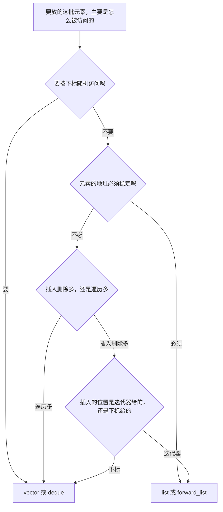

# 链式存储：`list` 与 `forward_list`

> **授权**：本章节属教材文档部分，采用 [CC BY-NC-ND 4.0](../LICENSE)
> 加[附加条款](../许可附加条款.md)授权：署名、非商业、禁止演绎、不允许二次分发。
> 文中引用的代码不受此限，各自保留原有许可证，详见[版权与许可说明.md](../版权与许可说明.md)。

连续存储有两笔硬账，都来自同一个前提：**元素必须待在一整块内存里**。
第一笔是在中间插入或删除——为了保持「一个挨一个」，插入点之后的元素全部要挪一格；
第二笔是容量不够——必须另找一块更大的内存，把元素全部搬过去，搬完地址全变。
上一章把这些代价量了出来：一百万个元素逐个插到头部，`vector` 花了 34742.979 ms；
十万个元素插在中间，花了 111.584 ms。

链式存储做的事只有一件：**放弃「一整块」这个前提。**
每个元素单独占一小块内存，块里除了数据还记着「下一个在哪」。
插入时不必挪动任何元素，只要把两个指针改一下；元素一旦放进节点，
它的地址就再也不会变。代价同样清楚：想取第 `i` 个元素，只能从头一个一个跳过去；
每个元素要多付一个或两个指针；元素散落在堆上，
遍历时缓存与预取器帮不上忙——同样的遍历，`vector` 是 1.30 ms，`list` 是 38.86 ms。

这一章顺着「需求 → 模型 → 接口 → 实现 → 代价」把链式存储走完：
先看它是被哪两笔账逼出来的，再看一个节点里到底有什么、节点有多大；
然后看 `list` 与 `forward_list` 的接口为什么长成这样——
为什么 `insert_after` 带 `_after`、为什么 `forward_list` 连 `size()` 都没有、
为什么 `sort` 与 `merge` 是成员函数；最后用实测把「链表赢在哪、输在哪」算清楚。

---

> **约定**：标注以行内代码单独成行——`实测数据` 表示实际执行验证过，
> 复现命令随程序给出；`文档` 表示引自标准草案或官方资料；`待确认` 表示尚未验证。
> 路径占位符（如 `<MinGW>`、`<工作区>`）的含义见《README.md》。
> 本章节的实测环境是 Windows 11 + g++ 15.2.0（MinGW-w64），
> 计时数字每次重跑都会浮动，结论与量级稳定。

# 本章节定位

| 需要先知道 | 在哪 |
|---|---|
| 指针与指针运算 | 《04-语法/08-数组、指针与引用.md》第 1.2 节 |
| 数组按下标取元素的地址公式 | 《04-语法/08-数组、指针与引用.md》第 2.1 节 |
| 对象在堆上分配、由谁释放 | 《06-更底层/01-对象在哪里：栈、堆与静态区.md》第 5 节 |
| 拷贝构造与移动构造 | 《05-类与面向对象/05-拷贝与移动.md》第 2 节 |
| RAII：节点在析构时释放 | 《05-类与面向对象/06-RAII 与资源管理.md》第 2 节 |
| 类模板与迭代器类型 | 《05-类与面向对象/11-模板.md》第 4 节 |
| 把函数或 lambda 传给算法 | 《05-类与面向对象/10-lambda 与函数对象.md》第 5 节 |
| `vector` 的容量、扩容与失效 | 《09-高阶数据结构/A-01-连续存储：array 与 vector.md》第 3 节 |

**相邻的章节**：上一章是《09-高阶数据结构/A-01-连续存储：array 与 vector.md》，
本章节与它成对——两章的数据要对照着看，取舍才看得清。
迭代器的类别与失效的一般规则集中在 `A-06`，
本章节只讲链式容器这一份：双向迭代器与前向迭代器各能做什么、不能做什么。
`A-05` 里的 `queue` 与 `stack` 会用 `deque` 而不是 `list` 作底层容器，
原因在本章节第 5 节：链表每元素要一次堆分配，而受限访问的容器最怕这个。

| 本章各节 | 讲什么 |
|---|---|
| 第 1 节 | 链式存储被哪两笔账逼出来；换个记法之后换到了什么、放弃了什么 |
| 第 2 节 | 模型：节点里有什么、节点有多大、哨兵节点、单链表与双链表的取舍 |
| 第 3 节 | 接口：两份接口的对照，`forward_list` 为什么少了那么多人人以为该有的东西 |
| 第 4 节 | 实现：插入删除为什么是常数时间，找位置为什么不是；迭代器稳定性 |
| 第 5 节 | 代价：插入、遍历、空间、分配次数四笔账的实测，以及什么时候链表才赢 |
| 第 6 节 | 怎么选：从访问模式出发的判据与三个常见误用 |

---

# 第 1 节 链式存储要解决什么

## 1.1 连续存储的两笔硬账

第一笔账：**在中间插入，后面的元素都要挪。** 十个元素插在中间，代价看不出来；
十万个元素逐个插在中间，就变成了「每次都挪一半」。

`实测数据`
`Text`

```text
== 在中间（1/2 处）插入 n 个元素，单位：毫秒 ==
         n       vector        deque         list
      1000        0.035        0.052        0.047
     10000        0.777        3.413        0.408
    100000      111.584      372.268        3.828

== 在头部插入 n 个元素，单位：毫秒 ==
         n       vector        deque         list vector+reverse
      1000        0.031        0.002        0.072        0.007
     10000        1.334        0.030        0.569        0.070
    100000      250.982        0.248        3.998        0.328
   1000000    34742.979        1.949       41.435        1.957
```

（完整的程序见第 5.1 小节，这里先看结论。）

规律很清楚：`vector` 的耗时随 `n` 迅速膨胀——中间插入从 0.035 ms 涨到 111.584 ms，
头部插入从 0.031 ms 涨到 34742.979 ms，后者是「每次都挪掉整个数组」的必然结果。
`list` 那一列则始终平稳：十万次插入 3.998 ms，一百万次 41.435 ms，大致是十倍元素、十倍时间。

第二笔账：**扩容要搬家。** 上一章量过：放十万个元素，不 `reserve` 时 `vector`
一共做了 18 次堆分配、把元素搬了 231071 次，而且每次搬家都换一块内存地址。

这两笔账的根源是同一个：**元素必须挤在一块连续的、地址可计算的缓冲区里。**
只要放弃这个前提，两笔账就同时消失了。

## 1.2 换个记法

链式存储的记法是这样：**每个元素单独占一块内存，块里存着下一个元素在哪。**

`Text`

```text
  ┌───────────┐     ┌───────────┐     ┌───────────┐
  │ 7 │下一个 ┼────►│ 1 │下一个 ┼────►│ 9 │下一个 ┼────► 空
  └───────────┘     └───────────┘     └───────────┘
    一块一块向系统要，位置互不相邻
```

这样一来，「在 7 与 1 之间插入一个 5」要做的事只有一件：**改两个指针。**

`Text`

```text
  插入前：  ──►┌───────────┐     ┌───────────┐
               │ 7 │下一个 ┼────►│ 1 │下一个 ┼──►
               └───────────┘     └───────────┘

  插入后：  ──►┌───────────┐     ┌───────────┐     ┌───────────┐
               │ 7 │下一个 ┼────►│ 5 │下一个 ┼────►│ 1 │下一个 ┼──►
               └───────────┘     └───────────┘     └───────────┘
                    ▲                  ▲
                    └── 只改了这两处指针，其他节点一个字节都没动
```

**没有任何元素搬家，`7` 与 `1` 的地址也完全没变。**
这就是链式存储换来的东西：插入与删除的代价与容器里已有多少元素无关，
而且**已有元素的地址恒定**——手里拿着某个元素的指针，它可以一直有效。

## 1.3 换来了什么、放弃了什么

| | 连续存储 | 链式存储 |
|---|---|---|
| 按下标取第 `i` 个 | `O(1)`，一次乘加 | 不支持，只能从头走 `O(i)` |
| 已知位置插入删除 | `O(n)`，要挪后面的元素 | **`O(1)`，只改指针** |
| 找某个位置 | `O(1)`（下标就是位置） | `O(n)`（位置靠走） |
| 遍历一遍 | 最快（缓存与预取） | 慢一个量级（节点散落） |
| 每个元素的额外空间 | 约 0 字节 | 一个或两个指针（16 或 24 字节） |
| 分配次数 | `O(log n)` 次（扩容） | `O(n)` 次，每元素一次 |
| 元素地址是否稳定 | 扩容后全部改变 | **恒定不变** |
| 迭代器什么时候失效 | 扩容后全部失效 | 只失效被删掉的那个 |

> [!IMPORTANT]
> **注意最后两行：链式存储真正不可替代的地方是「地址稳定」，不只是「插入快」。**
> 插入快可以用「先攒后处理」绕过（第 1.1 小节的 `vector+reverse` 那一列就是），
> 但「元素不能被搬走」这个要求绕不过去：只要有人长期拿着元素的地址、
> 引用或迭代器，容器就不能在背后搬家。

---

# 第 2 节 模型：一个节点长什么样

## 2.1 节点 = 数据 + 链接

「一块内存」在链式存储里叫**节点**（node）。节点里至少有两部分：
存数据的部分，和存「相邻节点在哪」的部分。链接一个还是两个，决定了两类链表：

| | 每个节点的链接 | 能往哪走 | 典型容器 |
|---|---|---|---|
| 单链表 | 一个（后继） | 只能往后 | `std::forward_list` |
| 双链表 | 两个（前驱 + 后继） | 前后都行 | `std::list` |

## 2.2 节点有多大

节点的开销不在数据上，而在链接与对齐上。下面这份程序把同一个容器
换成不同大小的元素，量每次分配拿到多少字节。

`C++`

```cpp
/* node_shape.cpp    编译：g++ -std=c++17 -O2 node_shape.cpp -o node_shape
 * 节点式容器的单节点大小随元素类型怎么变：用替换全局 operator new 的办法量最大块。
 * 每个容器用完加 asm 屏障，防止优化器把没人读的容器整段删掉。 */
#include <array>
#include <cstdio>
#include <cstdlib>
#include <forward_list>
#include <list>
#include <new>

static long long g_max = 0;
static long long g_calls = 0;

void* operator new(std::size_t n) {
    ++g_calls;
    if (static_cast<long long>(n) > g_max) g_max = static_cast<long long>(n);
    void* p = std::malloc(n ? n : 1);
    if (!p) throw std::bad_alloc();
    return p;
}
void operator delete(void* p) noexcept { std::free(p); }
void operator delete(void* p, std::size_t) noexcept { std::free(p); }

template <class C>
static void clobber(C& c) {
    asm volatile("" : : "r"(&c) : "memory");
}

template <class T>
static void probe(const char* name) {
    {
        g_max = g_calls = 0;
        std::list<T> c;
        for (int i = 0; i < 100; ++i) c.push_back(T{});
        clobber(c);
        std::printf("  %-28s list          单节点 %2lld 字节，分配 %lld 次，sizeof(元素)=%zu\n",
                    name, g_max, g_calls, sizeof(T));
    }
    {
        g_max = g_calls = 0;
        std::forward_list<T> c;
        for (int i = 0; i < 100; ++i) c.push_front(T{});
        clobber(c);
        std::printf("  %-28s forward_list  单节点 %2lld 字节，分配 %lld 次\n",
                    name, g_max, g_calls);
    }
}

int main() {
    std::printf("== 单节点大小 vs 元素大小（每个容器插 100 个）==\n");
    probe<char>("char");
    probe<int>("int");
    probe<double>("double");
    probe<std::array<char, 16>>("array<char,16>");
    probe<std::array<char, 24>>("array<char,24>");
    return 0;
}
```

`实测数据`
`Text`

```text
== 单节点大小 vs 元素大小（每个容器插 100 个）==
  char                         list          单节点 24 字节，分配 100 次，sizeof(元素)=1
  char                         forward_list  单节点 16 字节，分配 100 次
  int                          list          单节点 24 字节，分配 100 次，sizeof(元素)=4
  int                          forward_list  单节点 16 字节，分配 100 次
  double                       list          单节点 24 字节，分配 100 次，sizeof(元素)=8
  double                       forward_list  单节点 16 字节，分配 100 次
  array<char,16>               list          单节点 32 字节，分配 100 次，sizeof(元素)=16
  array<char,16>               forward_list  单节点 24 字节，分配 100 次
  array<char,24>               list          单节点 40 字节，分配 100 次，sizeof(元素)=24
  array<char,24>               forward_list  单节点 32 字节，分配 100 次
```

**元素从 1 字节涨到 8 字节，`list` 的节点始终是 24 字节。** 这说明节点的大小
不取决于数据，而取决于链接与对齐：

| 容器 | 节点组成 | 元素 1、4、8 字节时的节点 | 元素 16 字节 | 元素 24 字节 |
|---|---|---|---|---|
| `list` | 两个指针（16 字节）+ 数据，向上对齐到 8 的倍数 | 24 | 32 | 40 |
| `forward_list` | 一个指针（8 字节）+ 数据，向上对齐到 8 的倍数 | 16 | 24 | 32 |

按这张表反推：`list<int>` 的 24 字节里，装数据的只有 4 字节，
另外 20 字节是两个指针与对齐填充；`forward_list<int>` 的 16 字节里，
数据 4 字节、指针 8 字节、填充 4 字节。**节点式容器的空间开销与数据大小无关，
它是一个固定值**——数据越小，相对开销越大。

## 2.3 哨兵节点

链表有一类边界情况很烦：在头部插入、在尾部插入、删除第一个元素、容器为空。
这些操作都要修改「谁指向第一个节点」，而**第一个节点没有前驱**，
代码里就得到处写 `if (是第一个) ... else ...`。

常见做法是加一个**哨兵节点**（sentinel）：它不存数据，
只用来让「头」与「尾」也有前驱与后继。

`Text`

```text
  带哨兵的双向循环链表（本机这套 list 的形状）：

        ┌──────────────────────────────────────────────┐
        │                                              │
        ▼                                              │
   ┌─────────┐     ┌─────────┐     ┌─────────┐     ┌─────────┐
   │  哨兵   │◄───►│  7      │◄───►│  1      │◄───►│  9      │
   │ 无数据  │     │         │     │         │     │         │
   └─────────┘     └─────────┘     └─────────┘     └─────────┘
        ▲                                              │
        └──────────────────────────────────────────────┘

   空链表时哨兵自己指向自己：

   ┌─────────┐
   │  哨兵   │──┐
   │ 无数据  │◄─┘
   └─────────┘
```

有了哨兵，「插入第一个元素」与「插入中间某个位置」变成同一件事：
都是「在前一个节点与后一个节点之间插入」，不需要特判。
**这是用一点点空间换掉一大堆边界判断的典型做法。**

## 2.4 单链表与双链表的取舍

`forward_list` 每个节点只存一个后继指针，因此比 `list` **每个节点省 8 字节**，
容器对象自己也只有 8 字节（`list` 是 24 字节）。

`实测数据`
`Text`

```text
  vector<int>               24
  forward_list<int>          8
  list<int>                 24
```

代价是：**单向链表只能往后走**。这带来一串连锁的后果，
它们直接决定了第 3 节的接口形状：

| 想做这件事 | 双链表 | 单链表 |
|---|---|---|
| 走到前一个节点 | 一步 | **做不到**，只能从头再走一遍 |
| 在已知节点**之前**插入 | 可以 | **做不到**（除非知道前驱） |
| 在已知节点**之后**插入 | 可以 | 可以 |
| 删除已知节点 | 可以 | **做不到**（要改的是前驱的指针） |
| 逆序遍历 | 可以 | 做不到 |
| 数一共有多少个 | `size()`，`O(1)` | 没有 `size()`，数一遍是 `O(n)` |

> [!NOTE]
> 一张表说清了两件事：**节点的形状决定了接口的形状。**
> 第 3 节里 `forward_list` 那些看起来别扭的接口
> （`insert_after`、`erase_after`、`before_begin`），
> 全都是「只能往后走」这一个事实推出来的。

---

# 第 3 节 接口：`list` 与 `forward_list` 给了什么

## 3.1 两份接口的对照

| 操作 | `list` | `forward_list` |
|---|---|---|
| 头部插入 / 删除 | `push_front` / `pop_front` | `push_front` / `pop_front` |
| 尾部插入 / 删除 | `push_back` / `pop_back` | **没有**（要走到底才知道尾在哪） |
| 已知位置的插入 | `insert(pos, ...)` | `insert_after(pos, ...)` |
| 已知位置的删除 | `erase(pos)` | `erase_after(pos)` |
| 「第一个元素之前」的位置 | 不需要（有 `end()` 可用作边界） | `before_begin()` |
| 元素个数 | `size()`，`O(1)` | **没有**，`std::distance` 是 `O(n)` |
| 清空 | `clear()` | `clear()` |
| 长度调整 | `resize(n)` | `resize(n)` |
| 排序 / 归并 / 去重 | `sort`、`merge`、`unique`、`remove`、`remove_if`、`reverse` | 同名成员函数 |
| 整段摘接 | `splice` | `splice_after` |
| 迭代器类别 | 双向迭代器 | 前向迭代器 |

## 3.2 `forward_list` 为什么没有 `size()`

试着调用一下，编译器会当场拦住：

`C++`

```cpp
/* err_fl_size.cpp    forward_list 没有 size()：这一份是故意编不过的 */
#include <cstdio>
#include <forward_list>
int main() {
    std::forward_list<int> f{1, 2, 3};
    std::printf("%zu\n", f.size());
    return 0;
}
```

`实测数据`
`Text`

```text
<源文件>: In function 'int main()':
<源文件>:6:28: error: 'class std::forward_list<int>' has no member named 'size'; did you mean 'resize'?
    6 |     std::printf("%zu\n", f.size());
      |                            ^~~~
      |                            resize
（编译器打印的路径已换成占位符）
```

**没有 `size()` 的后果是：想知道元素个数只能数一遍，那是 `O(n)`。**

`实测数据`
`Text`

```text
它没有 size()，要自己数一遍：std::distance = 5
```

> [!IMPORTANT]
> **这不是实现偷懒，而是「要不要为长度留一个计数器」的取舍。**
> 留计数器要多占 8 字节（每个 `forward_list` 对象都要），
> 而且会让 `splice_after` 这类整段摘接从 `O(1)` 变成 `O(n)`——
> 摘接完之后得知道搬过来了几个才知道怎么改计数器。
> 单链表的选择是：**不记长度，换取更小的对象与更纯粹的常数时间摘接。**
> 这条取舍的理由没有写进标准，属于实现层面的设计决定。

## 3.3 为什么是 `insert_after` 与 `before_begin`

单链表只能往后走，因此「在某个位置插入」这句话必须先回答一个问题：
**你手里拿的是哪个位置？**

- 如果拿的是「插入点本身」，标准库没法往前找一个节点去改它的指针；
- 如果拿的是「插入点的前一个节点」，一切就顺了：改它的后继、改新节点的后继。

于是接口围绕「前一个位置」设计：`insert_after(pos, ...)`、
`erase_after(pos)`、`splice_after(pos, ...)`。
而「在头部插入」需要的位置是「第一个元素之前」，`begin()` 给不出来，
所以另外给了一个 `before_begin()`。

`C++`

```cpp
/* forward_list_interface.cpp
 * 编译：g++ -std=c++17 -O2 forward_list_interface.cpp -o forward_list_interface
 * forward_list 的接口与 list 的差别：只有 insert_after/erase_after，没有 size() */
#include <cstdio>
#include <forward_list>
#include <iterator>

int main() {
    std::forward_list<int> f{1, 3, 5};

    auto before = f.before_begin();      // 「第一个元素之前」的位置
    f.insert_after(before, 0);           // 想在头部插入，就得用这个位置
    auto it = f.begin();
    ++it;                                 // 现在指向 1
    f.insert_after(it, 2);                // 在 1 后面插入 2

    std::printf("内容：");
    for (int x : f) std::printf(" %d", x);
    std::printf("\n");

    std::printf("它没有 size()，要自己数一遍：std::distance = %ld\n",
                static_cast<long>(std::distance(f.begin(), f.end())));

    f.erase_after(f.begin());             // 删掉第二个元素
    std::printf("erase_after(begin()) 之后：");
    for (int x : f) std::printf(" %d", x);
    std::printf("\n");
    return 0;
}
```

`实测数据`
`Text`

```text
内容： 0 1 2 3 5
它没有 size()，要自己数一遍：std::distance = 5
erase_after(begin()) 之后： 0 2 3 5
```

**注意 `erase_after(f.begin())` 删掉的是第二个元素（`1`），不是第一个。**
`_after` 这个后缀时刻提醒着：手里拿的位置不是被操作的那个元素。

## 3.4 容器自带的算法

`list` 与 `forward_list` 都带了一批成员函数：`sort`、`merge`、`unique`、
`remove`、`remove_if`、`reverse`、`splice`。**为什么这些不是通用的自由函数？**

因为通用的那些用不了。以 `std::sort` 为例：它需要随机访问迭代器
（要能算中点、要能跳着走），而链表的迭代器只能一步一步挪。

`C++`

```cpp
/* err_sort_list.cpp  通用 std::sort 用不了 list：这一份是故意编不过的 */
#include <algorithm>
#include <list>
int main() {
    std::list<int> l{3, 1, 2};
    std::sort(l.begin(), l.end());
    return 0;
}
```

`实测数据`
`Text`

```text
<MinGW>/include/c++/bits/stl_algo.h: In instantiation of 'void std::__sort(_RandomAccessIterator, _RandomAccessIterator, _Compare)
  [with _RandomAccessIterator = _List_iterator<int>]':
<源文件>:6:14:   required from here
    6 |     std::sort(l.begin(), l.end());
      |     ~~~~~~~~~^~~~~~~~~~~~~~~~~~~~
<MinGW>/include/c++/bits/stl_algo.h:1907:50: error: no match for 'operator-' (operand types are 'std::_List_iterator<int>' and 'std::_List_iterator<int>')
（省略了中间若干行候选函数说明；编译器打印的路径已换成占位符）
```

**报错的要害是 `no match for 'operator-'`**：链表迭代器之间不能相减，
而 `std::sort` 内部要靠相减算距离、取中点。链表的成员 `sort` 换了一种做法——
**只改指针，不搬数据**，因此对它来说「排序」与「重排节点」是一回事。

`C++`

```cpp
/* list_algorithms.cpp
 * 编译：g++ -std=c++17 -O2 list_algorithms.cpp -o list_algorithms
 * 链式容器自带的算法：sort、unique、remove_if、reverse、merge 都是成员函数 */
#include <cstdio>
#include <list>

int main() {
    std::list<int> l{5, 1, 4, 1, 3, 5};

    l.sort();                              // 成员 sort：不搬元素，只改指针
    std::printf("sort 之后：        ");
    for (int x : l) std::printf(" %d", x);
    std::printf("\n");

    l.unique();                            // 只去掉相邻的重复值
    std::printf("unique 之后：      ");
    for (int x : l) std::printf(" %d", x);
    std::printf("\n");

    l.remove_if([](int x) { return x % 2 == 0; });
    std::printf("去掉偶数之后：     ");
    for (int x : l) std::printf(" %d", x);
    std::printf("\n");

    l.reverse();
    std::printf("reverse 之后：     ");
    for (int x : l) std::printf(" %d", x);
    std::printf("\n");

    std::list<int> a{9, 10};
    std::list<int> b{7, 8};
    a.merge(b);                            // 归并两条有序链表，b 被清空
    std::printf("merge 之后 a：     ");
    for (int x : a) std::printf(" %d", x);
    std::printf("（b.size() = %zu）\n", b.size());
    return 0;
}
```

`实测数据`
`Text`

```text
sort 之后：         1 1 3 4 5 5
unique 之后：       1 3 4 5
去掉偶数之后：      1 3 5
reverse 之后：      5 3 1
merge 之后 a：      7 8 9 10（b.size() = 0）
```

三条容易踩空的地方：

- **`unique` 只去相邻的重复值。** 例子里先 `sort` 再 `unique`，
  所以 `1 1` 与 `5 5` 都被去掉了；如果原序列是 `1 5 1`，`unique` 一个也去不掉。
- **`merge` 会清空来源。** 归并之后 `b` 变成空链表（`b.size() = 0`），
  元素没有复制，节点被摘接到了 `a` 上；两个链表都必须已经有序，否则结果没有意义。
- **`remove_if` 的谓词对每个元素调用一次**，返回 `true` 就删掉。
  它与 `erase(std::remove(...))` 那种写法不同，**不需要额外的算法配合**。

> [!TIP]
> **几种排序策略（归并、快排、堆排、插入）各自的适用场合不在本章节**，
> 见 `【待补：08-一些散落的算法/】`。
> 这里只需记住一件事：**链表有自己的 `sort`，不要往链表上套通用排序算法**——
> 编不过，而且即使编过了也不会更快。

## 3.5 `splice`：一步摘接

链式存储最独特的能力是**把一整段节点从一个容器摘到另一个容器，一个元素都不搬**。
`list` 的 `splice` 与 `forward_list` 的 `splice_after` 做的就是这个。

`C++`

```cpp
/* splice_cost.cpp
 * 编译：g++ -std=c++17 -O2 splice_cost.cpp -o splice_cost
 * splice 是常数时间的摘接：把一条链整段接到另一条上，元素一个也不搬 */
#include <chrono>
#include <cstdio>
#include <iterator>
#include <list>

static double ms(std::chrono::steady_clock::time_point a,
                 std::chrono::steady_clock::time_point b) {
    return std::chrono::duration<double, std::milli>(b - a).count();
}

static void fill(std::list<int>& l, int n) {
    for (int i = 0; i < n; ++i) l.push_back(i);
}

int main() {
    constexpr int N = 100000;

    {
        std::list<int> a, b;
        fill(a, 1);
        fill(b, 1);
        const auto t0 = std::chrono::steady_clock::now();
        a.splice(a.end(), b);                       // 接 1 个元素
        const auto t1 = std::chrono::steady_clock::now();
        std::printf("splice 接 1 个元素：      %.6f ms（a=%zu b=%zu）\n",
                    ms(t0, t1), a.size(), b.size());
    }
    {
        std::list<int> a, b;
        fill(a, 1);
        fill(b, N);
        const auto t0 = std::chrono::steady_clock::now();
        a.splice(a.end(), b);                       // 接 10 万个元素
        const auto t1 = std::chrono::steady_clock::now();
        std::printf("splice 接 10 万个元素：   %.6f ms（a=%zu b=%zu）\n",
                    ms(t0, t1), a.size(), b.size());
    }
    {
        std::list<int> a, b;
        fill(a, 1);
        fill(b, N);
        const auto t0 = std::chrono::steady_clock::now();
        a.insert(a.end(), b.begin(), b.end());      // 同样效果，但逐个复制
        const auto t1 = std::chrono::steady_clock::now();
        std::printf("insert 复制 10 万个元素： %.3f ms（a=%zu b=%zu）\n",
                    ms(t0, t1), a.size(), b.size());
    }
    {
        std::list<int> a, b;
        fill(a, 3);
        fill(b, 3);
        const int* before = &b.front();
        a.splice(a.end(), b);                       // b 的元素整段搬进 a
        const int* after = &*std::next(a.begin(), 3);
        std::printf("splice 前 b 首元素在 %p，splice 后它还在 %p，地址没变=%d\n",
                    static_cast<const void*>(before), static_cast<const void*>(after),
                    before == after);
    }
    return 0;
}
```

`实测数据`
`Text`

```text
splice 接 1 个元素：      0.001000 ms（a=2 b=0）
splice 接 10 万个元素：   0.000000 ms（a=100001 b=0）
insert 复制 10 万个元素： 3.076 ms（a=100001 b=100000）
splice 前 b 首元素在 000002ec907c2c00，splice 后它还在 000002ec907c2c00，地址没变=1
```

**接 1 个元素用了 0.001 ms，接 10 万个元素的耗时低于时钟的分辨率。**
同样是「把 10 万个元素并到一起」，逐个 `insert` 复制要 3.076 ms，
`splice` 一步完成，而且最后一个元素与第一个元素的地址完全没变——
搬的只是链上的几个指针。

> [!IMPORTANT]
> **`splice` 与 `insert` 的区别不是快慢，是语义：`insert` 复制元素，`splice` 移动节点。**
> 复制之后两份数据各自独立，改一个不影响另一个；
> 摘接之后元素只在一个容器里，来源容器空了。
> 需要「把一批元素交给另一个容器保管」时，`splice` 是唯一不付搬运代价的做法。

---

# 第 4 节 实现：插入删除为什么是常数时间

## 4.1 插入：改两个指针

在双链表里，往 `p` 与 `q` 之间插入新节点 `n`，要改四处指针：

`Text`

```text
   插入前： ──►┌─────────┐          ┌─────────┐
               │    p    ┼─────────►│    q    │
               └─────────┘          └─────────┘

   插入后： ──►┌─────────┐          ┌─────────┐          ┌─────────┐
               │    p    ┼─────────►│    n    ┼─────────►│    q    │
               └─────────┘          └─────────┘          └─────────┘

   改动的四处：p 的后继、n 的前驱、n 的后继、q 的前驱
```

**改四处指针，与容器里有多少元素无关**，因此是 `O(1)`。
新节点自己还要一次内存分配，那也是常数时间。单链表少两处（没有前驱指针），
但前提是手里的位置必须是「插入点的前一个」。

## 4.2 删除：改指针加一次释放

删除一个节点做两件事：把它的前驱与后继接上，然后把这块内存还给分配器。
同样是常数时间。**注意被删节点的地址不会被复用给别的元素**
（分配器可能把它拿去满足后面的分配请求），因此指向被删元素的指针、
引用、迭代器立刻失效——这一点与连续存储不同：
连续存储是「一大片一起作废」，链式存储是「精确地作废一个」。

## 4.3 找位置才是贵的

`O(1)` 的插入有一个前提：**位置已经在你手里。**
如果位置要靠「第 `k` 个」来指定，链式存储只能从头一步一步走过去，
那一步是 `O(k)`。

`C++`

```cpp
/* advance_cost.cpp
 * 编译：g++ -std=c++17 -O2 advance_cost.cpp -o advance_cost
 * 同一句「往前走 n 步」在两种容器上的代价 */
#include <chrono>
#include <cstdio>
#include <iterator>
#include <list>
#include <vector>

int main() {
    constexpr int N = 1000000;
    std::list<int> l(N, 1);
    std::vector<int> v(N, 1);

    const auto t0 = std::chrono::steady_clock::now();
    long long a = 0;
    for (int r = 0; r < 10; ++r) {
        auto it = l.begin();
        std::advance(it, N - 1);          // 链表：一步一步跳
        a += *it;
    }
    const auto t1 = std::chrono::steady_clock::now();

    long long b = 0;
    for (int r = 0; r < 100000; ++r) {
        auto it = v.begin();
        std::advance(it, N - 1);          // 连续存储：一次加法
        b += *it;
    }
    const auto t2 = std::chrono::steady_clock::now();

    auto ms = [](auto x, auto y) {
        return std::chrono::duration<double, std::milli>(y - x).count();
    };
    std::printf("100 万元素，走 999999 步：\n");
    std::printf("  list   10 次：      %10.3f ms（每次 %.3f ms）\n",
                ms(t0, t1), ms(t0, t1) / 10);
    std::printf("  vector 100000 次：  %10.3f ms（每次 %.6f ms）\n",
                ms(t1, t2), ms(t1, t2) / 100000);
    std::printf("（a=%lld b=%lld）\n", a, b);
    return 0;
}
```

`实测数据`
`Text`

```text
100 万元素，走 999999 步：
  list   10 次：          45.279 ms（每次 4.528 ms）
  vector 100000 次：       0.000 ms（每次 0.000000 ms）
（a=10 b=100000）
```

**链表走一百万步要 4.528 ms，连续存储走一百万步低于时钟分辨率。**
同一个 `std::advance`、同一个目标位置，一个是一次加法，一个是近百万次内存跳转。
把两边的次数放在一起看更直观：链表只做了 10 次，用的是它 10 次的耗时；
连续存储做了 100000 次，总耗时仍是 0.000 ms。

> [!WARNING]
> **`std::distance` 在链式容器上是 `O(n)`，但它常常会被优化掉。**
> 《09-高阶数据结构/A-00-导读：数据结构是问题的形状.md》第 3.3 小节量到过：
> 在循环里对 `list` 调用 `std::distance` 一百次，耗时量出来是 0.000 ms——
> 容器没变、`list` 又记着元素个数，这个调用被整体换掉了。
> 想拿它当「链表查找有多贵」的证据会得到假数据；`advance` 的目标位置依赖运行期，
> 换不掉，因此上表用的是 `advance`。

## 4.4 迭代器稳定性

链式存储与连续存储最本质的差别，是插入之后手里的迭代器还能不能用。

`C++`

```cpp
/* iterator_stability.cpp
 * 编译：g++ -std=c++17 -O2 iterator_stability.cpp -o iterator_stability
 * 结构变化之后，手里的迭代器还有效吗：list 与 vector 的对照 */
#include <cstdio>
#include <iterator>
#include <list>
#include <vector>

int main() {
    {
        std::list<int> l{1, 2, 3};
        auto it = std::next(l.begin());          // 指向 2
        const int* before = &*it;
        l.push_front(0);                         // 在头部插入
        l.push_back(4);                          // 在尾部插入
        std::printf("list  ：两边各插一个后，*it 仍是 %d，地址 %p -> %p，相同=%d\n",
                    *it, static_cast<const void*>(before),
                    static_cast<const void*>(&*it), before == &*it);
    }
    {
        std::vector<int> v{1, 2, 3};
        const int* before = v.data();
        std::printf("vector：扩容前 data()=%p capacity=%zu\n",
                    static_cast<const void*>(before), v.capacity());
        while (v.capacity() < 100) v.push_back(0);
        std::printf("        扩容后 data()=%p capacity=%zu，缓冲区换了=%d\n",
                    static_cast<const void*>(v.data()), v.capacity(), v.data() != before);
    }
    {
        std::list<int> l{1, 2, 3};
        auto it = std::next(l.begin());          // 指向 2
        const int* before = &*it;
        l.erase(l.begin());                      // 删掉 1，it 指向的元素没动
        std::printf("list  ：删掉别的元素后，*it 仍是 %d，地址相同=%d\n",
                    *it, before == &*it);
    }
    return 0;
}
```

`实测数据`
`Text`

```text
list  ：两边各插一个后，*it 仍是 2，地址 0000019442ee2690 -> 0000019442ee2690，相同=1
vector：扩容前 data()=0000019442ee2660 capacity=3
        扩容后 data()=00000194432470a0 capacity=192，缓冲区换了=1
list  ：删掉别的元素后，*it 仍是 2，地址相同=1
```

| 容器 | 插入后已有迭代器 | 删除后已有迭代器 |
|---|---|---|
| `list` / `forward_list` | **全部有效**（元素一个也没搬） | 只有被删那个失效 |
| `vector` | 扩容则全部失效；不扩容则插入点之前的有效 | 删除点及之后的失效 |

> [!IMPORTANT]
> **「插入会不会让迭代器失效」决定了很多代码能不能写。**
> 拿着一个 `list` 的迭代器反复插入是安全的；
> 同样的代码换成 `vector`，只要中途扩容一次，手里的迭代器就全部作废
> （失效规则的原文见《09-高阶数据结构/A-01-连续存储：array 与 vector.md》第 3.9 小节）。
> 这也解释了为什么「边遍历边删除」这类逻辑在链表上写起来最省心。

---

# 第 5 节 代价：输在哪、赢在哪

## 5.1 插入的规模效应

`C++`

```cpp
/* insert_cost.cpp    编译：g++ -std=c++17 -O2 insert_cost.cpp -o insert_cost
 * 头部/中间/尾部插入的规模效应：什么规模上链表才追得上 vector */
#include <algorithm>
#include <chrono>
#include <cstdio>
#include <deque>
#include <list>
#include <vector>

template <class F>
static double time_ms(F&& f) {
    const auto t0 = std::chrono::steady_clock::now();
    f();
    const auto t1 = std::chrono::steady_clock::now();
    return std::chrono::duration<double, std::milli>(t1 - t0).count();
}

int main() {
    std::printf("== 在头部插入 n 个元素，单位：毫秒 ==\n");
    std::printf("%10s %12s %12s %12s %12s\n", "n", "vector", "deque", "list", "vector+reverse");
    for (int n : {1000, 10000, 100000, 1000000}) {
        const double tv = time_ms([&] {
            std::vector<int> c;
            for (int i = 0; i < n; ++i) c.insert(c.begin(), i);
        });
        const double td = time_ms([&] {
            std::deque<int> c;
            for (int i = 0; i < n; ++i) c.push_front(i);
        });
        const double tl = time_ms([&] {
            std::list<int> c;
            for (int i = 0; i < n; ++i) c.push_front(i);
        });
        const double tr = time_ms([&] {
            std::vector<int> c;
            for (int i = 0; i < n; ++i) c.push_back(i);
            std::reverse(c.begin(), c.end());
        });
        std::printf("%10d %12.3f %12.3f %12.3f %12.3f\n", n, tv, td, tl, tr);
    }

    std::printf("\n== 在中间（1/2 处）插入 n 个元素，单位：毫秒 ==\n");
    std::printf("%10s %12s %12s %12s\n", "n", "vector", "deque", "list");
    for (int n : {1000, 10000, 100000}) {
        const double tv = time_ms([&] {
            std::vector<int> c;
            for (int i = 0; i < n; ++i) c.insert(c.begin() + c.size() / 2, i);
        });
        const double td = time_ms([&] {
            std::deque<int> c;
            for (int i = 0; i < n; ++i) c.insert(c.begin() + c.size() / 2, i);
        });
        const double tl = time_ms([&] {
            std::list<int> c;
            auto it = c.begin();                    // 链表插入不会让迭代器失效，
            for (int i = 0; i < n; ++i) {           // 因此可以一直拿着同一个「中间」位置
                const bool odd = (i % 2 != 0);
                if (odd && it != c.begin()) --it;
                c.insert(it, i);
            }
        });
        std::printf("%10d %12.3f %12.3f %12.3f\n", n, tv, td, tl);
    }
    return 0;
}
```

`实测数据`
`Text`

```text
== 在头部插入 n 个元素，单位：毫秒 ==
         n       vector        deque         list vector+reverse
      1000        0.031        0.002        0.072        0.007
     10000        1.334        0.030        0.569        0.070
    100000      250.982        0.248        3.998        0.328
   1000000    34742.979        1.949       41.435        1.957

== 在中间（1/2 处）插入 n 个元素，单位：毫秒 ==
         n       vector        deque         list
      1000        0.035        0.052        0.047
     10000        0.777        3.413        0.408
    100000      111.584      372.268        3.828
```

三件事值得逐个说清。

**第一，链表的耗时随规模线性增长，`vector` 是平方级。**
头部插入从 1000 到 1000000，规模涨一千倍：`list` 从 0.072 涨到 41.435 ms（约 580 倍），
`vector` 从 0.031 涨到 34742.979 ms（约 112 万倍）。
`vector` 的 34742.979 ms 不是笔误：每一次 `insert(begin())` 都要把当时已有的全部元素整体后移一格，
一百万次插入累计搬动约五千亿次元素，折合约 2 TB 的内存流量；
这块数据只有 4 MB，能放进缓存，因此三十多秒这个量级是对得上的。

**第二，`list` 也不总是最快的。**
头部插入在 100 万这一档，`list` 用了 41.435 ms，而「`vector` 先追加再反转」只用了 1.957 ms，
**比链表快 21 倍**。原因是链表每插入一个元素都要一次堆分配，
一百万次分配本身就比「一百万次连续写入加一次反转」贵。
链表赢的是「插入不搬元素」，但它自己带了一笔固定的分配开销。

**第三，`deque` 在两端插入上比两者都快。**
`push_front` 十万次只要 0.248 ms，因为它是「分段连续」的：
每一段内部是连续内存，段与段之间用一张表索引，两头都能 `O(1)` 地扩。
中间插入时它反而最慢（372.268 ms），因为要决定往哪一头挪得少，判断与挪动的常数都更大。

> [!IMPORTANT]
> **「链表插入是 `O(1)`，所以插入多就该用链表」这条推理缺了一半。**
> `O(1)` 说的是「改指针」那一步；每插入一个元素还有一次堆分配，
> 而堆分配是一个常数不小的操作。**规模小的时候，这笔固定开销反而占主导。**

## 5.2 遍历与缓存

链式存储真正的短板在遍历上。同一份数据、同样的求和，两种容器差一个量级。

`C++`

```cpp
/* walk_and_grow.cpp    编译：g++ -std=c++17 -O2 walk_and_grow.cpp -o walk_and_grow
 * 观察各顺序容器的容量增长与分配次数 */
#include <chrono>
#include <cstdio>
#include <deque>
#include <forward_list>
#include <list>
#include <vector>

int main() {
    // 1. vector 的 capacity 序列
    std::printf("== vector<int> push_back 的 capacity 变化（每次增长时打印）==\n");
    std::vector<int> v;
    std::size_t last = 0;
    for (int i = 0; i < 40; ++i) {
        v.push_back(i);
        if (v.capacity() != last) {
            std::printf("size=%2zu capacity=%3zu  倍数=%.3f  数据地址=%p\n",
                        v.size(), v.capacity(),
                        last ? double(v.capacity()) / double(last) : 0.0,
                        static_cast<const void*>(v.data()));
            last = v.capacity();
        }
    }

    // 2. 同样数量元素，三种容器的分配次数（用全局 new 计数，见第 5.3 小节）
    std::printf("\n== 100 万个 int 的容器对象自身大小与遍历一次耗时 ==\n");
    constexpr int N = 1000000;
    std::vector<int> vec(N, 1);
    std::deque<int> deq(N, 1);
    std::list<int> lst(N, 1);
    std::forward_list<int> fl(N, 1);

    std::printf("sizeof(vector<int>)=%zu\n", sizeof(vec));
    std::printf("sizeof(deque<int>)=%zu\n", sizeof(deq));
    std::printf("sizeof(list<int>)=%zu\n", sizeof(lst));
    std::printf("sizeof(forward_list<int>)=%zu\n", sizeof(fl));

    auto bench = [](const char* name, auto&& sum_fn) {
        volatile long long acc = 0;
        const auto t0 = std::chrono::steady_clock::now();
        for (int r = 0; r < 10; ++r) acc += sum_fn();
        const auto t1 = std::chrono::steady_clock::now();
        const double ms = std::chrono::duration<double, std::milli>(t1 - t0).count();
        std::printf("%-14s 10 轮求和 %8.2f ms  （acc=%lld）\n", name, ms,
                    static_cast<long long>(acc));
    };
    bench("vector", [&] { long long s = 0; for (int x : vec) s += x; return s; });
    bench("deque", [&] { long long s = 0; for (int x : deq) s += x; return s; });
    bench("list", [&] { long long s = 0; for (int x : lst) s += x; return s; });
    bench("forward_list", [&] { long long s = 0; for (int x : fl) s += x; return s; });
    return 0;
}
```

`实测数据`
`Text`

```text
== vector<int> push_back 的 capacity 变化（每次增长时打印）==
size= 1 capacity=  1  倍数=0.000  数据地址=000001ce25eb2640
size= 2 capacity=  2  倍数=2.000  数据地址=000001ce25eb2660
size= 3 capacity=  4  倍数=2.000  数据地址=000001ce25eb2640
size= 5 capacity=  8  倍数=2.000  数据地址=000001ce25eb2660
size= 9 capacity= 16  倍数=2.000  数据地址=000001ce25eb2690
size=17 capacity= 32  倍数=2.000  数据地址=000001ce25eb26e0
size=33 capacity= 64  倍数=2.000  数据地址=000001ce25eb2770

== 100 万个 int 的容器对象自身大小与遍历一次耗时 ==
sizeof(vector<int>)=24
sizeof(deque<int>)=80
sizeof(list<int>)=24
sizeof(forward_list<int>)=8
vector         10 轮求和     1.30 ms  （acc=10000000）
deque          10 轮求和     2.76 ms  （acc=10000000）
list           10 轮求和    38.86 ms  （acc=10000000）
forward_list   10 轮求和    45.83 ms  （acc=10000000）
```

**一百万个 `int`，十轮求和：`vector` 1.30 ms，`list` 38.86 ms，相差约 30 倍。**
两边的算法完全一样（都是从头到尾加一遍），差别全在内存布局上：
`vector` 的元素挤在一起，一次缓存行填充能带进十几个元素，硬件预取器还能提前把后面的行取来；
`list` 的每个节点散落在堆上，访问下一个要先从当前节点读出地址、再去那块内存取数据，
**预取器无从下手，每次都可能等一次内存**。

`实测数据`
`Text`

```text
   元素数    字节数 vector ns/元素 list ns/元素       倍数
        1000         3 KB          0.197          1.400        7.10x
       10000        39 KB          0.194          2.000       10.29x
      100000       390 KB          0.196          2.318       11.82x
      1000000      3906 KB          0.191          3.841       20.07x
     10000000     39062 KB          0.380          5.332       14.02x
```

（每元素纳秒数来自《09-高阶数据结构/A-01-连续存储：array 与 vector.md》第 4.4 小节的程序。）

**这一次的数据说明了差距是怎么来的**：连续存储的每元素耗时几乎不随规模变化，
一直到 39 MB 才升到 0.380 ns；链式存储则从 1.400 ns 一路涨到 5.332 ns，
因为数据越大，节点越不可能留在缓存里。
（同一份程序重跑，两列都会随机器负载浮动，幅度见《09-高阶数据结构/A-01-连续存储：array 与 vector.md》附录 A。）

> [!IMPORTANT]
> **链表在遍历上输掉的倍数（7 到 30 倍）比它在插入上赢回来的倍数更稳定。**
> 插入的胜负取决于规模与元素大小（第 5.1 小节里链表有时还输给 `vector`），
> 而遍历的胜负几乎与规模无关。**只要代码里有一次「完整走一遍」，这笔账就要算进去。**

## 5.3 空间与分配次数

| 放十万个 `int` | 分配次数 | 每元素堆字节 |
|---|---|---|
| `vector<int>`（先 `reserve`） | 1 | 4.00 |
| `vector<int>`（不 `reserve`） | 18 | 10.49 |
| `forward_list<int>` | 100000 | 16.00 |
| `list<int>` | **100000** | 24.00 |

（程序与完整输出见《09-高阶数据结构/A-01-连续存储：array 与 vector.md》第 4.1 小节。）

**链式存储每放一个元素就要一次堆分配**，十万个元素十万次。
一次分配的成本不止是那几十个字节：分配器要在自己的空闲表里找块、
可能切分、要更新记账信息，释放时还要合并相邻空块。
这些动作都是常数时间，但常数不小，而且**次数与元素个数是 1:1，没有摊还可言**。

`实测数据`
`Text`

```text
list，没人读                               分配 1000 次，共    24000 字节
forward_list，没人读                       分配 1000 次，共    16000 字节
vector，没人读                             分配   11 次，共     8188 字节
vector(N,1)，没人读                        分配    1 次，共     4000 字节
list，读一下 size()                        分配 1000 次，共    24000 字节（读了 size）
list，读一下 front()                       分配 1000 次，共    24000 字节（读了 front）
list，加 asm 屏障                          分配 1000 次，共    24000 字节
forward_list，加 asm 屏障                  分配 1000 次，共    16000 字节
```

（这八个变体在 `-O2` 与 `-O0` 下的输出完全一致。）

这里还要说明一件事：**用替换 `operator new` 计数时，容器不会因为「没人读」而被删掉**
（在 `-O2` 与 `-O0` 下分配次数完全一致），因为 `operator new` 是可替换函数，
编译器不能假设调用它没有副作用。真正会被删掉的是没人读的计算结果
（见《09-高阶数据结构/A-00-导读：数据结构是问题的形状.md》第 3.3 小节）。
本小节的计数程序仍然加了 `asm` 屏障，属于稳妥做法。

**碎片是另一笔隐性成本。** 每个节点都是一次独立分配，
释放时也是一块一块还回去；长时间反复增删之后，
堆里会留下大量「不大不小、正好放不下别的东西」的空洞。
连续存储的一次大分配没有这个问题——它要么整块在用，要么整块还回去。
分配器的细节见 `A-13`。

## 5.4 什么时候链表才赢

把上面的账合起来，链表赢的场合有三个条件，缺一个就要重新算：

| 条件 | 为什么 |
|---|---|
| **位置已经在手里**（迭代器或指针，而不是下标） | 否则找位置那一步就是 `O(n)`，省下的插入代价全赔进去 |
| **插入删除的次数远多于遍历的次数** | 一次遍历的代价是插入的十几到几十倍（第 5.2 小节） |
| **或者：元素的地址必须稳定** | 这一条链表是唯一选择，与快慢无关 |

反过来说，下面这些场合**不要**用链表：

| 场合 | 该用什么 | 理由 |
|---|---|---|
| 按下标随机访问 | `vector` / `deque` | 链表没有随机访问 |
| 主要在尾部追加 | `vector` | `push_back` 摊还 `O(1)`，没有分配开销 |
| 要在两端进出 | `deque` | 每元素不单独分配，两端都是 `O(1)` |
| 要排序、要查找 | `vector` + 通用算法 | 连续内存上的算法快得多，还没有分配开销 |
| 元素很小（`int`、`char`） | `vector` | 24 字节的节点里只装 4 字节数据，开销是数据的五倍 |
| 只是「想少搬元素」 | `vector` + 先攒后处理 | 第 5.1 小节的 `vector+reverse` 那一列 |

---

# 第 6 节 怎么选

## 6.1 一条决策路径

`Mermaid`



**这张图的顺序是有讲究的**：先问「随机访问」，再问「地址稳定」，
最后才问「插入与遍历谁多」。
前两个问题是硬性条件，答错了代码根本写不出来；
第三个问题才是性能取舍，答错了只是慢一些。

## 6.2 三个常见误用

**误用一：用 `list` 当「默认容器」。**
看到「链表插入是 `O(1)`」就把它当通用容器，结果是遍历、查找、排序全部变慢，
每元素还多付 20 字节与一次分配。**默认容器是 `std::vector`**，
只有在第 5.4 小节的三个条件满足时才考虑链表。

**误用二：用 `list` 存小对象。**
`list<int>` 每个元素占 24 字节，其中数据只占 4 字节。
要存一百万个 `int`，节点本身要 24 MB，而 `vector<int>` 只要 4 MB。
**元素越小，链表的相对开销越大。**

**误用三：在链表上按下标操作。**
`std::next(l.begin(), k)` 是 `O(k)`；在循环里对每一项都做一次，
整体就成了 `O(n²)`。要按下标访问，就该换容器；
确实要用链表又需要频繁按下标取，得另外维护一张位置表。

> [!NOTE]
> 链式存储这一章收成三句话：
> **它的形状是「一个元素一块内存加一个链接」，因此已知位置的插入删除是 `O(1)`、元素地址恒定；
> 它的代价是随机访问变成 `O(n)`、每元素多付一个或两个指针、每元素一次堆分配、遍历慢一个量级；
> 只有在「位置已在手里、插入远多于遍历、或者地址必须稳定」这三条同时成立时，它才是更好的选择。**

---

# 术语表

| 术语 | 含义 |
|---|---|
| **节点** | 链式存储里的一块内存，存着数据与一个或多个指向相邻节点的链接 |
| **哨兵节点** | 不存数据、只用来消除边界判断的节点；双向循环链表常有一个 |
| **单链表** | 每个节点只有一个后继指针，只能往后走 |
| **双链表** | 每个节点有前驱与后继两个指针，前后都能走 |
| **前向迭代器** | 只能 `++`、不能 `--`、不能跳步的迭代器；`forward_list` 提供它 |
| **双向迭代器** | 能 `++` 也能 `--`，但不能跳步；`list`、`map`、`set` 提供它 |
| **随机访问迭代器** | 能 `+ n`、能相减，代价是常数时间；`vector`、`deque` 提供它 |
| **摘接** | 只改指针把一整段节点从一个容器移到另一个，元素不复制；`splice` 做的就是这个 |
| **分配次数** | 一段代码向堆申请内存的次数；节点式容器的分配次数与元素个数同阶 |
| **碎片** | 反复分配与释放之后堆里留下的小块空洞；节点式容器更容易造成它 |

# 附录 A 复现本章节实测

**环境**：Windows 11，g++ 15.2.0（MinGW-w64）。
所有程序的编译命令均为 `g++ -std=c++17 -O2 <源文件> -o <可执行文件>`，
程序首行注释里也写了同一条命令。计时数字每次重跑都会浮动。

| 本章节的数字 | 程序 | 在哪一小节 |
|---|---|---|
| 中间与头部插入的耗时 | `insert_cost.cpp` | 第 5.1 小节 |
| 节点的实际大小 | `node_shape.cpp` | 第 2.2 小节 |
| 容器对象自身大小 | `walk_and_grow.cpp` | 第 2.4 小节 |
| `forward_list` 没有 `size()` | `err_fl_size.cpp`（**故意编不过**） | 第 3.2 小节 |
| `forward_list` 的接口 | `forward_list_interface.cpp` | 第 3.3 小节 |
| 通用 `std::sort` 用不了 `list` | `err_sort_list.cpp`（**故意编不过**） | 第 3.4 小节 |
| 容器自带的算法 | `list_algorithms.cpp` | 第 3.4 小节 |
| `splice` 的常数代价 | `splice_cost.cpp` | 第 3.5 小节 |
| 走 999999 步的代价 | `advance_cost.cpp` | 第 4.3 小节 |
| 迭代器稳定性 | `iterator_stability.cpp` | 第 4.4 小节 |
| 遍历耗时 | `walk_and_grow.cpp` | 第 5.2 小节 |
| 每元素纳秒数 | 见《09-高阶数据结构/A-01-连续存储：array 与 vector.md》第 4.4 小节 | 第 5.2 小节 |
| 每元素堆字节与分配次数 | 见《09-高阶数据结构/A-01-连续存储：array 与 vector.md》第 4.1 小节 | 第 5.3 小节 |
| 分配计数的两种写法 | 第 5.3 小节引用的两个探针（正文没有列出源码） | 第 5.3 小节 |

**几点复现说明**：

- `insert_cost.cpp` 要跑三十秒到一分钟，其中一百万次头部插入到 `vector` 那一次就占三十多秒；
- 两份「故意编不过」的程序是用来拿编译器报错的，不要把它们放进正常的构建里；
- 报错信息里被打印出来的本机路径已在正文中换成 `<源文件>` 与 `<MinGW>` 占位符，
  读者在自己机器上看到的会是各自的真实路径；
- `advance_cost.cpp` 跑完不到一秒：链表那十次一共 57.822 ms，
  连续存储那十万次低于时钟分辨率。

`待确认`

本章节的计时数据来自这一台机器（Windows 11 + g++ 15.2.0）。
「链表遍历比连续存储慢一个量级」在各规模上都成立，具体倍数随数据规模与缓存大小而变；
「链表插入什么时候比 `vector` 快」依赖元素大小、分配器实现与规模，
本机在十万元素这一档上链表仍明显占优，一百万元素的头部插入则被
「先追加再反转」反超（见第 5.1 小节）。读者应以自己机器上重跑的结果为准。
